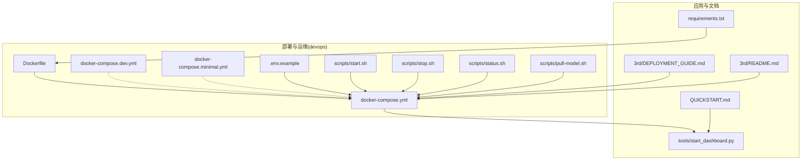
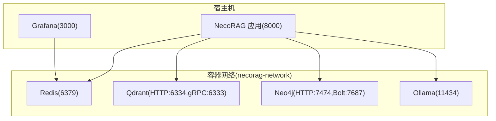
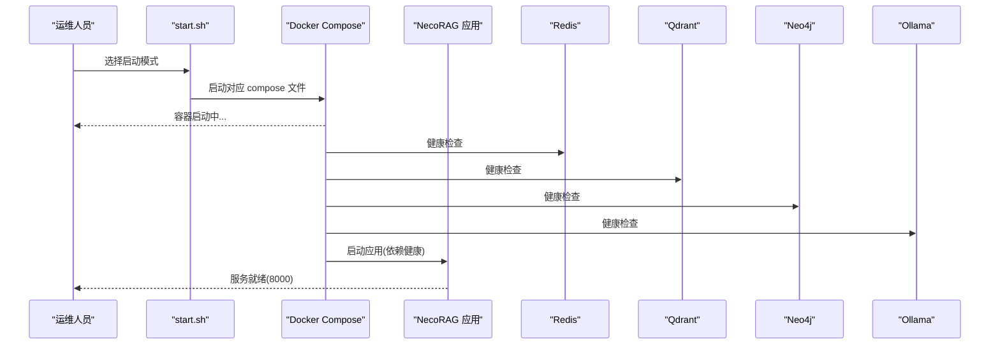
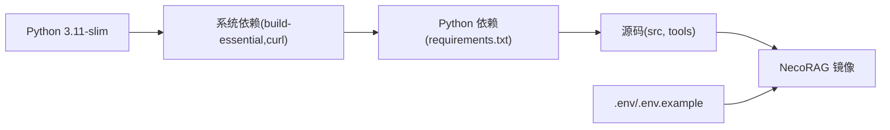

# 部署模式与最佳实践

<cite>
**本文引用的文件**   
- [Dockerfile](file://devops/Dockerfile)
- [docker-compose.yml](file://devops/docker-compose.yml)
- [docker-compose.dev.yml](file://devops/docker-compose.dev.yml)
- [docker-compose.minimal.yml](file://devops/docker-compose.minimal.yml)
- [devops/README.md](file://devops/README.md)
- [devops/scripts/start.sh](file://devops/scripts/start.sh)
- [devops/scripts/stop.sh](file://devops/scripts/stop.sh)
- [devops/scripts/status.sh](file://devops/scripts/status.sh)
- [devops/scripts/pull-model.sh](file://devops/scripts/pull-model.sh)
- [devops/.env.example](file://devops/.env.example)
- [tools/start_dashboard.py](file://tools/start_dashboard.py)
- [3rd/DEPLOYMENT_GUIDE.md](file://3rd/DEPLOYMENT_GUIDE.md)
- [3rd/README.md](file://3rd/README.md)
- [QUICKSTART.md](file://QUICKSTART.md)
- [requirements.txt](file://requirements.txt)
</cite>

## 目录
1. [简介](#简介)
2. [项目结构](#项目结构)
3. [核心组件](#核心组件)
4. [架构总览](#架构总览)
5. [详细组件分析](#详细组件分析)
6. [依赖分析](#依赖分析)
7. [性能考虑](#性能考虑)
8. [故障排查指南](#故障排查指南)
9. [结论](#结论)
10. [附录](#附录)

## 简介
本文件面向 NecoRAG v3.3.0-alpha 版本，系统化梳理单机部署、集群部署与云部署的实现路径与最佳实践，覆盖 Docker Compose 单机编排、Kubernetes/Docker Swarm 集群策略、主流云平台（AWS ECS/EKS、Azure Container Instances、阿里云 ACK）的部署要点，并提供资源规划、网络拓扑、服务发现、部署前后验证、性能测试与故障排查清单，以及版本升级与回滚策略。

## 项目结构
围绕部署与运维的关键目录与文件如下：
- devops：Docker 镜像构建、Compose 编排、运维脚本与示例配置
- 3rd：第三方系统集成与部署指南（含 v3.3.0-alpha 文档重构）
- tools：应用启动脚本（Dashboard）
- QUICKSTART.md：快速开始与 v3.3.0-alpha 新功能说明
- requirements.txt：依赖清单与安装指引

**图表来源**
- [Dockerfile:1-39](file://devops/Dockerfile#L1-L39)
- [docker-compose.yml:1-164](file://devops/docker-compose.yml#L1-L164)
- [docker-compose.dev.yml:1-16](file://devops/docker-compose.dev.yml#L1-L16)
- [docker-compose.minimal.yml:1-33](file://devops/docker-compose.minimal.yml#L1-L33)
- [devops/README.md:1-336](file://devops/README.md#L1-L336)
- [devops/scripts/start.sh:1-101](file://devops/scripts/start.sh#L1-L101)
- [devops/scripts/stop.sh:1-36](file://devops/scripts/stop.sh#L1-L36)
- [devops/scripts/status.sh:1-48](file://devops/scripts/status.sh#L1-L48)
- [devops/scripts/pull-model.sh:1-28](file://devops/scripts/pull-model.sh#L1-L28)
- [devops/.env.example:1-32](file://devops/.env.example#L1-L32)
- [tools/start_dashboard.py:1-56](file://tools/start_dashboard.py#L1-L56)
- [3rd/DEPLOYMENT_GUIDE.md:1-999](file://3rd/DEPLOYMENT_GUIDE.md#L1-L999)
- [3rd/README.md:1-640](file://3rd/README.md#L1-L640)
- [QUICKSTART.md:1-547](file://QUICKSTART.md#L1-L547)
- [requirements.txt:1-161](file://requirements.txt#L1-L161)

**章节来源**
- [devops/README.md:1-336](file://devops/README.md#L1-L336)
- [devops/docker-compose.yml:1-164](file://devops/docker-compose.yml#L1-L164)
- [devops/Dockerfile:1-39](file://devops/Dockerfile#L1-L39)

## 核心组件
- 应用服务（NecoRAG）：基于 FastAPI 的 Web 服务，提供 REST API、WebSocket、仪表板与调试面板；容器内通过工具脚本启动。
- 向量数据库（Qdrant）：提供向量检索、索引与集群能力，支持 HTTP/gRPC 接口。
- 图数据库（Neo4j）：提供 Cypher 查询与图谱推理，支持 APOC 插件。
- 缓存与工作记忆（Redis）：提供高速缓存、会话与队列能力。
- LLM 推理引擎（Ollama）：本地大模型推理服务，支持 GPU 加速与模型拉取。
- 监控与可视化（Grafana/Prometheus）：提供系统与应用指标可视化与告警。
- 可选组件：RAGFlow（文档解析）、Rasa（意图识别）、LangGraph（编排）、Elasticsearch（全文搜索）等。

**章节来源**
- [devops/docker-compose.yml:4-164](file://devops/docker-compose.yml#L4-L164)
- [3rd/DEPLOYMENT_GUIDE.md:173-424](file://3rd/DEPLOYMENT_GUIDE.md#L173-L424)
- [QUICKSTART.md:195-240](file://QUICKSTART.md#L195-L240)

## 架构总览
下图展示 v3.3.0-alpha 的典型单机部署拓扑与服务间依赖关系，以及容器网络与端口映射。

**图表来源**
- [docker-compose.yml:160-164](file://devops/docker-compose.yml#L160-L164)
- [docker-compose.yml:118-147](file://devops/docker-compose.yml#L118-L147)
- [docker-compose.yml:5-71](file://devops/docker-compose.yml#L5-L71)
- [docker-compose.yml:24-44](file://devops/docker-compose.yml#L24-L44)
- [docker-compose.yml:46-71](file://devops/docker-compose.yml#L46-L71)
- [docker-compose.yml:73-97](file://devops/docker-compose.yml#L73-L97)

## 详细组件分析

### 单机部署模式（Docker Compose）
- 适用场景：开发测试、小规模使用、快速验证。
- 启动方式：
  - 完整模式：一键启动全部服务与应用。
  - 开发模式：仅启动后台服务，应用由本地运行。
  - 最小模式：仅启动 Redis 与 Qdrant，资源受限环境。
  - 带 LLM 模式：按需启动 Ollama。
- 关键配置：
  - 环境变量模板与端口映射。
  - 健康检查与依赖顺序（应用依赖三大存储与 LLM 就绪）。
  - 容器网络隔离与数据卷持久化。
- 运维脚本：
  - 启动/停止/状态检查/模型拉取，支持清理数据卷的危险操作确认。

**图表来源**
- [devops/scripts/start.sh:48-95](file://devops/scripts/start.sh#L48-L95)
- [devops/docker-compose.yml:139-147](file://devops/docker-compose.yml#L139-L147)
- [devops/docker-compose.yml:16-21](file://devops/docker-compose.yml#L16-L21)
- [devops/docker-compose.yml:38-43](file://devops/docker-compose.yml#L38-L43)
- [devops/docker-compose.yml:64-69](file://devops/docker-compose.yml#L64-L69)
- [devops/docker-compose.yml:90-95](file://devops/docker-compose.yml#L90-L95)

**章节来源**
- [devops/README.md:212-221](file://devops/README.md#L212-L221)
- [devops/scripts/start.sh:1-101](file://devops/scripts/start.sh#L1-L101)
- [devops/scripts/stop.sh:1-36](file://devops/scripts/stop.sh#L1-L36)
- [devops/scripts/status.sh:1-48](file://devops/scripts/status.sh#L1-L48)
- [devops/scripts/pull-model.sh:1-28](file://devops/scripts/pull-model.sh#L1-L28)
- [devops/.env.example:1-32](file://devops/.env.example#L1-L32)
- [devops/docker-compose.yml:1-164](file://devops/docker-compose.yml#L1-L164)

### 集群部署模式（Kubernetes 与 Docker Swarm）
- Kubernetes 策略要点：
  - 服务发现：ClusterIP/NodePort/LoadBalancer，配合 DNS 与 Headless Service。
  - 高可用：StatefulSet 管理有状态存储（Qdrant/Neo4j/Redis），Deployment 管理应用与可扩展副本。
  - 资源与节点亲和：GPU 资源请求与调度（Ollama），内存/CPU 限额与预留。
  - 存储：PersistentVolumeClaim 绑定本地/云盘，Snapshots 备份。
  - 网络：命名空间隔离、NetworkPolicy 控制流量，Ingress 暴露 API。
  - 监控：Prometheus Operator 抓取指标，Grafana DataSource 指向服务端点。
- Docker Swarm 策略要点：
  - 服务编排：stack.yml 分层定义（应用/存储/监控），Secrets 管理凭据。
  - 扩缩容：replicas 调整，滚动更新策略，健康检查与自动恢复。
  - 网络：overlay 网络跨节点通信，内部 DNS 解析。
- 本仓库未包含 k8s/ 目录，建议参考部署指南中的 Kubernetes 示例与调优配置。

**章节来源**
- [3rd/DEPLOYMENT_GUIDE.md:204-253](file://3rd/DEPLOYMENT_GUIDE.md#L204-L253)
- [3rd/DEPLOYMENT_GUIDE.md:287-311](file://3rd/DEPLOYMENT_GUIDE.md#L287-L311)

### 云部署模式（AWS/Azure/阿里云）
- AWS ECS/EKS：
  - EKS：使用 Helm/Kustomize/Argo CD 管理工作负载，IAM Roles for Service Accounts（IRSA）鉴权，ALB Ingress 控制器暴露 API。
  - ECS：ECR 镜像仓库，Task Definition 定义资源与环境变量，Service 使用 Auto Scaling。
- Azure Container Instances：
  - 适合短期任务与开发验证，通过 ARM 模板或 CLI 部署，网络与存储通过 Azure 资源组管理。
- 阿里云 ACK：
  - 使用阿里云容器服务，NAS/NAS-GFS/云盘作为持久化存储，SLB/Ingress 暴露服务，RAM 角色与 KubeConfig 集成。
- 通用优化：
  - 镜像分层与缓存、多阶段构建、只读根文件系统、非 root 用户运行。
  - 环境变量注入 Secrets Manager/Key Vault/密钥管理服务。
  - 跨可用区部署、区域级备份与灾难恢复。

**章节来源**
- [devops/README.md:231-238](file://devops/README.md#L231-L238)
- [3rd/DEPLOYMENT_GUIDE.md:204-253](file://3rd/DEPLOYMENT_GUIDE.md#L204-L253)

### 配置与资源规划
- 端口与服务映射：应用、存储、数据库、监控、LLM 的端口清单与协议。
- 环境变量：LLM Provider、向量/图数据库连接、缓存容量、性能阈值、安全头与 CORS。
- 资源限制：CPU/内存限额与请求，GPU 资源（Ollama），存储卷大小与快照策略。
- 网络拓扑：容器网络隔离、端口暴露控制、HTTPS/TLS 支持建议。

**章节来源**
- [3rd/DEPLOYMENT_GUIDE.md:724-745](file://3rd/DEPLOYMENT_GUIDE.md#L724-L745)
- [3rd/DEPLOYMENT_GUIDE.md:748-786](file://3rd/DEPLOYMENT_GUIDE.md#L748-L786)
- [devops/.env.example:1-32](file://devops/.env.example#L1-L32)
- [devops/docker-compose.yml:286-294](file://devops/docker-compose.yml#L286-L294)

### 部署前准备与验证清单
- 环境准备：
  - Docker 与 Compose 安装与权限校验。
  - 系统资源满足（内存/CPU/GPU），磁盘空间与网络连通性。
- 依赖检查：
  - Python 依赖安装（核心依赖与可选模块按需安装）。
  - 镜像导入与校验（第三方脚本）。
- 配置验证：
  - .env 文件存在且端口未被占用。
  - 服务健康检查脚本输出正常。
- 部署验证：
  - 应用健康端点可达，仪表板与调试面板可用。
  - 各存储服务连接成功，LLM 模型可用。

**章节来源**
- [devops/scripts/start.sh:35-44](file://devops/scripts/start.sh#L35-L44)
- [devops/scripts/status.sh:21-30](file://devops/scripts/status.sh#L21-L30)
- [3rd/README.md:84-106](file://3rd/README.md#L84-L106)
- [QUICKSTART.md:15-31](file://QUICKSTART.md#L15-L31)

### 部署后验证与性能测试
- 健康检查：容器状态、端口占用、健康探针返回。
- 功能测试：REST API 与 WebSocket 连接、检索与响应链路。
- 性能测试：并发查询、延迟与吞吐量、缓存命中率、数据库索引与分片配置。
- 监控与告警：Grafana 仪表盘、Prometheus 指标、日志聚合与告警规则。

**章节来源**
- [devops/scripts/status.sh:36-43](file://devops/scripts/status.sh#L36-L43)
- [devops/README.md:170-194](file://devops/README.md#L170-L194)
- [3rd/DEPLOYMENT_GUIDE.md:283-305](file://3rd/DEPLOYMENT_GUIDE.md#L283-L305)

### 故障排查与回滚
- 常见问题：
  - 容器无法启动：查看日志、检查配置、网络与端口冲突。
  - 端口冲突：修改映射端口或释放占用端口。
  - 数据库连接失败：容器网络、认证、防火墙与超时设置。
- 回滚与升级：
  - 版本回退：锁定镜像版本标签，回滚到上一个稳定版本。
  - 渐进式升级：灰度发布、金丝雀策略、回滚窗口。
  - 配置迁移：环境变量与配置文件的兼容性检查。

**章节来源**
- [devops/README.md:239-282](file://devops/README.md#L239-L282)
- [devops/scripts/stop.sh:21-35](file://devops/scripts/stop.sh#L21-L35)

## 依赖分析
- 应用镜像构建：基于 Python slim 基础镜像，安装系统与 Python 依赖，复制源码与配置，暴露端口并配置健康检查。
- 服务依赖：应用服务依赖 Redis/Qdrant/Neo4j/Ollama 健康就绪，依赖顺序通过 Compose 条件表达式保证。
- 可选依赖：根据模块启用与否安装相应包（如意图分析、监控、可视化等）。

**图表来源**
- [Dockerfile:11-25](file://devops/Dockerfile#L11-L25)
- [requirements.txt:1-161](file://requirements.txt#L1-L161)

**章节来源**
- [devops/Dockerfile:1-39](file://devops/Dockerfile#L1-L39)
- [requirements.txt:1-161](file://requirements.txt#L1-L161)

## 性能考虑
- 资源限制：为应用与 LLM 设置 CPU/内存限额与 GPU 资源，避免资源争抢。
- 缓存优化：Redis 热点数据缓存、HNSW 索引参数调优、CDN 静态资源。
- 数据库调优：Qdrant 分片与索引参数、Neo4j 内存与页面缓存、Redis 持久化策略。
- 网络与存储：跨可用区部署、SSD 存储、压缩与去重策略。

**章节来源**
- [devops/README.md:283-305](file://devops/README.md#L283-L305)
- [3rd/DEPLOYMENT_GUIDE.md:287-311](file://3rd/DEPLOYMENT_GUIDE.md#L287-L311)

## 故障排查指南
- 容器与日志：
  - 查看所有容器状态与日志，定位异常服务。
  - 进入容器进行交互式调试。
- 端口与网络：
  - 检查端口占用与防火墙放行。
  - 校验容器网络与服务间连通性。
- 存储与数据：
  - 检查数据卷挂载与权限，必要时清理数据卷并重建。
- LLM 与模型：
  - 确认 Ollama 服务健康，拉取所需模型并验证可用性。

**章节来源**
- [devops/README.md:239-282](file://devops/README.md#L239-L282)
- [devops/scripts/status.sh:36-43](file://devops/scripts/status.sh#L36-L43)
- [devops/scripts/pull-model.sh:15-28](file://devops/scripts/pull-model.sh#L15-L28)

## 结论
NecoRAG v3.3.0-alpha 在部署层面提供了从单机到集群、从本地到云的完整路径。通过标准化的 Docker Compose 编排、完善的运维脚本与详尽的部署指南，团队可以快速完成环境搭建、验证与上线。建议在生产环境中结合 Kubernetes/Docker Swarm 的高可用策略与云平台的弹性能力，配合监控与告警体系，持续优化性能与稳定性。

## 附录
- 快速开始与 v3.3.0-alpha 新功能：仪表板、调试面板、智能路由与策略融合引擎、接口模块等。
- 第三方系统集成与部署指南：技术栈、独立部署步骤、配置模板与故障排查命令。

**章节来源**
- [QUICKSTART.md:1-100](file://QUICKSTART.md#L1-L100)
- [3rd/README.md:32-83](file://3rd/README.md#L32-L83)
- [3rd/DEPLOYMENT_GUIDE.md:1-100](file://3rd/DEPLOYMENT_GUIDE.md#L1-L100)