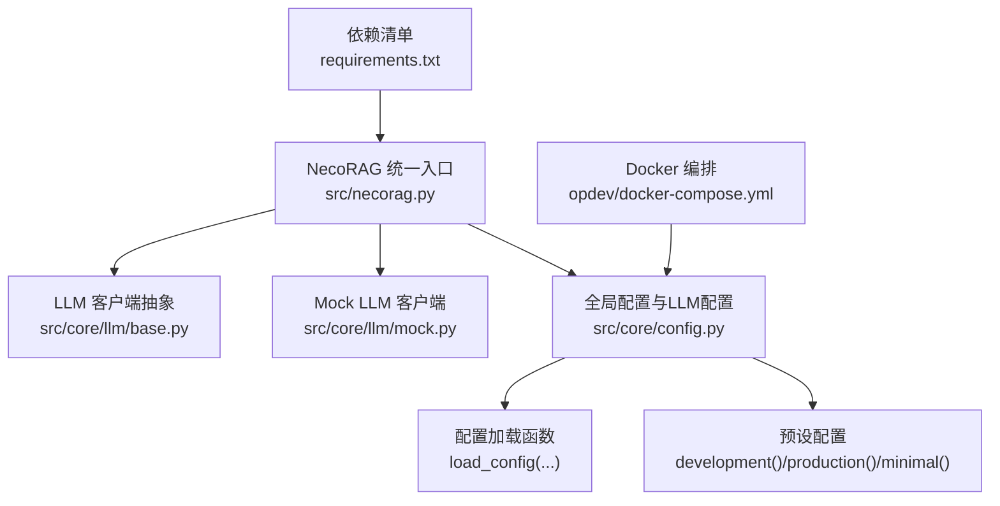
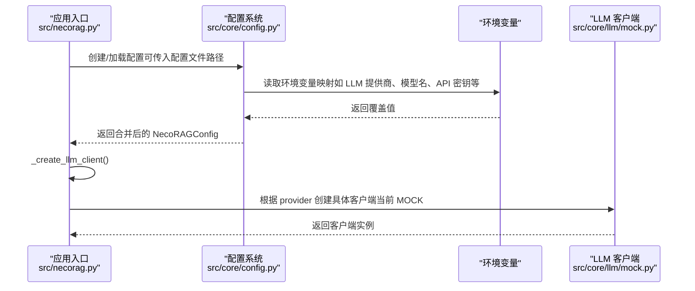
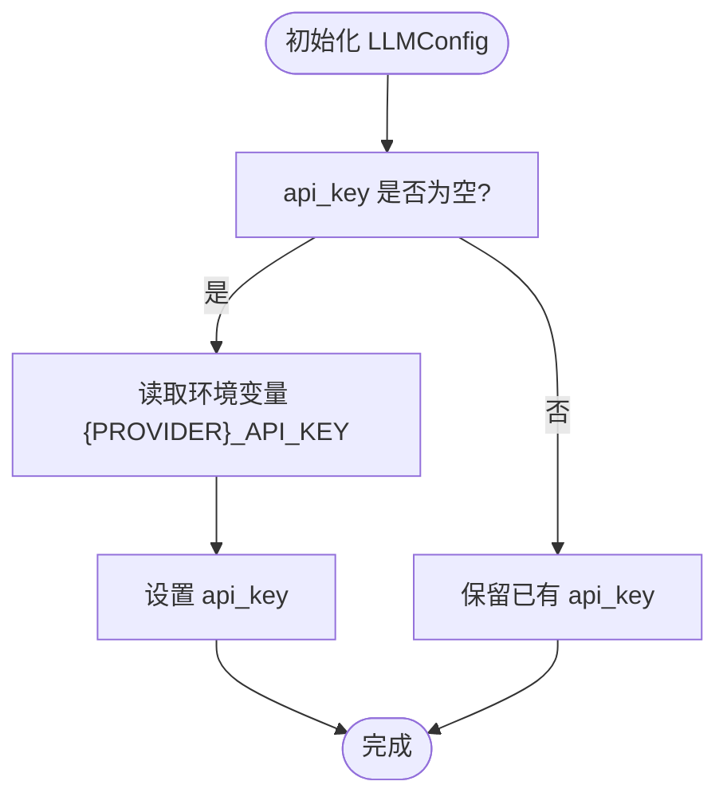
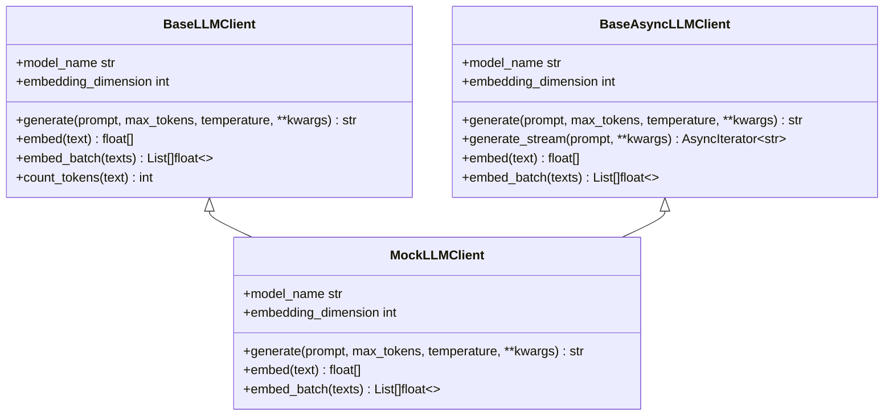
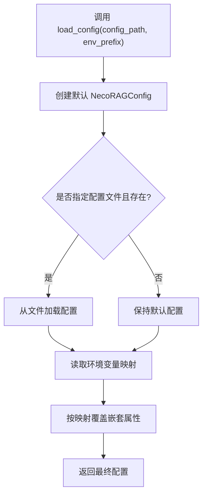
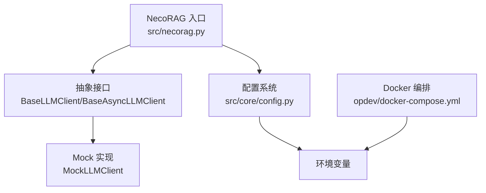

# LLM配置

<cite>
**本文档引用的文件**
- [src/core/config.py](file://src/core/config.py)
- [src/core/llm/base.py](file://src/core/llm/base.py)
- [src/core/llm/mock.py](file://src/core/llm/mock.py)
- [src/necorag.py](file://src/necorag.py)
- [opdev/docker-compose.yml](file://opdev/docker-compose.yml)
- [requirements.txt](file://requirements.txt)
</cite>

## 目录
1. [简介](#简介)
2. [项目结构](#项目结构)
3. [核心组件](#核心组件)
4. [架构总览](#架构总览)
5. [详细组件分析](#详细组件分析)
6. [依赖分析](#依赖分析)
7. [性能考虑](#性能考虑)
8. [故障排查指南](#故障排查指南)
9. [结论](#结论)
10. [附录](#附录)

## 简介
本文件面向使用者与开发者，系统化阐述 NecoRAG 的 LLM 配置体系，重点围绕 LLMConfig 类的各项参数与行为，包括提供商选择（MOCK、OPENAI、OLLAMA、VLLM、AZURE、ANTHROPIC）、模型名称、API 密钥管理、温度参数、最大令牌数、超时设置、嵌入模型配置（名称与维度）等。同时解释环境变量自动加载机制与优先级，给出不同提供商的配置示例与最佳实践，帮助用户正确配置并稳定运行各类 LLM 服务。

## 项目结构
与 LLM 配置直接相关的核心文件与职责如下：
- src/core/config.py：统一配置管理，包含 LLMConfig、NecoRAGConfig、配置加载函数与预设配置
- src/core/llm/base.py：LLM 客户端抽象接口（同步/异步），定义 generate/embed 等能力
- src/core/llm/mock.py：Mock LLM 客户端实现，用于演示与测试
- src/necorag.py：NecoRAG 统一入口，负责按配置创建 LLM 客户端实例
- opdev/docker-compose.yml：Docker 编排文件，展示如何通过环境变量注入 LLM 配置
- requirements.txt：第三方依赖清单，包含 LLM 相关集成所需的包

**图表来源**
- [src/necorag.py:184-196](file://src/necorag.py#L184-L196)
- [src/core/config.py:326-365](file://src/core/config.py#L326-L365)
- [opdev/docker-compose.yml:130-138](file://opdev/docker-compose.yml#L130-L138)

**章节来源**
- [src/core/config.py:18-101](file://src/core/config.py#L18-L101)
- [src/core/llm/base.py:11-134](file://src/core/llm/base.py#L11-L134)
- [src/core/llm/mock.py:16-313](file://src/core/llm/mock.py#L16-L313)
- [src/necorag.py:184-196](file://src/necorag.py#L184-L196)
- [opdev/docker-compose.yml:130-138](file://opdev/docker-compose.yml#L130-L138)
- [requirements.txt:33-37](file://requirements.txt#L33-L37)

## 核心组件
本节聚焦 LLMConfig 的字段与行为，以及与之配套的环境变量加载机制。

- 提供商选择（LLMProvider）
  - MOCK：演示用客户端，无需外部服务
  - OPENAI：OpenAI API
  - OLLAMA：本地 Ollama 服务
  - VLLM：vLLM 服务
  - AZURE：Azure OpenAI
  - ANTHROPIC：Claude（Anthropic）

- LLMConfig 关键字段
  - provider：LLM 提供商，默认 MOCK
  - model_name：模型名称，默认 mock-model
  - api_key：API 密钥，可为空；若为空且存在对应环境变量则自动加载
  - api_base：API 基础地址，可为空
  - temperature：采样温度，默认 0.7
  - max_tokens：最大生成令牌数，默认 2048
  - timeout：请求超时（秒），默认 60
  - embedding_model：嵌入模型名称，默认 mock-embedding
  - embedding_dimension：嵌入向量维度，默认 768

- 环境变量自动加载机制
  - LLMConfig.__post_init__ 会在 api_key 为空时，尝试从环境变量读取形如 {PROVIDER}_API_KEY 的密钥
  - 配置加载函数 load_config 支持通过环境变量覆盖关键配置项，优先级为：环境变量 > 配置文件 > 默认值
  - Docker 编排文件通过环境变量注入 LLM 提供商、API 基址、向量数据库与图数据库等配置

**章节来源**
- [src/core/config.py:18-26](file://src/core/config.py#L18-L26)
- [src/core/config.py:81-101](file://src/core/config.py#L81-L101)
- [src/core/config.py:326-365](file://src/core/config.py#L326-L365)
- [opdev/docker-compose.yml:130-138](file://opdev/docker-compose.yml#L130-L138)

## 架构总览
下图展示了 NecoRAG 在启动时如何依据 LLMConfig 创建 LLM 客户端，以及环境变量如何参与配置覆盖。

**图表来源**
- [src/necorag.py:184-196](file://src/necorag.py#L184-L196)
- [src/core/config.py:326-365](file://src/core/config.py#L326-L365)
- [src/core/llm/mock.py:16-313](file://src/core/llm/mock.py#L16-L313)

## 详细组件分析

### LLMConfig 类与环境变量加载
- 字段与默认值：参见“核心组件”小节
- 环境变量加载规则：
  - LLMConfig.__post_init__：当 api_key 为空时，按 PROVIDER_API_KEY 读取环境变量
  - load_config：支持覆盖 debug、llm.provider、llm.model、llm.api_key、向量/图数据库提供商与地址等
- 配置优先级：环境变量 > 配置文件 > 默认值

**图表来源**
- [src/core/config.py:96-101](file://src/core/config.py#L96-L101)
- [src/core/config.py:349-364](file://src/core/config.py#L349-L364)

**章节来源**
- [src/core/config.py:81-101](file://src/core/config.py#L81-L101)
- [src/core/config.py:326-365](file://src/core/config.py#L326-L365)

### LLM 客户端抽象与 Mock 实现
- 抽象接口：BaseLLMClient/BaseAsyncLLMClient 定义 generate/embed/embed_batch 等能力
- Mock 实现：MockLLMClient 提供确定性响应与向量生成，便于测试与演示
- NecoRAG 入口：_create_llm_client 根据配置选择具体实现（当前 MOCK）

**图表来源**
- [src/core/llm/base.py:11-134](file://src/core/llm/base.py#L11-L134)
- [src/core/llm/mock.py:16-313](file://src/core/llm/mock.py#L16-L313)

**章节来源**
- [src/core/llm/base.py:11-134](file://src/core/llm/base.py#L11-L134)
- [src/core/llm/mock.py:16-313](file://src/core/llm/mock.py#L16-L313)
- [src/necorag.py:184-196](file://src/necorag.py#L184-L196)

### 配置加载与覆盖流程
- load_config 会：
  - 从配置文件加载（若提供有效路径）
  - 从环境变量读取并覆盖关键字段（如 debug、llm.provider、llm.model、llm.api_key、向量/图数据库等）
  - 通过 _set_nested_attr 设置嵌套属性
- Docker 编排通过环境变量注入 LLM 提供商、API 基址、数据库连接等

**图表来源**
- [src/core/config.py:326-365](file://src/core/config.py#L326-L365)
- [opdev/docker-compose.yml:130-138](file://opdev/docker-compose.yml#L130-L138)

**章节来源**
- [src/core/config.py:326-365](file://src/core/config.py#L326-L365)
- [opdev/docker-compose.yml:130-138](file://opdev/docker-compose.yml#L130-L138)

### 不同提供商的配置示例与最佳实践
- MOCK（推荐用于开发/测试）
  - 特点：无需外部服务，确定性响应，便于调试
  - 配置要点：provider=mock，model_name 可自定义，embedding_dimension 根据下游嵌入模型维度设置
  - 环境变量：无需 API 密钥
  - Docker 注入：NECORAG_LLM_PROVIDER=mock

- OLLAMA（本地推理）
  - 特点：本地部署，低延迟，适合私有化
  - 配置要点：provider=ollama，model_name=本地模型名，api_base=本地服务地址（如 http://ollama:11434），api_key 可为空
  - 环境变量：NECORAG_LLM_PROVIDER=ollama，NECORAG_LLM_API_BASE=http://ollama:11434
  - Docker 注入：参考 docker-compose.yml 中的 necorag 服务环境变量

- OPENAI/AZURE/ANTHROPIC/VLLM（云端/第三方服务）
  - 特点：需准备 API 密钥与正确的服务端点
  - 配置要点：provider=对应提供商，model_name=服务端模型名，api_key=对应密钥，api_base=服务端点（如需要）
  - 环境变量：NECORAG_LLM_PROVIDER、NECORAG_LLM_MODEL、NECORAG_LLM_API_KEY、NECORAG_LLM_API_BASE
  - 注意：当前 NecoRAG 入口仅创建 MOCK 客户端，其他提供商需扩展实现

- 嵌入模型配置
  - 字段：embedding_model、embedding_dimension
  - 作用：影响向量化维度与兼容性，需与下游向量库/嵌入模型一致
  - 建议：在生产中与实际使用的嵌入模型维度保持一致，避免检索/存储异常

**章节来源**
- [src/core/config.py:18-26](file://src/core/config.py#L18-L26)
- [src/core/config.py:81-101](file://src/core/config.py#L81-L101)
- [src/necorag.py:184-196](file://src/necorag.py#L184-L196)
- [opdev/docker-compose.yml:130-138](file://opdev/docker-compose.yml#L130-L138)
- [requirements.txt:33-37](file://requirements.txt#L33-L37)

## 依赖分析
- LLM 客户端抽象与实现
  - BaseLLMClient/BaseAsyncLLMClient 定义统一接口
  - MockLLMClient 实现具体逻辑
- NecoRAG 入口依赖配置系统
  - _create_llm_client 根据 LLMConfig.provider 创建客户端
- Docker 编排与环境变量
  - 通过环境变量注入 LLM 提供商、API 基址、数据库连接等

**图表来源**
- [src/core/llm/base.py:11-134](file://src/core/llm/base.py#L11-L134)
- [src/core/llm/mock.py:16-313](file://src/core/llm/mock.py#L16-L313)
- [src/necorag.py:184-196](file://src/necorag.py#L184-L196)
- [src/core/config.py:326-365](file://src/core/config.py#L326-L365)
- [opdev/docker-compose.yml:130-138](file://opdev/docker-compose.yml#L130-L138)

**章节来源**
- [src/core/llm/base.py:11-134](file://src/core/llm/base.py#L11-L134)
- [src/core/llm/mock.py:16-313](file://src/core/llm/mock.py#L16-L313)
- [src/necorag.py:184-196](file://src/necorag.py#L184-L196)
- [src/core/config.py:326-365](file://src/core/config.py#L326-L365)
- [opdev/docker-compose.yml:130-138](file://opdev/docker-compose.yml#L130-L138)

## 性能考虑
- 温度与最大令牌数
  - temperature 影响生成多样性与稳定性，较低值更稳定但创造性降低
  - max_tokens 控制输出长度，过长可能导致成本上升与延迟增加
- 超时设置
  - timeout 控制请求等待时间，合理设置可避免长时间阻塞
- 嵌入维度
  - embedding_dimension 需与下游向量库/检索模型匹配，避免维度不一致导致的性能与兼容性问题
- 本地 vs 云端
  - OLLAMA 本地推理延迟低，适合私有化与低带宽场景
  - 云端服务（OPENAI/AZURE/ANTHROPIC/VLLM）需关注网络延迟与限流策略

## 故障排查指南
- API 密钥相关
  - 若使用非 MOCK 提供商，需确保 api_key 正确设置或通过环境变量注入
  - LLMConfig.__post_init__ 会尝试从 {PROVIDER}_API_KEY 读取密钥
- 环境变量覆盖无效
  - 检查环境变量前缀与命名是否符合 load_config 的映射规则
  - 确认 Docker 编排中的环境变量已正确注入
- 客户端未按预期创建
  - 当前 NecoRAG 入口仅创建 MOCK 客户端；如需其他提供商，需扩展 _create_llm_client 的实现
- 依赖缺失
  - 集成第三方 LLM 服务时，确保 requirements.txt 中相关依赖已安装

**章节来源**
- [src/core/config.py:96-101](file://src/core/config.py#L96-L101)
- [src/core/config.py:349-364](file://src/core/config.py#L349-L364)
- [src/necorag.py:184-196](file://src/necorag.py#L184-L196)
- [requirements.txt:33-37](file://requirements.txt#L33-L37)

## 结论
NecoRAG 的 LLM 配置体系以 LLMConfig 为核心，结合环境变量自动加载与配置文件覆盖，提供了灵活可控的配置能力。当前入口默认使用 MOCK 客户端，便于开发与测试；生产场景可通过环境变量与配置文件切换至 OLLAMA 或其他提供商。建议在生产中明确设置嵌入维度、API 密钥与超时参数，并与下游向量库/嵌入模型保持一致，以获得最佳性能与稳定性。

## 附录
- 环境变量映射（摘自配置加载函数）
  - NECORAG_DEBUG → debug
  - NECORAG_LLM_PROVIDER → llm.provider
  - NECORAG_LLM_MODEL → llm.model_name
  - NECORAG_LLM_API_KEY → llm.api_key
  - NECORAG_VECTOR_DB → memory.vector_db_provider
  - NECORAG_VECTOR_DB_URL → memory.vector_db_url
  - NECORAG_GRAPH_DB → memory.graph_db_provider
  - NECORAG_GRAPH_DB_URL → memory.graph_db_url
- Docker 注入示例（来自编排文件）
  - NECORAG_LLM_PROVIDER=${LLM_PROVIDER:-mock}
  - NECORAG_LLM_API_BASE=http://ollama:11434
  - NECORAG_VECTOR_DB=qdrant
  - NECORAG_VECTOR_DB_URL=http://qdrant:6334
  - NECORAG_GRAPH_DB=neo4j
  - NECORAG_GRAPH_DB_URL=bolt://neo4j:7687

**章节来源**
- [src/core/config.py:349-364](file://src/core/config.py#L349-L364)
- [opdev/docker-compose.yml:130-138](file://opdev/docker-compose.yml#L130-L138)