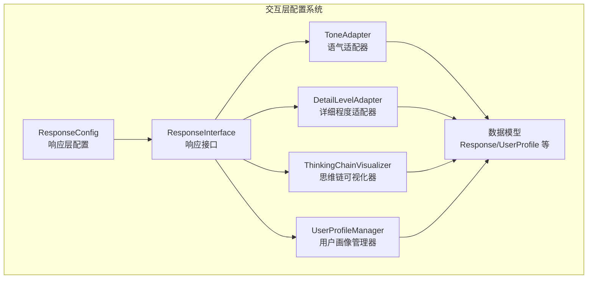
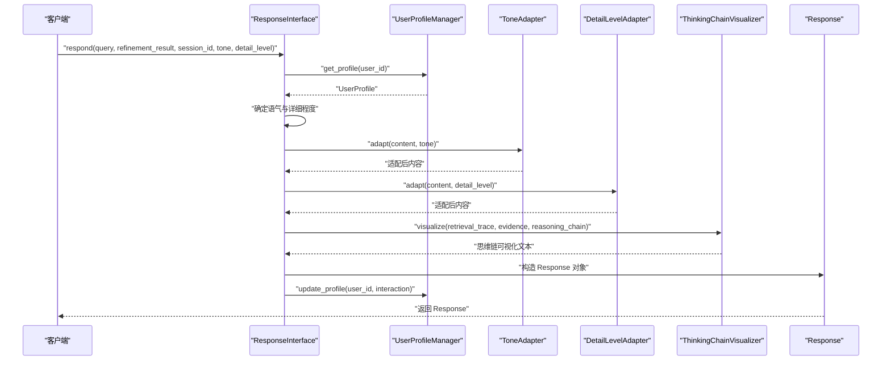
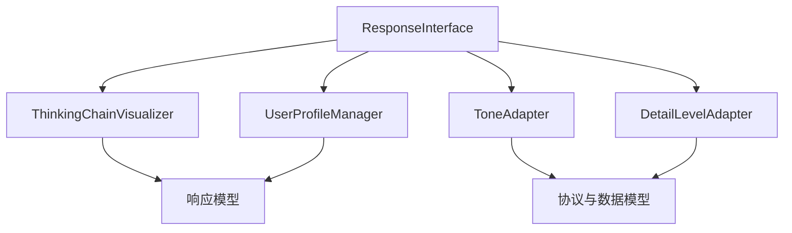

# 交互层配置

<cite>
**本文引用的文件**
- [src/core/config.py](file://src/core/config.py)
- [src/response/interface.py](file://src/response/interface.py)
- [src/response/tone_adapter.py](file://src/response/tone_adapter.py)
- [src/response/detail_adapter.py](file://src/response/detail_adapter.py)
- [src/response/visualizer.py](file://src/response/visualizer.py)
- [src/response/profile_manager.py](file://src/response/profile_manager.py)
- [src/response/models.py](file://src/response/models.py)
- [src/core/protocols.py](file://src/core/protocols.py)
- [src/dashboard/models.py](file://src/dashboard/models.py)
- [src/dashboard/static/index.html](file://src/dashboard/static/index.html)
- [example/example_usage.py](file://example/example_usage.py)
</cite>

## 目录
1. [简介](#简介)
2. [项目结构](#项目结构)
3. [核心组件](#核心组件)
4. [架构总览](#架构总览)
5. [详细组件分析](#详细组件分析)
6. [依赖关系分析](#依赖关系分析)
7. [性能考量](#性能考量)
8. [故障排查指南](#故障排查指南)
9. [结论](#结论)
10. [附录](#附录)

## 简介
本文件聚焦“交互层配置系统”，围绕 ResponseConfig 类及其相关组件，系统阐述以下内容：
- ResponseConfig 的各项参数与默认行为
- 响应风格（专业、友好、幽默）与详细程度（1-4级）对用户体验的影响
- 思维链可视化配置（启用开关、检索路径显示、证据来源显示）
- 输出格式（文本、Markdown、HTML）的说明与使用场景
- 不同用户群体的响应配置优化建议

## 项目结构
交互层配置系统位于响应层（Response Layer），由以下模块协作构成：
- 响应接口：负责整合语气适配、详细程度适配、思维链可视化与用户画像分析
- 语气适配器：提供三种风格的语气模板与个性化注入
- 详细程度适配器：按层级（1-4）生成不同粒度的输出
- 思维链可视化器：展示检索路径、证据来源与推理过程
- 用户画像管理器：维护用户偏好、交互历史与风格检测
- 协议与数据模型：统一响应、语气、详细程度等枚举与数据结构
- 配置与仪表盘：提供全局配置与可视化参数编辑界面

图表来源
- [src/core/config.py:208-222](file://src/core/config.py#L208-L222)
- [src/response/interface.py:16-54](file://src/response/interface.py#L16-L54)
- [src/response/tone_adapter.py:8-47](file://src/response/tone_adapter.py#L8-L47)
- [src/response/detail_adapter.py:8-56](file://src/response/detail_adapter.py#L8-L56)
- [src/response/visualizer.py:9-36](file://src/response/visualizer.py#L9-L36)
- [src/response/profile_manager.py:10-40](file://src/response/profile_manager.py#L10-L40)
- [src/response/models.py:13-31](file://src/response/models.py#L13-L31)

章节来源
- [src/core/config.py:208-222](file://src/core/config.py#L208-L222)
- [src/response/interface.py:16-54](file://src/response/interface.py#L16-L54)

## 核心组件
本节对交互层的关键组件进行深入分析，涵盖职责、参数、行为与交互关系。

- ResponseConfig（响应层配置）
  - 默认响应风格：professional（专业）、friendly（友好）、humorous（幽默）
  - 默认详细程度：1-4（简洁摘要、标准回答、详细解释、深度分析）
  - 思维链可视化：enable_thinking_chain、show_retrieval_path、show_evidence_sources
  - 输出格式：text、markdown、html
  - 用途：作为全局配置项，影响响应接口的默认行为；亦可通过仪表盘进行参数编辑与激活

- ResponseInterface（响应接口）
  - 职责：情境自适应生成、用户画像适配、思维链可视化、多模态输出
  - 关键流程：获取用户画像 → 确定语气与详细程度 → 语气与详细程度适配 → 生成思维链可视化 → 构造响应对象 → 更新用户画像
  - 参数：llm_model、default_tone、default_detail_level

- ToneAdapter（语气适配器）
  - 支持风格：professional、friendly、humorous
  - 特性：前缀/后缀注入、连接词注入、emoji控制
  - 适用场景：提升亲和力、专业度或趣味性

- DetailLevelAdapter（详细程度适配器）
  - 层级：1（简洁摘要）→ 2（标准回答）→ 3（详细解释）→ 4（深度分析）
  - 特性：摘要、要点、段落扩展、报告框架
  - 适用场景：根据用户专业水平与查询复杂度动态调整

- ThinkingChainVisualizer（思维链可视化器）
  - 展示内容：检索路径、证据来源、推理过程
  - 开关：show_trace、show_evidence、show_reasoning
  - 适用场景：增强可解释性、信任度与透明度

- UserProfileManager（用户画像管理器）
  - 职责：管理用户画像、分析偏好、跟踪交互历史
  - 特性：画像缓存、历史长度限制、偏好分析
  - 适用场景：个性化推荐与风格检测

- 协议与数据模型
  - ResponseTone：专业、友好、幽默
  - DetailLevel：简洁、标准、详细、全面
  - Response：统一响应对象，包含内容、置信度、来源、思维链、语气、详细程度等
  - UserProfile：包含用户偏好、专业水平、交互风格、查询历史等

章节来源
- [src/core/config.py:208-222](file://src/core/config.py#L208-L222)
- [src/response/interface.py:16-133](file://src/response/interface.py#L16-L133)
- [src/response/tone_adapter.py:8-138](file://src/response/tone_adapter.py#L8-L138)
- [src/response/detail_adapter.py:8-202](file://src/response/detail_adapter.py#L8-L202)
- [src/response/visualizer.py:9-150](file://src/response/visualizer.py#L9-L150)
- [src/response/profile_manager.py:10-165](file://src/response/profile_manager.py#L10-L165)
- [src/core/protocols.py:51-64](file://src/core/protocols.py#L51-L64)
- [src/response/models.py:13-31](file://src/response/models.py#L13-L31)

## 架构总览
交互层配置系统的整体流程如下：
- 输入：查询文本、精炼结果、会话ID、可选语气与详细程度
- 处理：用户画像获取与偏好分析 → 语气与详细程度确定 → 内容适配 → 思维链可视化生成
- 输出：统一响应对象（包含内容、思维链、元数据）

图表来源
- [src/response/interface.py:55-133](file://src/response/interface.py#L55-L133)
- [src/response/tone_adapter.py:49-76](file://src/response/tone_adapter.py#L49-L76)
- [src/response/detail_adapter.py:28-56](file://src/response/detail_adapter.py#L28-L56)
- [src/response/visualizer.py:37-72](file://src/response/visualizer.py#L37-L72)
- [src/response/profile_manager.py:69-100](file://src/response/profile_manager.py#L69-L100)

## 详细组件分析

### ResponseConfig 参数详解
- 默认响应风格（default_tone）
  - 取值：professional、friendly、humorous
  - 影响：决定语气适配器的模板选择与个性化注入策略
  - 场景：专业报告、客服对话、创意问答

- 默认详细程度（default_detail_level）
  - 取值：1-4
  - 影响：决定详细程度适配器的输出层级
  - 场景：快速摘要、标准回复、深度分析

- 思维链可视化（enable_thinking_chain、show_retrieval_path、show_evidence_sources）
  - 影响：是否生成与展示检索路径、证据来源、推理过程
  - 场景：可解释性需求高的场景（如审计、教学、合规）

- 输出格式（output_format）
  - 取值：text、markdown、html
  - 影响：最终输出的渲染方式
  - 场景：纯文本终端、富文本页面、网页集成

章节来源
- [src/core/config.py:208-222](file://src/core/config.py#L208-L222)
- [src/dashboard/models.py:142-161](file://src/dashboard/models.py#L142-L161)
- [src/dashboard/static/index.html:647-692](file://src/dashboard/static/index.html#L647-L692)

### 响应风格与详细程度对用户体验的影响
- 响应风格
  - 专业：适合正式场合、技术文档、审计报告，强调准确性与权威性
  - 友好：适合客服、教育、助手场景，强调亲和与易懂
  - 幽默：适合娱乐、创意场景，提升互动乐趣

- 详细程度
  - 1级：快速摘要，适合忙碌用户或初步了解
  - 2级：标准回答，平衡信息量与阅读成本
  - 3级：详细解释，适合需要深入理解的用户
  - 4级：深度分析，适合研究、决策支持场景

章节来源
- [src/response/tone_adapter.py:28-47](file://src/response/tone_adapter.py#L28-L47)
- [src/response/detail_adapter.py:12-17](file://src/response/detail_adapter.py#L12-L17)

### 思维链可视化配置与使用场景
- 启用开关（enable_thinking_chain）
  - 控制是否生成思维链可视化
  - 场景：需要可解释性的系统（如医疗诊断辅助、金融风控）

- 检索路径显示（show_retrieval_path）
  - 展示从查询到结果的检索步骤
  - 场景：教学演示、审计追踪、调试分析

- 证据来源显示（show_evidence_sources）
  - 展示每条断言的证据ID与相关度
  - 场景：学术写作、法律咨询、合规审查

章节来源
- [src/response/visualizer.py:19-36](file://src/response/visualizer.py#L19-L36)
- [src/response/interface.py:167-211](file://src/response/interface.py#L167-L211)

### 输出格式（文本、Markdown、HTML）
- 文本：适用于命令行、日志、API返回
- Markdown：适用于文档、网页预览、富文本编辑器
- HTML：适用于网页集成、仪表盘展示

章节来源
- [src/core/config.py:221-221](file://src/core/config.py#L221-L221)

### 面向不同用户群体的优化建议
- 新手用户
  - 建议：友好风格 + 标准详细程度（2级），开启证据来源显示
  - 目标：降低理解门槛，建立信任

- 专家用户
  - 建议：专业风格 + 深度分析（4级），开启检索路径与推理过程
  - 目标：提供充分细节与可解释性

- 忙碌用户
  - 建议：友好风格 + 简洁摘要（1级），关闭冗余可视化
  - 目标：快速获取关键信息

- 教育/培训场景
  - 建议：友好风格 + 详细解释（3级），开启检索路径与证据来源
  - 目标：便于讲解与学习

章节来源
- [src/response/interface.py:134-165](file://src/response/interface.py#L134-L165)
- [src/response/detail_adapter.py:158-202](file://src/response/detail_adapter.py#L158-L202)

## 依赖关系分析
交互层配置系统内部依赖关系如下：
- ResponseInterface 依赖：UserProfileManager、ToneAdapter、DetailLevelAdapter、ThinkingChainVisualizer
- ToneAdapter 与 DetailLevelAdapter 依赖：协议与数据模型中的枚举与数据结构
- ThinkingChainVisualizer 依赖：响应模型中的可视化数据结构
- UserProfileManager 依赖：工作记忆与用户画像数据结构
- ResponseConfig 作为全局配置，被仪表盘与响应接口读取

图表来源
- [src/response/interface.py:47-50](file://src/response/interface.py#L47-L50)
- [src/response/tone_adapter.py:5-10](file://src/response/tone_adapter.py#L5-L10)
- [src/response/detail_adapter.py:5-10](file://src/response/detail_adapter.py#L5-L10)
- [src/response/visualizer.py:6-6](file://src/response/visualizer.py#L6-L6)
- [src/response/profile_manager.py:7-7](file://src/response/profile_manager.py#L7-L7)
- [src/core/protocols.py:51-64](file://src/core/protocols.py#L51-L64)
- [src/response/models.py:10-10](file://src/response/models.py#L10-L10)

章节来源
- [src/response/interface.py:16-54](file://src/response/interface.py#L16-L54)
- [src/core/protocols.py:51-64](file://src/core/protocols.py#L51-L64)
- [src/response/models.py:13-31](file://src/response/models.py#L13-L31)

## 性能考量
- 适配器开销
  - 语气适配与详细程度适配均为字符串处理，复杂度与内容长度线性相关
  - 建议：对长文本分段处理，避免一次性大文本适配

- 可视化生成
  - 思维链可视化涉及列表拼接与格式化，复杂度与步骤数线性相关
  - 建议：限制证据来源显示数量（如最多5条），避免过多渲染

- 用户画像缓存
  - 使用内存缓存减少重复读取，注意合理设置TTL与最大历史数
  - 建议：结合工作记忆的上下文生命周期进行调优

- 输出格式
  - Markdown/HTML 渲染在前端完成，后端仅生成文本；若需服务端渲染，需评估额外开销

章节来源
- [src/response/visualizer.py:100-108](file://src/response/visualizer.py#L100-L108)
- [src/response/profile_manager.py:20-40](file://src/response/profile_manager.py#L20-L40)

## 故障排查指南
- 问题：响应风格未生效
  - 检查：ResponseInterface 中的语气参数是否显式传入；否则使用用户画像中的交互风格
  - 建议：在调用 respond 时明确指定 tone 参数

- 问题：详细程度不符合预期
  - 检查：用户专业水平与查询复杂度对详细程度的影响；ResponseInterface 会基于迭代次数与专业水平进行调整
  - 建议：必要时显式传入 detail_level 参数

- 问题：思维链可视化缺失
  - 检查：ThinkingChainVisualizer 的开关与输入数据是否正确；ResponseInterface 会根据精炼结果构建可视化
  - 建议：确认 refinement_result 包含必要的证据与置信度信息

- 问题：输出格式异常
  - 检查：ResponseConfig 的 output_format 设置；当前代码中该字段存在但未在响应接口中直接使用
  - 建议：在上层调用处根据 output_format 进行后续渲染或转换

章节来源
- [src/response/interface.py:80-100](file://src/response/interface.py#L80-L100)
- [src/response/interface.py:134-165](file://src/response/interface.py#L134-L165)
- [src/response/visualizer.py:37-72](file://src/response/visualizer.py#L37-L72)
- [src/core/config.py:221-221](file://src/core/config.py#L221-L221)

## 结论
交互层配置系统通过 ResponseConfig 与响应接口，实现了对语气、详细程度、思维链可视化与输出格式的统一管理。配合用户画像与适配器，能够为不同用户群体提供个性化的交互体验。建议在生产环境中：
- 明确默认风格与详细程度，结合业务场景进行权衡
- 启用思维链可视化以增强可解释性，同时控制显示范围
- 根据用户画像动态调整语气与详细程度，提升满意度
- 将 output_format 与前端渲染栈对接，确保一致的用户体验

## 附录
- 使用示例参考：在示例脚本中展示了如何初始化响应接口并生成交互响应，包括语气与详细程度的指定
- 仪表盘参数：通过 Web UI 可编辑交互层参数，包括默认语气、详细程度与可视化开关

章节来源
- [example/example_usage.py:176-216](file://example/example_usage.py#L176-L216)
- [src/dashboard/static/index.html:647-692](file://src/dashboard/static/index.html#L647-L692)