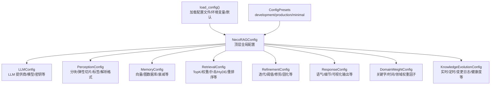
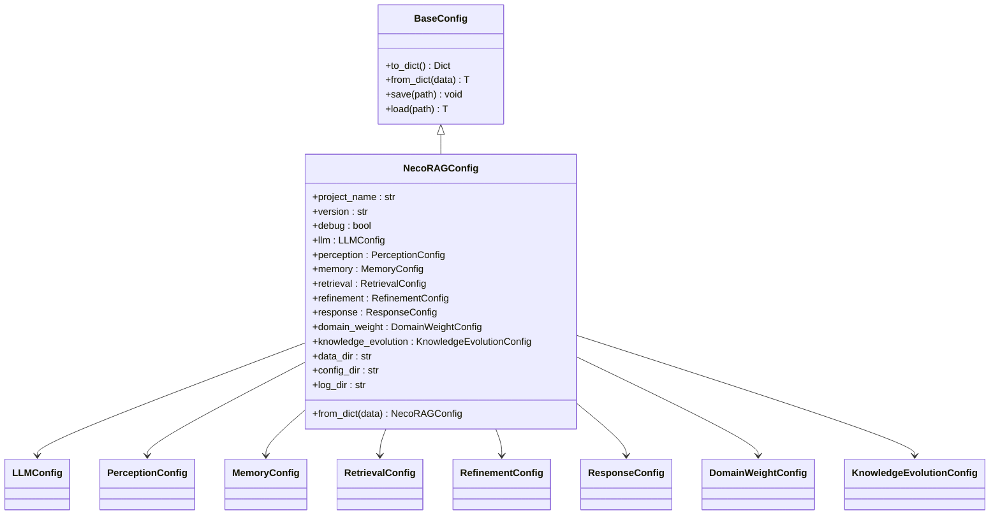
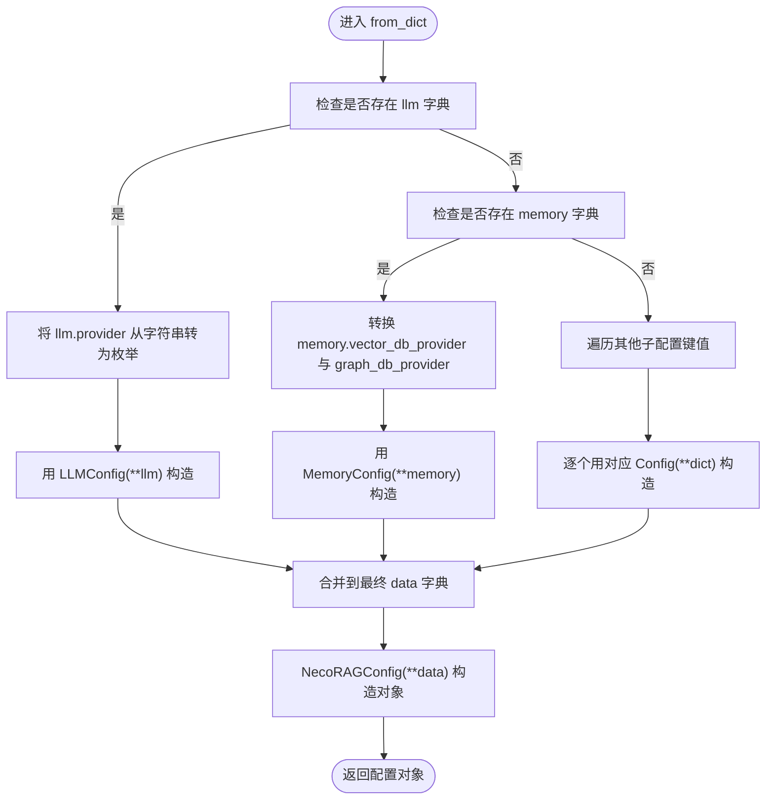
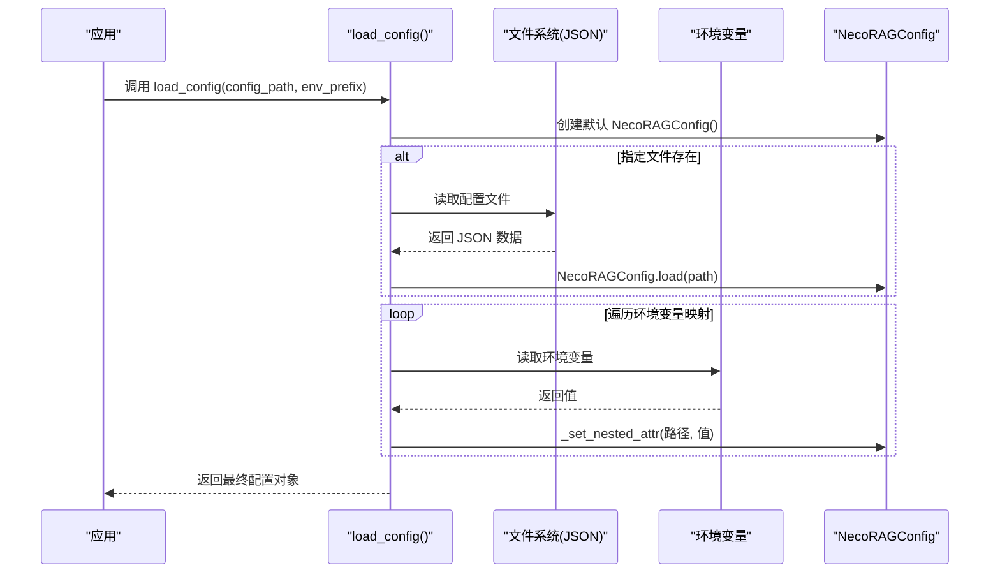
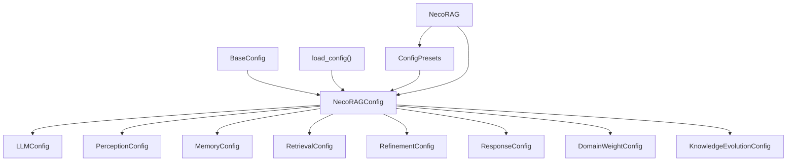

# 全局配置

<cite>
**本文引用的文件**
- [src/core/config.py](file://src/core/config.py)
- [src/core/base.py](file://src/core/base.py)
- [src/necorag.py](file://src/necorag.py)
- [src/core/exceptions.py](file://src/core/exceptions.py)
- [src/dashboard/config_manager.py](file://src/dashboard/config_manager.py)
- [example/example_usage.py](file://example/example_usage.py)
- [example/domain_weight_example.py](file://example/domain_weight_example.py)
</cite>

## 目录
1. [简介](#简介)
2. [项目结构](#项目结构)
3. [核心组件](#核心组件)
4. [架构总览](#架构总览)
5. [详细组件分析](#详细组件分析)
6. [依赖分析](#依赖分析)
7. [性能考虑](#性能考虑)
8. [故障排查指南](#故障排查指南)
9. [结论](#结论)
10. [附录](#附录)

## 简介
本文件面向 NecoRAG 全局配置系统，重点围绕 NecoRAGConfig 类的设计与实现，系统性阐述其架构、继承体系、配置加载与保存机制、以及最佳实践。读者将理解：
- 项目基本信息、调试模式、数据目录等全局参数的作用与配置方式
- BaseConfig 基类提供的通用序列化/反序列化能力与文件读写机制
- NecoRAGConfig 的继承体系与 from_dict 的递归处理逻辑
- 配置对象的创建、加载与保存流程
- 配置验证与错误处理的最佳实践

## 项目结构
全局配置系统位于 src/core/config.py，围绕 dataclass 的 NecoRAGConfig 作为顶层配置容器，内部聚合各子模块配置（如 LLM、感知、记忆、检索、巩固、响应、领域权重、知识演化）。同时提供配置加载函数与预设配置，便于从文件、环境变量与默认值中组合出最终配置。

图表来源
- [src/core/config.py:265-362](file://src/core/config.py#L265-L362)

章节来源
- [src/core/config.py:1-405](file://src/core/config.py#L1-L405)

## 核心组件
- BaseConfig：提供 to_dict、from_dict、save、load 等通用配置序列化/反序列化与文件读写能力，支持嵌套子配置对象的递归处理。
- NecoRAGConfig：顶层全局配置，包含项目信息（名称、版本、调试）、各层配置对象、数据目录（数据、配置、日志）等。
- 配置加载函数 load_config：按“环境变量 > 配置文件 > 默认值”的优先级合并配置；提供环境变量映射覆盖关键字段。
- 预设配置 ConfigPresets：提供开发、生产、最小化三套常用配置模板。

章节来源
- [src/core/config.py:45-77](file://src/core/config.py#L45-L77)
- [src/core/config.py:265-362](file://src/core/config.py#L265-L362)
- [src/core/config.py:375-405](file://src/core/config.py#L375-L405)

## 架构总览
NecoRAGConfig 采用 dataclass 设计，继承自 BaseConfig，具备以下特性：
- 顶层聚合：将各子模块配置作为字段，形成清晰的层次化配置树
- 序列化/反序列化：to_dict 将枚举与嵌套对象递归转为字典；from_dict 支持直接构造对象
- 文件读写：save/load 基于 JSON，便于持久化与跨进程共享
- 环境变量覆盖：load_config 提供统一的环境变量映射，支持对关键字段进行动态覆盖
- 预设模板：ConfigPresets 提供开箱即用的典型场景配置

图表来源
- [src/core/config.py:45-362](file://src/core/config.py#L45-L362)

## 详细组件分析

### BaseConfig 基类
- to_dict：遍历 dataclass 字段，将枚举值转换为其 value，对具有 to_dict 的嵌套对象递归调用，否则原样保留
- from_dict：使用类构造函数直接从字典创建对象
- save/load：以 JSON 形式保存/加载，确保编码与缩进一致，便于人工阅读与版本控制

这些能力为上层配置提供了统一的序列化/反序列化与持久化基础。

章节来源
- [src/core/config.py:45-77](file://src/core/config.py#L45-L77)

### NecoRAGConfig 类
- 项目信息：project_name、version、debug
- 各层配置：llm、perception、memory、retrieval、refinement、response、domain_weight、knowledge_evolution
- 数据目录：data_dir、config_dir、log_dir
- from_dict 递归处理：对子配置进行类型转换与对象化，特别是枚举类型的字符串到枚举的映射

图表来源
- [src/core/config.py:288-318](file://src/core/config.py#L288-L318)

章节来源
- [src/core/config.py:265-318](file://src/core/config.py#L265-L318)

### 配置加载与保存机制
- 创建：默认构造 NecoRAGConfig
- 文件加载：若指定配置文件存在，则调用 NecoRAGConfig.load 从 JSON 文件读取
- 环境变量覆盖：遍历预定义的环境变量映射，将值转换为目标字段类型后设置到嵌套路径
- 保存：通过 NecoRAGConfig.save 将当前配置写入 JSON 文件

图表来源
- [src/core/config.py:323-362](file://src/core/config.py#L323-L362)
- [src/core/config.py:365-371](file://src/core/config.py#L365-L371)

章节来源
- [src/core/config.py:323-362](file://src/core/config.py#L323-L362)
- [src/core/config.py:365-371](file://src/core/config.py#L365-L371)

### 预设配置与使用
- development：开启调试、使用内存型向量/图数据库、Mock LLM
- production：关闭调试、提升巩固迭代次数、启用重排序
- minimal：最小化功能集合，降低资源消耗

这些预设简化了不同运行环境的配置准备。

章节来源
- [src/core/config.py:375-405](file://src/core/config.py#L375-L405)

### 在 NecoRAG 类中的应用
- NecoRAG.__init__：若未显式传入配置，使用 ConfigPresets.development() 作为默认
- NecoRAG.from_config_file：从配置文件直接加载并创建实例
- NecoRAG.quick_start：使用 ConfigPresets.minimal() 快速启动

章节来源
- [src/necorag.py:61-101](file://src/necorag.py#L61-L101)
- [src/necorag.py:696-718](file://src/necorag.py#L696-L718)

### 配置验证与错误处理最佳实践
- 配置验证：建议在 from_dict 或构造后增加校验逻辑，确保枚举值合法、数值范围有效、路径存在且可写
- 错误处理：使用统一的异常体系，如 ConfigurationError、ValidationError，便于定位问题与统一处理
- 环境变量校验：对字符串到枚举的转换进行异常捕获，避免非法值导致崩溃
- 文件读写健壮性：在 save/load 失败时记录日志并提供回退策略（如使用默认配置）

章节来源
- [src/core/exceptions.py:254-295](file://src/core/exceptions.py#L254-L295)

## 依赖分析
- NecoRAGConfig 依赖于各子配置 dataclass（LLMConfig、PerceptionConfig、MemoryConfig、RetrievalConfig、RefinementConfig、ResponseConfig、DomainWeightConfig、KnowledgeEvolutionConfig）
- BaseConfig 为所有配置类提供统一的序列化/反序列化与文件读写能力
- load_config 依赖于 os、json、pathlib.Path 与枚举类型（LLMProvider、VectorDBProvider、GraphDBProvider）
- NecoRAG 类在初始化时使用 ConfigPresets，并在查询流程中读取配置参数

图表来源
- [src/core/config.py:45-362](file://src/core/config.py#L45-L362)
- [src/necorag.py:61-101](file://src/necorag.py#L61-L101)

章节来源
- [src/core/config.py:45-362](file://src/core/config.py#L45-L362)
- [src/necorag.py:61-101](file://src/necorag.py#L61-L101)

## 性能考虑
- 配置对象通常较小，JSON 序列化/反序列化的开销可忽略
- 递归处理子配置时，注意避免深层嵌套导致的复杂度上升
- 环境变量覆盖仅影响关键字段，建议在启动阶段一次性完成，避免频繁读取
- 对于大规模部署，建议将配置文件集中管理并通过 CI/CD 注入环境变量，减少磁盘 IO

## 故障排查指南
- 配置文件加载失败
  - 检查文件路径是否存在与权限
  - 确认 JSON 格式正确，字段名与 dataclass 字段一致
  - 若包含枚举字段，确保字符串值与枚举定义匹配
- 环境变量覆盖无效
  - 确认环境变量前缀与映射一致
  - 检查字符串到枚举的转换是否正确
- 配置验证报错
  - 使用 ConfigurationError/ValidationError 捕获并记录字段名与值
  - 对阈值、范围等进行显式校验
- 日志与数据目录
  - 确保 data_dir、config_dir、log_dir 可写
  - 在调试模式下观察详细日志输出

章节来源
- [src/core/exceptions.py:254-295](file://src/core/exceptions.py#L254-L295)
- [src/core/config.py:323-362](file://src/core/config.py#L323-L362)

## 结论
NecoRAG 全局配置系统以 BaseConfig 为基础，通过 NecoRAGConfig 实现了清晰的分层配置设计与强大的可扩展性。结合 load_config 的环境变量覆盖与 ConfigPresets 的预设模板，开发者可以灵活地在不同运行环境中快速部署与定制配置。遵循本文的验证与错误处理最佳实践，可进一步提升系统的稳定性与可维护性。

## 附录
- 使用示例参考
  - 完整工作流程示例：[example/example_usage.py](file://example/example_usage.py)
  - 领域权重示例：[example/domain_weight_example.py](file://example/domain_weight_example.py)
- 配置管理器（Dashboard）
  - Profile 的创建、切换、导入导出与持久化：[src/dashboard/config_manager.py](file://src/dashboard/config_manager.py)