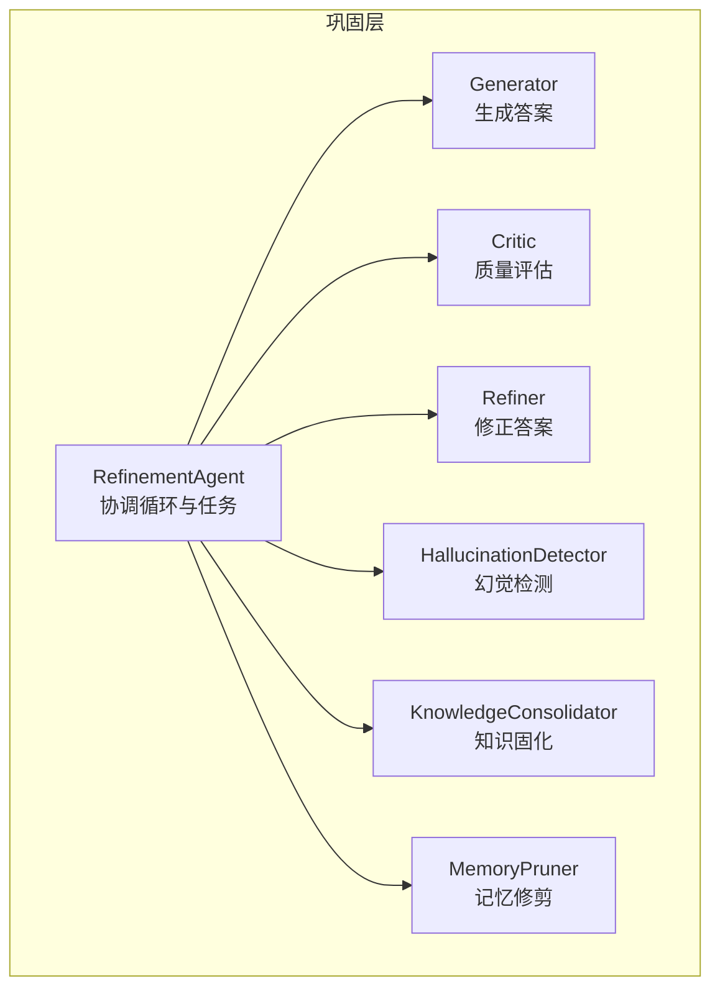
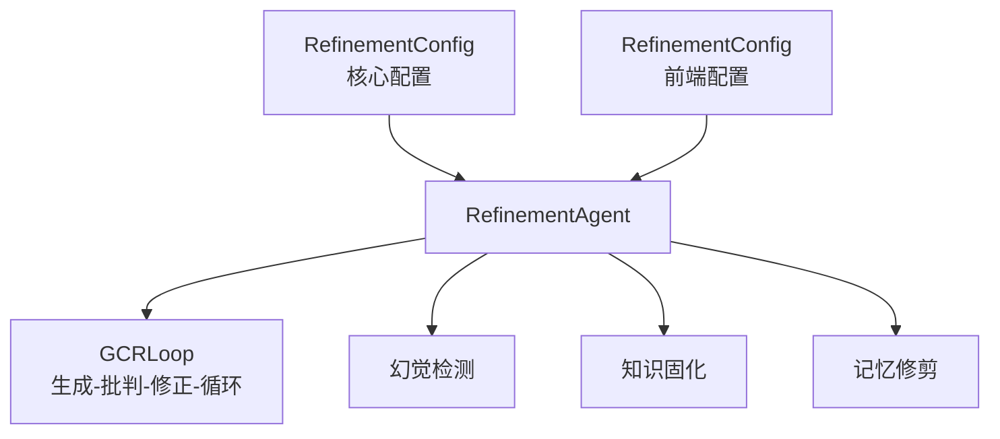
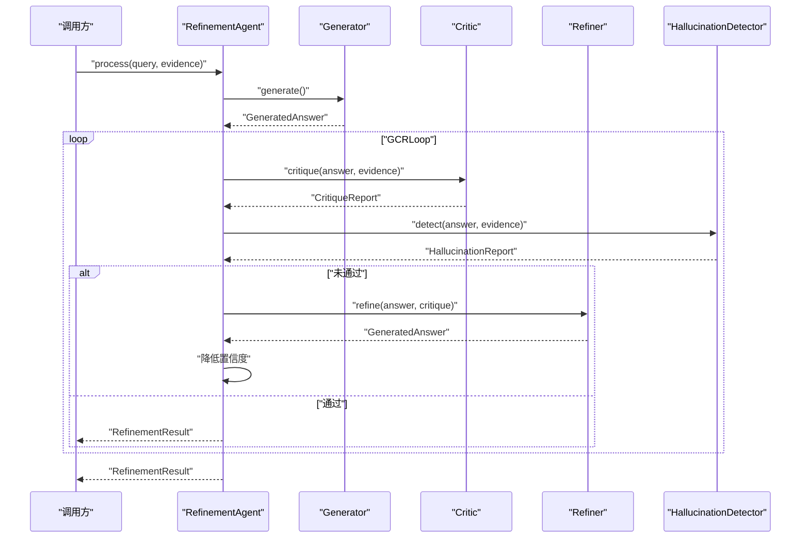
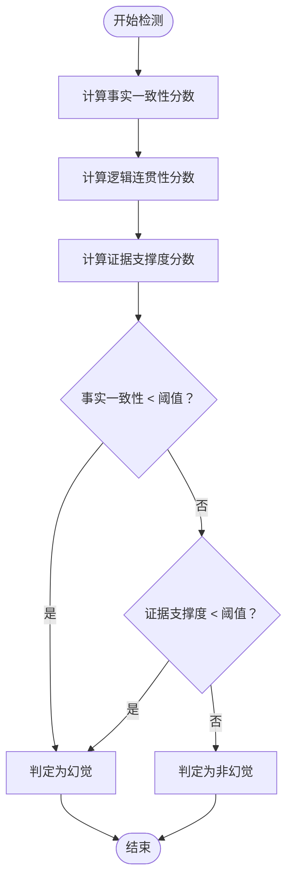
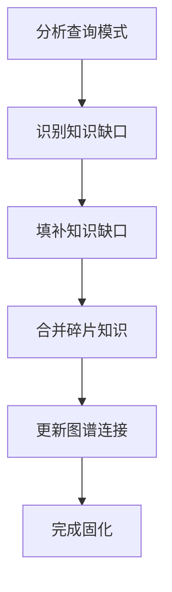
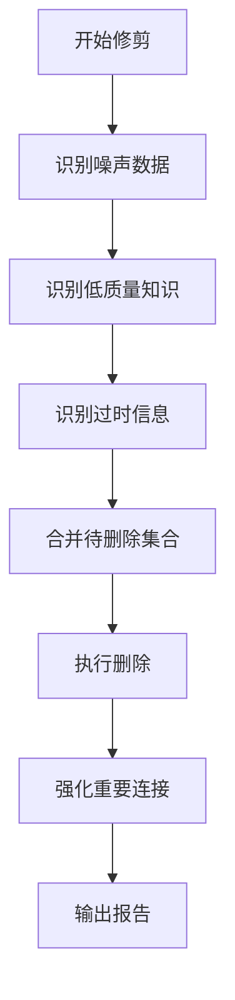
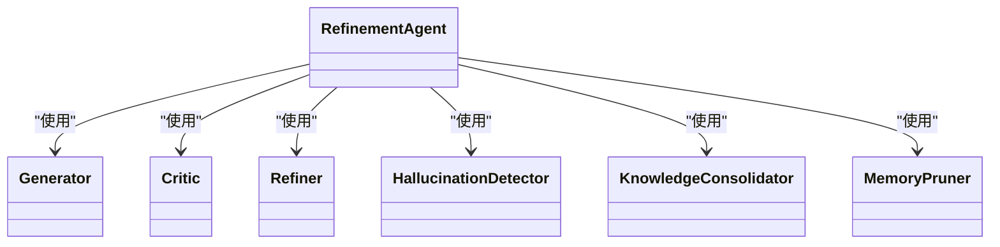

# 巩固层配置

<cite>
**本文引用的文件**
- [src/core/config.py](file://src/core/config.py)
- [src/refinement/agent.py](file://src/refinement/agent.py)
- [src/refinement/generator.py](file://src/refinement/generator.py)
- [src/refinement/critic.py](file://src/refinement/critic.py)
- [src/refinement/refiner.py](file://src/refinement/refiner.py)
- [src/refinement/hallucination.py](file://src/refinement/hallucination.py)
- [src/refinement/consolidator.py](file://src/refinement/consolidator.py)
- [src/refinement/pruner.py](file://src/refinement/pruner.py)
- [src/refinement/models.py](file://src/refinement/models.py)
- [src/core/base.py](file://src/core/base.py)
- [src/dashboard/models.py](file://src/dashboard/models.py)
- [src/dashboard/static/index.html](file://src/dashboard/static/index.html)
</cite>

## 目录
1. [简介](#简介)
2. [项目结构](#项目结构)
3. [核心组件](#核心组件)
4. [架构总览](#架构总览)
5. [详细组件分析](#详细组件分析)
6. [依赖关系分析](#依赖关系分析)
7. [性能考量](#性能考量)
8. [故障排查指南](#故障排查指南)
9. [结论](#结论)
10. [附录](#附录)

## 简介
本文件围绕“巩固层配置系统”进行系统化说明，重点解释 RefinementConfig 类的各项参数及其在 Generator-Critic-Refiner 循环、幻觉检测、知识固化与记忆修剪中的作用机制，并结合实际代码实现给出不同场景下的优化建议。

## 项目结构
巩固层位于 refinement 子模块，包含以下关键文件：
- agent.py：精炼代理，协调生成、批判、修正、幻觉检测、知识固化与记忆修剪
- generator.py：答案生成器，负责基于证据生成答案并评估置信度
- critic.py：批判评估器，对答案进行质量评估
- refiner.py：答案修正器，依据批判意见修正答案
- hallucination.py：幻觉检测器，检测事实性、逻辑性与来源性幻觉
- consolidator.py：知识固化器，识别知识缺口并执行固化流程
- pruner.py：记忆修剪器，清理噪声、低质量与过时记忆
- models.py：巩固层数据模型（结果、报告等）
- core/config.py：全局配置定义，包含巩固层配置 RefinementConfig
- dashboard/models.py 与 dashboard/static/index.html：提供前端可视化配置入口（包含 min_confidence、max_iterations、hallucination_threshold 等）

图表来源
- [src/refinement/agent.py:16-151](file://src/refinement/agent.py#L16-L151)
- [src/refinement/generator.py:16-209](file://src/refinement/generator.py#L16-L209)
- [src/refinement/critic.py:10-73](file://src/refinement/critic.py#L10-L73)
- [src/refinement/refiner.py:10-66](file://src/refinement/refiner.py#L10-L66)
- [src/refinement/hallucination.py:10-155](file://src/refinement/hallucination.py#L10-L155)
- [src/refinement/consolidator.py:9-142](file://src/refinement/consolidator.py#L9-L142)
- [src/refinement/pruner.py:10-157](file://src/refinement/pruner.py#L10-L157)

章节来源
- [src/refinement/agent.py:16-151](file://src/refinement/agent.py#L16-L151)
- [src/core/config.py:185-204](file://src/core/config.py#L185-L204)

## 核心组件
- RefinementAgent：执行 Generator-Critic-Refiner 循环，进行幻觉检测与最终结果封装；同时调度知识固化与记忆修剪的后台任务。
- Generator：基于证据生成答案，计算置信度；支持 LLM 与规则回退两种路径。
- Critic：评估答案质量，产出质量评分与改进建议。
- Refiner：根据批判意见修正答案并调整置信度。
- HallucinationDetector：检测事实性、逻辑性与证据支撑度三类幻觉。
- KnowledgeConsolidator：识别知识缺口并执行固化流程。
- MemoryPruner：识别噪声、低质量与过时记忆并进行修剪与强化。

章节来源
- [src/refinement/agent.py:16-151](file://src/refinement/agent.py#L16-L151)
- [src/refinement/generator.py:16-209](file://src/refinement/generator.py#L16-L209)
- [src/refinement/critic.py:10-73](file://src/refinement/critic.py#L10-L73)
- [src/refinement/refiner.py:10-66](file://src/refinement/refiner.py#L10-L66)
- [src/refinement/hallucination.py:10-155](file://src/refinement/hallucination.py#L10-L155)
- [src/refinement/consolidator.py:9-142](file://src/refinement/consolidator.py#L9-L142)
- [src/refinement/pruner.py:10-157](file://src/refinement/pruner.py#L10-L157)

## 架构总览
巩固层配置通过两处落地：
- 核心配置：RefinementConfig（max_iterations、confidence_threshold、factual_threshold、logical_threshold、evidence_threshold、enable_consolidation、consolidation_interval、enable_pruning、pruning_threshold）
- 前端配置：RefinementConfig（min_confidence、max_iterations、hallucination_threshold、consolidation_interval、min_query_frequency、gap_fill_strategy、noise_threshold、quality_threshold、outdated_days）

两者在功能上互补：核心配置用于运行期控制循环收敛与检测阈值；前端配置用于可视化调参与任务调度参数。

图表来源
- [src/core/config.py:185-204](file://src/core/config.py#L185-L204)
- [src/dashboard/models.py:119-138](file://src/dashboard/models.py#L119-L138)
- [src/refinement/agent.py:16-151](file://src/refinement/agent.py#L16-L151)

## 详细组件分析

### RefinementConfig 参数详解与作用机制
- Generator-Critic-Refiner 循环配置
  - max_iterations：循环最大迭代次数，决定 GCRLoop 的收敛上限。
  - confidence_threshold：核心循环收敛阈值（用于内部逻辑），min_confidence：最终结果最低置信度阈值（前端配置）。
- 幻觉检测配置
  - factual_threshold：事实一致性阈值（核心配置）
  - logical_threshold：逻辑连贯性阈值（核心配置）
  - evidence_threshold：证据支撑度阈值（核心配置）
  - hallucination_threshold：前端配置，用于整体幻觉风险控制
- 知识固化配置
  - enable_consolidation：是否启用固化
  - consolidation_interval：固化周期（秒）
  - min_query_frequency：识别知识缺口所需的最小查询频率（前端配置）
  - gap_fill_strategy：缺口填充策略（前端配置）
- 记忆修剪配置
  - enable_pruning：是否启用修剪
  - pruning_threshold：修剪阈值（核心配置）
  - noise_threshold：噪声判定阈值（前端配置）
  - quality_threshold：质量判定阈值（前端配置）
  - outdated_days：过时判定天数（前端配置）

章节来源
- [src/core/config.py:185-204](file://src/core/config.py#L185-L204)
- [src/dashboard/models.py:119-138](file://src/dashboard/models.py#L119-L138)
- [src/dashboard/static/index.html:619-645](file://src/dashboard/static/index.html#L619-L645)

### 巩固循环工作原理与参数联动
- 控制流
  - 生成初始答案 → 批判评估 → 幻觉检测 → 若未通过则修正并降低置信度 → 重复直至通过或达到最大迭代
  - 若达到最大迭代仍未通过，则按 min_confidence 决定是否返回可靠答案
- 关键参数作用
  - max_iterations：限制循环次数，防止无限迭代
  - confidence_threshold：作为内部收敛参考（与 min_confidence 协同）
  - hallucination_threshold（前端）：与幻觉检测器的阈值共同决定是否判定为幻觉
  - min_confidence（前端）：最终输出的最低置信度门槛

图表来源
- [src/refinement/agent.py:61-128](file://src/refinement/agent.py#L61-L128)
- [src/refinement/generator.py:68-102](file://src/refinement/generator.py#L68-L102)
- [src/refinement/critic.py:26-72](file://src/refinement/critic.py#L26-L72)
- [src/refinement/refiner.py:26-65](file://src/refinement/refiner.py#L26-L65)
- [src/refinement/hallucination.py:35-76](file://src/refinement/hallucination.py#L35-L76)

章节来源
- [src/refinement/agent.py:61-128](file://src/refinement/agent.py#L61-L128)

### 幻觉检测判断逻辑
- 指标与阈值
  - 事实一致性：与证据的关键词重叠程度（核心配置 factual_threshold）
  - 逻辑连贯性：基于答案长度与逻辑连接词（核心配置 logical_threshold）
  - 证据支撑度：与证据数量相关（核心配置 evidence_threshold）
- 判定规则
  - 若事实一致性或证据支撑度低于各自阈值，则判定为幻觉
  - 逻辑连贯性阈值在检测器内部使用（当前实现为固定阈值）

图表来源
- [src/refinement/hallucination.py:35-76](file://src/refinement/hallucination.py#L35-L76)
- [src/refinement/hallucination.py:78-155](file://src/refinement/hallucination.py#L78-L155)

章节来源
- [src/refinement/hallucination.py:10-155](file://src/refinement/hallucination.py#L10-L155)

### 知识固化配置与工作机制
- 关键参数
  - enable_consolidation：是否启用固化
  - consolidation_interval：固化周期（秒）
  - min_query_frequency：识别知识缺口所需的最小查询频率
  - gap_fill_strategy：缺口填充策略（自动/手动等）
- 流程概览
  - 分析查询模式 → 识别知识缺口 → 填补缺口 → 合并碎片 → 更新图谱连接
- 当前实现状态
  - 查询模式分析、缺口填补、碎片合并、图谱更新为占位实现（TODO），需结合具体业务完善

图表来源
- [src/refinement/consolidator.py:35-61](file://src/refinement/consolidator.py#L35-L61)
- [src/refinement/consolidator.py:75-102](file://src/refinement/consolidator.py#L75-L102)

章节来源
- [src/refinement/consolidator.py:9-142](file://src/refinement/consolidator.py#L9-L142)

### 记忆修剪配置与工作机制
- 关键参数
  - enable_pruning：是否启用修剪
  - noise_threshold：噪声判定阈值
  - quality_threshold：质量判定阈值
  - outdated_days：过时判定天数
- 识别与修剪流程
  - 识别噪声数据、低质量知识、过时信息 → 执行删除 → 强化重要连接
- 当前实现状态
  - 强化连接为占位实现（TODO），需结合权重与访问统计完善

图表来源
- [src/refinement/pruner.py:41-69](file://src/refinement/pruner.py#L41-L69)
- [src/refinement/pruner.py:71-118](file://src/refinement/pruner.py#L71-L118)
- [src/refinement/pruner.py:139-157](file://src/refinement/pruner.py#L139-L157)

章节来源
- [src/refinement/pruner.py:10-157](file://src/refinement/pruner.py#L10-L157)

### 数据模型与结果封装
- RefinementResult：封装最终答案、置信度、引文、幻觉报告、迭代次数与元数据
- GeneratedAnswer：封装生成答案的内容、引文、置信度与元数据
- CritiqueReport：封装批判结果（有效性、问题、建议、质量评分）
- HallucinationReport：封装幻觉检测结果（是否幻觉、三项分数与问题列表）

章节来源
- [src/refinement/models.py:9-66](file://src/refinement/models.py#L9-L66)

## 依赖关系分析
- 组件耦合
  - RefinementAgent 依赖 Generator、Critic、Refiner、HallucinationDetector、KnowledgeConsolidator、MemoryPruner
  - 各组件均实现于抽象基类，便于替换与扩展
- 外部依赖
  - LLM 客户端注入（Generator 支持注入 BaseLLMClient 或回退到规则生成）
  - 前端可视化配置通过 dashboard 模块提供参数入口

图表来源
- [src/refinement/agent.py:48-59](file://src/refinement/agent.py#L48-L59)
- [src/core/base.py:438-527](file://src/core/base.py#L438-L527)

章节来源
- [src/refinement/agent.py:16-151](file://src/refinement/agent.py#L16-L151)
- [src/core/base.py:438-527](file://src/core/base.py#L438-L527)

## 性能考量
- 循环收敛
  - 合理设置 max_iterations 与 confidence_threshold/min_confidence，避免过长或过短的迭代
- 幻觉检测成本
  - 事实一致性与证据支撑度的计算复杂度与证据数量线性相关，建议控制单次生成证据数量上限
- 固化与修剪
  - consolidation_interval 与 pruning_threshold 需结合数据规模与资源预算权衡
- LLM 调用
  - Generator 的 LLM 调用成本较高，建议在证据充足时优先使用 LLM，否则采用规则回退以降低成本

## 故障排查指南
- 幻觉频繁出现
  - 降低 factual_threshold、evidence_threshold 或提高 hallucination_threshold（前端）
  - 检查证据质量与数量，必要时增加检索深度或引入外部知识源
- 答案质量不稳定
  - 提升 confidence_threshold 或 min_confidence，减少低置信度输出
  - 增加 max_iterations，允许更多修正机会
- 知识固化效果差
  - 调整 consolidation_interval，确保周期内有足够查询模式数据
  - 提高 min_query_frequency，避免噪声查询干扰
- 记忆膨胀或检索变慢
  - 降低 noise_threshold、quality_threshold 或缩短 outdated_days
  - 定期执行修剪任务，强化高频访问记忆

章节来源
- [src/refinement/hallucination.py:20-33](file://src/refinement/hallucination.py#L20-L33)
- [src/refinement/consolidator.py:20-33](file://src/refinement/consolidator.py#L20-L33)
- [src/refinement/pruner.py:20-39](file://src/refinement/pruner.py#L20-L39)

## 结论
巩固层配置通过核心配置与前端配置协同，实现了可控的 GCRLoop、可靠的幻觉检测、可扩展的知识固化与高效的记忆修剪。建议在生产环境中结合业务场景与资源约束，动态调整阈值与周期参数，持续监控幻觉率与知识覆盖率，以获得稳定且高质量的问答体验。

## 附录

### 不同应用场景下的配置优化建议
- 高可靠性场景（如金融/医疗）
  - 提升 factual_threshold、logical_threshold、evidence_threshold
  - 提高 min_confidence 与 confidence_threshold
  - 缩短 consolidation_interval，提高固化频率
  - 适度收紧 noise_threshold、quality_threshold、outdated_days
- 低延迟场景（如客服机器人）
  - 降低 max_iterations，减少循环次数
  - 适度放宽 hallucination_threshold（前端），平衡准确率与速度
  - 适当提高 min_query_frequency，减少无效固化
- 知识更新频繁场景（如新闻/政策）
  - 缩短 outdated_days，及时淘汰过时信息
  - 降低 consolidation_interval，快速吸收新知识
  - 适度提高 gap_fill_strategy 的自动化程度

章节来源
- [src/core/config.py:185-204](file://src/core/config.py#L185-L204)
- [src/dashboard/models.py:119-138](file://src/dashboard/models.py#L119-L138)
- [src/dashboard/static/index.html:619-645](file://src/dashboard/static/index.html#L619-L645)