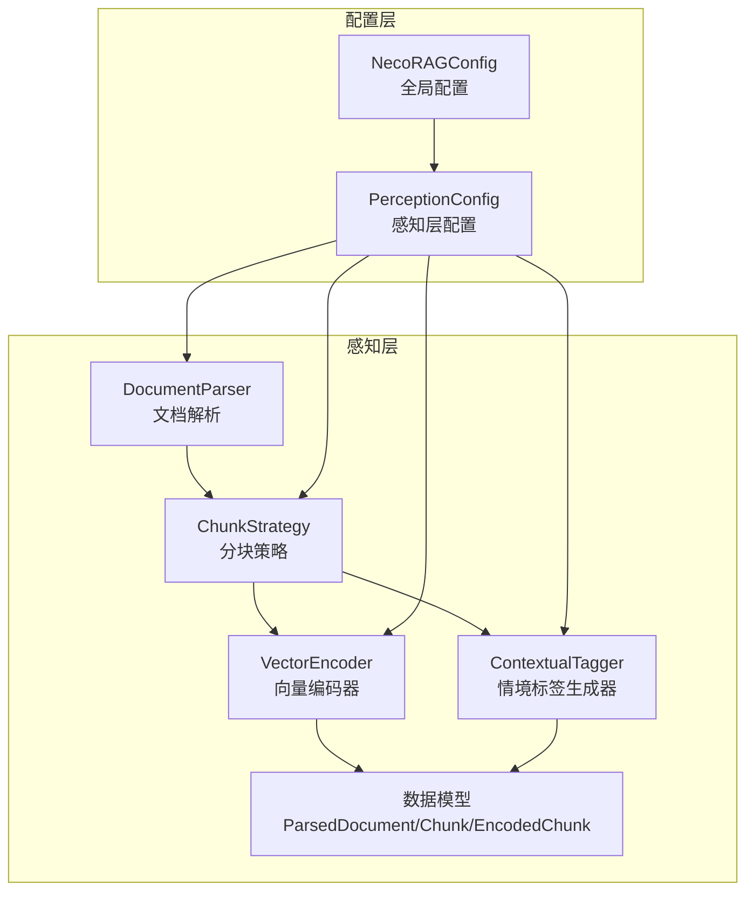
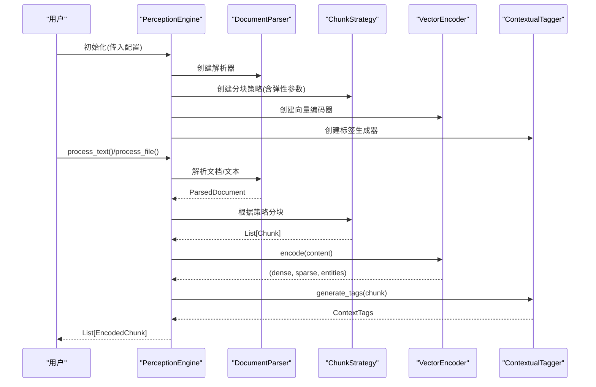
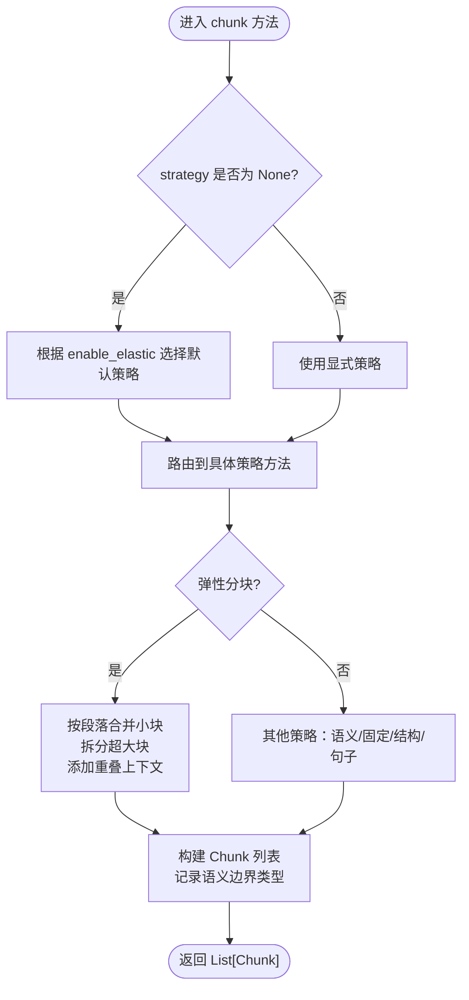
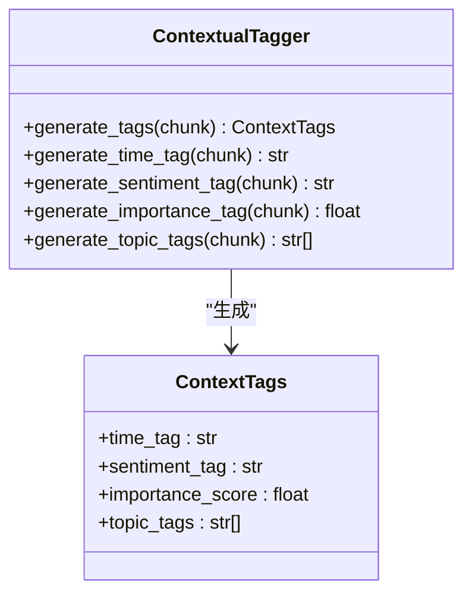
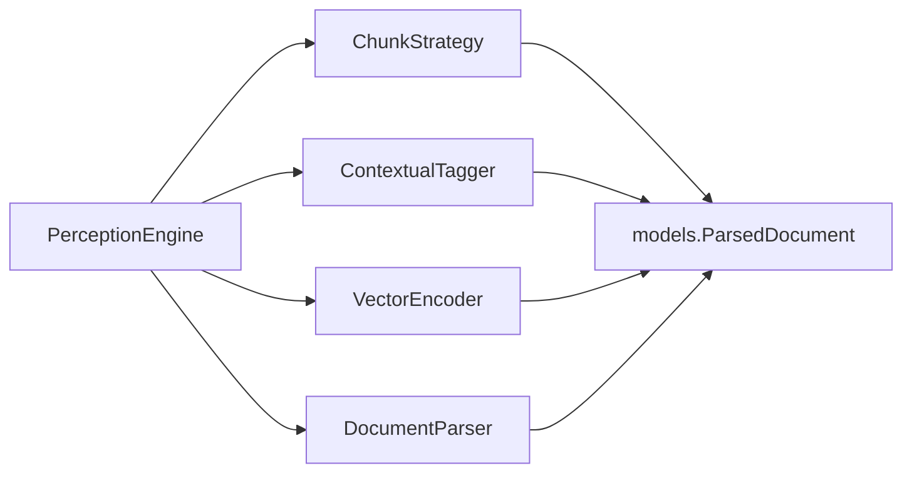

# 感知层配置

<cite>
**本文引用的文件**
- [src/perception/README.md](file://src/perception/README.md)
- [src/perception/__init__.py](file://src/perception/__init__.py)
- [src/perception/engine.py](file://src/perception/engine.py)
- [src/perception/chunker.py](file://src/perception/chunker.py)
- [src/perception/tagger.py](file://src/perception/tagger.py)
- [src/perception/parser.py](file://src/perception/parser.py)
- [src/perception/encoder.py](file://src/perception/encoder.py)
- [src/perception/models.py](file://src/perception/models.py)
- [src/core/config.py](file://src/core/config.py)
- [example/example_usage.py](file://example/example_usage.py)
- [src/dashboard/static/index.html](file://src/dashboard/static/index.html)
</cite>

## 目录
1. [简介](#简介)
2. [项目结构](#项目结构)
3. [核心组件](#核心组件)
4. [架构总览](#架构总览)
5. [详细组件分析](#详细组件分析)
6. [依赖关系分析](#依赖关系分析)
7. [性能考量](#性能考量)
8. [故障排查指南](#故障排查指南)
9. [结论](#结论)
10. [附录](#附录)

## 简介
本文件面向“感知层配置系统”，围绕感知层的核心配置项与实现进行系统化说明，重点覆盖以下方面：
- 分块策略配置：固定大小、语义分块、结构化分块、弹性分块、句子分块
- 弹性切割参数：最小块大小、目标块大小、最大块大小、语义边界优先级
- 标签生成配置：时间标签、情感标签、重要性标签、主题标签
- 文档格式支持：解析器支持的格式范围
- 不同分块策略的特点与适用场景
- 配置优化建议与性能调优指南

## 项目结构
感知层位于 src/perception 目录，包含解析、分块、编码、标签等核心模块，并通过统一的配置类进行集中管理。

图表来源
- [src/perception/engine.py:15-71](file://src/perception/engine.py#L15-L71)
- [src/core/config.py:105-131](file://src/core/config.py#L105-L131)

章节来源
- [src/perception/README.md:1-158](file://src/perception/README.md#L1-L158)
- [src/perception/__init__.py:1-23](file://src/perception/__init__.py#L1-L23)

## 核心组件
- PerceptionEngine：感知引擎主类，负责解析、分块、编码、打标的整体流程编排。
- ChunkStrategy：分块策略类，支持弹性分块、语义分块、固定大小分块、结构化分块、句子分块。
- ContextualTagger：情境标签生成器，为每个 Chunk 生成时间、情感、重要性、主题标签。
- VectorEncoder：向量编码器，生成稠密向量、稀疏向量与实体三元组。
- DocumentParser：文档解析器，负责将多格式文档转换为统一结构化表示。
- 数据模型：Chunk、ParsedDocument、EncodedChunk、ContextTags 等。

章节来源
- [src/perception/engine.py:15-174](file://src/perception/engine.py#L15-L174)
- [src/perception/chunker.py:11-566](file://src/perception/chunker.py#L11-L566)
- [src/perception/tagger.py:10-144](file://src/perception/tagger.py#L10-L144)
- [src/perception/encoder.py:24-254](file://src/perception/encoder.py#L24-L254)
- [src/perception/parser.py:11-112](file://src/perception/parser.py#L11-L112)
- [src/perception/models.py:11-69](file://src/perception/models.py#L11-L69)

## 架构总览
感知层配置通过 PerceptionConfig 集中管理，PerceptionEngine 在初始化时读取配置并实例化各子组件。整体流程如下：

图表来源
- [src/perception/engine.py:72-174](file://src/perception/engine.py#L72-L174)
- [src/perception/chunker.py:48-84](file://src/perception/chunker.py#L48-L84)
- [src/perception/encoder.py:72-86](file://src/perception/encoder.py#L72-L86)
- [src/perception/tagger.py:32-47](file://src/perception/tagger.py#L32-L47)

## 详细组件分析

### 分块策略配置与弹性切割参数
- 分块策略入口：统一由 ChunkStrategy.chunk(content, strategy) 调用，支持策略映射：
  - "elastic"：弹性分块
  - "semantic"：语义分块（按段落）
  - "fixed"：固定大小分块
  - "structural"：结构化分块（基于段落/标题等）
  - "sentence"：句子级分块
- 弹性分块核心参数：
  - min_chunk_size：最小块大小（字符），避免碎片化
  - target_chunk_size：目标块大小（字符），理想切割大小
  - max_chunk_size：最大块大小（字符），超过则强制切割
  - enable_elastic：是否启用弹性切割
  - semantic_boundaries：语义边界优先级列表（如 ["paragraph","sentence","clause"]）

图表来源
- [src/perception/chunker.py:48-140](file://src/perception/chunker.py#L48-L140)
- [src/perception/chunker.py:142-182](file://src/perception/chunker.py#L142-L182)
- [src/perception/chunker.py:184-215](file://src/perception/chunker.py#L184-L215)
- [src/perception/chunker.py:217-247](file://src/perception/chunker.py#L217-L247)
- [src/perception/chunker.py:249-264](file://src/perception/chunker.py#L249-L264)

章节来源
- [src/perception/chunker.py:18-46](file://src/perception/chunker.py#L18-L46)
- [src/perception/chunker.py:48-84](file://src/perception/chunker.py#L48-L84)

#### 弹性分块算法细节
- 步骤：
  1) 按段落分割
  2) 合并小于 min_chunk_size 的段落，尽量接近 target_chunk_size
  3) 对大于 max_chunk_size 的段落进行拆分，优先句子边界，其次子句边界，最后强制词边界
  4) 添加重叠上下文，构建 Chunk 对象并记录语义边界类型

章节来源
- [src/perception/chunker.py:88-140](file://src/perception/chunker.py#L88-L140)
- [src/perception/chunker.py:334-378](file://src/perception/chunker.py#L334-L378)
- [src/perception/chunker.py:380-432](file://src/perception/chunker.py#L380-L432)
- [src/perception/chunker.py:434-499](file://src/perception/chunker.py#L434-L499)
- [src/perception/chunker.py:501-537](file://src/perception/chunker.py#L501-L537)
- [src/perception/chunker.py:539-566](file://src/perception/chunker.py#L539-L566)

#### 句子级分块与结构化分块
- 句子级分块：按中英文标点进行句子分割，支持中文句号、感叹号、问号以及英文句号、感叹号、问号。
- 结构化分块：在语义分块基础上，将 metadata 中的策略标记更新为 "structural"。

章节来源
- [src/perception/chunker.py:285-313](file://src/perception/chunker.py#L285-L313)
- [src/perception/chunker.py:249-264](file://src/perception/chunker.py#L249-L264)

### 标签生成配置
- ContextualTagger 生成的 ContextTags 包括：
  - time_tag：时间标签（示例实现：从元数据中读取创建时间）
  - sentiment_tag：情感标签（示例实现：基于关键词计数判断正/负/中）
  - importance_score：重要性评分（示例实现：基于词多样性与长度因子的综合评分）
  - topic_tags：主题标签（示例实现：提取高频词作为主题标签）

图表来源
- [src/perception/tagger.py:10-144](file://src/perception/tagger.py#L10-L144)
- [src/perception/models.py:21-28](file://src/perception/models.py#L21-L28)

章节来源
- [src/perception/tagger.py:17-31](file://src/perception/tagger.py#L17-L31)
- [src/perception/tagger.py:32-47](file://src/perception/tagger.py#L32-L47)
- [src/perception/tagger.py:49-92](file://src/perception/tagger.py#L49-L92)
- [src/perception/tagger.py:94-119](file://src/perception/tagger.py#L94-L119)
- [src/perception/tagger.py:121-143](file://src/perception/tagger.py#L121-L143)

### 文档格式支持与解析
- DocumentParser 当前最小实现支持读取文本文件，解析为 ParsedDocument，并进行简单分块。
- supported_formats 在 PerceptionConfig 中定义，当前包含 txt、md、pdf、docx、html 等格式（注：实际解析能力可能需要集成 RAGFlow 或其他解析器）。

章节来源
- [src/perception/parser.py:11-59](file://src/perception/parser.py#L11-L59)
- [src/core/config.py:128-131](file://src/core/config.py#L128-L131)

### 向量编码与实体抽取
- VectorEncoder 支持：
  - 稠密向量：优先使用 LLM 客户端 embed/embed_batch，回退到内置确定性向量生成
  - 稀疏向量：基于 TF-IDF 风格的词频统计，归一化为权重字典
  - 实体三元组：基于简单规则匹配提取（如“A 是 B”、“A is B”等模式）
- 分词策略：中英文混合处理，中文按字符片段切分，英文按单词切分。

章节来源
- [src/perception/encoder.py:24-71](file://src/perception/encoder.py#L24-L71)
- [src/perception/encoder.py:88-118](file://src/perception/encoder.py#L88-L118)
- [src/perception/encoder.py:120-146](file://src/perception/encoder.py#L120-L146)
- [src/perception/encoder.py:148-189](file://src/perception/encoder.py#L148-L189)
- [src/perception/encoder.py:214-254](file://src/perception/encoder.py#L214-L254)

## 依赖关系分析
感知层内部模块之间的依赖关系如下：

图表来源
- [src/perception/engine.py:52-66](file://src/perception/engine.py#L52-L66)
- [src/perception/chunker.py](file://src/perception/chunker.py#L8)
- [src/perception/tagger.py](file://src/perception/tagger.py#L7)
- [src/perception/encoder.py](file://src/perception/encoder.py#L18)
- [src/perception/parser.py](file://src/perception/parser.py#L8)
- [src/perception/models.py:11-40](file://src/perception/models.py#L11-L40)

章节来源
- [src/perception/engine.py:15-71](file://src/perception/engine.py#L15-L71)

## 性能考量
- 分块策略选择：
  - 弹性分块适合长文档，能平衡语义完整性与块大小控制，减少碎片化与过度切割。
  - 固定大小分块简单高效，适合对吞吐量要求高的场景，但可能破坏语义边界。
  - 句子级分块适合需要细粒度检索的场景，但块数量较多，向量存储与检索成本上升。
  - 结构化分块在段落/标题层面保持结构信息，适合报告、论文等结构化文档。
- 弹性参数调优建议：
  - min_chunk_size：建议不低于 500-1000 字，避免过度碎片化。
  - target_chunk_size：建议与下游检索模型的上下文窗口相匹配（如 1024-2048）。
  - max_chunk_size：建议不超过 4-8KB，超过则强制切割，防止超长序列。
  - semantic_boundaries：优先 paragraph > sentence > clause，确保语义连贯。
- 标签生成：
  - 情感与主题标签为示例实现，建议结合专业模型提升准确性。
  - 重要性评分可结合业务指标（如关键词密度、信息熵）进行加权。
- 编码性能：
  - 批量编码（encode_dense_batch）可显著提升吞吐量。
  - 稀疏向量与实体抽取开销较低，适合实时场景。

[本节为通用性能指导，无需特定文件来源]

## 故障排查指南
- 分块异常：
  - 若出现大量极小块，检查 min_chunk_size 是否过大或段落过多导致合并失败。
  - 若出现超长块，检查 max_chunk_size 是否过小或语义边界优先级设置不当。
- 标签异常：
  - time_tag 为 unknown：确认 Chunk.metadata 中是否包含 created_at。
  - sentiment_tag 偏差较大：扩展关键词库或引入情感模型。
  - topic_tags 不准确：调整词频阈值与过滤规则。
- 编码异常：
  - 向量维度不一致：检查模型配置与向量维度设置。
  - 实体抽取为空：检查文本中是否存在符合规则的关系模式。
- 解析异常：
  - 文件不存在：确认文件路径与权限。
  - 格式不支持：当前最小实现仅支持文本文件，需集成 RAGFlow 或其他解析器。

章节来源
- [src/perception/parser.py:41-42](file://src/perception/parser.py#L41-L42)
- [src/perception/tagger.py:62-64](file://src/perception/tagger.py#L62-L64)
- [src/perception/encoder.py:98-103](file://src/perception/encoder.py#L98-L103)

## 结论
感知层配置系统通过 PerceptionConfig 集中管理分块策略、弹性参数、标签生成与文档格式支持，配合 PerceptionEngine 的统一编排，实现了从文档解析到编码打标的完整流水线。针对不同应用场景，建议：
- 长文档与知识库：优先弹性分块，合理设置 min/target/max 与语义边界优先级。
- 实时检索与高吞吐：采用固定大小分块或句子级分块，结合批量编码。
- 语义完整性优先：使用语义/结构化分块，适当增加 chunk_overlap。
- 标签质量：逐步替换为专业模型，提升情感、主题与重要性评分的准确性。

[本节为总结性内容，无需特定文件来源]

## 附录

### 配置参数一览（感知层）
- 分块基础参数
  - chunk_size：分块大小（字符数）
  - chunk_overlap：分块重叠长度
  - chunk_strategy：默认分块策略（fixed/semantic/structural/elastic/sentence）
- 弹性分块参数
  - min_chunk_size：最小块大小（字符）
  - target_chunk_size：目标块大小（字符）
  - max_chunk_size：最大块大小（字符）
  - enable_elastic_chunking：是否启用弹性分块
  - semantic_boundaries：语义边界优先级列表
- 标签生成开关
  - enable_time_tag：启用时间标签
  - enable_emotion_tag：启用情感标签
  - enable_importance_tag：启用重要性标签
  - enable_topic_tag：启用主题标签
- 文档格式支持
  - supported_formats：支持的文档格式列表

章节来源
- [src/core/config.py:105-131](file://src/core/config.py#L105-L131)

### 使用示例参考
- 在示例中通过 PerceptionEngine 初始化并处理文本，展示编码与标签生成的基本流程。

章节来源
- [example/example_usage.py:20-47](file://example/example_usage.py#L20-L47)

### 仪表盘参数映射
- 仪表盘页面中包含感知层相关参数的输入控件，便于可视化配置与调试。

章节来源
- [src/dashboard/static/index.html:508-527](file://src/dashboard/static/index.html#L508-L527)