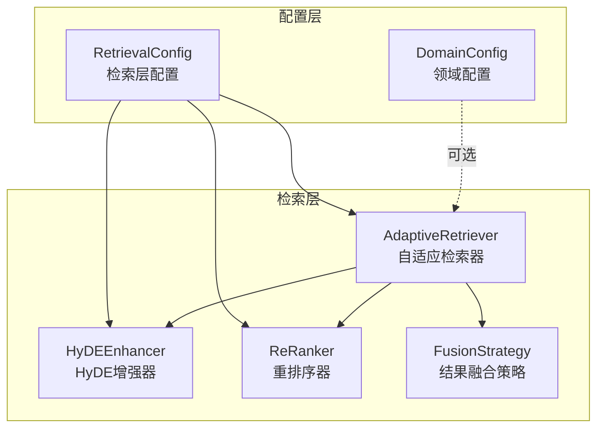
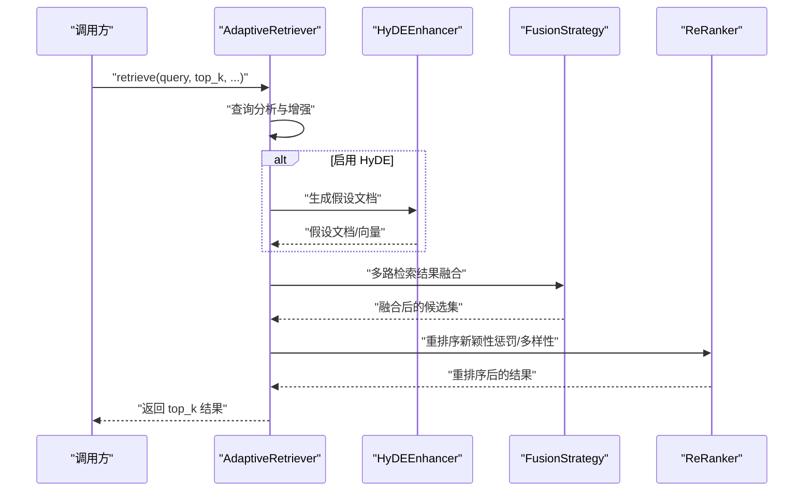
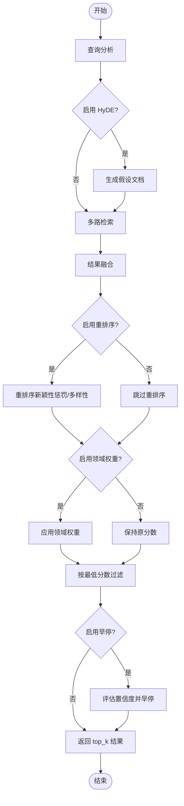
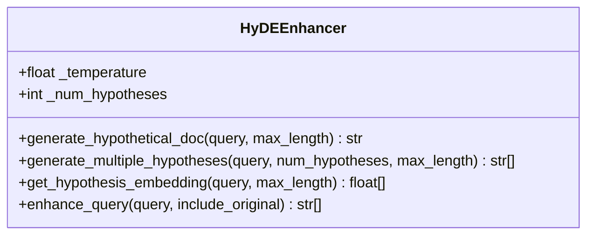
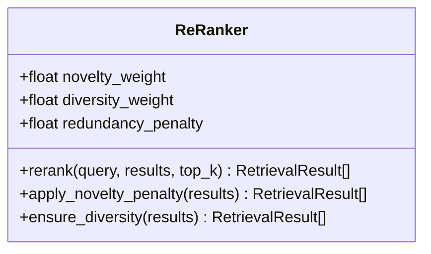
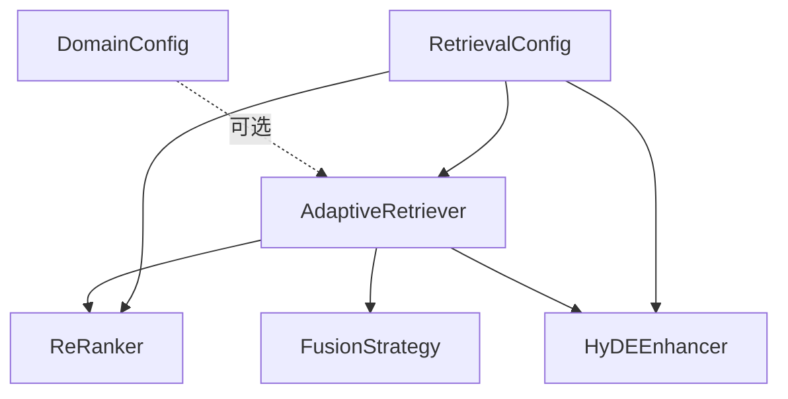

# 检索层配置

<cite>
**本文档引用的文件**
- [src/core/config.py](file://src/core/config.py)
- [src/retrieval/retriever.py](file://src/retrieval/retriever.py)
- [src/retrieval/reranker.py](file://src/retrieval/reranker.py)
- [src/retrieval/hyde.py](file://src/retrieval/hyde.py)
- [src/retrieval/fusion.py](file://src/retrieval/fusion.py)
- [src/domain/config.py](file://src/domain/config.py)
- [src/dashboard/models.py](file://src/dashboard/models.py)
- [src/dashboard/static/index.html](file://src/dashboard/static/index.html)
- [example/example_usage.py](file://example/example_usage.py)
</cite>

## 目录
1. [简介](#简介)
2. [项目结构](#项目结构)
3. [核心组件](#核心组件)
4. [架构总览](#架构总览)
5. [详细组件分析](#详细组件分析)
6. [依赖关系分析](#依赖关系分析)
7. [性能考量](#性能考量)
8. [故障排查指南](#故障排查指南)
9. [结论](#结论)
10. [附录](#附录)

## 简介
本文件聚焦于检索层配置系统，围绕 RetrievalConfig 类的各项参数进行深入解析，涵盖基础检索配置（默认返回数量、向量权重、图谱权重）、Pounce 早停机制配置（启用开关、置信度阈值、最小结果数）、HyDE 增强配置（启用开关、温度参数）、重排序配置（启用开关、返回数量、新颖性惩罚因子）。我们将结合代码实现与运行时行为，阐述各参数对检索效果的影响，并提供不同场景下的最优配置建议与性能调优指南。

## 项目结构
检索层配置位于统一配置体系之下，由全局配置类 NecoRAGConfig 组织，其中 retrieval 字段即为 RetrievalConfig。检索层核心组件包括自适应检索器 AdaptiveRetriever、HyDE 增强器 HyDEEnhancer、重排序器 ReRanker、结果融合策略 FusionStrategy，以及可选的领域权重计算模块（DomainConfig）。

图表来源
- [src/core/config.py:160-181](file://src/core/config.py#L160-L181)
- [src/retrieval/retriever.py:123-165](file://src/retrieval/retriever.py#L123-L165)
- [src/retrieval/hyde.py:17-49](file://src/retrieval/hyde.py#L17-L49)
- [src/retrieval/reranker.py:11-41](file://src/retrieval/reranker.py#L11-L41)
- [src/retrieval/fusion.py:9-16](file://src/retrieval/fusion.py#L9-L16)
- [src/domain/config.py:54-76](file://src/domain/config.py#L54-L76)

章节来源
- [src/core/config.py:160-181](file://src/core/config.py#L160-L181)
- [src/retrieval/retriever.py:123-165](file://src/retrieval/retriever.py#L123-L165)

## 核心组件
- RetrievalConfig：统一管理检索层参数，包括基础检索、早停机制、HyDE 增强、重排序等。
- AdaptiveRetriever：执行检索流程，包含查询分析、多路检索、结果融合、重排序、领域权重应用、早停判断等步骤。
- HyDEEnhancer：生成假设文档以增强检索，支持温度控制与多假设生成。
- ReRanker：基于 BGE-Reranker 思想的重排序器，集成新颖性惩罚与多样性保障。
- FusionStrategy：结果融合策略，支持 RRF 与加权融合。
- DomainConfig：领域配置，提供关键字权重、时间权重、领域权重等因子，用于加权评分。

章节来源
- [src/core/config.py:160-181](file://src/core/config.py#L160-L181)
- [src/retrieval/retriever.py:123-255](file://src/retrieval/retriever.py#L123-L255)
- [src/retrieval/hyde.py:17-121](file://src/retrieval/hyde.py#L17-L121)
- [src/retrieval/reranker.py:11-77](file://src/retrieval/reranker.py#L11-L77)
- [src/retrieval/fusion.py:9-71](file://src/retrieval/fusion.py#L9-L71)
- [src/domain/config.py:54-76](file://src/domain/config.py#L54-L76)

## 架构总览
检索层配置通过 NecoRAGConfig 注入到 AdaptiveRetriever 中，影响检索流程的关键节点。HyDE 增强器与重排序器作为可选组件参与检索后处理，领域权重模块在可选启用时对最终分数进行加权。

图表来源
- [src/retrieval/retriever.py:178-255](file://src/retrieval/retriever.py#L178-L255)
- [src/retrieval/hyde.py:58-84](file://src/retrieval/hyde.py#L58-L84)
- [src/retrieval/fusion.py:18-70](file://src/retrieval/fusion.py#L18-L70)
- [src/retrieval/reranker.py:42-77](file://src/retrieval/reranker.py#L42-L77)

## 详细组件分析

### RetrievalConfig 参数详解
RetrievalConfig 定义了检索层的统一参数，直接影响检索流程的行为与效果。

- 基础检索配置
  - default_top_k：默认返回数量。影响最终输出结果数量与下游处理开销。
  - vector_weight：向量检索权重。在多路检索融合时影响向量结果的相对重要性。
  - graph_weight：图谱检索权重。在启用图谱检索时影响图谱结果的相对重要性。
- Pounce 早停机制配置
  - enable_early_termination：是否启用早停。开启后可根据置信度提前终止，节省计算。
  - confidence_threshold：置信度阈值。阈值越高，越严格地要求置信度达标才提前返回。
  - min_results：最小结果数。即使置信度达标，也至少返回该数量的结果。
- HyDE 增强配置
  - enable_hyde：是否启用 HyDE 增强。启用后会生成假设文档参与检索。
  - hyde_temperature：生成温度。温度越高，生成的假设越多样化，但也可能降低相关性。
- 重排序配置
  - enable_rerank：是否启用重排序。重排序可显著提升结果质量，但增加计算成本。
  - rerank_top_k：重排序输入规模。较大的输入规模可提升重排序质量，但会增加耗时。
  - novelty_penalty：新颖性惩罚因子。用于抑制重复内容，提升多样性。

章节来源
- [src/core/config.py:160-181](file://src/core/config.py#L160-L181)

### AdaptiveRetriever 检索流程与参数影响
AdaptiveRetriever 在检索过程中体现上述配置的作用，关键流程如下：
- 查询分析与增强：可选的领域关键字增强与查询增强。
- 多路检索：向量检索与图谱检索（若存在实体）。
- 结果融合：采用 RRF 等策略融合多路结果。
- 重排序：应用新颖性惩罚与多样性保障。
- 领域权重：在可选启用时对分数进行加权。
- 过滤与早停：按最低分数过滤，并根据置信度进行早停。

图表来源
- [src/retrieval/retriever.py:178-255](file://src/retrieval/retriever.py#L178-L255)
- [src/retrieval/reranker.py:42-77](file://src/retrieval/reranker.py#L42-L77)
- [src/domain/config.py:54-76](file://src/domain/config.py#L54-L76)

章节来源
- [src/retrieval/retriever.py:178-255](file://src/retrieval/retriever.py#L178-L255)

### HyDEEnhancer 增强机制
HyDEEnhancer 通过生成假设文档来增强检索效果，主要参数：
- temperature：控制生成多样性。温度越高，生成越多样化，但可能降低与查询的相关性。
- num_hypotheses：生成假设数量。增加假设数量可提升召回，但也会增加计算与检索负担。
- llm_client：LLM 客户端。若为空则回退到规则生成。

图表来源
- [src/retrieval/hyde.py:17-121](file://src/retrieval/hyde.py#L17-L121)

章节来源
- [src/retrieval/hyde.py:17-121](file://src/retrieval/hyde.py#L17-L121)

### ReRanker 重排序策略
ReRanker 提供新颖性惩罚与多样性保障，关键参数：
- novelty_weight：新颖性权重。用于抑制重复内容，提升多样性。
- diversity_weight：多样性权重。与新颖性惩罚共同作用，平衡相关性与多样性。
- redundancy_penalty：冗余惩罚强度。控制重复内容的惩罚力度。

图表来源
- [src/retrieval/reranker.py:11-77](file://src/retrieval/reranker.py#L11-L77)

章节来源
- [src/retrieval/reranker.py:11-77](file://src/retrieval/reranker.py#L11-L77)

### FusionStrategy 融合策略
FusionStrategy 支持 RRF 与加权融合，影响多路检索结果的整合效果：
- reciprocal_rank_fusion：基于倒数排名的融合，适合不同检索器结果的稳健整合。
- weighted_fusion：按权重对不同来源结果进行加权融合，适合明确来源权重的场景。

章节来源
- [src/retrieval/fusion.py:9-128](file://src/retrieval/fusion.py#L9-L128)

### DomainConfig 领域权重
DomainConfig 提供领域权重因子与时间权重，用于对检索结果进行加权：
- keyword_factor：关键字权重因子
- temporal_factor：时间权重因子
- domain_factor：领域权重因子
- decay_rate：时间衰减系数
- core_domain_weight、related_domain_weight、peripheral_domain_weight、out_of_domain_weight：不同领域相关性的权重

章节来源
- [src/domain/config.py:54-76](file://src/domain/config.py#L54-L76)

## 依赖关系分析
检索层配置与组件之间的依赖关系如下：

图表来源
- [src/core/config.py:160-181](file://src/core/config.py#L160-L181)
- [src/retrieval/retriever.py:123-165](file://src/retrieval/retriever.py#L123-L165)
- [src/retrieval/reranker.py:11-41](file://src/retrieval/reranker.py#L11-L41)
- [src/retrieval/hyde.py:17-49](file://src/retrieval/hyde.py#L17-L49)
- [src/domain/config.py:54-76](file://src/domain/config.py#L54-L76)

章节来源
- [src/core/config.py:160-181](file://src/core/config.py#L160-L181)
- [src/retrieval/retriever.py:123-165](file://src/retrieval/retriever.py#L123-L165)

## 性能考量
- default_top_k：增大 top_k 会增加重排序与领域权重计算的成本，建议根据下游处理能力与 SLA 调整。
- rerank_top_k：重排序输入规模越大，质量越高但耗时越长。建议在保证质量的前提下尽量缩小输入规模。
- enable_rerank：重排序显著提升质量，但会增加延迟。对于实时性要求高的场景可考虑关闭或降低 rerank_top_k。
- enable_early_termination：早停机制可显著节省计算，但需合理设置阈值与最小结果数，避免过早返回导致召回不足。
- hyde_temperature：温度越高，生成越多样化，但可能降低与查询的相关性，建议在 0.3-0.7 之间试验。
- novelty_penalty：新颖性惩罚有助于减少重复，但过度惩罚可能导致相关性下降。建议与 diversity_weight 协同调参。
- vector_weight/graph_weight：在多路检索中平衡向量与图谱的重要性，建议通过 A/B 实验确定最优权重。

## 故障排查指南
- 检索结果过少
  - 检查 enable_early_termination 与 confidence_threshold 是否过高，适当降低阈值或关闭早停。
  - 检查 min_results 是否过大，适当降低最小结果数。
  - 检查 default_top_k 是否过小，适当增大以获得更丰富的候选集。
- 检索结果重复
  - 提升 novelty_penalty 与 diversity_weight，或增大 rerank_top_k 以改善重排序质量。
- 检索延迟过高
  - 关闭 enable_rerank 或降低 rerank_top_k。
  - 降低 default_top_k 与 rerank_top_k。
  - 关闭 enable_hyde 或降低 hyde_temperature。
- 领域权重未生效
  - 确认 DomainConfig 已正确设置并传入 AdaptiveRetriever。
  - 检查 apply_domain_weight 参数是否启用。

章节来源
- [src/retrieval/retriever.py:178-255](file://src/retrieval/retriever.py#L178-L255)
- [src/retrieval/reranker.py:42-77](file://src/retrieval/reranker.py#L42-L77)
- [src/domain/config.py:54-76](file://src/domain/config.py#L54-L76)

## 结论
RetrievalConfig 为检索层提供了全面而灵活的配置能力。通过合理设置基础检索、早停机制、HyDE 增强与重排序参数，可在准确性与效率之间取得平衡。建议结合业务场景与性能目标，采用渐进式调参策略，并利用 A/B 实验验证配置效果。

## 附录

### 不同场景下的配置建议
- 高召回场景（如问答系统初筛）
  - default_top_k：较大
  - enable_early_termination：关闭或提高阈值
  - enable_rerank：关闭或降低 rerank_top_k
  - enable_hyde：开启，适度提高 hyde_temperature
- 高质量场景（如专家问答）
  - default_top_k：中等
  - enable_early_termination：开启，合理设置阈值与最小结果数
  - enable_rerank：开启，适当增大 rerank_top_k
  - enable_hyde：开启，适度降低 hyde_temperature
- 低延迟场景（如实时对话）
  - default_top_k：较小
  - enable_early_termination：开启，严格阈值
  - enable_rerank：关闭或极小 rerank_top_k
  - enable_hyde：关闭或关闭

### 参数与效果映射参考
- default_top_k：影响候选集规模与下游处理成本
- vector_weight/graph_weight：影响多路检索的相对权重
- enable_early_termination/confidence_threshold/min_results：影响早停触发与返回数量
- enable_hyde/hyde_temperature：影响假设生成的多样性与相关性
- enable_rerank/rerank_top_k/novelty_penalty：影响重排序质量与多样性

章节来源
- [src/core/config.py:160-181](file://src/core/config.py#L160-L181)
- [src/retrieval/retriever.py:178-255](file://src/retrieval/retriever.py#L178-L255)
- [src/retrieval/reranker.py:42-77](file://src/retrieval/reranker.py#L42-L77)
- [src/retrieval/hyde.py:17-121](file://src/retrieval/hyde.py#L17-L121)