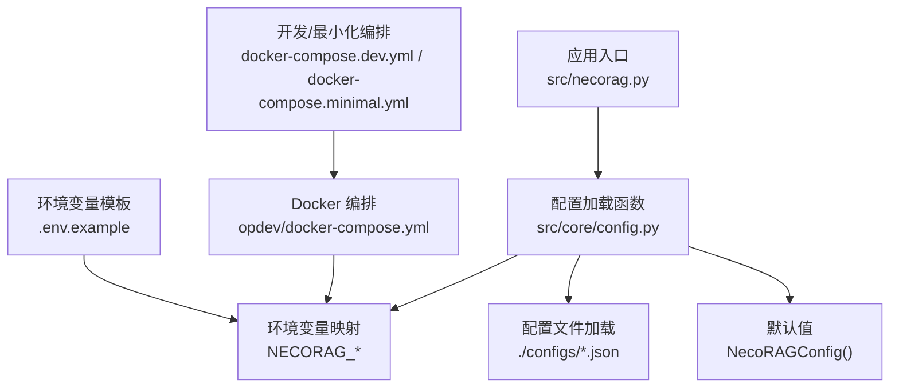
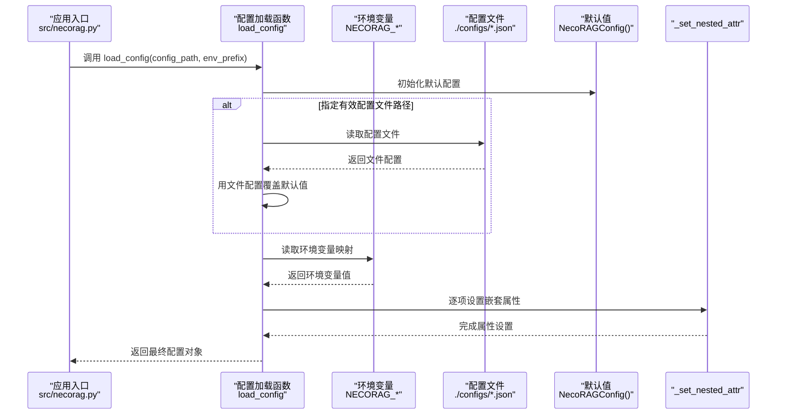
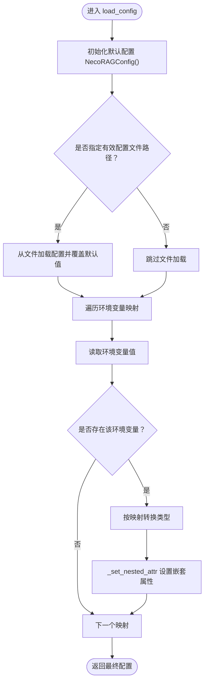
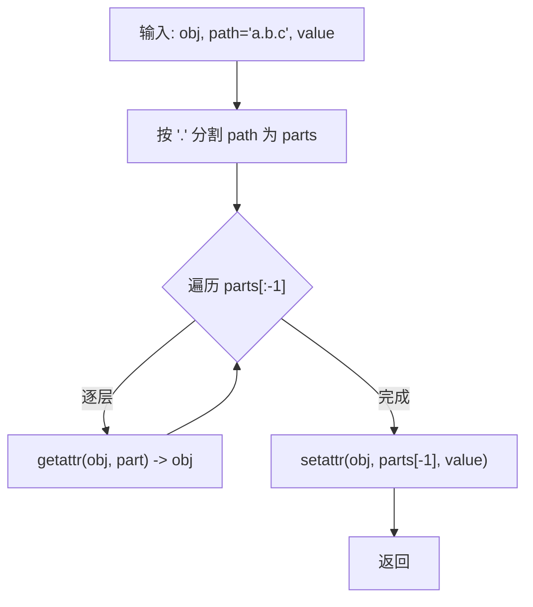
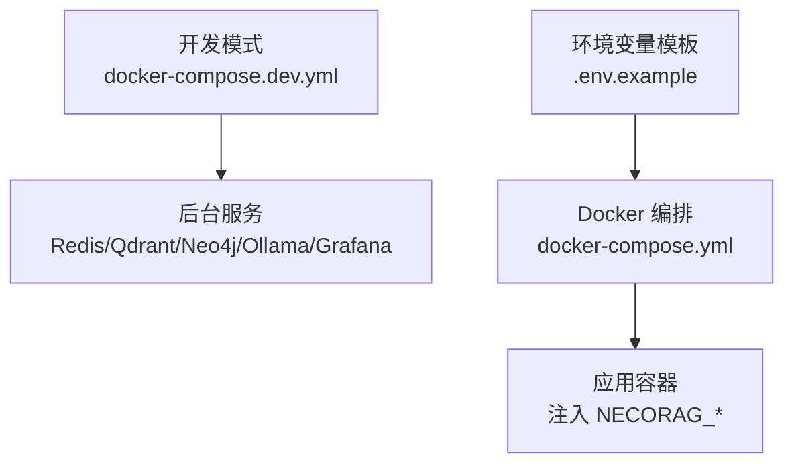
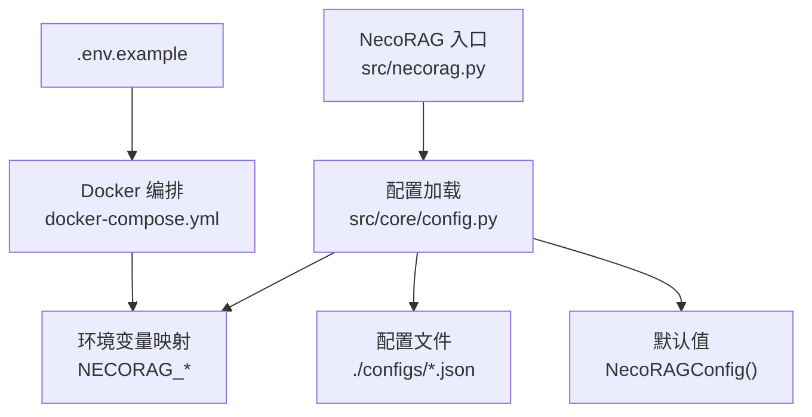

# 环境变量配置

<cite>
**本文档引用的文件**
- [src/core/config.py](file://src/core/config.py)
- [src/necorag.py](file://src/necorag.py)
- [opdev/docker-compose.yml](file://opdev/docker-compose.yml)
- [opdev/.env.example](file://opdev/.env.example)
- [opdev/docker-compose.dev.yml](file://opdev/docker-compose.dev.yml)
- [opdev/docker-compose.minimal.yml](file://opdev/docker-compose.minimal.yml)
- [opdev/scripts/start.sh](file://opdev/scripts/start.sh)
- [README.md](file://README.md)
</cite>

## 目录
1. [简介](#简介)
2. [项目结构](#项目结构)
3. [核心组件](#核心组件)
4. [架构总览](#架构总览)
5. [详细组件分析](#详细组件分析)
6. [依赖分析](#依赖分析)
7. [性能考虑](#性能考虑)
8. [故障排查指南](#故障排查指南)
9. [结论](#结论)
10. [附录](#附录)

## 简介
本文件面向 NecoRAG 的环境变量配置系统，重点围绕 load_config 函数的环境变量加载机制进行深入解析，包括：
- 环境变量前缀（NECORAG）
- 优先级规则（环境变量 > 配置文件 > 默认值）
- 嵌套属性设置机制
- 支持的环境变量清单与命名规范
- 如何通过环境变量覆盖全局配置与模块配置
- 不同部署环境下的配置示例与最佳实践

## 项目结构
与环境变量配置直接相关的核心位置如下：
- 配置加载与映射：src/core/config.py
- 应用入口与默认配置：src/necorag.py
- Docker 编排与环境变量注入：opdev/docker-compose.yml、opdev/.env.example、opdev/docker-compose.dev.yml、opdev/docker-compose.minimal.yml、opdev/scripts/start.sh
- 项目总体说明与使用指南：README.md

图表来源
- [src/necorag.py:80](file://src/necorag.py#L80)
- [src/core/config.py:326-365](file://src/core/config.py#L326-L365)
- [opdev/docker-compose.yml:130-138](file://opdev/docker-compose.yml#L130-L138)
- [opdev/.env.example:1-32](file://opdev/.env.example#L1-L32)

章节来源
- [src/core/config.py:326-365](file://src/core/config.py#L326-L365)
- [opdev/docker-compose.yml:130-138](file://opdev/docker-compose.yml#L130-L138)
- [opdev/.env.example:1-32](file://opdev/.env.example#L1-L32)

## 核心组件
- 配置加载函数 load_config：负责从文件、环境变量、默认值三个来源加载配置，并按优先级合并。
- 嵌套属性设置器 _set_nested_attr：支持对嵌套字段（如 llm.provider、memory.vector_db_provider）进行赋值。
- 预设配置 ConfigPresets：提供开发、生产、最小化等预设，便于快速切换环境。

章节来源
- [src/core/config.py:326-365](file://src/core/config.py#L326-L365)
- [src/core/config.py:368-374](file://src/core/config.py#L368-L374)
- [src/core/config.py:378-408](file://src/core/config.py#L378-L408)

## 架构总览
环境变量配置的加载流程遵循“环境变量 > 配置文件 > 默认值”的优先级顺序。Docker 编排通过 environment 字段将环境变量注入容器，从而影响应用的配置行为。

图表来源
- [src/necorag.py:80](file://src/necorag.py#L80)
- [src/core/config.py:326-365](file://src/core/config.py#L326-L365)
- [src/core/config.py:368-374](file://src/core/config.py#L368-L374)

## 详细组件分析

### load_config 函数与环境变量加载机制
- 优先级：环境变量 > 配置文件 > 默认值
- 环境变量前缀：默认为 NECORAG，可通过参数 env_prefix 覆盖
- 映射规则：将环境变量名映射到配置对象的点号路径（如 llm.provider），并进行类型转换（如枚举、布尔）

图表来源
- [src/core/config.py:326-365](file://src/core/config.py#L326-L365)
- [src/core/config.py:368-374](file://src/core/config.py#L368-L374)

章节来源
- [src/core/config.py:326-365](file://src/core/config.py#L326-L365)

### 嵌套属性设置机制
_set_nested_attr 通过点号路径逐层定位目标属性并设置值，确保可以对嵌套的数据类进行细粒度覆盖。

图表来源
- [src/core/config.py:368-374](file://src/core/config.py#L368-L374)

章节来源
- [src/core/config.py:368-374](file://src/core/config.py#L368-L374)

### 支持的环境变量与命名规范
- 命名规范：NECORAG_ + 大写字段名（下划线分隔），例如 NECORAG_LLM_PROVIDER
- 支持的映射项（来自环境变量映射表）：
  - NECORAG_DEBUG：布尔值（true/false）
  - NECORAG_LLM_PROVIDER：枚举（LLMProvider）
  - NECORAG_LLM_MODEL：字符串（模型名称）
  - NECORAG_LLM_API_KEY：字符串（API 密钥）
  - NECORAG_VECTOR_DB：枚举（VectorDBProvider）
  - NECORAG_VECTOR_DB_URL：字符串（向量数据库连接地址）
  - NECORAG_GRAPH_DB：枚举（GraphDBProvider）
  - NECORAG_GRAPH_DB_URL：字符串（图数据库连接地址）

章节来源
- [src/core/config.py:349-358](file://src/core/config.py#L349-L358)

### 如何通过环境变量覆盖全局配置与模块配置
- 全局配置：NECORAG_DEBUG
- 模块配置：
  - LLM：NECORAG_LLM_PROVIDER、NECORAG_LLM_MODEL、NECORAG_LLM_API_KEY
  - 记忆层：NECORAG_VECTOR_DB、NECORAG_VECTOR_DB_URL、NECORAG_GRAPH_DB、NECORAG_GRAPH_DB_URL

这些映射通过点号路径直接作用于 NecoRAGConfig 的子对象（如 llm、memory）。

章节来源
- [src/core/config.py:349-358](file://src/core/config.py#L349-L358)

### 不同部署环境下的配置示例与最佳实践

#### 开发环境（本地/容器）
- 使用 docker-compose.dev.yml 仅启动后台服务，应用容器默认不启动，便于本地运行。
- 通过 .env.example 设置端口与认证信息；LLM Provider 可设置为 mock 或 ollama。
- 在 docker-compose.yml 的 necorag 服务中，NECORAG_* 环境变量会被注入。

图表来源
- [opdev/docker-compose.dev.yml:1-15](file://opdev/docker-compose.dev.yml#L1-L15)
- [opdev/.env.example:1-32](file://opdev/.env.example#L1-L32)
- [opdev/docker-compose.yml:130-138](file://opdev/docker-compose.yml#L130-L138)

章节来源
- [opdev/docker-compose.dev.yml:1-15](file://opdev/docker-compose.dev.yml#L1-L15)
- [opdev/.env.example:1-32](file://opdev/.env.example#L1-L32)
- [opdev/docker-compose.yml:130-138](file://opdev/docker-compose.yml#L130-L138)

#### 测试/生产环境
- 生产预设：ConfigPresets.production 提供默认生产配置（如启用重排序、增加精炼迭代次数等）。
- 建议通过环境变量覆盖关键参数（如 LLM 提供商、数据库连接），并在 CI/CD 中注入相应变量。

章节来源
- [src/core/config.py:391-396](file://src/core/config.py#L391-L396)

#### 最小化部署
- 使用 docker-compose.minimal.yml 仅启动 Redis 与 Qdrant，适合快速验证与资源受限场景。
- 在该模式下仍可通过环境变量控制 LLM 与数据库连接。

章节来源
- [opdev/docker-compose.minimal.yml:1-32](file://opdev/docker-compose.minimal.yml#L1-L32)

#### Docker 启动脚本与环境变量
- scripts/start.sh 会检查 .env 文件并根据参数选择启动模式（full/dev/minimal/--with-llm）。
- 脚本会在缺少 .env 时创建模板文件，便于快速开始。

章节来源
- [opdev/scripts/start.sh:1-79](file://opdev/scripts/start.sh#L1-L79)

## 依赖分析
- 应用入口依赖配置加载函数与预设配置，以决定默认行为与初始化参数。
- Docker 编排依赖环境变量模板与服务端口映射，确保应用容器能够正确连接后端服务。

图表来源
- [src/necorag.py:80](file://src/necorag.py#L80)
- [src/core/config.py:326-365](file://src/core/config.py#L326-L365)
- [opdev/docker-compose.yml:130-138](file://opdev/docker-compose.yml#L130-L138)
- [opdev/.env.example:1-32](file://opdev/.env.example#L1-L32)

章节来源
- [src/necorag.py:80](file://src/necorag.py#L80)
- [src/core/config.py:326-365](file://src/core/config.py#L326-L365)
- [opdev/docker-compose.yml:130-138](file://opdev/docker-compose.yml#L130-L138)
- [opdev/.env.example:1-32](file://opdev/.env.example#L1-L32)

## 性能考虑
- 环境变量读取与类型转换开销极低，通常可忽略。
- 建议在容器化部署中集中管理环境变量，减少重复配置与错误。
- 对于大型配置文件，优先通过环境变量覆盖关键参数，避免全量文件变更带来的维护成本。

## 故障排查指南
- 环境变量未生效
  - 检查环境变量前缀是否正确（默认 NECORAG）
  - 确认映射项名称与点号路径一致（如 llm.provider）
  - 验证类型转换是否符合预期（如枚举值必须在允许集合内）
- 配置文件冲突
  - 若同时提供了配置文件与环境变量，环境变量优先覆盖文件中的对应项
  - 确认配置文件路径有效且可读
- Docker 环境变量注入
  - 确认 docker-compose.yml 中的 environment 字段已正确注入
  - 检查 .env 文件是否存在且包含所需变量

章节来源
- [src/core/config.py:326-365](file://src/core/config.py#L326-L365)
- [opdev/docker-compose.yml:130-138](file://opdev/docker-compose.yml#L130-L138)
- [opdev/.env.example:1-32](file://opdev/.env.example#L1-L32)

## 结论
NecoRAG 的环境变量配置系统以 load_config 为核心，通过明确的优先级与清晰的命名规范，实现了灵活、可移植的配置管理。结合 Docker 编排与预设配置，可在不同环境中快速切换并稳定运行。建议在团队内统一环境变量命名与类型约定，并在 CI/CD 中集中管理，以提升可维护性与安全性。

## 附录

### 环境变量清单与含义
- NECORAG_DEBUG：布尔值，开启调试模式
- NECORAG_LLM_PROVIDER：枚举，LLM 提供商（如 mock/openai/ollama/vllm/azure/anthropic）
- NECORAG_LLM_MODEL：字符串，模型名称
- NECORAG_LLM_API_KEY：字符串，API 密钥
- NECORAG_VECTOR_DB：枚举，向量数据库提供商（memory/qdrant/milvus/chroma）
- NECORAG_VECTOR_DB_URL：字符串，向量数据库连接地址
- NECORAG_GRAPH_DB：枚举，图数据库提供商（memory/neo4j/nebula）
- NECORAG_GRAPH_DB_URL：字符串，图数据库连接地址

章节来源
- [src/core/config.py:349-358](file://src/core/config.py#L349-L358)

### 部署环境模板与最佳实践
- 开发环境：使用 docker-compose.dev.yml 与 .env.example，LLM Provider 可设为 mock 或 ollama
- 最小化部署：使用 docker-compose.minimal.yml，仅启动 Redis 与 Qdrant
- 生产环境：参考 ConfigPresets.production，默认启用重排序与更高精炼迭代次数，通过环境变量覆盖关键参数

章节来源
- [opdev/docker-compose.dev.yml:1-15](file://opdev/docker-compose.dev.yml#L1-L15)
- [opdev/docker-compose.minimal.yml:1-32](file://opdev/docker-compose.minimal.yml#L1-L32)
- [src/core/config.py:391-396](file://src/core/config.py#L391-L396)