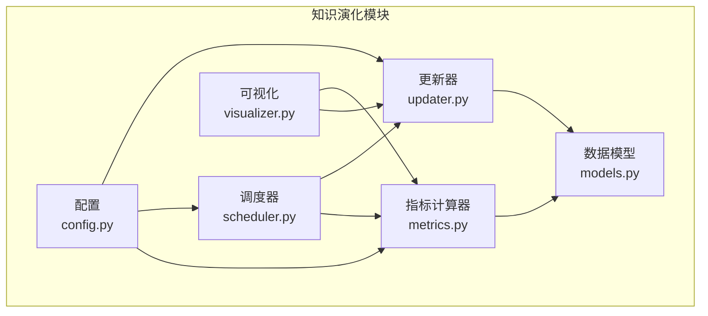
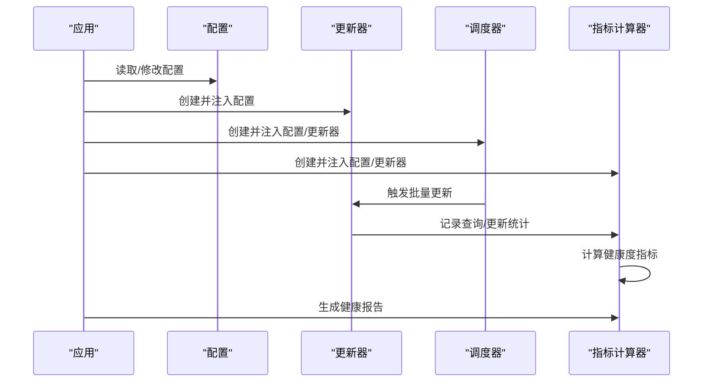
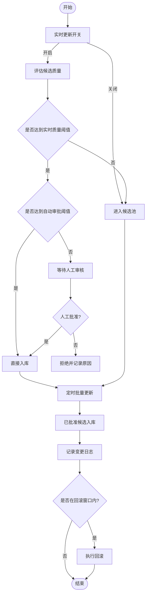
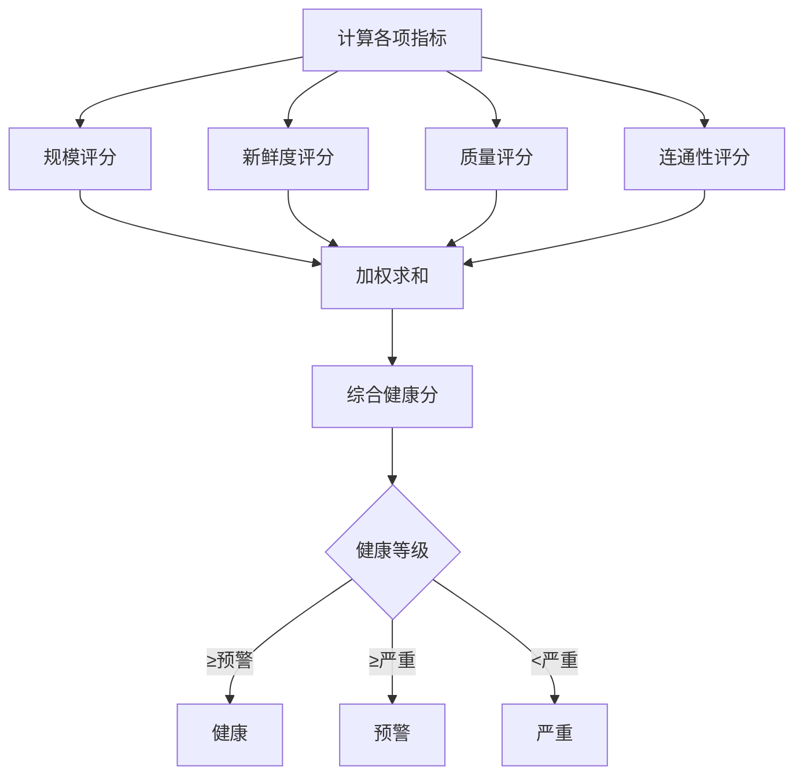
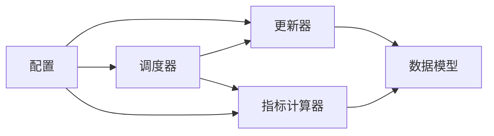

# 知识演化配置

<cite>
**本文档引用的文件**
- [config.py](file://src/knowledge_evolution/config.py)
- [models.py](file://src/knowledge_evolution/models.py)
- [scheduler.py](file://src/knowledge_evolution/scheduler.py)
- [updater.py](file://src/knowledge_evolution/updater.py)
- [metrics.py](file://src/knowledge_evolution/metrics.py)
- [__init__.py](file://src/knowledge_evolution/__init__.py)
- [design.md](file://design/design.md)
</cite>

## 目录
1. [简介](#简介)
2. [项目结构](#项目结构)
3. [核心组件](#核心组件)
4. [架构概览](#架构概览)
5. [详细组件分析](#详细组件分析)
6. [依赖分析](#依赖分析)
7. [性能考量](#性能考量)
8. [故障排查指南](#故障排查指南)
9. [结论](#结论)
10. [附录](#附录)

## 简介
本文件面向知识演化配置系统，围绕 KnowledgeEvolutionConfig 类的参数与工作机制展开，系统性解释以下方面：
- 实时更新配置（启用开关、质量阈值、自动审批阈值）
- 定时更新配置（启用开关、批量更新间隔、索引重建间隔）
- 变更日志配置（启用开关、回滚功能、回滚窗口）
- 健康度阈值（预警阈值、严重预警阈值）
- 查询驱动知识积累配置（启用开关、高质量回答积累、最低回答置信度、知识缺口检测）
- 知识演化的阶段与自动化机制
- 健康监控指标的含义与阈值设置原则
- 知识管理最佳实践与配置优化建议

## 项目结构
知识演化模块位于 src/knowledge_evolution 目录，包含配置、数据模型、调度器、更新器、指标计算器与可视化组件。模块通过便捷工厂函数统一创建并启动各子系统。

图表来源
- [config.py:15-222](file://src/knowledge_evolution/config.py#L15-L222)
- [models.py:1-367](file://src/knowledge_evolution/models.py#L1-L367)
- [scheduler.py:124-688](file://src/knowledge_evolution/scheduler.py#L124-L688)
- [updater.py:24-855](file://src/knowledge_evolution/updater.py#L24-L855)
- [metrics.py:21-725](file://src/knowledge_evolution/metrics.py#L21-L725)
- [__init__.py:56-93](file://src/knowledge_evolution/__init__.py#L56-L93)

章节来源
- [__init__.py:1-133](file://src/knowledge_evolution/__init__.py#L1-L133)

## 核心组件
- KnowledgeEvolutionConfig：集中定义知识库更新与演化的全部配置项，并提供默认、积极、保守、最小化四套预设策略及校验逻辑。
- KnowledgeUpdater：负责实时更新、批量更新、候选池管理、变更日志与查询驱动知识积累。
- UpdateScheduler：负责定时批量更新、索引重建、指标计算等周期性任务的调度执行。
- KnowledgeMetricsCalculator：负责知识库量化指标计算、健康度评分与健康报告生成。
- 数据模型：定义更新模式、状态、知识来源、候选状态、变更日志、指标、健康报告、查询记录、增长趋势等数据结构。

章节来源
- [config.py:15-222](file://src/knowledge_evolution/config.py#L15-L222)
- [models.py:14-367](file://src/knowledge_evolution/models.py#L14-L367)
- [scheduler.py:124-688](file://src/knowledge_evolution/scheduler.py#L124-L688)
- [updater.py:24-855](file://src/knowledge_evolution/updater.py#L24-L855)
- [metrics.py:21-725](file://src/knowledge_evolution/metrics.py#L21-L725)

## 架构概览
知识演化系统采用“配置驱动 + 组件协作”的架构。配置贯穿更新器、调度器与指标计算器，三者通过统一的数据模型进行数据交换；可视化组件消费指标与更新状态，提供运营视角的洞察。

图表来源
- [__init__.py:56-93](file://src/knowledge_evolution/__init__.py#L56-L93)
- [scheduler.py:124-688](file://src/knowledge_evolution/scheduler.py#L124-L688)
- [updater.py:24-855](file://src/knowledge_evolution/updater.py#L24-L855)
- [metrics.py:21-725](file://src/knowledge_evolution/metrics.py#L21-L725)

## 详细组件分析

### KnowledgeEvolutionConfig 参数详解
- 实时更新配置
  - enable_realtime_update：是否启用实时更新。开启后，新知识可直接入库；关闭后进入候选池等待审核。
  - realtime_quality_threshold：实时入库最低质量分（0~1）。低于该阈值的候选会被拒绝并进入候选池。
  - candidate_pool_max_size：候选池最大容量，超过容量会按综合评分清理低分条目。
  - auto_approve_threshold：自动审批阈值（0~1）。高于该阈值的候选可跳过人工审核直接入库。
- 定时更新配置
  - enable_scheduled_update：是否启用定时批量更新。
  - batch_update_interval：批量更新间隔（秒），默认24小时，最小1小时。
  - batch_update_time：每日批量更新时间（HH:MM），默认凌晨3点。
  - index_rebuild_interval：索引重建间隔（秒），默认7天。
- 变更日志配置
  - enable_change_log：是否启用变更日志。
  - change_log_max_entries：变更日志最大条目数，默认1万。
  - enable_rollback：是否支持回滚。
  - rollback_window_hours：回滚窗口（小时），默认72小时。
- 量化指标配置
  - metrics_calculation_interval：指标计算间隔（秒），默认1小时，最小60秒。
  - health_warning_threshold：健康预警阈值（0~100），默认60。
  - health_critical_threshold：健康严重阈值（0~100），默认40。
  - metrics_history_limit：指标历史保留数量，默认720（约30天按1小时粒度）。
- 查询日志配置
  - enable_query_logging：是否启用查询日志。
  - query_log_max_entries：查询日志最大条目数，默认1万。
  - hit_threshold：命中阈值（相似度），用于判断检索命中。
- 权重配置（健康度计算）
  - scale_weight：规模指标权重，默认0.2。
  - freshness_weight：新鲜度权重，默认0.3。
  - quality_weight：质量权重，默认0.3。
  - connectivity_weight：连通性权重，默认0.2。
  - 注意：权重之和需等于1.0。
- 评分配置（候选评估）
  - relevance_weight：相关性评分权重，默认0.4。
  - novelty_weight：新颖性评分权重，默认0.3。
  - credibility_weight：可信度评分权重，默认0.3。
  - 注意：权重之和需等于1.0。
- 查询驱动知识积累配置
  - enable_query_driven_accumulation：是否启用查询驱动知识积累。
  - accumulate_high_quality_answers：是否积累高质量回答。
  - min_answer_confidence：最低回答置信度（0~1），默认0.8。
  - gap_detection_enabled：是否启用知识缺口检测。

章节来源
- [config.py:23-67](file://src/knowledge_evolution/config.py#L23-L67)
- [config.py:168-214](file://src/knowledge_evolution/config.py#L168-L214)

### 知识演化阶段与自动化机制
- 实时更新阶段
  - 输入：新知识内容、来源、目标层级、元数据。
  - 流程：评估候选质量（相关性、新颖性、可信度）→ 计算综合评分 → 判断是否达到实时质量阈值 → 达到则自动审批入库；否则进入候选池。
  - 自动化：当 auto_approve_threshold 达到时，候选可直接入库，无需人工干预。
- 定时批量更新阶段
  - 触发：按 batch_update_interval 或 batch_update_time 定时执行。
  - 流程：扫描候选池中已批准的候选 → 逐条入库 → 统计处理结果 → 更新任务状态。
  - 自动化：由调度器自动调度，减少人工干预。
- 增量更新与回滚
  - 增量更新：支持 L2 语义向量与 L3 情景图谱的增量导入。
  - 回滚：基于变更日志在回滚窗口内执行回滚操作，记录回滚日志。
- 查询驱动知识积累
  - 机制：查询完成后记录查询日志与证据，若命中率低且满足置信度要求，将高质量回答加入候选池，形成知识闭环。
  - 知识缺口检测：对未命中的查询进行统计，识别高频知识缺口。

图表来源
- [updater.py:82-132](file://src/knowledge_evolution/updater.py#L82-L132)
- [updater.py:407-493](file://src/knowledge_evolution/updater.py#L407-L493)
- [updater.py:617-685](file://src/knowledge_evolution/updater.py#L617-L685)

章节来源
- [updater.py:82-132](file://src/knowledge_evolution/updater.py#L82-L132)
- [updater.py:407-493](file://src/knowledge_evolution/updater.py#L407-L493)
- [updater.py:617-685](file://src/knowledge_evolution/updater.py#L617-L685)

### 健康监控指标与阈值设置原则
- 指标类别与含义
  - 规模指标：知识条目总数、L1/L2/L3分布、向量覆盖率。
  - 新鲜度指标：平均知识年龄、最近更新率、最旧/最新条目年龄。
  - 质量指标：检索命中率、碎片率（孤立节点比例）、平均相关性评分。
  - 健康度指标：权重区间分布、冗余度、综合健康分（0~100）。
  - 更新指标：当日总更新数、实时/批量更新数、待审核候选数。
  - 查询统计：当日查询总数、命中/未命中数。
- 健康度评分公式
  - health_score = w1×scale + w2×freshness + w3×quality + w4×connectivity
  - 权重默认为 0.2, 0.3, 0.3, 0.2，且和为1.0。
- 阈值设置原则
  - health_warning_threshold：建议设置为60~70，作为“需要关注”的预警线。
  - health_critical_threshold：建议设置为40~50，作为“需要立即处理”的严重线。
  - 逻辑约束：健康严重阈值必须小于预警阈值，以保证分级合理。
- 设计文档佐证
  - 设计文档明确健康度评分公式与权重分配，并给出规模、新鲜度、质量、连通性的计算思路。

图表来源
- [metrics.py:413-446](file://src/knowledge_evolution/metrics.py#L413-L446)
- [metrics.py:508-572](file://src/knowledge_evolution/metrics.py#L508-L572)
- [design.md:435-456](file://design/design.md#L435-L456)

章节来源
- [metrics.py:413-446](file://src/knowledge_evolution/metrics.py#L413-L446)
- [metrics.py:508-572](file://src/knowledge_evolution/metrics.py#L508-L572)
- [design.md:435-456](file://design/design.md#L435-L456)

### 预设配置策略
- 默认策略：平衡质量与效率，适合大多数场景。
- 积极策略：降低质量与审批阈值，提高入库频率，适合数据丰富、需要快速迭代的场景。
- 保守策略：提高质量与审批阈值，严格控制入库质量，适合对准确性要求极高的场景。
- 最小配置：禁用定时更新、变更日志与查询驱动积累，适合轻量部署或测试环境。

章节来源
- [config.py:94-166](file://src/knowledge_evolution/config.py#L94-L166)

### 调度器与任务管理
- 支持的任务类型：批量更新、索引重建、指标计算。
- 调度方式：间隔调度与每日固定时间调度。
- 线程安全：使用后台线程轮询检查任务到期情况。
- APScheduler 集成：可选使用 APScheduler 作为更专业的调度后端。

章节来源
- [scheduler.py:124-688](file://src/knowledge_evolution/scheduler.py#L124-L688)

### 数据模型与状态流转
- 更新模式：实时、定时批量、事件触发。
- 更新状态：待处理、进行中、已完成、失败、跳过。
- 候选状态：待审核、已批准、已拒绝、自动批准。
- 变更日志：记录插入、更新、删除、归档等操作，支持回滚。
- 指标与报告：包含规模、新鲜度、质量、连通性等维度，以及健康等级与建议。

章节来源
- [models.py:14-367](file://src/knowledge_evolution/models.py#L14-L367)

## 依赖分析
- 组件耦合
  - KnowledgeUpdater 依赖 KnowledgeEvolutionConfig 与记忆管理器，负责候选评估、入库与变更日志。
  - UpdateScheduler 依赖 KnowledgeEvolutionConfig 与 KnowledgeUpdater/KnowledgeMetricsCalculator，负责周期性任务调度。
  - KnowledgeMetricsCalculator 依赖 KnowledgeEvolutionConfig 与记忆管理器，负责指标计算与健康报告。
  - 可视化组件依赖指标计算器与更新器，提供运营视角的可视化。
- 外部依赖
  - APScheduler 可选集成，用于更强大的调度能力。
  - 记忆管理器接口抽象，便于替换底层存储实现。

图表来源
- [config.py:15-222](file://src/knowledge_evolution/config.py#L15-L222)
- [updater.py:24-855](file://src/knowledge_evolution/updater.py#L24-L855)
- [scheduler.py:124-688](file://src/knowledge_evolution/scheduler.py#L124-L688)
- [metrics.py:21-725](file://src/knowledge_evolution/metrics.py#L21-L725)

## 性能考量
- 候选池容量与清理策略：合理设置 candidate_pool_max_size 与自动清理比例，避免内存膨胀。
- 指标计算缓存：指标计算器内置缓存与TTL，减少重复计算开销。
- 批量更新粒度：根据数据量与资源情况调整 batch_update_interval，避免长时间批处理阻塞。
- 回滚窗口与日志上限：控制 change_log_max_entries 与 rollback_window_hours，平衡审计需求与存储成本。
- 查询日志与缺口检测：适度限制 query_log_max_entries，避免查询驱动积累带来的额外写放大。

## 故障排查指南
- 配置校验失败
  - 现象：抛出配置校验错误。
  - 排查：检查阈值范围、权重和之和、间隔下限、健康阈值逻辑关系。
- 候选池溢出
  - 现象：候选池达到上限被清理。
  - 排查：降低 auto_approve_threshold 或提升 candidate_pool_max_size，或加快审核节奏。
- 回滚失败
  - 现象：回滚窗口超期或未启用回滚。
  - 排查：确认 enable_rollback 与 rollback_window_hours 设置，检查日志条目是否已执行过回滚。
- 指标异常
  - 现象：健康度评分异常波动。
  - 排查：检查权重设置、指标历史长度、查询日志与更新统计是否正确传入。

章节来源
- [config.py:168-214](file://src/knowledge_evolution/config.py#L168-L214)
- [updater.py:341-357](file://src/knowledge_evolution/updater.py#L341-L357)
- [updater.py:617-685](file://src/knowledge_evolution/updater.py#L617-L685)
- [metrics.py:66-134](file://src/knowledge_evolution/metrics.py#L66-L134)

## 结论
KnowledgeEvolutionConfig 为知识库的持续更新与演化提供了全面而灵活的配置基础。通过合理的阈值与权重设置、完善的候选池与变更日志机制、以及自动化的调度与指标监控，系统能够在保证质量的前提下高效扩展知识库。建议结合业务场景选择合适的预设策略，并根据健康度报告与运营指标持续优化配置。

## 附录
- 配置保存与加载：支持将配置序列化为 JSON 文件，便于版本化管理与迁移。
- 预设策略：默认、积极、保守、最小化四种策略，满足不同部署与运维需求。
- 可视化：通过可视化组件展示健康报告、增长趋势与查询统计，辅助运营决策。

章节来源
- [config.py:69-91](file://src/knowledge_evolution/config.py#L69-L91)
- [config.py:94-166](file://src/knowledge_evolution/config.py#L94-L166)
- [__init__.py:56-93](file://src/knowledge_evolution/__init__.py#L56-L93)