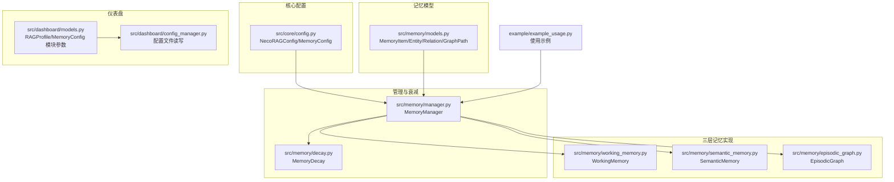
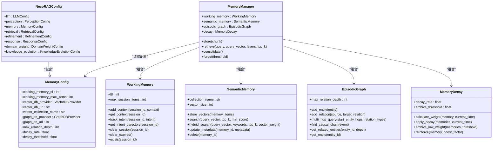
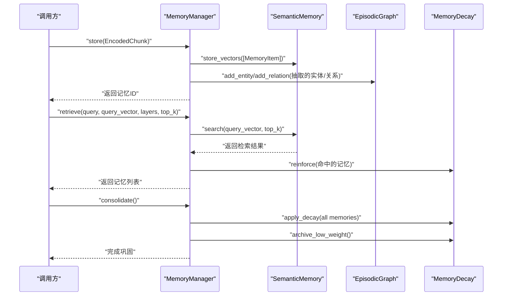
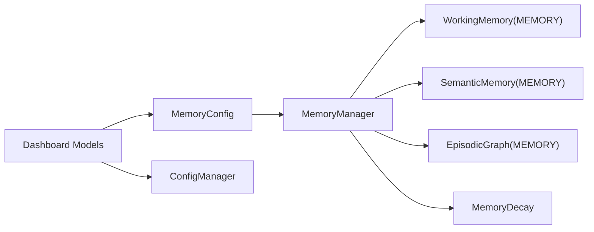

# 记忆层配置

<cite>
**本文引用的文件**
- [src/core/config.py](file://src/core/config.py)
- [src/memory/models.py](file://src/memory/models.py)
- [src/memory/working_memory.py](file://src/memory/working_memory.py)
- [src/memory/semantic_memory.py](file://src/memory/semantic_memory.py)
- [src/memory/episodic_graph.py](file://src/memory/episodic_graph.py)
- [src/memory/manager.py](file://src/memory/manager.py)
- [src/memory/decay.py](file://src/memory/decay.py)
- [src/dashboard/models.py](file://src/dashboard/models.py)
- [src/dashboard/config_manager.py](file://src/dashboard/config_manager.py)
- [example/example_usage.py](file://example/example_usage.py)
</cite>

## 目录
1. [简介](#简介)
2. [项目结构](#项目结构)
3. [核心组件](#核心组件)
4. [架构总览](#架构总览)
5. [详细组件分析](#详细组件分析)
6. [依赖分析](#依赖分析)
7. [性能考虑](#性能考虑)
8. [故障排查指南](#故障排查指南)
9. [结论](#结论)
10. [附录](#附录)

## 简介
本文件面向“记忆层配置系统”，围绕 MemoryConfig 类及其相关实现，系统阐述三层记忆（L1 工作记忆、L2 语义记忆、L3 情景图谱）的配置参数、数据库提供商选择标准、配置差异与使用场景，并给出内存优化与性能调优建议。文档同时结合代码中的最小实现与可扩展点，帮助读者在开发与生产环境中做出合理配置决策。

## 项目结构
与记忆层配置直接相关的代码主要分布在以下模块：
- 核心配置与全局配置：src/core/config.py
- 记忆数据模型：src/memory/models.py
- 三层记忆实现（最小实现）：src/memory/working_memory.py、src/memory/semantic_memory.py、src/memory/episodic_graph.py
- 记忆管理器：src/memory/manager.py
- 衰减机制：src/memory/decay.py
- 控制台仪表盘配置模型：src/dashboard/models.py、src/dashboard/config_manager.py
- 使用示例：example/example_usage.py

图表来源
- [src/core/config.py:136-156](file://src/core/config.py#L136-L156)
- [src/memory/models.py:19-67](file://src/memory/models.py#L19-L67)
- [src/memory/working_memory.py:11-120](file://src/memory/working_memory.py#L11-L120)
- [src/memory/semantic_memory.py:21-179](file://src/memory/semantic_memory.py#L21-L179)
- [src/memory/episodic_graph.py:10-194](file://src/memory/episodic_graph.py#L10-L194)
- [src/memory/manager.py:16-195](file://src/memory/manager.py#L16-L195)
- [src/memory/decay.py:11-155](file://src/memory/decay.py#L11-L155)
- [src/dashboard/models.py:68-92](file://src/dashboard/models.py#L68-L92)
- [src/dashboard/config_manager.py:14-315](file://src/dashboard/config_manager.py#L14-L315)
- [example/example_usage.py:50-91](file://example/example_usage.py#L50-L91)

章节来源
- [src/core/config.py:136-156](file://src/core/config.py#L136-L156)
- [src/memory/models.py:19-67](file://src/memory/models.py#L19-L67)
- [src/memory/working_memory.py:11-120](file://src/memory/working_memory.py#L11-L120)
- [src/memory/semantic_memory.py:21-179](file://src/memory/semantic_memory.py#L21-L179)
- [src/memory/episodic_graph.py:10-194](file://src/memory/episodic_graph.py#L10-L194)
- [src/memory/manager.py:16-195](file://src/memory/manager.py#L16-L195)
- [src/memory/decay.py:11-155](file://src/memory/decay.py#L11-L155)
- [src/dashboard/models.py:68-92](file://src/dashboard/models.py#L68-L92)
- [src/dashboard/config_manager.py:14-315](file://src/dashboard/config_manager.py#L14-L315)
- [example/example_usage.py:50-91](file://example/example_usage.py#L50-L91)

## 核心组件
本节聚焦 MemoryConfig 的参数与作用域，以及与之配套的 Provider 枚举与全局配置加载机制。

- MemoryConfig 参数说明
  - L1 工作记忆配置
    - working_memory_ttl：会话级记忆的生存时间（秒），用于控制短期上下文保留时长
    - working_memory_max_items：单会话最大条目数，用于限制短期记忆规模
  - L2 语义记忆配置
    - vector_db_provider：向量数据库提供商（MEMORY/QDRANT/MILVUS/CHROMA）
    - vector_db_url：向量数据库连接地址（可选）
    - vector_collection_name：向量集合名称（默认值已内置）
  - L3 情景图谱配置
    - graph_db_provider：图数据库提供商（MEMORY/NEO4J/NEBULA）
    - graph_db_url：图数据库连接地址（可选）
    - max_relation_depth：最大关系深度，用于多跳查询与因果链条追踪
  - 衰减配置
    - decay_rate：衰减速率，控制权重随时间衰减的速度
    - decay_threshold：归档阈值，低于该权重的记忆会被归档或修剪

- Provider 枚举与选择标准
  - 向量数据库提供商（VectorDBProvider）
    - MEMORY：内存实现，适合开发/测试与小规模数据
    - QDRANT：企业级向量数据库，支持高维向量与复杂检索
    - MILVUS：开源向量数据库，适合大规模向量检索
    - CHROMA：轻量级向量库，便于本地部署
  - 图数据库提供商（GraphDBProvider）
    - MEMORY：内存实现，适合开发/测试与小规模图谱
    - NEO4J：成熟图数据库，功能完备，适合复杂关系建模
    - NEBULA：开源图数据库，具备高吞吐能力

- 全局配置加载与环境变量覆盖
  - 支持从配置文件与环境变量加载，MemoryConfig 的关键字段可通过环境变量覆盖
  - 环境变量映射包含向量/图数据库提供商与连接地址等

章节来源
- [src/core/config.py:136-156](file://src/core/config.py#L136-L156)
- [src/core/config.py:28-41](file://src/core/config.py#L28-L41)
- [src/core/config.py:326-365](file://src/core/config.py#L326-L365)

## 架构总览
三层记忆在 MemoryManager 中统一编排，配合 MemoryDecay 实现权重动态调整与归档。

图表来源
- [src/core/config.py:136-156](file://src/core/config.py#L136-L156)
- [src/memory/manager.py:16-47](file://src/memory/manager.py#L16-L47)
- [src/memory/decay.py:11-38](file://src/memory/decay.py#L11-L38)
- [src/memory/working_memory.py:11-35](file://src/memory/working_memory.py#L11-L35)
- [src/memory/semantic_memory.py:21-49](file://src/memory/semantic_memory.py#L21-L49)
- [src/memory/episodic_graph.py:10-29](file://src/memory/episodic_graph.py#L10-L29)

## 详细组件分析

### MemoryConfig 参数详解与配置要点
- L1 工作记忆（TTL、最大项目数）
  - TTL：控制短期会话上下文与意图轨迹的保留时间，数值越大，短期记忆越持久；数值越小，越接近即时遗忘
  - 最大项目数：限制单会话内可存储的上下文条目，防止短期记忆无限膨胀
  - 适用场景：对话系统、任务流上下文、临时提示与中间结果
- L2 语义记忆（向量数据库提供商、连接URL、集合名称）
  - 提供商选择：MEMORY 适合开发/测试；QDRANT/MILVUS/CHROMA 适合生产
  - 连接URL：当提供商非 MEMORY 时需正确配置连接信息
  - 集合名称：用于隔离不同业务或环境的数据
  - 适用场景：模糊检索、语义相似度匹配、关键词混合检索
- L3 情景图谱（图数据库提供商、连接URL、最大关系深度）
  - 提供商选择：MEMORY 适合开发/测试；NEO4J/NEBULA 适合复杂关系建模
  - 连接URL：非 MEMORY 时必须配置
  - 最大关系深度：影响多跳查询与因果链条追踪的广度，数值越大，推理能力越强但计算成本越高
  - 适用场景：因果链条、实体关联、多跳推理、知识图谱应用
- 衰减配置（衰减率、阈值）
  - 衰减率：越大，权重随时间衰减越快；越小，长期记忆越稳定
  - 归档阈值：越小，越容易归档低价值记忆；越大，保留更多历史记忆
  - 适用场景：知识巩固、主动遗忘、长期记忆管理

章节来源
- [src/core/config.py:136-156](file://src/core/config.py#L136-L156)
- [src/core/config.py:28-41](file://src/core/config.py#L28-L41)

### 三层记忆配置差异与使用场景
- L1（工作记忆）：极低延迟、TTL 过期、会话级上下文与意图轨迹
- L2（语义记忆）：高维向量存储、混合检索、模糊匹配
- L3（情景图谱）：实体关系网络、多跳推理、因果链条追踪
- 使用场景建议
  - 小规模/开发：三者均可用 MEMORY 提供商
  - 生产检索增强：L2 使用 QDRANT/MILVUS/CHROMA，L3 使用 NEO4J/NEBULA
  - 复杂推理：提升 L3 的 max_relation_depth，结合图谱分析

章节来源
- [src/memory/working_memory.py:11-20](file://src/memory/working_memory.py#L11-L20)
- [src/memory/semantic_memory.py:21-30](file://src/memory/semantic_memory.py#L21-L30)
- [src/memory/episodic_graph.py:10-19](file://src/memory/episodic_graph.py#L10-L19)

### 数据库提供商选择标准
- 向量数据库（L2）
  - MEMORY：开发/测试、小数据量
  - QDRANT：企业级、高维向量、复杂检索
  - MILVUS：开源、大规模向量检索
  - CHROMA：轻量、本地部署友好
- 图数据库（L3）
  - MEMORY：开发/测试、小规模图谱
  - NEO4J：成熟生态、功能完备
  - NEBULA：开源、高吞吐

章节来源
- [src/core/config.py:28-41](file://src/core/config.py#L28-L41)

### 记忆管理器与衰减机制
- MemoryManager
  - 统一编排 L1/L2/L3，负责存储、检索、巩固与主动遗忘
  - 存储：将编码块写入 L2 语义记忆，并抽取实体关系写入 L3 图谱
  - 检索：对 L2 向量进行检索，结合访问强化与权重衰减
  - 巩固/遗忘：批量应用衰减，按阈值归档或主动遗忘
- MemoryDecay
  - 权重衰减公式：随时间指数衰减并叠加访问频率因子
  - 归档阈值：低于阈值的记忆被归档/删除
  - 强化：检索命中后提升权重与访问计数

图表来源
- [src/memory/manager.py:48-147](file://src/memory/manager.py#L48-L147)
- [src/memory/semantic_memory.py:50-118](file://src/memory/semantic_memory.py#L50-L118)
- [src/memory/decay.py:72-94](file://src/memory/decay.py#L72-L94)

章节来源
- [src/memory/manager.py:16-195](file://src/memory/manager.py#L16-L195)
- [src/memory/decay.py:11-155](file://src/memory/decay.py#L11-L155)

### 记忆项与图谱模型
- MemoryItem：包含内容、层级、向量、元数据、权重、访问计数与时间戳
- Entity/Relation/GraphPath：实体、关系与图谱路径结构，支持多跳查询与因果链条

章节来源
- [src/memory/models.py:19-67](file://src/memory/models.py#L19-L67)

### 仪表盘配置模型与参数映射
- RAGProfile/MemoryConfig 模块参数
  - 包含 L1/TTL、L1 最大会话条目、L1 LRU 最大尺寸
  - 包含 L2 向量维度、集合名、索引类型
  - 包含 L3 最大关系深度、是否启用因果图
  - 包含衰减率、归档阈值、巩固周期等
- 配置文件读写与 Profile 管理
  - 支持创建、激活、复制、导入/导出、更新与删除 Profile
  - 通过 JSON 文件持久化

章节来源
- [src/dashboard/models.py:68-92](file://src/dashboard/models.py#L68-L92)
- [src/dashboard/config_manager.py:14-315](file://src/dashboard/config_manager.py#L14-L315)

## 依赖分析
- MemoryConfig 作为 NecoRAGConfig 的一部分，被 MemoryManager 读取以初始化各层记忆组件
- WorkingMemory/SemanticMemory/EpisodicGraph 为最小实现，实际部署时由具体 Provider 替换
- MemoryDecay 与 MemoryManager 协同，实现权重动态调整与归档策略
- 仪表盘模块提供参数化配置与持久化能力，便于运维与调试

图表来源
- [src/core/config.py:136-156](file://src/core/config.py#L136-L156)
- [src/memory/manager.py:16-47](file://src/memory/manager.py#L16-L47)
- [src/memory/decay.py:11-38](file://src/memory/decay.py#L11-L38)
- [src/dashboard/models.py:68-92](file://src/dashboard/models.py#L68-L92)
- [src/dashboard/config_manager.py:14-315](file://src/dashboard/config_manager.py#L14-L315)

章节来源
- [src/core/config.py:136-156](file://src/core/config.py#L136-L156)
- [src/memory/manager.py:16-47](file://src/memory/manager.py#L16-L47)
- [src/memory/decay.py:11-38](file://src/memory/decay.py#L11-L38)
- [src/dashboard/models.py:68-92](file://src/dashboard/models.py#L68-L92)
- [src/dashboard/config_manager.py:14-315](file://src/dashboard/config_manager.py#L14-L315)

## 性能考虑
- L1
  - TTL 与最大项目数直接影响内存占用与清理频率，建议根据会话长度与并发量调优
  - MEMORY 实现适合小规模，若并发高建议评估外部缓存方案
- L2
  - 向量维度与集合规模决定索引与检索成本，建议在生产环境使用 QDRANT/MILVUS/CHROMA
  - 合理设置 top_k 与最小分数阈值，减少无效检索
  - 混合检索（向量+关键词）可提升召回质量，但会增加计算开销
- L3
  - 最大关系深度与多跳查询复杂度呈正相关，建议分层限制 hop 数
  - 图谱规模增长时，注意节点/关系数量与索引策略
- 衰减与归档
  - 衰减率与归档阈值影响长期记忆稳定性与存储压力，建议定期评估与调整
  - 主动遗忘可释放资源，但需平衡信息保留需求

## 故障排查指南
- 配置未生效
  - 检查环境变量前缀与键名是否正确（如向量/图数据库提供商与连接地址）
  - 确认配置文件路径与权限
- 记忆检索异常
  - 确认向量维度与嵌入模型一致
  - 检查集合名称与索引是否正确
- 图谱查询无结果
  - 检查实体/关系注入是否成功
  - 调整最大关系深度与关系类型过滤
- 记忆持续增长
  - 检查衰减率与归档阈值设置
  - 观察主动遗忘频率与效果

章节来源
- [src/core/config.py:326-365](file://src/core/config.py#L326-L365)
- [src/memory/semantic_memory.py:50-118](file://src/memory/semantic_memory.py#L50-L118)
- [src/memory/episodic_graph.py:71-126](file://src/memory/episodic_graph.py#L71-L126)
- [src/memory/decay.py:96-118](file://src/memory/decay.py#L96-L118)

## 结论
MemoryConfig 为三层记忆提供了统一入口与关键参数，结合 Provider 枚举与最小实现，既满足开发/测试需求，又为生产部署预留了扩展空间。通过合理设置 TTL、最大项目数、向量/图数据库提供商、最大关系深度与衰减参数，可在准确性、性能与资源消耗之间取得平衡。建议在生产环境中优先采用成熟的向量与图数据库，并结合仪表盘进行参数化管理与持久化配置。

## 附录
- 使用示例参考：通过 MemoryManager 展示存储、检索、巩固与遗忘流程
- 仪表盘配置参考：通过 RAGProfile/MemoryConfig 模块参数进行参数化配置与 Profile 管理

章节来源
- [example/example_usage.py:50-91](file://example/example_usage.py#L50-L91)
- [src/dashboard/models.py:68-92](file://src/dashboard/models.py#L68-L92)
- [src/dashboard/config_manager.py:14-315](file://src/dashboard/config_manager.py#L14-L315)