# 配置管理

<cite>
**本文引用的文件**
- [src/core/config.py](file://src/core/config.py)
- [src/dashboard/config_manager.py](file://src/dashboard/config_manager.py)
- [src/dashboard/models.py](file://src/dashboard/models.py)
- [src/domain/config.py](file://src/domain/config.py)
- [src/intent/config.py](file://src/intent/config.py)
- [src/knowledge_evolution/config.py](file://src/knowledge_evolution/config.py)
- [src/security/config.py](file://src/security/config.py)
- [src/security/models.py](file://src/security/models.py)
- [src/monitoring/config.py](file://src/monitoring/config.py)
- [src/plugins/manager.py](file://src/plugins/manager.py)
- [src/plugins/registry.py](file://src/plugins/registry.py)
- [src/plugins/base.py](file://src/plugins/base.py)
- [src/plugins/example_plugins.py](file://src/plugins/example_plugins.py)
- [src/core/exceptions.py](file://src/core/exceptions.py)
- [src/dashboard/README.md](file://src/dashboard/README.md)
- [README.md](file://README.md)
- [tests/conftest.py](file://tests/conftest.py)
- [tests/test_core/test_config.py](file://tests/test_core/test_config.py)
- [tests/test_core/test_protocols.py](file://tests/test_core/test_protocols.py)
- [tests/test_integration/test_necorag.py](file://tests/test_integration/test_necorag.py)
- [test_init.py](file://test_init.py)
</cite>

## 更新摘要
**变更内容**
- 新增安全配置模块，包含 JWT、OAuth2、速率限制、CSRF/XSS 防护等安全机制
- 新增监控配置模块，支持指标收集、健康检查、告警管理、通知渠道配置
- 新增插件配置模块，提供插件生命周期管理、依赖解析和事件处理
- 扩展配置验证与错误处理策略，增加安全配置验证和监控配置校验
- 更新测试配置系统，增加安全、监控、插件相关的测试夹具

## 目录
1. [简介](#简介)
2. [项目结构](#项目结构)
3. [核心组件](#核心组件)
4. [架构总览](#架构总览)
5. [详细组件分析](#详细组件分析)
6. [新增模块配置管理](#新增模块配置管理)
7. [测试配置系统](#测试配置系统)
8. [依赖分析](#依赖分析)
9. [性能考虑](#性能考虑)
10. [故障排查指南](#故障排查指南)
11. [结论](#结论)
12. [附录](#附录)

## 简介
本文件面向配置管理系统，系统性阐述全局配置与模块特定配置的设计、环境变量支持与优先级、动态配置更新机制、预设配置模式、配置验证与错误处理策略，以及配置迁移与版本管理最佳实践。特别关注新增的安全配置、监控配置和插件配置模块，展示了如何通过统一的配置管理框架支持企业级应用的安全性、可观测性和扩展性。

## 项目结构
配置管理涉及四大层面：
- 核心配置层：统一的全局配置与各子系统配置类，支持从文件与环境变量加载，提供预设配置模式。
- Dashboard 配置层：基于 Profile 的模块化配置管理，支持创建、切换、导入导出、参数校验与持久化。
- **新增安全配置层**：提供 JWT 认证、OAuth2 集成、速率限制、CSRF/XSS 防护等安全机制的配置管理。
- **新增监控配置层**：支持指标收集、健康检查、告警管理、通知渠道配置的监控系统。
- **新增插件配置层**：提供插件生命周期管理、依赖解析、事件处理的插件系统配置。
- **测试配置层**：通过 pytest fixtures 提供标准化的配置测试夹具，支持单元测试、集成测试和端到端测试。

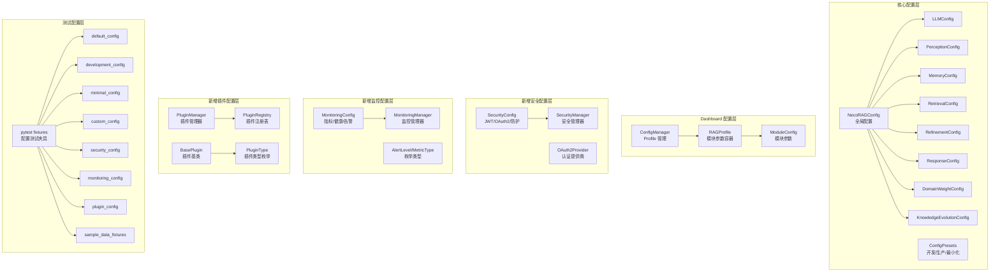

**图表来源**
- [src/core/config.py:266-318](file://src/core/config.py#L266-L318)
- [src/core/config.py:375-405](file://src/core/config.py#L375-L405)
- [src/dashboard/config_manager.py:14-41](file://src/dashboard/config_manager.py#L14-L41)
- [src/dashboard/models.py:165-220](file://src/dashboard/models.py#L165-L220)
- [src/security/config.py:11-87](file://src/security/config.py#L11-L87)
- [src/monitoring/config.py:27-117](file://src/monitoring/config.py#L27-L117)
- [src/plugins/manager.py:14-286](file://src/plugins/manager.py#L14-L286)
- [src/plugins/registry.py:15-257](file://src/plugins/registry.py#L15-L257)
- [tests/conftest.py:48-81](file://tests/conftest.py#L48-L81)

**章节来源**
- [src/core/config.py:266-318](file://src/core/config.py#L266-L318)
- [src/dashboard/config_manager.py:14-41](file://src/dashboard/config_manager.py#L14-L41)
- [src/dashboard/models.py:165-220](file://src/dashboard/models.py#L165-L220)
- [src/security/config.py:11-87](file://src/security/config.py#L11-L87)
- [src/monitoring/config.py:27-117](file://src/monitoring/config.py#L27-L117)
- [src/plugins/manager.py:14-286](file://src/plugins/manager.py#L14-L286)
- [src/plugins/registry.py:15-257](file://src/plugins/registry.py#L15-L257)
- [tests/conftest.py:48-81](file://tests/conftest.py#L48-L81)

## 核心组件
- 全局配置类 NecoRAGConfig：聚合各子系统配置，提供从字典/文件加载、保存、预设配置等能力。
- 子系统配置类：LLM、感知、记忆、检索、巩固、响应、领域权重、知识演化等，均继承统一的 BaseConfig，具备 to_dict/from_dict/save/load 能力。
- 环境变量加载：load_config 支持按约定前缀读取环境变量，覆盖默认值与文件配置。
- Dashboard 配置管理：ConfigManager 提供 Profile 的创建、切换、更新、导入导出、持久化与加载。
- 领域配置：DomainConfig 与 DomainConfigManager 提供领域关键字、权重、时间衰减等配置与持久化。
- 意图配置：IntentConfig 提供意图分类器、路由策略、关键词模式等配置与多种预设。
- 知识演化配置：KnowledgeEvolutionConfig 提供实时/定时更新、变更日志、回滚、健康度阈值、评分权重等配置，并内置 validate 校验。
- **安全配置**：SecurityConfig 提供 JWT 认证、OAuth2 集成、速率限制、CSRF/XSS 防护等安全机制配置。
- **监控配置**：MonitoringConfig 提供指标收集、健康检查、告警管理、通知渠道配置的监控系统。
- **插件配置**：PluginManager 和 PluginRegistry 提供插件生命周期管理、依赖解析和事件处理。
- **测试配置系统**：通过 pytest fixtures 提供标准化的配置测试夹具，支持快速创建测试配置实例。

**章节来源**
- [src/core/config.py:46-77](file://src/core/config.py#L46-L77)
- [src/core/config.py:266-318](file://src/core/config.py#L266-L318)
- [src/core/config.py:323-362](file://src/core/config.py#L323-L362)
- [src/dashboard/config_manager.py:14-41](file://src/dashboard/config_manager.py#L14-L41)
- [src/domain/config.py:54-160](file://src/domain/config.py#L54-L160)
- [src/intent/config.py:18-332](file://src/intent/config.py#L18-L332)
- [src/knowledge_evolution/config.py:15-91](file://src/knowledge_evolution/config.py#L15-L91)
- [src/security/config.py:11-87](file://src/security/config.py#L11-L87)
- [src/security/models.py:76-101](file://src/security/models.py#L76-L101)
- [src/monitoring/config.py:27-117](file://src/monitoring/config.py#L27-L117)
- [src/plugins/manager.py:14-286](file://src/plugins/manager.py#L14-L286)
- [src/plugins/registry.py:15-257](file://src/plugins/registry.py#L15-L257)
- [tests/conftest.py:48-81](file://tests/conftest.py#L48-L81)

## 架构总览
配置加载与应用的总体流程如下：

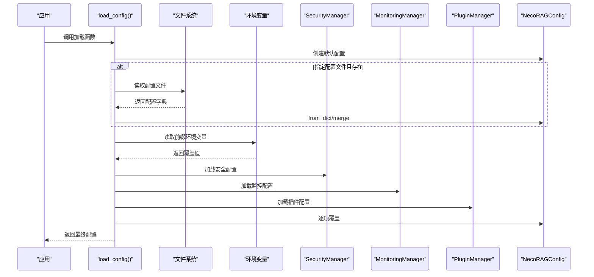

**图表来源**
- [src/core/config.py:323-362](file://src/core/config.py#L323-L362)
- [src/security/config.py:17-67](file://src/security/config.py#L17-L67)
- [src/monitoring/config.py:72-100](file://src/monitoring/config.py#L72-L100)
- [src/plugins/manager.py:23-43](file://src/plugins/manager.py#L23-L43)

**章节来源**
- [src/core/config.py:323-362](file://src/core/config.py#L323-L362)
- [src/security/config.py:17-67](file://src/security/config.py#L17-L67)
- [src/monitoring/config.py:72-100](file://src/monitoring/config.py#L72-L100)
- [src/plugins/manager.py:23-43](file://src/plugins/manager.py#L23-L43)

## 详细组件分析

### 全局配置与环境变量支持
- 优先级：环境变量 > 配置文件 > 默认值。
- 环境变量映射：通过固定前缀（默认 NECORAG）与点号路径组合，如 NECORAG_LLM_PROVIDER 映射到 llm.provider。
- 嵌套属性设置：内部使用路径解析与反射设置嵌套字段。
- 配置保存/加载：统一的 BaseConfig.to_dict/from_dict/save/load，支持枚举与嵌套对象序列化。

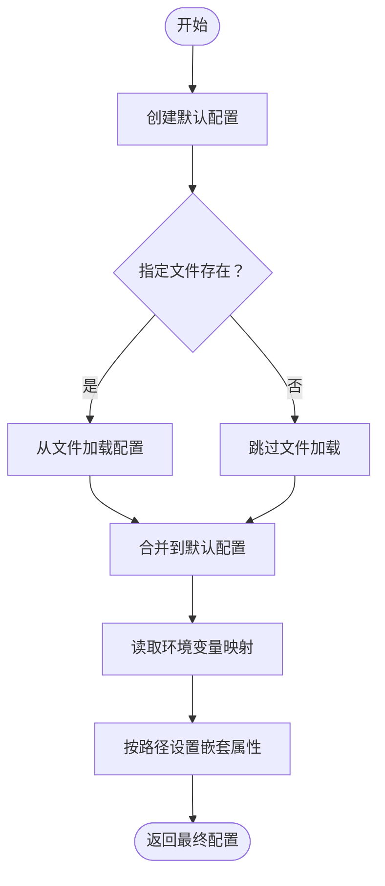

**图表来源**
- [src/core/config.py:323-362](file://src/core/config.py#L323-L362)
- [src/core/config.py:365-371](file://src/core/config.py#L365-L371)

**章节来源**
- [src/core/config.py:323-362](file://src/core/config.py#L323-L362)
- [src/core/config.py:365-371](file://src/core/config.py#L365-L371)

### 预设配置模式
- ConfigPresets：提供开发、生产、最小化三种预设，分别针对调试开关、性能与稳定性、快速启动场景进行优化。
- KnowledgeEvolutionConfig：提供默认、积极、保守、最小化四种策略，覆盖实时/定时更新、变更日志、回滚、健康度阈值、评分权重等。

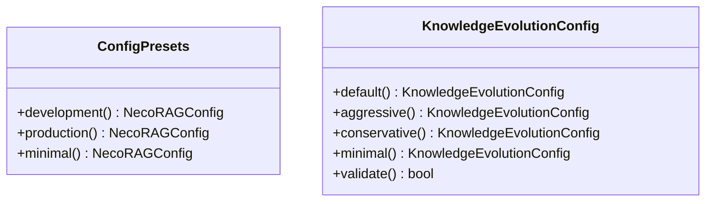

**图表来源**
- [src/core/config.py:375-405](file://src/core/config.py#L375-L405)
- [src/knowledge_evolution/config.py:94-166](file://src/knowledge_evolution/config.py#L94-L166)

**章节来源**
- [src/core/config.py:375-405](file://src/core/config.py#L375-L405)
- [src/knowledge_evolution/config.py:94-166](file://src/knowledge_evolution/config.py#L94-L166)

### Dashboard 配置管理（Profile）
- ConfigManager：负责 Profile 的创建、切换、更新、删除、复制、导入导出、持久化与加载。
- RAGProfile：包含五个模块的 ModuleConfig，支持 to_dict/from_dict 序列化。
- 模块参数：每个模块参数以字典形式存储，支持实时编辑与保存。

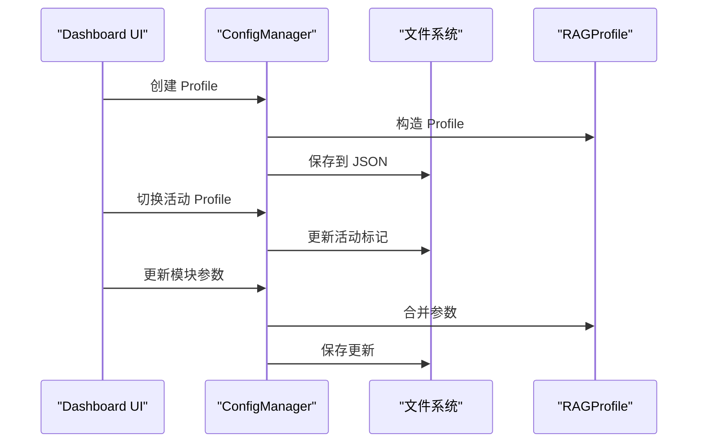

**图表来源**
- [src/dashboard/config_manager.py:42-166](file://src/dashboard/config_manager.py#L42-L166)
- [src/dashboard/models.py:165-220](file://src/dashboard/models.py#L165-L220)

**章节来源**
- [src/dashboard/config_manager.py:42-166](file://src/dashboard/config_manager.py#L42-L166)
- [src/dashboard/models.py:165-220](file://src/dashboard/models.py#L165-L220)
- [src/dashboard/README.md:253-283](file://src/dashboard/README.md#L253-L283)

### 领域配置与权重
- DomainConfig：包含领域名称、ID、描述、关键字集合、相关领域、权重系数、时间衰减等。
- DomainConfigManager：提供创建、激活、保存、加载、批量加载等能力。
- 关键字权重范围自动校正，别名索引支持。

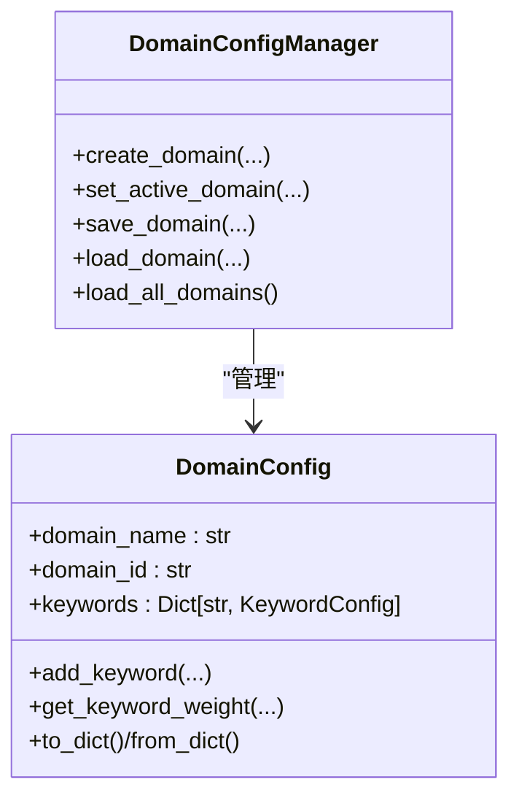

**图表来源**
- [src/domain/config.py:54-160](file://src/domain/config.py#L54-L160)
- [src/domain/config.py:163-241](file://src/domain/config.py#L163-L241)

**章节来源**
- [src/domain/config.py:54-160](file://src/domain/config.py#L54-L160)
- [src/domain/config.py:163-241](file://src/domain/config.py#L163-L241)

### 意图配置与路由策略
- IntentConfig：包含分类器后端、模型名、置信度阈值、多意图支持、意图权重、路由策略、关键词模式等。
- 提供默认、最小化、高级三种预设，便于快速切换。

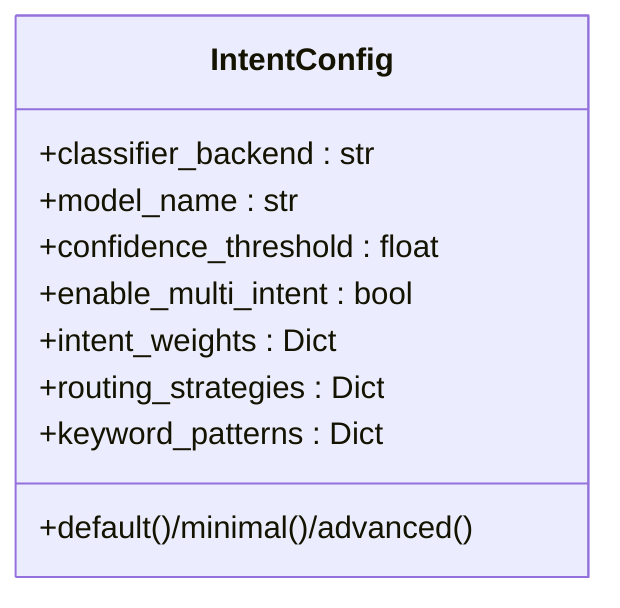

**图表来源**
- [src/intent/config.py:18-332](file://src/intent/config.py#L18-L332)

**章节来源**
- [src/intent/config.py:18-332](file://src/intent/config.py#L18-L332)

### 知识演化配置与验证
- 知识演化配置覆盖实时/定时更新、变更日志、回滚、健康度阈值、评分权重、查询日志、知识积累等。
- validate 方法对阈值、逻辑关系、权重和时间间隔进行严格校验，不符合要求时抛出异常。

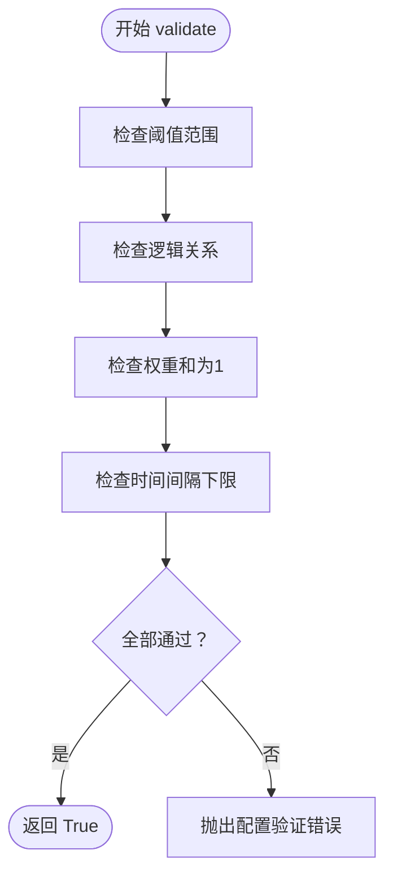

**图表来源**
- [src/knowledge_evolution/config.py:168-214](file://src/knowledge_evolution/config.py#L168-L214)

**章节来源**
- [src/knowledge_evolution/config.py:168-214](file://src/knowledge_evolution/config.py#L168-L214)

## 新增模块配置管理

### 安全配置管理
- **SecurityConfig**：提供 JWT 认证、OAuth2 集成、速率限制、CSRF/XSS 防护等安全机制配置。
- **SecurityManager**：集中管理安全配置，支持从环境变量加载、动态更新和 OAuth 提供商配置。
- **OAuth2 支持**：内置 GitHub 和 Google OAuth2 配置，支持第三方登录集成。
- **安全防护**：速率限制防止 DDoS 攻击，CSRF 防护防止跨站请求伪造，XSS 防护检测和阻止跨站脚本攻击。

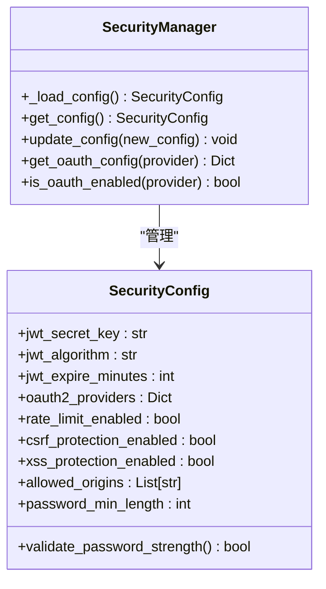

**图表来源**
- [src/security/config.py:11-87](file://src/security/config.py#L11-L87)
- [src/security/models.py:76-101](file://src/security/models.py#L76-L101)

**章节来源**
- [src/security/config.py:11-87](file://src/security/config.py#L11-L87)
- [src/security/models.py:76-101](file://src/security/models.py#L76-L101)

### 监控配置管理
- **MonitoringConfig**：提供指标收集、健康检查、告警管理、通知渠道配置的监控系统。
- **MonitoringManager**：集中管理监控配置，支持从环境变量加载和动态更新。
- **指标类型**：支持计数器、仪表盘、直方图、摘要等四种指标类型。
- **告警级别**：提供信息、警告、错误、严重四种告警级别。
- **通知渠道**：支持控制台、邮件、Webhook、Slack 等通知渠道配置。

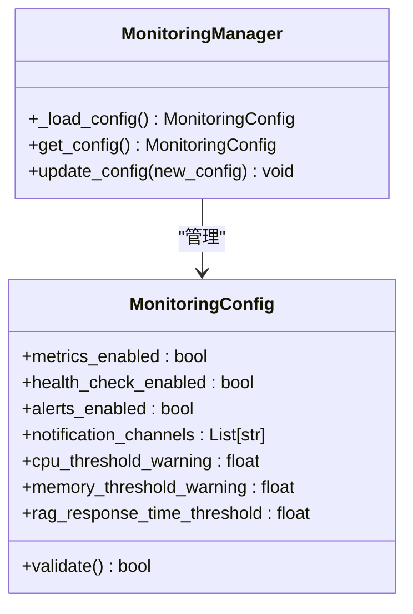

**图表来源**
- [src/monitoring/config.py:27-117](file://src/monitoring/config.py#L27-L117)

**章节来源**
- [src/monitoring/config.py:27-117](file://src/monitoring/config.py#L27-L117)

### 插件配置管理
- **PluginManager**：提供插件生命周期管理、依赖解析和事件处理。
- **PluginRegistry**：管理插件的注册、发现和元数据。
- **BasePlugin**：定义插件的标准接口和生命周期管理。
- **插件类型**：感知层、记忆层、检索层、巩固层、响应层、自定义插件六种类型。
- **依赖管理**：通过拓扑排序确保插件按正确的依赖顺序加载和卸载。

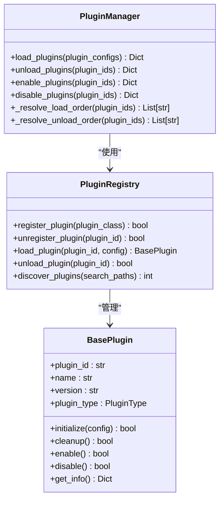

**图表来源**
- [src/plugins/manager.py:14-286](file://src/plugins/manager.py#L14-L286)
- [src/plugins/registry.py:15-257](file://src/plugins/registry.py#L15-L257)
- [src/plugins/base.py:22-263](file://src/plugins/base.py#L22-L263)

**章节来源**
- [src/plugins/manager.py:14-286](file://src/plugins/manager.py#L14-L286)
- [src/plugins/registry.py:15-257](file://src/plugins/registry.py#L15-L257)
- [src/plugins/base.py:22-263](file://src/plugins/base.py#L22-L263)

## 测试配置系统

### pytest fixtures 测试夹具
测试配置系统通过 `tests/conftest.py` 提供了丰富的测试夹具，支持各种配置测试场景：

#### 配置夹具
- **default_config**：返回默认 NecoRAGConfig 实例
- **development_config**：返回开发环境预设配置
- **minimal_config**：返回最小配置预设
- **custom_config**：返回自定义配置，包含特定的项目名称、版本和调试设置
- **llm_config**、**perception_config**、**memory_config**、**retrieval_config**：返回各子系统的专用配置
- **security_config**：返回安全配置实例，支持 JWT、OAuth2、防护机制测试
- **monitoring_config**：返回监控配置实例，支持指标收集、健康检查、告警测试
- **plugin_config**：返回插件配置实例，支持插件生命周期和依赖测试

#### Mock 客户端夹具
- **mock_llm_client**：返回 MockLLMClient 实例，用于测试 LLM 功能
- **mock_llm_client_small_dim**：返回小维度的 MockLLMClient 实例

#### 样本数据夹具
- **sample_document**、**sample_chunks**、**sample_query**、**sample_entity**、**sample_relation**、**sample_user_profile**、**sample_memory**：提供各种测试数据对象
- **sample_text_short**、**sample_text_medium**、**sample_text_long**、**sample_text_chinese**、**sample_text_english**、**sample_text_mixed**：提供不同长度和语言的文本样本

#### 时间夹具
- **current_time**、**past_time**、**future_time**：提供不同时刻的 datetime 对象

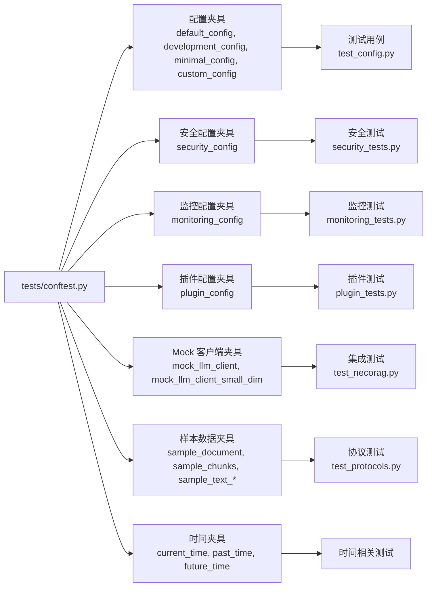

**图表来源**
- [tests/conftest.py:48-330](file://tests/conftest.py#L48-L330)

**章节来源**
- [tests/conftest.py:48-330](file://tests/conftest.py#L48-L330)

### 测试驱动开发（TDD）最佳实践
测试配置系统支持以下测试开发模式：

#### 单元测试模式
- 使用 `@pytest.fixture` 装饰器创建可复用的测试配置
- 通过 `conftest.py` 提供跨模块共享的测试夹具
- 支持快速创建测试所需的配置实例和数据对象

#### 集成测试模式
- 通过 `custom_config` 和 `development_config` 快速创建测试环境
- 使用 `mock_llm_client` 替代真实 LLM 服务，提高测试稳定性
- 支持端到端工作流测试，验证配置在实际场景中的行为

#### 参数化测试支持
- 测试夹具支持参数化配置，可以在测试中灵活调整配置参数
- 通过不同的配置预设（development、minimal）测试不同场景下的行为

#### 新增模块测试支持
- **安全配置测试**：通过 security_config 夹具测试 JWT、OAuth2、防护机制
- **监控配置测试**：通过 monitoring_config 夹具测试指标收集、健康检查、告警
- **插件配置测试**：通过 plugin_config 夹具测试插件生命周期和依赖管理

**章节来源**
- [tests/conftest.py:48-81](file://tests/conftest.py#L48-L81)
- [tests/test_core/test_config.py:35-122](file://tests/test_core/test_config.py#L35-L122)
- [tests/test_integration/test_necorag.py:35-98](file://tests/test_integration/test_necorag.py#L35-L98)

### 测试配置验证机制
测试配置系统通过以下方式确保配置的正确性：

#### 配置序列化测试
- 测试配置对象的 to_dict/from_dict 方法
- 验证配置的 JSON 序列化和反序列化能力
- 确保配置数据的完整性

#### 预设配置测试
- 验证 ConfigPresets 中的开发、生产、最小化预设
- 确保预设配置符合预期的行为模式
- 测试配置在不同预设下的正确性

#### 枚举类型测试
- 测试 LLMProvider、VectorDBProvider、GraphDBProvider 等枚举类型
- 验证枚举值的正确性和一致性
- 确保配置中使用的枚举类型有效

#### 新增模块验证测试
- **安全配置验证**：测试 SecurityConfig 的 validate_password_strength 方法
- **监控配置验证**：测试 MonitoringConfig 的 validate 方法
- **插件配置验证**：测试插件注册、加载、卸载的正确性

**章节来源**
- [tests/test_core/test_config.py:35-397](file://tests/test_core/test_config.py#L35-L397)
- [tests/test_core/test_protocols.py:46-102](file://tests/test_core/test_protocols.py#L46-L102)

## 依赖分析
- 组件内聚：各配置类均继承 BaseConfig，统一了序列化与持久化能力，降低耦合。
- 组件耦合：Dashboard 的 ConfigManager 依赖 RAGProfile 与 ModuleConfig；全局配置层通过 load_config 与环境变量解耦。
- 外部依赖：JSON 文件作为配置持久化介质；环境变量作为外部输入源；Dashboard 通过 REST API 与前端交互。
- **新增模块依赖**：安全配置依赖环境变量和 OAuth 提供商；监控配置依赖 Prometheus 格式指标；插件配置依赖插件注册表。
- **测试依赖**：pytest fixtures 依赖核心配置模块，提供测试所需的配置实例和数据对象。

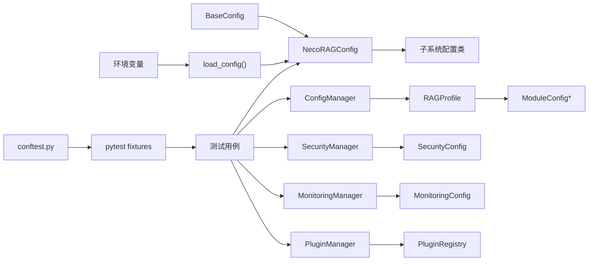

**图表来源**
- [src/core/config.py:46-77](file://src/core/config.py#L46-L77)
- [src/core/config.py:266-318](file://src/core/config.py#L266-L318)
- [src/dashboard/config_manager.py:14-41](file://src/dashboard/config_manager.py#L14-L41)
- [src/dashboard/models.py:165-220](file://src/dashboard/models.py#L165-L220)
- [src/security/config.py:11-87](file://src/security/config.py#L11-L87)
- [src/monitoring/config.py:66-117](file://src/monitoring/config.py#L66-L117)
- [src/plugins/manager.py:14-286](file://src/plugins/manager.py#L14-L286)
- [src/plugins/registry.py:15-257](file://src/plugins/registry.py#L15-L257)
- [tests/conftest.py:48-81](file://tests/conftest.py#L48-L81)

**章节来源**
- [src/core/config.py:46-77](file://src/core/config.py#L46-L77)
- [src/core/config.py:266-318](file://src/core/config.py#L266-L318)
- [src/dashboard/config_manager.py:14-41](file://src/dashboard/config_manager.py#L14-L41)
- [src/dashboard/models.py:165-220](file://src/dashboard/models.py#L165-L220)
- [src/security/config.py:11-87](file://src/security/config.py#L11-L87)
- [src/monitoring/config.py:66-117](file://src/monitoring/config.py#L66-L117)
- [src/plugins/manager.py:14-286](file://src/plugins/manager.py#L14-L286)
- [src/plugins/registry.py:15-257](file://src/plugins/registry.py#L15-L257)
- [tests/conftest.py:48-81](file://tests/conftest.py#L48-L81)

## 性能考虑
- 配置加载：文件读取与 JSON 解析为轻量操作；建议在应用启动时一次性加载，避免频繁 IO。
- 环境变量覆盖：仅在必要时读取，避免在热路径中重复解析。
- Dashboard Profile：Profile 数量较多时，注意磁盘 IO 与内存占用；可通过懒加载与缓存优化。
- 验证开销：validate 在配置变更时执行，建议在开发/CI 阶段启用严格校验，在生产环境根据需求选择性启用。
- **安全配置性能**：JWT 令牌验证和 OAuth2 交换可能影响性能，建议使用连接池和缓存。
- **监控配置性能**：指标收集频率和告警评估间隔需要平衡准确性与性能开销。
- **插件配置性能**：插件加载和依赖解析可能影响启动时间，建议异步加载和延迟初始化。
- **测试性能**：pytest fixtures 通过延迟创建和缓存机制优化测试性能，避免重复创建昂贵的对象。

## 故障排查指南
- 配置加载失败
  - 检查配置文件路径与权限；确认 JSON 格式正确。
  - 确认环境变量前缀与键名一致。
- 配置验证失败
  - 根据 validate 抛出的错误信息逐一修正阈值、权重与时间间隔。
  - 参考异常类型：ConfigurationError、ValidationError。
- Dashboard 操作异常
  - 检查 Profile 文件是否存在与可读写。
  - 确认模块参数键名与前端一致。
- 知识演化异常
  - 关注健康度阈值与评分权重；检查回滚窗口与变更日志配置。
- **安全配置异常**
  - 检查 JWT 密钥和算法配置；确认 OAuth2 客户端凭据正确。
  - 验证速率限制、CSRF、XSS 配置是否符合预期。
- **监控配置异常**
  - 检查指标端口和路径配置；确认 Prometheus 格式兼容性。
  - 验证告警规则和通知渠道配置。
- **插件配置异常**
  - 检查插件 ID 和依赖关系；确认插件类的有效性。
  - 验证插件配置参数和初始化过程。
- **测试配置异常**
  - 检查 conftest.py 中的 fixtures 定义是否正确。
  - 确认测试夹具的依赖关系和导入路径。
  - 验证测试配置与实际配置类的一致性。

**章节来源**
- [src/core/exceptions.py:256-295](file://src/core/exceptions.py#L256-L295)
- [src/knowledge_evolution/config.py:168-214](file://src/knowledge_evolution/config.py#L168-L214)
- [src/dashboard/config_manager.py:289-315](file://src/dashboard/config_manager.py#L289-L315)
- [src/security/config.py:17-67](file://src/security/config.py#L17-L67)
- [src/monitoring/config.py:72-100](file://src/monitoring/config.py#L72-L100)
- [src/plugins/manager.py:23-43](file://src/plugins/manager.py#L23-L43)
- [tests/conftest.py:48-81](file://tests/conftest.py#L48-L81)

## 结论
本配置管理体系通过"文件 + 环境变量"的双通道加载、统一的序列化与预设策略、Dashboard 的可视化管理，以及完善的测试配置系统，实现了灵活、可维护、可迁移的配置方案。新增的安全配置、监控配置和插件配置模块进一步增强了系统的安全性、可观测性和扩展性。通过统一的配置管理框架，系统能够支持企业级应用的各种需求，同时保持良好的性能和可靠性。配合严格的验证与完善的异常体系，能够在不同环境中稳定运行并快速定位问题。

## 附录

### 环境变量支持与优先级规则
- 优先级：环境变量 > 配置文件 > 默认值。
- 前缀：默认 NECORAG，可通过参数修改。
- 映射示例：NECORAG_LLM_PROVIDER → llm.provider；NECORAG_VECTOR_DB → memory.vector_db_provider。
- **新增环境变量**：SECURITY_*、MONITORING_*、PLUGIN_* 前缀用于新模块配置。

**章节来源**
- [src/core/config.py:323-362](file://src/core/config.py#L323-L362)
- [src/security/config.py:17-67](file://src/security/config.py#L17-L67)
- [src/monitoring/config.py:72-100](file://src/monitoring/config.py#L72-L100)
- [src/plugins/manager.py:23-43](file://src/plugins/manager.py#L23-L43)

### 预设配置模式使用指南
- 开发环境：开启调试、使用内存数据库、简化检索与巩固策略。
- 生产环境：提升检索与巩固强度，启用重排序与图谱搜索。
- 最小化：关闭非核心功能，适合快速启动与资源受限场景。
- 知识演化：默认/积极/保守/最小化策略，按业务风险与吞吐需求选择。
- **安全配置**：根据安全需求选择合适的 JWT 算法、OAuth2 提供商和防护级别。
- **监控配置**：根据监控需求调整指标收集频率、健康检查间隔和告警阈值。
- **插件配置**：根据功能需求选择合适的插件类型和依赖关系。

**章节来源**
- [src/core/config.py:375-405](file://src/core/config.py#L375-L405)
- [src/knowledge_evolution/config.py:94-166](file://src/knowledge_evolution/config.py#L94-L166)
- [src/security/models.py:76-101](file://src/security/models.py#L76-L101)
- [src/monitoring/config.py:27-117](file://src/monitoring/config.py#L27-L117)

### 配置验证机制与错误处理策略
- validate：对阈值、逻辑关系、权重和时间间隔进行校验，失败抛出异常。
- 异常类型：ConfigurationError、ValidationError、KnowledgeEvolutionError 等。
- 建议：在 CI/CD 中启用严格校验；生产环境可根据需要放宽。
- **新增验证机制**：安全配置的密码强度验证、监控配置的阈值验证、插件配置的依赖验证。
- **测试验证**：通过 pytest fixtures 提供的测试夹具验证配置的正确性。

**章节来源**
- [src/knowledge_evolution/config.py:168-214](file://src/knowledge_evolution/config.py#L168-L214)
- [src/core/exceptions.py:256-295](file://src/core/exceptions.py#L256-L295)
- [src/security/models.py:76-101](file://src/security/models.py#L76-L101)
- [src/monitoring/config.py:27-117](file://src/monitoring/config.py#L27-L117)
- [tests/conftest.py:48-81](file://tests/conftest.py#L48-L81)

### 配置迁移与版本管理最佳实践
- 文件命名：使用带时间戳或版本号的文件名，便于回溯。
- 变更记录：利用变更日志与回滚机制，记录每次更新的上下文。
- 环境隔离：通过 Profile 与环境变量区分开发/测试/生产环境。
- 文档同步：保持配置文件与注释同步，明确字段含义与默认值来源。
- **测试驱动**：通过测试配置系统确保配置变更不会破坏现有功能。
- **模块化管理**：新模块配置遵循统一的命名规范和验证机制。
- **向后兼容**：确保新增配置不影响现有配置的兼容性。

**章节来源**
- [src/dashboard/README.md:253-283](file://src/dashboard/README.md#L253-L283)
- [src/knowledge_evolution/config.py:15-91](file://src/knowledge_evolution/config.py#L15-L91)
- [src/security/config.py:17-67](file://src/security/config.py#L17-L67)
- [src/monitoring/config.py:72-100](file://src/monitoring/config.py#L72-L100)
- [src/plugins/manager.py:23-43](file://src/plugins/manager.py#L23-L43)
- [tests/conftest.py:48-81](file://tests/conftest.py#L48-L81)

### 测试配置系统使用指南
- **创建测试配置**：使用 conftest.py 中提供的 fixtures 快速创建测试配置
- **参数化测试**：通过 fixtures 的参数化支持创建不同配置的测试场景
- **Mock 对象**：使用 mock_llm_client 等 Mock 对象替代真实服务
- **数据准备**：通过 sample_* fixtures 提供测试所需的数据对象
- **新增模块测试**：使用 security_config、monitoring_config、plugin_config 夹具测试新功能
- **测试组织**：按照测试类型（单元测试、集成测试、端到端测试）合理使用不同的 fixtures

**章节来源**
- [tests/conftest.py:48-330](file://tests/conftest.py#L48-L330)
- [tests/test_core/test_config.py:35-122](file://tests/test_core/test_config.py#L35-L122)
- [tests/test_integration/test_necorag.py:35-98](file://tests/test_integration/test_necorag.py#L35-L98)