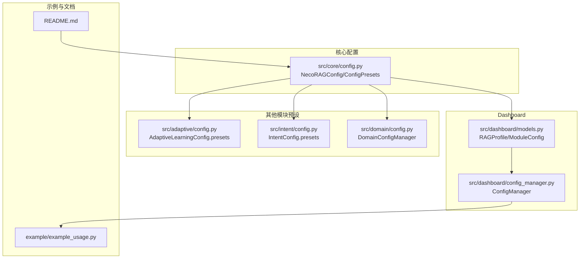
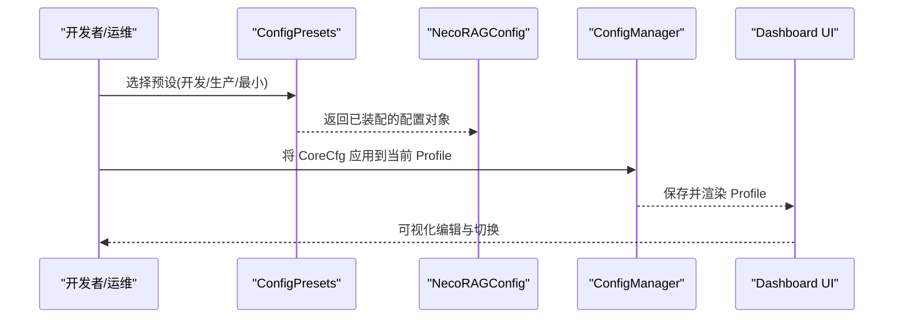
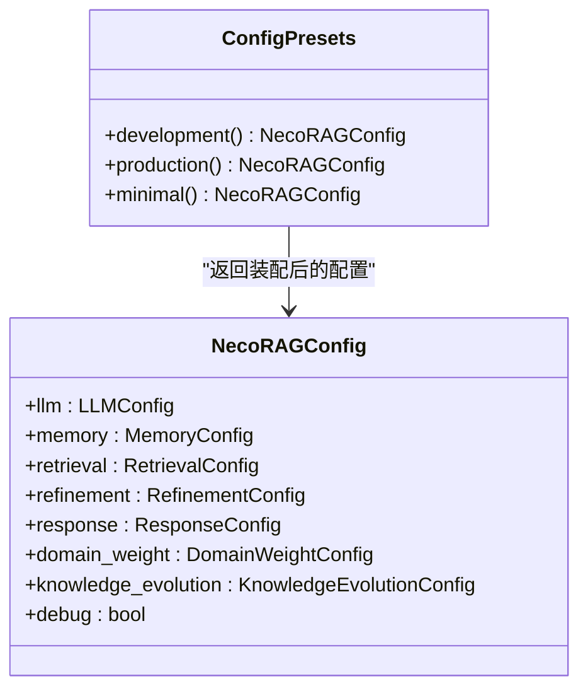
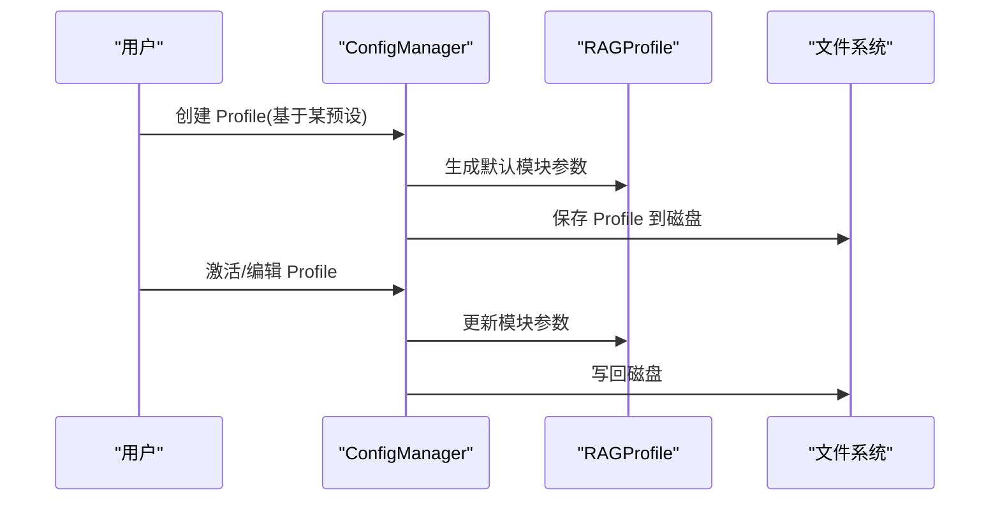
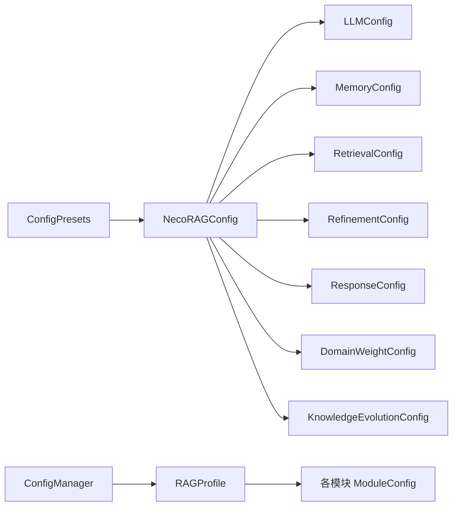

# 预设配置

<cite>
**本文引用的文件列表**
- [src/core/config.py](file://src/core/config.py)
- [src/dashboard/config_manager.py](file://src/dashboard/config_manager.py)
- [src/dashboard/models.py](file://src/dashboard/models.py)
- [src/adaptive/config.py](file://src/adaptive/config.py)
- [src/intent/config.py](file://src/intent/config.py)
- [src/domain/config.py](file://src/domain/config.py)
- [example/example_usage.py](file://example/example_usage.py)
- [README.md](file://README.md)
</cite>

## 目录
1. [简介](#简介)
2. [项目结构](#项目结构)
3. [核心组件](#核心组件)
4. [架构总览](#架构总览)
5. [详细组件分析](#详细组件分析)
6. [依赖分析](#依赖分析)
7. [性能考量](#性能考量)
8. [故障排查指南](#故障排查指南)
9. [结论](#结论)
10. [附录](#附录)

## 简介
本文件聚焦于 NecoRAG 的“预设配置系统”，围绕 ConfigPresets 类提供的三种预设配置模式：development（开发环境）、production（生产环境）、minimal（最小配置），系统性地解释其设计目标、适用场景、配置项取值与权衡考量，并提供不同使用场景下的选择指南，帮助用户快速选定合适的配置模板并进行必要的二次调整。

## 项目结构
与预设配置直接相关的核心文件分布如下：
- 核心配置与预设：src/core/config.py
- Dashboard 配置管理与 Profile：src/dashboard/config_manager.py、src/dashboard/models.py
- 其他模块的预设配置：src/adaptive/config.py、src/intent/config.py、src/domain/config.py
- 示例与使用参考：example/example_usage.py
- 顶层文档与架构说明：README.md

图表来源
- [src/core/config.py:378-408](file://src/core/config.py#L378-L408)
- [src/dashboard/models.py:165-220](file://src/dashboard/models.py#L165-L220)
- [src/dashboard/config_manager.py:14-315](file://src/dashboard/config_manager.py#L14-L315)
- [src/adaptive/config.py:86-155](file://src/adaptive/config.py#L86-L155)
- [src/intent/config.py:311-333](file://src/intent/config.py#L311-L333)
- [src/domain/config.py:163-241](file://src/domain/config.py#L163-L241)
- [example/example_usage.py:1-252](file://example/example_usage.py#L1-L252)
- [README.md:1-678](file://README.md#L1-L678)

章节来源
- [src/core/config.py:378-408](file://src/core/config.py#L378-L408)
- [src/dashboard/models.py:165-220](file://src/dashboard/models.py#L165-L220)
- [src/dashboard/config_manager.py:14-315](file://src/dashboard/config_manager.py#L14-L315)
- [src/adaptive/config.py:86-155](file://src/adaptive/config.py#L86-L155)
- [src/intent/config.py:311-333](file://src/intent/config.py#L311-L333)
- [src/domain/config.py:163-241](file://src/domain/config.py#L163-L241)
- [example/example_usage.py:1-252](file://example/example_usage.py#L1-L252)
- [README.md:1-678](file://README.md#L1-L678)

## 核心组件
- ConfigPresets：提供 development、production、minimal 三种预设，作为 NecoRAGConfig 的快速装配模板。
- NecoRAGConfig：统一的全局配置容器，包含 LLM、感知、记忆、检索、巩固、响应、领域权重、知识演化等子配置。
- Dashboard Profile：通过 RAGProfile 将各模块参数封装为可持久化的 Profile，便于在 Dashboard 中管理与切换。
- 其他模块预设：adaptive、intent、domain 等模块各自提供 presets，用于特定子系统的快速配置。

章节来源
- [src/core/config.py:266-322](file://src/core/config.py#L266-L322)
- [src/core/config.py:378-408](file://src/core/config.py#L378-L408)
- [src/dashboard/models.py:165-220](file://src/dashboard/models.py#L165-L220)
- [src/adaptive/config.py:86-155](file://src/adaptive/config.py#L86-L155)
- [src/intent/config.py:311-333](file://src/intent/config.py#L311-L333)
- [src/domain/config.py:163-241](file://src/domain/config.py#L163-L241)

## 架构总览
ConfigPresets 作为“装配器”，在运行时根据场景生成 NecoRAGConfig；Dashboard 通过 ConfigManager 读写 RAGProfile，实现配置的持久化与可视化管理；其他模块的预设配置为系统提供更细粒度的默认策略。

图表来源
- [src/core/config.py:378-408](file://src/core/config.py#L378-L408)
- [src/dashboard/config_manager.py:14-315](file://src/dashboard/config_manager.py#L14-L315)
- [src/dashboard/models.py:165-220](file://src/dashboard/models.py#L165-L220)

## 详细组件分析

### ConfigPresets 预设配置模式
ConfigPresets 提供三种开箱即用的配置模板，分别面向不同生命周期与资源约束：

- development（开发环境）
  - 设计目标：便于本地开发与调试，强调可观察性与易用性。
  - 关键特征：
    - debug=True，便于日志与断点定位。
    - LLM 提供商为 MOCK，避免外部 API 依赖。
    - 向量与图数据库提供商均为 MEMORY，降低部署复杂度。
  - 适用场景：本地开发、单元测试、原型验证、教学演示。
  - 选择建议：首次上手、快速验证、无外部依赖需求时优先。

- production（生产环境）
  - 设计目标：兼顾性能与稳定性，启用关键优化与重排序。
  - 关键特征：
    - debug=False，减少冗余日志与调试开销。
    - 提升巩固层迭代次数，增强答案质量与稳定性。
    - 启用检索层重排序，提升最终结果质量。
  - 适用场景：线上服务、对准确性有要求的业务场景。
  - 选择建议：上线前评估与生产部署的首选模板。

- minimal（最小配置）
  - 设计目标：最短路径启动，降低资源占用与依赖。
  - 关键特征：
    - LLM 提供商为 MOCK。
    - 关闭 HyDE 与重排序，减少计算与外部依赖。
    - 降低巩固层迭代次数，缩短响应时间。
    - 关闭思维链可视化，进一步简化输出。
  - 适用场景：资源受限、快速启动、最小可用系统。
  - 选择建议：边缘设备、容器化初版、资源紧张环境。

图表来源
- [src/core/config.py:378-408](file://src/core/config.py#L378-L408)
- [src/core/config.py:266-322](file://src/core/config.py#L266-L322)

章节来源
- [src/core/config.py:378-408](file://src/core/config.py#L378-L408)

### 预设配置与子配置的关系
- development：将 LLM 提供商与内存型向量/图数据库设为默认，便于本地无依赖运行。
- production：提升巩固层迭代次数与启用重排序，提高最终答案质量。
- minimal：关闭 HyDE、重排序与思维链可视化，降低计算与依赖。

章节来源
- [src/core/config.py:382-396](file://src/core/config.py#L382-L396)

### Dashboard Profile 与预设配置的衔接
- RAGProfile 将各模块参数封装为可持久化的 Profile，ConfigManager 支持创建、激活、更新、导入导出。
- 在 Dashboard 中，用户可基于某预设生成初始 Profile，再按需微调各模块参数。
- 该机制使得预设配置可被“落地”为可复用的工程化配置。

图表来源
- [src/dashboard/models.py:165-220](file://src/dashboard/models.py#L165-L220)
- [src/dashboard/config_manager.py:14-315](file://src/dashboard/config_manager.py#L14-L315)

章节来源
- [src/dashboard/models.py:165-220](file://src/dashboard/models.py#L165-L220)
- [src/dashboard/config_manager.py:14-315](file://src/dashboard/config_manager.py#L14-L315)

### 其他模块的预设配置参考
- AdaptiveLearningConfig.presets：提供 default/aggressive/conservative/minimal 等模式，体现学习策略的激进/保守/最小化取舍。
- IntentConfig.presets：提供 default/minimal/advanced，分别对应规则分类、最小依赖与 Transformer 分类。
- DomainConfigManager：提供领域配置的管理与示例，便于在多领域场景下快速装配。

章节来源
- [src/adaptive/config.py:86-155](file://src/adaptive/config.py#L86-L155)
- [src/intent/config.py:311-333](file://src/intent/config.py#L311-L333)
- [src/domain/config.py:163-241](file://src/domain/config.py#L163-L241)

## 依赖分析
- ConfigPresets 依赖 NecoRAGConfig 及其子配置类，通过静态方法返回已装配的配置对象。
- Dashboard 通过 ConfigManager 与 RAGProfile 协作，将预设配置持久化为可编辑的 Profile。
- 其他模块的预设配置为系统提供可替换的策略与参数集合，便于在不同场景下灵活切换。

图表来源
- [src/core/config.py:266-322](file://src/core/config.py#L266-L322)
- [src/core/config.py:378-408](file://src/core/config.py#L378-L408)
- [src/dashboard/config_manager.py:14-315](file://src/dashboard/config_manager.py#L14-L315)
- [src/dashboard/models.py:165-220](file://src/dashboard/models.py#L165-L220)

章节来源
- [src/core/config.py:266-322](file://src/core/config.py#L266-L322)
- [src/core/config.py:378-408](file://src/core/config.py#L378-L408)
- [src/dashboard/config_manager.py:14-315](file://src/dashboard/config_manager.py#L14-L315)
- [src/dashboard/models.py:165-220](file://src/dashboard/models.py#L165-L220)

## 性能考量
- development：以可观察性优先，适合开发调试，但不追求极致性能。
- production：适度提升迭代次数与启用重排序，平衡质量与性能。
- minimal：显著降低计算与依赖，适合资源受限或快速启动场景。
- Dashboard Profile 的持久化与可视化编辑，有助于在真实环境中持续优化参数。

章节来源
- [src/core/config.py:382-396](file://src/core/config.py#L382-L396)
- [src/dashboard/config_manager.py:14-315](file://src/dashboard/config_manager.py#L14-L315)

## 故障排查指南
- 若在 development 模式下出现外部 API 依赖错误，确认 LLM 提供商已被设为 MOCK。
- 若 production 模式下检索质量不佳，检查是否正确启用了重排序与 HyDE。
- 若 minimal 模式下响应过快但质量不足，可逐步开启重排序与 HyDE，或增加巩固层迭代次数。
- 在 Dashboard 中，若 Profile 无法激活或参数未生效，检查 ConfigManager 的保存与加载流程，确保文件权限与路径正确。

章节来源
- [src/core/config.py:382-396](file://src/core/config.py#L382-L396)
- [src/dashboard/config_manager.py:14-315](file://src/dashboard/config_manager.py#L14-L315)

## 结论
ConfigPresets 为 NecoRAG 提供了三种清晰的配置模板，分别面向开发、生产与最小化启动场景。结合 Dashboard 的 Profile 管理机制，用户可以快速选择合适的模板并进行工程化落地。建议在开发阶段使用 development，上线前使用 production，资源受限时使用 minimal，并在 Dashboard 中持续优化参数以满足业务需求。

## 附录
- 使用示例参考：example/example_usage.py 展示了各模块的基本使用方式，可作为理解配置项作用的辅助材料。
- 顶层文档：README.md 提供了整体架构与模块概览，有助于把握预设配置在整个系统中的位置与影响。

章节来源
- [example/example_usage.py:1-252](file://example/example_usage.py#L1-L252)
- [README.md:1-678](file://README.md#L1-L678)