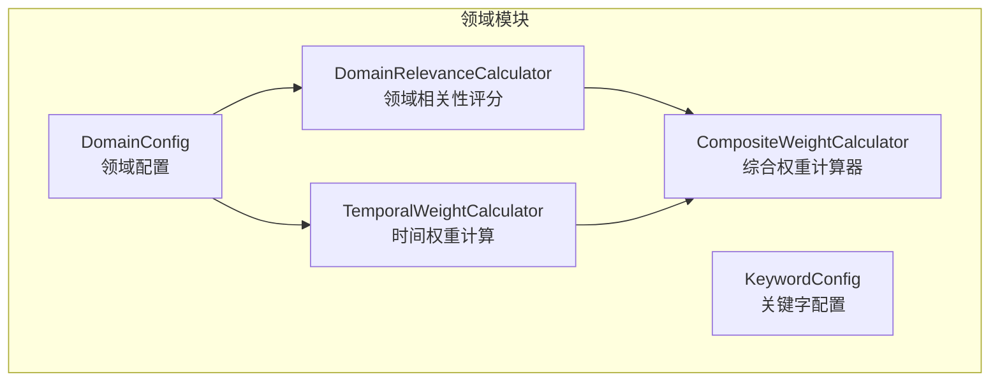
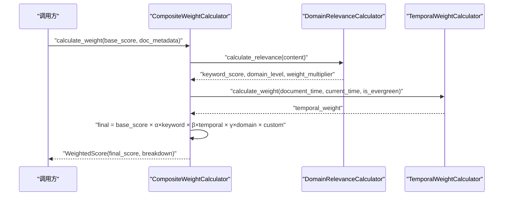
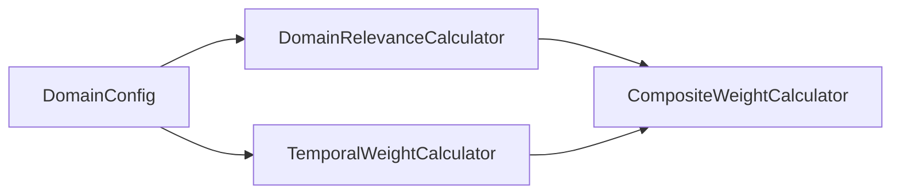

# 领域配置

<cite>
**本文引用的文件**
- [src/domain/config.py](file://src/domain/config.py)
- [src/domain/weight_calculator.py](file://src/domain/weight_calculator.py)
- [src/domain/temporal_weight.py](file://src/domain/temporal_weight.py)
- [src/domain/relevance.py](file://src/domain/relevance.py)
- [src/domain/__init__.py](file://src/domain/__init__.py)
- [example/domain_weight_example.py](file://example/domain_weight_example.py)
</cite>

## 目录
1. [简介](#简介)
2. [项目结构](#项目结构)
3. [核心组件](#核心组件)
4. [架构总览](#架构总览)
5. [详细组件分析](#详细组件分析)
6. [依赖分析](#依赖分析)
7. [性能考量](#性能考量)
8. [故障排查指南](#故障排查指南)
9. [结论](#结论)
10. [附录](#附录)

## 简介
本文件面向“领域配置系统”，围绕 DomainWeightConfig 类（即 DomainConfig）的参数与权重计算机制展开，重点解释：
- 权重因子：关键字权重因子 α、时间权重因子 β、领域权重因子 γ
- 时间衰减配置：衰减率 λ、常青知识启用
- 数学模型与各因子作用机制
- 时间衰减对知识时效性的影响
- 不同领域的权重配置策略与调优建议

该系统通过“关键字相关性 + 时间权重 + 领域权重”三路因子，以乘法方式融合，形成最终检索权重，从而指导检索重排序与个性化推荐。

## 项目结构
领域配置系统位于 src/domain 目录，包含以下关键模块：
- config.py：定义领域配置 DomainConfig、关键字配置 KeywordConfig、领域/关键字等级枚举，以及配置管理器 DomainConfigManager
- relevance.py：领域相关性评分 DomainRelevanceCalculator，输出关键字得分、密度得分、领域等级与权重乘数
- temporal_weight.py：时间权重 TemporalWeightCalculator，支持分层、指数衰减与混合方法，并提供预设衰减配置
- weight_calculator.py：综合权重计算器 CompositeWeightCalculator，整合上述三路权重，计算最终加权分数
- __init__.py：导出领域模块的公共接口
- example/domain_weight_example.py：示例脚本，演示领域配置、时间权重、相关性评分与综合权重计算

图表来源
- [src/domain/config.py:53-160](file://src/domain/config.py#L53-L160)
- [src/domain/relevance.py:29-241](file://src/domain/relevance.py#L29-L241)
- [src/domain/temporal_weight.py:47-195](file://src/domain/temporal_weight.py#L47-L195)
- [src/domain/weight_calculator.py:56-205](file://src/domain/weight_calculator.py#L56-L205)

章节来源
- [src/domain/__init__.py:7-68](file://src/domain/__init__.py#L7-L68)

## 核心组件
- DomainConfig（即 DomainWeightConfig）：承载领域配置，包含权重因子 α、β、γ，时间衰减配置 λ 与是否启用时间衰减，以及各类领域权重阈值（核心/相关/边缘/领域外）
- DomainRelevanceCalculator：基于关键字与密度计算领域相关性，输出领域等级与权重乘数
- TemporalWeightCalculator：基于时间层级或指数衰减计算时间权重，支持常青内容
- CompositeWeightCalculator：将基础相似度与三路权重相乘，得到最终加权分数，并提供批量重排序能力

章节来源
- [src/domain/config.py:53-160](file://src/domain/config.py#L53-L160)
- [src/domain/relevance.py:29-241](file://src/domain/relevance.py#L29-L241)
- [src/domain/temporal_weight.py:47-195](file://src/domain/temporal_weight.py#L47-L195)
- [src/domain/weight_calculator.py:56-205](file://src/domain/weight_calculator.py#L56-L205)

## 架构总览
领域配置系统采用“配置驱动 + 子计算器组合”的架构：
- DomainConfig 提供权重因子与时间衰减参数
- DomainRelevanceCalculator 计算关键字得分与领域权重乘数
- TemporalWeightCalculator 计算时间权重（可选常青）
- CompositeWeightCalculator 将基础相似度与三路权重相乘，得到最终分数

图表来源
- [src/domain/weight_calculator.py:81-146](file://src/domain/weight_calculator.py#L81-L146)
- [src/domain/relevance.py:198-241](file://src/domain/relevance.py#L198-L241)
- [src/domain/temporal_weight.py:160-195](file://src/domain/temporal_weight.py#L160-L195)

## 详细组件分析

### DomainConfig（领域配置）
- 权重因子
  - keyword_factor（α）：关键字权重因子系数，控制关键字相关性对最终权重的影响程度
  - temporal_factor（β）：时间权重因子系数，控制时间衰减对最终权重的影响程度
  - domain_factor（γ）：领域权重因子系数，控制领域等级权重乘数对最终权重的影响程度
- 时间衰减配置
  - decay_rate（λ）：每日衰减系数，用于指数衰减计算
  - enable_temporal_decay：是否启用时间衰减
- 领域权重阈值
  - core_domain_weight、related_domain_weight、peripheral_domain_weight、out_of_domain_weight：分别对应核心/相关/边缘/领域外的权重乘数
- 关键字管理
  - add_keyword：添加关键字及其别名，内部维护大小写不敏感索引
  - get_keyword_weight：按关键字获取其权重
  - to_dict/from_dict：序列化/反序列化配置

章节来源
- [src/domain/config.py:53-160](file://src/domain/config.py#L53-L160)

### DomainRelevanceCalculator（领域相关性评分）
- 关键字得分 keyword_score：基于匹配到的关键字及其权重，计算加权平均，再归一化到合理范围
- 关键字密度 density_score：统计关键字出现次数占总词数的比例，经缩放后归一化
- 综合评分 combined_score：keyword_score 与 density_score 的加权组合，归一化到 [0,1]
- 领域等级 domain_level：依据 combined_score 划分核心/相关/边缘/领域外
- 权重乘数 weight_multiplier：根据领域等级映射到配置中的权重阈值
- 置信度 confidence：基于匹配关键字数量，衡量判定可靠性
- 解释性说明 explanation：汇总匹配数量、关键字得分、密度得分与置信度

章节来源
- [src/domain/relevance.py:95-241](file://src/domain/relevance.py#L95-L241)

### TemporalWeightCalculator（时间权重）
- 时间层级 TemporalTier：最近期/近期/中期/远期/历史/常青
- 分层权重 calculate_tiered_weight：按层级设定权重范围，在层级内线性插值
- 指数衰减 calculate_exponential_decay：基于 e^(-λ·days)，越新权重越高
- 混合方法 calculate_weight(method="tiered"/"exponential"/"hybrid")：在分层基础上叠加指数衰减
- 常青内容 is_evergreen：若启用常青，则时间权重恒为 1.0
- 预设配置 DecayPresets：快变领域、正常领域、慢变领域、常青领域（禁用时间衰减）

章节来源
- [src/domain/temporal_weight.py:47-195](file://src/domain/temporal_weight.py#L47-L195)

### CompositeWeightCalculator（综合权重计算器）
- 输入：基础相似度分数、文档元数据（含创建/更新时间、是否常青、来源领域等）、可选查询
- 计算流程：
  1) 关键字权重：由 DomainRelevanceCalculator 输出，经裁剪至 [0.5, 2.0]
  2) 时间权重：由 TemporalWeightCalculator 输出，若启用常青则为 1.0
  3) 领域权重：由领域等级映射到配置中的权重乘数
  4) 最终分数：final = base_score × (α×keyword) × (β×temporal) × (γ×domain) × custom_weight
- 批量重排序：支持按最终分数降序排序，可截取 top_k

章节来源
- [src/domain/weight_calculator.py:56-205](file://src/domain/weight_calculator.py#L56-L205)

### 示例与使用路径
- 示例脚本演示了领域配置创建、时间权重计算、相关性评分、综合权重计算与配置持久化
- 示例路径
  - [example/domain_weight_example.py:22-73](file://example/domain_weight_example.py#L22-L73)
  - [example/domain_weight_example.py:76-111](file://example/domain_weight_example.py#L76-L111)
  - [example/domain_weight_example.py:114-143](file://example/domain_weight_example.py#L114-L143)
  - [example/domain_weight_example.py:145-202](file://example/domain_weight_example.py#L145-L202)
  - [example/domain_weight_example.py:204-242](file://example/domain_weight_example.py#L204-L242)

## 依赖分析
- DomainConfig 作为配置中心，被 DomainRelevanceCalculator 与 TemporalWeightCalculator 使用
- CompositeWeightCalculator 组合 DomainRelevanceCalculator 与 TemporalWeightCalculator，并读取 DomainConfig 的权重因子与时间衰减参数
- __init__.py 将领域模块的公共接口统一导出，便于上层调用

图表来源
- [src/domain/config.py:53-160](file://src/domain/config.py#L53-L160)
- [src/domain/relevance.py:29-241](file://src/domain/relevance.py#L29-L241)
- [src/domain/temporal_weight.py:47-195](file://src/domain/temporal_weight.py#L47-L195)
- [src/domain/weight_calculator.py:56-205](file://src/domain/weight_calculator.py#L56-L205)

章节来源
- [src/domain/__init__.py:7-68](file://src/domain/__init__.py#L7-L68)

## 性能考量
- 关键字匹配与正则查找：DomainRelevanceCalculator 使用预构建的正则模式进行快速匹配；关键字数量较多时，建议控制关键字规模与别名数量，避免过多正则编译与匹配开销
- 时间权重计算：TemporalWeightCalculator 支持多种方法，指数衰减与分层权重计算均为 O(1)，混合方法为两者的均值，整体开销极小
- 批量重排序：CompositeWeightCalculator 的 batch_calculate 与 rerank_by_weight 为线性复杂度，适合大规模候选集的重排序
- 内存占用：DomainConfigManager 支持配置持久化与加载，避免重复构建配置对象

## 故障排查指南
- 关键字权重异常
  - 现象：关键字权重不在合法区间
  - 处理：DomainConfig 对权重有自动修正逻辑，确保在等级对应的范围内
  - 参考：[src/domain/config.py:39-50](file://src/domain/config.py#L39-L50)
- 时间权重恒为 1.0
  - 现象：无论文档多久都无衰减
  - 处理：检查 enable_temporal_decay 是否开启，以及文档是否标记为常青 is_evergreen
  - 参考：[src/domain/temporal_weight.py:176-180](file://src/domain/temporal_weight.py#L176-L180)
- 领域权重乘数未生效
  - 现象：领域等级划分导致权重乘数不符合预期
  - 处理：调整 core/related/peripheral/out_of_domain_weight 阈值，或优化关键字权重与密度得分
  - 参考：[src/domain/relevance.py:180-196](file://src/domain/relevance.py#L180-L196)
- 综合权重过低或过高
  - 现象：最终分数异常
  - 处理：检查 α、β、γ 三因子与 custom_weight，确认基础分数与裁剪范围
  - 参考：[src/domain/weight_calculator.py:109-129](file://src/domain/weight_calculator.py#L109-L129)

## 结论
DomainWeightConfig（DomainConfig）通过三因子（α、β、γ）与时间衰减（λ、常青）共同决定最终权重，结合关键字相关性与领域等级，形成稳健且可调的加权排序机制。通过合理设置权重因子与时间衰减参数，可在不同业务场景下平衡时效性、相关性与领域偏好，提升检索质量与用户体验。

## 附录

### 数学模型与公式
- 综合权重计算
  - final = base_score × (α × keyword_weight) × (β × temporal_weight) × (γ × domain_weight) × custom_weight
  - 关键字权重裁剪：min(2.0, max(0.5, keyword_weight))
- 时间权重
  - 分层权重：按时间层级设定范围并在层级内线性插值
  - 指数衰减：e^(-λ × 天数差)
  - 常青内容：权重恒为 1.0
- 领域权重
  - 基于领域等级映射到配置中的权重阈值

章节来源
- [src/domain/weight_calculator.py:89-129](file://src/domain/weight_calculator.py#L89-L129)
- [src/domain/temporal_weight.py:84-109](file://src/domain/temporal_weight.py#L84-L109)
- [src/domain/relevance.py:180-196](file://src/domain/relevance.py#L180-L196)

### 不同领域的权重配置策略与调优建议
- 快速变化领域（如新闻、科技）
  - 建议：启用时间衰减，提高 decay_rate；缩短近期/近期分界，强调最新性
  - 参考：[src/domain/temporal_weight.py:235-243](file://src/domain/temporal_weight.py#L235-L243)
- 正常变化领域（如学术、技术文档）
  - 建议：标准 decay_rate；适度提升 α，平衡相关性与时效性
  - 参考：[src/domain/temporal_weight.py:246-254](file://src/domain/temporal_weight.py#L246-L254)
- 缓慢变化领域（如历史、法律）
  - 建议：降低 decay_rate；延长近期/中期分界，保留历史价值
  - 参考：[src/domain/temporal_weight.py:257-265](file://src/domain/temporal_weight.py#L257-L265)
- 常青领域（如基础科学）
  - 建议：禁用时间衰减（常青），或设置为 1.0；提升领域权重因子 γ
  - 参考：[src/domain/temporal_weight.py:268-270](file://src/domain/temporal_weight.py#L268-L270)
- 关键字权重调优
  - 若希望更重视关键词命中，适当提高 α；若希望更重视领域匹配，提高 γ；若希望更重视时效，提高 β
  - 参考：[src/domain/weight_calculator.py:77-79](file://src/domain/weight_calculator.py#L77-L79)