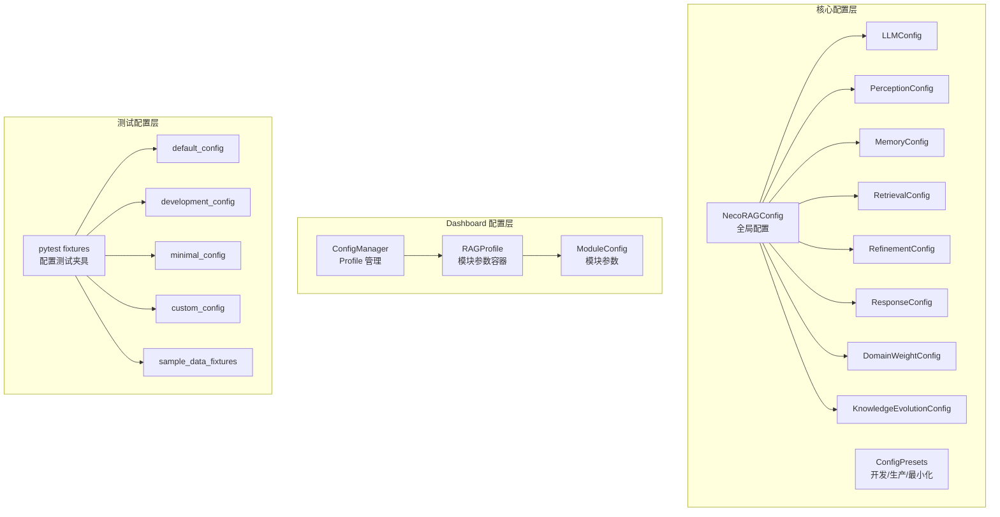
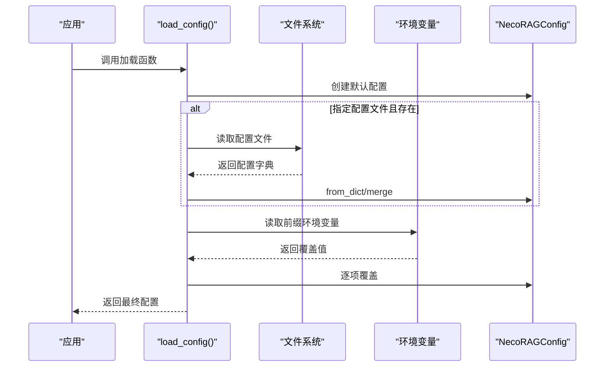
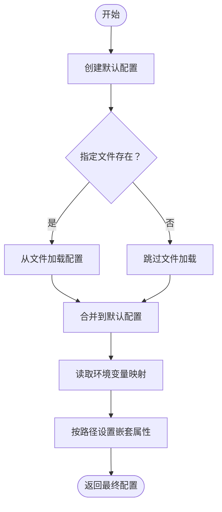
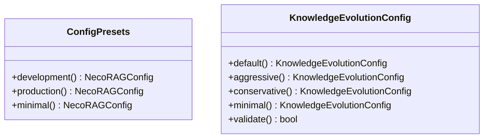
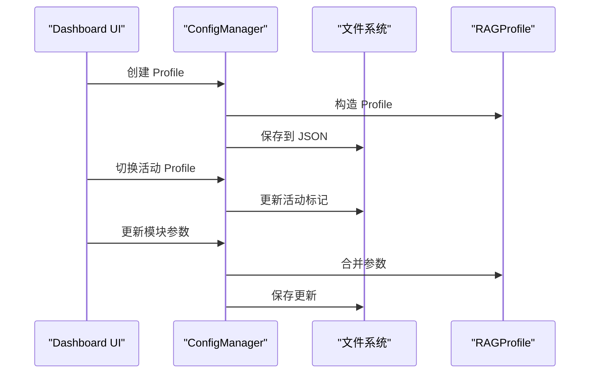
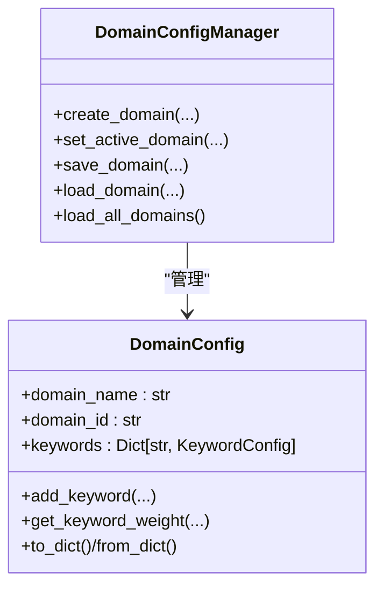
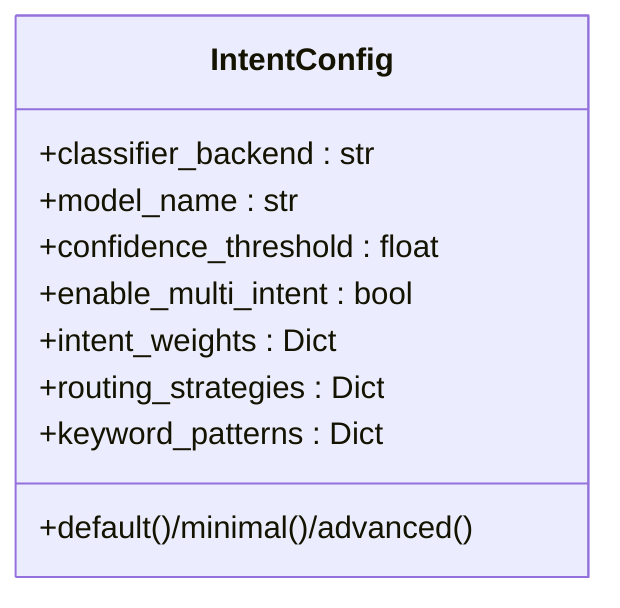
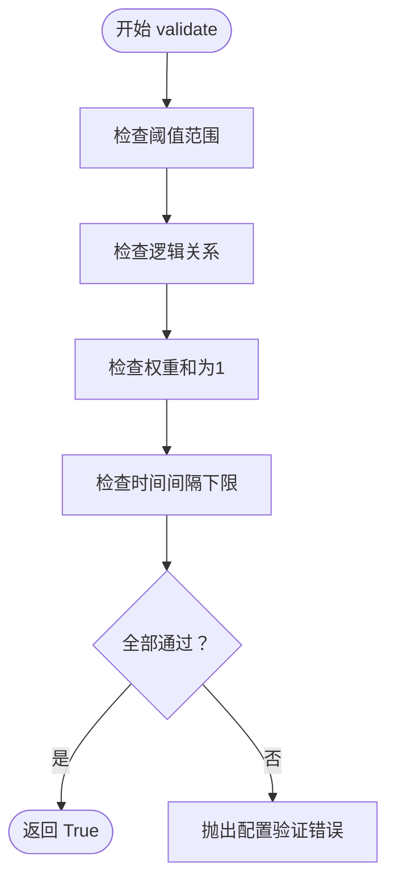
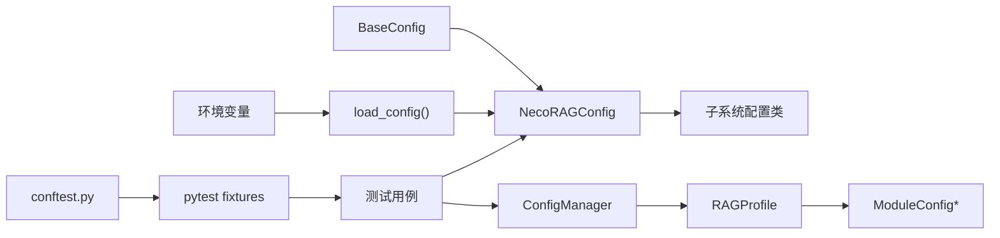

# 配置管理系统

<cite>
**本文引用的文件**
- [src/core/config.py](file://src/core/config.py)
- [src/dashboard/config_manager.py](file://src/dashboard/config_manager.py)
- [src/dashboard/models.py](file://src/dashboard/models.py)
- [src/domain/config.py](file://src/domain/config.py)
- [src/intent/config.py](file://src/intent/config.py)
- [src/knowledge_evolution/config.py](file://src/knowledge_evolution/config.py)
- [src/adaptive/config.py](file://src/adaptive/config.py)
- [src/security/config.py](file://src/security/config.py)
- [src/core/exceptions.py](file://src/core/exceptions.py)
- [tests/test_core/test_config.py](file://tests/test_core/test_config.py)
- [tests/conftest.py](file://tests/conftest.py)
- [example/example_usage.py](file://example/example_usage.py)
- [wiki/wiki/配置管理/配置管理.md](file://wiki/wiki/配置管理/配置管理.md)
- [wiki/wiki/配置管理/全局配置.md](file://wiki/wiki/配置管理/全局配置.md)
- [wiki/wiki/配置管理/预设配置.md](file://wiki/wiki/配置管理/预设配置.md)
- [wiki/wiki/配置管理/环境变量配置.md](file://wiki/wiki/配置管理/环境变量配置.md)
</cite>

## 目录
1. [简介](#简介)
2. [项目结构](#项目结构)
3. [核心组件](#核心组件)
4. [架构总览](#架构总览)
5. [详细组件分析](#详细组件分析)
6. [依赖分析](#依赖分析)
7. [性能考虑](#性能考虑)
8. [故障排查指南](#故障排查指南)
9. [结论](#结论)
10. [附录](#附录)

## 简介
本文件系统性阐述 NecoRAG 配置管理系统的整体设计与实现，涵盖全局配置的层级结构、模块化配置的组织方式、预设配置的模板设计、环境变量的支持机制、配置文件的加载优先级、运行时配置的热更新策略、配置验证的规则设计、配置迁移的版本管理以及服务发现的集成方案。文档还提供最佳实践、安全考虑与性能优化策略，并配套完整的配置示例、API 参考与故障排除指南，帮助开发者构建灵活可靠的配置管理体系。

## 项目结构
配置管理涉及三大层面：
- 核心配置层：统一的全局配置与各子系统配置类，支持从文件与环境变量加载，提供预设配置模式。
- Dashboard 配置层：基于 Profile 的模块化配置管理，支持创建、切换、导入导出、参数校验与持久化。
- 测试配置层：通过 pytest fixtures 提供标准化的配置测试夹具，支持单元测试、集成测试与端到端测试。

**图表来源**
- [src/core/config.py:266-318](file://src/core/config.py#L266-L318)
- [src/core/config.py:375-405](file://src/core/config.py#L375-L405)
- [src/dashboard/config_manager.py:14-41](file://src/dashboard/config_manager.py#L14-L41)
- [src/dashboard/models.py:165-220](file://src/dashboard/models.py#L165-L220)
- [tests/conftest.py:48-81](file://tests/conftest.py#L48-L81)

**章节来源**
- [src/core/config.py:266-318](file://src/core/config.py#L266-L318)
- [src/dashboard/config_manager.py:14-41](file://src/dashboard/config_manager.py#L14-L41)
- [src/dashboard/models.py:165-220](file://src/dashboard/models.py#L165-L220)
- [tests/conftest.py:48-81](file://tests/conftest.py#L48-L81)

## 核心组件
- 全局配置类 NecoRAGConfig：聚合各子系统配置，提供从字典/文件加载、保存、预设配置等能力。
- 子系统配置类：LLM、感知、记忆、检索、巩固、响应、领域权重、知识演化等，均继承统一的 BaseConfig，具备 to_dict/from_dict/save/load 能力。
- 环境变量加载：load_config 支持按约定前缀读取环境变量，覆盖默认值与文件配置。
- Dashboard 配置管理：ConfigManager 提供 Profile 的创建、切换、更新、导入导出、持久化与加载。
- 领域配置：DomainConfig 与 DomainConfigManager 提供领域关键字、权重、时间衰减等配置与持久化。
- 意图配置：IntentConfig 提供意图分类器、路由策略、关键词模式等配置与多种预设。
- 知识演化配置：KnowledgeEvolutionConfig 提供实时/定时更新、变更日志、回滚、健康度阈值、评分权重等配置，并内置 validate 校验。
- 测试配置系统：通过 pytest fixtures 提供标准化的配置测试夹具，支持快速创建测试配置实例。

**章节来源**
- [src/core/config.py:46-77](file://src/core/config.py#L46-L77)
- [src/core/config.py:266-318](file://src/core/config.py#L266-L318)
- [src/core/config.py:323-362](file://src/core/config.py#L323-L362)
- [src/dashboard/config_manager.py:14-41](file://src/dashboard/config_manager.py#L14-L41)
- [src/domain/config.py:54-160](file://src/domain/config.py#L54-L160)
- [src/intent/config.py:18-332](file://src/intent/config.py#L18-L332)
- [src/knowledge_evolution/config.py:15-91](file://src/knowledge_evolution/config.py#L15-L91)
- [tests/conftest.py:48-81](file://tests/conftest.py#L48-L81)

## 架构总览
配置加载与应用的总体流程如下：

**图表来源**
- [src/core/config.py:323-362](file://src/core/config.py#L323-L362)

**章节来源**
- [src/core/config.py:323-362](file://src/core/config.py#L323-L362)

## 详细组件分析

### 全局配置与环境变量支持
- 优先级：环境变量 > 配置文件 > 默认值。
- 环境变量映射：通过固定前缀（默认 NECORAG）与点号路径组合，如 NECORAG_LLM_PROVIDER 映射到 llm.provider。
- 嵌套属性设置：内部使用路径解析与反射设置嵌套字段。
- 配置保存/加载：统一的 BaseConfig.to_dict/from_dict/save/load，支持枚举与嵌套对象序列化。

**图表来源**
- [src/core/config.py:323-362](file://src/core/config.py#L323-L362)
- [src/core/config.py:365-371](file://src/core/config.py#L365-L371)

**章节来源**
- [src/core/config.py:323-362](file://src/core/config.py#L323-L362)
- [src/core/config.py:365-371](file://src/core/config.py#L365-L371)

### 预设配置模式
- ConfigPresets：提供开发、生产、最小化三种预设，分别针对调试开关、性能与稳定性、快速启动场景进行优化。
- KnowledgeEvolutionConfig：提供默认、积极、保守、最小化四种策略，覆盖实时/定时更新、变更日志、回滚、健康度阈值、评分权重等。

**图表来源**
- [src/core/config.py:375-405](file://src/core/config.py#L375-L405)
- [src/knowledge_evolution/config.py:94-166](file://src/knowledge_evolution/config.py#L94-L166)

**章节来源**
- [src/core/config.py:375-405](file://src/core/config.py#L375-L405)
- [src/knowledge_evolution/config.py:94-166](file://src/knowledge_evolution/config.py#L94-L166)

### Dashboard 配置管理（Profile）
- ConfigManager：负责 Profile 的创建、切换、更新、删除、复制、导入导出、持久化与加载。
- RAGProfile：包含五个模块的 ModuleConfig，支持 to_dict/from_dict 序列化。
- 模块参数：每个模块参数以字典形式存储，支持实时编辑与保存。

**图表来源**
- [src/dashboard/config_manager.py:42-166](file://src/dashboard/config_manager.py#L42-L166)
- [src/dashboard/models.py:165-220](file://src/dashboard/models.py#L165-L220)

**章节来源**
- [src/dashboard/config_manager.py:42-166](file://src/dashboard/config_manager.py#L42-L166)
- [src/dashboard/models.py:165-220](file://src/dashboard/models.py#L165-L220)

### 领域配置与权重
- DomainConfig：包含领域名称、ID、描述、关键字集合、相关领域、权重系数、时间衰减等。
- DomainConfigManager：提供创建、激活、保存、加载、批量加载等能力。
- 关键字权重范围自动校正，别名索引支持。

**图表来源**
- [src/domain/config.py:54-160](file://src/domain/config.py#L54-L160)
- [src/domain/config.py:163-241](file://src/domain/config.py#L163-L241)

**章节来源**
- [src/domain/config.py:54-160](file://src/domain/config.py#L54-L160)
- [src/domain/config.py:163-241](file://src/domain/config.py#L163-L241)

### 意图配置与路由策略
- IntentConfig：包含分类器后端、模型名、置信度阈值、多意图支持、意图权重、路由策略、关键词模式等。
- 提供默认、最小化、高级三种预设，便于快速切换。

**图表来源**
- [src/intent/config.py:18-332](file://src/intent/config.py#L18-L332)

**章节来源**
- [src/intent/config.py:18-332](file://src/intent/config.py#L18-L332)

### 知识演化配置与验证
- 知识演化配置覆盖实时/定时更新、变更日志、回滚、健康度阈值、评分权重、查询日志、知识积累等。
- validate 方法对阈值、逻辑关系、权重和时间间隔进行严格校验，不符合要求时抛出异常。

**图表来源**
- [src/knowledge_evolution/config.py:168-214](file://src/knowledge_evolution/config.py#L168-L214)

**章节来源**
- [src/knowledge_evolution/config.py:168-214](file://src/knowledge_evolution/config.py#L168-L214)

## 依赖分析
- 组件内聚：各配置类均继承 BaseConfig，统一了序列化与持久化能力，降低耦合。
- 组件耦合：Dashboard 的 ConfigManager 依赖 RAGProfile 与 ModuleConfig；全局配置层通过 load_config 与环境变量解耦。
- 外部依赖：JSON 文件作为配置持久化介质；环境变量作为外部输入源；Dashboard 通过 REST API 与前端交互。
- 测试依赖：pytest fixtures 依赖核心配置模块，提供测试所需的配置实例和数据对象。

**图表来源**
- [src/core/config.py:46-77](file://src/core/config.py#L46-L77)
- [src/core/config.py:266-318](file/：src/core/config.py#L266-L318)
- [src/dashboard/config_manager.py:14-41](file://src/dashboard/config_manager.py#L14-L41)
- [src/dashboard/models.py:165-220](file://src/dashboard/models.py#L165-L220)
- [tests/conftest.py:48-81](file://tests/conftest.py#L48-L81)

**章节来源**
- [src/core/config.py:46-77](file://src/core/config.py#L46-L77)
- [src/core/config.py:266-318](file://src/core/config.py#L266-L318)
- [src/dashboard/config_manager.py:14-41](file://src/dashboard/config_manager.py#L14-L41)
- [src/dashboard/models.py:165-220](file://src/dashboard/models.py#L165-L220)
- [tests/conftest.py:48-81](file://tests/conftest.py#L48-L81)

## 性能考虑
- 配置加载：文件读取与 JSON 解析为轻量操作；建议在应用启动时一次性加载，避免频繁 IO。
- 环境变量覆盖：仅在必要时读取，避免在热路径中重复解析。
- Dashboard Profile：Profile 数量较多时，注意磁盘 IO 与内存占用；可通过懒加载与缓存优化。
- 验证开销：validate 在配置变更时执行，建议在开发/CI 阶段启用严格校验，在生产环境根据需求选择性启用。
- 测试性能：pytest fixtures 通过延迟创建和缓存机制优化测试性能，避免重复创建昂贵的对象。

## 故障排查指南
- 配置加载失败
  - 检查配置文件路径与权限；确认 JSON 格式正确。
  - 确认环境变量前缀与键名一致。
- 配置验证失败
  - 根据 validate 抛出的错误信息逐一修正阈值、权重与时间间隔。
  - 参考异常类型：ConfigurationError、ValidationError。
- Dashboard 操作异常
  - 检查 Profile 文件是否存在与可读写。
  - 确认模块参数键名与前端一致。
- 知识演化异常
  - 关注健康度阈值与评分权重；检查回滚窗口与变更日志配置。
- 测试配置异常
  - 检查 conftest.py 中的 fixtures 定义是否正确。
  - 确认测试夹具的依赖关系和导入路径。
  - 验证测试配置与实际配置类的一致性。

**章节来源**
- [src/core/exceptions.py:256-295](file://src/core/exceptions.py#L256-L295)
- [src/knowledge_evolution/config.py:168-214](file://src/knowledge_evolution/config.py#L168-L214)
- [src/dashboard/config_manager.py:289-315](file://src/dashboard/config_manager.py#L289-L315)
- [tests/conftest.py:48-81](file://tests/conftest.py#L48-L81)

## 结论
本配置管理体系通过"文件 + 环境变量"的双通道加载、统一的序列化与预设策略、Dashboard 的可视化管理，以及完善的测试配置系统，实现了灵活、可维护、可迁移的配置方案。新增的测试配置系统通过 pytest fixtures 提供了强大的测试支持，确保配置的正确性与稳定性。配合严格的验证与完善的异常体系，能够在不同环境中稳定运行并快速定位问题。

## 附录

### 环境变量支持与优先级规则
- 优先级：环境变量 > 配置文件 > 默认值。
- 前缀：默认 NECORAG，可通过参数修改。
- 映射示例：NECORAG_LLM_PROVIDER → llm.provider；NECORAG_VECTOR_DB → memory.vector_db_provider。

**章节来源**
- [src/core/config.py:323-362](file://src/core/config.py#L323-L362)

### 预设配置模式使用指南
- 开发环境：开启调试、使用内存数据库、简化检索与巩固策略。
- 生产环境：提升检索与巩固强度，启用重排序与图谱搜索。
- 最小化：关闭非核心功能，适合快速启动与资源受限场景。
- 知识演化：默认/积极/保守/最小化策略，按业务风险与吞吐需求选择。

**章节来源**
- [src/core/config.py:375-405](file://src/core/config.py#L375-L405)
- [src/knowledge_evolution/config.py:94-166](file://src/knowledge_evolution/config.py#L94-L166)

### 配置验证机制与错误处理策略
- validate：对阈值、逻辑关系、权重和时间间隔进行校验，失败抛出异常。
- 异常类型：ConfigurationError、ValidationError、KnowledgeEvolutionError 等。
- 建议：在 CI/CD 中启用严格校验；生产环境可根据需要放宽。
- 测试验证：通过 pytest fixtures 提供的测试夹具验证配置的正确性。

**章节来源**
- [src/knowledge_evolution/config.py:168-214](file://src/knowledge_evolution/config.py#L168-L214)
- [src/core/exceptions.py:256-295](file://src/core/exceptions.py#L256-L295)
- [tests/conftest.py:48-81](file://tests/conftest.py#L48-L81)

### 配置迁移与版本管理最佳实践
- 文件命名：使用带时间戳或版本号的文件名，便于回溯。
- 变更记录：利用变更日志与回滚机制，记录每次更新的上下文。
- 环境隔离：通过 Profile 与环境变量区分开发/测试/生产环境。
- 文档同步：保持配置文件与注释同步，明确字段含义与默认值来源。
- 测试驱动：通过测试配置系统确保配置变更不会破坏现有功能。

**章节来源**
- [src/dashboard/config_manager.py:289-315](file://src/dashboard/config_manager.py#L289-L315)
- [src/knowledge_evolution/config.py:15-91](file://src/knowledge_evolution/config.py#L15-L91)
- [tests/conftest.py:48-81](file://tests/conftest.py#L48-L81)

### 测试配置系统使用指南
- 创建测试配置：使用 conftest.py 中提供的 fixtures 快速创建测试配置
- 参数化测试：通过 fixtures 的参数化支持创建不同配置的测试场景
- Mock 对象：使用 mock_llm_client 等 Mock 对象替代真实服务
- 数据准备：通过 sample_* fixtures 提供测试所需的数据对象
- 测试组织：按照测试类型（单元测试、集成测试、端到端测试）合理使用不同的 fixtures

**章节来源**
- [tests/conftest.py:48-330](file://tests/conftest.py#L48-L330)
- [tests/test_core/test_config.py:35-122](file://tests/test_core/test_config.py#L35-L122)
- [tests/test_integration/test_necorag.py:35-98](file://tests/test_integration/test_necorag.py#L35-L98)

### 安全配置与最佳实践
- JWT 配置：支持从环境变量读取密钥、算法与过期时间。
- OAuth2 配置：支持 GitHub 与 Google 的客户端 ID/Secret 配置。
- 安全策略：速率限制、CSRF 保护、XSS 保护、跨域白名单、密码强度策略。
- 环境变量注入：通过 Docker 编排集中管理敏感配置。

**章节来源**
- [src/security/config.py:11-84](file://src/security/config.py#L11-L84)