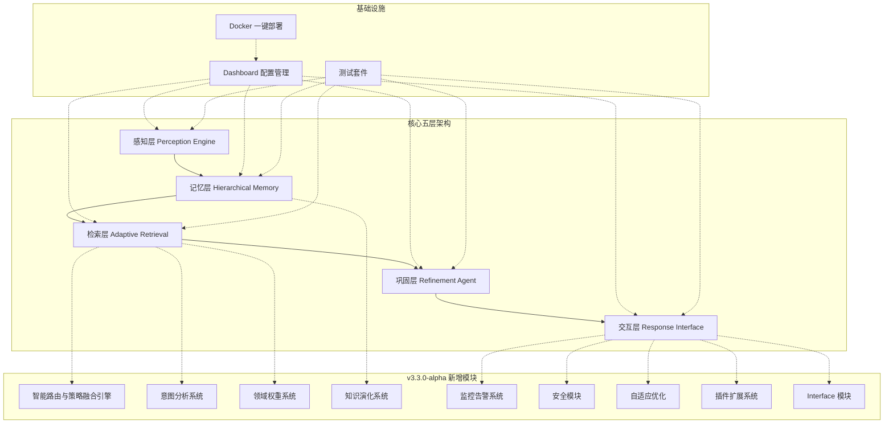
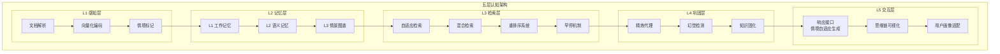
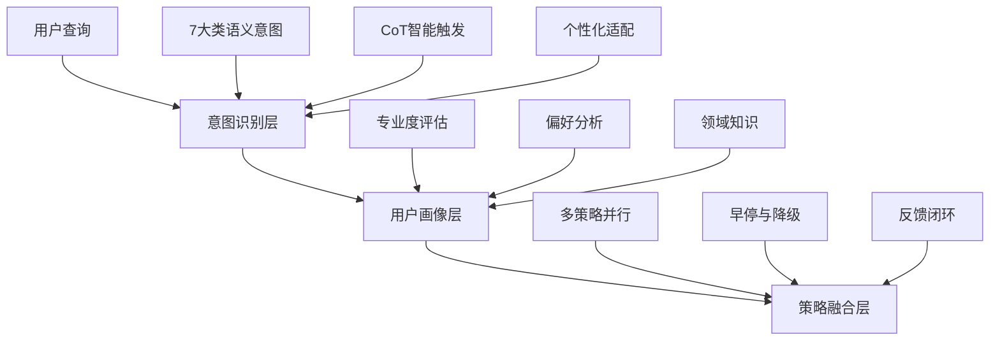
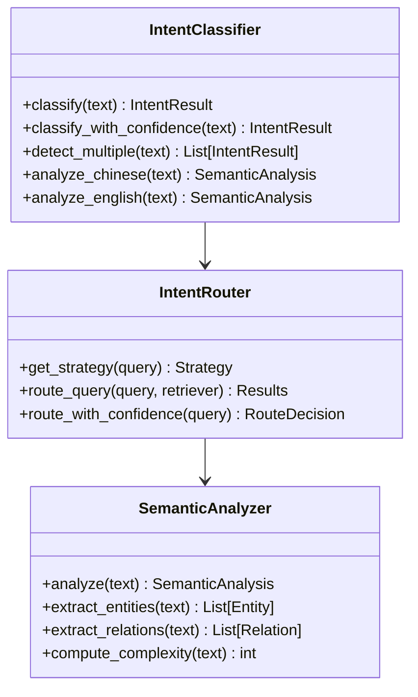
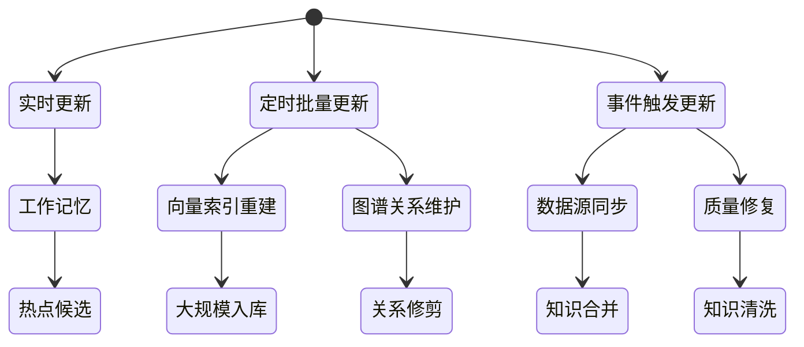
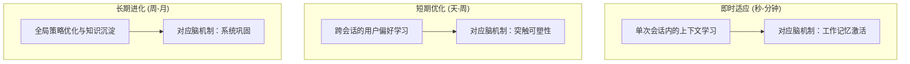
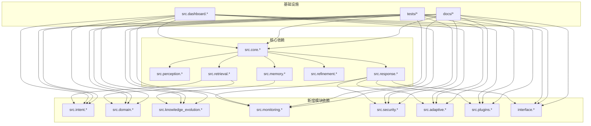

# 开发路线图

<cite>
**本文档引用的文件**
- [README.md](file://README.md)
- [VERSION_README.md](file://VERSION_README.md)
- [RELEASE_NOTES_v3.1.0.md](file://RELEASE_NOTES_v3.1.0.md)
- [QUICKSTART.md](file://QUICKSTART.md)
- [CONTRIBUTING.md](file://CONTRIBUTING.md)
- [src/retrieval/smart_routing/README.md](file://src/retrieval/smart_routing/README.md)
- [src/intent/README.md](file://src/intent/README.md)
- [src/domain/README.md](file://src/domain/README.md)
- [src/knowledge_evolution/README.md](file://src/knowledge_evolution/README.md)
- [src/monitoring/README.md](file://src/monitoring/README.md)
- [src/security/README.md](file://src/security/README.md)
- [src/adaptive/README.md](file://src/adaptive/README.md)
- [src/plugins/README.md](file://src/plugins/README.md)
- [src/dashboard/README.md](file://src/dashboard/README.md)
- [src/necorag.py](file://src/necorag.py)
- [example/example_usage.py](file://example/example_usage.py)
</cite>

## 目录
1. [项目简介](#项目简介)
2. [项目结构](#项目结构)
3. [核心组件](#核心组件)
4. [架构总览](#架构总览)
5. [详细组件分析](#详细组件分析)
6. [依赖分析](#依赖分析)
7. [性能考量](#性能考量)
8. [故障排查指南](#故障排查指南)
9. [结论](#结论)
10. [附录](#附录)

## 项目简介
NecoRAG 是一个模拟人脑双系统记忆与认知科学理论的下一代认知型 RAG 框架。项目采用五层认知架构，从感知到交互形成完整闭环，并在 v3.3.0-alpha 版本中引入了多项核心增强模块，包括智能路由与策略融合引擎、意图分析系统、领域权重系统、知识演化系统、监控告警系统、安全模块、自适应优化、插件扩展系统等。

当前版本为 v3.3.0-alpha，项目已完成可视化调试面板、8 个新增核心模块以及智能路由引擎等关键里程碑，为后续的生产环境部署和生态建设奠定了坚实基础。

**章节来源**
- [README.md: 25-50:25-50](file://README.md#L25-L50)
- [README.md: 736-776:736-776](file://README.md#L736-L776)

## 项目结构
项目采用模块化的分层架构设计，主要分为以下几大模块：



**图表来源**
- [README.md: 52-102:52-102](file://README.md#L52-L102)
- [QUICKSTART.md: 435-478:435-478](file://QUICKSTART.md#L435-L478)

**章节来源**
- [README.md: 52-102:52-102](file://README.md#L52-L102)
- [QUICKSTART.md: 435-478:435-478](file://QUICKSTART.md#L435-L478)

## 核心组件
基于 v3.3.0-alpha 版本，项目的核心组件包括：

### 1. 感知引擎模块 (Perception Engine)
负责多模态数据的高精度编码与情境标记，支持文档解析、向量化、情境标签生成等功能。

### 2. 层级记忆存储 (Hierarchical Memory)
模拟人类三层记忆系统，包括工作记忆 L1、语义记忆 L2 和情景图谱 L3，实现动态权重衰减机制。

### 3. 自适应检索 (Adaptive Retrieval)
基于扩散激活理论的混合检索与重排序，包含 HyDE 增强、Novelty Re-ranker 和早停机制。

### 4. 精炼代理 (Refinement Agent)
异步知识固化、幻觉自检与记忆修剪的闭环系统。

### 5. 响应接口 (Response Interface)
情境自适应生成与可解释性输出，支持思维链可视化。

### 6. v3.3.0-alpha 新增模块
- 智能路由与策略融合引擎
- 意图分析系统
- 领域权重系统
- 知识演化系统
- 监控告警系统
- 安全模块
- 自适应优化
- 插件扩展系统
- Interface 模块

**章节来源**
- [README.md: 383-606:383-606](file://README.md#L383-L606)
- [README.md: 104-183:104-183](file://README.md#L104-L183)

## 架构总览
NecoRAG 采用"五层认知"分层架构，每一层对应人脑认知机制的不同阶段：



**图表来源**
- [README.md: 56-102:56-102](file://README.md#L56-L102)

## 详细组件分析

### 智能路由与策略融合引擎
智能路由与策略融合引擎是 v3.3.0-alpha 的核心创新，整合了语义意图分类、CoT 思维链推理和用户画像三大核心能力。

#### 三层决策架构


**图表来源**
- [src/retrieval/smart_routing/README.md: 15-25:15-25](file://src/retrieval/smart_routing/README.md#L15-L25)

#### 核心特性
- **7大类语义意图识别**：事实查询、比较分析、推理演绎、概念解释、摘要总结、操作指导、探索发散
- **个性化专业度适配**：专家（简洁专业）、中级（平衡解释）、新手（详细引导）
- **智能早停与降级**：四级降级机制，根据延迟动态调整计算负载
- **多策略并行融合**：同时执行多种检索策略并智能融合结果

**章节来源**
- [src/retrieval/smart_routing/README.md: 13-61:13-61](file://src/retrieval/smart_routing/README.md#L13-L61)
- [src/retrieval/smart_routing/README.md: 237-266:237-266](file://src/retrieval/smart_routing/README.md#L237-L266)

### 意图分析系统
意图分析系统负责多语言语义理解、意图分类和智能路由，支持中文和英文的深度语义分析。

#### 意图分类体系


**图表来源**
- [src/intent/README.md: 21-106:21-106](file://src/intent/README.md#L21-L106)

#### 多语言处理策略
- **中文查询**：使用阿里巴巴千问 3.5 进行深度语义理解
- **英文查询**：使用 FastText 轻量级分类
- **其他语言**：使用 spaCy + 规则匹配

**章节来源**
- [src/intent/README.md: 19-61:19-61](file://src/intent/README.md#L19-L61)
- [src/intent/README.md: 107-153:107-153](file://src/intent/README.md#L107-L153)

### 领域权重系统
领域权重系统实现领域知识增强、时间衰减和多维权重融合，确保最相关的知识优先呈现。

#### 权重计算公式
```mermaid
flowchart LR
A["基础分数"] --> B["关键字权重"]
B --> C["时间权重"]
C --> D["领域权重"]
D --> E["意图权重"]
E --> F["最终权重"]
F = A × α × B × β × C × γ × D × δ × E
```

**图表来源**
- [src/domain/README.md: 24-29:24-29](file://src/domain/README.md#L24-L29)

#### 时间衰减模型
- **指数衰减模型**：temporal_weight = e^(-λ × Δt)
- **衰减系数参考**：快速变化（λ=2.0）、中速变化（λ=1.0）、慢速变化（λ=0.5）、稳定知识（λ=0.1）

**章节来源**
- [src/domain/README.md: 18-55:18-55](file://src/domain/README.md#L18-L55)
- [src/domain/README.md: 108-159:108-159](file://src/domain/README.md#L108-L159)

### 知识演化系统
知识演化系统让 NecoRAG 从"静态知识库"进化为"活体知识库"，越用越智能。

#### 更新模式


**图表来源**
- [src/knowledge_evolution/README.md: 26-100:26-100](file://src/knowledge_evolution/README.md#L26-L100)

#### 指标体系
- **规模指标**：总知识量、L1/L2/L3 数量、向量覆盖率
- **新鲜度指标**：平均知识年龄、近7天更新率、知识半衰期
- **质量指标**：检索命中率、碎片率、冗余度、准确性评分
- **连通性指标**：平均度数、连通率、孤立节点数、平均路径长度

**章节来源**
- [src/knowledge_evolution/README.md: 157-228:157-228](file://src/knowledge_evolution/README.md#L157-L228)

### 监控告警系统
监控告警模块为 NecoRAG 系统提供全面的监控解决方案，包括系统指标收集、健康检查、告警管理和可视化仪表板。

#### 指标收集范围
- **系统级指标**：CPU、内存、磁盘、网络使用率
- **应用级指标**：RAG 响应时间、API 调用统计、缓存命中率
- **Python 运行时**：垃圾回收、内存使用、进程信息
- **Prometheus 格式**：标准指标导出格式

#### 健康检查维度
- **多维度检查**：数据库、Redis、LLM 服务、磁盘空间
- **并发执行**：高效的并行健康检查
- **历史记录**：检查结果历史追踪
- **灵活配置**：可自定义检查项和阈值

**章节来源**
- [src/monitoring/README.md: 7-32:7-32](file://src/monitoring/README.md#L7-L32)
- [src/monitoring/README.md: 92-145:92-145](file://src/monitoring/README.md#L92-L145)

### 安全模块
安全认证模块为 NecoRAG 系统提供完整的企业级安全解决方案，包括用户认证、权限控制、安全防护等功能。

#### 认证服务
- **JWT Token 认证**：基于 JWT 的无状态认证机制
- **OAuth2.0 集成**：支持 GitHub、Google 等第三方登录
- **密码强度验证**：可配置的密码复杂度要求
- **会话管理**：安全的用户会话跟踪

#### 权限控制
- **RBAC 模型**：基于角色的访问控制
- **细粒度权限**：支持 API、数据、界面等多维度权限
- **动态权限分配**：运行时权限管理和验证
- **装饰器支持**：便捷的权限检查语法

**章节来源**
- [src/security/README.md: 7-26:7-26](file://src/security/README.md#L7-L26)
- [src/security/README.md: 90-144:90-144](file://src/security/README.md#L90-L144)

### 自适应优化引擎
自适应优化引擎让 NecoRAG 具备"越用越懂你"的能力，实现真正的个性化智能服务。

#### 三层自适应学习架构


**图表来源**
- [src/adaptive/README.md: 26-57:26-57](file://src/adaptive/README.md#L26-L57)

#### 策略优化算法
- **Thompson Sampling（汤普森采样）**：基于多臂老虎机问题的策略优化
- **探索-利用平衡**：通过概率采样平衡新策略探索和已知策略利用
- **反馈信号融合**：融合显式和隐式用户反馈信号

**章节来源**
- [src/adaptive/README.md: 165-226:165-226](file://src/adaptive/README.md#L165-L226)
- [src/adaptive/README.md: 318-346:318-346](file://src/adaptive/README.md#L318-L346)

### 插件扩展系统
插件模块为 NecoRAG 提供可扩展的架构，支持动态加载和管理各种功能插件。

#### 插件类型
- **感知层插件**：数据预处理、格式转换
- **记忆层插件**：数据存储、缓存管理
- **检索层插件**：搜索算法、索引管理
- **巩固层插件**：数据验证、质量控制
- **响应层插件**：输出格式化、结果呈现

#### 事件系统
- **事件发布/订阅机制**：插件间通信
- **系统状态通知**：插件生命周期管理
- **依赖关系解析**：插件加载顺序控制

**章节来源**
- [src/plugins/README.md: 7-26:7-26](file://src/plugins/README.md#L7-L26)
- [src/plugins/README.md: 137-167:137-167](file://src/plugins/README.md#L137-L167)

## 依赖分析
项目采用模块化设计，各组件之间存在明确的依赖关系：



**图表来源**
- [src/necorag.py: 17-46:17-46](file://src/necorag.py#L17-L46)

**章节来源**
- [src/necorag.py: 17-46:17-46](file://src/necorag.py#L17-L46)

## 性能考量
基于 v3.3.0-alpha 版本的性能指标和优化建议：

### 性能基准
- **检索准确率 (Recall@K)**：相比传统 Vector RAG 提升 +20%
- **幻觉率**：< 5%，通过 Refinement Agent 实现
- **简单查询延迟**：< 800ms（首字延迟）
- **复杂查询延迟**：< 1500ms（多跳 + 重排）
- **上下文压缩率**：-40%，通过记忆衰减实现

### 优化策略
1. **智能路由优化**：通过意图分析和用户画像实现个性化策略选择
2. **早停机制**：当置信度达标时立即返回，减少不必要的计算
3. **多策略并行**：同时执行多种检索策略并智能融合
4. **动态权重衰减**：模拟生物记忆的巩固与遗忘机制
5. **缓存机制**：高频查询意图缓存，降低响应时间

**章节来源**
- [README.md: 721-735:721-735](file://README.md#L721-L735)
- [src/retrieval/smart_routing/README.md: 197-233:197-233](file://src/retrieval/smart_routing/README.md#L197-L233)

## 故障排查指南
针对 v3.3.0-alpha 版本的常见问题和解决方案：

### 智能路由引擎问题
**问题**：路由决策不准确
**解决方案**：
1. 检查意图分类器的训练数据质量
2. 调整置信度阈值以提高召回率
3. 添加自定义规则处理特殊情况

**问题**：CoT 触发过于频繁
**解决方案**：
1. 降低最小复杂度阈值（min_complexity）
2. 调整最大推理步骤数（max_steps）
3. 优化策略权重配置

### 意图分析系统问题
**问题**：中文理解效果差
**优化方法**：
1. 确保使用千问 3.5 模型
2. 提供领域特定的 few-shot 示例
3. 启用多意图检测功能

**问题**：多意图处理不当
**调试方法**：
1. 启用多意图检测
2. 查看检测结果和权重分布
3. 调整意图映射表

### 领域权重系统问题
**问题**：权重计算结果异常
**排查步骤**：
1. 检查各项权重分量的计算结果
2. 验证配置参数的正确性
3. 检查关键字词典和权重设置

**问题**：时间衰减过快/过慢
**调整方法**：
1. 针对特定领域调整衰减系数
2. 使用全局衰减系数进行统一调整
3. 考虑经典知识保护机制

### 知识演化系统问题
**问题**：定时任务不执行
**排查步骤**：
1. 检查调度器运行状态
2. 查看已注册任务的下次运行时间
3. 检查时区设置和时区配置

**问题**：健康分数偏低
**诊断方法**：
1. 获取详细指标数据
2. 分析各项得分的具体数值
3. 找出薄弱环节并针对性优化

### 监控告警系统问题
**问题**：指标收集失败
**解决方案**：
1. 检查 psutil 权限和版本
2. 验证系统指标收集的可用性
3. 检查监控服务的启动状态

**问题**：健康检查超时
**优化方法**：
1. 调整健康检查超时配置
2. 优化检查逻辑的执行效率
3. 实现超时保护机制

### 安全模块问题
**问题**：Token 过期
**解决方案**：
1. 检查 JWT_EXPIRE_MINUTES 配置
2. 验证 JWT 密钥的正确性
3. 实现 Token 刷新机制

**问题**：权限不足
**排查步骤**：
1. 验证用户角色和权限配置
2. 检查权限检查装饰器的使用
3. 确认权限继承关系的正确性

### 自适应优化问题
**问题**：偏好预测不准确
**解决方案**：
1. 增加训练数据量
2. 调整特征工程和模型参数
3. 启用深度学习分析功能

**问题**：策略优化收敛慢
**优化方法**：
1. 提高学习率和探索率
2. 使用更高效的优化算法（如汤普森采样）
3. 实现主动学习机制

### 插件系统问题
**问题**：插件加载失败
**排查步骤**：
1. 检查插件类是否正确继承基类
2. 验证必需方法的正确实现
3. 查看日志了解具体的错误信息

**问题**：依赖循环
**解决方案**：
1. 检查插件间的依赖关系
2. 使用依赖解析工具分析循环依赖
3. 重新设计插件架构以消除循环

**章节来源**
- [src/retrieval/smart_routing/README.md: 314-331:314-331](file://src/retrieval/smart_routing/README.md#L314-L331)
- [src/intent/README.md: 314-348:314-348](file://src/intent/README.md#L314-L348)
- [src/domain/README.md: 403-446:403-446](file://src/domain/README.md#L403-L446)
- [src/knowledge_evolution/README.md: 470-520:470-520](file://src/knowledge_evolution/README.md#L470-L520)
- [src/monitoring/README.md: 285-305:285-305](file://src/monitoring/README.md#L285-L305)
- [src/security/README.md: 268-276:268-276](file://src/security/README.md#L268-L276)
- [src/adaptive/README.md: 530-575:530-575](file://src/adaptive/README.md#L530-L575)
- [src/plugins/README.md: 208-225:208-225](file://src/plugins/README.md#L208-L225)

## 结论
NecoRAG 项目在 v3.3.0-alpha 版本中实现了重要的里程碑，完成了从骨架搭建到大脑注入的关键转变。项目不仅建立了完整的五层认知架构，更重要的是引入了多项创新性的增强模块，使系统具备了更强的智能性和个性化服务能力。

### 已完成的关键成就
1. **智能路由引擎**：实现了三层决策架构，支持语义意图识别、用户画像适配和策略融合
2. **意图分析系统**：提供了多语言深度语义理解能力
3. **领域权重系统**：实现了多维度加权融合的检索优化
4. **知识演化系统**：让知识库具备了自进化能力
5. **监控告警系统**：提供了全面的系统监控和告警能力
6. **安全模块**：实现了企业级的安全认证和权限控制
7. **自适应优化**：具备了"越用越懂你"的个性化能力
8. **插件扩展系统**：提供了可扩展的架构设计

### 未来发展方向
1. **生产环境部署**：进一步完善 Docker 一键部署配置
2. **移动端开发**：响应式布局已支持，计划开发原生移动端应用
3. **社区生态建设**：建立插件市场和扩展生态系统
4. **企业级功能增强**：多租户、审计、报表等高级功能
5. **性能优化**：持续优化响应时间和资源利用率

**章节来源**
- [README.md: 736-776:736-776](file://README.md#L736-L776)
- [QUICKSTART.md: 510-519:510-519](file://QUICKSTART.md#L510-L519)

## 附录

### 版本管理
项目采用统一的版本管理策略，当前版本为 v3.3.0-alpha，支持自动版本同步和多平台兼容。

**章节来源**
- [VERSION_README.md: 1-91:1-91](file://VERSION_README.md#L1-L91)

### 开源贡献
项目欢迎社区贡献，提供了完善的贡献指南和多种参与方式：

#### 贡献方式
1. **报告问题**：通过 Issues 提交 bug 和功能建议
2. **提交代码**：遵循代码规范和提交规范
3. **改进文档**：修复拼写错误、改进表述、添加示例
4. **分享想法**：通过 Discussions 分享想法和建议

#### 开发环境设置
```bash
# 1. Fork 项目
# 2. 克隆项目
git clone https://gitee.com/YOUR_USERNAME/NecoRAG.git
cd NecoRAG

# 3. 创建虚拟环境
python -m venv venv
source venv/bin/activate  # Linux/Mac
venv\Scripts\activate     # Windows

# 4. 安装依赖
pip install -r requirements.txt

# 5. 运行测试
python test_imports.py
```

**章节来源**
- [CONTRIBUTING.md: 5-179:5-179](file://CONTRIBUTING.md#L5-L179)

### 快速开始
项目提供了完整的快速开始指南，包含 v3.3.0-alpha 的新特性说明和使用示例。

**章节来源**
- [QUICKSTART.md: 5-547:5-547](file://QUICKSTART.md#L5-L547)

### 示例演示
项目包含完整的使用示例，展示了从感知层到交互层的完整工作流程。

**章节来源**
- [example/example_usage.py: 1-252:1-252](file://example/example_usage.py#L1-L252)