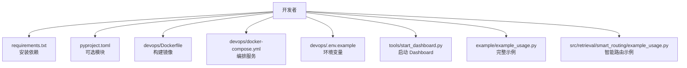
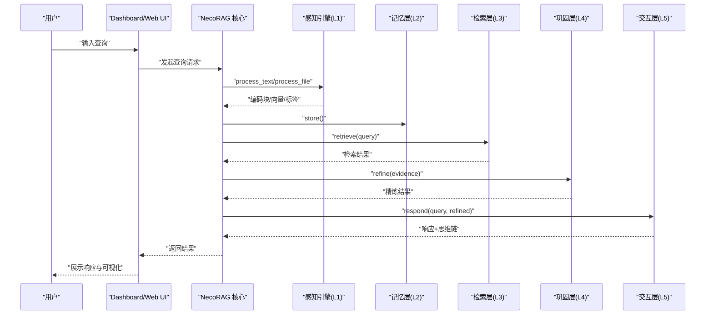
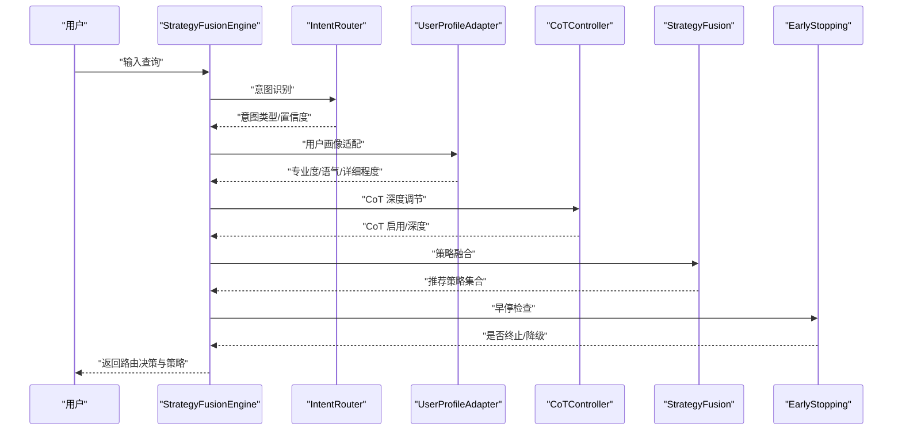

# 快速开始

<cite>
**本文引用的文件**
- [QUICKSTART.md](file://QUICKSTART.md)
- [README.md](file://README.md)
- [requirements.txt](file://requirements.txt)
- [pyproject.toml](file://pyproject.toml)
- [devops/Dockerfile](file://devops/Dockerfile)
- [devops/docker-compose.yml](file://devops/docker-compose.yml)
- [devops/.env.example](file://devops/.env.example)
- [devops/README.md](file://devops/README.md)
- [devops/scripts/start.sh](file://devops/scripts/start.sh)
- [devops/scripts/stop.sh](file://devops/scripts/stop.sh)
- [tools/start_dashboard.py](file://tools/start_dashboard.py)
- [tools/test_init.py](file://tools/test_init.py)
- [example/example_usage.py](file://example/example_usage.py)
- [src/retrieval/smart_routing/example_usage.py](file://src/retrieval/smart_routing/example_usage.py)
- [src/necorag.py](file://src/necorag.py)
</cite>

## 目录
1. [简介](#简介)
2. [项目结构](#项目结构)
3. [核心组件](#核心组件)
4. [架构总览](#架构总览)
5. [详细组件分析](#详细组件分析)
6. [依赖分析](#依赖分析)
7. [性能考虑](#性能考虑)
8. [故障排除指南](#故障排除指南)
9. [结论](#结论)
10. [附录](#附录)

## 简介
本指南面向首次接触 NecoRAG 的用户，目标是在 5 分钟内完成环境准备、安装依赖、运行示例，并启动 Dashboard 进行可视化配置与监控。同时覆盖 Docker 一键部署、环境变量配置、基础使用流程、v3.3 智能路由查询示例、Dashboard 访问与界面使用、以及常见问题排查。

## 项目结构
围绕“快速开始”目标，以下是最关键的目录与文件：
- 安装与环境
  - requirements.txt：核心依赖清单
  - pyproject.toml：可选模块与开发依赖
- Docker 部署
  - devops/Dockerfile：应用镜像构建
  - devops/docker-compose.yml：服务编排（Redis/Qdrant/Neo4j/Ollama/Grafana）
  - devops/.env.example：环境变量模板
  - devops/README.md：部署与运维说明
  - devops/scripts/start.sh / stop.sh：运维脚本
- 运行与示例
  - tools/test_init.py：模块导入测试
  - example/example_usage.py：完整工作流示例
  - src/retrieval/smart_routing/example_usage.py：v3.3 智能路由示例
  - tools/start_dashboard.py：Dashboard 启动脚本
- 文档与入口
  - QUICKSTART.md：本快速开始指南
  - README.md：项目总览与安装指引

**图表来源**
- [devops/Dockerfile:1-39](file://devops/Dockerfile#L1-L39)
- [devops/docker-compose.yml:1-164](file://devops/docker-compose.yml#L1-L164)
- [devops/.env.example:1-32](file://devops/.env.example#L1-L32)
- [requirements.txt:1-161](file://requirements.txt#L1-L161)
- [pyproject.toml:1-101](file://pyproject.toml#L1-L101)
- [tools/start_dashboard.py:1-56](file://tools/start_dashboard.py#L1-L56)
- [example/example_usage.py:1-252](file://example/example_usage.py#L1-L252)
- [src/retrieval/smart_routing/example_usage.py:1-204](file://src/retrieval/smart_routing/example_usage.py#L1-L204)

**章节来源**
- [README.md:185-280](file://README.md#L185-L280)
- [devops/README.md:1-336](file://devops/README.md#L1-L336)

## 核心组件
- 感知引擎（L1）：文档解析、向量化、情境标签
- 记忆层（L2）：工作记忆（Redis）、语义记忆（Qdrant）、情景图谱（Neo4j）
- 检索层（L3）：混合检索、HyDE 增强、重排序、早停机制
- 巩固层（L4）：内容精炼、幻觉检测、知识固化
- 交互层（L5）：情境自适应响应、思维链可视化
- Dashboard：Web 配置与监控、可视化调试面板（v3.3 新增）

**章节来源**
- [README.md:52-102](file://README.md#L52-L102)
- [README.md:104-183](file://README.md#L104-L183)

## 架构总览
下图展示从查询到响应的完整流程，以及 v3.3 智能路由与策略融合引擎的引入位置。

**图表来源**
- [src/necorag.py:390-514](file://src/necorag.py#L390-L514)
- [example/example_usage.py:1-252](file://example/example_usage.py#L1-L252)

**章节来源**
- [src/necorag.py:390-514](file://src/necorag.py#L390-L514)
- [example/example_usage.py:218-252](file://example/example_usage.py#L218-L252)

## 详细组件分析

### 环境要求与安装方式
- 环境要求
  - Python：3.9+（推荐 3.11）
  - 操作系统：Linux / macOS / Windows
  - 内存：最低 4GB，推荐 8GB+
  - 存储：至少 2GB 可用空间
- 安装方式（任选其一）
  - 使用 uv（推荐）
    - 安装 uv → 创建虚拟环境 → 安装依赖 → 验证
  - 使用 venv（标准方式）
    - 创建虚拟环境 → 激活 → 升级 pip → 安装依赖 → 验证
  - 使用 Conda
    - 创建环境 → 激活 → 安装依赖 → 验证
- Docker 一键部署（最简）
  - 进入 devops 目录 → 复制 .env.example 为 .env → docker-compose up -d → 访问 http://localhost:8000

**章节来源**
- [README.md:187-280](file://README.md#L187-L280)
- [devops/README.md:27-123](file://devops/README.md#L27-L123)
- [devops/.env.example:1-32](file://devops/.env.example#L1-L32)

### 依赖与可选模块
- 核心依赖：numpy、requests、pydantic、fastapi、uvicorn、websockets 等
- 可选模块（按需安装）
  - 意图分析：jieba
  - 领域权重：scipy
  - 监控告警：prometheus-client
  - 安全模块：PyJWT、python-jose
  - 可视化：plotly、matplotlib
  - 自适应优化：scikit-learn
- 开发依赖：pytest、black、flake8、mypy

**章节来源**
- [requirements.txt:1-161](file://requirements.txt#L1-L161)
- [pyproject.toml:33-81](file://pyproject.toml#L33-L81)

### Docker 部署与环境变量
- Dockerfile
  - 基于 python:3.11-slim
  - 安装系统依赖与 Python 依赖
  - 暴露端口 8000，健康检查
  - CMD 启动 Dashboard
- docker-compose.yml
  - 编排服务：necorag-app、qdrant、neo4j、redis、ollama、grafana
  - 环境变量：端口映射、认证、LLM Provider、调试开关
- .env.example
  - 端口、认证、LLM Provider、调试开关等示例变量
- 运维脚本
  - start.sh：支持 full/dev/minimal/--with-llm 模式
  - stop.sh：优雅停止，支持清理数据卷

**章节来源**
- [devops/Dockerfile:1-39](file://devops/Dockerfile#L1-L39)
- [devops/docker-compose.yml:1-164](file://devops/docker-compose.yml#L1-L164)
- [devops/.env.example:1-32](file://devops/.env.example#L1-L32)
- [devops/README.md:27-123](file://devops/README.md#L27-L123)
- [devops/scripts/start.sh:1-101](file://devops/scripts/start.sh#L1-L101)
- [devops/scripts/stop.sh:1-36](file://devops/scripts/stop.sh#L1-L36)

### 基础使用与示例
- 模块导入测试
  - 运行 tools/test_init.py 验证核心模块导入
- 完整工作流示例
  - example/example_usage.py 展示 L1-L5 各层协作
- v3.3 智能路由示例
  - src/retrieval/smart_routing/example_usage.py 展示意图识别、用户画像适配、策略融合、早停与反馈学习

**章节来源**
- [tools/test_init.py:1-26](file://tools/test_init.py#L1-L26)
- [example/example_usage.py:1-252](file://example/example_usage.py#L1-L252)
- [src/retrieval/smart_routing/example_usage.py:1-204](file://src/retrieval/smart_routing/example_usage.py#L1-L204)

### Dashboard 启动与访问
- 启动方式
  - Python 脚本：python tools/start_dashboard.py
  - Windows 批处理：start_dashboard.bat
  - Linux/Mac Shell：./start_dashboard.sh
  - Python 模块：python -m src.dashboard.dashboard
- 访问地址
  - Web UI：http://localhost:8000
  - API 文档：http://localhost:8000/docs
  - 调试面板：http://localhost:8000/debug（v3.3 新增）
  - 智能路由监控：http://localhost:8000/debug/routing（v3.3 新增）

**章节来源**
- [tools/start_dashboard.py:1-56](file://tools/start_dashboard.py#L1-L56)
- [QUICKSTART.md:68-86](file://QUICKSTART.md#L68-L86)

### v3.3 智能路由查询示例（新功能）
- 组件构成
  - StrategyFusionEngine：策略融合引擎
  - IntentRouter：意图路由器（7 类语义意图）
  - UserProfileAdapter：用户画像适配（专业度、语气、详细程度）
  - CoTController：思维链深度控制
  - EarlyStoppingManager：早停与降级
  - FeedbackCollector/StrategyLearner：反馈闭环学习
- 使用流程
  - 初始化各组件 → route_query() 决策 → 执行检索 → 精炼 → 响应 → 可视化思维链

**图表来源**
- [src/retrieval/smart_routing/example_usage.py:18-58](file://src/retrieval/smart_routing/example_usage.py#L18-L58)

**章节来源**
- [src/retrieval/smart_routing/example_usage.py:1-204](file://src/retrieval/smart_routing/example_usage.py#L1-L204)

## 依赖分析
- 核心依赖
  - numpy、requests、pydantic、aiohttp、python-dotenv、pydantic
  - fastapi、uvicorn、websockets（Dashboard/实时通信）
- 可选模块
  - 意图分析：jieba
  - 领域权重：scipy
  - 监控告警：prometheus-client
  - 安全模块：PyJWT、python-jose
  - 可视化：plotly、matplotlib
  - 自适应优化：scikit-learn
- 开发工具
  - pytest、pytest-asyncio、black、flake8、mypy

**章节来源**
- [requirements.txt:1-161](file://requirements.txt#L1-L161)
- [pyproject.toml:33-81](file://pyproject.toml#L33-L81)

## 性能考虑
- 早停机制（Pounce）：达到置信阈值时立即终止检索，降低延迟
- 领域权重计算：融合时间衰减与相关性，提升检索质量
- 思维链可视化：便于定位瓶颈与优化路径
- Docker 编排：容器化部署便于资源隔离与弹性伸缩

**章节来源**
- [README.md:685-713](file://README.md#L685-L713)
- [QUICKSTART.md:318-345](file://QUICKSTART.md#L318-L345)

## 故障排除指南
- 依赖安装问题
  - 仅安装核心依赖或按模块单独安装
  - 开发依赖：pytest、black、flake8、mypy
- Dashboard 启动失败
  - 检查端口占用（8000），更换端口或宿主地址
  - 使用 start_dashboard.py 的 --host/--port 参数
- Docker 部署问题
  - 确认 .env 文件存在并正确配置
  - 使用 start.sh 指定模式（dev/minimal/full/--with-llm）
  - 查看服务日志：docker compose logs -f
- 端口冲突
  - 修改 .env 中端口变量或使用宿主映射
- 数据库连接失败
  - 检查容器网络与健康检查状态
  - 在应用容器内执行简单导入测试

**章节来源**
- [QUICKSTART.md:380-431](file://QUICKSTART.md#L380-L431)
- [devops/README.md:239-281](file://devops/README.md#L239-L281)
- [devops/scripts/start.sh:28-44](file://devops/scripts/start.sh#L28-L44)

## 结论
通过本快速开始指南，您已经完成了环境准备、安装依赖、运行示例、启动 Dashboard，并掌握了 v3.3 智能路由查询的基本使用方法。建议后续深入阅读各模块 README 与 Wiki 文档，结合 Dashboard 的可视化调试面板进行参数调优与性能监控。

## 附录

### 环境变量清单（摘自 .env.example）
- 服务端口：NECORAG_PORT、REDIS_PORT、QDRANT_HTTP_PORT、QDRANT_GRPC_PORT、NEO4J_HTTP_PORT、NEO4J_BOLT_PORT、OLLAMA_PORT、GRAFANA_PORT
- 认证：NEO4J_USER、NEO4J_PASSWORD、GRAFANA_USER、GRAFANA_PASSWORD
- LLM：LLM_PROVIDER（mock/ollama 等）
- 应用：NECORAG_DEBUG

**章节来源**
- [devops/.env.example:1-32](file://devops/.env.example#L1-L32)