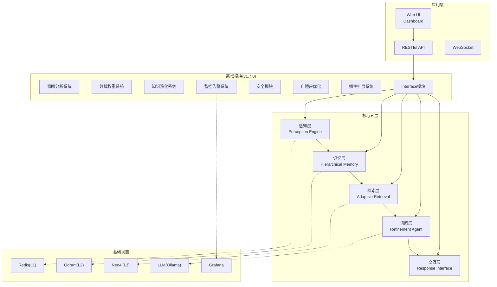
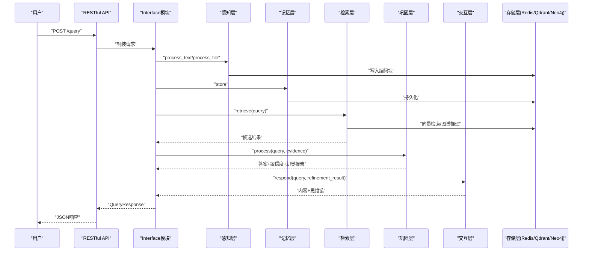
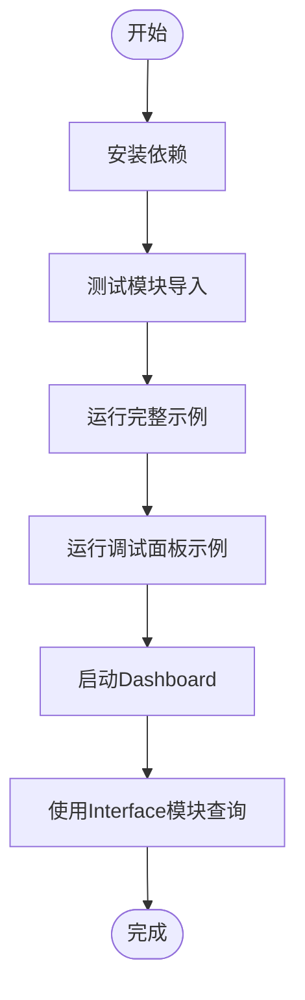
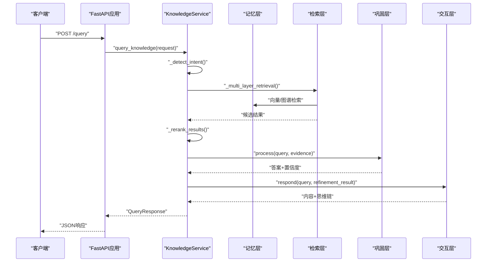

# 快速开始指南

<cite>
**本文引用的文件**
- [QUICKSTART.md](file://QUICKSTART.md)
- [README.md](file://README.md)
- [requirements.txt](file://requirements.txt)
- [pyproject.toml](file://pyproject.toml)
- [devops/scripts/start.sh](file://devops/scripts/start.sh)
- [devops/docker-compose.yml](file://devops/docker-compose.yml)
- [tools/start_dashboard.py](file://tools/start_dashboard.py)
- [example/example_usage.py](file://example/example_usage.py)
- [example/debug_panel_demo.py](file://example/debug_panel_demo.py)
- [interface/main.py](file://interface/main.py)
- [interface/api.py](file://interface/api.py)
- [interface/models.py](file://interface/models.py)
- [interface/knowledge_service.py](file://interface/knowledge_service.py)
</cite>

## 目录
1. [简介](#简介)
2. [项目结构](#项目结构)
3. [核心组件](#核心组件)
4. [架构总览](#架构总览)
5. [详细组件分析](#详细组件分析)
6. [依赖分析](#依赖分析)
7. [性能考虑](#性能考虑)
8. [故障排除指南](#故障排除指南)
9. [结论](#结论)
10. [附录](#附录)

## 简介
本指南面向希望在30分钟内运行第一个NecoRAG示例的新手用户，提供从环境准备、依赖安装、基础配置到核心功能完整流程的实操步骤，并包含Dashboard启动、Interface模块使用与API调用方法。同时给出常见问题与故障排除建议，帮助您快速上手并体验五层认知架构的完整工作流。

## 项目结构
NecoRAG采用“五层认知”架构，核心模块围绕感知层、记忆层、检索层、巩固层、交互层展开；同时提供Dashboard配置管理、可视化调试面板、RESTful API与WebSocket接口，以及容器化一键部署方案。

**图表来源**
- [README.md:44-94](file://README.md#L44-L94)
- [devops/docker-compose.yml:4-164](file://devops/docker-compose.yml#L4-L164)

**章节来源**
- [README.md:44-94](file://README.md#L44-L94)
- [devops/docker-compose.yml:4-164](file://devops/docker-compose.yml#L4-L164)

## 核心组件
- 感知层：文档解析与多维度向量化编码，支持RAGFlow深度解析与BGE-M3嵌入模型。
- 记忆层：三层记忆架构（L1工作记忆Redis、L2语义记忆Qdrant、L3情景图谱Neo4j），内置动态权重衰减与主动遗忘。
- 检索层：混合检索与重排序，支持HyDE增强、Novelty重排与早停机制（Early Termination）。
- 巩固层：异步知识固化、幻觉自检与记忆修剪，形成Generator→Critic→Refiner闭环。
- 交互层：情境自适应生成，支持语气、详细程度与思维链可视化输出。
- Dashboard：Web配置管理与实时监控，可视化调试面板（思维路径、性能指标、A/B测试）。
- Interface模块：RESTful API与WebSocket，统一封装知识服务，支持查询、插入、更新、删除与统计。

**章节来源**
- [README.md:25-94](file://README.md#L25-L94)
- [QUICKSTART.md:74-88](file://QUICKSTART.md#L74-L88)

## 架构总览
以下序列图展示了从感知到交互的完整工作流，以及新增模块对整体能力的增强。

**图表来源**
- [example/example_usage.py:12-252](file://example/example_usage.py#L12-L252)
- [interface/api.py:73-84](file://interface/api.py#L73-L84)
- [interface/knowledge_service.py:45-76](file://interface/knowledge_service.py#L45-L76)

## 详细组件分析

### 安装与环境准备
- 克隆仓库并进入目录
- 安装核心依赖：pip install -r requirements.txt
- 可选：安装v1.7.0新增模块依赖（意图分析、领域权重、监控告警、安全、可视化等）
- 可选：安装开发依赖（pytest、black、flake8、mypy）

提示：requirements.txt中已标注可选组件（如RAGFlow、Qdrant、Neo4j、Redis、BGE模型、LangChain/LangGraph、Prometheus、JWT、Plotly等），按需安装。

**章节来源**
- [README.md:167-179](file://README.md#L167-L179)
- [requirements.txt:1-160](file://requirements.txt#L1-L160)

### 基础使用示例（30分钟完整流程）
- 步骤1：安装依赖并测试模块导入
- 步骤2：运行完整示例（example/example_usage.py）
- 步骤3：运行调试面板示例（example/debug_panel_demo.py）
- 步骤4：启动Dashboard（tools/start_dashboard.py）
- 步骤5：使用Interface模块进行知识查询（RESTful API）

**图表来源**
- [QUICKSTART.md:5-45](file://QUICKSTART.md#L5-L45)
- [example/example_usage.py:218-252](file://example/example_usage.py#L218-L252)
- [example/debug_panel_demo.py:252-267](file://example/debug_panel_demo.py#L252-L267)
- [tools/start_dashboard.py:16-51](file://tools/start_dashboard.py#L16-L51)

**章节来源**
- [QUICKSTART.md:5-45](file://QUICKSTART.md#L5-L45)
- [example/example_usage.py:12-252](file://example/example_usage.py#L12-L252)
- [example/debug_panel_demo.py:16-186](file://example/debug_panel_demo.py#L16-L186)
- [tools/start_dashboard.py:16-51](file://tools/start_dashboard.py#L16-L51)

### Dashboard启动与基本配置
- 启动方式（任选其一）
  - Python脚本：python tools/start_dashboard.py
  - Windows批处理：start_dashboard.bat
  - Linux/Mac脚本：./start_dashboard.sh
  - Python模块：python -m src.dashboard.dashboard
- 访问地址
  - Web UI: http://localhost:8000
  - API文档：http://localhost:8000/docs
  - 调试面板：http://localhost:8000/debug
- 基本配置流程
  - 创建Profile → 选择Profile → 切换模块Tab（核心五层+新增模块）→ 修改参数→ 保存配置→ 激活Profile并重启应用

**章节来源**
- [README.md:216-235](file://README.md#L216-L235)
- [QUICKSTART.md:54-71](file://QUICKSTART.md#L54-L71)
- [QUICKSTART.md:127-147](file://QUICKSTART.md#L127-L147)

### Interface模块使用与API调用
- 启动方式
  - 同时启动RESTful API与WebSocket服务：python interface/main.py
- 核心API
  - GET /health 健康检查
  - POST /query 知识查询
  - POST /insert 批量插入
  - PUT /update 更新
  - DELETE /delete 删除
  - GET /stats 获取统计
  - GET /suggestions/{query} 查询建议
- WebSocket
  - 实时推送（如思维路径、会话状态等）

**图表来源**
- [interface/api.py:73-84](file://interface/api.py#L73-L84)
- [interface/knowledge_service.py:45-76](file://interface/knowledge_service.py#L45-L76)
- [interface/models.py:35-52](file://interface/models.py#L35-L52)

**章节来源**
- [interface/main.py:30-78](file://interface/main.py#L30-L78)
- [interface/api.py:19-152](file://interface/api.py#L19-L152)
- [interface/models.py:11-85](file://interface/models.py#L11-L85)
- [interface/knowledge_service.py:27-307](file://interface/knowledge_service.py#L27-L307)

### 核心功能演示（v1.7.0）
- 记忆衰减机制：动态权重计算与归档
- Pounce机制：置信度早停与检索路径可视化
- 思维链可视化：检索路径+证据来源+推理过程
- 领域权重系统：时间衰减×相关性×新颖性融合
- 意图分析系统：多级分类与路由优化

**章节来源**
- [QUICKSTART.md:213-294](file://QUICKSTART.md#L213-L294)

## 依赖分析
- 核心依赖：numpy、python-dateutil、aiohttp、requests、pydantic
- Dashboard与Web框架：fastapi、uvicorn、websockets
- 可选组件（按需安装）
  - 文档解析：ragflow、PyMuPDF、python-docx、beautifulsoup4
  - 向量数据库：qdrant-client、pymilvus
  - 图数据库：neo4j、nebula3-python
  - 缓存：redis
  - 嵌入模型：FlagEmbedding、sentence-transformers
  - LLM集成：langchain、langgraph、openai、anthropic
  - NLP工具：spacy、transformers
  - 意图分析：jieba、transformers、torch、spacy
  - 领域权重：scipy
  - 知识演化：apscheduler、celery
  - 监控告警：prometheus-client、grafana-api
  - 安全模块：PyJWT、python-jose、passlib
  - A/B测试与分析：scipy、statsmodels
  - 可视化：plotly、matplotlib
  - 自适应优化：scikit-learn、scikit-optimize
  - 插件系统：importlib-metadata
  - 测试与开发：pytest、pytest-asyncio、black、flake8、mypy

**章节来源**
- [requirements.txt:10-158](file://requirements.txt#L10-L158)
- [pyproject.toml:27-79](file://pyproject.toml#L27-L79)

## 性能考虑
- 检索性能：合理设置top_k与置信度阈值，利用早停机制减少无效检索。
- 记忆层优化：通过动态权重衰减与主动遗忘控制上下文规模。
- 重排序：结合novelty与领域权重提升结果多样性与相关性。
- 监控与告警：使用Prometheus+Grafana实时观测CPU/内存/网络等指标。
- 容器化部署：通过docker-compose一键启动Redis/Qdrant/Neo4j/Ollama/Grafana，便于横向扩展。

**章节来源**
- [README.md:597-609](file://README.md#L597-L609)
- [devops/docker-compose.yml:4-164](file://devops/docker-compose.yml#L4-L164)

## 故障排除指南
- 依赖安装失败
  - 确认Python版本满足要求（3.9+）
  - 使用requirements.txt安装核心依赖；按需安装可选组件
  - 开发依赖：pip install -r requirements.txt && pip install pytest pytest-cov black flake8 mypy
- Dashboard启动失败
  - 检查端口占用（Windows: netstat -ano | findstr :8000；Linux/Mac: lsof -i :8000）
  - 更换端口启动：python tools/start_dashboard.py --port 8080 --host 0.0.0.0
- Docker环境启动失败
  - 确认Docker已安装且服务运行正常
  - 使用脚本 ./scripts/start.sh [dev|minimal|full|--with-llm] 启动所需服务
  - 查看服务状态与日志：docker compose ps / docker compose logs -f [服务名]
- LLM模型未就绪
  - 在Ollama容器中拉取模型：docker exec -it necorag-ollama ollama pull qwen2:7b
- 自定义配置目录
  - 通过ConfigManager指定自定义配置目录与导入导出Profile

**章节来源**
- [QUICKSTART.md:297-348](file://QUICKSTART.md#L297-L348)
- [devops/scripts/start.sh:35-44](file://devops/scripts/start.sh#L35-L44)
- [devops/scripts/start.sh:70-78](file://devops/scripts/start.sh#L70-L78)
- [devops/docker-compose.yml:74-96](file://devops/docker-compose.yml#L74-L96)

## 结论
通过本指南，您可以在30分钟内完成NecoRAG的环境准备、依赖安装、基础配置与核心功能演示，体验从感知到交互的完整认知闭环，并掌握Dashboard与Interface模块的使用方法。建议后续深入阅读模块文档与Wiki知识库，逐步引入真实组件与容器化部署，完善生产环境配置与监控体系。

## 附录
- 进一步学习路径
  - 模块文档：Perception Engine、Hierarchical Memory、Adaptive Retrieval、Refinement Agent、Response Interface、Dashboard
  - v1.7.0新增模块：Intent Analyzer、Domain Weight、Knowledge Evolution、Monitoring & Alerts、Security、Adaptive Optimization、Plugins、Interface
- 示例与测试
  - 完整使用示例：example/example_usage.py
  - 调试面板示例：example/debug_panel_demo.py
  - 测试套件：tests/

**章节来源**
- [README.md:700-756](file://README.md#L700-L756)
- [QUICKSTART.md:352-388](file://QUICKSTART.md#L352-L388)