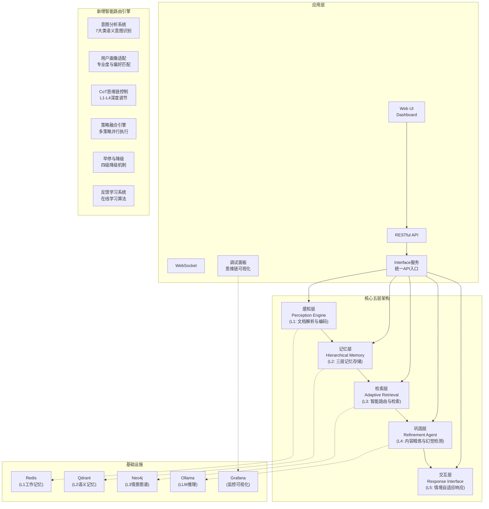
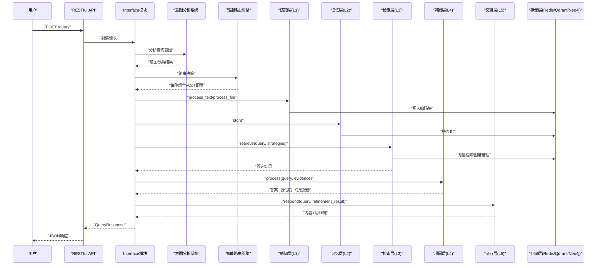
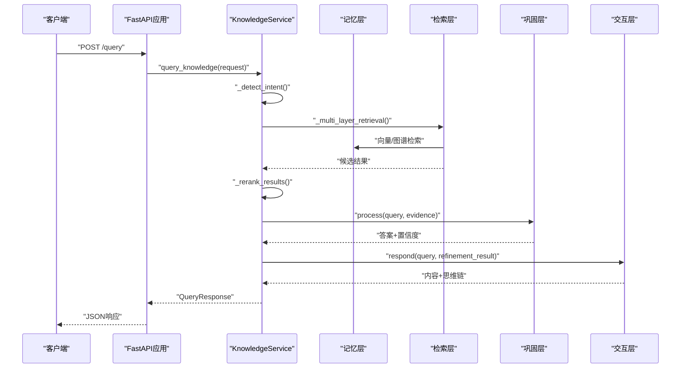

# 快速开始指南

<cite>
**本文引用的文件**
- [QUICKSTART.md](file://QUICKSTART.md)
- [README.md](file://README.md)
- [requirements.txt](file://requirements.txt)
- [src/__init__.py](file://src/__init__.py)
- [src/necorag.py](file://src/necorag.py)
- [src/retrieval/smart_routing/README.md](file://src/retrieval/smart_routing/README.md)
- [src/retrieval/smart_routing/engine.py](file://src/retrieval/smart_routing/engine.py)
- [src/retrieval/smart_routing/example_usage.py](file://src/retrieval/smart_routing/example_usage.py)
- [src/retrieval/smart_routing/strategy_fusion.py](file://src/retrieval/smart_routing/strategy_fusion.py)
- [devops/docker-compose.yml](file://devops/docker-compose.yml)
- [interface/main.py](file://interface/main.py)
- [src/dashboard/README.md](file://src/dashboard/README.md)
</cite>

## 更新摘要
**变更内容**
- 更新五层认知架构为最新的L1-L5层次命名约定
- 新增智能路由与策略融合引擎的详细说明和使用示例
- 更新模块导入方式和API调用方法
- 增加Interface模块的完整使用指南
- 更新Dashboard功能，包括知识库健康仪表盘和调试面板
- 修正模块命名约定和部署方式

## 目录
1. [简介](#简介)
2. [项目结构](#项目结构)
3. [核心组件](#核心组件)
4. [架构总览](#架构总览)
5. [详细组件分析](#详细组件分析)
6. [依赖分析](#依赖分析)
7. [性能考虑](#性能考虑)
8. [故障排除指南](#故障排除指南)
9. [结论](#结论)
10. [附录](#附录)

## 简介
本指南面向希望在30分钟内运行第一个NecoRAG示例的新手用户，提供从环境准备、依赖安装、基础配置到核心功能完整流程的实操步骤。NecoRAG v3.0引入了全新的五层认知架构和智能路由引擎，通过感知层、记忆层、检索层、巩固层、交互层的完整闭环，实现从文档处理到智能响应的全流程自动化。

## 项目结构
NecoRAG采用"五层认知"架构，核心模块围绕感知层(L1)、记忆层(L2)、检索层(L3)、巩固层(L4)、交互层(L5)展开；同时提供Dashboard配置管理、可视化调试面板、RESTful API与WebSocket接口，以及容器化一键部署方案。

**图表来源**
- [README.md:52-102](file://README.md#L52-L102)
- [src/retrieval/smart_routing/README.md:13-25](file://src/retrieval/smart_routing/README.md#L13-L25)

## 核心组件
- **感知层(L1)**：文档解析与多维度向量化编码，支持RAGFlow深度解析与BGE-M3嵌入模型
- **记忆层(L2)**：三层记忆架构（L1工作记忆Redis、L2语义记忆Qdrant、L3情景图谱Neo4j），内置动态权重衰减与主动遗忘
- **检索层(L3)**：智能路由与策略融合，支持7大类语义意图识别、CoT思维链控制、多策略并行执行与早停机制
- **巩固层(L4)**：异步知识固化、幻觉自检与记忆修剪，形成Generator→Critic→Refiner闭环
- **交互层(L5)**：情境自适应生成，支持语气、详细程度与思维链可视化输出
- **智能路由引擎**：三层决策架构（意图识别→用户画像→策略融合），实现个性化智能检索
- **Dashboard**：Web配置管理与实时监控，可视化调试面板（思维路径、性能指标、A/B测试）
- **Interface模块**：统一RESTful API与WebSocket服务，统一封装知识服务

**章节来源**
- [README.md:32-51](file://README.md#L32-L51)
- [src/retrieval/smart_routing/README.md:13-60](file://src/retrieval/smart_routing/README.md#L13-L60)

## 架构总览
以下序列图展示了从感知到交互的完整工作流，以及智能路由引擎对整体能力的增强。

**图表来源**
- [src/necorag.py:390-513](file://src/necorag.py#L390-L513)
- [src/retrieval/smart_routing/engine.py:68-129](file://src/retrieval/smart_routing/engine.py#L68-L129)

## 详细组件分析

### 安装与环境准备
- 克隆仓库并进入目录
- 安装核心依赖：`pip install -r requirements.txt`
- 可选：安装v3.0新增模块依赖（意图分析、领域权重、监控告警、安全、可视化等）
- 可选：安装开发依赖（pytest、black、flake8、mypy）

提示：requirements.txt中已标注可选组件（如RAGFlow、Qdrant、Neo4j、Redis、BGE模型、LangChain/LangGraph、Prometheus、JWT、Plotly等），按需安装。

**章节来源**
- [README.md:187-281](file://README.md#L187-L281)
- [requirements.txt:10-161](file://requirements.txt#L10-L161)

### 基础使用示例（30分钟完整流程）
- 步骤1：安装依赖并测试模块导入
- 步骤2：运行完整示例（含智能路由演示）
- 步骤3：运行调试面板示例（推荐）
- 步骤4：启动Dashboard（含知识库健康仪表盘）
- 步骤5：使用Interface模块进行知识查询

**图表来源**
- [QUICKSTART.md:15-58](file://QUICKSTART.md#L15-L58)
- [src/retrieval/smart_routing/example_usage.py:176-200](file://src/retrieval/smart_routing/example_usage.py#L176-L200)

**章节来源**
- [QUICKSTART.md:15-58](file://QUICKSTART.md#L15-L58)
- [src/retrieval/smart_routing/example_usage.py:18-58](file://src/retrieval/smart_routing/example_usage.py#L18-L58)

### Dashboard启动与基本配置
- 启动方式（任选其一）
  - Python脚本：`python start_dashboard.py`
  - Windows批处理：`start_dashboard.bat`
  - Linux/Mac脚本：`./start_dashboard.sh`
  - Python模块：`python -m src.dashboard.dashboard`
- 访问地址
  - Web UI: `http://localhost:8000`
  - API文档：`http://localhost:8000/docs`
  - 调试面板：`http://localhost:8000/debug`
  - 知识库健康仪表盘：`http://localhost:8000/knowledge-health`
- 基本配置流程
  - 创建Profile → 选择Profile → 切换模块Tab（核心五层+新增模块）→ 修改参数→ 保存配置→ 激活Profile并重启应用

**章节来源**
- [README.md:340-360](file://README.md#L340-L360)
- [src/dashboard/README.md:27-54](file://src/dashboard/README.md#L27-L54)

### Interface模块使用与API调用
- 启动方式
  - 同时启动RESTful API与WebSocket服务：`python interface/main.py`
- 核心API
  - GET `/health` 健康检查
  - POST `/query` 知识查询
  - POST `/insert` 批量插入
  - PUT `/update` 更新
  - DELETE `/delete` 删除
  - GET `/stats` 获取统计
  - GET `/suggestions/{query}` 查询建议
- WebSocket
  - 实时推送（如思维路径、会话状态等）

**图表来源**
- [interface/main.py:30-78](file://interface/main.py#L30-L78)

**章节来源**
- [interface/main.py:14-82](file://interface/main.py#L14-L82)

### 核心功能演示（v3.0）
- **智能路由引擎**：三层决策架构（意图识别→用户画像→策略融合）
- **7大类语义意图**：事实查询、比较分析、推理演绎、概念解释、摘要总结、操作指导、探索发散
- **个性化专业度适配**：专家（简洁专业）、中级（平衡解释）、新手（详细引导）
- **CoT思维链控制**：L1精简版（1-2步）到L4探索版（7+步）
- **多策略并行融合**：同时执行多种检索策略并智能融合结果
- **早停与降级机制**：根据延迟动态调整计算负载，优化响应速度
- **记忆衰减机制**：动态权重计算与归档
- **思维链可视化**：检索路径+证据来源+推理过程

**章节来源**
- [src/retrieval/smart_routing/README.md:13-60](file://src/retrieval/smart_routing/README.md#L13-L60)

## 依赖分析
- **核心依赖**：numpy、python-dateutil、aiohttp、requests、pydantic
- **Dashboard与Web框架**：fastapi、uvicorn、websockets
- **可选组件（按需安装）**
  - 文档解析：ragflow、PyMuPDF、python-docx、beautifulsoup4
  - 向量数据库：qdrant-client、pymilvus
  - 图数据库：neo4j、nebula3-python
  - 缓存：redis
  - 嵌入模型：FlagEmbedding、sentence-transformers
  - LLM集成：langchain、langgraph、openai、anthropic
  - NLP工具：spacy、transformers
  - 意图分析：jieba、transformers、torch、spacy
  - 领域权重：scipy
  - 知识演化：apscheduler、celery
  - 监控告警：prometheus-client、grafana-api
  - 安全模块：PyJWT、python-jose、passlib
  - A/B测试与分析：scipy、statsmodels
  - 可视化：plotly、matplotlib
  - 自适应优化：scikit-learn、scikit-optimize
  - 插件系统：importlib-metadata
  - 测试与开发：pytest、pytest-asyncio、black、flake8、mypy

**章节来源**
- [requirements.txt:10-161](file://requirements.txt#L10-L161)

## 性能考虑
- **检索性能**：合理设置top_k与置信度阈值，利用智能路由引擎的早停机制减少无效检索
- **记忆层优化**：通过动态权重衰减与主动遗忘控制上下文规模
- **策略融合**：结合多策略并行执行与结果融合提升检索质量
- **监控与告警**：使用Prometheus+Grafana实时观测CPU/内存/网络等指标
- **容器化部署**：通过docker-compose一键启动Redis/Qdrant/Neo4j/Ollama/Grafana，便于横向扩展

**章节来源**
- [README.md:721-735](file://README.md#L721-L735)
- [devops/docker-compose.yml:4-164](file://devops/docker-compose.yml#L4-L164)

## 故障排除指南
- **依赖安装失败**
  - 确认Python版本满足要求（3.9+）
  - 使用requirements.txt安装核心依赖；按需安装可选组件
  - 开发依赖：`pip install -r requirements.txt && pip install pytest pytest-cov black flake8 mypy`
- **Dashboard启动失败**
  - 检查端口占用（Windows: `netstat -ano | findstr :8000`；Linux/Mac: `lsof -i :8000`）
  - 更换端口启动：`python start_dashboard.py --port 8080 --host 0.0.0.0`
- **Docker环境启动失败**
  - 确认Docker已安装且服务运行正常
  - 使用脚本 `./scripts/start.sh [dev|minimal|full|--with-llm]` 启动所需服务
  - 查看服务状态与日志：`docker compose ps / docker compose logs -f [服务名]`
- **LLM模型未就绪**
  - 在Ollama容器中拉取模型：`docker exec -it necorag-ollama ollama pull qwen2:7b`
- **智能路由引擎异常**
  - 确认已正确初始化各子模块（IntentRouter、UserProfileAdapter、CoTController等）
  - 检查策略模板配置和权重分配

**章节来源**
- [QUICKSTART.md:380-431](file://QUICKSTART.md#L380-L431)
- [src/retrieval/smart_routing/README.md:297-327](file://src/retrieval/smart_routing/README.md#L297-L327)

## 结论
通过本指南，您可以在30分钟内完成NecoRAG v3.0的环境准备、依赖安装、基础配置与核心功能演示，体验从感知到交互的完整认知闭环，掌握智能路由引擎的工作原理，并熟悉Dashboard与Interface模块的使用方法。建议后续深入阅读模块文档与Wiki知识库，逐步引入真实组件与容器化部署，完善生产环境配置与监控体系。

## 附录
- **进一步学习路径**
  - 核心五层架构文档：Perception Engine、Hierarchical Memory、Adaptive Retrieval、Refinement Agent、Response Interface
  - v3.0新增模块：Intent Analyzer、Domain Weight、Knowledge Evolution、Monitoring & Alerts、Security、Adaptive Optimization、Plugins、Interface
  - 智能路由引擎：StrategyFusionEngine、IntentRouter、UserProfileAdapter、CoTController
- **示例与测试**
  - 完整使用示例：`example/example_usage.py`
  - 调试面板示例：`example/debug_panel_demo.py`
  - 智能路由专项示例：`src/retrieval/smart_routing/example_usage.py`
  - 测试套件：`tests/`

**章节来源**
- [README.md:435-478](file://README.md#L435-L478)
- [src/retrieval/smart_routing/README.md:370-410](file://src/retrieval/smart_routing/README.md#L370-L410)