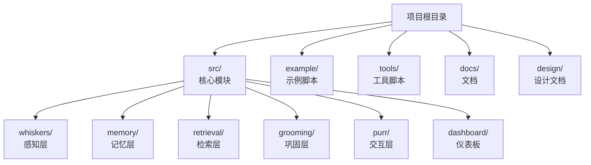
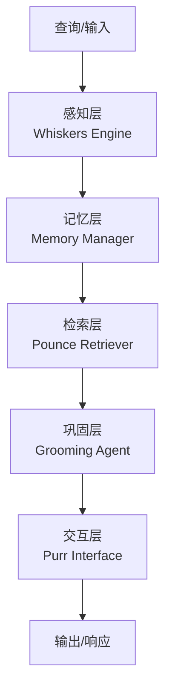
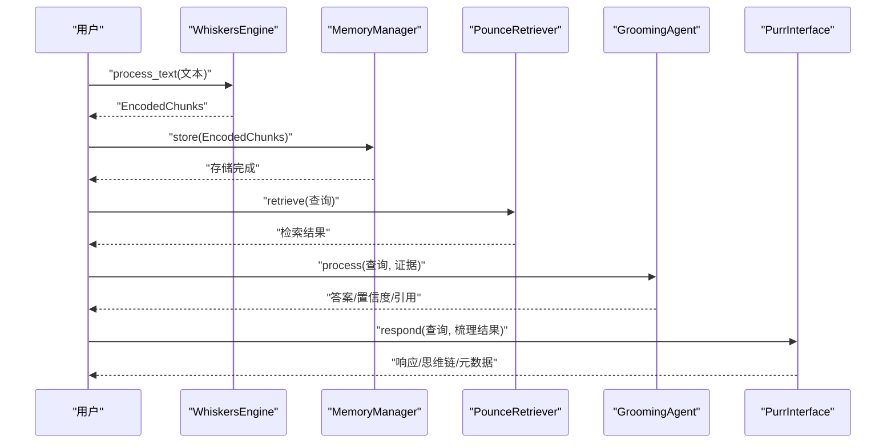
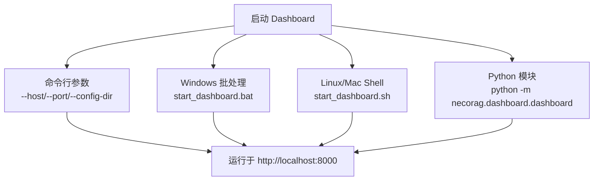
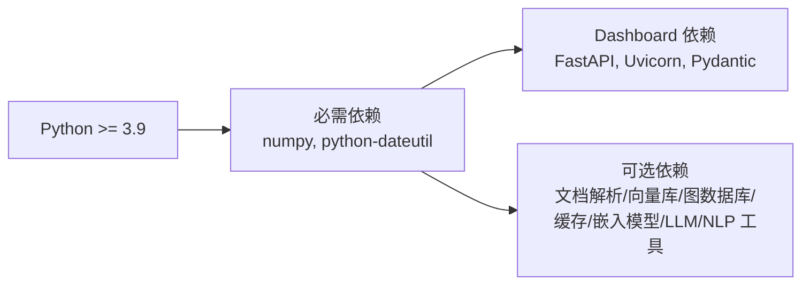

# 快速开始指南

<cite>
**本文引用的文件**
- [QUICKSTART.md](file://QUICKSTART.md)
- [requirements.txt](file://requirements.txt)
- [pyproject.toml](file://pyproject.toml)
- [example/example_usage.py](file://example/example_usage.py)
- [tools/start_dashboard.py](file://tools/start_dashboard.py)
- [tools/test_imports.py](file://tools/test_imports.py)
- [src/dashboard/README.md](file://src/dashboard/README.md)
- [DASHBOARD_GUIDE.md](file://DASHBOARD_GUIDE.md)
- [src/__init__.py](file://src/__init__.py)
- [src/whiskers/README.md](file://src/whiskers/README.md)
- [src/memory/README.md](file://src/memory/README.md)
- [src/retrieval/README.md](file://src/retrieval/README.md)
- [src/purr/README.md](file://src/purr/README.md)
</cite>

## 目录
1. [简介](#简介)
2. [项目结构](#项目结构)
3. [核心组件](#核心组件)
4. [架构总览](#架构总览)
5. [详细组件分析](#详细组件分析)
6. [依赖分析](#依赖分析)
7. [性能考虑](#性能考虑)
8. [故障排除指南](#故障排除指南)
9. [结论](#结论)
10. [附录](#附录)

## 简介
本指南面向首次接触 NecoRAG 的用户，帮助你在最短时间内完成环境搭建、运行示例与启动仪表板，并掌握从数据导入到结果获取的基本使用流程。文档覆盖 Python 版本要求、依赖安装、配置准备、示例运行、仪表板启动与常用 API、常见问题排查等，确保你能快速体验 NecoRAG 的核心功能。

## 项目结构
NecoRAG 采用模块化分层架构，核心分为五层：感知层（Whiskers）、记忆层（Memory）、检索层（Retrieval）、巩固层（Grooming）、交互层（Purr）。项目还提供了 Dashboard 用于配置管理与监控。

**图表来源**
- [QUICKSTART.md:1-325](file://QUICKSTART.md#L1-L325)
- [src/__init__.py:1-26](file://src/__init__.py#L1-L26)

**章节来源**
- [QUICKSTART.md:1-325](file://QUICKSTART.md#L1-L325)
- [src/__init__.py:1-26](file://src/__init__.py#L1-L26)

## 核心组件
- 感知层（Whiskers Engine）：负责文档解析、分块、向量化与情境标签生成。
- 记忆层（Memory Manager）：分层存储（工作记忆、语义记忆、情景图谱），并提供记忆巩固与遗忘。
- 检索层（Pounce Retriever）：多路并行检索、融合、重排序与“扑击”判断。
- 巩固层（Grooming Agent）：答案生成、置信度评估与幻觉检测。
- 交互层（Purr Interface）：情境自适应输出、语气与详细程度适配、思维链可视化。
- 仪表板（Dashboard）：Web 管理界面，支持 Profile 创建、参数配置、统计监控与 API 文档。

**章节来源**
- [QUICKSTART.md:69-83](file://QUICKSTART.md#L69-L83)
- [src/whiskers/README.md:1-158](file://src/whiskers/README.md#L1-L158)
- [src/memory/README.md:1-244](file://src/memory/README.md#L1-L244)
- [src/retrieval/README.md:1-352](file://src/retrieval/README.md#L1-L352)
- [src/purr/README.md:1-398](file://src/purr/README.md#L1-L398)
- [src/dashboard/README.md:1-417](file://src/dashboard/README.md#L1-L417)

## 架构总览
NecoRAG 采用“五层架构”，从感知到交互层层递进，形成闭环的工作流。

**图表来源**
- [QUICKSTART.md:71-83](file://QUICKSTART.md#L71-L83)

## 详细组件分析

### 环境与依赖准备
- Python 版本要求：>= 3.9（支持 3.9–3.12）
- 核心依赖：numpy、python-dateutil
- Dashboard 依赖：FastAPI、Uvicorn、Pydantic
- 可选依赖（按需集成）：文档解析（RAGFlow、PyMuPDF、python-docx、beautifulsoup4）、向量库（Qdrant、Milvus）、图数据库（Neo4j、NebulaGraph）、缓存（Redis）、嵌入模型（BGE、Sentence-Transformers）、LLM（LangChain、LangGraph、OpenAI、Anthropic）、NLP 工具（spaCy、transformers）

安装步骤
- 进入项目目录并安装依赖
- 运行模块导入测试，验证环境
- 运行完整示例，体验端到端流程

**章节来源**
- [pyproject.toml:10](file://pyproject.toml#L10)
- [requirements.txt:1-57](file://requirements.txt#L1-L57)
- [QUICKSTART.md:5-20](file://QUICKSTART.md#L5-L20)
- [tools/test_imports.py:1-64](file://tools/test_imports.py#L1-L64)

### 运行示例：从数据导入到结果获取
示例脚本展示了完整的 NecoRAG 工作流，涵盖五个模块的协同：

**图表来源**
- [example/example_usage.py:12-252](file://example/example_usage.py#L12-L252)

操作步骤
- 安装依赖并运行导入测试
- 运行示例脚本，观察各模块输出
- 通过最小工作示例理解关键流程

**章节来源**
- [QUICKSTART.md:36-50](file://QUICKSTART.md#L36-L50)
- [example/example_usage.py:12-252](file://example/example_usage.py#L12-L252)
- [QUICKSTART.md:85-109](file://QUICKSTART.md#L85-L109)

### 启动仪表板界面
Dashboard 提供图形化配置与监控，支持多平台启动方式与命令行参数。

**图表来源**
- [tools/start_dashboard.py:16-56](file://tools/start_dashboard.py#L16-L56)
- [DASHBOARD_GUIDE.md:26-56](file://DASHBOARD_GUIDE.md#L26-L56)

访问地址
- Web UI: http://localhost:8000
- API 文档: http://localhost:8000/docs

**章节来源**
- [QUICKSTART.md:50-66](file://QUICKSTART.md#L50-L66)
- [DASHBOARD_GUIDE.md:57-64](file://DASHBOARD_GUIDE.md#L57-L64)

### Dashboard 使用流程
- 创建配置 Profile（名称、描述）
- 选择 Profile，切换模块 Tab，修改参数并保存
- 激活 Profile 使其成为当前运行配置
- 查看统计面板（文档总数、块总数、查询总数、活动会话）

**章节来源**
- [QUICKSTART.md:113-141](file://QUICKSTART.md#L113-L141)
- [DASHBOARD_GUIDE.md:65-91](file://DASHBOARD_GUIDE.md#L65-L91)

### API 使用示例
- 获取所有 Profiles
- 创建 Profile
- 更新模块参数（如 retrieval）
- 激活/删除 Profile
- 获取统计信息与重置

**章节来源**
- [QUICKSTART.md:143-173](file://QUICKSTART.md#L143-L173)
- [src/dashboard/README.md:86-203](file://src/dashboard/README.md#L86-L203)

### 核心功能演示
- 记忆衰减机制：计算权重、应用衰减、归档低权重记忆
- Pounce 机制：检索时自动判断是否扑击，查看检索路径
- 思维链可视化：输出检索路径、证据来源与推理过程

**章节来源**
- [QUICKSTART.md:175-234](file://QUICKSTART.md#L175-L234)
- [src/memory/README.md:62-81](file://src/memory/README.md#L62-L81)
- [src/retrieval/README.md:103-142](file://src/retrieval/README.md#L103-L142)
- [src/purr/README.md:150-196](file://src/purr/README.md#L150-L196)

## 依赖分析
- Python 版本：>= 3.9
- 必需依赖：numpy、python-dateutil
- Dashboard：FastAPI、Uvicorn、Pydantic
- 可选依赖：按需启用文档解析、向量库、图数据库、缓存、嵌入模型、LLM、NLP 工具

**图表来源**
- [pyproject.toml:10](file://pyproject.toml#L10)
- [requirements.txt:1-57](file://requirements.txt#L1-L57)

**章节来源**
- [pyproject.toml:10](file://pyproject.toml#L10)
- [requirements.txt:1-57](file://requirements.txt#L1-L57)

## 性能考虑
- 分块大小：建议 512–1024 字符
- 检索数量：根据需求设置 top_k
- 扑击阈值：0.85–0.90 之间
- 记忆衰减：根据数据规模调整 decay_rate
- 启动参数：可通过命令行指定 host、port、config-dir

**章节来源**
- [DASHBOARD_GUIDE.md:281-287](file://DASHBOARD_GUIDE.md#L281-L287)
- [src/dashboard/README.md:264-283](file://src/dashboard/README.md#L264-L283)

## 故障排除指南
- 依赖安装失败：确认 pip 源与网络；必要时使用国内镜像
- Dashboard 启动失败：检查端口是否被占用，更换端口或释放占用进程
- 配置保存失败：检查配置目录写入权限，或更换目录
- API 调用 404：确认 Profile ID 存在，先获取列表再使用
- 导入测试失败：确保项目根目录在 Python 路径中，或使用正确的包导入方式

**章节来源**
- [QUICKSTART.md:237-277](file://QUICKSTART.md#L237-L277)
- [DASHBOARD_GUIDE.md:288-305](file://DASHBOARD_GUIDE.md#L288-L305)
- [tools/test_imports.py:1-64](file://tools/test_imports.py#L1-L64)

## 结论
通过本指南，你可以完成 NecoRAG 的环境搭建、运行示例与启动仪表板，并掌握从数据导入到结果获取的完整流程。建议结合 Dashboard 进行参数调优与监控，逐步深入理解各模块的功能与配置项，最终将 NecoRAG 集成到你的实际应用场景中。

## 附录

### 快速命令清单
- 安装依赖：pip install -r requirements.txt
- 模块导入测试：python tools/test_imports.py
- 运行示例：python example/example_usage.py
- 启动 Dashboard（Python 脚本）：python tools/start_dashboard.py
- 启动 Dashboard（Windows）：start_dashboard.bat
- 启动 Dashboard（Linux/Mac）：./start_dashboard.sh
- 访问地址：http://localhost:8000 与 http://localhost:8000/docs

**章节来源**
- [QUICKSTART.md:5-66](file://QUICKSTART.md#L5-L66)
- [DASHBOARD_GUIDE.md:26-56](file://DASHBOARD_GUIDE.md#L26-L56)