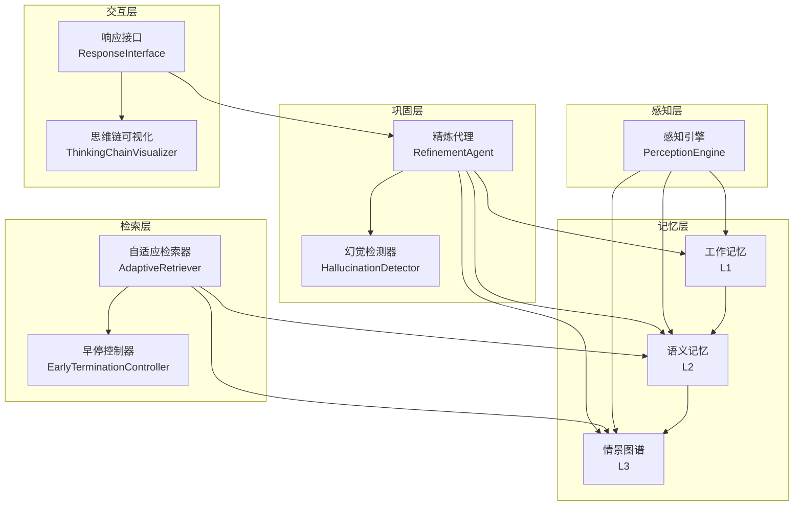
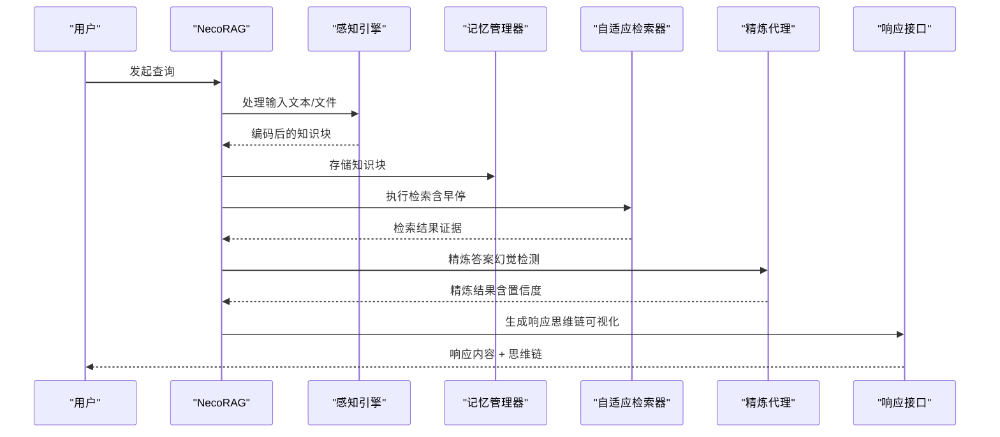
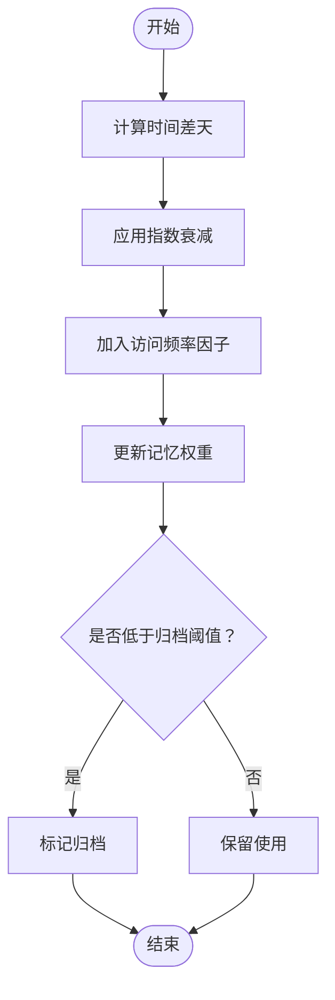
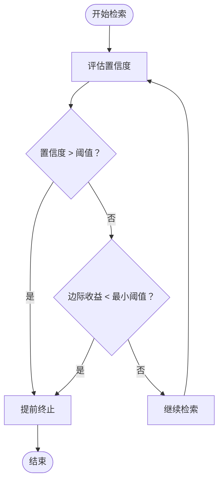
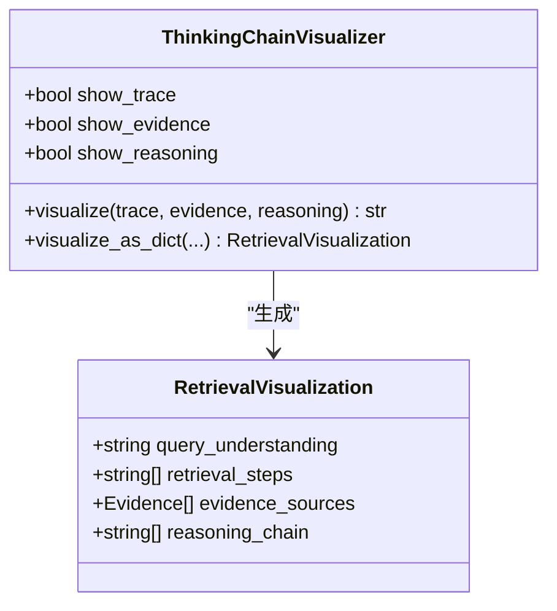
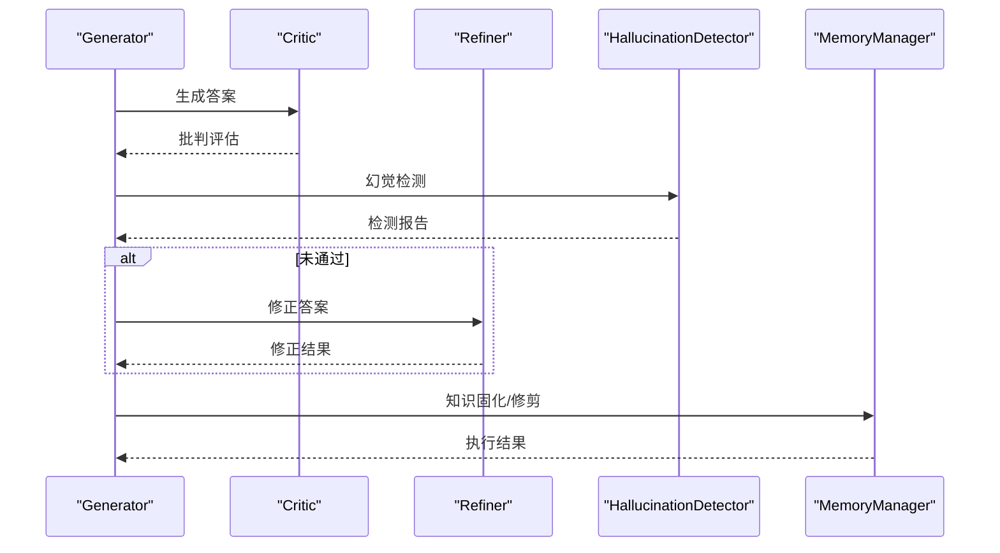
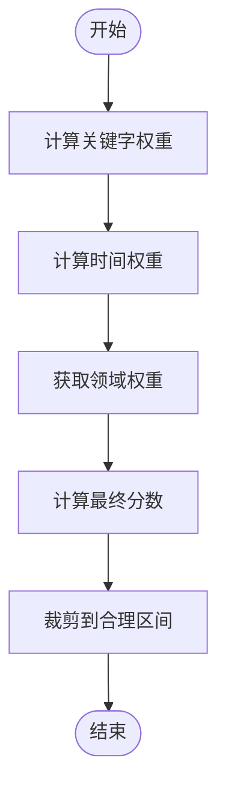

# 性能指标与创新特性

<cite>
**本文引用的文件**
- [README.md](file://README.md)
- [src/necorag.py](file://src/necorag.py)
- [src/memory/decay.py](file://src/memory/decay.py)
- [src/refinement/hallucination.py](file://src/refinement/hallucination.py)
- [src/response/visualizer.py](file://src/response/visualizer.py)
- [src/retrieval/retriever.py](file://src/retrieval/retriever.py)
- [src/refinement/agent.py](file://src/refinement/agent.py)
- [src/knowledge_evolution/metrics.py](file://src/knowledge_evolution/metrics.py)
- [src/core/config.py](file://src/core/config.py)
- [src/domain/weight_calculator.py](file://src/domain/weight_calculator.py)
- [src/dashboard/README.md](file://src/dashboard/README.md)
- [requirements.txt](file://requirements.txt)
- [example/example_usage.py](file://example/example_usage.py)
</cite>

## 目录
1. [简介](#简介)
2. [项目结构](#项目结构)
3. [核心组件](#核心组件)
4. [架构总览](#架构总览)
5. [详细组件分析](#详细组件分析)
6. [依赖分析](#依赖分析)
7. [性能考量](#性能考量)
8. [故障排查指南](#故障排查指南)
9. [结论](#结论)
10. [附录](#附录)

## 简介
本文件聚焦于 NecoRAG 的性能指标与四大核心创新特性，系统阐述检索准确率提升、幻觉率控制、查询延迟优化与上下文压缩效果的实现策略，并深入解析记忆权重衰减机制、早停机制、思维链可视化与幻觉自检闭环的工作原理与工程实现。同时提供与传统 RAG 的对比分析与实践建议，帮助读者在准确性、效率与可解释性之间取得平衡。

## 项目结构
NecoRAG 采用“五层认知”架构，从感知到交互形成完整闭环：
- Layer 1：感知引擎（Perception Engine）负责多模态编码与情境标记
- Layer 2：层级记忆（Hierarchical Memory）三层存储（工作记忆/语义记忆/情景图谱）
- Layer 3：自适应检索（Adaptive Retrieval）混合检索与重排序、早停机制
- Layer 4：精炼代理（Refinement Agent）幻觉自检与知识固化
- Layer 5：响应接口（Response Interface）情境自适应生成与思维链可视化

图表来源
- [src/necorag.py](file://src/necorag.py)
- [src/retrieval/retriever.py](file://src/retrieval/retriever.py)
- [src/refinement/agent.py](file://src/refinement/agent.py)
- [src/response/visualizer.py](file://src/response/visualizer.py)

章节来源
- [README.md](file://README.md)
- [src/necorag.py](file://src/necorag.py)

## 核心组件
- 记忆权重衰减机制：通过指数衰减与访问频率因子动态调整记忆权重，实现“重要强化、低频降权、自动归档”的闭环。
- 早停机制：基于置信度阈值与边际收益递减策略，避免冗余检索，显著降低延迟。
- 思维链可视化：将检索路径、证据来源与推理过程结构化展示，提升可解释性。
- 幻觉自检闭环：Generator-Critic-Refiner 三阶段验证，结合幻觉检测器，持续降低幻觉率。

章节来源
- [README.md](file://README.md)
- [src/memory/decay.py](file://src/memory/decay.py)
- [src/retrieval/retriever.py](file://src/retrieval/retriever.py)
- [src/refinement/hallucination.py](file://src/refinement/hallucination.py)
- [src/response/visualizer.py](file://src/response/visualizer.py)

## 架构总览
NecoRAG 的统一入口类负责模块编排与生命周期管理，贯穿文档导入、检索、精炼与响应生成的完整流程。

图表来源
- [src/necorag.py](file://src/necorag.py)
- [src/retrieval/retriever.py](file://src/retrieval/retriever.py)
- [src/refinement/agent.py](file://src/refinement/agent.py)
- [src/response/visualizer.py](file://src/response/visualizer.py)

章节来源
- [src/necorag.py](file://src/necorag.py)

## 详细组件分析

### 记忆权重衰减机制
- 数学原理：权重随时间呈指数衰减，同时叠加访问频率因子，实现“重要强化、低频降权”。归档阈值用于自动清理低价值记忆。
- 实现要点：
  - 计算时间差（天）并应用衰减因子
  - 访问频率以对数形式增强权重
  - 支持强化记忆权重与归档判定
- 性能影响：降低无效检索开销，提升检索质量与上下文压缩率。

图表来源
- [src/memory/decay.py](file://src/memory/decay.py)

章节来源
- [src/memory/decay.py](file://src/memory/decay.py)
- [README.md](file://README.md)

### 早停机制（Early Termination）
- 策略目标：在置信度达到阈值或边际收益下降时提前终止，避免冗余计算。
- 实现要点：
  - 基于 top-1 与 top-2 分数差距评估置信度
  - 边际收益递减阈值防止过度迭代
  - 自适应阈值随查询长度变化
- 性能影响：显著降低复杂查询延迟，提升吞吐。

图表来源
- [src/retrieval/retriever.py](file://src/retrieval/retriever.py)

章节来源
- [src/retrieval/retriever.py](file://src/retrieval/retriever.py)
- [README.md](file://README.md)

### 思维链可视化
- 展示内容：检索路径、证据来源与推理过程，便于用户理解与审计。
- 实现要点：
  - 可选择性显示检索路径、证据与推理链条
  - 生成结构化可视化对象，便于前端渲染
- 性能影响：轻量文本拼接，几乎不影响检索与生成性能。

图表来源
- [src/response/visualizer.py](file://src/response/visualizer.py)

章节来源
- [src/response/visualizer.py](file://src/response/visualizer.py)
- [README.md](file://README.md)

### 幻觉自检闭环
- 三阶段验证：Generator 生成答案 → Critic 批判评估 → Refiner 修正答案；同时使用 HallucinationDetector 检测事实一致性、逻辑连贯性与证据支撑度。
- 实现要点：
  - 多轮迭代直至通过验证或达到最大次数
  - 幻觉检测触发置信度下调
  - 异步知识固化与记忆修剪
- 性能影响：适度增加生成成本，显著降低幻觉率。

图表来源
- [src/refinement/agent.py](file://src/refinement/agent.py)
- [src/refinement/hallucination.py](file://src/refinement/hallucination.py)

章节来源
- [src/refinement/agent.py](file://src/refinement/agent.py)
- [src/refinement/hallucination.py](file://src/refinement/hallucination.py)
- [README.md](file://README.md)

### 领域权重计算与上下文压缩
- 综合权重公式：最终分数 = 基础相似度 × α×关键字权重 × β×时间权重 × γ×领域权重 × 自定义权重
- 实现要点：
  - 关键字权重：基于查询相关性评分，限制在合理区间
  - 时间权重：基于文档更新时间与常青知识开关
  - 领域权重：由领域相关性计算得到
- 性能影响：通过权重裁剪与早停，有效压缩上下文，提升检索质量。

图表来源
- [src/domain/weight_calculator.py](file://src/domain/weight_calculator.py)

章节来源
- [src/domain/weight_calculator.py](file://src/domain/weight_calculator.py)
- [README.md](file://README.md)

## 依赖分析
- 核心依赖：numpy、python-dateutil（基础）
- Dashboard：FastAPI、Uvicorn、Pydantic（Web 管理界面）
- 可选依赖：RAGFlow（文档解析）、Qdrant/Milvus（向量数据库）、Neo4j/NebulaGraph（图数据库）、Redis（缓存）、BGE-M3/BGE-Reranker（嵌入与重排序）、LangChain/LangGraph（编排）、OpenAI/Claude（LLM）

章节来源
- [requirements.txt](file://requirements.txt)
- [README.md](file://README.md)

## 性能考量
- 检索准确率提升（+20% 相比传统 Vector RAG）
  - 通过领域权重计算与重排序，提高相关性排序质量
  - 早停机制减少噪声检索，提升有效命中率
- 幻觉率控制（<5%）
  - 幻觉自检闭环与多轮验证
  - 幻觉检测器对事实一致性、逻辑连贯性与证据支撑度进行评估
- 查询延迟优化
  - 简单查询：<800ms（首字延迟）
  - 复杂查询（多跳+重排）：<1500ms
  - 早停机制与权重裁剪显著降低无效计算
- 上下文压缩效果（-40%）
  - 记忆权重衰减与归档阈值自动清理低价值记忆
  - 领域权重裁剪与证据筛选

章节来源
- [README.md](file://README.md)
- [src/retrieval/retriever.py](file://src/retrieval/retriever.py)
- [src/memory/decay.py](file://src/memory/decay.py)
- [src/knowledge_evolution/metrics.py](file://src/knowledge_evolution/metrics.py)

## 故障排查指南
- Dashboard 启动失败
  - 端口被占用：更换端口或关闭占用进程
  - 配置目录无写权限：检查目录权限或更换配置目录
- 配置保存失败
  - 确认配置文件路径存在且具备写权限
- API 调用返回 404
  - 确认 Profile ID 正确，先获取列表确认存在性
- 性能异常
  - 检查早停阈值与 top_k 设置是否合理
  - 关注领域权重因子与时间权重配置是否过严

章节来源
- [src/dashboard/README.md](file://src/dashboard/README.md)

## 结论
NecoRAG 通过“记忆权重衰减 + 早停机制 + 思维链可视化 + 幻觉自检闭环”的组合拳，在准确性、效率与可解释性方面实现协同优化。其五层架构与模块化设计为大规模部署提供了清晰的扩展路径，配合 Dashboard 的可视化配置与监控能力，能够满足从开发到生产的全生命周期需求。

## 附录
- 配置管理与可视化
  - Dashboard 支持 Profile 管理、模块参数配置与实时统计监控
  - 提供 RESTful API 与 Web UI，便于运维与调参
- 示例与基准
  - example_usage.py 展示了从感知、记忆、检索、精炼到响应的完整流程
  - 可基于该示例进行性能压测与对比实验

章节来源
- [src/dashboard/README.md](file://src/dashboard/README.md)
- [example/example_usage.py](file://example/example_usage.py)