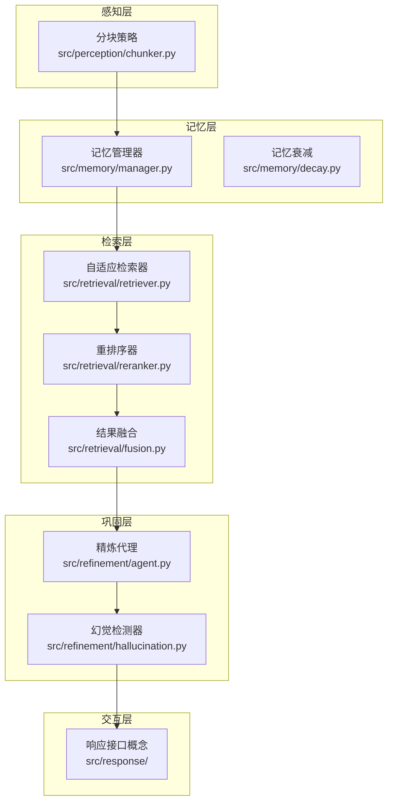
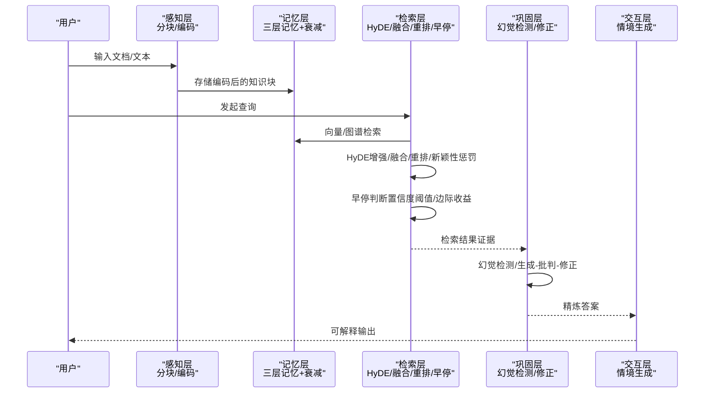
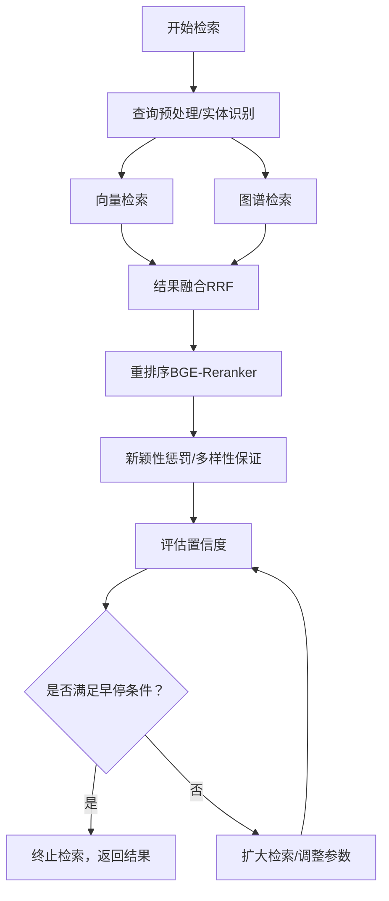
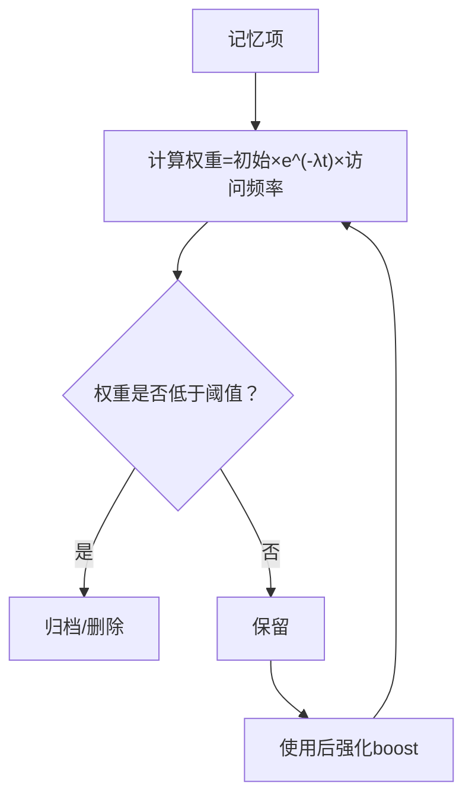
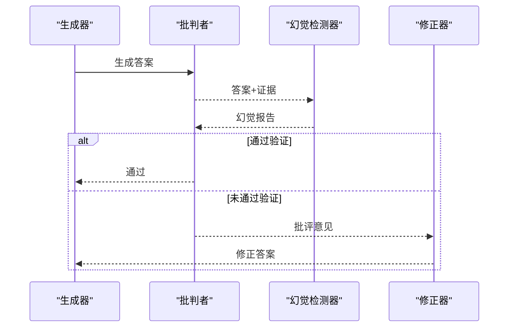

# 性能指标与基准

<cite>
**本文引用的文件**
- [README.md](file://README.md)
- [src/retrieval/retriever.py](file://src/retrieval/retriever.py)
- [src/retrieval/reranker.py](file://src/retrieval/reranker.py)
- [src/retrieval/fusion.py](file://src/retrieval/fusion.py)
- [src/refinement/hallucination.py](file://src/refinement/hallucination.py)
- [src/refinement/agent.py](file://src/refinement/agent.py)
- [src/memory/manager.py](file://src/memory/manager.py)
- [src/memory/decay.py](file://src/memory/decay.py)
- [src/domain/weight_calculator.py](file://src/domain/weight_calculator.py)
- [src/perception/chunker.py](file://src/perception/chunker.py)
- [src/dashboard/models.py](file://src/dashboard/models.py)
- [src/retrieval/README.md](file://src/retrieval/README.md)
- [src/memory/README.md](file://src/memory/README.md)
- [src/refinement/README.md](file://src/refinement/README.md)
- [src/dashboard/README.md](file://src/dashboard/README.md)
- [requirements.txt](file://requirements.txt)
</cite>

## 目录
1. [简介](#简介)
2. [项目结构](#项目结构)
3. [核心组件](#核心组件)
4. [架构总览](#架构总览)
5. [详细组件分析](#详细组件分析)
6. [依赖分析](#依赖分析)
7. [性能考量](#性能考量)
8. [故障排查指南](#故障排查指南)
9. [结论](#结论)
10. [附录](#附录)

## 简介
本文件面向 NecoRAG 的性能指标与基准，系统化阐述检索准确率提升、幻觉率控制、查询延迟优化与上下文压缩等关键指标的目标与现状，并提供与传统向量 RAG 方案的对比思路与调优建议。文档同时给出测量方法、评估标准与实际应用场景下的表现分析，帮助用户建立合理的性能预期并指导参数调优。

## 项目结构
NecoRAG 采用“五层认知”架构，围绕感知、记忆、检索、巩固与交互五大层组织模块。与性能相关的关键模块包括：
- 感知层：文本分块与编码，影响后续检索与记忆质量
- 记忆层：三层记忆（工作记忆/语义记忆/情景图谱），支持动态权重衰减与主动遗忘
- 检索层：混合检索、HyDE 增强、新颖性重排序与早停机制
- 巩固层：幻觉自检闭环、知识固化与记忆修剪
- 交互层：情境自适应生成与可解释性输出

图表来源
- [src/perception/chunker.py:10-98](file://src/perception/chunker.py#L10-L98)
- [src/memory/manager.py:16-186](file://src/memory/manager.py#L16-L186)
- [src/memory/decay.py:11-155](file://src/memory/decay.py#L11-L155)
- [src/retrieval/retriever.py:122-440](file://src/retrieval/retriever.py#L122-L440)
- [src/retrieval/reranker.py:10-179](file://src/retrieval/reranker.py#L10-L179)
- [src/retrieval/fusion.py:9-128](file://src/retrieval/fusion.py#L9-L128)
- [src/refinement/hallucination.py:9-154](file://src/refinement/hallucination.py#L9-L154)
- [src/refinement/agent.py:16-151](file://src/refinement/agent.py#L16-L151)

章节来源
- [README.md:35-85](file://README.md#L35-L85)
- [src/retrieval/README.md:1-352](file://src/retrieval/README.md#L1-L352)
- [src/memory/README.md:1-244](file://src/memory/README.md#L1-L244)
- [src/refinement/README.md:1-428](file://src/refinement/README.md#L1-L428)
- [src/dashboard/README.md:1-417](file://src/dashboard/README.md#L1-L417)

## 核心组件
本节聚焦与性能直接相关的组件与指标，结合代码实现与文档说明，给出可落地的评估与调优要点。

- 检索层（自适应检索器）
  - 早停机制：根据置信度阈值与边际收益快速终止检索，显著降低无效计算
  - HyDE 增强：对模糊查询生成假设文档向量，提升检索命中
  - 新颖性重排序：抑制重复、鼓励新信息与多样性
  - 结果融合：RRF 等策略提升跨源检索稳定性
  - 领域权重：基于关键字、时间与领域相关性的综合加权

- 记忆层（动态权重衰减）
  - 权重衰减公式：随时间与访问频率衰减，低频知识自动降权与归档
  - 主动遗忘：按阈值移除低价值记忆，压缩上下文规模

- 巩固层（幻觉自检闭环）
  - 事实一致性、证据支撑度与逻辑连贯性检测
  - 生成-批判-修正闭环，降低幻觉率

- 感知层（分块策略）
  - 多种分块模式（语义/固定大小/结构），影响检索粒度与召回

章节来源
- [src/retrieval/retriever.py:30-120](file://src/retrieval/retriever.py#L30-L120)
- [src/retrieval/retriever.py:177-254](file://src/retrieval/retriever.py#L177-L254)
- [src/retrieval/reranker.py:41-70](file://src/retrieval/reranker.py#L41-L70)
- [src/retrieval/fusion.py:18-70](file://src/retrieval/fusion.py#L18-L70)
- [src/domain/weight_calculator.py:81-146](file://src/domain/weight_calculator.py#L81-L146)
- [src/memory/decay.py:39-118](file://src/memory/decay.py#L39-L118)
- [src/refinement/hallucination.py:34-75](file://src/refinement/hallucination.py#L34-L75)
- [src/perception/chunker.py:28-82](file://src/perception/chunker.py#L28-L82)

## 架构总览
下图展示 NecoRAG 从感知到交互的性能相关关键路径，以及与传统向量 RAG 的差异点（HyDE、新颖性重排序、早停、领域权重、动态衰减与修剪）。

图表来源
- [src/perception/chunker.py:28-82](file://src/perception/chunker.py#L28-L82)
- [src/memory/manager.py:48-147](file://src/memory/manager.py#L48-L147)
- [src/retrieval/retriever.py:177-254](file://src/retrieval/retriever.py#L177-L254)
- [src/retrieval/reranker.py:41-70](file://src/retrieval/reranker.py#L41-L70)
- [src/refinement/agent.py:61-128](file://src/refinement/agent.py#L61-L128)

章节来源
- [README.md:465-474](file://README.md#L465-L474)
- [src/retrieval/README.md:259-287](file://src/retrieval/README.md#L259-L287)

## 详细组件分析

### 检索层：HyDE 增强、新颖性重排序与早停机制
- HyDE 增强：对模糊查询生成假设文档向量，提升检索命中，尤其适用于术语不匹配与表达不清的查询
- 新颖性重排序：通过与已选结果的重复度惩罚与多样性保留，避免重复与信息茧房
- 早停机制：基于置信度阈值与边际收益递减，一旦达到满意水平立即终止，显著降低延迟

图表来源
- [src/retrieval/retriever.py:177-254](file://src/retrieval/retriever.py#L177-L254)
- [src/retrieval/reranker.py:72-153](file://src/retrieval/reranker.py#L72-L153)
- [src/retrieval/fusion.py:18-70](file://src/retrieval/fusion.py#L18-L70)

章节来源
- [src/retrieval/retriever.py:30-120](file://src/retrieval/retriever.py#L30-L120)
- [src/retrieval/retriever.py:177-254](file://src/retrieval/retriever.py#L177-L254)
- [src/retrieval/reranker.py:10-179](file://src/retrieval/reranker.py#L10-L179)
- [src/retrieval/fusion.py:9-128](file://src/retrieval/fusion.py#L9-L128)
- [src/retrieval/README.md:60-141](file://src/retrieval/README.md#L60-L141)

### 记忆层：动态权重衰减与主动遗忘
- 动态权重衰减：随时间与访问频率衰减，低频知识自动降权；热点知识保持活跃
- 主动遗忘：按阈值移除低价值记忆，减少上下文规模，提升检索与生成效率

图表来源
- [src/memory/decay.py:39-118](file://src/memory/decay.py#L39-L118)
- [src/memory/manager.py:149-186](file://src/memory/manager.py#L149-L186)

章节来源
- [src/memory/decay.py:11-155](file://src/memory/decay.py#L11-L155)
- [src/memory/manager.py:16-186](file://src/memory/manager.py#L16-L186)
- [src/memory/README.md:62-81](file://src/memory/README.md#L62-L81)

### 巩固层：幻觉自检闭环
- 幻觉检测：事实一致性、证据支撑度与逻辑连贯性三维度评估
- 生成-批判-修正闭环：通过多轮迭代与阈值控制，降低最终输出幻觉率

图表来源
- [src/refinement/agent.py:61-128](file://src/refinement/agent.py#L61-L128)
- [src/refinement/hallucination.py:34-75](file://src/refinement/hallucination.py#L34-L75)

章节来源
- [src/refinement/hallucination.py:9-154](file://src/refinement/hallucination.py#L9-L154)
- [src/refinement/agent.py:16-151](file://src/refinement/agent.py#L16-L151)
- [src/refinement/README.md:74-109](file://src/refinement/README.md#L74-L109)

### 感知层：分块策略
- 语义分块、固定大小分块与结构化分块，影响检索粒度与召回
- 合理设置分块大小与重叠，有助于提升检索稳定性与上下文完整性

章节来源
- [src/perception/chunker.py:10-98](file://src/perception/chunker.py#L10-L98)

## 依赖分析
- 检索层依赖向量与图数据库（如 Qdrant、Neo4j）以及重排序模型（BGE-Reranker）
- 记忆层依赖 Redis（工作记忆）、Qdrant/Milvus（语义记忆）、Neo4j/NebulaGraph（图谱）
- 巩固层依赖 LLM 与 LangGraph 实现闭环编排
- Dashboard 依赖 FastAPI/uvicorn/pydantic，提供配置与监控

章节来源
- [requirements.txt:1-66](file://requirements.txt#L1-L66)
- [README.md:500-509](file://README.md#L500-L509)
- [src/retrieval/README.md:338-343](file://src/retrieval/README.md#L338-L343)
- [src/memory/README.md:231-235](file://src/memory/README.md#L231-L235)
- [src/refinement/README.md:415-419](file://src/refinement/README.md#L415-L419)
- [src/dashboard/README.md:1-417](file://src/dashboard/README.md#L1-L417)

## 性能考量

### 性能目标与现状
- 检索准确率（Recall@K）：目标相较传统向量 RAG 提升 +20%
- 幻觉率：< 5%（通过幻觉检测与修正闭环）
- 简单查询延迟：< 800ms（首字延迟）
- 复杂查询延迟：< 1500ms（多跳+重排）
- 上下文压缩率：-40%（通过记忆衰减与主动遗忘）

章节来源
- [README.md:465-474](file://README.md#L465-L474)
- [README.md:645-653](file://README.md#L645-L653)

### 指标测量方法与评估标准
- 检索准确率（Recall@K）
  - 方法：在标准问答数据集上，比较 NecoRAG 与传统向量 RAG 的前 K 结果中命中比例
  - 影响因素：HyDE 增强、新颖性重排序、领域权重、早停阈值
- 幻觉率
  - 方法：人工抽样评估，统计最终输出中存在事实性/逻辑性/来源性幻觉的比例
  - 影响因素：幻觉检测阈值、生成-批判-修正迭代次数
- 查询延迟
  - 方法：分别测量简单查询（纯向量检索）与复杂查询（多跳+重排）的首字延迟
  - 影响因素：早停阈值、top_k、重排序模型、融合策略
- 上下文压缩率
  - 方法：统计归档/删除的记忆条目占比与检索上下文大小变化
  - 影响因素：衰减率、归档阈值、主动遗忘阈值

章节来源
- [src/retrieval/retriever.py:30-120](file://src/retrieval/retriever.py#L30-L120)
- [src/retrieval/reranker.py:10-179](file://src/retrieval/reranker.py#L10-L179)
- [src/refinement/hallucination.py:34-75](file://src/refinement/hallucination.py#L34-L75)
- [src/memory/decay.py:96-118](file://src/memory/decay.py#L96-L118)

### 与传统向量 RAG 的对比思路
- 传统向量 RAG 通常仅依赖向量检索与简单重排，缺乏 HyDE、新颖性重排、早停与领域权重
- NecoRAG 在相同数据集上，通过 HyDE 与领域权重提升召回，通过新颖性重排与早停优化排序与延迟，通过动态衰减与修剪压缩上下文

章节来源
- [src/retrieval/README.md:60-101](file://src/retrieval/README.md#L60-L101)
- [src/retrieval/README.md:103-141](file://src/retrieval/README.md#L103-L141)
- [src/memory/README.md:62-81](file://src/memory/README.md#L62-L81)

### 影响性能的关键因素与优化策略
- 检索层
  - 早停阈值与最小边际收益：提高阈值可降低延迟但可能牺牲召回；需在 A/B 测试中平衡
  - top_k 与 min_score：增大 top_k 提升召回但增加重排与传输成本
  - novelty/diversity/redundancy 权重：需结合业务场景调参
- 记忆层
  - 衰减率与归档阈值：过低阈值导致过度修剪，过高则无法压缩上下文
  - 主动遗忘：建议定期评估遗忘比例与检索命中变化
- 巩固层
  - 幻觉检测阈值与迭代次数：过严导致拒绝回答，过宽可能漏检
  - 证据支撑度与事实一致性权重：可结合业务语料微调
- 感知层
  - 分块大小与重叠：过小导致碎片化，过大影响检索粒度；建议基于文档类型与查询复杂度调优

章节来源
- [src/retrieval/retriever.py:30-120](file://src/retrieval/retriever.py#L30-L120)
- [src/retrieval/reranker.py:20-39](file://src/retrieval/reranker.py#L20-L39)
- [src/memory/decay.py:24-37](file://src/memory/decay.py#L24-L37)
- [src/refinement/hallucination.py:19-32](file://src/refinement/hallucination.py#L19-L32)
- [src/perception/chunker.py:17-26](file://src/perception/chunker.py#L17-L26)

## 故障排查指南
- Dashboard 启动失败
  - 端口被占用：更换端口或释放占用进程
  - 配置目录无写权限：检查目录权限或更换配置目录
- 配置保存失败
  - 确认配置文件格式正确且参数范围合理
- API 调用返回 404
  - 确认 Profile ID 存在，先获取列表再使用具体 ID
- 检索延迟偏高
  - 检查早停阈值是否过低、top_k 是否过大、重排序模型是否可用
- 幻觉率偏高
  - 降低迭代次数或提高幻觉检测阈值，加强证据支撑度要求

章节来源
- [src/dashboard/README.md:381-412](file://src/dashboard/README.md#L381-L412)

## 结论
NecoRAG 通过 HyDE 增强、新颖性重排序、早停机制、领域权重与动态衰减/修剪等技术创新，在检索准确率、幻觉率控制、查询延迟与上下文压缩等方面具备系统性优化潜力。建议在实际部署中结合业务场景进行参数调优与 A/B 对比，持续监控关键指标并迭代优化。

## 附录

### 性能指标与目标对照表
- 检索准确率（Recall@K）：目标相较传统向量 RAG 提升 +20%
- 幻觉率：< 5%
- 简单查询延迟：< 800ms（首字延迟）
- 复杂查询延迟：< 1500ms（多跳+重排）
- 上下文压缩率：-40%

章节来源
- [README.md:465-474](file://README.md#L465-L474)
- [README.md:645-653](file://README.md#L645-L653)

### 关键参数参考（摘自配置模型）
- 检索层：top_k、min_score、max_hops、hyde_enabled、reranker_model、novelty_weight、diversity_weight、redundancy_penalty、confidence_threshold、min_gain
- 记忆层：l1_ttl、l2_vector_size、l3_max_relation_depth、decay_rate、archive_threshold
- 巩固层：min_confidence、max_iterations、hallucination_threshold、consolidation_interval、min_query_frequency、gap_fill_strategy、noise_threshold、quality_threshold、outdated_days
- 交互层：default_tone、default_detail_level、profile_ttl、max_history、style_detection、auto_detect、personality_injection、show_trace、show_evidence、show_reasoning

章节来源
- [src/dashboard/models.py:95-160](file://src/dashboard/models.py#L95-L160)
- [src/dashboard/models.py:164-210](file://src/dashboard/models.py#L164-L210)
- [src/dashboard/models.py:221-231](file://src/dashboard/models.py#L221-L231)