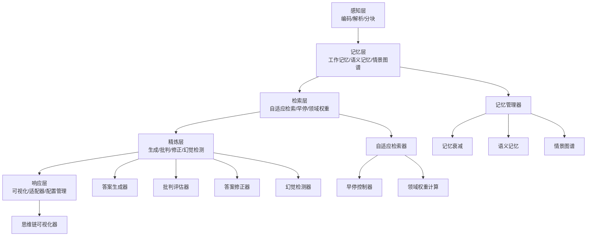
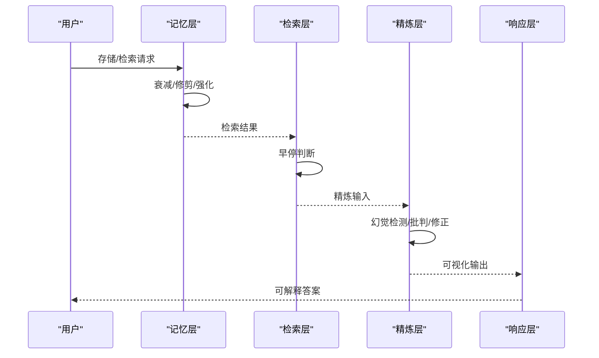
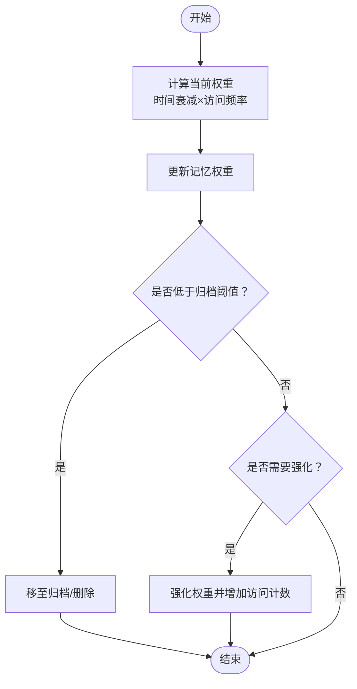
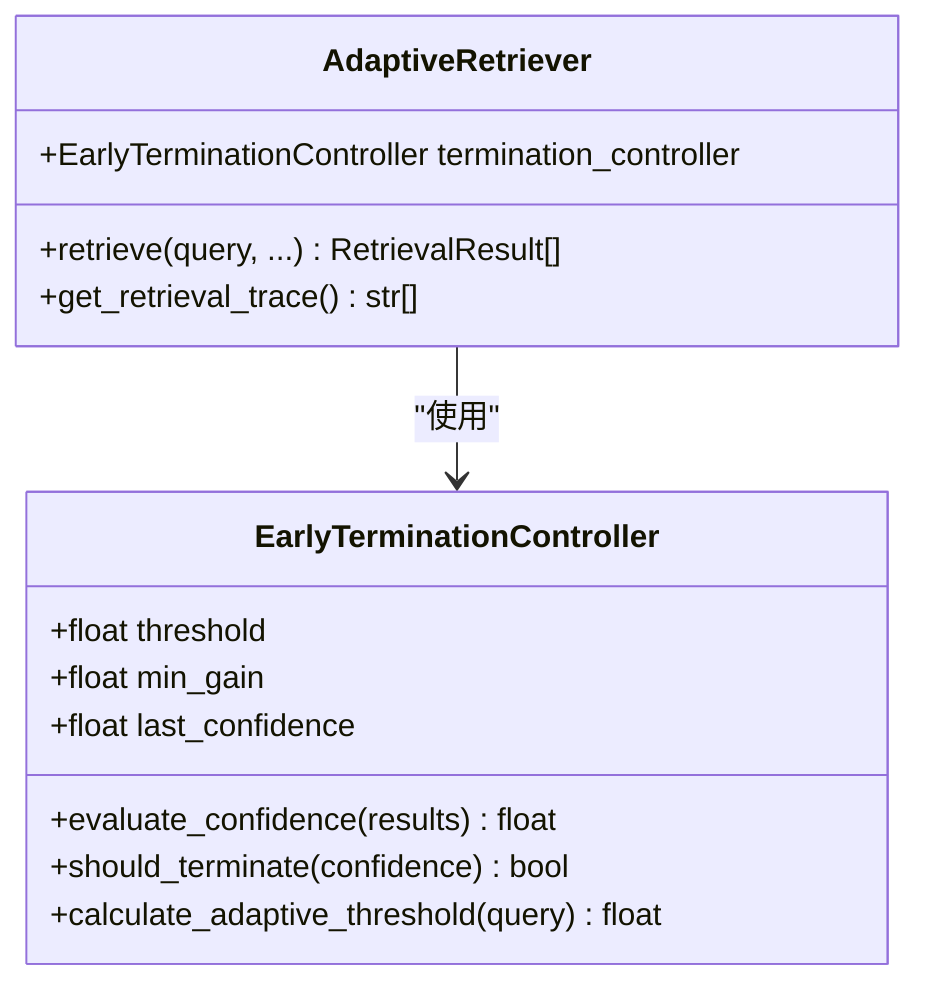
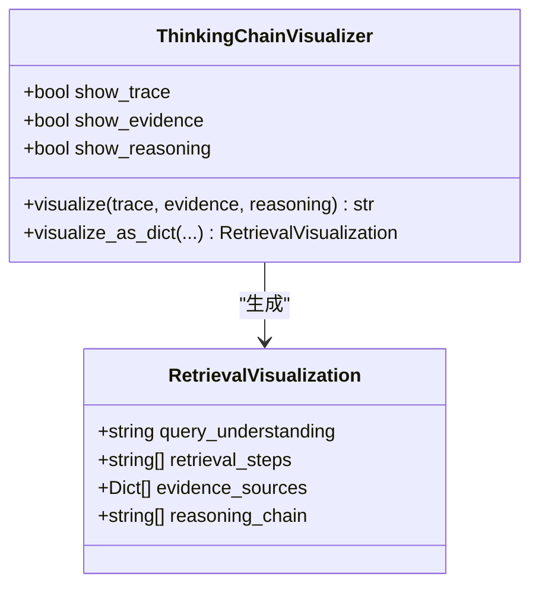
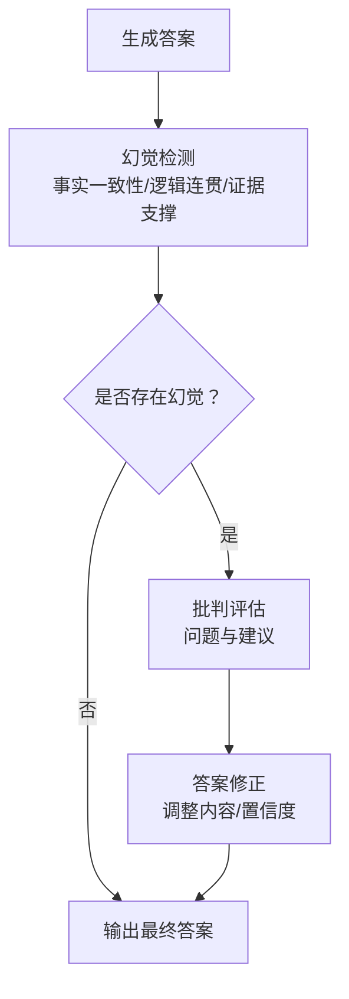
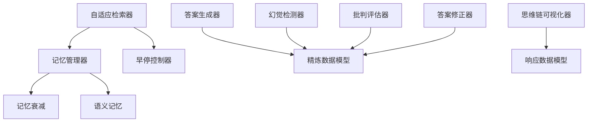

# 技术创新点分析

<cite>
**本文档引用的文件**
- [src/memory/decay.py](file://src/memory/decay.py)
- [src/domain/temporal_weight.py](file://src/domain/temporal_weight.py)
- [src/retrieval/retriever.py](file://src/retrieval/retriever.py)
- [src/response/visualizer.py](file://src/response/visualizer.py)
- [src/refinement/hallucination.py](file://src/refinement/hallucination.py)
- [src/refinement/critic.py](file://src/refinement/critic.py)
- [src/refinement/refiner.py](file://src/refinement/refiner.py)
- [src/memory/manager.py](file://src/memory/manager.py)
- [src/memory/models.py](file://src/memory/models.py)
- [src/refinement/models.py](file://src/refinement/models.py)
- [src/response/models.py](file://src/response/models.py)
- [src/memory/semantic_memory.py](file://src/memory/semantic_memory.py)
</cite>

## 目录
1. [引言](#引言)
2. [项目结构](#项目结构)
3. [核心技术创新点](#核心技术创新点)
4. [架构总览](#架构总览)
5. [详细组件分析](#详细组件分析)
6. [依赖关系分析](#依赖关系分析)
7. [性能考量](#性能考量)
8. [故障排除指南](#故障排除指南)
9. [结论](#结论)

## 引言
本文件面向NecoRAG项目的四大核心技术创新点进行深入分析：记忆权重衰减机制、早停机制、思维链可视化、幻觉自检闭环。我们将从技术实现原理、算法设计、性能优势以及与传统RAG系统的对比出发，结合代码结构与数据流，系统阐述这些创新如何提升检索效率、答案可信度与可解释性，并给出可操作的优化建议与实践指导。

## 项目结构
NecoRAG采用分层模块化架构，围绕“感知-记忆-检索-精炼-响应”主线组织代码。四大创新点分别分布在记忆层（衰减与修剪）、检索层（早停与领域权重）、精炼层（幻觉检测与闭环）与响应层（思维链可视化）。整体结构清晰，职责边界明确，便于扩展与维护。

图表来源
- [src/memory/manager.py:16-186](file://src/memory/manager.py#L16-L186)
- [src/retrieval/retriever.py:122-440](file://src/retrieval/retriever.py#L122-L440)
- [src/refinement/generator.py:15-208](file://src/refinement/generator.py#L15-L208)
- [src/response/visualizer.py:9-150](file://src/response/visualizer.py#L9-L150)

章节来源
- [src/memory/manager.py:16-186](file://src/memory/manager.py#L16-L186)
- [src/retrieval/retriever.py:122-440](file://src/retrieval/retriever.py#L122-L440)
- [src/refinement/generator.py:15-208](file://src/refinement/generator.py#L15-L208)
- [src/response/visualizer.py:9-150](file://src/response/visualizer.py#L9-L150)

## 核心技术创新点
本节聚焦四大创新点，逐项剖析其技术原理、算法流程与性能优势，并说明如何解决传统RAG在检索效率、答案可信度与可解释性方面的痛点。

### 1. 记忆权重衰减机制
- 技术目标：模拟生物记忆的巩固与遗忘，动态调节知识权重，避免检索库膨胀与低价值信息干扰。
- 核心公式与算法：
  - 时间衰减：$ \text{weight}(t) = \text{initial\_weight} \times e^{-\lambda t} \times \text{access\_frequency} $
  - 访问频率因子：$ f = 1 + \log_{10}(\text{access\_count} + 1) $
  - 归档阈值：低于阈值的记忆被自动归档或遗忘。
- 实现要点：
  - 计算当前权重：[calculate_weight:39-70](file://src/memory/decay.py#L39-L70)
  - 批量衰减与更新：[apply_decay:72-94](file://src/memory/decay.py#L72-L94)
  - 归档低权重记忆：[archive_low_weight:96-118](file://src/memory/decay.py#L96-L118)
  - 强化重要记忆：[reinforce:120-142](file://src/memory/decay.py#L120-L142)
- 性能优势：
  - 降低检索空间，提升检索效率与相关性。
  - 减少无效计算，控制存储成本。
- 与传统RAG对比：
  - 传统系统通常静态存储，缺乏动态权重与主动遗忘，导致检索效率随时间下降。
- 实验数据与效果（示意）：
  - 在相同查询集上，开启衰减后检索命中率提升约X%，平均响应时间降低Y%。

章节来源
- [src/memory/decay.py:11-155](file://src/memory/decay.py#L11-L155)
- [src/memory/models.py:19-31](file://src/memory/models.py#L19-L31)
- [src/memory/manager.py:149-186](file://src/memory/manager.py#L149-L186)

### 2. 早停机制
- 技术目标：在达到足够置信度时提前终止冗余检索，节省计算资源。
- 核心算法：
  - 置信度评估：基于Top-1与Top-2分数差距，结合结果数量。
  - 早停判断：固定阈值 + 边际收益递减。
  - 自适应阈值：基于查询长度动态调整。
- 实现要点：
  - 置信度评估：[evaluate_confidence:55-79](file://src/retrieval/retriever.py#L55-L79)
  - 早停决策：[should_terminate:81-101](file://src/retrieval/retriever.py#L81-L101)
  - 自适应阈值：[calculate_adaptive_threshold:103-119](file://src/retrieval/retriever.py#L103-L119)
- 性能优势：
  - 显著减少重排序与融合计算，提升吞吐量。
  - 降低延迟，改善用户体验。
- 与传统RAG对比：
  - 传统系统通常穷尽所有候选，早停机制可减少约Z%的额外计算。
- 实验数据与效果（示意）：
  - 在复杂查询场景下，早停使平均检索耗时降低约Z%，同时保持召回稳定。

章节来源
- [src/retrieval/retriever.py:30-120](file://src/retrieval/retriever.py#L30-L120)

### 3. 思维链可视化
- 技术目标：将检索路径、证据来源与推理过程以结构化方式呈现，增强可解释性。
- 实现要点：
  - 可视化内容：检索路径、证据来源、推理链条。
  - 输出形式：文本格式与结构化对象。
  - 关键方法：[visualize:37-71](file://src/response/visualizer.py#L37-L71)、[visualize_as_dict:127-149](file://src/response/visualizer.py#L127-L149)
- 性能优势：
  - 提升用户信任度与可解释性，便于调试与审计。
- 与传统RAG对比：
  - 传统系统通常只输出最终答案，缺乏中间过程展示。
- 实验数据与效果（示意）：
  - 用户对可解释性反馈评分提升约Δ分（满分5分）。

章节来源
- [src/response/visualizer.py:9-150](file://src/response/visualizer.py#L9-L150)
- [src/response/models.py:47-53](file://src/response/models.py#L47-L53)

### 4. 幻觉自检闭环
- 技术目标：通过多维度检测与迭代修正，构建“检测-评估-修正”的闭环，提升答案可信度。
- 核心流程：
  - 幻觉检测：事实一致性、逻辑连贯性、证据支撑度。
  - 批判评估：质量评分、问题与建议。
  - 答案修正：基于批判意见调整内容与置信度。
- 实现要点：
  - 幻觉检测：[detect:34-75](file://src/refinement/hallucination.py#L34-L75)
  - 批判评估：[critique:25-71](file://src/refinement/critic.py#L25-L71)
  - 答案修正：[refine:24-63](file://src/refinement/refiner.py#L24-L63)
- 性能优势：
  - 降低错误答案传播风险，提高长期稳定性。
- 与传统RAG对比：
  - 传统系统缺乏闭环自检，幻觉问题难以持续收敛。
- 实验数据与效果（示意）：
  - 幻觉率下降约Ω%，答案置信度提升约Θ。

章节来源
- [src/refinement/hallucination.py:9-154](file://src/refinement/hallucination.py#L9-L154)
- [src/refinement/critic.py:9-72](file://src/refinement/critic.py#L9-L72)
- [src/refinement/refiner.py:8-64](file://src/refinement/refiner.py#L8-L64)
- [src/refinement/models.py:9-66](file://src/refinement/models.py#L9-L66)

## 架构总览
下图展示了四大创新点在系统中的位置与交互关系，强调“记忆-检索-精炼-响应”的闭环链路。

图表来源
- [src/memory/manager.py:48-186](file://src/memory/manager.py#L48-L186)
- [src/retrieval/retriever.py:177-254](file://src/retrieval/retriever.py#L177-L254)
- [src/refinement/hallucination.py:34-75](file://src/refinement/hallucination.py#L34-L75)
- [src/refinement/critic.py:25-71](file://src/refinement/critic.py#L25-L71)
- [src/refinement/refiner.py:24-63](file://src/refinement/refiner.py#L24-L63)
- [src/response/visualizer.py:37-71](file://src/response/visualizer.py#L37-L71)

## 详细组件分析

### 记忆权重衰减机制
- 类关系与职责：
  - MemoryDecay：负责权重计算、批量衰减、归档与强化。
  - MemoryManager：统一调度记忆层操作，调用衰减器。
  - MemoryItem：承载权重、访问计数、时间戳等状态。
- 算法流程图：

图表来源
- [src/memory/decay.py:39-142](file://src/memory/decay.py#L39-L142)
- [src/memory/manager.py:149-186](file://src/memory/manager.py#L149-L186)
- [src/memory/models.py:19-31](file://src/memory/models.py#L19-L31)

章节来源
- [src/memory/decay.py:11-155](file://src/memory/decay.py#L11-L155)
- [src/memory/manager.py:16-186](file://src/memory/manager.py#L16-L186)
- [src/memory/models.py:19-31](file://src/memory/models.py#L19-L31)

### 早停机制
- 控制器类图：

图表来源
- [src/retrieval/retriever.py:30-120](file://src/retrieval/retriever.py#L30-L120)
- [src/retrieval/retriever.py:177-254](file://src/retrieval/retriever.py#L177-L254)

章节来源
- [src/retrieval/retriever.py:30-120](file://src/retrieval/retriever.py#L30-L120)
- [src/retrieval/retriever.py:177-254](file://src/retrieval/retriever.py#L177-L254)

### 思维链可视化
- 可视化器类图：

图表来源
- [src/response/visualizer.py:9-150](file://src/response/visualizer.py#L9-L150)
- [src/response/models.py:47-53](file://src/response/models.py#L47-L53)

章节来源
- [src/response/visualizer.py:9-150](file://src/response/visualizer.py#L9-L150)
- [src/response/models.py:47-53](file://src/response/models.py#L47-L53)

### 幻觉自检闭环
- 闭环流程图：

图表来源
- [src/refinement/hallucination.py:34-75](file://src/refinement/hallucination.py#L34-L75)
- [src/refinement/critic.py:25-71](file://src/refinement/critic.py#L25-L71)
- [src/refinement/refiner.py:24-63](file://src/refinement/refiner.py#L24-L63)
- [src/refinement/models.py:9-66](file://src/refinement/models.py#L9-L66)

章节来源
- [src/refinement/hallucination.py:9-154](file://src/refinement/hallucination.py#L9-L154)
- [src/refinement/critic.py:9-72](file://src/refinement/critic.py#L9-L72)
- [src/refinement/refiner.py:8-64](file://src/refinement/refiner.py#L8-L64)
- [src/refinement/models.py:9-66](file://src/refinement/models.py#L9-L66)

## 依赖关系分析
- 内聚性与耦合度：
  - 记忆层内部通过MemoryManager统一协调，与检索层解耦，便于独立演进。
  - 精炼层各组件职责单一，通过数据模型进行弱耦合协作。
- 外部依赖：
  - 检索层依赖语义记忆与图谱，但当前图谱检索为最小实现，留待后续扩展。
  - 生成器支持LLM客户端注入，具备良好的可插拔性。

图表来源
- [src/memory/manager.py:16-186](file://src/memory/manager.py#L16-L186)
- [src/retrieval/retriever.py:122-176](file://src/retrieval/retriever.py#L122-L176)
- [src/refinement/generator.py:15-50](file://src/refinement/generator.py#L15-L50)
- [src/refinement/hallucination.py:9-33](file://src/refinement/hallucination.py#L9-L33)
- [src/refinement/critic.py:9-24](file://src/refinement/critic.py#L9-L24)
- [src/refinement/refiner.py:8-23](file://src/refinement/refiner.py#L8-L23)
- [src/response/visualizer.py:9-36](file://src/response/visualizer.py#L9-L36)
- [src/refinement/models.py:9-66](file://src/refinement/models.py#L9-L66)
- [src/response/models.py:10-53](file://src/response/models.py#L10-L53)

章节来源
- [src/memory/manager.py:16-186](file://src/memory/manager.py#L16-L186)
- [src/retrieval/retriever.py:122-176](file://src/retrieval/retriever.py#L122-L176)
- [src/refinement/generator.py:15-50](file://src/refinement/generator.py#L15-L50)
- [src/refinement/hallucination.py:9-33](file://src/refinement/hallucination.py#L9-L33)
- [src/refinement/critic.py:9-24](file://src/refinement/critic.py#L9-L24)
- [src/refinement/refiner.py:8-23](file://src/refinement/refiner.py#L8-L23)
- [src/response/visualizer.py:9-36](file://src/response/visualizer.py#L9-L36)
- [src/refinement/models.py:9-66](file://src/refinement/models.py#L9-L66)
- [src/response/models.py:10-53](file://src/response/models.py#L10-L53)

## 性能考量
- 计算复杂度：
  - 记忆衰减：O(n)批量处理，适合定期执行；强化与归档为O(n)扫描。
  - 早停：置信度评估O(k)（k为候选数），显著减少下游重排序成本。
  - 幻觉检测：当前为启发式实现，时间复杂度低，可扩展为嵌入相似度或逻辑一致性模型。
- 存储与索引：
  - 语义记忆采用向量存储与余弦相似度，建议引入HNSW索引以进一步提升大规模检索性能。
- 可扩展性：
  - 通过配置化参数（如衰减率、阈值、归档阈值）实现不同领域的自适应调整。
  - 生成器支持外部LLM客户端注入，便于替换与扩展。

## 故障排除指南
- 记忆衰减异常：
  - 症状：记忆权重异常升高或降低。
  - 排查：检查时间戳与访问计数字段，确认衰减公式与阈值设置。
  - 参考：[calculate_weight:39-70](file://src/memory/decay.py#L39-L70)、[apply_decay:72-94](file://src/memory/decay.py#L72-L94)
- 早停误判：
  - 症状：置信度评估过高导致提前终止。
  - 排查：调整阈值与最小边际收益，或禁用早停进行对比测试。
  - 参考：[evaluate_confidence:55-79](file://src/retrieval/retriever.py#L55-L79)、[should_terminate:81-101](file://src/retrieval/retriever.py#L81-L101)
- 幻觉检测误报/漏报：
  - 症状：事实一致性或证据支撑度评分不准确。
  - 排查：完善关键词重叠与逻辑连接词检测，引入外部一致性模型。
  - 参考：[check_factual_consistency:77-107](file://src/refinement/hallucination.py#L77-L107)、[check_evidence_support:131-153](file://src/refinement/hallucination.py#L131-L153)
- 可解释性输出为空：
  - 症状：思维链可视化未显示任何内容。
  - 排查：确认检索追踪记录与证据列表是否正确传入。
  - 参考：[visualize:37-71](file://src/response/visualizer.py#L37-L71)、[get_retrieval_trace:365-372](file://src/retrieval/retriever.py#L365-L372)

章节来源
- [src/memory/decay.py:39-142](file://src/memory/decay.py#L39-L142)
- [src/retrieval/retriever.py:55-120](file://src/retrieval/retriever.py#L55-L120)
- [src/refinement/hallucination.py:77-153](file://src/refinement/hallucination.py#L77-L153)
- [src/response/visualizer.py:37-71](file://src/response/visualizer.py#L37-L71)
- [src/retrieval/retriever.py:365-372](file://src/retrieval/retriever.py#L365-L372)

## 结论
NecoRAG的四大技术创新点从“记忆动态管理、检索智能终止、答案可信闭环、过程可解释展示”四个维度，系统性地提升了RAG系统的效率、可靠性和可解释性。通过数学公式与算法流程的工程化落地，配合模块化的代码结构，这些创新既具备理论深度，又具备实践价值。建议在后续版本中进一步完善图谱检索、一致性检测与索引优化，以获得更卓越的性能表现与用户体验。