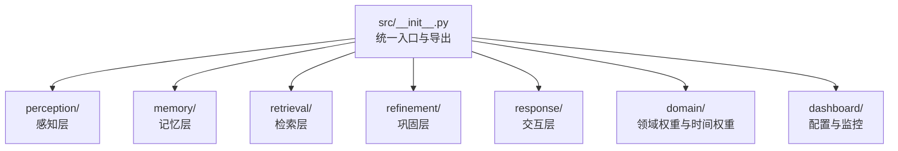
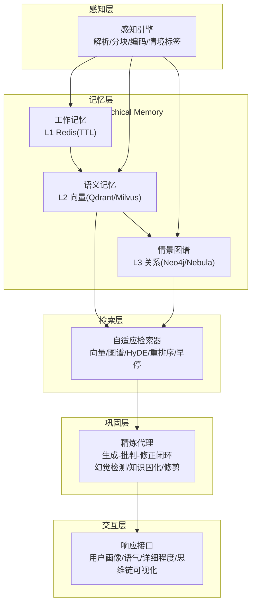
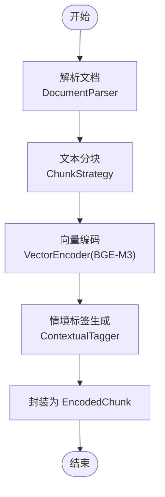
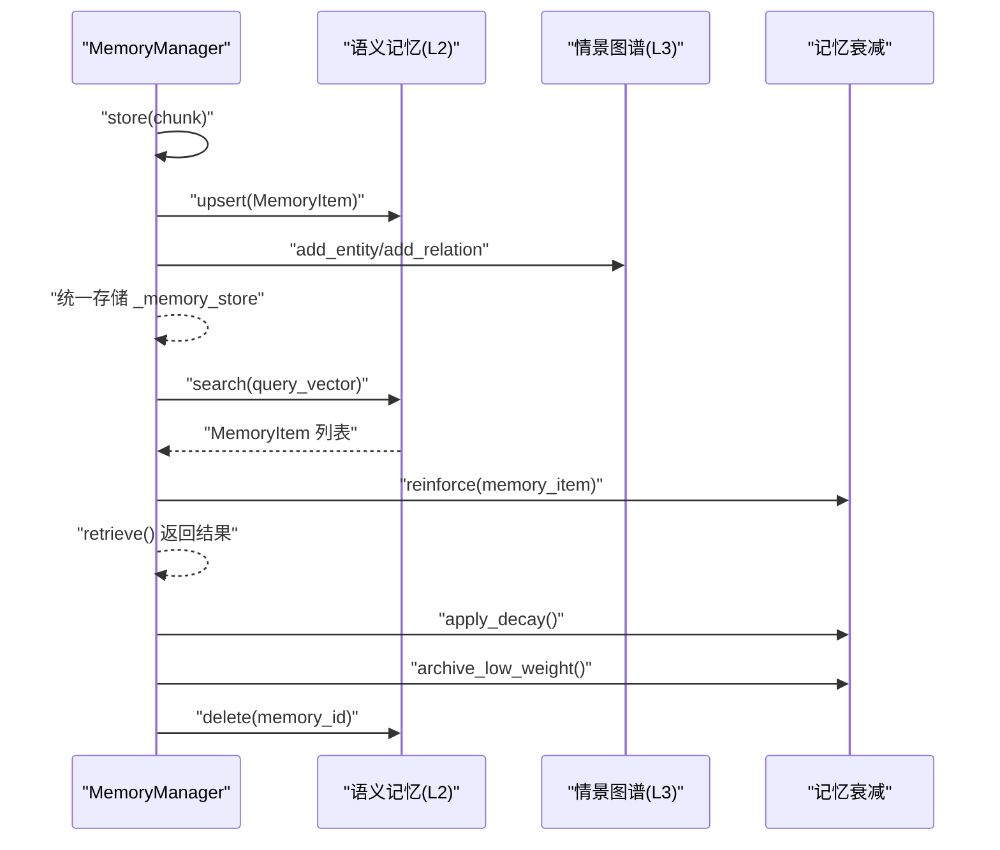
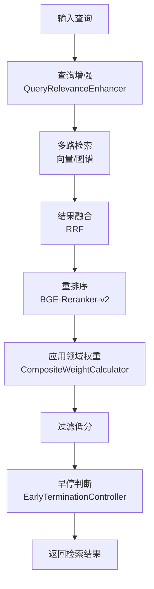
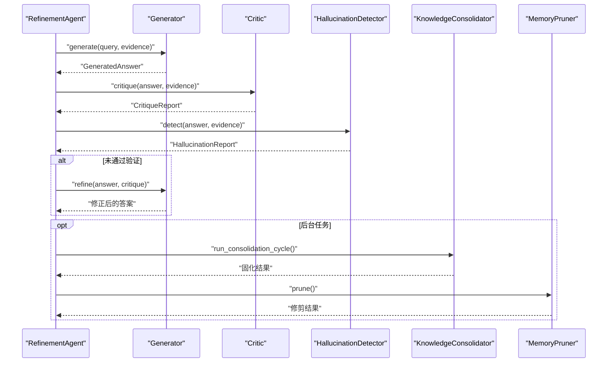
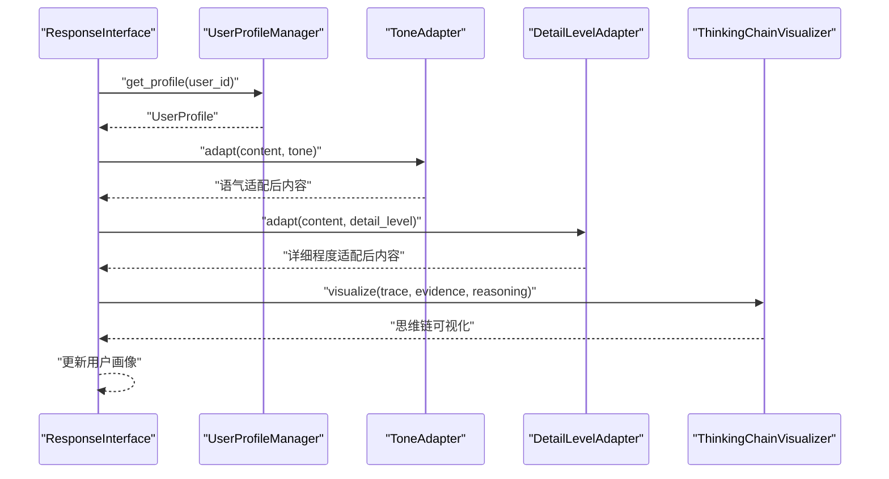
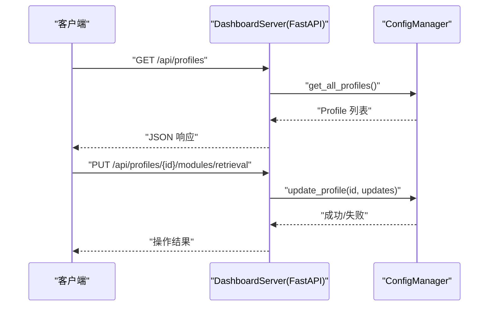
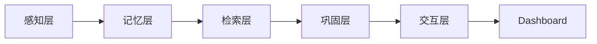

# 技术架构概览

<cite>
**本文引用的文件**
- [README.md](file://README.md)
- [design.md](file://design/design.md)
- [src/__init__.py](file://src/__init__.py)
- [src/core/base.py](file://src/core/base.py)
- [src/perception/engine.py](file://src/perception/engine.py)
- [src/memory/manager.py](file://src/memory/manager.py)
- [src/memory/models.py](file://src/memory/models.py)
- [src/retrieval/retriever.py](file://src/retrieval/retriever.py)
- [src/retrieval/models.py](file://src/retrieval/models.py)
- [src/refinement/agent.py](file://src/refinement/agent.py)
- [src/refinement/models.py](file://src/refinement/models.py)
- [src/response/interface.py](file://src/response/interface.py)
- [src/response/models.py](file://src/response/models.py)
- [src/domain/weight_calculator.py](file://src/domain/weight_calculator.py)
- [src/dashboard/server.py](file://src/dashboard/server.py)
</cite>

## 目录
1. [简介](#简介)
2. [项目结构](#项目结构)
3. [核心组件](#核心组件)
4. [架构总览](#架构总览)
5. [详细组件分析](#详细组件分析)
6. [依赖关系分析](#依赖关系分析)
7. [性能考量](#性能考量)
8. [故障排查指南](#故障排查指南)
9. [结论](#结论)

## 简介
本文件为 NecoRAG 的技术架构概览，围绕其“五层认知”架构展开：感知层（Perception Engine）、记忆层（Hierarchical Memory）、检索层（Adaptive Retrieval）、巩固层（Refinement Agent）与交互层（Response Interface）。文档从设计理念、职责划分、技术实现、层间协作、数据流与可视化等方面，系统阐述从文档处理到最终响应的完整流程，并给出架构设计的技术决策与权衡。

## 项目结构
NecoRAG 采用模块化分层组织，核心模块与入口如下：
- 统一入口与导出：通过包级导出统一对外暴露核心组件与配置
- 五层架构模块：perception、memory、retrieval、refinement、response
- 领域权重与时间权重：domain 模块提供多因子权重融合与重排序
- Dashboard：dashboard 模块提供 Web 配置与监控界面

**图表来源**
- [src/__init__.py:10-111](file://src/__init__.py#L10-L111)

**章节来源**
- [src/__init__.py:9-111](file://src/__init__.py#L9-L111)
- [README.md:35-85](file://README.md#L35-L85)

## 核心组件
- 感知层（Perception Engine）
  - 职责：文档解析、文本分块、向量编码（稠密/稀疏/实体三元组）、情境标签生成
  - 关键实现：解析器、分块器、编码器、情境标签生成器
- 记忆层（Hierarchical Memory）
  - 职责：L1 工作记忆（Redis，TTL）、L2 语义记忆（Qdrant/Milvus，向量检索）、L3 情景图谱（Neo4j/NebulaGraph，实体关系网络）
  - 关键实现：记忆管理器、衰减与主动遗忘、统一检索接口
- 检索层（Adaptive Retrieval）
  - 职责：向量检索、图谱多跳、HyDE 增强、重排序、早停机制、领域权重融合
  - 关键实现：自适应检索器、早停控制器、融合策略、重排序器
- 巩固层（Refinement Agent）
  - 职责：生成-批判-修正闭环、幻觉检测、异步知识固化与修剪
  - 关键实现：生成器、批判者、修正器、幻觉检测器、知识固化器、记忆修剪器
- 交互层（Response Interface）
  - 职责：用户画像适配、语气/详细程度适配、思维链可视化、多模态输出
  - 关键实现：响应接口、用户画像管理、语气/详细程度适配器、思维链可视化器

**章节来源**
- [README.md:160-377](file://README.md#L160-L377)
- [src/perception/engine.py:14-130](file://src/perception/engine.py#L14-L130)
- [src/memory/manager.py:16-186](file://src/memory/manager.py#L16-L186)
- [src/retrieval/retriever.py:122-440](file://src/retrieval/retriever.py#L122-L440)
- [src/refinement/agent.py:16-151](file://src/refinement/agent.py#L16-L151)
- [src/response/interface.py:16-224](file://src/response/interface.py#L16-L224)

## 架构总览
五层架构自下而上对应人脑认知机制的不同阶段，形成“感知-记忆-检索-巩固-交互”的完整闭环。

**图表来源**
- [design.md:379-438](file://design/design.md#L379-L438)
- [src/perception/engine.py:14-130](file://src/perception/engine.py#L14-L130)
- [src/memory/manager.py:16-186](file://src/memory/manager.py#L16-L186)
- [src/retrieval/retriever.py:122-440](file://src/retrieval/retriever.py#L122-L440)
- [src/refinement/agent.py:16-151](file://src/refinement/agent.py#L16-L151)
- [src/response/interface.py:16-224](file://src/response/interface.py#L16-L224)

## 详细组件分析

### 感知层（Perception Engine）
- 职责
  - 集成文档解析（RAGFlow）、文本分块、向量编码（BGE-M3：稠密/稀疏/实体三元组）、情境标签生成
  - 输出 EncodedChunk，包含内容、向量、实体三元组与情境标签
- 关键流程
  - 解析文档 → 分块 → 编码 → 打标 → 统一封装为 EncodedChunk
- 数据模型
  - EncodedChunk、Chunk、ParsedDocument 等

**图表来源**
- [src/perception/engine.py:42-130](file://src/perception/engine.py#L42-L130)

**章节来源**
- [src/perception/engine.py:14-130](file://src/perception/engine.py#L14-L130)
- [README.md:160-195](file://README.md#L160-L195)

### 记忆层（Hierarchical Memory）
- 职责
  - L1：工作记忆（Redis，TTL，短期上下文）
  - L2：语义记忆（Qdrant/Milvus，向量检索）
  - L3：情景图谱（Neo4j/Nebula，实体关系网络）
  - 动态权重衰减与主动遗忘，维持记忆库“鲜活”
- 关键流程
  - 存储：将 EncodedChunk 转换为 MemoryItem，写入 L2 向量库与 L3 图谱
  - 检索：支持 L2 向量检索，结合衰减强化访问记忆
  - 巩固/遗忘：应用衰减、识别低权重并归档/删除

**图表来源**
- [src/memory/manager.py:48-186](file://src/memory/manager.py#L48-L186)
- [src/memory/models.py:12-67](file://src/memory/models.py#L12-L67)

**章节来源**
- [src/memory/manager.py:16-186](file://src/memory/manager.py#L16-L186)
- [src/memory/models.py:19-67](file://src/memory/models.py#L19-L67)
- [README.md:198-244](file://README.md#L198-L244)

### 检索层（Adaptive Retrieval）
- 职责
  - 多路检索：向量检索 + 图谱检索（实体驱动）
  - HyDE 增强：先生成假设文档再检索
  - 重排序：BGE-Reranker-v2，引入新颖性惩罚
  - 早停机制：基于置信度阈值与边际收益递减
  - 领域权重融合：关键字权重、时间权重、领域相关性权重
- 关键流程
  - 查询增强（识别领域关键字）→ 多路检索 → 结果融合（RRF）→ 重排序 → 应用领域权重 → 过滤低分 → 早停判断

**图表来源**
- [src/retrieval/retriever.py:177-373](file://src/retrieval/retriever.py#L177-L373)
- [src/domain/weight_calculator.py:56-206](file://src/domain/weight_calculator.py#L56-L206)

**章节来源**
- [src/retrieval/retriever.py:122-440](file://src/retrieval/retriever.py#L122-L440)
- [src/retrieval/models.py:9-29](file://src/retrieval/models.py#L9-L29)
- [src/domain/weight_calculator.py:56-318](file://src/domain/weight_calculator.py#L56-L318)
- [README.md:247-287](file://README.md#L247-L287)

### 巩固层（Refinement Agent）
- 职责
  - 生成-批判-修正闭环：Generator → Critic → Refiner
  - 幻觉检测：事实一致性、证据支撑度、逻辑连贯性
  - 异步知识固化与记忆修剪：定期分析高频未命中 Query，补充知识缺口或合并碎片化知识
- 关键流程
  - 生成初始答案 → 批判评估 → 幻觉检测 → 未通过则修正 → 达到迭代上限或置信度过低则返回

**图表来源**
- [src/refinement/agent.py:61-151](file://src/refinement/agent.py#L61-L151)
- [src/refinement/models.py:9-66](file://src/refinement/models.py#L9-L66)

**章节来源**
- [src/refinement/agent.py:16-151](file://src/refinement/agent.py#L16-L151)
- [src/refinement/models.py:9-66](file://src/refinement/models.py#L9-L66)
- [README.md:290-330](file://README.md#L290-L330)

### 交互层（Response Interface）
- 职责
  - 用户画像适配：根据 L1 会话历史动态调整语气与详细程度
  - 思维链可视化：展示检索路径、证据来源与推理过程
  - 多模态输出：文本、图表、可选语音
- 关键流程
  - 获取用户画像 → 确定语气/详细程度 → 适配内容 → 生成思维链 → 更新画像

**图表来源**
- [src/response/interface.py:55-224](file://src/response/interface.py#L55-L224)
- [src/response/models.py:10-53](file://src/response/models.py#L10-L53)

**章节来源**
- [src/response/interface.py:16-224](file://src/response/interface.py#L16-L224)
- [src/response/models.py:10-53](file://src/response/models.py#L10-L53)
- [README.md:333-377](file://README.md#L333-L377)

### Dashboard（配置与监控）
- 职责
  - 配置 Profile 管理（创建/编辑/删除/导入导出）
  - 模块参数配置（五大模块完整参数）
  - 实时统计监控与 RESTful API
- 关键流程
  - 启动 FastAPI 服务 → 注册路由 → 提供 Web UI 与 API 文档

**图表来源**
- [src/dashboard/server.py:94-253](file://src/dashboard/server.py#L94-L253)

**章节来源**
- [src/dashboard/server.py:43-393](file://src/dashboard/server.py#L43-L393)
- [README.md:380-433](file://README.md#L380-L433)

## 依赖关系分析
- 组件耦合与内聚
  - 各层之间通过明确的数据模型与接口耦合，内聚性良好
  - 记忆层为检索层与巩固层提供统一数据源，降低重复实现
- 外部依赖
  - 感知层：RAGFlow（文档解析）、BGE-M3（向量编码）
  - 记忆层：Redis（L1）、Qdrant/Milvus（L2）、Neo4j/NebulaGraph（L3）
  - 检索层：BGE-Reranker-v2（重排序）
  - 交互层：LLM 推理（vLLM/Ollama）
  - Dashboard：FastAPI、Uvicorn
- 可能的循环依赖
  - 通过模块化拆分与接口抽象避免循环依赖

**图表来源**
- [design.md:440-456](file://design/design.md#L440-L456)

**章节来源**
- [design.md:440-456](file://design/design.md#L440-L456)
- [README.md:496-522](file://README.md#L496-L522)

## 性能考量
- 检索性能
  - 早停机制：在置信度达标时立即终止，减少冗余计算
  - 多路检索与融合：平衡召回与效率
  - 重排序与领域权重：提升相关性，减少无效回滚
- 记忆与存储
  - L1 TTL：限制短期上下文规模，避免内存膨胀
  - 动态权重衰减与主动遗忘：降低无效检索开销
- 推理与生成
  - 交互层根据用户画像与查询复杂度自适应调整详细程度，兼顾速度与质量
- 可扩展性
  - 模块化接口与抽象基类，便于替换与扩展
  - Dashboard 提供参数热切换与监控，支持在线调优

[本节为通用性能讨论，无需列出具体文件来源]

## 故障排查指南
- 检索结果为空或质量差
  - 检查早停阈值与置信度评估逻辑
  - 确认领域权重配置与查询增强是否生效
  - 核对向量与图谱检索路径追踪
- 记忆库异常
  - 检查 L1 TTL、L2 向量与 L3 图谱连接状态
  - 观察记忆衰减与主动遗忘策略是否过度修剪
- 幻觉与质量不稳定
  - 提升迭代次数与最小置信度阈值
  - 检查批判与幻觉检测模块的配置
- Dashboard 无法访问或参数不生效
  - 确认端口与 CORS 配置
  - 检查 Profile 激活状态与模块参数更新是否成功

**章节来源**
- [src/retrieval/retriever.py:30-120](file://src/retrieval/retriever.py#L30-L120)
- [src/memory/manager.py:149-186](file://src/memory/manager.py#L149-L186)
- [src/refinement/agent.py:130-151](file://src/refinement/agent.py#L130-L151)
- [src/dashboard/server.py:94-253](file://src/dashboard/server.py#L94-L253)

## 结论
NecoRAG 的五层认知架构以“类脑记忆结构”为核心，通过感知-记忆-检索-巩固-交互的闭环，实现了从文档处理到可解释响应的完整流程。其技术决策强调：
- 可解释性：思维链可视化与检索路径追踪
- 可靠性：幻觉自检与知识固化
- 可扩展性：模块化接口与 Dashboard 配置管理
- 性能：早停机制、领域权重融合与动态衰减
这些设计共同支撑了在复杂场景下的高效、稳定与可控的智能问答体验。