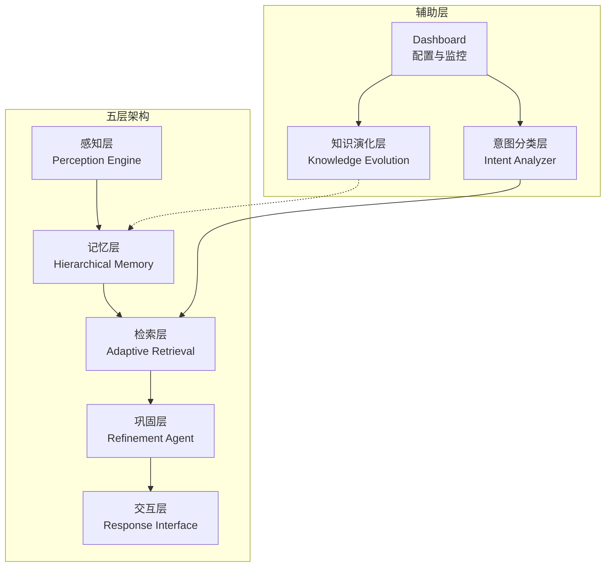
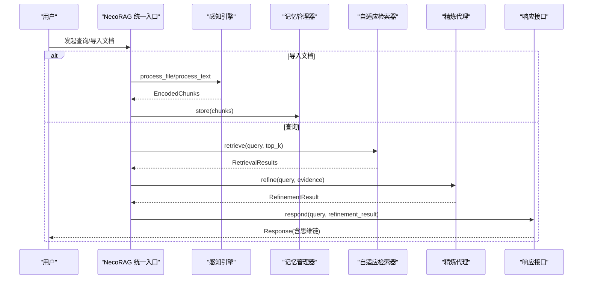
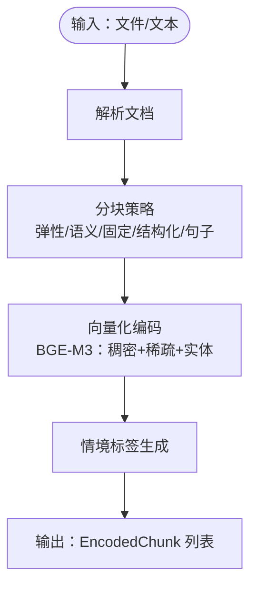
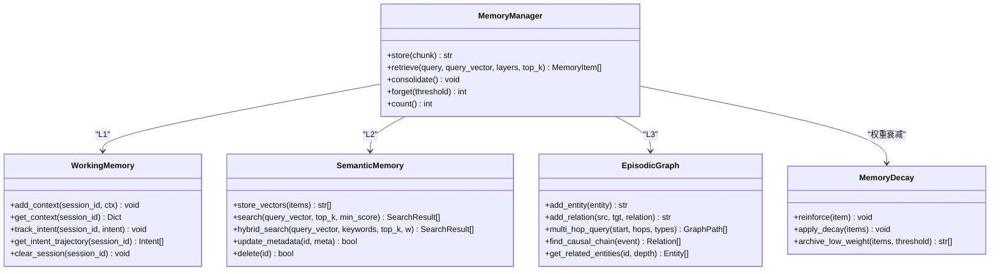
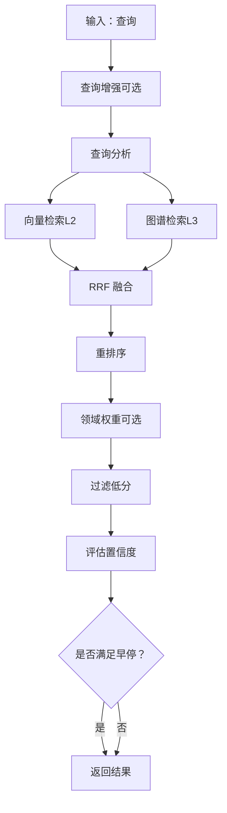
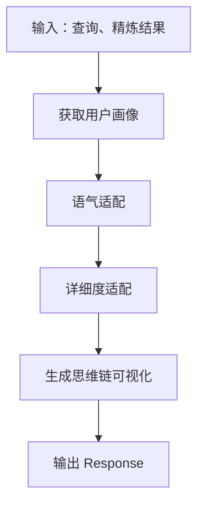
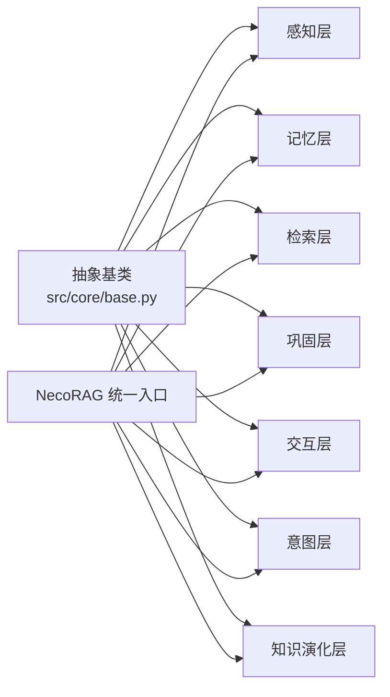

# 技术架构概览

<cite>
**本文引用的文件**
- [README.md](file://README.md)
- [src/necorag.py](file://src/necorag.py)
- [src/core/base.py](file://src/core/base.py)
- [src/perception/engine.py](file://src/perception/engine.py)
- [src/memory/manager.py](file://src/memory/manager.py)
- [src/memory/working_memory.py](file://src/memory/working_memory.py)
- [src/memory/semantic_memory.py](file://src/memory/semantic_memory.py)
- [src/memory/episodic_graph.py](file://src/memory/episodic_graph.py)
- [src/retrieval/retriever.py](file://src/retrieval/retriever.py)
- [src/refinement/agent.py](file://src/refinement/agent.py)
- [src/response/interface.py](file://src/response/interface.py)
- [src/intent/classifier.py](file://src/intent/classifier.py)
- [src/knowledge_evolution/updater.py](file://src/knowledge_evolution/updater.py)
- [src/dashboard/server.py](file://src/dashboard/server.py)
- [requirements.txt](file://requirements.txt)
</cite>

## 目录
1. [简介](#简介)
2. [项目结构](#项目结构)
3. [核心组件](#核心组件)
4. [架构总览](#架构总览)
5. [详细组件分析](#详细组件分析)
6. [依赖关系分析](#依赖关系分析)
7. [性能考量](#性能考量)
8. [故障排查指南](#故障排查指南)
9. [结论](#结论)
10. [附录](#附录)

## 简介
本文件面向开发者与架构师，系统化阐述 NecoRAG 的“五层认知”架构设计与实现细节。项目以类脑记忆理论为基础，结合神经认知科学原理，构建从感知到交互的完整认知闭环，具备：
- 三层记忆系统（工作记忆 L1 + 语义记忆 L2 + 情景图谱 L3）
- 智能早停机制与混合检索策略
- 幻觉自检与知识进化的闭环
- 可解释性输出与思维链可视化
- 配置管理与监控 Dashboard

## 项目结构
NecoRAG 采用模块化分层组织，核心模块包括：
- 感知层（Perception Engine）：多模态文档解析、向量化编码、情境标签生成
- 记忆层（Hierarchical Memory）：L1 工作记忆、L2 语义记忆、L3 情景图谱
- 检索层（Adaptive Retrieval）：向量检索、图谱检索、HyDE 增强、重排序、早停
- 巩固层（Refinement Agent）：生成-批判-修正闭环、幻觉检测、知识固化与修剪
- 交互层（Response Interface）：情境自适应生成、语气/详细度适配、思维链可视化
- 意图分类层（Intent Analyzer）：查询意图识别与路由
- 知识演化层（Knowledge Evolution）：实时/批量更新、候选池、变更日志、健康报告
- Dashboard（配置与监控）：REST API 与 Web UI



**图表来源**
- [src/necorag.py:111-133](file://src/necorag.py#L111-L133)
- [src/perception/engine.py:15-71](file://src/perception/engine.py#L15-L71)
- [src/memory/manager.py:16-46](file://src/memory/manager.py#L16-L46)
- [src/retrieval/retriever.py:122-161](file://src/retrieval/retriever.py#L122-L161)
- [src/refinement/agent.py:16-60](file://src/refinement/agent.py#L16-L60)
- [src/response/interface.py:16-53](file://src/response/interface.py#L16-L53)
- [src/intent/classifier.py:19-58](file://src/intent/classifier.py#L19-L58)
- [src/knowledge_evolution/updater.py:23-77](file://src/knowledge_evolution/updater.py#L23-L77)
- [src/dashboard/server.py:48-101](file://src/dashboard/server.py#L48-L101)

**章节来源**
- [README.md:35-85](file://README.md#L35-L85)
- [src/necorag.py:111-133](file://src/necorag.py#L111-L133)

## 核心组件
- 统一入口 NecoRAG：负责组件初始化、文档导入、查询流程编排、知识演化与自适应学习集成
- 感知引擎：文档解析、弹性/语义/固定分块、多模态向量化、情境标签生成
- 记忆管理器：统一管理 L1/L2/L3，提供存储、检索、巩固与主动遗忘
- 自适应检索器：多路检索融合、HyDE 增强、重排序、领域权重、早停控制
- 精炼代理：生成-批判-修正闭环、幻觉检测、知识固化与修剪
- 响应接口：用户画像适配、语气/详细度适配、思维链可视化
- 意图分类器：规则/可选 FastText/Transformer 后端，关键词与实体抽取
- 知识更新器：候选池管理、质量评估、实时/批量更新、变更日志、回滚
- Dashboard：REST API 与 Web UI，Profile 管理、参数配置、统计监控

**章节来源**
- [src/necorag.py:43-133](file://src/necorag.py#L43-L133)
- [src/perception/engine.py:15-174](file://src/perception/engine.py#L15-L174)
- [src/memory/manager.py:16-195](file://src/memory/manager.py#L16-L195)
- [src/retrieval/retriever.py:122-440](file://src/retrieval/retriever.py#L122-L440)
- [src/refinement/agent.py:16-151](file://src/refinement/agent.py#L16-L151)
- [src/response/interface.py:16-224](file://src/response/interface.py#L16-L224)
- [src/intent/classifier.py:19-487](file://src/intent/classifier.py#L19-L487)
- [src/knowledge_evolution/updater.py:23-800](file://src/knowledge_evolution/updater.py#L23-L800)
- [src/dashboard/server.py:48-484](file://src/dashboard/server.py#L48-L484)

## 架构总览
五层架构的端到端数据流如下：



**图表来源**
- [src/necorag.py:200-459](file://src/necorag.py#L200-L459)
- [src/perception/engine.py:122-174](file://src/perception/engine.py#L122-L174)
- [src/memory/manager.py:48-112](file://src/memory/manager.py#L48-L112)
- [src/retrieval/retriever.py:177-253](file://src/retrieval/retriever.py#L177-L253)
- [src/refinement/agent.py:61-128](file://src/refinement/agent.py#L61-L128)
- [src/response/interface.py:55-132](file://src/response/interface.py#L55-L132)

## 详细组件分析

### 感知引擎（Layer 1：感知层）
- 职责：多模态文档解析、弹性/语义/固定分块、BGE-M3 多维度向量化（稠密+稀疏+实体三元组）、情境标签生成
- 数据流：输入文件/文本 → 解析 → 分块 → 编码 → 打标 → 输出 EncodedChunk 列表
- 关键点：支持 OCR、多种分块策略、统一编码接口



**图表来源**
- [src/perception/engine.py:72-121](file://src/perception/engine.py#L72-L121)

**章节来源**
- [src/perception/engine.py:15-174](file://src/perception/engine.py#L15-L174)
- [README.md:160-195](file://README.md#L160-L195)

### 记忆管理层（Layer 2：记忆层）
- 三层架构：
  - L1 工作记忆（Redis）：会话上下文、意图轨迹、TTL 过期
  - L2 语义记忆（Qdrant/Milvus）：高维向量、模糊匹配、直觉检索
  - L3 情景图谱（Neo4j/NebulaGraph）：实体关系网络、多跳推理
- 统一管理：存储、检索、巩固（衰减+归档）、主动遗忘
- 类脑记忆理论应用：
  - 动态权重衰减：权重随时间与访问频率衰减
  - 扩散激活：检索强化记忆权重
  - 早停机制：置信度达标即终止检索



**图表来源**
- [src/memory/manager.py:16-195](file://src/memory/manager.py#L16-L195)
- [src/memory/working_memory.py:11-120](file://src/memory/working_memory.py#L11-L120)
- [src/memory/semantic_memory.py:21-179](file://src/memory/semantic_memory.py#L21-L179)
- [src/memory/episodic_graph.py:10-194](file://src/memory/episodic_graph.py#L10-L194)

**章节来源**
- [src/memory/manager.py:16-195](file://src/memory/manager.py#L16-L195)
- [src/memory/working_memory.py:11-120](file://src/memory/working_memory.py#L11-L120)
- [src/memory/semantic_memory.py:21-179](file://src/memory/semantic_memory.py#L21-L179)
- [src/memory/episodic_graph.py:10-194](file://src/memory/episodic_graph.py#L10-L194)
- [README.md:198-244](file://README.md#L198-L244)

### 自适应检索器（Layer 3：检索层）
- 职责：多路检索融合、HyDE 增强、重排序、领域权重、早停控制
- 检索路径追踪：记录查询理解、向量/图谱检索、融合、重排、领域权重、过滤与早停
- 早停策略：基于置信度阈值与边际收益递减



**图表来源**
- [src/retrieval/retriever.py:177-253](file://src/retrieval/retriever.py#L177-L253)
- [src/retrieval/retriever.py:30-120](file://src/retrieval/retriever.py#L30-L120)

**章节来源**
- [src/retrieval/retriever.py:122-440](file://src/retrieval/retriever.py#L122-L440)
- [README.md:247-287](file://README.md#L247-L287)

### 精炼代理（Layer 4：巩固层）
- 职责：生成-批判-修正闭环、幻觉检测、知识固化与修剪
- 流程：生成答案 → 批判评估 → 幻觉检测 → 未通过则修正 → 达到最大迭代或置信度达标返回

```mermaid
sequenceDiagram
participant G as "Generator"
participant C as "Critic"
participant H as "HallucinationDetector"
participant R as "Refiner"
participant K as "KnowledgeConsolidator/MemoryPruner"
G->>G : 生成答案
loop 迭代
G->>C : 批判评估
C-->>G : 评估结果
G->>H : 幻觉检测
H-->>G : 检测报告
alt 通过验证
G-->>End["返回最终答案"]
else 未通过
G->>R : 修正答案
R-->>G : 修正结果
end
end
G-->>K : 异步固化/修剪
```

**图表来源**
- [src/refinement/agent.py:61-128](file://src/refinement/agent.py#L61-L128)

**章节来源**
- [src/refinement/agent.py:16-151](file://src/refinement/agent.py#L16-L151)
- [README.md:290-330](file://README.md#L290-L330)

### 响应接口（Layer 5：交互层）
- 职责：用户画像适配、语气/详细度适配、思维链可视化、多模态输出
- 思维链：检索路径、证据来源、推理过程（置信度、迭代次数、幻觉检测）



**图表来源**
- [src/response/interface.py:55-132](file://src/response/interface.py#L55-L132)
- [src/response/interface.py:167-211](file://src/response/interface.py#L167-L211)

**章节来源**
- [src/response/interface.py:16-224](file://src/response/interface.py#L16-L224)
- [README.md:333-377](file://README.md#L333-L377)

### 意图分类层（Intent Analyzer）
- 职责：查询意图识别（解释、事实、指令等），关键词与实体抽取，可选 FastText/Transformer 后端
- 路由：根据意图调整检索参数（top_k、是否启用 HyDE）

**章节来源**
- [src/intent/classifier.py:19-487](file://src/intent/classifier.py#L19-L487)
- [src/necorag.py:323-350](file://src/necorag.py#L323-L350)

### 知识演化层（Knowledge Evolution）
- 职责：实时/批量更新、候选池管理、质量评估（相关性/新颖性/可信度）、变更日志、回滚、查询驱动知识积累
- 统计：更新次数、候选池规模、变更日志、查询日志、知识缺口

**章节来源**
- [src/knowledge_evolution/updater.py:23-800](file://src/knowledge_evolution/updater.py#L23-L800)
- [src/necorag.py:542-704](file://src/necorag.py#L542-L704)

### Dashboard（配置与监控）
- 职责：Profile 管理、模块参数配置、统计监控、知识演化 API、Web UI
- API：Profile CRUD、模块参数更新、统计信息、知识库指标/健康/仪表盘数据、候选审核、知识缺口

**章节来源**
- [src/dashboard/server.py:48-484](file://src/dashboard/server.py#L48-L484)
- [README.md:380-433](file://README.md#L380-L433)

## 依赖关系分析
- 抽象基类：统一定义感知、记忆、检索、巩固、响应、意图、知识演化、自适应学习等抽象接口，确保实现一致性与可替换性
- 组件耦合：NecoRAG 统一入口对各层组件进行延迟初始化与编排；记忆层为检索与巩固提供数据基础；意图分类影响检索参数；知识演化与自适应学习贯穿全链路
- 外部依赖：向量数据库、图数据库、缓存、嵌入模型、LLM、FastAPI、调度框架等（可选集成）



**图表来源**
- [src/core/base.py:20-793](file://src/core/base.py#L20-L793)
- [src/necorag.py:111-133](file://src/necorag.py#L111-L133)

**章节来源**
- [src/core/base.py:20-793](file://src/core/base.py#L20-L793)
- [requirements.txt:1-71](file://requirements.txt#L1-L71)

## 性能考量
- 检索效率：向量检索 + 图谱检索 + 重排序 + 早停，减少无效计算
- 记忆压缩：L2 衰减与主动遗忘降低上下文规模
- 响应优化：用户画像与偏好驱动的语气/详细度适配，避免过度生成
- 可解释性：思维链可视化便于定位问题与优化参数

[本节为通用指导，无需特定文件引用]

## 故障排查指南
- 感知层
  - 症状：分块异常、向量化失败
  - 排查：确认分块策略、OCR 开关、向量化模型可用性
- 记忆层
  - 症状：检索为空、记忆丢失
  - 排查：检查 L1 TTL、L2 向量索引、L3 图谱节点/关系
- 检索层
  - 症状：检索慢、结果不相关
  - 排查：早停阈值、融合策略、领域权重、重排序模型
- 巩固层
  - 症状：答案不稳定、幻觉
  - 排查：批判与修正流程、幻觉检测阈值、最大迭代次数
- 交互层
  - 症状：输出不符合预期
  - 排查：用户画像、语气/详细度配置、思维链生成
- Dashboard
  - 症状：API 404、UI 无法加载
  - 排查：静态文件路径、CORS、端口占用

**章节来源**
- [src/perception/engine.py:122-174](file://src/perception/engine.py#L122-L174)
- [src/memory/manager.py:114-195](file://src/memory/manager.py#L114-L195)
- [src/retrieval/retriever.py:177-253](file://src/retrieval/retriever.py#L177-L253)
- [src/refinement/agent.py:61-128](file://src/refinement/agent.py#L61-L128)
- [src/response/interface.py:55-132](file://src/response/interface.py#L55-L132)
- [src/dashboard/server.py:328-344](file://src/dashboard/server.py#L328-L344)

## 结论
NecoRAG 通过“五层认知”架构，将类脑记忆理论与现代检索增强生成技术深度融合，形成从感知到交互的闭环系统。其核心创新包括：
- 三层记忆系统与动态权重衰减
- 基于扩散激活理论的混合检索与早停机制
- 幻觉自检与知识进化的闭环
- 可解释性输出与可视化思维链
- 配置管理与监控 Dashboard

该架构既保证了工程上的可扩展与可维护性，又体现了认知科学的启发式设计，适合在复杂知识场景下持续演进。

[本节为总结性内容，无需特定文件引用]

## 附录
- 快速开始与模块使用参考见项目 README
- 统一入口 API：文档导入、查询、知识演化、自适应学习
- Dashboard API：Profile 管理、模块参数、统计与知识库监控

**章节来源**
- [README.md:87-157](file://README.md#L87-L157)
- [src/necorag.py:198-797](file://src/necorag.py#L198-L797)
- [src/dashboard/server.py:106-344](file://src/dashboard/server.py#L106-L344)