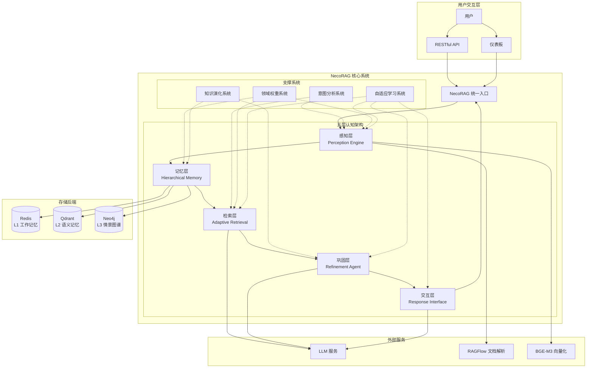
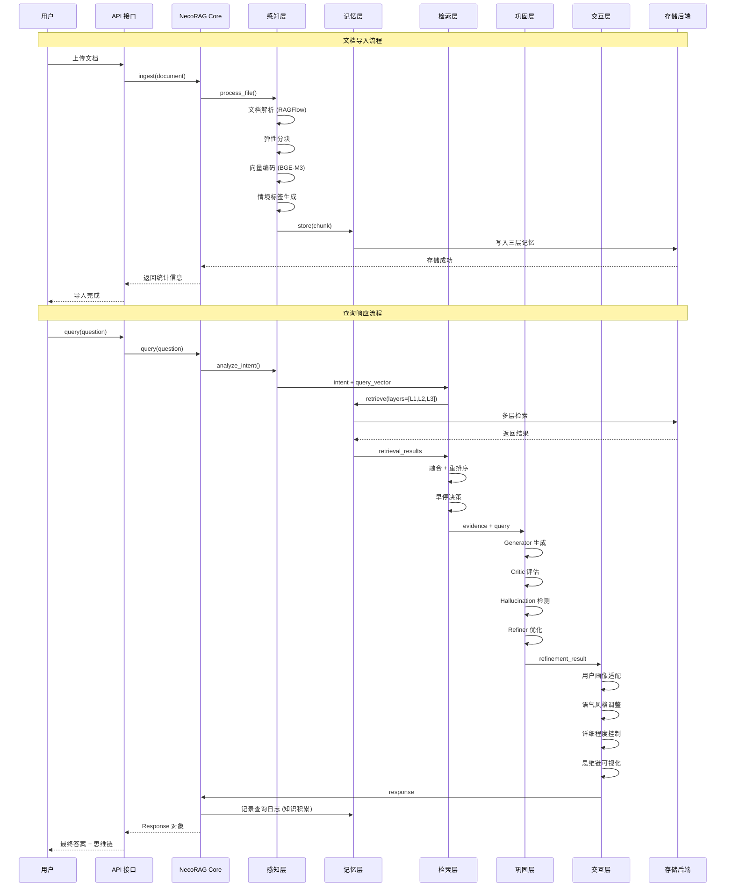
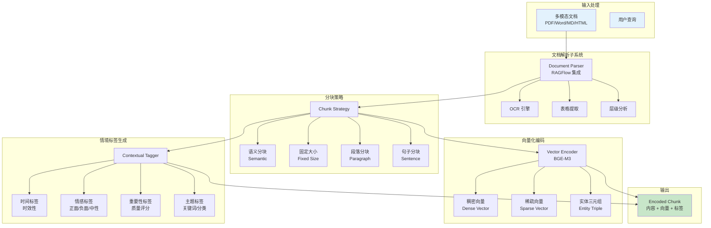
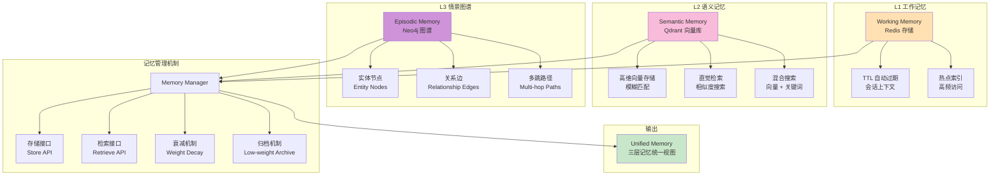
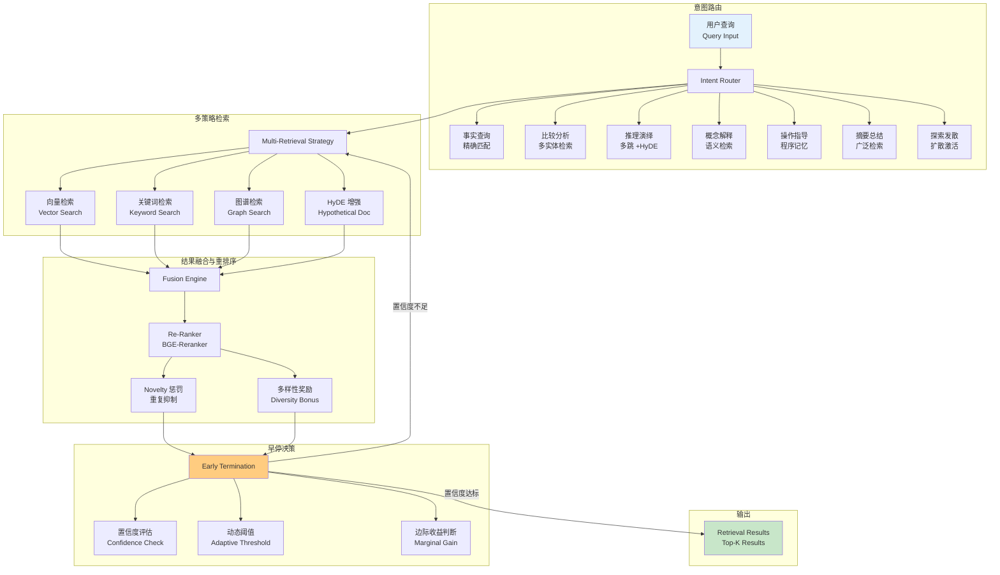
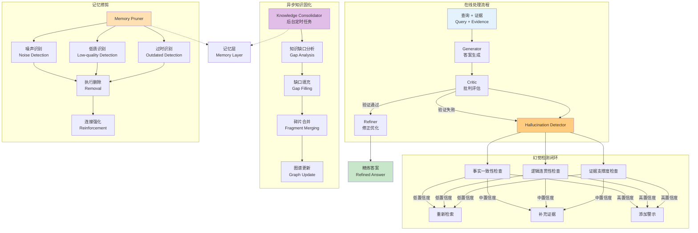
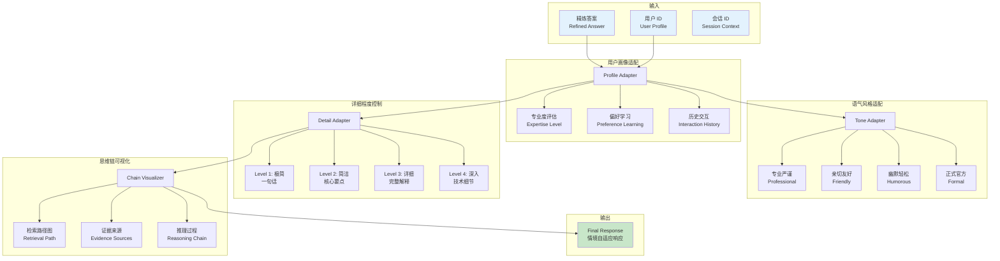
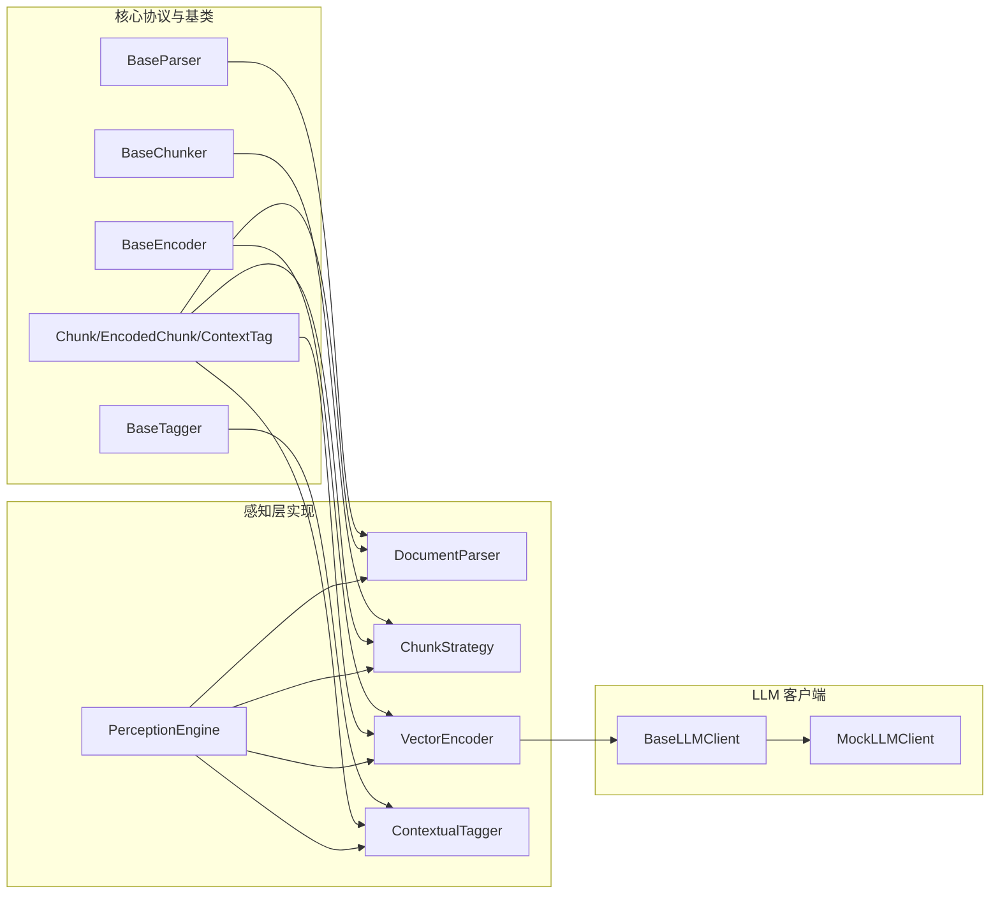
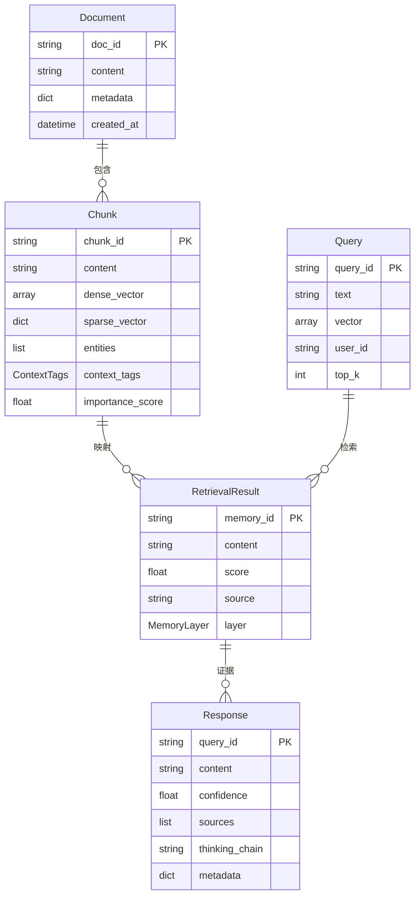

# 技术架构概览

<cite>
**本文引用的文件**
- [design/architecture_framework.md](file://design/architecture_framework.md)
- [src/necorag.py](file://src/necorag.py)
- [src/core/base.py](file://src/core/base.py)
- [src/core/config.py](file://src/core/config.py)
- [src/perception/models.py](file://src/perception/models.py)
- [src/memory/models.py](file://src/memory/models.py)
- [src/retrieval/models.py](file://src/retrieval/models.py)
- [src/refinement/models.py](file://src/refinement/models.py)
- [src/response/models.py](file://src/response/models.py)
- [src/memory/manager.py](file://src/memory/manager.py)
- [src/retrieval/retriever.py](file://src/retrieval/retriever.py)
- [src/perception/README.md](file://src/perception/README.md)
- [src/memory/README.md](file://src/memory/README.md)
- [src/retrieval/README.md](file://src/retrieval/README.md)
</cite>

## 目录
1. [简介](#简介)
2. [项目结构](#项目结构)
3. [核心组件](#核心组件)
4. [架构总览](#架构总览)
5. [详细组件分析](#详细组件分析)
6. [依赖关系分析](#依赖关系分析)
7. [性能考量](#性能考量)
8. [故障排查指南](#故障排查指南)
9. [结论](#结论)
10. [附录](#附录)

## 简介
本文件面向 NecoRAG 的五层认知架构，系统阐述从感知层（L1）到交互层（L5）的整体设计思路与实现原理。架构以类脑记忆理论为基础，构建"工作记忆-语义记忆-情景图谱"的三层记忆结构，结合 HyDE 增强、多跳检索、重排序与早停机制，实现高效、可解释、可扩展的认知级检索增强生成系统。

## 项目结构
NecoRAG 采用分层模块化设计，核心分为五层认知架构与统一入口类：

**图表来源**
- [design/architecture_framework.md:26-81](file://design/architecture_framework.md#L26-L81)
- [src/necorag.py:43-134](file://src/necorag.py#L43-L134)

**章节来源**
- [design/architecture_framework.md:22-81](file://design/architecture_framework.md#L22-L81)
- [src/necorag.py:43-134](file://src/necorag.py#L43-L134)

## 核心组件
五层认知架构各层职责明确，协作紧密：

### 感知层（L1）- "Whiskers"
- **职责**：多模态输入解析、弹性分块、向量编码、情境标签生成
- **核心能力**：文档解析（RAGFlow 集成）、语义分块、BGE-M3 向量化、情境标签（时间、情感、重要性、主题）
- **性能指标**：深度文档解析 10-20 页/秒，多维向量化 1000 chunks/秒（GPU）

### 记忆层（L2）- "Nine-Lives"
- **职责**：三层记忆统一管理与持久化
- **L1 工作记忆**：Redis 存储，TTL 自动过期，会话上下文
- **L2 语义记忆**：Qdrant 向量库，高维向量存储与模糊匹配
- **L3 情景图谱**：Neo4j 图谱，实体关系网络与多跳推理
- **记忆衰减**：指数衰减 + 访问频率因子，支持主动遗忘

### 检索层（L3）- "Pounce Strategy"
- **职责**：智能检索与证据提取
- **核心机制**：HyDE 假设答案增强、多策略检索（向量+关键词+图谱+HyDE）、重排序（新颖性惩罚+多样性）
- **早停机制**：基于置信度阈值与边际收益递减的智能终止

### 巩固层（L4）- "Grooming"
- **职责**：答案生成、批判评估、幻觉检测、知识固化与记忆修剪
- **核心流程**：Generator-Critic-Refiner 闭环，幻觉检测多维度评估
- **异步处理**：知识缺口分析、图谱更新、碎片合并

### 交互层（L5）- "Purr"
- **职责**：响应适配与思维链可视化
- **个性化适配**：用户画像、语气风格、详细程度控制
- **可视化输出**：检索路径、证据来源、推理过程

**章节来源**
- [design/architecture_framework.md:166-636](file://design/architecture_framework.md#L166-L636)
- [src/core/base.py:30-800](file://src/core/base.py#L30-L800)

## 架构总览
完整的认知处理流程体现了类脑记忆的层次化处理特点：

**图表来源**
- [design/architecture_framework.md:642-693](file://design/architecture_framework.md#L642-L693)
- [src/necorag.py:201-556](file://src/necorag.py#L201-L556)

## 详细组件分析

### 感知层（L1）深度解析
感知层作为"触觉与视觉"前端，负责将多模态输入转化为可检索的编码块：

**图表来源**
- [design/architecture_framework.md:170-228](file://design/architecture_framework.md#L170-L228)
- [src/perception/models.py:14-62](file://src/perception/models.py#L14-L62)

**章节来源**
- [design/architecture_framework.md:168-238](file://design/architecture_framework.md#L168-L238)
- [src/perception/models.py:14-62](file://src/perception/models.py#L14-L62)

### 记忆层（L2）三层架构
记忆层通过统一管理器协调三层记忆：

**图表来源**
- [design/architecture_framework.md:243-292](file://design/architecture_framework.md#L243-L292)
- [src/memory/manager.py:20-212](file://src/memory/manager.py#L20-L212)

**章节来源**
- [design/architecture_framework.md:241-314](file://design/architecture_framework.md#L241-L314)
- [src/memory/manager.py:20-212](file://src/memory/manager.py#L20-L212)

### 检索层（L3）智能机制
检索层采用多策略融合与早停控制：

**图表来源**
- [design/architecture_framework.md:320-380](file://design/architecture_framework.md#L320-L380)
- [src/retrieval/retriever.py:43-133](file://src/retrieval/retriever.py#L43-L133)

**章节来源**
- [design/architecture_framework.md:318-413](file://design/architecture_framework.md#L318-L413)
- [src/retrieval/retriever.py:128-458](file://src/retrieval/retriever.py#L128-L458)

### 巩固层（L4）质量保障
巩固层通过多维度评估确保答案质量：

**图表来源**
- [design/architecture_framework.md:418-478](file://design/architecture_framework.md#L418-L478)
- [src/refinement/models.py:9-66](file://src/refinement/models.py#L9-L66)

**章节来源**
- [design/architecture_framework.md:416-536](file://design/architecture_framework.md#L416-L536)
- [src/refinement/models.py:9-66](file://src/refinement/models.py#L9-L66)

### 交互层（L5）个性化适配
交互层提供情境自适应的响应输出：

**图表来源**
- [design/architecture_framework.md:541-601](file://design/architecture_framework.md#L541-L601)
- [src/response/models.py:13-31](file://src/response/models.py#L13-L31)

**章节来源**
- [design/architecture_framework.md:539-635](file://design/architecture_framework.md#L539-L635)
- [src/response/models.py:13-31](file://src/response/models.py#L13-L31)

## 依赖关系分析
系统采用抽象基类与统一协议确保模块间的松耦合：

**图表来源**
- [src/core/base.py:32-150](file://src/core/base.py#L32-L150)
- [src/perception/models.py:14-62](file://src/perception/models.py#L14-L62)

**章节来源**
- [src/core/base.py:32-150](file://src/core/base.py#L32-L150)
- [src/perception/models.py:14-62](file://src/perception/models.py#L14-L62)

## 性能考量
架构在设计层面充分考虑了性能优化与扩展性：

### 记忆层性能优化
- **L1 工作记忆**：Redis TTL 自动过期，支持热点索引，毫秒级延迟
- **L2 语义记忆**：向量相似度搜索，毫秒级延迟，支持混合检索
- **L3 情景图谱**：图谱多跳推理，毫秒级延迟，支持关系强度计算

### 检索层性能优化
- **HyDE 增强**：假设答案生成提升模糊查询效果，减少无效检索
- **早停机制**：基于置信度阈值与边际收益递减，避免冗余计算
- **并行检索**：向量检索与图谱检索并行执行，融合后再重排

### 统一入口性能
- **延迟初始化**：各层组件按需初始化，减少启动时间
- **配置管理**：支持开发/生产/最小化预设配置，灵活切换
- **统计监控**：内置查询统计与性能指标

**章节来源**
- [design/architecture_framework.md:294-314](file://design/architecture_framework.md#L294-L314)
- [src/core/config.py:390-420](file://src/core/config.py#L390-L420)
- [src/necorag.py:112-134](file://src/necorag.py#L112-L134)

## 故障排查指南
针对各层常见问题提供排查建议：

### 感知层问题
- **文件解析失败**：检查文件路径与权限，确认 RAGFlow 服务可用
- **分块策略异常**：验证分块参数设置，检查输入文本编码
- **向量编码错误**：确认 LLM 客户端配置，检查向量维度一致性

### 记忆层问题
- **存储失败**：检查 EncodedChunk 向量维度与元数据完整性
- **检索无结果**：确认查询向量维度与 top_k 设置，检查最小分数阈值
- **图谱查询异常**：验证实体 ID 与关系类型，检查多跳深度限制

### 检索层问题
- **HyDE 增强失效**：检查 enable_hyde 配置与 LLM 客户端状态
- **重排结果为空**：确认输入结果集非空，检查融合与重排参数
- **早停机制异常**：调整置信度阈值与边际收益参数

### 巩固层问题
- **幻觉检测误报**：调整检测阈值，检查证据支撑度计算
- **答案质量不佳**：增加迭代次数，优化 Critic 评估标准
- **知识固化失败**：检查知识缺口分析与图谱更新配置

**章节来源**
- [src/perception/README.md:22-28](file://src/perception/README.md#L22-L28)
- [src/memory/README.md:1-244](file://src/memory/README.md#L1-L244)
- [src/retrieval/README.md:1-352](file://src/retrieval/README.md#L1-L352)

## 结论
NecoRAG 的五层认知架构通过类脑记忆理论指导系统设计，实现了从感知、记忆、检索到巩固与交互的完整认知闭环。三层记忆结构模拟人类记忆的层次化处理，结合 HyDE 增强、多跳检索与早停机制，既保证了检索质量又提升了系统性能。统一的抽象基类与协议确保了模块间的松耦合与良好扩展性，为构建下一代智能 RAG 系统奠定了坚实基础。

## 附录

### 数据模型概览
系统采用统一的数据协议确保各层间的数据一致性：

**图表来源**
- [src/core/protocols.py:101-156](file://src/core/protocols.py#L101-L156)
- [src/perception/models.py:53-62](file://src/perception/models.py#L53-L62)
- [src/retrieval/models.py:9-29](file://src/retrieval/models.py#L9-L29)

### 架构决策要点
- **类脑记忆模拟**：三层记忆结构对应人类记忆层次，提升系统可解释性
- **模块化设计**：每层职责明确，便于独立优化与替换
- **性能优先**：早停机制、并行检索、缓存策略确保低延迟响应
- **可扩展性**：抽象基类与统一协议支持第三方组件集成
- **可观测性**：完整的日志记录与性能指标监控

**章节来源**
- [src/core/protocols.py:101-156](file://src/core/protocols.py#L101-L156)
- [src/core/config.py:277-334](file://src/core/config.py#L277-L334)