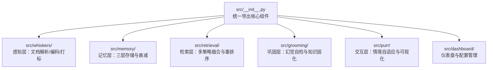
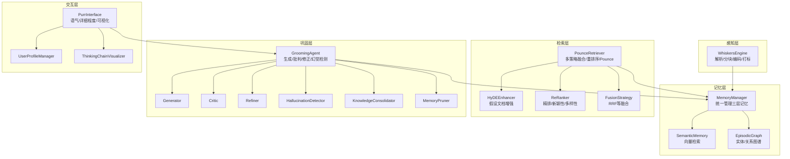
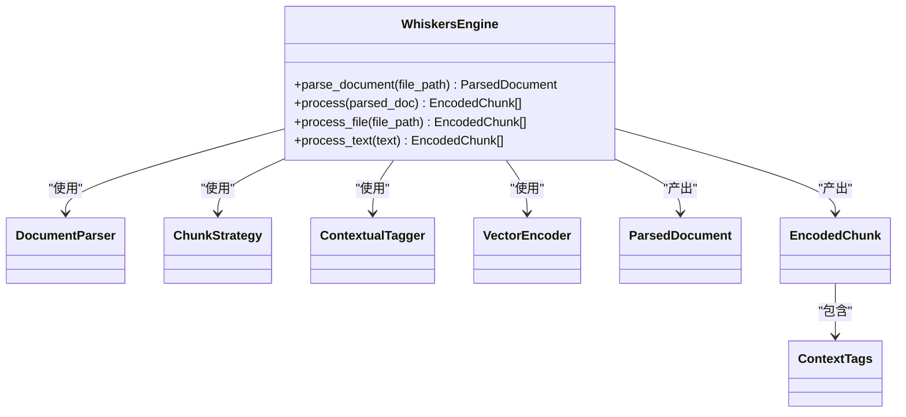
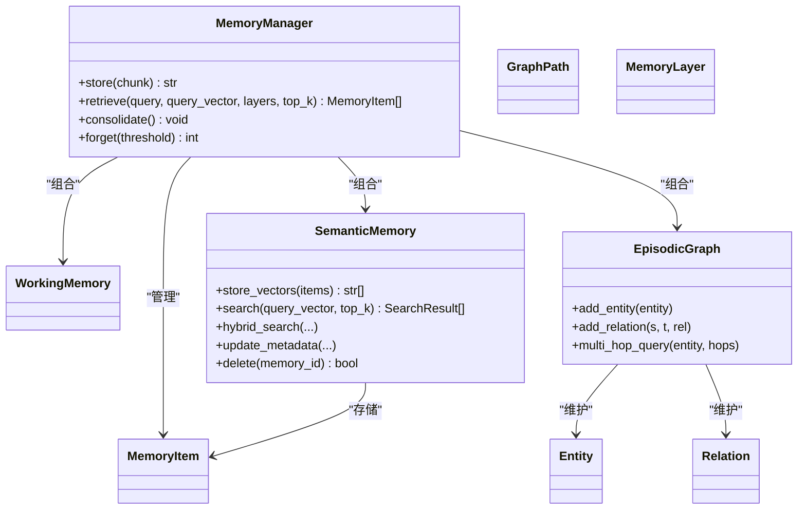
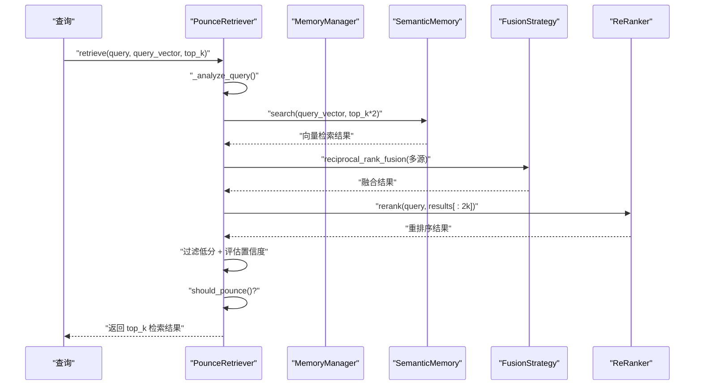
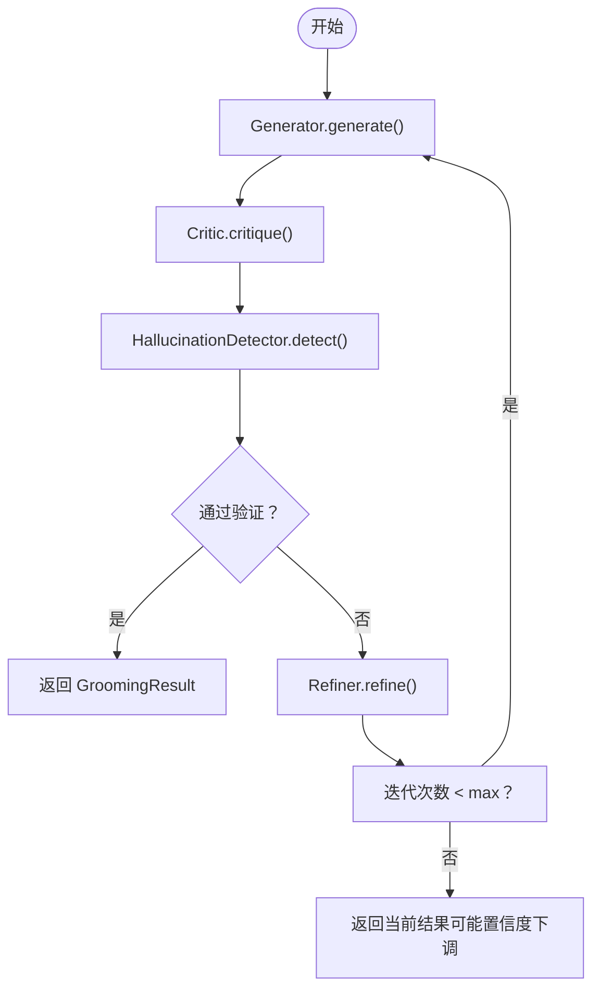
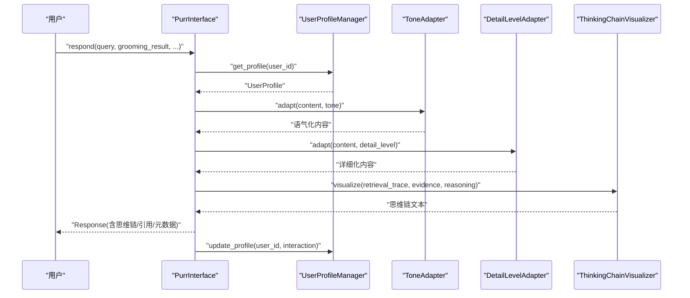
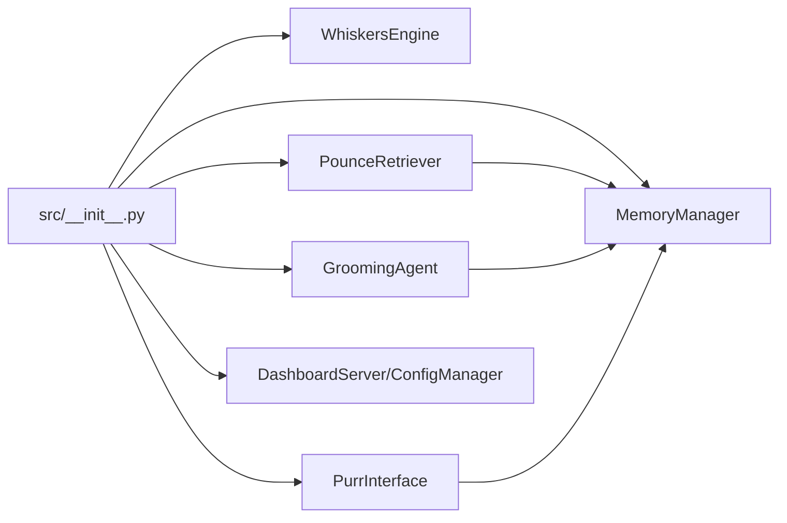

# 技术架构概览

<cite>
**本文引用的文件**
- [src/__init__.py](file://src/__init__.py)
- [docs/README.md](file://docs/README.md)
- [pyproject.toml](file://pyproject.toml)
- [src/whiskers/engine.py](file://src/whiskers/engine.py)
- [src/whiskers/models.py](file://src/whiskers/models.py)
- [src/whiskers/encoder.py](file://src/whiskers/encoder.py)
- [src/memory/manager.py](file://src/memory/manager.py)
- [src/memory/models.py](file://src/memory/models.py)
- [src/memory/semantic_memory.py](file://src/memory/semantic_memory.py)
- [src/retrieval/retriever.py](file://src/retrieval/retriever.py)
- [src/retrieval/models.py](file://src/retrieval/models.py)
- [src/retrieval/reranker.py](file://src/retrieval/reranker.py)
- [src/grooming/agent.py](file://src/grooming/agent.py)
- [src/grooming/models.py](file://src/grooming/models.py)
- [src/grooming/generator.py](file://src/grooming/generator.py)
- [src/purr/interface.py](file://src/purr/interface.py)
- [src/purr/models.py](file://src/purr/models.py)
- [src/purr/profile_manager.py](file://src/purr/profile_manager.py)
</cite>

## 目录
1. [简介](#简介)
2. [项目结构](#项目结构)
3. [核心组件](#核心组件)
4. [架构总览](#架构总览)
5. [详细组件分析](#详细组件分析)
6. [依赖分析](#依赖分析)
7. [性能考虑](#性能考虑)
8. [故障排查指南](#故障排查指南)
9. [结论](#结论)
10. [附录](#附录)

## 简介
本文件面向开发者与架构师，系统化阐述 NecoRAG 的五层架构设计：感知层（Whiskers Engine）、记忆层（Nine-Lives Memory）、检索层（Pounce Strategy）、巩固层（Grooming Agent）、交互层（Purr Interface）。文档结合神经认知科学与猫科动物直觉机制，给出数据流、组件职责与依赖关系，并提供架构图与组件交互示意，帮助读者建立整体技术视野与设计思路。

## 项目结构
NecoRAG 采用按“功能域”划分的模块化组织方式，核心模块位于 src 下，文档与工具位于 docs、tools 等目录。项目通过入口模块统一导出核心能力，便于外部使用。

**图表来源**
- [src/__init__.py:17-25](file://src/__init__.py#L17-L25)

**章节来源**
- [src/__init__.py:10-25](file://src/__init__.py#L10-L25)
- [docs/README.md:38-54](file://docs/README.md#L38-L54)

## 核心组件
- 感知层（Whiskers Engine）：负责多模态输入的解析、分块、上下文标签与向量编码，产出可检索的结构化片段。
- 记忆层（Nine-Lives Memory）：统一管理三层记忆（工作/L2语义/L3图谱），提供持久化、检索与衰减控制。
- 检索层（Pounce Strategy）：融合向量与图谱检索，采用 HyDE 增强、重排序与“扑击”智能终止策略。
- 巩固层（Grooming Agent）：以 Generator-Critic-Refiner 闭环为核心，执行幻觉检测与知识固化、修剪。
- 交互层（Purr Interface）：基于用户画像与上下文，进行语气/详细程度适配与思维链可视化。

**章节来源**
- [docs/README.md:38-54](file://docs/README.md#L38-L54)
- [src/whiskers/engine.py:14-129](file://src/whiskers/engine.py#L14-L129)
- [src/memory/manager.py:16-185](file://src/memory/manager.py#L16-L185)
- [src/retrieval/retriever.py:108-335](file://src/retrieval/retriever.py#L108-L335)
- [src/grooming/agent.py:16-150](file://src/grooming/agent.py#L16-L150)
- [src/purr/interface.py:16-223](file://src/purr/interface.py#L16-L223)

## 架构总览
下图展示五层架构的数据流与组件交互：感知层产出编码片段，进入记忆层；检索层从记忆层检索并融合重排序；巩固层对答案进行质量与可信度校验；交互层将结果情境化呈现。

**图表来源**
- [src/whiskers/engine.py:14-129](file://src/whiskers/engine.py#L14-L129)
- [src/memory/manager.py:16-185](file://src/memory/manager.py#L16-L185)
- [src/retrieval/retriever.py:108-335](file://src/retrieval/retriever.py#L108-L335)
- [src/grooming/agent.py:16-150](file://src/grooming/agent.py#L16-L150)
- [src/purr/interface.py:16-223](file://src/purr/interface.py#L16-L223)

## 详细组件分析

### 感知层（Whiskers Engine）
- 职责：文档解析、固定长度分块、上下文标签生成、稠密/稀疏向量与实体抽取。
- 关键流程：parse_document → chunk → encode → tag → 生成 EncodedChunk。
- 数据模型：ParsedDocument、Chunk、EncodedChunk、ContextTags。

**图表来源**
- [src/whiskers/engine.py:14-129](file://src/whiskers/engine.py#L14-L129)
- [src/whiskers/models.py:11-69](file://src/whiskers/models.py#L11-L69)
- [src/whiskers/encoder.py:11-98](file://src/whiskers/encoder.py#L11-L98)

**章节来源**
- [src/whiskers/engine.py:21-129](file://src/whiskers/engine.py#L21-L129)
- [src/whiskers/models.py:11-69](file://src/whiskers/models.py#L11-L69)
- [src/whiskers/encoder.py:18-98](file://src/whiskers/encoder.py#L18-L98)

### 记忆层（Nine-Lives Memory）
- 职责：统一管理 L1（工作记忆）、L2（语义记忆）、L3（情景图谱），提供存储、检索、衰减与主动遗忘。
- 关键流程：store → 写入 L2 向量库与 L3 实体/关系图 → 统一索引；retrieve → L2 向量检索并强化访问权重；consolidate/forget → 衰减与归档。
- 数据模型：MemoryItem、Entity、Relation、GraphPath、MemoryLayer。

**图表来源**
- [src/memory/manager.py:16-185](file://src/memory/manager.py#L16-L185)
- [src/memory/semantic_memory.py:21-179](file://src/memory/semantic_memory.py#L21-L179)
- [src/memory/models.py:12-67](file://src/memory/models.py#L12-L67)

**章节来源**
- [src/memory/manager.py:23-185](file://src/memory/manager.py#L23-L185)
- [src/memory/semantic_memory.py:32-179](file://src/memory/semantic_memory.py#L32-L179)
- [src/memory/models.py:12-67](file://src/memory/models.py#L12-L67)

### 检索层（Pounce Strategy）
- 职责：多源检索（向量/图谱）→ 结果融合（RRF）→ 重排序（BGE-Reranker 风格）→ Pounce 智能终止。
- 关键流程：retrieve → 分析查询 → 向量/图谱检索 → 融合 → 重排序 → 过滤低分 → Pounce 判定 → 返回 top-k。
- 数据模型：RetrievalResult、QueryAnalysis。

**图表来源**
- [src/retrieval/retriever.py:108-201](file://src/retrieval/retriever.py#L108-L201)
- [src/retrieval/reranker.py:41-70](file://src/retrieval/reranker.py#L41-L70)
- [src/retrieval/models.py:9-29](file://src/retrieval/models.py#L9-L29)

**章节来源**
- [src/retrieval/retriever.py:108-335](file://src/retrieval/retriever.py#L108-L335)
- [src/retrieval/reranker.py:10-179](file://src/retrieval/reranker.py#L10-L179)
- [src/retrieval/models.py:9-29](file://src/retrieval/models.py#L9-L29)

### 巩固层（Grooming Agent）
- 职责：生成答案 → 批判评估 → 幻觉检测 → 修正 → 知识固化/修剪 → 异步后台任务。
- 关键流程：process → 循环 Generator-Critic-Refiner → 幻觉检测 → 通过则返回，否则修正或降低置信度。
- 数据模型：GeneratedAnswer、CritiqueReport、HallucinationReport、GroomingResult。

**图表来源**
- [src/grooming/agent.py:61-128](file://src/grooming/agent.py#L61-L128)
- [src/grooming/models.py:9-66](file://src/grooming/models.py#L9-L66)
- [src/grooming/generator.py:25-63](file://src/grooming/generator.py#L25-L63)

**章节来源**
- [src/grooming/agent.py:16-150](file://src/grooming/agent.py#L16-L150)
- [src/grooming/models.py:9-66](file://src/grooming/models.py#L9-L66)
- [src/grooming/generator.py:9-64](file://src/grooming/generator.py#L9-L64)

### 交互层（Purr Interface）
- 职责：用户画像适配（语气/详细程度）、思维链可视化、情境化响应生成。
- 关键流程：respond → 获取/更新用户画像 → 语气/详细程度适配 → 生成思维链 → 返回 Response。
- 数据模型：UserProfile、Interaction、Response、RetrievalVisualization。

**图表来源**
- [src/purr/interface.py:55-132](file://src/purr/interface.py#L55-L132)
- [src/purr/profile_manager.py:41-99](file://src/purr/profile_manager.py#L41-L99)
- [src/purr/models.py:10-53](file://src/purr/models.py#L10-L53)

**章节来源**
- [src/purr/interface.py:16-223](file://src/purr/interface.py#L16-L223)
- [src/purr/profile_manager.py:10-165](file://src/purr/profile_manager.py#L10-L165)
- [src/purr/models.py:10-53](file://src/purr/models.py#L10-L53)

## 依赖分析
- 模块内聚与耦合：各层内部高内聚，层间通过明确的数据模型与接口耦合（如 EncodedChunk、MemoryItem、RetrievalResult）。
- 外部依赖：项目声明了 numpy、dateutil 等运行期依赖，技术栈文档指出向量/图/缓存等外部组件待集成。
- 导出与入口：入口模块统一导出核心类，便于上层应用按需组装。

**图表来源**
- [src/__init__.py:17-25](file://src/__init__.py#L17-L25)

**章节来源**
- [src/__init__.py:17-25](file://src/__init__.py#L17-L25)
- [pyproject.toml:27-30](file://pyproject.toml#L27-L30)
- [docs/README.md:56-68](file://docs/README.md#L56-L68)

## 性能考虑
- 检索效率：向量检索建议采用近似最近邻索引（如 HNSW）与混合检索（向量+关键词）以平衡召回与速度。
- 重排序成本：重排序阶段可引入候选集上限与并行化，减少冗余计算。
- Pounce 早停：通过置信度阈值与边际收益判断，避免无效的后续检索，显著节省计算。
- 记忆衰减：合理设置衰减参数与主动遗忘阈值，保持知识库新鲜度与检索质量。
- 向量编码：稀疏向量与实体抽取可作为轻量特征辅助检索，降低纯稠密向量的负担。

## 故障排查指南
- 检索结果为空
  - 检查查询向量是否正确生成与传递。
  - 确认 MemoryManager 是否成功写入 L2 向量库。
  - 检查最小分数阈值是否过高导致过滤过度。
- 置信度过低或过早 Pounce
  - 调整 Pounce 控制器阈值与最小边际收益。
  - 分析查询复杂度与实体识别，必要时启用 HyDE 增强。
- 幻觉检测触发
  - 降低迭代后置信度下调比例，或增加证据条目数量。
  - 检查生成器是否充分引用证据，避免无依据推断。
- 交互层输出不符合预期
  - 核对用户画像更新与偏好分析逻辑。
  - 检查语气/详细程度适配规则与可视化模板。

**章节来源**
- [src/retrieval/retriever.py:140-201](file://src/retrieval/retriever.py#L140-L201)
- [src/grooming/agent.py:84-128](file://src/grooming/agent.py#L84-L128)
- [src/purr/interface.py:76-132](file://src/purr/interface.py#L76-L132)

## 结论
NecoRAG 以“猫科直觉”驱动的检索与“大脑双系统”记忆为理论基础，构建了从感知、记忆、检索、巩固到交互的完整闭环。通过模块化与插件化设计，系统可在不同阶段接入真实组件（向量/图/缓存等），逐步实现端到端的认知型 RAG 能力。建议优先完成向量化与图谱组件的集成，再推进编排与可视化能力，最终形成可扩展、可观测、可演进的认知系统。

## 附录
- 模块化设计原则
  - 单一职责：每层聚焦特定能力，接口清晰。
  - 可替换性：以数据模型为契约，便于替换底层实现。
  - 渐进式集成：先实现最小可用，再逐步接入真实服务。
- 插件化扩展机制
  - 在检索层支持自定义融合策略与重排序器。
  - 在巩固层支持自定义生成器/批评者/修正器。
  - 在交互层支持自定义语气/详细程度适配器与可视化器。
- 系统集成能力
  - 通过入口模块统一导出，便于嵌入到 Web/Dashboard/LangGraph 等上层系统。
  - 与外部组件（向量库、图数据库、缓存）通过抽象接口对接。

**章节来源**
- [docs/README.md:94-100](file://docs/README.md#L94-L100)
- [src/__init__.py:17-25](file://src/__init__.py#L17-L25)