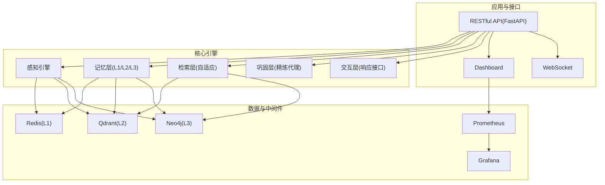
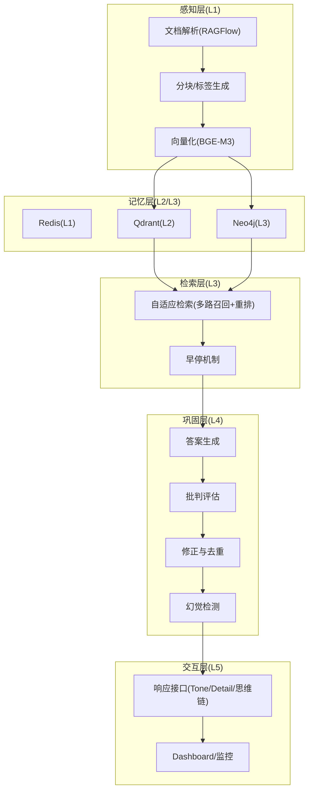
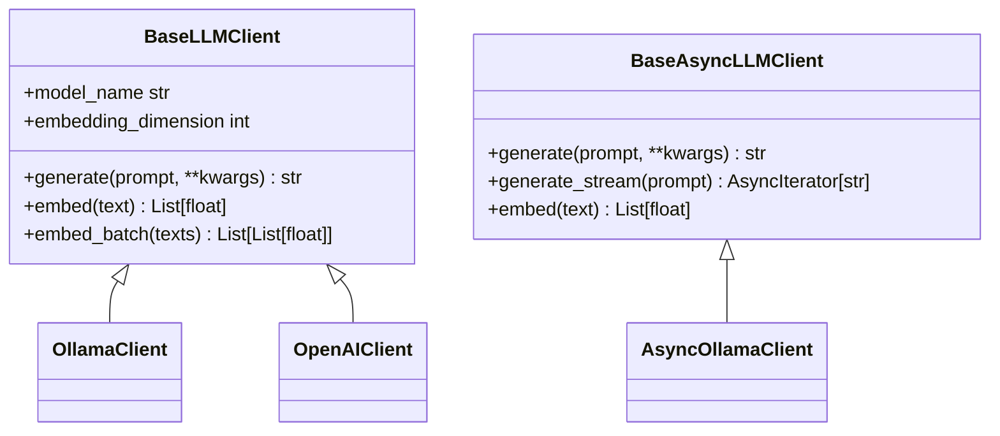
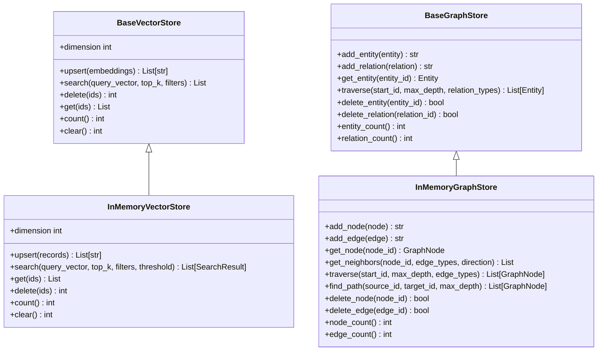
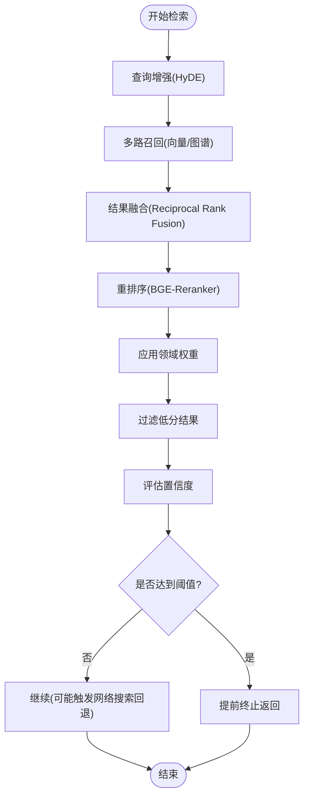
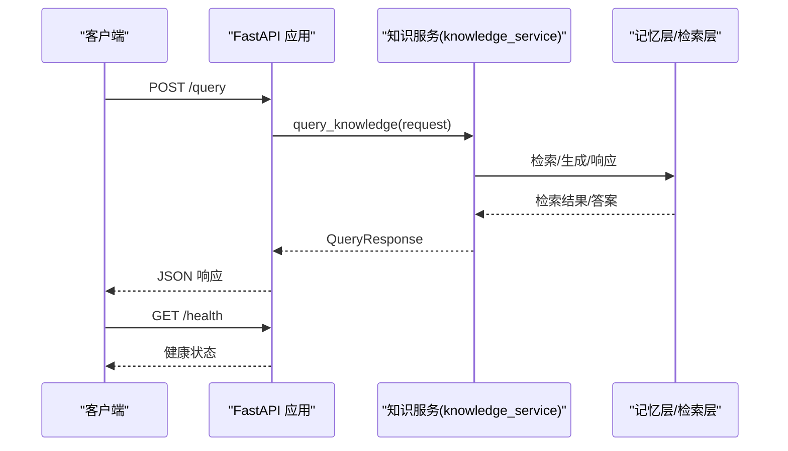
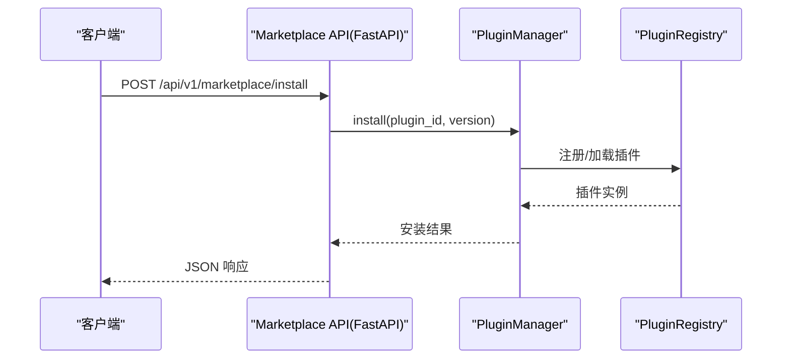

# 技术栈

<cite>
**本文引用的文件**
- [3rd/TECH_STACK.md](file://3rd/TECH_STACK.md)
- [pyproject.toml](file://pyproject.toml)
- [requirements.txt](file://requirements.txt)
- [devops/Dockerfile](file://devops/Dockerfile)
- [devops/docker-compose.yml](file://devops/docker-compose.yml)
- [interface/api.py](file://interface/api.py)
- [src/core/base.py](file://src/core/base.py)
- [src/core/config.py](file://src/core/config.py)
- [src/core/llm/base.py](file://src/core/llm/base.py)
- [src/retrieval/retriever.py](file://src/retrieval/retriever.py)
- [src/memory/backends/memory_store.py](file://src/memory/backends/memory_store.py)
- [src/marketplace/api.py](file://src/marketplace/api.py)
- [src/plugins/manager.py](file://src/plugins/manager.py)
- [README.md](file://README.md)
</cite>

## 目录
1. [简介](#简介)
2. [项目结构](#项目结构)
3. [核心组件](#核心组件)
4. [架构总览](#架构总览)
5. [详细组件分析](#详细组件分析)
6. [依赖分析](#依赖分析)
7. [性能考量](#性能考量)
8. [故障排查指南](#故障排查指南)
9. [结论](#结论)
10. [附录](#附录)

## 简介
本节概述 NecoRAG 的技术栈全景与核心创新，强调可插拔架构、五层认知架构、以及对 LLM/向量化/图谱/缓存/监控等组件的抽象与组合能力。

- 技术栈全景与核心创新参见：[3rd/TECH_STACK.md](file://3rd/TECH_STACK.md)
- 项目简介与版本信息参见：[README.md](file://README.md)

**章节来源**
- [3rd/TECH_STACK.md:23-661](file://3rd/TECH_STACK.md#L23-L661)
- [README.md:25-50](file://README.md#L25-L50)

## 项目结构
NecoRAG 采用模块化与分层架构，核心模块包括感知层、记忆层、检索层、巩固层、交互层；同时提供 Dashboard、监控、安全、插件市场等支撑模块。容器编排通过 Docker Compose 统一管理各服务。

**图表来源**
- [devops/docker-compose.yml:4-164](file://devops/docker-compose.yml#L4-L164)
- [interface/api.py:26-174](file://interface/api.py#L26-L174)
- [src/core/config.py:18-420](file://src/core/config.py#L18-L420)

**章节来源**
- [devops/docker-compose.yml:4-164](file://devops/docker-compose.yml#L4-L164)
- [README.md:52-183](file://README.md#L52-L183)

## 核心组件
本节聚焦技术栈中的关键组件及其作用、选型理由与在架构中的位置。

- LLM 推理服务：Ollama/vLLM/OpenAI 等，支持本地与云端，具备 Mock 方案便于快速启动。
- 向量化与重排序：BGE-M3、BGE-Reranker，兼顾多语言与精度。
- 意图识别：Rasa NLU（结合 Jieba），支持中文分词与实体抽取。
- OCR：PaddleOCR，支持多语言文本检测与识别。
- 文档解析：RAGFlow，支持 PDF/Word/Excel/PPT 等，表格与公式识别。
- 存储层：Redis（L1 工作记忆）、Qdrant（L2 语义向量）、Neo4j（L3 情景图谱）。
- 任务调度：APScheduler（轻量定时）、Celery（分布式队列）。
- 监控：Prometheus（指标采集）、Grafana（可视化）。
- 应用层：FastAPI（RESTful API）、Streamlit（可选可视化界面）。
- 编排：LangGraph（工作流/编排引擎）。

以上信息来源于技术栈文档与配置管理模块的枚举与默认值。

**章节来源**
- [3rd/TECH_STACK.md:132-494](file://3rd/TECH_STACK.md#L132-L494)
- [src/core/config.py:18-42](file://src/core/config.py#L18-L42)
- [src/core/config.py:28-41](file://src/core/config.py#L28-L41)

## 架构总览
NecoRAG 采用“五层认知”架构，从感知到交互形成闭环，并通过抽象基类实现即插即用的可替换性。容器编排统一管理 LLM、向量库、图数据库、缓存与监控服务。

**图表来源**
- [3rd/TECH_STACK.md:68-130](file://3rd/TECH_STACK.md#L68-L130)
- [src/retrieval/retriever.py:135-309](file://src/retrieval/retriever.py#L135-L309)
- [src/core/config.py:158-193](file://src/core/config.py#L158-L193)

**章节来源**
- [3rd/TECH_STACK.md:68-130](file://3rd/TECH_STACK.md#L68-L130)
- [src/retrieval/retriever.py:135-309](file://src/retrieval/retriever.py#L135-L309)

## 详细组件分析

### LLM 推理服务与客户端抽象
- 抽象基类：定义同步/异步 LLM 客户端接口，提供默认实现（如批量向量化、流式生成、token 估算等）。
- 配置：支持多种提供商（Mock/OpenAI/Ollama/vLLM/Azure/Anthropic），通过枚举与环境变量驱动。
- 选型理由：统一接口便于替换；Mock 保障零依赖启动；Ollama/vLLM 适合本地高性能推理；OpenAI/Azure 适合高质量需求。

**图表来源**
- [src/core/llm/base.py:16-78](file://src/core/llm/base.py#L16-L78)
- [src/core/base.py:542-633](file://src/core/base.py#L542-L633)
- [src/core/config.py:18-26](file://src/core/config.py#L18-L26)

**章节来源**
- [src/core/llm/base.py:16-122](file://src/core/llm/base.py#L16-L122)
- [src/core/base.py:542-633](file://src/core/base.py#L542-L633)
- [src/core/config.py:18-26](file://src/core/config.py#L18-L26)

### 向量与图存储抽象与内存实现
- 抽象基类：定义向量存储与图存储接口，支持 upsert/search/delete/count/clear 等通用能力。
- 内存实现：InMemoryVectorStore/InMemoryGraphStore，用于开发测试与小规模场景，具备维度校验、过滤、相似度计算、遍历与路径查找等能力。

**图表来源**
- [src/core/base.py:221-394](file://src/core/base.py#L221-L394)
- [src/memory/backends/memory_store.py:20-381](file://src/memory/backends/memory_store.py#L20-L381)

**章节来源**
- [src/core/base.py:221-394](file://src/core/base.py#L221-L394)
- [src/memory/backends/memory_store.py:20-381](file://src/memory/backends/memory_store.py#L20-L381)

### 自适应检索器与早停机制
- 多路召回：向量检索 + 图谱检索 + 关键词增强（HyDE）。
- 重排序：Cross-Encoder BGE-Reranker。
- 早停：基于置信度阈值与边际收益递减策略，避免冗余计算。
- 领域权重：结合关键字、时间衰减与领域相关性动态加权。

**图表来源**
- [src/retrieval/retriever.py:135-309](file://src/retrieval/retriever.py#L135-L309)
- [src/retrieval/retriever.py:43-115](file://src/retrieval/retriever.py#L43-L115)

**章节来源**
- [src/retrieval/retriever.py:135-309](file://src/retrieval/retriever.py#L135-L309)
- [src/retrieval/retriever.py:43-115](file://src/retrieval/retriever.py#L43-L115)

### RESTful API 与 WebSocket 接口
- FastAPI 提供标准化 REST 接口（查询、插入、更新、删除、统计、健康检查、建议等）。
- WebSocket 支持实时通信与调试面板推送。
- 可选挂载插件市场路由，实现插件生态的 API 能力。

**图表来源**
- [interface/api.py:26-174](file://interface/api.py#L26-L174)

**章节来源**
- [interface/api.py:26-174](file://interface/api.py#L26-L174)

### 插件系统与插件市场 API
- 插件管理器：负责插件生命周期、依赖解析、事件处理与市场集成。
- 插件市场 API：提供搜索、安装/卸载/升级、评分、仓库管理、灰度发布、安全报告等端点。
- 市场集成：支持从市场安装/卸载/升级插件，并与插件管理器协同。

**图表来源**
- [src/marketplace/api.py:167-410](file://src/marketplace/api.py#L167-L410)
- [src/plugins/manager.py:26-88](file://src/plugins/manager.py#L26-L88)

**章节来源**
- [src/marketplace/api.py:167-410](file://src/marketplace/api.py#L167-L410)
- [src/plugins/manager.py:26-88](file://src/plugins/manager.py#L26-L88)

## 依赖分析
- Python 版本要求：>= 3.9（项目声明与包元数据一致）。
- 核心依赖：numpy、packaging、python-dateutil、aiohttp、requests、python-dotenv、pydantic。
- 可选依赖（按功能分组）：
  - Dashboard/Web：fastapi、uvicorn、websockets。
  - 意图分析：jieba（基础）、transformers + torch（ML）、fasttext（FastText）。
  - 任务调度：apscheduler（轻量）、celery + redis（分布式）。
  - 监控：prometheus-client。
  - 安全：PyJWT、python-jose、passlib（可选）。
  - 可视化：plotly、matplotlib。
  - 自适应优化：scikit-learn（可选）。
- 开发依赖：pytest、pytest-asyncio、black、flake8、mypy。

安装方式与注意事项：
- 使用 uv/venv/conda 创建虚拟环境，再安装 requirements.txt。
- 可通过可选分组安装特定模块（如 intent、scheduler、dashboard 等）。
- Docker 部署一键启动所有服务，包含 LLM、向量库、图数据库、缓存与监控。

**章节来源**
- [pyproject.toml:10-101](file://pyproject.toml#L10-L101)
- [requirements.txt:12-161](file://requirements.txt#L12-L161)
- [README.md:187-280](file://README.md#L187-L280)
- [devops/Dockerfile:2-39](file://devops/Dockerfile#L2-L39)
- [devops/docker-compose.yml:4-164](file://devops/docker-compose.yml#L4-L164)

## 性能考量
- 端到端延迟与并发：开发/生产/企业环境分级目标明确，整体系统具备可扩展性。
- 组件延迟分布：LLM 推理、向量检索、图谱查询、意图识别等均有基准数据。
- 存储层性能：Redis（毫秒级读写）、Qdrant（百万级向量检索 < 10ms）、Neo4j（2-3 跳查询 < 100ms）。
- 早停与重排：显著降低无效计算，提升吞吐与响应速度。
- 可观测性：Prometheus + Grafana 提供 20+ 指标监控，便于容量与性能优化。

**章节来源**
- [3rd/TECH_STACK.md:570-590](file://3rd/TECH_STACK.md#L570-L590)
- [3rd/TECH_STACK.md:286-372](file://3rd/TECH_STACK.md#L286-L372)

## 故障排查指南
- 健康检查：API 提供 /health 接口，返回组件健康状态与运行时统计。
- 错误处理：接口层捕获异常并返回 HTTP 500，日志记录错误堆栈。
- 监控告警：Prometheus 指标 + Grafana 可视化，结合容器健康检查定位问题。
- 插件市场：检查 Marketplace API 的安装/卸载/升级返回状态，必要时查看日志。

**章节来源**
- [interface/api.py:56-78](file://interface/api.py#L56-L78)
- [interface/api.py:80-143](file://interface/api.py#L80-L143)
- [src/marketplace/api.py:303-350](file://src/marketplace/api.py#L303-L350)

## 结论
NecoRAG 通过抽象基类与配置驱动实现“即插即用”的可替换架构，结合 LLM/向量化/图谱/缓存/监控等组件，形成从感知到交互的完整认知闭环。技术选型兼顾性能、可扩展性与维护性，并提供零依赖启动与生产就绪的监控体系，适合从开发测试到企业级部署的多场景应用。

[本节不直接分析具体文件，故无“章节来源”]

## 附录
- 技术栈全景与选型决策树、四套推荐配置、性能基准汇总详见技术栈文档。
- 容器编排与服务依赖关系参见 docker-compose 与 Dockerfile。

**章节来源**
- [3rd/TECH_STACK.md:496-661](file://3rd/TECH_STACK.md#L496-L661)
- [devops/docker-compose.yml:4-164](file://devops/docker-compose.yml#L4-L164)
- [devops/Dockerfile:2-39](file://devops/Dockerfile#L2-L39)