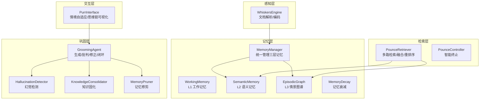
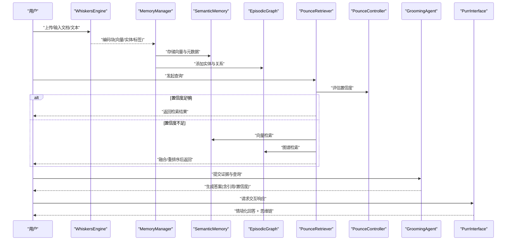
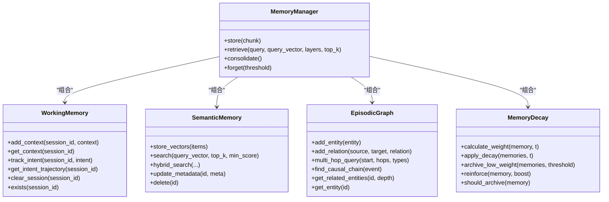
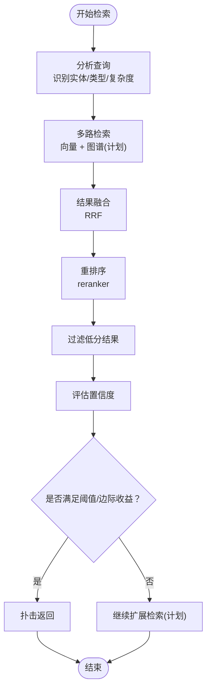
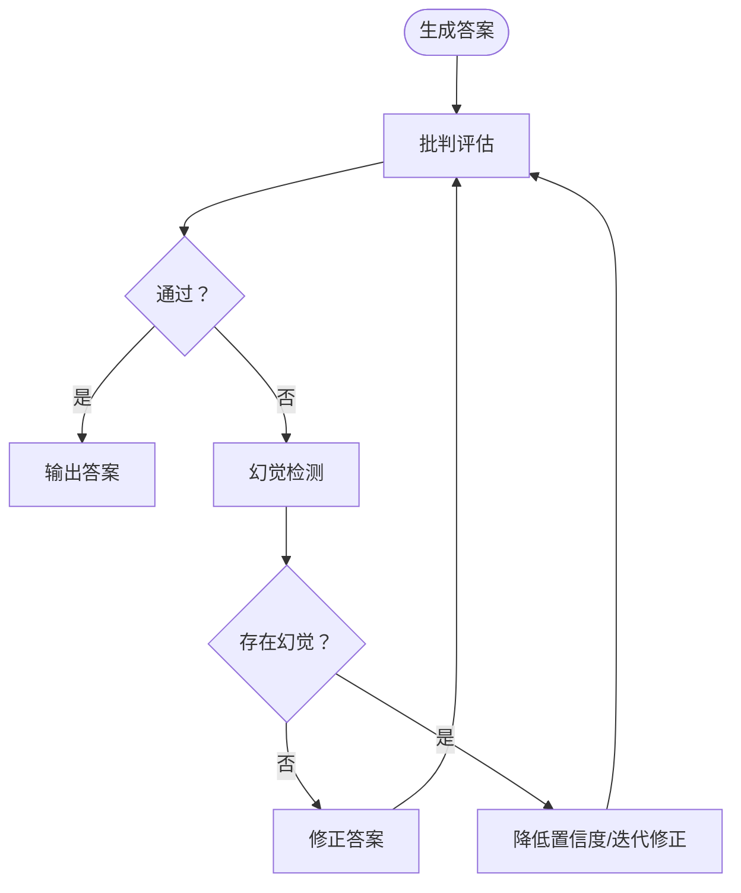
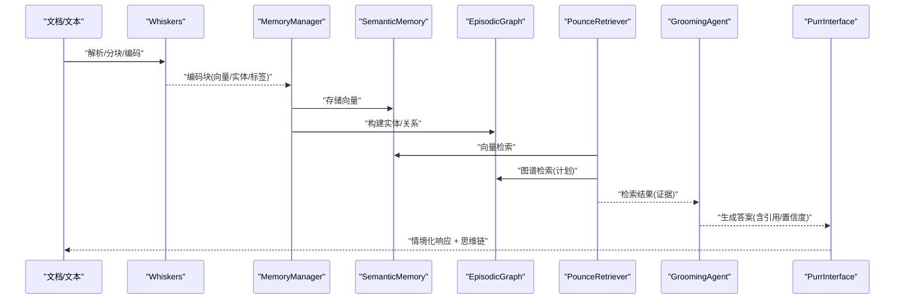
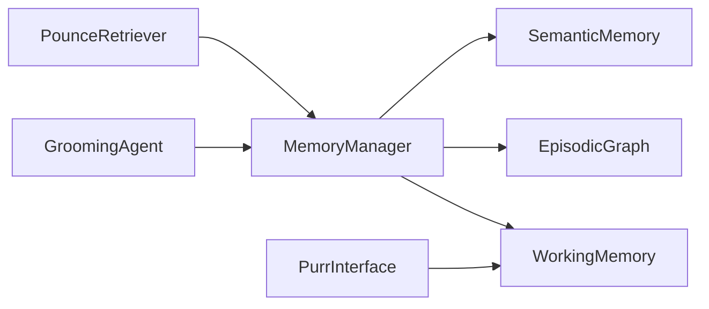

# 核心概念解释

<cite>
**本文引用的文件**   
- [src/memory/manager.py](file://src/memory/manager.py)
- [src/memory/working_memory.py](file://src/memory/working_memory.py)
- [src/memory/semantic_memory.py](file://src/memory/semantic_memory.py)
- [src/memory/episodic_graph.py](file://src/memory/episodic_graph.py)
- [src/memory/decay.py](file://src/memory/decay.py)
- [src/memory/models.py](file://src/memory/models.py)
- [src/retrieval/retriever.py](file://src/retrieval/retriever.py)
- [src/retrieval/models.py](file://src/retrieval/models.py)
- [src/grooming/agent.py](file://src/grooming/agent.py)
- [src/grooming/hallucination.py](file://src/grooming/hallucination.py)
- [src/grooming/consolidator.py](file://src/grooming/consolidator.py)
- [src/grooming/pruner.py](file://src/grooming/pruner.py)
- [src/grooming/models.py](file://src/grooming/models.py)
- [src/purr/interface.py](file://src/purr/interface.py)
- [src/whiskers/engine.py](file://src/whiskers/engine.py)
- [example/example_usage.py](file://example/example_usage.py)
- [docs/README.md](file://docs/README.md)
</cite>

## 目录
1. [简介](#简介)
2. [项目结构](#项目结构)
3. [核心组件](#核心组件)
4. [架构总览](#架构总览)
5. [详细组件分析](#详细组件分析)
6. [依赖分析](#依赖分析)
7. [性能考量](#性能考量)
8. [故障排查指南](#故障排查指南)
9. [结论](#结论)
10. [附录](#附录)

## 简介
本章节面向初学者与进阶读者，系统讲解 NecoRAG 的核心思想与关键技术：以“三层记忆架构”为核心的记忆系统（L1 工作记忆、L2 语义记忆、L3 情景图谱），以“Pounce 智能决策机制”为代表的检索加速策略，以及围绕“幻觉检测、知识固化、记忆修剪”的闭环质量保障体系。通过可视化流程图与实例路径，帮助读者建立对 NecoRAG 的整体认知，并为后续深入学习打下基础。

## 项目结构
NecoRAG 采用五层架构设计，从感知到交互层层递进：
- Layer 1：Whiskers Engine（感知层）负责文档解析、分块、情境标签与向量编码
- Layer 2：Nine-Lives Memory（记忆层）统一管理 L1/L2/L3 三层记忆
- Layer 3：Pounce Strategy（检索层）提供多路检索、融合、重排序与智能终止
- Layer 4：Grooming Agent（巩固层）实现答案生成、批判、修正与质量闭环
- Layer 5：Purr Interface（交互层）进行情境自适应与思维链可视化

**图示来源**
- [docs/README.md:40-54](file://docs/README.md#L40-L54)
- [src/whiskers/engine.py:14-41](file://src/whiskers/engine.py#L14-L41)
- [src/memory/manager.py:16-46](file://src/memory/manager.py#L16-L46)
- [src/retrieval/retriever.py:108-136](file://src/retrieval/retriever.py#L108-L136)
- [src/grooming/agent.py:16-60](file://src/grooming/agent.py#L16-L60)
- [src/purr/interface.py:16-54](file://src/purr/interface.py#L16-L54)

**章节来源**
- [docs/README.md:39-54](file://docs/README.md#L39-L54)

## 核心组件
本节聚焦三大核心：三层记忆架构、Pounce 智能决策与情境自适应交互。

- 三层记忆架构
  - L1 工作记忆：短期上下文与意图轨迹，支持会话级 TTL 与清理
  - L2 语义记忆：高维向量检索，支持混合检索与模糊匹配
  - L3 情景图谱：实体关系网络，支持多跳推理与因果链条追踪
- Pounce 智能决策机制
  - 基于置信度阈值与边际收益的“锁定-跳跃”策略，避免冗余计算
  - 结合 HyDE 增强、多路检索、结果融合与重排序
- 情境自适应交互
  - 基于用户画像的语气与详细程度适配
  - 思维链可视化，提升可解释性与信任度

**章节来源**
- [src/memory/working_memory.py:11-35](file://src/memory/working_memory.py#L11-L35)
- [src/memory/semantic_memory.py:21-49](file://src/memory/semantic_memory.py#L21-L49)
- [src/memory/episodic_graph.py:10-29](file://src/memory/episodic_graph.py#L10-L29)
- [src/retrieval/retriever.py:16-40](file://src/retrieval/retriever.py#L16-L40)
- [src/purr/interface.py:16-54](file://src/purr/interface.py#L16-L54)

## 架构总览
下图展示端到端工作流：Whiskers 将文档编码为多模态嵌入与实体三元组；MemoryManager 将其写入 L2 语义记忆并同步构建 L3 图谱；检索阶段由 PounceRetriever 多路融合检索并以 PounceController 智能终止；GroomingAgent 在生成-批判-修正闭环中进行幻觉检测与知识固化；最终由 PurrInterface 输出情境化响应并可视化思维链。

**图示来源**
- [src/whiskers/engine.py:54-90](file://src/whiskers/engine.py#L54-L90)
- [src/memory/manager.py:48-112](file://src/memory/manager.py#L48-L112)
- [src/retrieval/retriever.py:140-201](file://src/retrieval/retriever.py#L140-L201)
- [src/grooming/agent.py:61-128](file://src/grooming/agent.py#L61-L128)
- [src/purr/interface.py:55-132](file://src/purr/interface.py#L55-L132)

## 详细组件分析

### 三层记忆架构
- L1 工作记忆（短期）
  - 职责：保存当前会话上下文、用户意图轨迹
  - 特性：TTL 过期、LRU 淘汰、瞬时遗忘模拟
- L2 语义记忆（长期）
  - 职责：高维向量存储与模糊检索
  - 特性：混合检索（向量+关键词）、HNSW 索引（计划）、权重更新
- L3 情景图谱（关系）
  - 职责：实体关系建模与多跳推理
  - 特性：因果链条追踪、结构化记忆、路径聚合

**图示来源**
- [src/memory/manager.py:16-46](file://src/memory/manager.py#L16-L46)
- [src/memory/working_memory.py:11-35](file://src/memory/working_memory.py#L11-L35)
- [src/memory/semantic_memory.py:21-49](file://src/memory/semantic_memory.py#L21-L49)
- [src/memory/episodic_graph.py:10-29](file://src/memory/episodic_graph.py#L10-L29)
- [src/memory/decay.py:11-38](file://src/memory/decay.py#L11-L38)

**章节来源**
- [src/memory/working_memory.py:11-120](file://src/memory/working_memory.py#L11-L120)
- [src/memory/semantic_memory.py:21-179](file://src/memory/semantic_memory.py#L21-L179)
- [src/memory/episodic_graph.py:10-194](file://src/memory/episodic_graph.py#L10-L194)
- [src/memory/decay.py:11-155](file://src/memory/decay.py#L11-L155)
- [src/memory/models.py:12-67](file://src/memory/models.py#L12-L67)

### Pounce 智能决策机制与情境自适应交互
- Pounce 检索器
  - 多路检索：向量检索 + 图谱检索（计划）
  - 结果融合：RRF（Reciprocal Rank Fusion）
  - 重排序：基于 BGE-Reranker-v2 的重排序
  - 智能终止：PounceController 基于置信度阈值与边际收益提前返回
- 情境自适应交互
  - 用户画像：基于会话意图与交互历史
  - 语气适配：根据用户偏好选择友好/专业/简洁等风格
  - 详细程度：依据查询复杂度与用户专业水平动态调整
  - 思维链可视化：将检索路径、证据来源与推理过程以文本形式呈现

**图示来源**
- [src/retrieval/retriever.py:140-201](file://src/retrieval/retriever.py#L140-L201)
- [src/retrieval/retriever.py:16-88](file://src/retrieval/retriever.py#L16-L88)
- [src/retrieval/models.py:9-29](file://src/retrieval/models.py#L9-L29)

**章节来源**
- [src/retrieval/retriever.py:108-336](file://src/retrieval/retriever.py#L108-L336)
- [src/retrieval/models.py:9-29](file://src/retrieval/models.py#L9-L29)
- [src/purr/interface.py:16-224](file://src/purr/interface.py#L16-L224)

### 幻觉检测、知识固化与记忆修剪
- 幻觉检测
  - 事实一致性：基于答案与证据的关键词重叠
  - 逻辑连贯性：基于连接词与长度启发式
  - 证据支撑度：基于证据数量的启发式
- 知识固化
  - 分析高频未命中查询，识别知识缺口
  - 合并碎片化知识，更新图谱连接
- 记忆修剪
  - 识别噪声数据、低质量知识与过时信息
  - 移除无效记忆，强化重要连接

**图示来源**
- [src/grooming/agent.py:61-128](file://src/grooming/agent.py#L61-L128)
- [src/grooming/hallucination.py:34-75](file://src/grooming/hallucination.py#L34-L75)
- [src/grooming/critic.py:25-71](file://src/grooming/critic.py#L25-L71)
- [src/grooming/refiner.py:24-63](file://src/grooming/refiner.py#L24-L63)
- [src/grooming/consolidator.py:35-61](file://src/grooming/consolidator.py#L35-L61)
- [src/grooming/pruner.py:41-69](file://src/grooming/pruner.py#L41-L69)

**章节来源**
- [src/grooming/hallucination.py:9-154](file://src/grooming/hallucination.py#L9-L154)
- [src/grooming/consolidator.py:9-142](file://src/grooming/consolidator.py#L9-L142)
- [src/grooming/pruner.py:10-157](file://src/grooming/pruner.py#L10-L157)
- [src/grooming/agent.py:16-151](file://src/grooming/agent.py#L16-L151)
- [src/grooming/models.py:9-66](file://src/grooming/models.py#L9-L66)

### RAG 基本原理与工作流程
- 基本原理
  - 检索增强生成（RAG）将检索与生成结合：先检索相关证据，再基于证据生成答案，从而降低幻觉、提升事实性与可解释性
- 工作流程
  - 感知层：Whiskers 将文档切分为编码块，提取稠密/稀疏向量与实体三元组
  - 记忆层：MemoryManager 将编码块写入 L2 语义记忆与 L3 情景图谱
  - 检索层：PounceRetriever 多路检索、融合与重排序，并以 PounceController 智能终止
  - 巩固层：GroomingAgent 在生成-批判-修正闭环中进行幻觉检测与知识固化
  - 交互层：PurrInterface 输出情境化响应并可视化思维链

**图示来源**
- [src/whiskers/engine.py:54-90](file://src/whiskers/engine.py#L54-L90)
- [src/memory/manager.py:48-112](file://src/memory/manager.py#L48-L112)
- [src/retrieval/retriever.py:140-201](file://src/retrieval/retriever.py#L140-L201)
- [src/grooming/agent.py:61-128](file://src/grooming/agent.py#L61-L128)
- [src/purr/interface.py:55-132](file://src/purr/interface.py#L55-L132)

**章节来源**
- [src/whiskers/engine.py:14-130](file://src/whiskers/engine.py#L14-L130)
- [src/memory/manager.py:16-186](file://src/memory/manager.py#L16-L186)
- [src/retrieval/retriever.py:108-336](file://src/retrieval/retriever.py#L108-L336)
- [src/grooming/agent.py:16-151](file://src/grooming/agent.py#L16-L151)
- [src/purr/interface.py:16-224](file://src/purr/interface.py#L16-L224)

## 依赖分析
- 组件耦合
  - MemoryManager 统一编排 L1/L2/L3，是检索与巩固的枢纽
  - PounceRetriever 依赖 MemoryManager 的语义与图谱能力
  - GroomingAgent 依赖 MemoryManager 的检索结果与记忆能力
  - PurrInterface 依赖 WorkingMemory 的用户画像与记忆能力
- 外部依赖
  - 向量数据库（Qdrant/Milvus）、图数据库（Neo4j/NebulaGraph）、缓存（Redis）为未来集成预留
  - LLM 模型与 reranker 为可替换模块

**图示来源**
- [src/memory/manager.py:16-46](file://src/memory/manager.py#L16-L46)
- [src/retrieval/retriever.py:108-136](file://src/retrieval/retriever.py#L108-L136)
- [src/grooming/agent.py:16-60](file://src/grooming/agent.py#L16-L60)
- [src/purr/interface.py:16-54](file://src/purr/interface.py#L16-L54)

**章节来源**
- [src/memory/manager.py:16-46](file://src/memory/manager.py#L16-L46)
- [src/retrieval/retriever.py:108-136](file://src/retrieval/retriever.py#L108-L136)
- [src/grooming/agent.py:16-60](file://src/grooming/agent.py#L16-L60)
- [src/purr/interface.py:16-54](file://src/purr/interface.py#L16-L54)

## 性能考量
- 检索效率
  - 使用向量检索与结果融合减少无关候选，PounceController 在高置信度时提前终止，显著节省计算
- 存储与索引
  - L2 语义记忆采用高维向量存储，建议未来接入 HNSW 索引与分布式向量库
  - L3 图谱建议接入图数据库以支持大规模多跳查询
- 记忆维护
  - MemoryDecay 与主动遗忘（forget）控制知识规模，避免“信息过载”
  - MemoryPruner 通过噪声识别与连接强化维持知识质量

[本节为通用指导，不直接分析具体文件]

## 故障排查指南
- 检索结果为空或质量差
  - 检查查询向量化是否正确生成
  - 确认 SemanticMemory 中是否存在向量与元数据
  - 观察 PounceController 的置信度评估与阈值设置
- 幻觉风险高
  - 检查 HallucinationDetector 的事实一致性与证据支撑度
  - 通过 GroomingAgent 的批判与修正流程迭代
- 记忆膨胀或过时
  - 使用 MemoryManager.consolidate()/forget() 主动归档低权重记忆
  - 通过 MemoryPruner 识别并移除噪声/低质量/过时内容

**章节来源**
- [src/retrieval/retriever.py:140-201](file://src/retrieval/retriever.py#L140-L201)
- [src/grooming/hallucination.py:34-75](file://src/grooming/hallucination.py#L34-L75)
- [src/grooming/agent.py:61-128](file://src/grooming/agent.py#L61-L128)
- [src/memory/manager.py:149-186](file://src/memory/manager.py#L149-L186)
- [src/grooming/pruner.py:41-69](file://src/grooming/pruner.py#L41-L69)

## 结论
NecoRAG 以“三层记忆 + 智能检索 + 质量闭环 + 情境交互”为核心，形成从感知到生成再到可视化的完整链路。通过 Pounce 机制与记忆衰减/修剪策略，系统在保证检索效率的同时维持知识质量；通过幻觉检测与生成-批判-修正闭环，有效降低事实性错误。该设计既便于教学理解，也为工程化落地提供了清晰的扩展路径。

[本节为总结性内容，不直接分析具体文件]

## 附录
- 实例参考路径
  - 完整工作流示例：[example/example_usage.py:218-252](file://example/example_usage.py#L218-L252)
  - 感知层示例：[example/example_usage.py:12-47](file://example/example_usage.py#L12-L47)
  - 记忆层示例：[example/example_usage.py:50-91](file://example/example_usage.py#L50-L91)
  - 检索层示例：[example/example_usage.py:94-136](file://example/example_usage.py#L94-L136)
  - 巩固层示例：[example/example_usage.py:139-173](file://example/example_usage.py#L139-L173)
  - 交互层示例：[example/example_usage.py:176-215](file://example/example_usage.py#L176-L215)

**章节来源**
- [example/example_usage.py:12-252](file://example/example_usage.py#L12-L252)