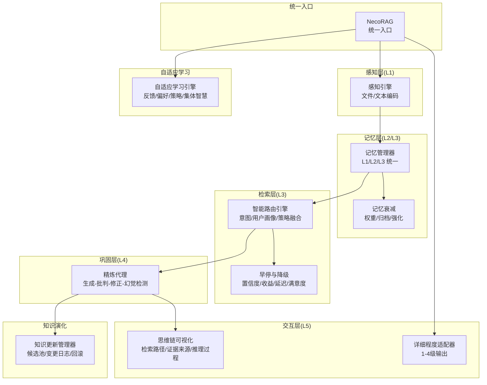
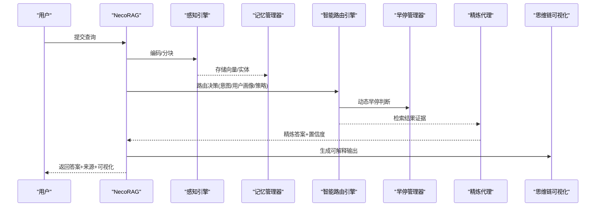
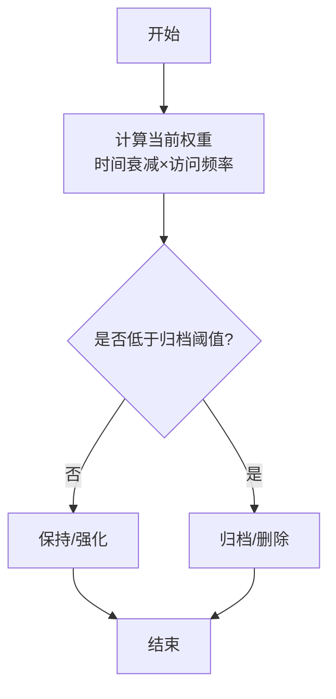
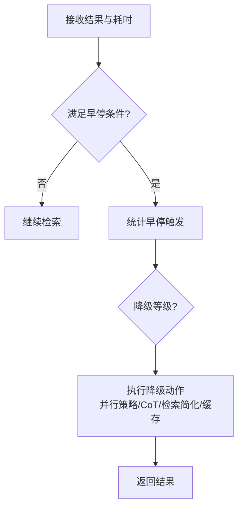
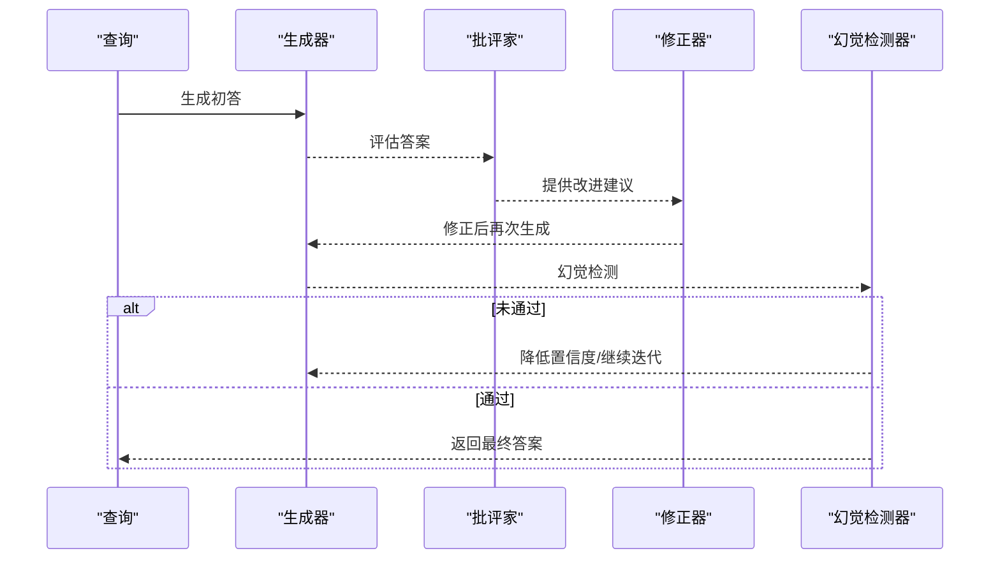
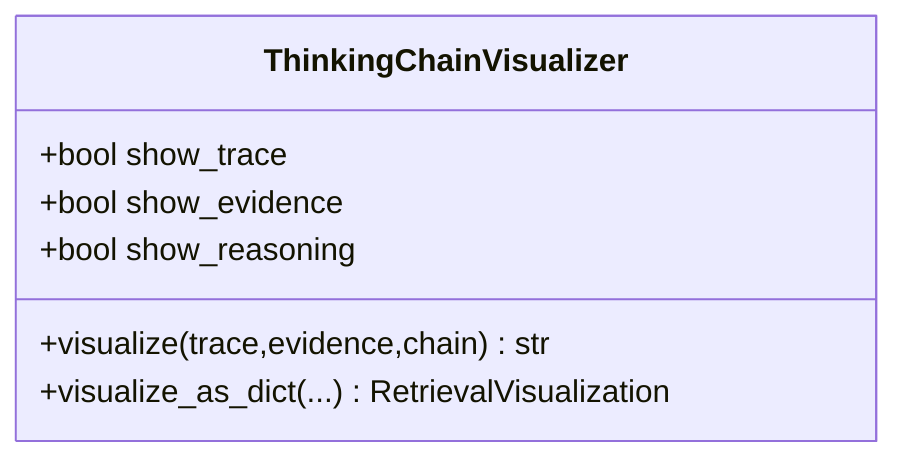
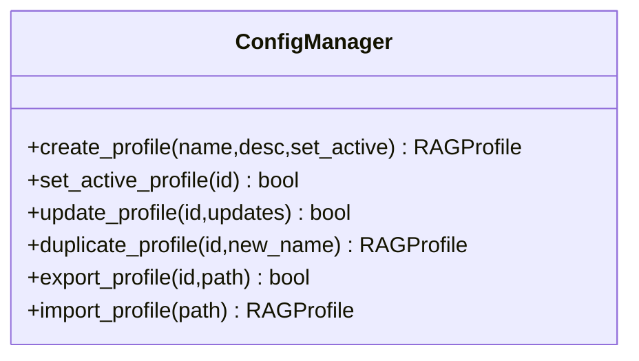
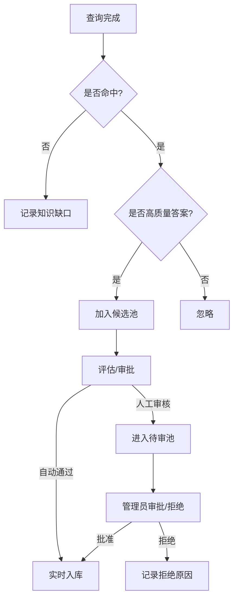
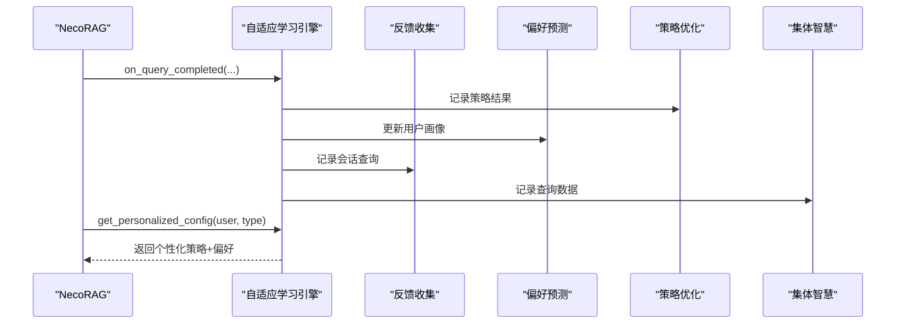
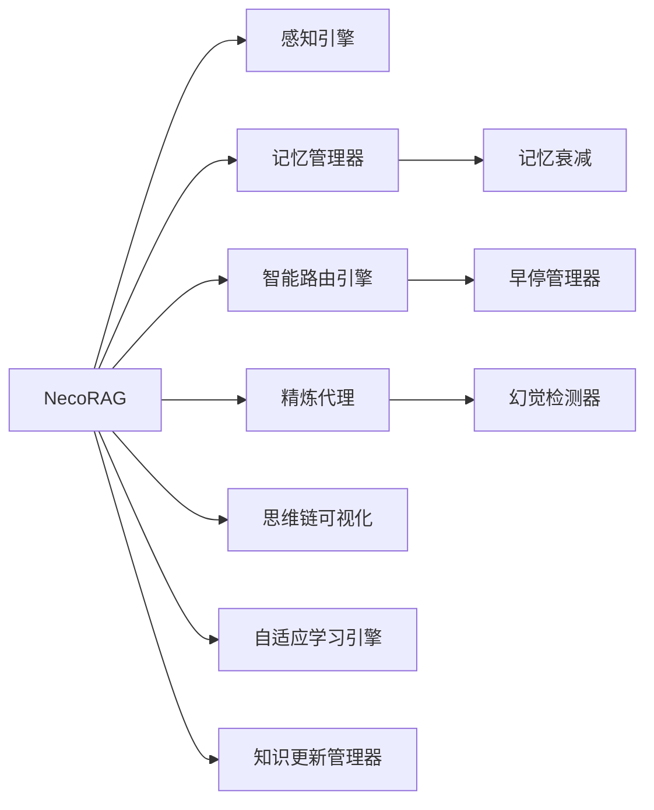

# 核心特性

<cite>
**本文引用的文件**
- [src/necorag.py](file://src/necorag.py)
- [src/memory/manager.py](file://src/memory/manager.py)
- [src/memory/decay.py](file://src/memory/decay.py)
- [src/retrieval/smart_routing/engine.py](file://src/retrieval/smart_routing/engine.py)
- [src/retrieval/smart_routing/early_stopping.py](file://src/retrieval/smart_routing/early_stopping.py)
- [src/refinement/hallucination.py](file://src/refinement/hallucination.py)
- [src/refinement/agent.py](file://src/refinement/agent.py)
- [src/response/visualizer.py](file://src/response/visualizer.py)
- [src/response/detail_adapter.py](file://src/response/detail_adapter.py)
- [src/knowledge_evolution/updater.py](file://src/knowledge_evolution/updater.py)
- [src/adaptive/engine.py](file://src/adaptive/engine.py)
- [src/dashboard/config_manager.py](file://src/dashboard/config_manager.py)
- [src/core/config.py](file://src/core/config.py)
- [src/dashboard/dashboard.py](file://src/dashboard/dashboard.py)
</cite>

## 目录
1. [引言](#引言)
2. [项目结构](#项目结构)
3. [核心组件](#核心组件)
4. [架构总览](#架构总览)
5. [详细组件分析](#详细组件分析)
6. [依赖分析](#依赖分析)
7. [性能考量](#性能考量)
8. [故障排查指南](#故障排查指南)
9. [结论](#结论)
10. [附录](#附录)

## 引言
本文件聚焦 NecoRAG 的核心特性，系统阐述其类脑记忆结构、智能早停机制、自我反思能力、可解释性输出、配置管理系统与可视化调试面板等创新点，并通过代码级图示与路径指引，帮助开发者深入理解技术实现、应用场景与价值贡献。同时，我们将对比传统 RAG 框架，突出 NecoRAG 在“越用越智能”“可解释”“可持续演进”方面的差异化优势。

## 项目结构
NecoRAG 采用分层架构：感知层（Perception）、记忆层（Memory）、检索层（Retrieval）、巩固层（Refinement）、交互层（Response）与意图分析（Intent）。顶层提供统一入口 NecoRAG 类，协调各子系统；知识演化与自适应学习贯穿全链路；仪表板提供可视化调试与配置管理。

**图表来源**
- [src/necorag.py:51-148](file://src/necorag.py#L51-L148)
- [src/memory/manager.py:20-123](file://src/memory/manager.py#L20-L123)
- [src/memory/decay.py:11-155](file://src/memory/decay.py#L11-L155)
- [src/retrieval/smart_routing/engine.py:34-129](file://src/retrieval/smart_routing/engine.py#L34-L129)
- [src/retrieval/smart_routing/early_stopping.py:39-183](file://src/retrieval/smart_routing/early_stopping.py#L39-L183)
- [src/refinement/agent.py:20-164](file://src/refinement/agent.py#L20-L164)
- [src/response/visualizer.py:9-150](file://src/response/visualizer.py#L9-L150)
- [src/response/detail_adapter.py:18-417](file://src/response/detail_adapter.py#L18-L417)
- [src/knowledge_evolution/updater.py:24-131](file://src/knowledge_evolution/updater.py#L24-L131)
- [src/adaptive/engine.py:30-121](file://src/adaptive/engine.py#L30-L121)

**章节来源**
- [src/necorag.py:51-148](file://src/necorag.py#L51-L148)
- [src/core/config.py:277-334](file://src/core/config.py#L277-L334)

## 核心组件
- 统一入口 NecoRAG：提供文档导入、查询检索、知识演化与自适应学习的统一 API。
- 记忆管理器与衰减：三层记忆统一管理，支持权重衰减、强化与归档。
- 智能路由与早停：基于意图与用户画像的策略融合，动态早停与降级。
- 精炼代理与幻觉检测：生成-批判-修正闭环，内置幻觉自检闭环。
- 可解释性输出：思维链可视化与详细程度适配。
- 知识演化：候选池、质量评估、变更日志与回滚。
- 自适应学习：反馈收集、偏好预测、策略优化与集体智慧。
- 配置管理与仪表板：Profile 管理、参数持久化与可视化调试。

**章节来源**
- [src/necorag.py:235-758](file://src/necorag.py#L235-L758)
- [src/memory/manager.py:20-212](file://src/memory/manager.py#L20-L212)
- [src/retrieval/smart_routing/engine.py:34-274](file://src/retrieval/smart_routing/engine.py#L34-L274)
- [src/retrieval/smart_routing/early_stopping.py:39-326](file://src/retrieval/smart_routing/early_stopping.py#L39-L326)
- [src/refinement/agent.py:20-164](file://src/refinement/agent.py#L20-L164)
- [src/refinement/hallucination.py:18-507](file://src/refinement/hallucination.py#L18-L507)
- [src/response/visualizer.py:9-150](file://src/response/visualizer.py#L9-L150)
- [src/response/detail_adapter.py:18-417](file://src/response/detail_adapter.py#L18-L417)
- [src/knowledge_evolution/updater.py:24-800](file://src/knowledge_evolution/updater.py#L24-L800)
- [src/adaptive/engine.py:30-598](file://src/adaptive/engine.py#L30-L598)
- [src/dashboard/config_manager.py:14-315](file://src/dashboard/config_manager.py#L14-L315)

## 架构总览
NecoRAG 的统一入口负责初始化与编排，感知层将文档编码为向量与实体；记忆层统一存储与检索；检索层通过智能路由与早停在效果与延迟间取得平衡；巩固层进行答案精炼与幻觉检测；交互层提供可解释输出与详细程度控制；知识演化与自适应学习贯穿全链路，持续提升系统性能与个性化体验。

**图表来源**
- [src/necorag.py:390-513](file://src/necorag.py#L390-L513)
- [src/retrieval/smart_routing/engine.py:68-129](file://src/retrieval/smart_routing/engine.py#L68-L129)
- [src/retrieval/smart_routing/early_stopping.py:57-110](file://src/retrieval/smart_routing/early_stopping.py#L57-L110)
- [src/refinement/agent.py:65-141](file://src/refinement/agent.py#L65-L141)
- [src/response/visualizer.py:37-71](file://src/response/visualizer.py#L37-L71)

## 详细组件分析

### 类脑记忆结构与记忆权重衰减机制
- 三层记忆统一管理：L1 工作记忆（短期）、L2 语义记忆（向量）、L3 情景图谱（实体关系）。
- 衰减与强化：基于时间与访问频率的指数衰减，访问强化权重上限控制，低权重自动归档。
- 记忆巩固：周期性应用衰减，移除低价值记忆，保持知识库健康。

**图表来源**
- [src/memory/decay.py:39-118](file://src/memory/decay.py#L39-L118)
- [src/memory/manager.py:161-182](file://src/memory/manager.py#L161-L182)

**章节来源**
- [src/memory/manager.py:20-212](file://src/memory/manager.py#L20-L212)
- [src/memory/decay.py:11-155](file://src/memory/decay.py#L11-L155)

### 智能早停机制与降级策略
- 多维度早停：置信度阈值、边际收益递减、延迟预算、满意度预测。
- 动态降级：按延迟阈值分级，逐级减少并行策略、跳过 CoT、仅向量检索、返回缓存等。
- 配置自适应：结合意图置信度与用户画像动态调整阈值与预算。

**图表来源**
- [src/retrieval/smart_routing/early_stopping.py:57-183](file://src/retrieval/smart_routing/early_stopping.py#L57-L183)

**章节来源**
- [src/retrieval/smart_routing/early_stopping.py:39-326](file://src/retrieval/smart_routing/early_stopping.py#L39-L326)

### 自我反思能力与幻觉自检闭环
- 生成-批判-修正闭环：生成初答→批判评估→修正再生成→幻觉检测→迭代直至通过。
- 幻觉检测：事实一致性、逻辑连贯性、证据支撑度三维度阈值控制，支持 LLM 与规则双通道。
- 置信度动态调整：检测到幻觉时降低置信度，确保输出稳健性。

**图表来源**
- [src/refinement/agent.py:65-141](file://src/refinement/agent.py#L65-L141)
- [src/refinement/hallucination.py:136-193](file://src/refinement/hallucination.py#L136-L193)

**章节来源**
- [src/refinement/agent.py:20-164](file://src/refinement/agent.py#L20-L164)
- [src/refinement/hallucination.py:18-507](file://src/refinement/hallucination.py#L18-L507)

### 可解释性输出与思维链可视化
- 可视化维度：检索路径、证据来源、推理过程。
- 与响应层联动：在生成最终答案时，附加结构化可视化对象，便于前端展示与用户理解。

**图表来源**
- [src/response/visualizer.py:9-150](file://src/response/visualizer.py#L9-L150)

**章节来源**
- [src/response/visualizer.py:9-150](file://src/response/visualizer.py#L9-L150)

### 详细程度控制器与输出风格适配
- 1-4 级详细程度：摘要、标准、详细解释、深度分析。
- LLM 增强与退化模式：在可用时由 LLM 生成，否则采用规则化处理。
- 与意图/用户画像结合：根据用户专业度与偏好动态调整输出深度与风格。

**章节来源**
- [src/response/detail_adapter.py:18-417](file://src/response/detail_adapter.py#L18-L417)

### 配置管理系统与仪表板
- Profile 管理：创建/切换/复制/导入/导出配置，参数持久化与版本化。
- 仪表板：启动调试面板，提供参数调优、性能监控、AB 测试等可视化界面。
- 全局配置：统一管理 LLM、感知、记忆、检索、巩固、响应、领域权重、知识演化与自适应学习等模块配置。

**图表来源**
- [src/dashboard/config_manager.py:14-315](file://src/dashboard/config_manager.py#L14-L315)

**章节来源**
- [src/dashboard/config_manager.py:14-315](file://src/dashboard/config_manager.py#L14-L315)
- [src/core/config.py:18-420](file://src/core/config.py#L18-L420)
- [src/dashboard/dashboard.py:10-31](file://src/dashboard/dashboard.py#L10-L31)

### 知识演化系统与可解释性输出联动
- 候选池与质量评估：相关性、新颖性、可信度加权综合评分，自动/手动审批。
- 实时与批量更新：实时阈值控制与定时批处理，支持增量更新 L2/L3。
- 变更日志与回滚：可审计、可回滚，保障知识库稳定性。
- 查询驱动积累：未命中时记录知识缺口，高质量答案可自动入库。

**图表来源**
- [src/knowledge_evolution/updater.py:697-793](file://src/knowledge_evolution/updater.py#L697-L793)

**章节来源**
- [src/knowledge_evolution/updater.py:24-800](file://src/knowledge_evolution/updater.py#L24-L800)

### 自适应学习引擎与个性化配置
- 子系统协同：反馈收集、偏好预测、策略优化、集体智慧。
- 查询完成学习：记录策略效果、更新用户画像、隐式反馈检测、集体洞察生成。
- 个性化配置：综合用户偏好与最优策略，动态调整 top_k、置信度阈值等参数。

**图表来源**
- [src/adaptive/engine.py:122-337](file://src/adaptive/engine.py#L122-L337)

**章节来源**
- [src/adaptive/engine.py:30-598](file://src/adaptive/engine.py#L30-L598)

## 依赖分析
- 组件耦合：NecoRAG 作为编排中心，依赖感知、记忆、检索、巩固、响应、知识演化与自适应学习模块；各模块内聚度高，职责清晰。
- 外部依赖：LLM 客户端、向量数据库、图数据库等可通过配置注入，支持多种提供商。
- 可能的循环依赖：通过延迟初始化与模块拆分避免，例如自适应学习引擎的子系统按需初始化。

**图表来源**
- [src/necorag.py:123-148](file://src/necorag.py#L123-L148)
- [src/retrieval/smart_routing/engine.py:34-62](file://src/retrieval/smart_routing/engine.py#L34-L62)
- [src/refinement/agent.py:31-64](file://src/refinement/agent.py#L31-L64)
- [src/memory/manager.py:44-47](file://src/memory/manager.py#L44-L47)

**章节来源**
- [src/necorag.py:123-148](file://src/necorag.py#L123-L148)

## 性能考量
- 早停与降级：在保证满意度的前提下显著降低延迟，适合高并发与实时性要求场景。
- 记忆衰减：通过权重衰减与主动遗忘维持知识库规模与质量，避免“信息过载”。
- 精炼闭环：在输出前进行幻觉检测与批判，减少无效重算，提高最终输出质量。
- 自适应学习：通过策略优化与偏好预测，逐步降低人工干预成本，提升长期性能。

[本节为通用指导，无需特定文件引用]

## 故障排查指南
- 幻觉检测异常：检查 LLM 客户端可用性与提示词解析逻辑，必要时退化至规则检测。
- 记忆归档过多：调整衰减阈值与归档阈值，或定期执行主动遗忘。
- 早停误判：根据业务目标调整置信度阈值、边际收益阈值与延迟预算比例。
- 知识更新失败：检查候选池容量、质量阈值与变更日志，必要时启用回滚。
- 仪表板不可用：确认配置目录权限与端口占用，检查配置文件格式。

**章节来源**
- [src/refinement/hallucination.py:158-306](file://src/refinement/hallucination.py#L158-L306)
- [src/memory/decay.py:96-155](file://src/memory/decay.py#L96-L155)
- [src/retrieval/smart_routing/early_stopping.py:210-243](file://src/retrieval/smart_routing/early_stopping.py#L210-L243)
- [src/knowledge_evolution/updater.py:626-693](file://src/knowledge_evolution/updater.py#L626-L693)
- [src/dashboard/dashboard.py:10-31](file://src/dashboard/dashboard.py#L10-L31)

## 结论
NecoRAG 通过类脑记忆结构、智能早停与降级、自我反思与幻觉自检闭环、可解释性输出、知识演化与自适应学习，构建了“越用越智能”的下一代 RAG 框架。相比传统 RAG，NecoRAG 更强调可持续演进、个性化体验与可解释性，适合对质量、稳定性与用户体验有更高要求的应用场景。

[本节为总结性内容，无需特定文件引用]

## 附录
- 快速开始与示例：参考统一入口 API 与示例脚本，了解文档导入与查询流程。
- 配置参考：通过全局配置与模块配置，灵活调整各层参数与行为。
- 仪表板使用：通过命令行启动调试面板，进行参数调优与可视化监控。

**章节来源**
- [src/necorag.py:235-758](file://src/necorag.py#L235-L758)
- [src/core/config.py:277-420](file://src/core/config.py#L277-L420)
- [src/dashboard/dashboard.py:10-31](file://src/dashboard/dashboard.py#L10-L31)