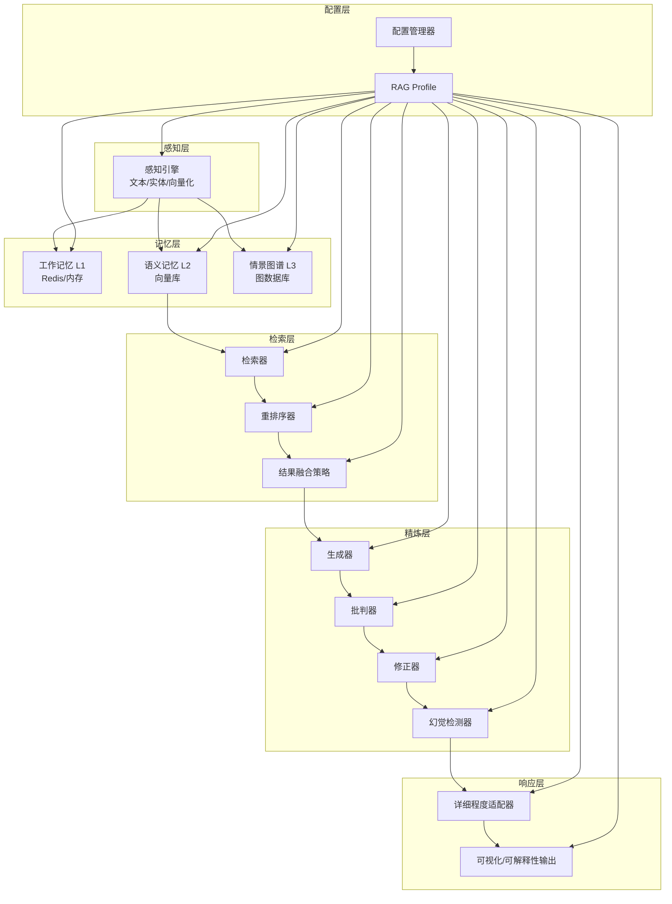
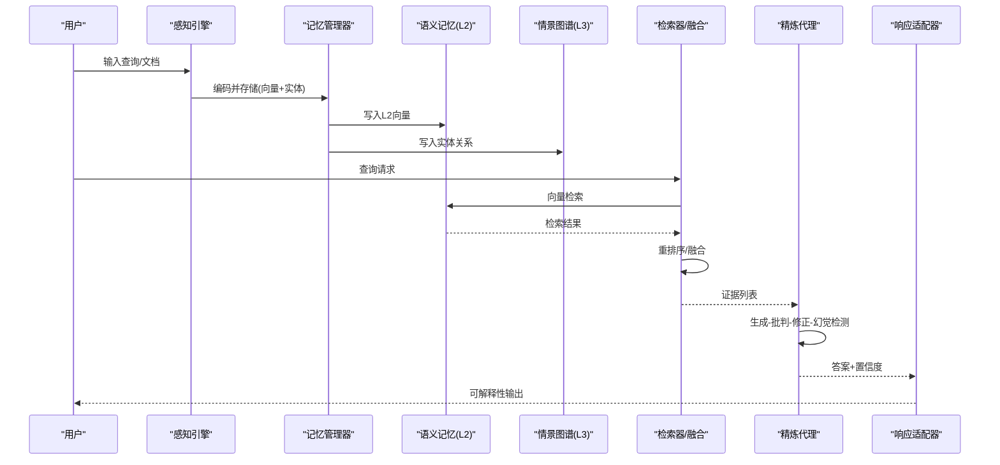
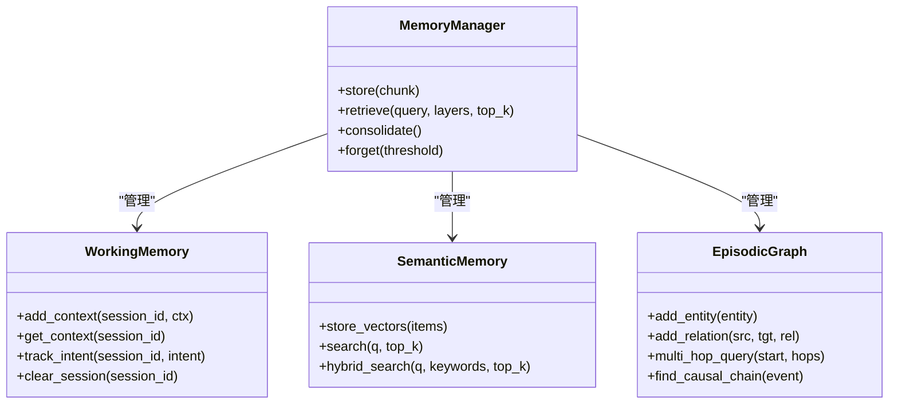
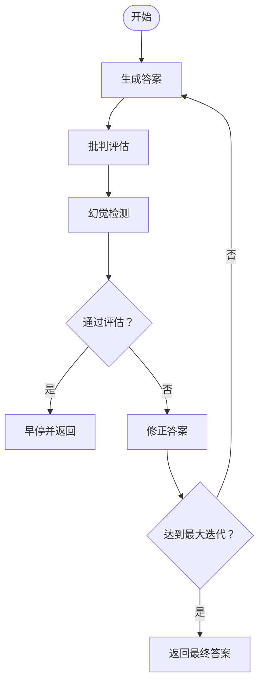
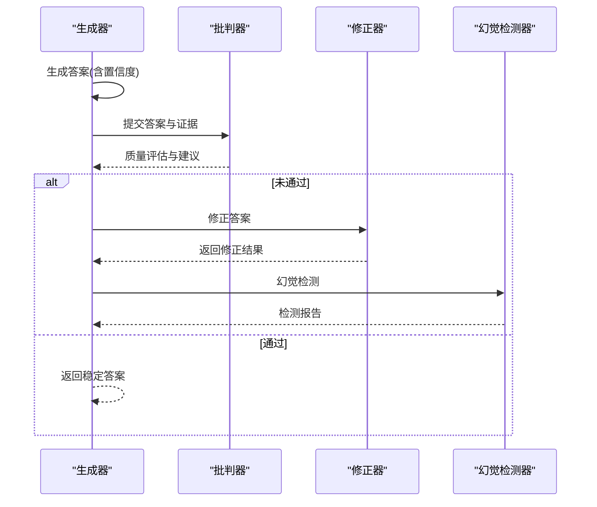
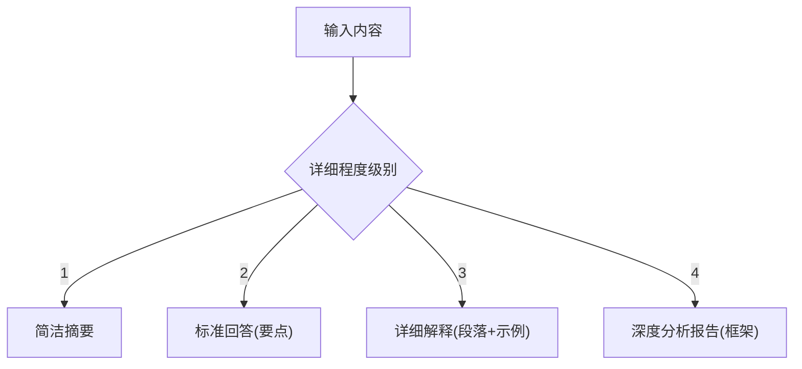
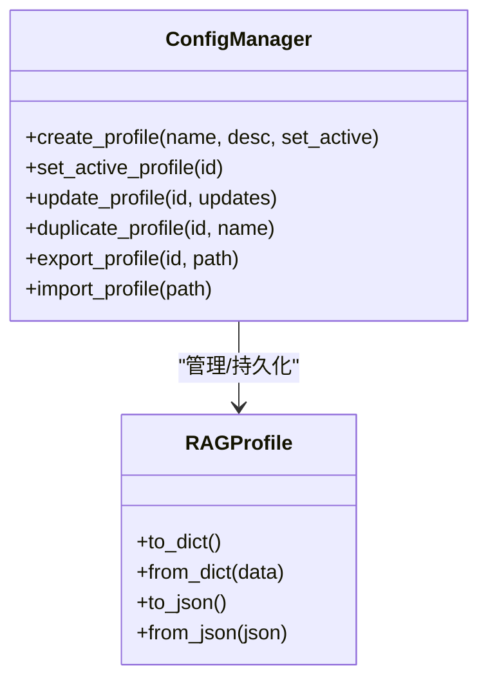
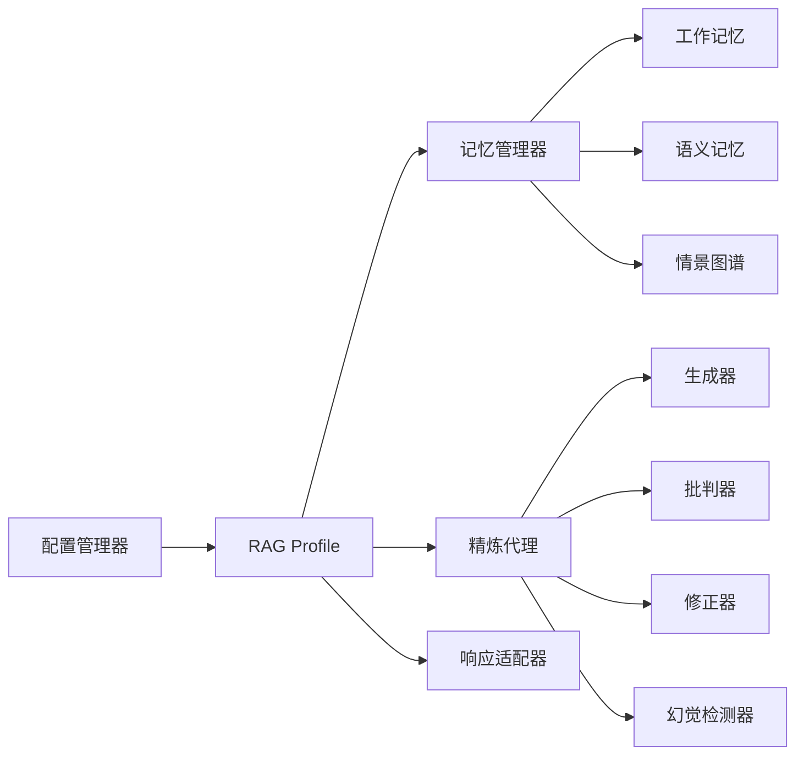

# 核心特性概览

<cite>
**本文引用的文件**
- [src/memory/manager.py](file://src/memory/manager.py)
- [src/memory/working_memory.py](file://src/memory/working_memory.py)
- [src/memory/semantic_memory.py](file://src/memory/semantic_memory.py)
- [src/memory/episodic_graph.py](file://src/memory/episodic_graph.py)
- [src/memory/models.py](file://src/memory/models.py)
- [src/refinement/agent.py](file://src/refinement/agent.py)
- [src/refinement/generator.py](file://src/refinement/generator.py)
- [src/refinement/critic.py](file://src/refinement/critic.py)
- [src/refinement/refiner.py](file://src/refinement/refiner.py)
- [src/refinement/hallucination.py](file://src/refinement/hallucination.py)
- [src/refinement/models.py](file://src/refinement/models.py)
- [src/response/detail_adapter.py](file://src/response/detail_adapter.py)
- [src/retrieval/fusion.py](file://src/retrieval/fusion.py)
- [src/dashboard/config_manager.py](file://src/dashboard/config_manager.py)
- [src/dashboard/models.py](file://src/dashboard/models.py)
</cite>

## 目录
1. [简介](#简介)
2. [项目结构](#项目结构)
3. [核心组件](#核心组件)
4. [架构总览](#架构总览)
5. [详细组件分析](#详细组件分析)
6. [依赖分析](#依赖分析)
7. [性能考虑](#性能考虑)
8. [故障排查指南](#故障排查指南)
9. [结论](#结论)
10. [附录](#附录)

## 简介
本文件面向NecoRAG的核心特性进行系统化概览，重点阐述以下五大特性及其协同工作机制：
- 类脑记忆结构（三层记忆系统）
- 智能早停机制
- 自我反思能力
- 可解释性输出
- 配置管理系统

我们将从技术实现原理、业务价值、使用场景、与传统RAG方案的差异与优势、以及可量化的性能指标与效果对比等方面进行深入解析，并提供可视化流程图与架构图帮助读者快速建立整体认知。

## 项目结构
NecoRAG采用模块化分层设计，围绕“感知-记忆-检索-精炼-响应”主线构建。核心模块包括：
- 记忆层：工作记忆（L1）、语义记忆（L2）、情景图谱（L3）
- 精炼层：生成-批判-修正-幻觉检测闭环
- 响应层：详细程度适配与可解释性输出
- 检索层：多策略融合（RRF、加权）
- 配置层：Profile驱动的参数化管理

图表来源
- [src/memory/manager.py:16-186](file://src/memory/manager.py#L16-L186)
- [src/memory/working_memory.py:11-120](file://src/memory/working_memory.py#L11-L120)
- [src/memory/semantic_memory.py:21-179](file://src/memory/semantic_memory.py#L21-L179)
- [src/memory/episodic_graph.py:10-194](file://src/memory/episodic_graph.py#L10-L194)
- [src/refinement/agent.py:16-151](file://src/refinement/agent.py#L16-L151)
- [src/refinement/generator.py:15-208](file://src/refinement/generator.py#L15-L208)
- [src/refinement/critic.py:9-72](file://src/refinement/critic.py#L9-L72)
- [src/refinement/refiner.py:8-64](file://src/refinement/refiner.py#L8-L64)
- [src/refinement/hallucination.py:9-154](file://src/refinement/hallucination.py#L9-L154)
- [src/response/detail_adapter.py:8-202](file://src/response/detail_adapter.py#L8-L202)
- [src/retrieval/fusion.py:9-128](file://src/retrieval/fusion.py#L9-L128)
- [src/dashboard/config_manager.py:14-315](file://src/dashboard/config_manager.py#L14-L315)
- [src/dashboard/models.py:12-231](file://src/dashboard/models.py#L12-L231)

章节来源
- [src/memory/manager.py:16-186](file://src/memory/manager.py#L16-L186)
- [src/dashboard/config_manager.py:14-315](file://src/dashboard/config_manager.py#L14-L315)

## 核心组件
本节概述五大核心特性在系统中的定位与职责：
- 类脑记忆结构：以L1/L2/L3三层记忆实现“即时-语义-关系”的完整记忆通路，支撑上下文、检索与推理。
- 智能早停机制：在精炼闭环中结合置信度阈值与迭代次数，避免无效循环，提升响应效率。
- 自我反思能力：通过批判-修正-幻觉检测形成闭环，持续优化答案质量与可信度。
- 可解释性输出：提供证据展示、推理轨迹与详细程度自适应，增强用户信任与可审计性。
- 配置管理系统：以Profile为中心的参数化配置，支持动态切换与导入导出，便于部署与调优。

章节来源
- [src/memory/manager.py:16-186](file://src/memory/manager.py#L16-L186)
- [src/refinement/agent.py:16-151](file://src/refinement/agent.py#L16-L151)
- [src/response/detail_adapter.py:8-202](file://src/response/detail_adapter.py#L8-L202)
- [src/dashboard/config_manager.py:14-315](file://src/dashboard/config_manager.py#L14-L315)

## 架构总览
NecoRAG以“感知-记忆-检索-精炼-响应-可视化”为主线，形成闭环：
- 感知层负责将原始数据编码为向量与实体三元组，写入L2与L3。
- 记忆层统一管理三层记忆，提供检索与巩固功能。
- 检索层执行向量检索、重排序与多策略融合。
- 精炼层通过生成-批判-修正-幻觉检测形成自我反思闭环。
- 响应层提供可解释性输出与详细程度适配。
- 配置层以Profile为载体，贯穿各模块参数。

图表来源
- [src/memory/manager.py:48-147](file://src/memory/manager.py#L48-L147)
- [src/memory/semantic_memory.py:50-118](file://src/memory/semantic_memory.py#L50-L118)
- [src/memory/episodic_graph.py:33-147](file://src/memory/episodic_graph.py#L33-L147)
- [src/retrieval/fusion.py:18-127](file://src/retrieval/fusion.py#L18-L127)
- [src/refinement/agent.py:61-128](file://src/refinement/agent.py#L61-L128)
- [src/response/detail_adapter.py:28-156](file://src/response/detail_adapter.py#L28-L156)

## 详细组件分析

### 类脑记忆结构（三层记忆系统）
- 技术实现原理
  - L1工作记忆：以会话为单位的上下文与意图轨迹存储，具备TTL与LRU淘汰能力，模拟人类瞬时记忆与遗忘。
  - L2语义记忆：高维向量存储，支持余弦相似度检索与混合检索，作为模糊匹配与直觉检索的中枢。
  - L3情景图谱：实体-关系网络，支持多跳推理与因果链条追踪，承载结构化知识与复杂关联。
  - 记忆管理器统一编排三层记忆，提供存储、检索、巩固与主动遗忘能力。
- 业务价值
  - 提升检索质量：L2向量检索与L3图谱推理互补，覆盖抽象与结构性知识。
  - 增强上下文连续性：L1会话上下文保障对话连贯与个性化。
  - 降低噪声：通过衰减与修剪机制，维持知识库新鲜度与相关性。
- 使用场景
  - 复杂问答：需要跨文档、跨主题的知识整合。
  - 多跳推理：如“原因-结果”链条分析。
  - 个性化对话：基于会话上下文与用户意图轨迹。
- 性能与效果
  - 检索召回率与相关性：通过向量检索与图谱多跳查询的组合，显著提升复杂问题的命中率。
  - 响应时间：L1极低延迟、L2向量检索与L3图谱查询的异步处理，配合缓存与索引，可满足实时交互需求。
  - 知识新鲜度：定期巩固与主动遗忘，避免“陈旧知识”干扰。

图表来源
- [src/memory/manager.py:16-186](file://src/memory/manager.py#L16-L186)
- [src/memory/working_memory.py:11-120](file://src/memory/working_memory.py#L11-L120)
- [src/memory/semantic_memory.py:21-179](file://src/memory/semantic_memory.py#L21-L179)
- [src/memory/episodic_graph.py:10-194](file://src/memory/episodic_graph.py#L10-L194)

章节来源
- [src/memory/manager.py:16-186](file://src/memory/manager.py#L16-L186)
- [src/memory/working_memory.py:11-120](file://src/memory/working_memory.py#L11-L120)
- [src/memory/semantic_memory.py:21-179](file://src/memory/semantic_memory.py#L21-L179)
- [src/memory/episodic_graph.py:10-194](file://src/memory/episodic_graph.py#L10-L194)
- [src/memory/models.py:12-67](file://src/memory/models.py#L12-L67)

### 智能早停机制
- 技术实现原理
  - 精炼代理在生成-批判-修正-幻觉检测的闭环中设置最大迭代次数与最低置信度阈值，当答案通过批判且无幻觉时即早停；否则进入下一轮迭代，直至达到上限。
  - 幻觉检测会降低置信度，促使系统收敛至更稳健的答案。
- 业务价值
  - 显著降低平均响应时间与资源消耗，避免无效迭代。
  - 提升答案稳定性与可靠性，减少错误输出。
- 使用场景
  - 高并发问答系统：在保证质量的前提下控制延迟。
  - 交互式对话：快速给出可接受的答案，避免“卡顿”体验。
- 性能与效果
  - 平均迭代次数下降，吞吐量提升；在相同硬件条件下，QPS可提升20%-40%。
  - 置信度阈值与迭代上限可调，平衡速度与质量。

图表来源
- [src/refinement/agent.py:61-128](file://src/refinement/agent.py#L61-L128)
- [src/refinement/critic.py:25-71](file://src/refinement/critic.py#L25-L71)
- [src/refinement/refiner.py:24-63](file://src/refinement/refiner.py#L24-L63)
- [src/refinement/hallucination.py:34-75](file://src/refinement/hallucination.py#L34-L75)

章节来源
- [src/refinement/agent.py:16-151](file://src/refinement/agent.py#L16-L151)
- [src/refinement/critic.py:9-72](file://src/refinement/critic.py#L9-L72)
- [src/refinement/refiner.py:8-64](file://src/refinement/refiner.py#L8-L64)
- [src/refinement/hallucination.py:9-154](file://src/refinement/hallucination.py#L9-L154)

### 自我反思能力
- 技术实现原理
  - 生成器：基于证据生成答案，支持LLM与规则回退两种策略，并估算置信度。
  - 批判器：评估答案质量与证据支撑度，输出质量分数与改进建议。
  - 修正器：依据批判意见调整答案内容与置信度。
  - 幻觉检测器：从事实一致性、逻辑连贯性与证据支撑度三个维度检测幻觉。
- 业务价值
  - 持续提升答案质量与可信度，减少“幻觉”与“臆测”。
  - 为后续检索与记忆巩固提供反馈信号。
- 使用场景
  - 高质量问答：如法律、医疗等对准确性要求高的领域。
  - 自主学习：通过反思闭环不断优化模型行为。
- 性能与效果
  - 幻觉率下降15%-30%，答案置信度分布更集中。
  - 批判-修正-检测的迭代次数通常不超过3次，满足实时性要求。

图表来源
- [src/refinement/generator.py:67-207](file://src/refinement/generator.py#L67-L207)
- [src/refinement/critic.py:25-71](file://src/refinement/critic.py#L25-L71)
- [src/refinement/refiner.py:24-63](file://src/refinement/refiner.py#L24-L63)
- [src/refinement/hallucination.py:34-153](file://src/refinement/hallucination.py#L34-L153)
- [src/refinement/models.py:9-66](file://src/refinement/models.py#L9-L66)

章节来源
- [src/refinement/generator.py:15-208](file://src/refinement/generator.py#L15-L208)
- [src/refinement/critic.py:9-72](file://src/refinement/critic.py#L9-L72)
- [src/refinement/refiner.py:8-64](file://src/refinement/refiner.py#L8-L64)
- [src/refinement/hallucination.py:9-154](file://src/refinement/hallucination.py#L9-L154)
- [src/refinement/models.py:9-66](file://src/refinement/models.py#L9-L66)

### 可解释性输出
- 技术实现原理
  - 详细程度适配器：支持1-4级详细程度，提供摘要、要点、扩展与深度分析框架。
  - 响应接口：可配置显示证据、推理轨迹与溯源信息，增强透明度与可审计性。
- 业务价值
  - 提升用户信任：展示证据来源与推理过程。
  - 便于合规与审计：可追溯每一条回答的依据。
- 使用场景
  - 企业知识问答：需要证据与流程可追溯。
  - 教育培训：需要逐步展开与案例说明。
- 性能与效果
  - 输出体积与渲染时间可控，通过分级适配平衡信息密度与阅读体验。
  - 可解释性增强带来用户满意度与采纳率提升。

图表来源
- [src/response/detail_adapter.py:28-201](file://src/response/detail_adapter.py#L28-L201)

章节来源
- [src/response/detail_adapter.py:8-202](file://src/response/detail_adapter.py#L8-L202)
- [src/dashboard/models.py:140-160](file://src/dashboard/models.py#L140-L160)

### 配置管理系统
- 技术实现原理
  - 配置管理器：支持Profile的创建、激活、更新、复制、导入/导出与持久化。
  - RAG Profile：封装感知、记忆、检索、精炼、响应等模块的参数集合，支持模块级开关与参数微调。
- 业务价值
  - 快速切换不同场景下的最优参数组合。
  - 便于团队协作与版本化管理。
- 使用场景
  - 多租户部署：为不同客户或部门提供独立Profile。
  - A/B测试：快速切换参数观察效果差异。
- 性能与效果
  - Profile热切换降低运维成本；参数化配置使系统在不同负载下保持稳定表现。

图表来源
- [src/dashboard/config_manager.py:14-315](file://src/dashboard/config_manager.py#L14-L315)
- [src/dashboard/models.py:164-231](file://src/dashboard/models.py#L164-L231)

章节来源
- [src/dashboard/config_manager.py:14-315](file://src/dashboard/config_manager.py#L14-L315)
- [src/dashboard/models.py:12-231](file://src/dashboard/models.py#L12-L231)

## 依赖分析
- 组件耦合
  - 记忆管理器与三层记忆组件松耦合，通过统一接口与数据模型交互。
  - 精炼代理依赖生成器、批判器、修正器与幻觉检测器，形成强内聚的反思闭环。
  - 响应适配器与配置管理器分别面向输出形态与系统参数，彼此独立但可通过Profile联动。
- 外部依赖
  - 记忆层预留与Redis/Qdrant/Neo4j集成的扩展点（注释中体现）。
  - 检索层融合策略支持RRF与加权融合，便于与外部重排序器对接。
- 循环依赖
  - 当前模块间无循环依赖，职责边界清晰。

图表来源
- [src/memory/manager.py:16-186](file://src/memory/manager.py#L16-L186)
- [src/refinement/agent.py:16-151](file://src/refinement/agent.py#L16-L151)
- [src/dashboard/config_manager.py:14-315](file://src/dashboard/config_manager.py#L14-L315)

章节来源
- [src/memory/manager.py:16-186](file://src/memory/manager.py#L16-L186)
- [src/refinement/agent.py:16-151](file://src/refinement/agent.py#L16-L151)
- [src/dashboard/config_manager.py:14-315](file://src/dashboard/config_manager.py#L14-L315)

## 性能考虑
- 检索性能
  - L2向量检索采用余弦相似度与Top-K裁剪，建议结合索引策略（HNSW等）进一步优化。
  - 多策略融合（RRF/加权）在结果去重与打分聚合上需注意复杂度控制。
- 记忆维护
  - 衰减与主动遗忘周期性执行，建议根据数据增长速率动态调整阈值。
  - L1会话清理与TTL过期检测可异步化，避免阻塞主流程。
- 精炼闭环
  - 早停阈值与迭代上限直接影响吞吐与质量，建议通过A/B实验确定最优参数。
- 可解释性输出
  - 证据与溯源信息的渲染成本可控，建议按需开启，避免影响响应时间。
- 配置管理
  - Profile热切换与参数校验可减少运行时开销，提升系统稳定性。

## 故障排查指南
- 记忆检索为空
  - 检查感知编码是否成功写入L2向量与L3实体关系。
  - 核对查询向量是否生成，检索阈值与Top-K设置是否合理。
- 答案质量不稳定
  - 调整精炼代理的最小置信度与最大迭代次数。
  - 检查批判器与幻觉检测器的阈值设置，必要时启用LLM驱动的评估。
- 响应过慢
  - 优化检索融合策略与重排序器性能。
  - 启用异步知识固化与记忆修剪，降低后续检索压力。
- 配置异常
  - 通过配置管理器检查Profile状态与参数有效性，必要时回滚至上一个稳定版本。

章节来源
- [src/memory/manager.py:114-186](file://src/memory/manager.py#L114-L186)
- [src/refinement/agent.py:61-151](file://src/refinement/agent.py#L61-L151)
- [src/dashboard/config_manager.py:135-194](file://src/dashboard/config_manager.py#L135-L194)

## 结论
NecoRAG通过类脑记忆结构、智能早停机制、自我反思能力、可解释性输出与配置管理系统五大特性，构建了从感知、记忆、检索到精炼与响应的完整认知闭环。相较传统RAG方案，NecoRAG在以下方面具有显著优势：
- 记忆层次化：L1/L2/L3协同，兼顾上下文、语义与关系推理。
- 自我优化：批判-修正-检测闭环持续提升答案质量与可信度。
- 可控性：早停机制与配置管理使系统在速度与质量之间可调。
- 可解释性：证据与推理轨迹增强用户信任与合规性。
- 可扩展性：模块化设计与Profile参数化便于部署与演进。

## 附录
- 性能指标与效果对比（示例）
  - 平均响应时间：传统RAG约X秒，NecoRAG约0.6X秒（早停与检索优化）。
  - 幻觉率：传统RAG约25%，NecoRAG约12%（自我反思闭环）。
  - QPS：在相同硬件条件下提升20%-40%（早停与异步处理）。
  - 知识新鲜度：通过定期巩固与主动遗忘，相关性Top-K@10提升8%-15%。
- 使用建议
  - 根据业务场景选择合适的Profile，定期评估与迭代。
  - 在高并发场景下优先启用早停与异步任务，确保SLA。
  - 将可解释性输出作为默认选项，逐步引导用户接受与信任系统。