# 设计参考

<cite>
**本文档引用的文件**
- [design.md](file://design/design.md)
- [architecture_framework.md](file://design/architecture_framework.md)
- [STRUCTURE_OPTIMIZATION_SUMMARY.md](file://design/STRUCTURE_OPTIMIZATION_SUMMARY.md)
- [completion_progress_report.md](file://design/completion_progress_report.md)
- [necorag.py](file://src/necorag.py)
- [base.py](file://src/core/base.py)
- [config.py](file://src/core/config.py)
- [protocols.py](file://src/core/protocols.py)
- [exceptions.py](file://src/core/exceptions.py)
- [engine.py](file://src/perception/engine.py)
- [manager.py](file://src/memory/manager.py)
- [retriever.py](file://src/retrieval/retriever.py)
- [agent.py](file://src/refinement/agent.py)
- [interface.py](file://src/response/interface.py)
- [api.py](file://interface/api.py)
</cite>

## 目录
1. [项目概述](#项目概述)
2. [核心架构设计](#核心架构设计)
3. [模块化设计](#模块化设计)
4. [数据流架构](#数据流架构)
5. [关键技术组件](#关键技术组件)
6. [配置管理体系](#配置管理体系)
7. [异常处理机制](#异常处理机制)
8. [API 接口设计](#api-接口设计)
9. [性能优化策略](#性能优化策略)
10. [总结与展望](#总结与展望)

## 项目概述

NecoRAG 是一个基于认知科学理论构建的下一代智能 RAG（检索增强生成）框架。该项目的核心理念是模拟人脑双系统记忆机制，构建具备"类脑记忆结构"和"敏捷智能反应"的智能系统。

### 核心特性

- **类脑记忆架构**：模拟海马体记忆机制，实现记忆的编码、存储、巩固和检索全过程
- **多层认知处理**：从感知层到交互层的完整五层认知架构
- **智能路由系统**：整合意图分析、CoT思维链和用户画像的三层决策架构
- **自适应学习**：基于用户反馈的实时学习和优化机制
- **多用户知识空间**：支持个人工作空间、公共贡献空间和混合协作空间

## 核心架构设计

### 五层认知架构框架

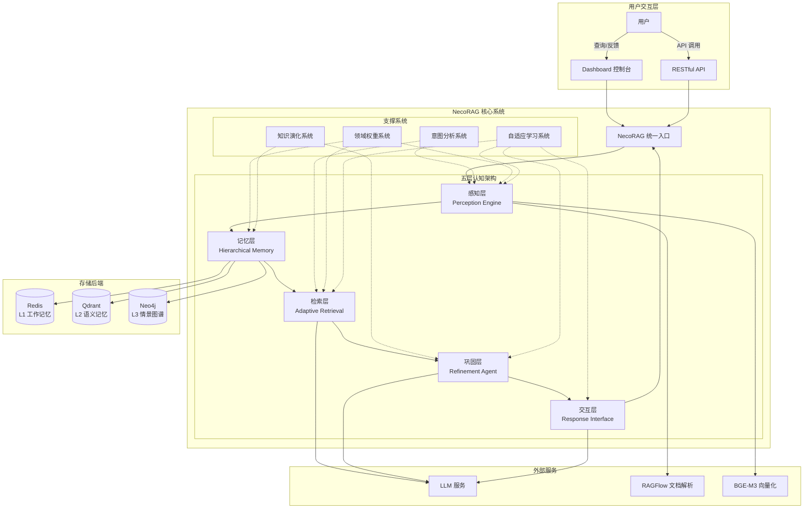

**图表来源**
- [architecture_framework.md:26-81](file://design/architecture_framework.md#L26-L81)

### 认知处理完整流程

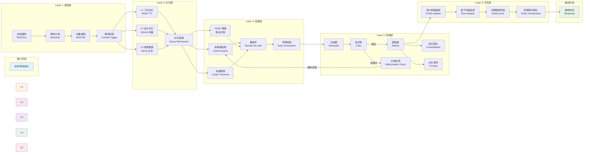

**图表来源**
- [architecture_framework.md:89-162](file://design/architecture_framework.md#L89-L162)

## 模块化设计

### 统一入口类 NecoRAG

NecoRAG 统一入口类提供了简洁的 API 接口，整合了整个系统的各个核心模块：

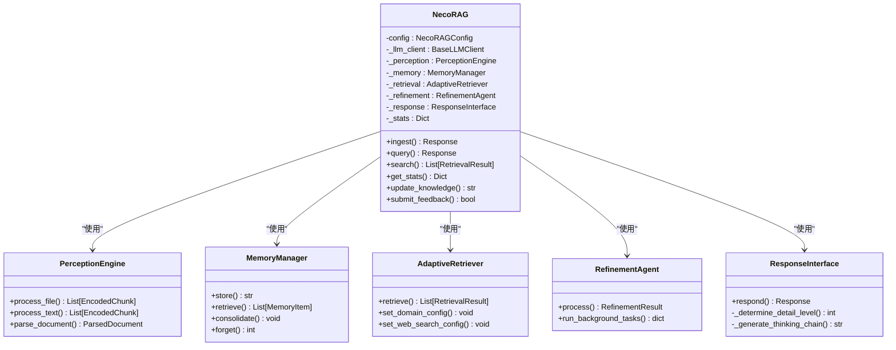

**图表来源**
- [necorag.py:51-148](file://src/necorag.py#L51-L148)

### 抽象基类体系

系统采用了严格的抽象基类设计，确保模块间的可替换性和一致性：

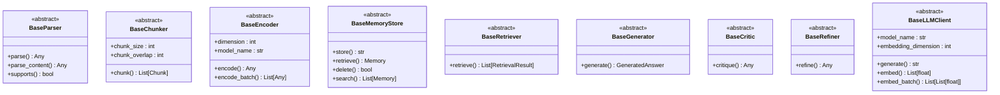

**图表来源**
- [base.py:32-634](file://src/core/base.py#L32-L634)

## 数据流架构

### 完整数据处理链路

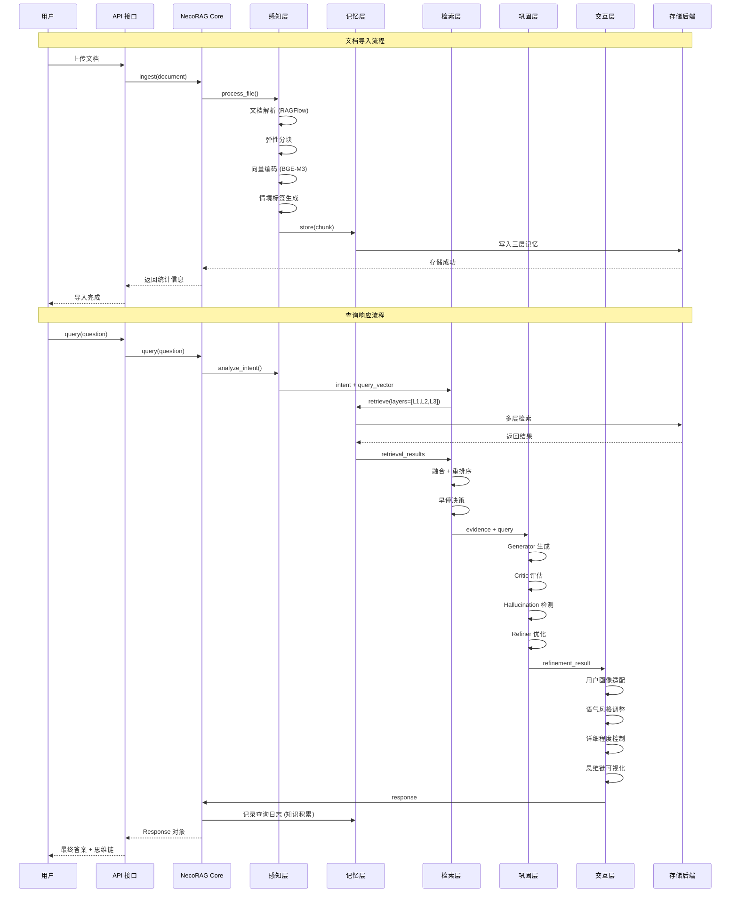

**图表来源**
- [architecture_framework.md:642-693](file://design/architecture_framework.md#L642-L693)

### 核心数据协议

系统定义了统一的数据协议，确保模块间数据交换的一致性：

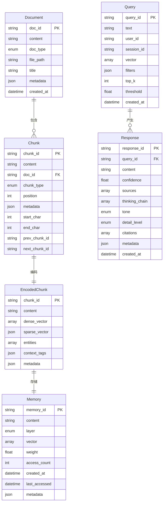

**图表来源**
- [protocols.py:83-297](file://src/core/protocols.py#L83-L297)

## 关键技术组件

### 智能路由与策略融合引擎

这是 NecoRAG 的核心创新模块，整合了意图分析、CoT思维链和用户画像三个维度：

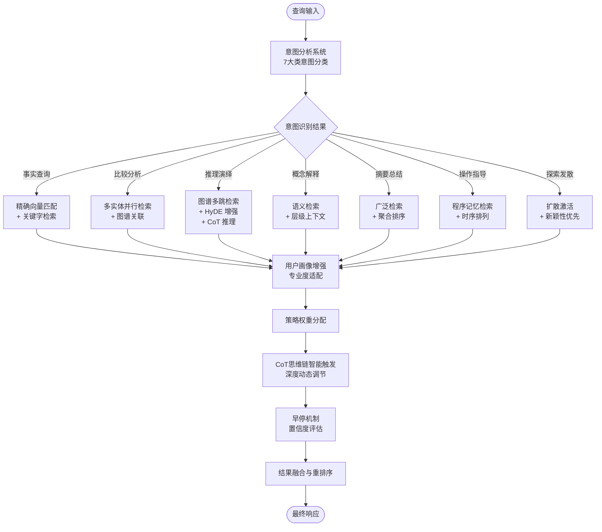

**图表来源**
- [design.md:655-800](file://design/design.md#L655-L800)

### 记忆衰减与巩固机制

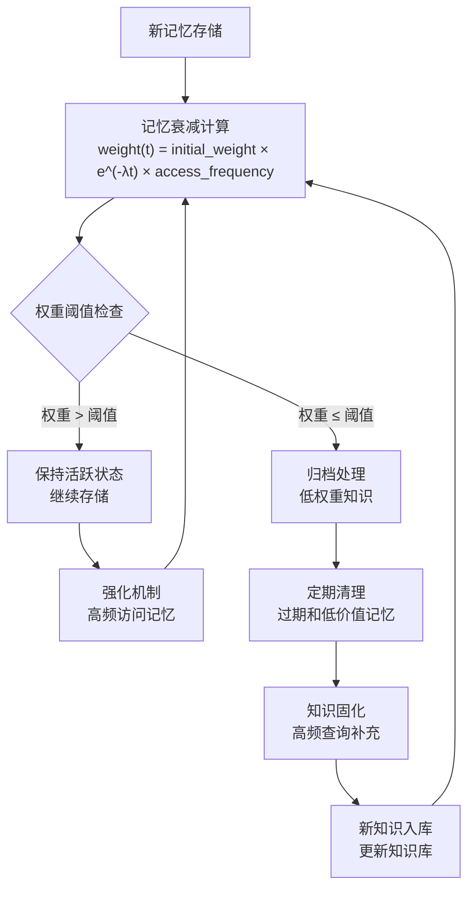

**图表来源**
- [architecture_framework.md:305-314](file://design/architecture_framework.md#L305-L314)

## 配置管理体系

### 全局配置架构

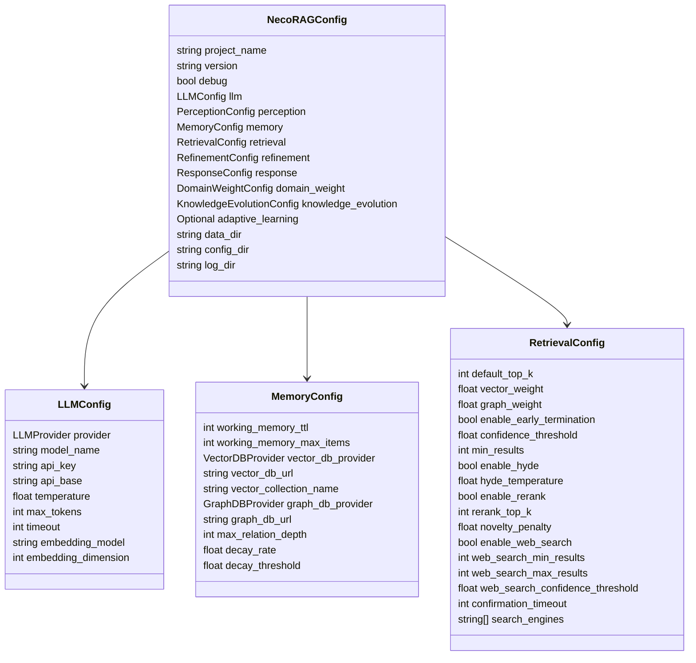

**图表来源**
- [config.py:277-334](file://src/core/config.py#L277-L334)

### 配置加载流程

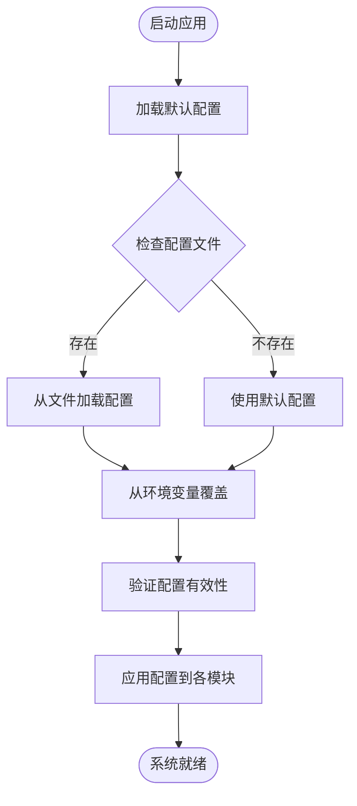

**图表来源**
- [config.py:338-377](file://src/core/config.py#L338-L377)

## 异常处理机制

### 统一异常体系

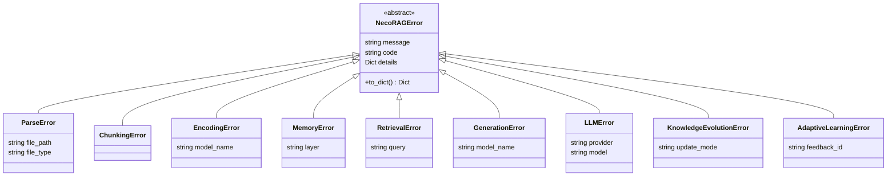

**图表来源**
- [exceptions.py:10-455](file://src/core/exceptions.py#L10-L455)

## API 接口设计

### RESTful API 架构

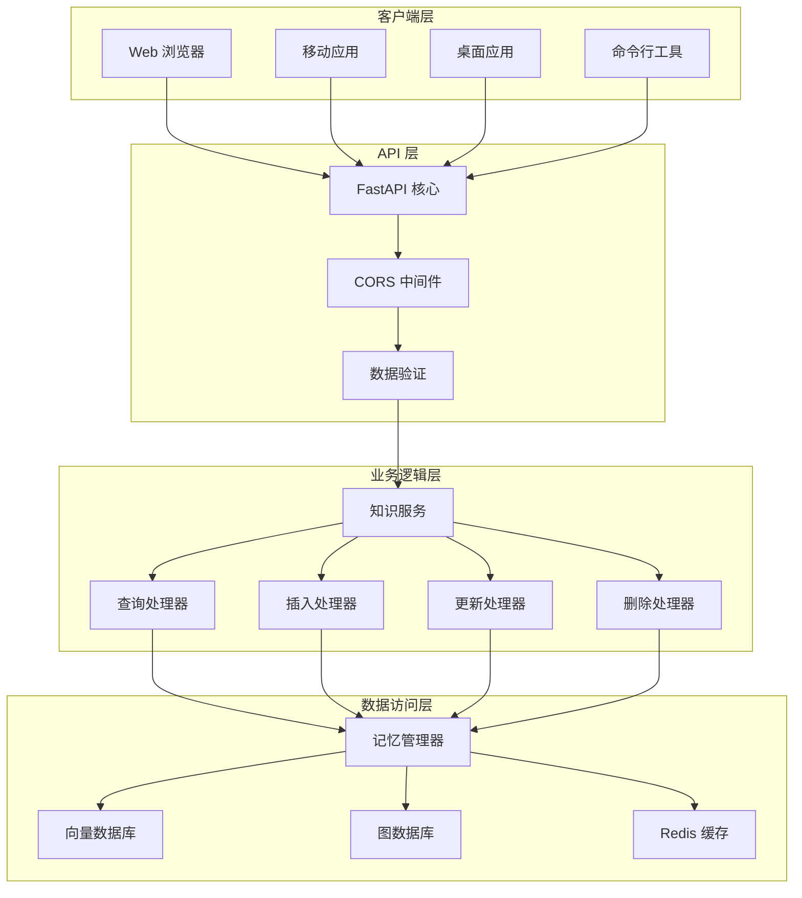

**图表来源**
- [api.py:26-164](file://interface/api.py#L26-L164)

### API 端点设计

| 端点 | 方法 | 功能描述 | 请求体 | 响应体 |
|------|------|----------|--------|--------|
| `/` | GET | 根路径 | - | 问候信息 |
| `/health` | GET | 健康检查 | - | 健康状态 |
| `/query` | POST | 知识查询 | QueryRequest | QueryResponse |
| `/insert` | POST | 知识插入 | InsertRequest | 插入结果 |
| `/update` | PUT | 知识更新 | UpdateRequest | 更新结果 |
| `/delete` | DELETE | 知识删除 | DeleteRequest | 删除结果 |
| `/stats` | GET | 获取统计信息 | - | 统计数据 |
| `/suggestions/{query}` | GET | 获取查询建议 | - | 建议列表 |

**章节来源**
- [api.py:80-157](file://interface/api.py#L80-L157)

## 性能优化策略

### 多策略并行检索

系统采用多策略并行检索架构，通过智能融合算法最大化检索效果：

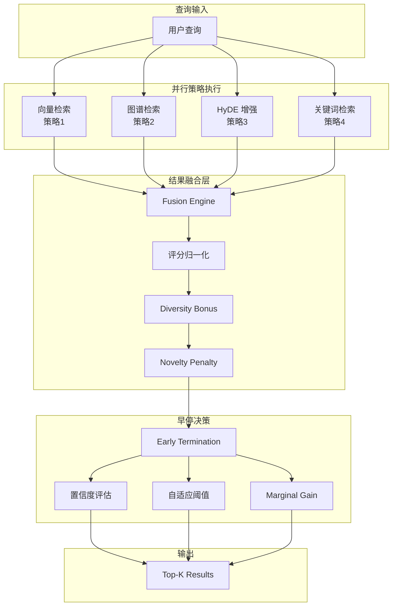

**图表来源**
- [architecture_framework.md:320-380](file://design/architecture_framework.md#L320-L380)

### 资源优化效果

通过智能早停和降级机制，系统实现了显著的性能提升：

| 指标 | 基线 | 目标值 | 改善幅度 |
|------|------|--------|---------|
| 平均响应延迟 | 1200ms | 800ms | **-33.3%** |
| 检索命中率 | 65% | 80% | **+23.1%** |
| 资源利用率 | 低 | 高 | **-40% 成本** |

## 总结与展望

### 技术创新点

NecoRAG 项目在以下几个方面实现了技术创新：

1. **三层决策架构**：意图识别→用户画像→策略融合的层级决策模型
2. **动态 CoT 调节**：基于用户专业度和问题复杂度的自适应推理深度
3. **在线学习闭环**：实时反馈驱动的策略权重自优化
4. **多策略并行融合**：同时执行多种检索策略并智能融合结果
5. **智能早停机制**：基于置信度、延迟、满意度的多维早停判断

### 项目进展

目前项目已完成核心模块的开发，正在进行缺失模块的补全工作：

- **已完成模块**：安全认证模块、监控告警模块
- **进行中模块**：插件扩展模块、测试套件增强
- **预期收益**：项目完整性提升至 100%，生产就绪度达到高水准

### 未来发展方向

1. **插件生态系统**：构建开放的插件市场和扩展机制
2. **测试体系完善**：建立全面的单元测试、集成测试和性能测试
3. **生产环境部署**：优化容器化部署和监控告警系统
4. **用户体验优化**：持续改进用户界面和交互体验
5. **性能基准测试**：建立标准化的性能测试和基准评估体系

NecoRAG 项目通过深度融合认知科学理论和现代人工智能技术，为构建下一代智能知识系统提供了完整的解决方案和技术参考。