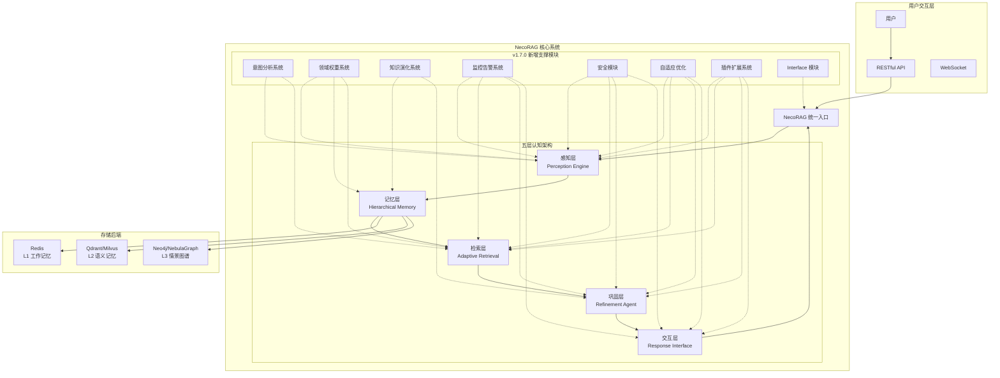
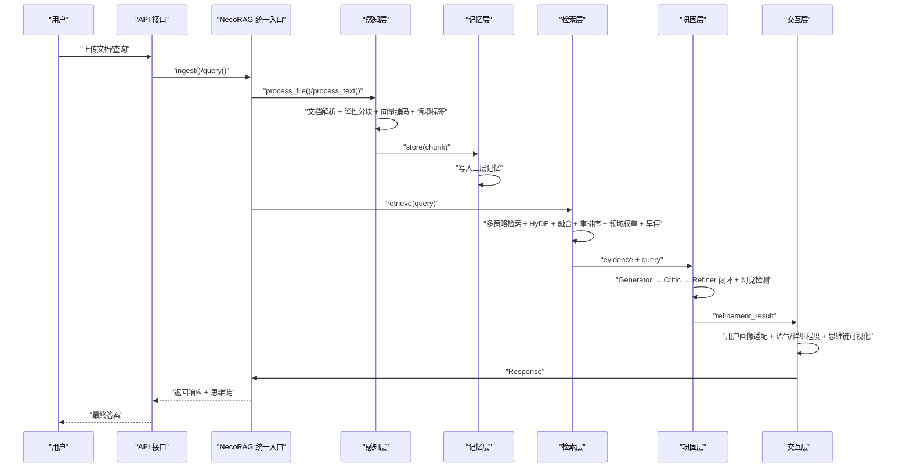
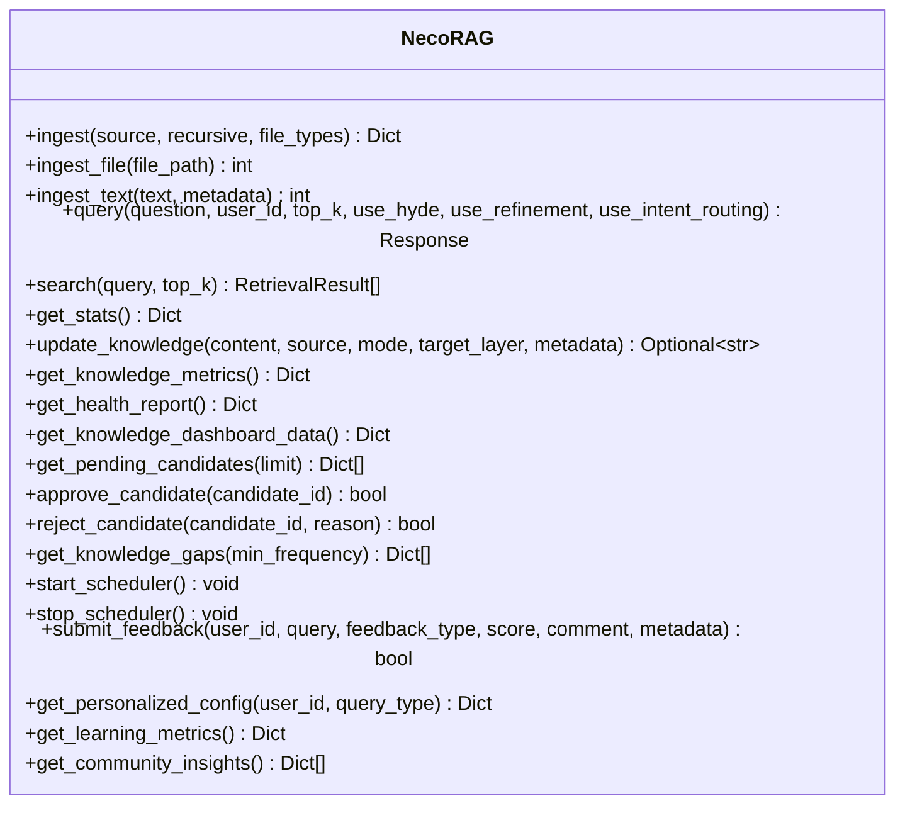
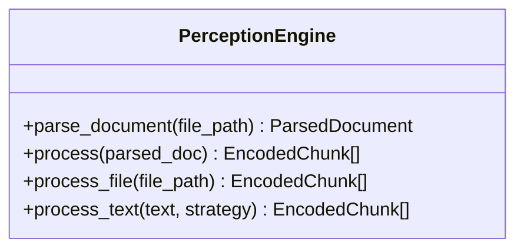
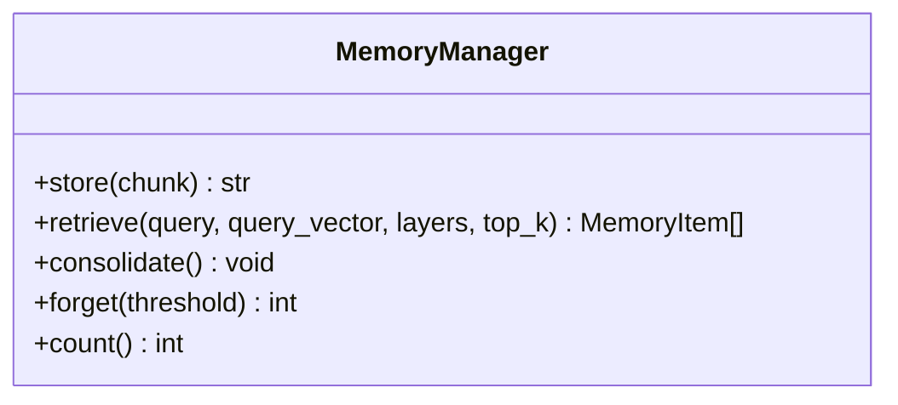
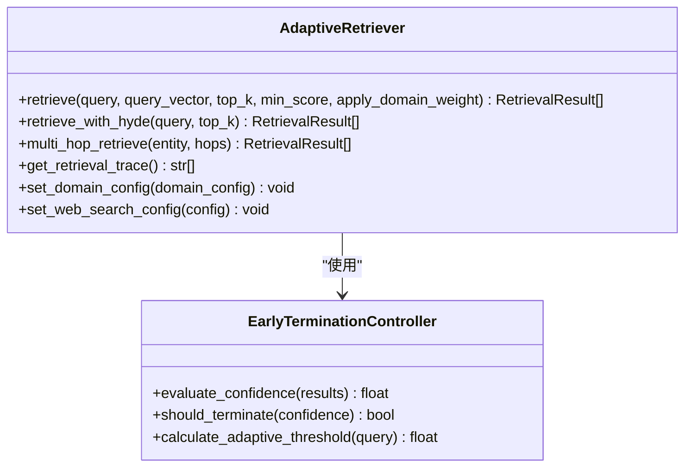
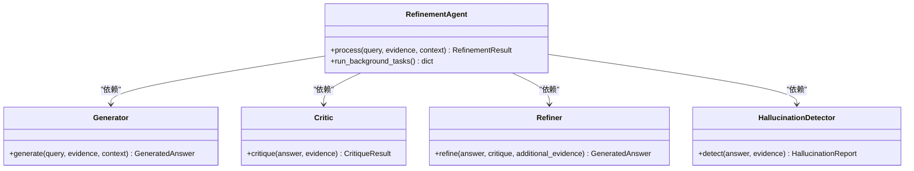
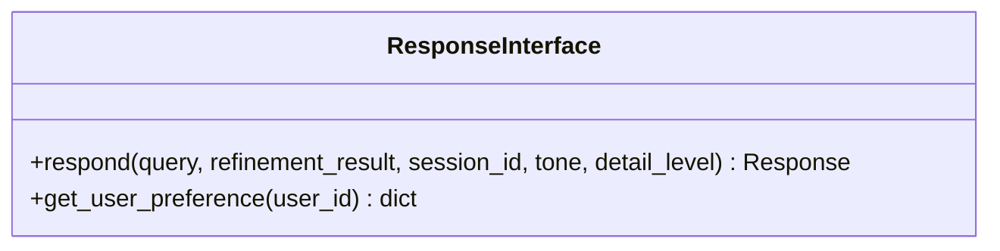
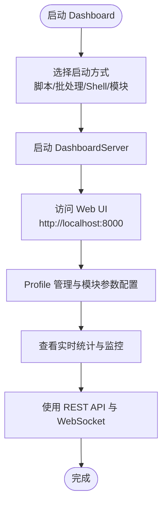
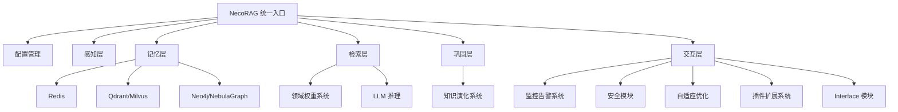

# 项目概述

<cite>
**本文引用的文件**
- [README.md](file://README.md)
- [QUICKSTART.md](file://QUICKSTART.md)
- [src/necorag.py](file://src/necorag.py)
- [src/core/base.py](file://src/core/base.py)
- [src/core/config.py](file://src/core/config.py)
- [src/perception/engine.py](file://src/perception/engine.py)
- [src/memory/manager.py](file://src/memory/manager.py)
- [src/retrieval/retriever.py](file://src/retrieval/retriever.py)
- [src/refinement/agent.py](file://src/refinement/agent.py)
- [src/response/interface.py](file://src/response/interface.py)
- [src/dashboard/dashboard.py](file://src/dashboard/dashboard.py)
- [src/dashboard/USAGE_GUIDE.md](file://src/dashboard/USAGE_GUIDE.md)
- [design/architecture_framework.md](file://design/architecture_framework.md)
- [log/PROJECT_FINAL_SUMMARY.md](file://log/PROJECT_FINAL_SUMMARY.md)
- [log/PROJECT_FINAL_STATUS.md](file://log/PROJECT_FINAL_STATUS.md)
</cite>

## 目录
1. [简介](#简介)
2. [项目结构](#项目结构)
3. [核心组件](#核心组件)
4. [架构总览](#架构总览)
5. [详细组件分析](#详细组件分析)
6. [依赖关系分析](#依赖关系分析)
7. [性能考量](#性能考量)
8. [故障排查指南](#故障排查指南)
9. [结论](#结论)
10. [附录](#附录)

## 简介
NecoRAG 是一个创新的认知型检索增强生成（RAG）框架，模拟人脑双系统记忆与神经认知科学原理，采用“五层认知”架构，从感知到交互形成完整的认知闭环。项目当前处于 Alpha 阶段（v1.7.0-alpha），已实现从文档导入、多模态编码、三层记忆存储、混合检索与重排序、幻觉自检与知识固化，到情境自适应响应与思维链可视化的全流程。

- **核心理念**：以类脑记忆结构为基础，通过“工作记忆-语义记忆-情景图谱”的分层存储与动态权重衰减，模拟人类记忆的巩固与遗忘；通过“意图分析-领域权重-早停机制-幻觉自检-思维链可视化”的闭环，实现可解释、高质量、低幻觉的智能问答。
- **技术创新点**：
  - 类脑记忆结构：三层记忆系统（L1 工作记忆、L2 语义记忆、L3 情景图谱）与动态权重衰减机制。
  - 智能早停：基于置信度与边际收益的“Pounce 机制”，显著降低检索成本。
  - 幻觉自检闭环：Generator-Critic-Refiner 三重验证与 Hallucination Detector。
  - 思维链可视化：完整展示检索路径、证据来源与推理过程。
  - 可视化调试面板：实时监控、A/B 测试、参数调优与路径分析。
  - 配置管理与 Dashboard：Web 界面与 REST API 实时配置与监控。
  - 安全与权限：JWT/OAuth2 认证、RBAC 权限管理。
  - 插件扩展系统：热插拔、沙箱隔离与插件市场。
- **差异化优势**：
  - 与传统向量检索相比，引入图谱推理、HyDE 增强、领域权重融合与早停机制，显著提升检索准确率与响应效率。
  - 通过意图分析与领域权重系统，实现更贴近用户需求的检索与回答。
  - Dashboard 与可视化调试面板提供强大的可观测性与可运维性，适合生产环境部署与持续优化。

**章节来源**
- [README.md:1-120](file://README.md#L1-L120)
- [README.md:552-610](file://README.md#L552-L610)

## 项目结构
NecoRAG 采用模块化与分层架构组织，核心分为五层认知模块与若干支撑模块，并配套 Dashboard 与监控告警系统：

- 五层认知架构
  - Layer 1：感知层（Perception Engine）：文档解析、弹性分块、向量编码、情境标签生成。
  - Layer 2：记忆层（Hierarchical Memory）：L1 工作记忆（Redis）、L2 语义记忆（Qdrant/Milvus）、L3 情景图谱（Neo4j/NebulaGraph），支持记忆衰减与主动遗忘。
  - Layer 3：检索层（Adaptive Retrieval）：多策略检索（向量/关键词/图谱）、HyDE 增强、重排序与新颖性惩罚、早停机制。
  - Layer 4：巩固层（Refinement Agent）：Generator-Critic-Refiner 闭环、幻觉检测、知识固化与记忆修剪。
  - Layer 5：交互层（Response Interface）：用户画像适配、语气/详细程度控制、思维链可视化。
- 支撑模块（v1.7.0 新增）
  - 意图分析系统（intent/）：多级分类、语义分析、智能路由。
  - 领域权重系统（domain/）：时间衰减、领域相关性与新颖性融合。
  - 知识演化系统（knowledge_evolution/）：演化指标、版本管理、自动更新与可视化。
  - 监控告警系统（monitoring/）：20+ 性能指标、健康检查、多渠道告警。
  - 安全模块（security/）：认证授权、权限管理、数据保护与审计日志。
  - 自适应优化（adaptive/）：群体智能、反馈收集、偏好预测与 A/B 测试。
  - 插件扩展系统（plugins/）：插件基类、生命周期管理、热插拔与沙箱隔离。
  - Interface 模块（interface/）：RESTful API、WebSocket、知识服务封装与多语言客户端。

**图表来源**
- [design/architecture_framework.md:26-81](file://design/architecture_framework.md#L26-L81)

**章节来源**
- [README.md:44-163](file://README.md#L44-L163)
- [design/architecture_framework.md:85-162](file://design/architecture_framework.md#L85-L162)

## 核心组件
- NecoRAG 统一入口类：提供文档导入、查询检索、配置管理与知识演化 API，贯穿五层架构的数据流与控制流。
- 抽象基类体系：定义感知层、记忆层、检索层、巩固层、交互层、意图分析、知识演化等模块的统一接口，确保实现的一致性与可替换性。
- 配置管理：集中管理 LLM、感知、记忆、检索、巩固、响应、领域权重、知识演化等模块的配置，支持从文件与环境变量加载。
- 感知引擎：多模态文档解析、弹性分块、向量编码与情境标签生成。
- 记忆管理：三层记忆统一管理、向量检索、图谱查询、记忆衰减与主动遗忘。
- 自适应检索：多策略融合、HyDE 增强、重排序、新颖性惩罚与早停机制。
- 精炼代理：Generator-Critic-Refiner 闭环、幻觉检测、知识固化与记忆修剪。
- 响应接口：用户画像适配、语气/详细程度控制、思维链可视化。
- Dashboard：Web 配置管理、Profile 生命周期、实时统计与 REST API。
- v1.7.0 新增模块：意图分析、领域权重、知识演化、监控告警、安全、自适应优化、插件系统、Interface 模块。

**章节来源**
- [src/necorag.py:43-134](file://src/necorag.py#L43-L134)
- [src/core/base.py:30-800](file://src/core/base.py#L30-L800)
- [src/core/config.py:45-420](file://src/core/config.py#L45-L420)
- [src/perception/engine.py:20-195](file://src/perception/engine.py#L20-L195)
- [src/memory/manager.py:20-212](file://src/memory/manager.py#L20-L212)
- [src/retrieval/retriever.py:135-644](file://src/retrieval/retriever.py#L135-L644)
- [src/refinement/agent.py:20-164](file://src/refinement/agent.py#L20-L164)
- [src/response/interface.py:20-232](file://src/response/interface.py#L20-L232)

## 架构总览
五层认知架构从输入到输出的完整数据流如下：

**图表来源**
- [design/architecture_framework.md:642-693](file://design/architecture_framework.md#L642-L693)

**章节来源**
- [design/architecture_framework.md:638-740](file://design/architecture_framework.md#L638-L740)

## 详细组件分析

### 统一入口类（NecoRAG）
- 职责：统一管理五层模块与 v1.7.0 新增模块，提供文档导入、查询检索、知识演化与自适应学习 API。
- 关键流程：延迟初始化各层组件；根据配置创建 LLM 客户端；文档导入时感知层编码后写入记忆层；查询时意图分析、HyDE 增强、检索、精炼与响应生成；记录查询统计并触发知识积累与自适应学习回调。
- 知识演化与自适应学习：提供实时更新、候选审核、健康报告、仪表盘数据、反馈收集与个性化配置等 API。

**图表来源**
- [src/necorag.py:43-800](file://src/necorag.py#L43-L800)

**章节来源**
- [src/necorag.py:112-134](file://src/necorag.py#L112-L134)
- [src/necorag.py:354-556](file://src/necorag.py#L354-L556)
- [src/necorag.py:558-790](file://src/necorag.py#L558-L790)

### 感知引擎（Perception Engine）
- 职责：多模态文档解析、弹性分块、向量编码（稠密/稀疏/实体三元组）与情境标签生成。
- 特性：支持多种分块策略（弹性/语义/固定/结构化/句子），可配置 OCR 与语义边界优先级；编码后生成 EncodedChunk，包含内容、向量与标签。

**图表来源**
- [src/perception/engine.py:20-195](file://src/perception/engine.py#L20-L195)

**章节来源**
- [src/perception/engine.py:77-154](file://src/perception/engine.py#L77-L154)

### 记忆管理（Memory Manager）
- 职责：统一管理 L1（Redis）、L2（Qdrant/Milvus）、L3（Neo4j/NebulaGraph）三层记忆；提供存储、检索、记忆巩固与主动遗忘。
- 特性：记忆衰减与权重更新；实体三元组写入图谱；检索时对 L2 向量结果进行强化访问与去重。

**图表来源**
- [src/memory/manager.py:20-212](file://src/memory/manager.py#L20-L212)

**章节来源**
- [src/memory/manager.py:52-159](file://src/memory/manager.py#L52-L159)

### 自适应检索（Adaptive Retriever）
- 职责：多策略检索（向量/关键词/图谱）、HyDE 增强、重排序与新颖性惩罚、早停机制与领域权重融合。
- 特性：早停控制器基于置信度与边际收益判断；领域权重计算器融合关键字、时间与领域相关性；支持互联网搜索回退与结果合并。

**图表来源**
- [src/retrieval/retriever.py:135-644](file://src/retrieval/retriever.py#L135-L644)

**章节来源**
- [src/retrieval/retriever.py:224-308](file://src/retrieval/retriever.py#L224-L308)
- [src/retrieval/retriever.py:310-360](file://src/retrieval/retriever.py#L310-L360)

### 精炼代理（Refinement Agent）
- 职责：Generator-Critic-Refiner 闭环、幻觉检测、知识固化与记忆修剪；支持异步后台任务。
- 特性：多轮迭代验证与修正；幻觉检测降低置信度；达到最大迭代次数后返回当前结果。

**图表来源**
- [src/refinement/agent.py:20-164](file://src/refinement/agent.py#L20-L164)

**章节来源**
- [src/refinement/agent.py:65-141](file://src/refinement/agent.py#L65-L141)

### 响应接口（Response Interface）
- 职责：用户画像适配、语气风格与详细程度控制、思维链可视化；更新用户画像与交互历史。
- 特性：基于用户专业水平与查询复杂度动态确定详细程度；生成结构化思维链模板。

**图表来源**
- [src/response/interface.py:20-232](file://src/response/interface.py#L20-L232)

**章节来源**
- [src/response/interface.py:59-140](file://src/response/interface.py#L59-L140)

### Dashboard 启动与使用
- 启动方式：Python 脚本、Windows 批处理、Linux/Mac Shell、Python 模块方式。
- Web 界面：Profile 管理、模块参数配置、实时统计与 REST API。
- 使用指南：创建/编辑/删除 Profile，模块参数配置，激活与使用，统计信息查看，API 与 WebSocket 使用。

**图表来源**
- [src/dashboard/dashboard.py:10-31](file://src/dashboard/dashboard.py#L10-L31)

**章节来源**
- [src/dashboard/dashboard.py:10-31](file://src/dashboard/dashboard.py#L10-L31)
- [src/dashboard/USAGE_GUIDE.md:26-147](file://src/dashboard/USAGE_GUIDE.md#L26-L147)

## 依赖关系分析
- 组件耦合与内聚：统一入口类聚合各层模块，通过抽象基类与配置管理实现低耦合高内聚；v1.7.0 新增模块通过接口与事件回调融入主流程。
- 直接与间接依赖：感知层依赖文档解析与向量模型；记忆层依赖存储后端；检索层依赖记忆层与领域权重；巩固层依赖记忆层与 LLM；交互层依赖记忆层与用户画像；Dashboard 依赖统一入口与配置管理。
- 外部依赖与集成：LangGraph 用于编排；RAGFlow、BGE-M3、Qdrant、Neo4j、Redis、FastAPI、Prometheus/Grafana、JWT/OAuth2、插件系统等。
- 接口契约：抽象基类定义统一协议，确保模块替换与扩展的兼容性。

**图表来源**
- [design/architecture_framework.md:26-81](file://design/architecture_framework.md#L26-L81)
- [src/core/base.py:30-800](file://src/core/base.py#L30-L800)

**章节来源**
- [src/core/base.py:30-800](file://src/core/base.py#L30-L800)
- [src/core/config.py:277-420](file://src/core/config.py#L277-L420)

## 性能考量
- 检索性能：通过早停机制与新颖性惩罚减少无效计算；HyDE 增强与重排序提升相关性；领域权重融合提高检索质量。
- 记忆效率：三层记忆分层存储与动态权重衰减，降低无效检索与上下文膨胀；主动遗忘归档低价值记忆。
- 响应质量：Generator-Critic-Refiner 闭环与幻觉检测，结合思维链可视化，提升可解释性与可信度。
- 监控与可观测性：Dashboard 提供 20+ 性能指标与实时监控，配合可视化调试面板与 A/B 测试，支撑持续优化。

[本节为通用性能讨论，无需特定文件引用]

## 故障排查指南
- Dashboard 启动失败：检查端口占用并更换端口；确认依赖安装与环境变量配置。
- 配置不生效：确认 Profile 已激活；检查配置文件格式与参数合法性；通过 API 与 Web 界面验证。
- 检索结果不佳：调整 top_k、置信度阈值与领域权重因子；启用 HyDE 与重排序；检查向量模型与存储后端。
- 幻觉问题：增加迭代次数与证据数量；启用幻觉检测与知识固化；检查 LLM 与提示词工程。
- 可视化调试面板：确认 WebSocket 连接与实时推送；查看性能监控与路径分析；使用 A/B 测试对比不同参数组合。

**章节来源**
- [QUICKSTART.md:314-348](file://QUICKSTART.md#L314-L348)
- [src/dashboard/USAGE_GUIDE.md:288-304](file://src/dashboard/USAGE_GUIDE.md#L288-L304)

## 结论
NecoRAG 以类脑记忆与神经认知科学为指导，构建了从感知、记忆、检索、巩固到交互的完整五层认知架构。通过智能早停、领域权重融合、幻觉自检闭环与思维链可视化，显著提升了检索准确率与响应质量；通过 Dashboard 与可视化调试面板，提供了强大的可观测性与可运维性。v1.7.0 新增的意图分析、知识演化、监控告警、安全、自适应优化、插件系统与 Interface 模块，进一步增强了系统的生产可用性与生态扩展能力。项目当前处于 Alpha 阶段，已具备完整的框架与丰富的文档体系，适合深入研究与生产探索。

[本节为总结性内容，无需特定文件引用]

## 附录

### 快速开始指南
- 安装依赖：克隆仓库后安装 requirements.txt 或使用 pip 安装 necorag。
- 基础使用：初始化感知、记忆、检索、精炼与响应模块，导入文档并执行查询。
- 启动 Dashboard：支持多种启动方式，访问 Web UI 与 API 文档，创建与激活 Profile，配置模块参数并查看实时统计。

**章节来源**
- [README.md:165-257](file://README.md#L165-L257)
- [QUICKSTART.md:5-71](file://QUICKSTART.md#L5-L71)

### 发展历程与版本演进
- v1.7.0-alpha：完成五层架构框架、可视化调试面板、8 个新增核心模块、性能监控系统、智能错误处理与完整文档体系。
- 技术路线图：MVP 完成（感知、记忆、检索、Dashboard）、大脑注入（LangGraph、意图分析、领域权重、知识演化、监控告警、安全、自适应优化、插件系统、Interface）、进化与生态（异步知识固化、可视化调试面板、插件市场、社区运营）。

**章节来源**
- [README.md:611-651](file://README.md#L611-L651)
- [log/PROJECT_FINAL_SUMMARY.md:189-314](file://log/PROJECT_FINAL_SUMMARY.md#L189-L314)
- [log/PROJECT_FINAL_STATUS.md:10-220](file://log/PROJECT_FINAL_STATUS.md#L10-L220)