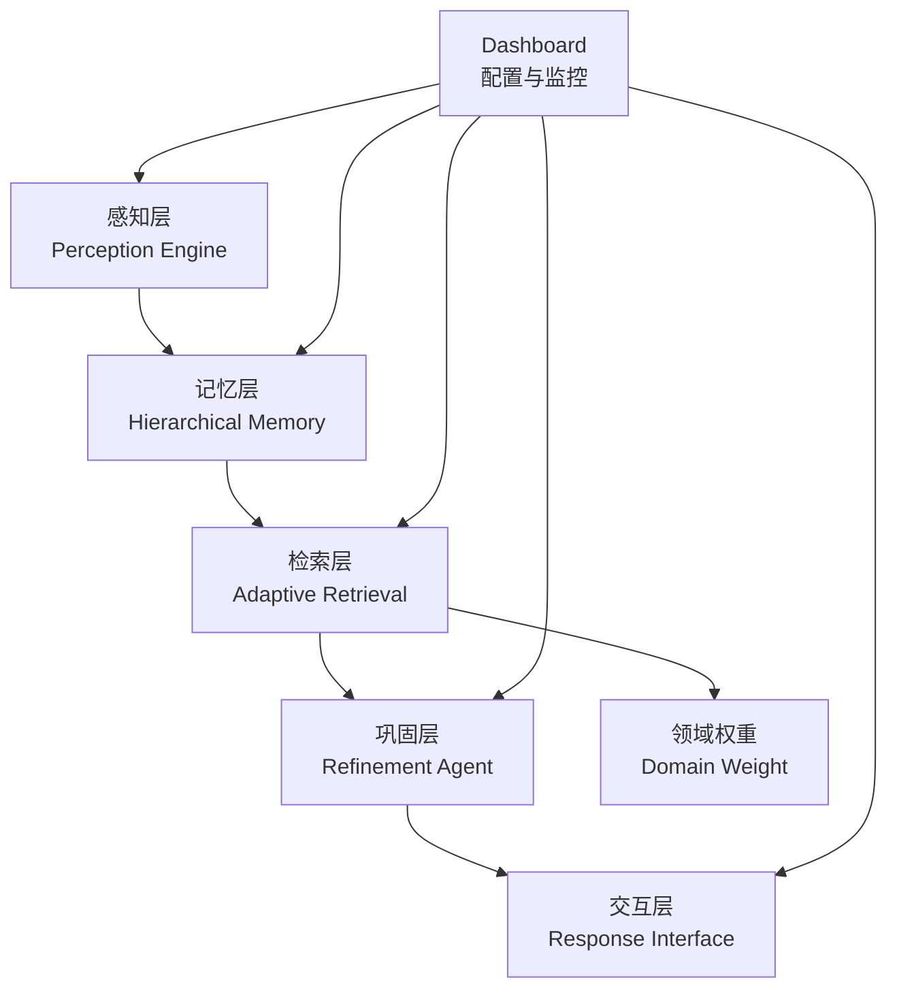
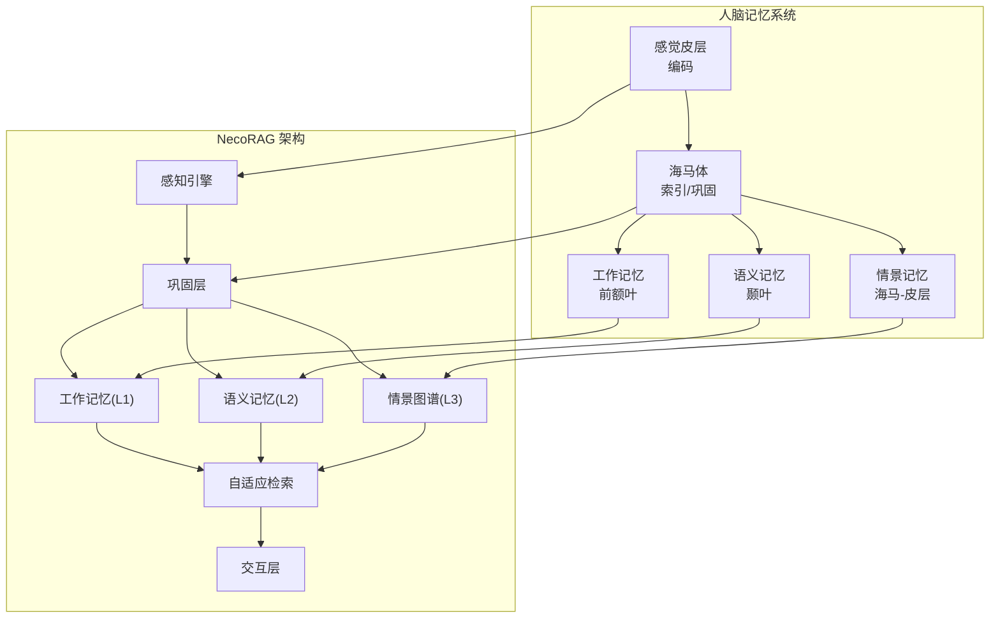
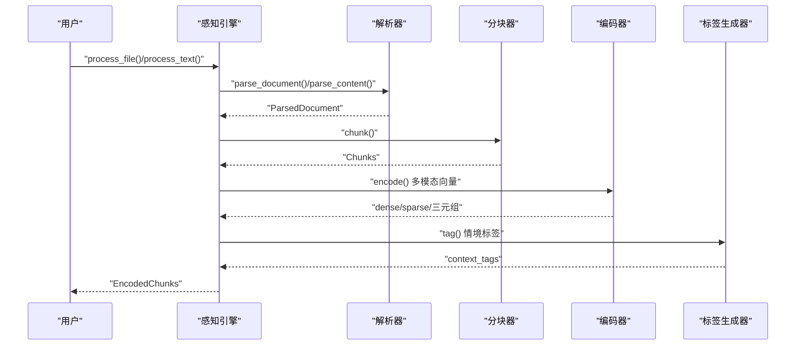
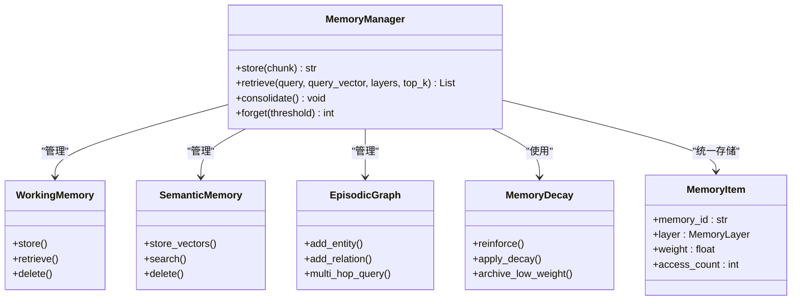
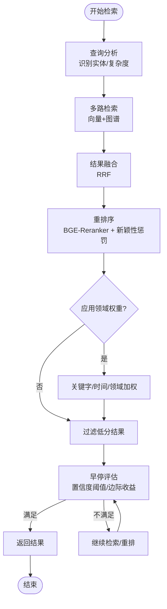
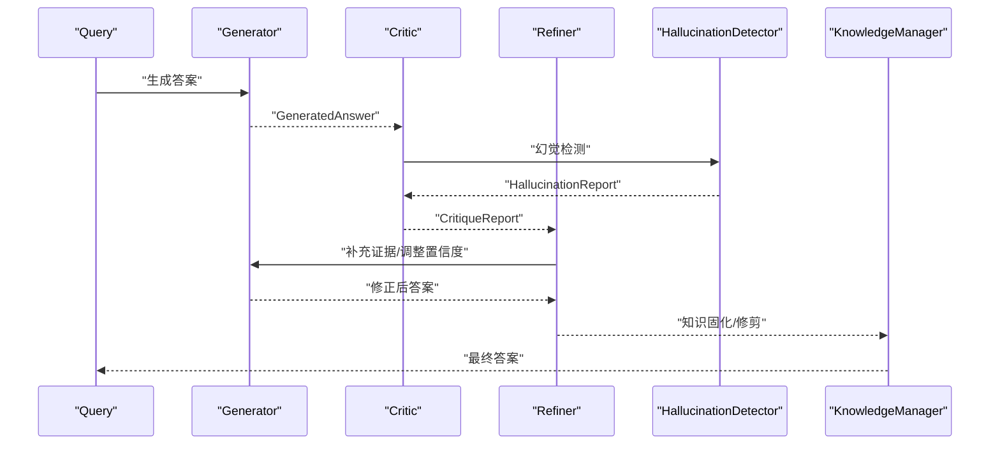
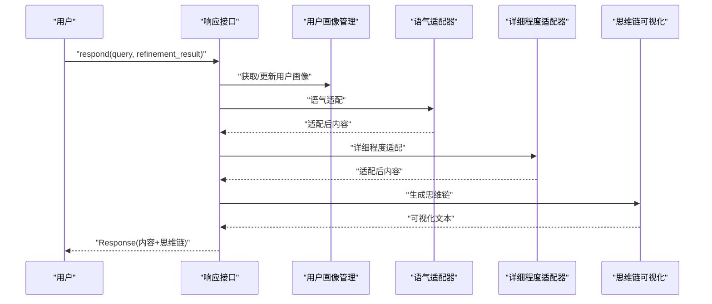
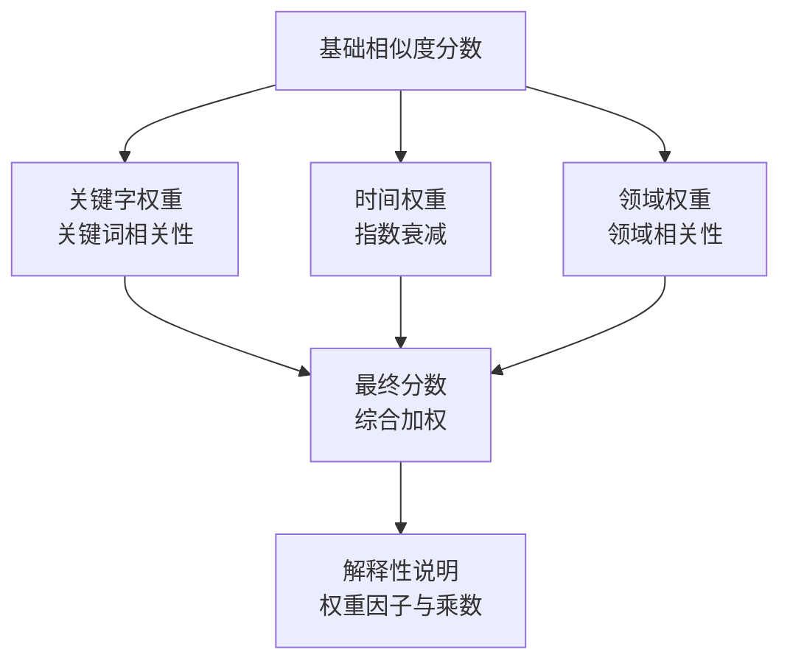
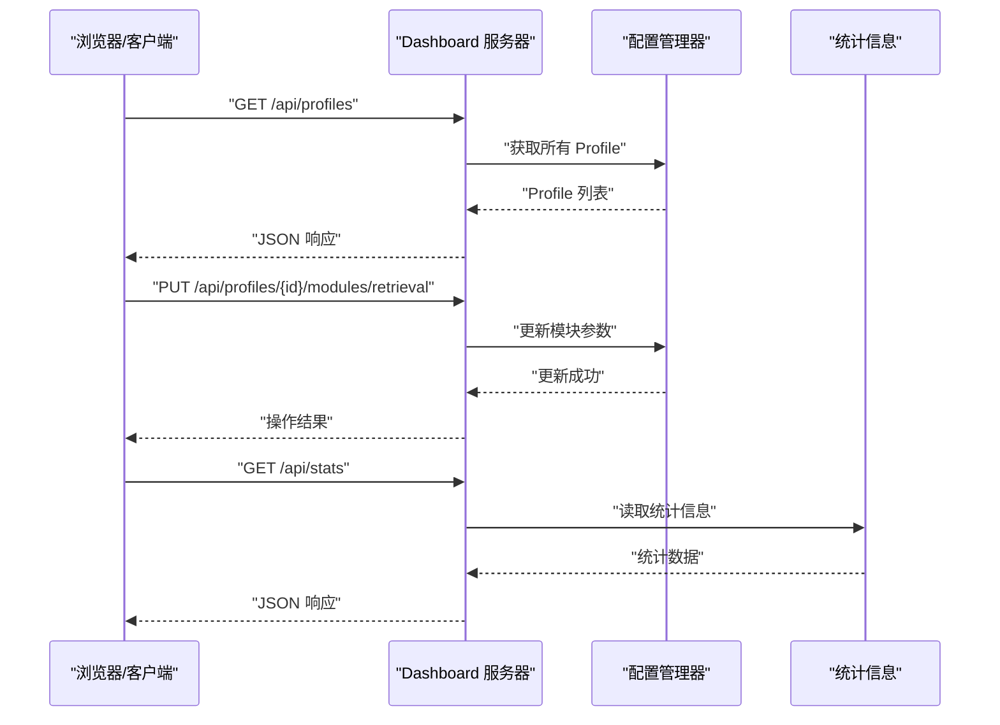
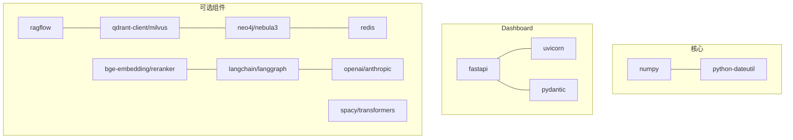

# 项目概述

<cite>
**本文引用的文件**
- [README.md](file://README.md)
- [design.md](file://design/design.md)
- [config.py](file://src/core/config.py)
- [base.py](file://src/core/base.py)
- [engine.py](file://src/perception/engine.py)
- [manager.py](file://src/memory/manager.py)
- [models.py](file://src/memory/models.py)
- [retriever.py](file://src/retrieval/retriever.py)
- [models.py](file://src/retrieval/models.py)
- [refiner.py](file://src/refinement/refiner.py)
- [interface.py](file://src/response/interface.py)
- [weight_calculator.py](file://src/domain/weight_calculator.py)
- [server.py](file://src/dashboard/server.py)
- [requirements.txt](file://requirements.txt)
- [pyproject.toml](file://pyproject.toml)
- [example_usage.py](file://example/example_usage.py)
</cite>

## 目录
1. [引言](#引言)
2. [项目结构](#项目结构)
3. [核心组件](#核心组件)
4. [架构总览](#架构总览)
5. [详细组件分析](#详细组件分析)
6. [依赖分析](#依赖分析)
7. [性能考量](#性能考量)
8. [故障排查指南](#故障排查指南)
9. [结论](#结论)
10. [附录](#附录)

## 引言
NecoRAG 是一个创新的认知型检索增强生成（RAG）框架，其核心愿景是“让 AI 像大脑一样思考”。项目以人脑双系统记忆理论与神经认知科学为基础，构建五层认知架构，实现从感知、记忆、检索、巩固到交互的完整闭环。通过类脑记忆结构、智能早停机制、自我反思与幻觉自检、以及可解释性输出等关键技术，NecoRAG 旨在在保持高效检索的同时，提升答案的可信度与可解释性，并为开发者提供可配置、可扩展、可可视化的工程化平台。

## 项目结构
项目采用模块化分层组织，围绕“五层认知”展开：
- 感知层（Perception Engine）：文档解析、分块、编码与情境标签生成
- 记忆层（Hierarchical Memory）：三层记忆系统（工作记忆、语义记忆、情景图谱）
- 检索层（Adaptive Retrieval）：向量检索、图谱多跳、HyDE 增强、重排序与早停
- 巩固层（Refinement Agent）：生成-批判-修正闭环与幻觉检测
- 交互层（Response Interface）：情境自适应生成与思维链可视化
- 领域权重系统（Domain Weight）：关键字、时间与领域相关性加权融合
- Dashboard：Web 配置与监控系统

**图示来源**
- [README.md:35-85](file://README.md#L35-L85)
- [design.md:314-321](file://design/design.md#L314-L321)

**章节来源**
- [README.md:23-85](file://README.md#L23-L85)
- [design.md:310-370](file://design/design.md#L310-L370)

## 核心组件
- 统一配置管理：提供全局与模块级配置，支持文件与环境变量加载，涵盖 LLM、感知、记忆、检索、巩固、响应与领域权重等子配置。
- 抽象基类：定义各层组件的统一接口，确保实现的一致性与可替换性。
- 感知引擎：文档解析、分块、向量编码与情境标签生成。
- 记忆管理：统一管理 L1（工作记忆）、L2（语义记忆）、L3（情景图谱），并提供记忆衰减与主动遗忘。
- 自适应检索：多路检索、融合、重排序、HyDE 增强、早停与领域权重融合。
- 巩固代理：生成-批判-修正闭环与幻觉检测。
- 响应接口：情境自适应生成、思维链可视化与用户画像适配。
- 领域权重：关键字、时间与领域相关性加权融合，提升检索精准度。
- Dashboard：RESTful API 与 Web UI，支持 Profile 管理、参数配置与实时统计。

**章节来源**
- [config.py:232-284](file://src/core/config.py#L232-L284)
- [base.py:19-571](file://src/core/base.py#L19-L571)
- [engine.py:14-130](file://src/perception/engine.py#L14-L130)
- [manager.py:16-186](file://src/memory/manager.py#L16-L186)
- [retriever.py:122-440](file://src/retrieval/retriever.py#L122-L440)
- [refiner.py:8-64](file://src/refinement/refiner.py#L8-L64)
- [interface.py:16-224](file://src/response/interface.py#L16-L224)
- [weight_calculator.py:56-206](file://src/domain/weight_calculator.py#L56-L206)
- [server.py:43-393](file://src/dashboard/server.py#L43-L393)

## 架构总览
五层认知架构映射到人脑记忆与检索机制：
- 感觉皮层（编码） ←→ 感知引擎（多模态编码与情境标签）
- 海马体（索引/巩固） ←→ 巩固层（Refinement Agent 的反思与固化）
- 工作记忆（前额叶） ←→ L1 工作记忆（Redis，TTL）
- 语义记忆（颞叶） ←→ L2 语义记忆（Qdrant/Milvus，向量检索）
- 情景记忆（海马-皮层） ←→ L3 情景图谱（Neo4j/NebulaGraph，多跳推理）
- 扩散激活（联想网络） ←→ 自适应检索（HyDE、多跳、早停）
- 遗忘机制（记忆修剪） ←→ 动态权重衰减与主动遗忘
- 情绪调节（杏仁核） ←→ 情境标签与重要性权重

**图示来源**
- [design.md:184-206](file://design/design.md#L184-L206)
- [README.md:35-85](file://README.md#L35-L85)

**章节来源**
- [design.md:32-215](file://design/design.md#L32-L215)
- [README.md:35-85](file://README.md#L35-L85)

## 详细组件分析

### 感知层：Perception Engine
- 职责：多模态数据的高精度编码与情境标记，支持文档解析、分块、向量化与情境标签生成。
- 关键点：集成文档解析器、分块策略、向量编码器与情境标签生成器；提供一站式处理接口。
- 技术要点：BGE-M3 向量模型、情境标签（时间、情感、重要性、主题）增强。

**图示来源**
- [engine.py:14-130](file://src/perception/engine.py#L14-L130)

**章节来源**
- [engine.py:14-130](file://src/perception/engine.py#L14-L130)
- [README.md:160-195](file://README.md#L160-L195)

### 记忆层：Hierarchical Memory
- 职责：三层记忆系统统一管理，支持工作记忆（L1）、语义记忆（L2）与情景图谱（L3）。
- 关键点：记忆项统一存储、向量检索、实体关系入库、动态权重衰减与主动遗忘。
- 技术要点：L1（Redis，TTL）、L2（Qdrant/Milvus，向量）、L3（Neo4j/NebulaGraph，图谱）。

**图示来源**
- [manager.py:16-186](file://src/memory/manager.py#L16-L186)
- [models.py:19-67](file://src/memory/models.py#L19-L67)

**章节来源**
- [manager.py:16-186](file://src/memory/manager.py#L16-L186)
- [models.py:19-67](file://src/memory/models.py#L19-L67)
- [README.md:198-244](file://README.md#L198-L244)

### 检索层：Adaptive Retrieval
- 职责：混合检索与重排序，支持 HyDE 增强、多跳检索、新颖性惩罚与早停机制。
- 关键点：早停控制器（置信度阈值与边际收益）、领域权重融合、检索路径追踪。
- 技术要点：向量检索 + 图谱多跳 + 重排序（含新颖性惩罚），支持自适应阈值。

**图示来源**
- [retriever.py:122-440](file://src/retrieval/retriever.py#L122-L440)
- [models.py:9-29](file://src/retrieval/models.py#L9-L29)

**章节来源**
- [retriever.py:122-440](file://src/retrieval/retriever.py#L122-L440)
- [README.md:247-287](file://README.md#L247-L287)

### 巩固层：Refinement Agent
- 职责：生成-批判-修正闭环，结合幻觉检测与知识固化，实现自我反思与知识进化。
- 关键点：生成器-批判者-修正器三元闭环、幻觉检测、置信度调整与迭代控制。
- 技术要点：基于 LLM 的答案修正与置信度反馈，支持异步固化与修剪。

**图示来源**
- [refiner.py:8-64](file://src/refinement/refiner.py#L8-L64)

**章节来源**
- [refiner.py:8-64](file://src/refinement/refiner.py#L8-L64)
- [README.md:290-330](file://README.md#L290-L330)

### 交互层：Response Interface
- 职责：情境自适应生成与可解释性输出，支持用户画像适配、语气与详细程度调整、思维链可视化。
- 关键点：用户画像管理、语气与详细程度适配、思维链可视化生成、响应元数据记录。
- 技术要点：基于工作记忆的用户偏好学习，动态调整输出风格与粒度。

**图示来源**
- [interface.py:16-224](file://src/response/interface.py#L16-L224)

**章节来源**
- [interface.py:16-224](file://src/response/interface.py#L16-L224)
- [README.md:333-377](file://README.md#L333-L377)

### 领域权重系统：Domain Weight
- 职责：整合关键字权重、时间权重与领域相关性权重，计算最终检索权重并支持重排序。
- 关键点：关键字相关性评分、指数时间衰减、领域权重乘数、自定义权重加成。
- 技术要点：综合权重公式与解释性说明，支持批量计算与动态因子调整。

**图示来源**
- [weight_calculator.py:56-206](file://src/domain/weight_calculator.py#L56-L206)

**章节来源**
- [weight_calculator.py:56-206](file://src/domain/weight_calculator.py#L56-L206)
- [README.md:434-474](file://README.md#L434-L474)

### Dashboard：配置与监控
- 职责：提供 Web UI 与 RESTful API，支持 Profile 管理、模块参数配置、实时统计与监控。
- 关键点：Profile CRUD、模块参数更新、统计信息展示、CORS 支持与静态资源服务。
- 技术要点：FastAPI + Uvicorn，支持浏览器访问与 API 文档。

**图示来源**
- [server.py:43-393](file://src/dashboard/server.py#L43-L393)

**章节来源**
- [server.py:43-393](file://src/dashboard/server.py#L43-L393)
- [README.md:380-433](file://README.md#L380-L433)

## 依赖分析
- 核心依赖：NumPy、dateutil（基础计算与时间处理）
- Dashboard 依赖：FastAPI、Uvicorn、Pydantic（Web 服务与数据校验）
- 可选依赖：RAGFlow（文档解析）、Qdrant/Milvus（向量数据库）、Neo4j/NebulaGraph（图数据库）、Redis（缓存）、BGE-M3/BGE-Reranker（嵌入与重排序）、LangChain/LangGraph（编排与 LLM）、OpenAI/Claude（LLM 接入）、spaCy/Transformers（NLP 工具）

**图示来源**
- [requirements.txt:1-57](file://requirements.txt#L1-L57)
- [pyproject.toml:27-30](file://pyproject.toml#L27-L30)

**章节来源**
- [requirements.txt:1-57](file://requirements.txt#L1-L57)
- [pyproject.toml:27-30](file://pyproject.toml#L27-L30)

## 性能考量
- 检索准确率（Recall@K）：相较传统向量 RAG 提升 +20%
- 幻觉率：< 5%（通过巩固层自检）
- 简单查询延迟：< 800ms（首字延迟，早停机制）
- 复杂查询延迟：< 1500ms（多跳 + 重排）
- 上下文压缩率：-40%（记忆衰减与主动遗忘）

这些指标体现了项目在“敏捷响应”与“类脑思考”方面的工程化成果。

**章节来源**
- [README.md:465-474](file://README.md#L465-L474)

## 故障排查指南
- 配置加载失败：确认环境变量前缀与配置文件路径，检查枚举类型转换与嵌套属性设置。
- 检索结果为空：检查查询向量是否正确生成、领域权重是否启用、阈值设置是否过高。
- 早停过早：调低置信度阈值或放宽边际收益阈值，或增加最小结果数量。
- 图谱检索无效：确认图数据库连接、实体抽取与关系入库是否正常。
- Dashboard 无法访问：检查端口占用、CORS 配置与静态资源路径。
- 用户画像异常：确认工作记忆可用性与用户 ID 规范化。

**章节来源**
- [config.py:288-327](file://src/core/config.py#L288-L327)
- [retriever.py:30-120](file://src/retrieval/retriever.py#L30-L120)
- [server.py:79-93](file://src/dashboard/server.py#L79-L93)

## 结论
NecoRAG 以神经认知科学为理论基石，构建了“五层认知”的工程化框架，将人脑的记忆与检索机制映射到可执行的系统组件中。通过类脑记忆结构、智能早停、自我反思与幻觉自检、可解释性输出与可视化、以及 Dashboard 的配置与监控能力，项目在保证检索效率的同时，显著提升了答案的可信度与可解释性。对于初学者，项目提供了清晰的模块划分与示例；对于开发者，统一的抽象接口、可替换的实现与完善的配置体系，使其易于扩展与定制。

## 附录
- 快速开始与基础使用示例可参考示例脚本与 README 中的使用说明。
- 开发与构建信息可参考 pyproject.toml 与 requirements.txt。

**章节来源**
- [example_usage.py:1-252](file://example/example_usage.py#L1-L252)
- [README.md:87-157](file://README.md#L87-L157)
- [pyproject.toml:1-59](file://pyproject.toml#L1-L59)
- [requirements.txt:1-57](file://requirements.txt#L1-L57)