# 项目概述

<cite>
**本文引用的文件**
- [README.md](file://README.md)
- [QUICKSTART.md](file://QUICKSTART.md)
- [src/necorag.py](file://src/necorag.py)
- [src/core/base.py](file://src/core/base.py)
- [src/memory/manager.py](file://src/memory/manager.py)
- [src/retrieval/smart_routing/engine.py](file://src/retrieval/smart_routing/engine.py)
- [src/refinement/models.py](file://src/refinement/models.py)
- [src/response/models.py](file://src/response/models.py)
- [src/intent/models.py](file://src/intent/models.py)
- [src/domain/README.md](file://src/domain/README.md)
- [src/knowledge_evolution/README.md](file://src/knowledge_evolution/README.md)
- [src/monitoring/README.md](file://src/monitoring/README.md)
- [src/dashboard/README.md](file://src/dashboard/README.md)
- [design/architecture_framework.md](file://design/architecture_framework.md)
</cite>

## 目录
1. [项目简介](#项目简介)
2. [项目结构](#项目结构)
3. [核心组件](#核心组件)
4. [架构总览](#架构总览)
5. [详细组件分析](#详细组件分析)
6. [依赖关系分析](#依赖关系分析)
7. [性能考量](#性能考量)
8. [故障排查指南](#故障排查指南)
9. [结论](#结论)
10. [附录](#附录)

## 项目简介
NecoRAG 是一个创新的认知型检索增强生成（RAG）框架，模拟人脑双系统记忆与神经认知科学原理，采用五层认知架构实现从感知到交互的完整认知闭环。项目具备类脑记忆结构（三层记忆系统）、智能早停机制、幻觉自检闭环、思维链可视化、配置管理与可视化调试面板、监控告警、安全与权限、插件扩展系统等核心特性，并提供 Docker 一键部署与 Dashboard 可视化配置。

- **核心理念**：以类脑记忆与认知科学为指导，构建“感知-记忆-检索-巩固-交互”的完整闭环，使系统具备类似人类的直觉检索、知识巩固与情境自适应响应能力。
- **技术创新点**：
  - 三层记忆系统（工作记忆 L1 + 语义记忆 L2 + 情景图谱 L3），并引入记忆权重衰减与主动遗忘机制。
  - 智能路由与策略融合引擎（v3.3 新增），整合意图识别、用户画像与策略融合，实现 CoT 深度动态调节与多策略并行融合。
  - 领域权重系统（v3.3 新增），融合时间衰减、领域相关性与意图匹配，提升检索精准度。
  - 知识演化系统（v3.3 新增），支持实时/定时/事件驱动的更新与健康度监控。
  - 可解释性输出与可视化调试面板，提供思维链可视化、实时监控与 A/B 测试能力。

- **版本与状态**：当前版本 v3.3.0-alpha，项目处于 Alpha 阶段，已完成五层架构与多项 v3.3 新增模块的集成与验证。

**章节来源**
- [README.md:25-183](file://README.md#L25-L183)
- [QUICKSTART.md:1-547](file://QUICKSTART.md#L1-L547)

## 项目结构
项目采用模块化分层组织，围绕五层认知架构划分核心模块，并辅以支撑系统（意图分析、领域权重、知识演化、监控告警、安全与插件扩展）。核心模块包括：
- 感知层（Perception Engine）：文档解析、弹性分块、向量编码与情境标签生成。
- 记忆层（Hierarchical Memory）：L1 工作记忆（Redis）、L2 语义记忆（Qdrant/Milvus）、L3 情景图谱（Neo4j/NebulaGraph）。
- 检索层（Adaptive Retrieval）：多策略检索、HyDE 增强、多跳图谱检索、重排序与早停机制。
- 巩固层（Refinement Agent）：Generator-Critic-Refiner 幻觉自检闭环，异步知识固化与记忆修剪。
- 交互层（Response Interface）：用户画像适配、语气风格与详细程度控制、思维链可视化。
- 支撑系统（v3.3 新增）：意图分析、领域权重、知识演化、监控告警、安全与插件扩展、Interface 模块与 Dashboard。

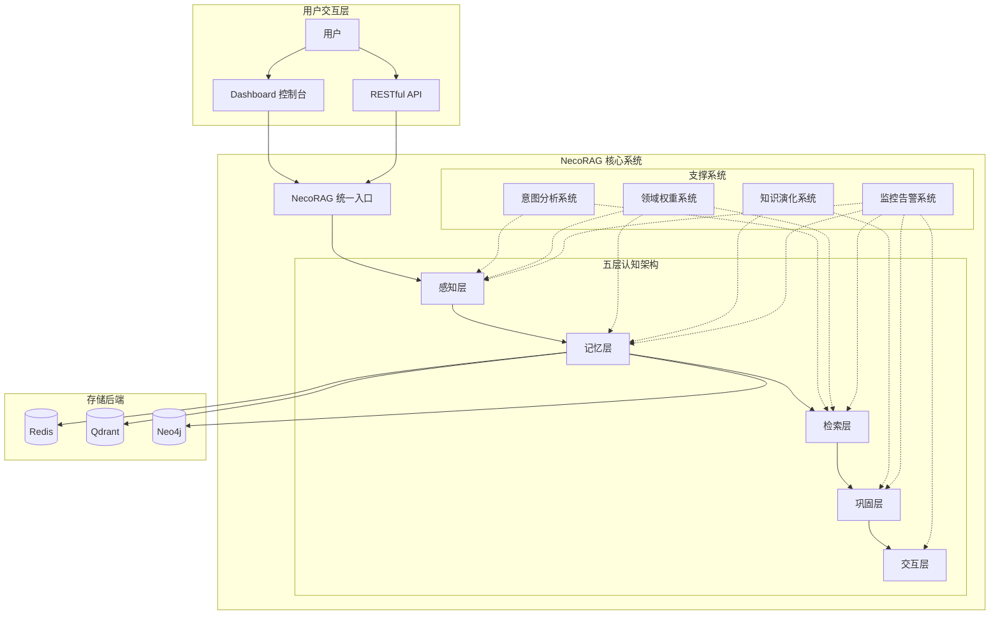

**图示来源**
- [design/architecture_framework.md:26-81](file://design/architecture_framework.md#L26-L81)

**章节来源**
- [design/architecture_framework.md:1-1313](file://design/architecture_framework.md#L1-L1313)
- [README.md:52-183](file://README.md#L52-L183)

## 核心组件
- 统一入口类 NecoRAG：提供文档导入、查询检索、配置管理与知识演化接口，内部协调感知、记忆、检索、巩固与交互各层组件。
- 抽象基类体系：定义感知层（解析器、分块器、编码器、标签生成器）、记忆层（存储、向量与图存储）、检索层（检索器、重排序器）、巩固层（生成器、批评家、精炼器、幻觉检测器）、交互层（响应适配器）等统一接口，确保实现的一致性与可替换性。
- 记忆管理器：统一管理 L1、L2、L3 三层记忆，支持存储、检索、记忆巩固与主动遗忘。
- 智能路由与策略融合引擎：三层决策架构（意图识别→用户画像→策略融合），支持多策略并行融合、CoT 动态调节与早停降级。
- 幻觉检测与精炼闭环：Generator-Critic-Refiner 三阶段验证，结合幻觉检测器与知识固化/修剪机制。
- 响应接口：用户画像适配、语气风格与详细程度控制、思维链可视化。
- 领域权重系统：融合关键字权重、时间衰减、领域相关性与意图匹配，提升检索精准度。
- 知识演化系统：实时/定时/事件驱动更新、健康度指标与可视化仪表盘。
- 监控告警系统：系统与应用指标收集、健康检查、告警管理与可视化仪表板。
- Dashboard：Web 配置管理与可视化调试面板，支持 Profile 管理、参数配置、统计监控与实时推送。

**章节来源**
- [src/necorag.py:51-800](file://src/necorag.py#L51-L800)
- [src/core/base.py:30-800](file://src/core/base.py#L30-L800)
- [src/memory/manager.py:20-212](file://src/memory/manager.py#L20-L212)
- [src/retrieval/smart_routing/engine.py:34-274](file://src/retrieval/smart_routing/engine.py#L34-L274)
- [src/refinement/models.py:9-66](file://src/refinement/models.py#L9-L66)
- [src/response/models.py:13-31](file://src/response/models.py#L13-L31)
- [src/intent/models.py:12-231](file://src/intent/models.py#L12-L231)
- [src/domain/README.md:1-516](file://src/domain/README.md#L1-L516)
- [src/knowledge_evolution/README.md:1-579](file://src/knowledge_evolution/README.md#L1-L579)
- [src/monitoring/README.md:1-373](file://src/monitoring/README.md#L1-L373)
- [src/dashboard/README.md:1-435](file://src/dashboard/README.md#L1-L435)

## 架构总览
五层认知架构从感知层到交互层形成完整闭环：
- 感知层：文档解析、弹性分块、向量编码与情境标签生成，为后续记忆与检索提供高质量输入。
- 记忆层：L1 工作记忆（Redis，TTL 过期）、L2 语义记忆（Qdrant/Milvus，向量检索）、L3 情景图谱（Neo4j，多跳推理），并引入记忆衰减与主动遗忘机制。
- 检索层：多策略检索（向量/关键词/图谱/HyDE）、重排序与新颖性惩罚、早停机制，结合智能路由与策略融合引擎实现个性化与高效检索。
- 巩固层：Generator-Critic-Refiner 闭环，配合幻觉检测器与知识固化/修剪，持续提升答案质量与知识库健康度。
- 交互层：用户画像适配、语气风格与详细程度控制、思维链可视化，提供情境自适应与可解释性输出。

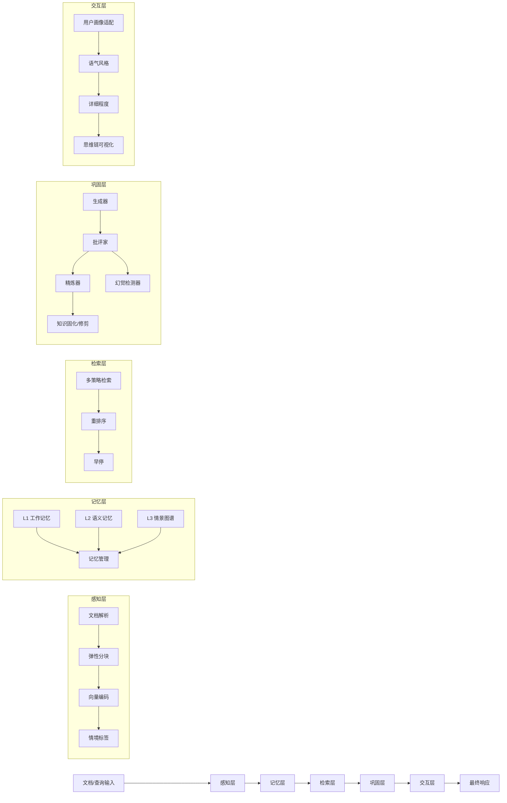

**图示来源**
- [design/architecture_framework.md:89-162](file://design/architecture_framework.md#L89-L162)

**章节来源**
- [design/architecture_framework.md:85-1313](file://design/architecture_framework.md#L85-L1313)

## 详细组件分析

### 类脑记忆结构设计
- 三层记忆系统模拟人类记忆层次：
  - L1 工作记忆（Redis）：会话上下文与用户意图轨迹，TTL 自动过期，适合短期与高频访问。
  - L2 语义记忆（Qdrant/Milvus）：高维向量存储，支持模糊匹配与直觉检索。
  - L3 情景图谱（Neo4j/NebulaGraph）：实体关系网络，支持多跳推理与因果关系分析。
- 记忆衰减与主动遗忘：
  - 引入权重衰减机制：weight(t) = initial_weight × e^(-λt) × access_frequency，随时间与访问频率动态调整。
  - 定期执行记忆巩固与低权重归档，维持知识库的时效性与稳定性。

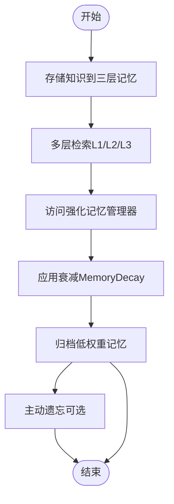

**图示来源**
- [src/memory/manager.py:124-202](file://src/memory/manager.py#L124-L202)

**章节来源**
- [src/memory/manager.py:20-212](file://src/memory/manager.py#L20-L212)
- [README.md:434-470](file://README.md#L434-L470)

### 五层认知架构实现
- 感知层：集成 RAGFlow 文档解析、BGE-M3 多维向量化（稠密/稀疏/实体三元组）、情境标签生成，确保输入质量。
- 记忆层：统一存储接口，支持向量与图谱的协同检索；记忆管理器负责存储、检索、巩固与遗忘。
- 检索层：HyDE 增强、多跳图谱检索、新颖性重排序与早停机制，结合智能路由与策略融合引擎实现个性化与高效检索。
- 巩固层：Generator-Critic-Refiner 三阶段验证，幻觉检测器提供事实一致性、逻辑连贯性与证据支撑度评估。
- 交互层：用户画像适配（专业度、偏好领域）、语气风格与详细程度控制、思维链可视化，提供情境自适应与可解释性输出。

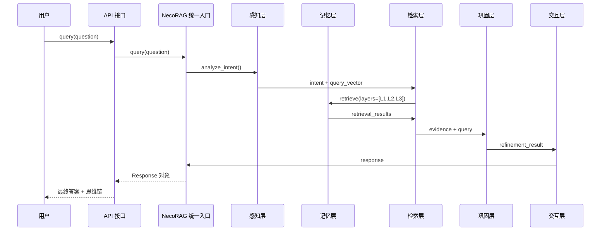

**图示来源**
- [design/architecture_framework.md:642-693](file://design/architecture_framework.md#L642-L693)

**章节来源**
- [src/necorag.py:390-513](file://src/necorag.py#L390-L513)
- [design/architecture_framework.md:638-693](file://design/architecture_framework.md#L638-L693)

### 智能路由与策略融合引擎
- 三层决策架构：
  - 意图识别层：识别问题类型与复杂度，提供检索策略模板。
  - 用户画像层：匹配用户专业度与偏好，动态调节策略权重。
  - 策略融合层：多策略并行执行与融合，支持 CoT 深度动态调节与早停降级。
- 关键能力：
  - 七类语义意图识别（事实查询、比较分析、推理演绎、概念解释、摘要总结、操作指导、探索发散）。
  - 个性化专业度适配（专家/中级/新手）。
  - 多策略并行融合与早停降级机制。
  - 实时反馈闭环学习系统。

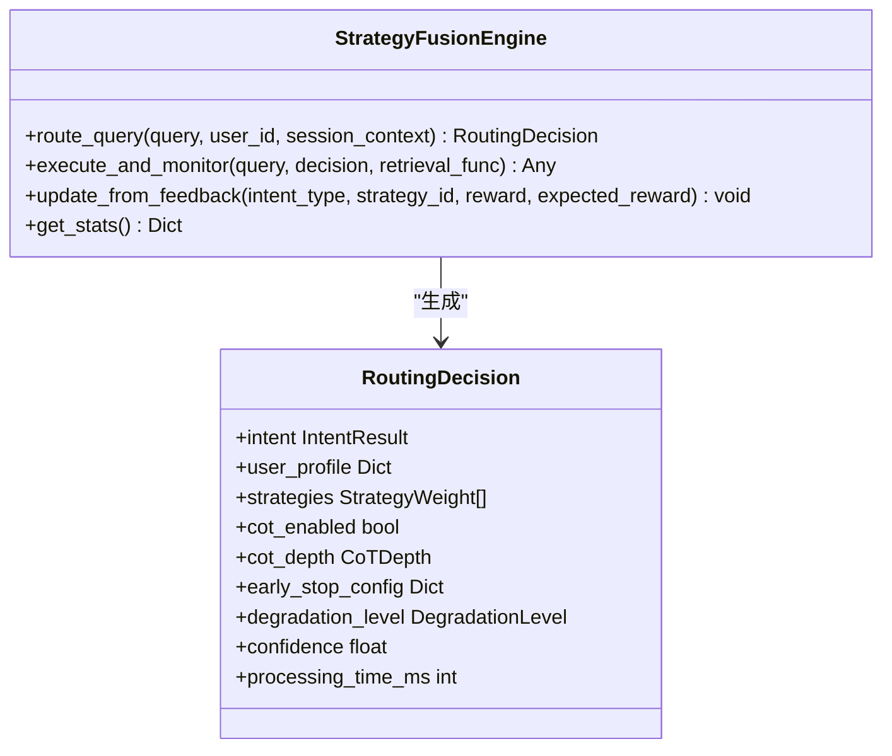

**图示来源**
- [src/retrieval/smart_routing/engine.py:20-130](file://src/retrieval/smart_routing/engine.py#L20-L130)

**章节来源**
- [src/retrieval/smart_routing/engine.py:34-274](file://src/retrieval/smart_routing/engine.py#L34-L274)
- [README.md:104-183](file://README.md#L104-L183)

### 领域权重系统
- 多因子融合权重计算：final_weight = base_score × α × keyword_weight × β × temporal_weight × γ × domain_weight × δ × intent_weight。
- 关键模块：
  - 关键字权重：基于领域关键字词典与权重分级。
  - 时间权重：指数衰减模型，按领域设定衰减系数。
  - 领域相关性：基于层次结构的距离映射权重。
  - 意图匹配权重：文档类型与查询意图的匹配度。
- 支持经典知识保护（不受时间衰减影响）。

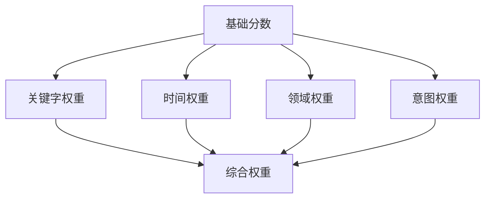

**图示来源**
- [src/domain/README.md:24-54](file://src/domain/README.md#L24-L54)

**章节来源**
- [src/domain/README.md:1-516](file://src/domain/README.md#L1-L516)

### 知识演化系统
- 更新模式：
  - 实时更新：L1 工作记忆、热点索引，延迟 <2 秒。
  - 定时批量更新：L2/L3 向量索引重建、图谱关系维护与候选合并。
  - 事件驱动更新：外部数据源变更、健康度下降触发修复。
- 指标与可视化：
  - 规模、新鲜度、质量、连通性指标，综合健康度评分。
  - Dashboard 提供健康仪表盘、增长趋势、领域覆盖热力图、知识衰减雷达图与更新时间线。

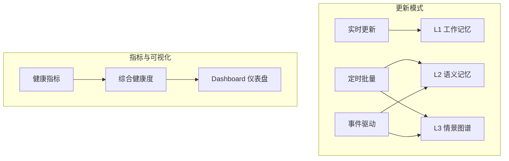

**图示来源**
- [src/knowledge_evolution/README.md:28-100](file://src/knowledge_evolution/README.md#L28-L100)

**章节来源**
- [src/knowledge_evolution/README.md:1-579](file://src/knowledge_evolution/README.md#L1-L579)

### 幻觉自检与精炼闭环
- Generator-Critic-Refiner 三阶段验证：
  - 生成器：基于证据生成答案。
  - 批评家：事实一致性、逻辑连贯性、证据支撑度评估。
  - 精炼器：根据评估结果优化表达与结构。
- 幻觉检测器：提供幻觉检测报告，包含事实一致性、逻辑连贯性、证据支撑度与问题列表。
- 异步知识固化与记忆修剪：定期执行知识缺口分析、碎片合并与图谱更新，维持知识库质量。

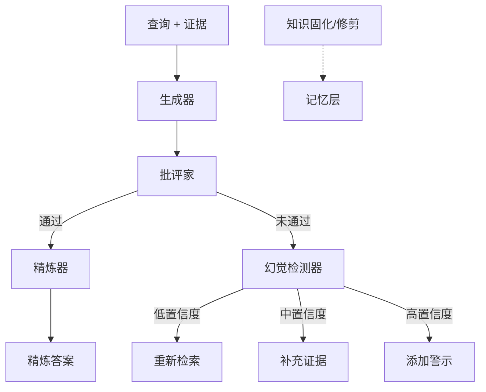

**图示来源**
- [src/refinement/models.py:9-66](file://src/refinement/models.py#L9-L66)

**章节来源**
- [src/refinement/models.py:9-66](file://src/refinement/models.py#L9-L66)
- [design/architecture_framework.md:418-527](file://design/architecture_framework.md#L418-L527)

### 响应接口与思维链可视化
- 用户画像适配：专业度评估、偏好学习与历史交互分析。
- 语气风格与详细程度控制：专业严谨、亲切友好、幽默轻松、正式官方；详细程度分级（极简→简洁→详细→深入）。
- 思维链可视化：检索路径、证据来源与推理过程，提供可解释性输出。

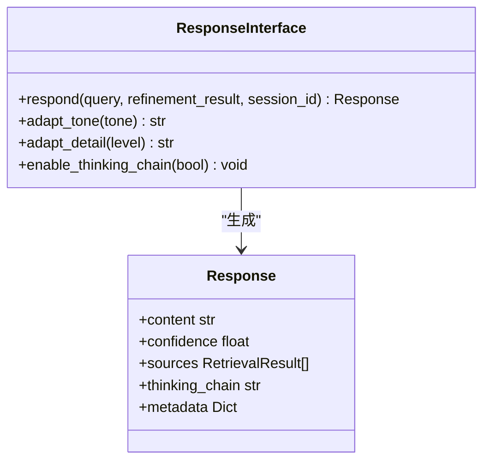

**图示来源**
- [src/response/models.py:13-31](file://src/response/models.py#L13-L31)

**章节来源**
- [src/response/models.py:13-31](file://src/response/models.py#L13-L31)
- [README.md:562-605](file://README.md#L562-L605)

### Dashboard 配置管理与可视化调试面板
- Profile 管理：创建、加载、切换、导入导出与复制删除。
- 模块参数配置：感知层、记忆层、检索层、巩固层、交互层参数实时编辑。
- 统计监控：文档/块统计、查询历史、性能指标与知识库健康仪表盘。
- 可视化调试面板：思维路径可视化、实时监控、A/B 测试与参数调优面板。

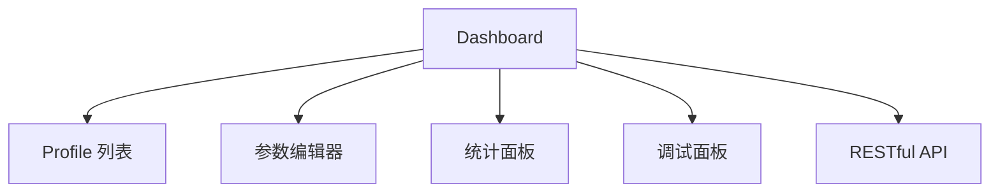

**图示来源**
- [src/dashboard/README.md:27-54](file://src/dashboard/README.md#L27-L54)

**章节来源**
- [src/dashboard/README.md:1-435](file://src/dashboard/README.md#L1-L435)

## 依赖关系分析
- 统一入口类 NecoRAG 作为核心协调者，依赖感知、记忆、检索、巩固与交互各层组件，并集成意图分析、领域权重、知识演化、监控告警与插件扩展等支撑模块。
- 抽象基类体系确保各层组件的可替换性与一致性，便于扩展与维护。
- 智能路由与策略融合引擎与意图分析系统紧密耦合，共同实现个性化检索策略。
- 领域权重系统贯穿感知与检索层，提升检索精准度。
- 知识演化系统与记忆层、巩固层协同，维持知识库健康度。
- 监控告警系统覆盖全栈，提供系统与应用指标、健康检查与可视化仪表板。
- Dashboard 作为配置与可视化入口，连接用户与系统各模块。

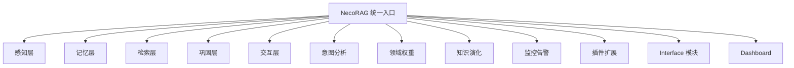

**图示来源**
- [src/necorag.py:123-148](file://src/necorag.py#L123-L148)

**章节来源**
- [src/necorag.py:123-220](file://src/necorag.py#L123-L220)

## 性能考量
- 记忆层延迟：L1（毫秒级）、L2（十毫秒级）、L3（几十毫秒级），满足实时响应需求。
- 检索层优化：多策略并行、重排序与早停机制，降低无效计算与延迟。
- 知识演化：批处理与异步更新，减少对在线查询的影响。
- 监控告警：20+ 系统指标实时监控，支持健康检查与告警抑制，保障系统稳定性。
- 可解释性输出：思维链可视化与证据来源追溯，便于性能分析与优化。

[本节为通用性能讨论，无需引用具体文件]

## 故障排查指南
- Dashboard 启动失败：检查端口占用并更换端口，或使用 --host/--port 参数指定监听地址与端口。
- 配置保存失败：检查配置目录权限或更换配置目录。
- API 调用返回 404：确认 Profile ID 存在，先获取所有 Profile 列表再进行操作。
- 指标收集失败：检查 psutil 权限或升级依赖版本。
- 健康检查超时：调整超时配置或优化检查逻辑。
- 告警重复发送：检查告警去重逻辑或清理缓存。

**章节来源**
- [src/dashboard/README.md:399-431](file://src/dashboard/README.md#L399-L431)
- [src/monitoring/README.md:285-321](file://src/monitoring/README.md#L285-L321)

## 结论
NecoRAG 以类脑记忆与认知科学为指导，构建了从感知到交互的完整认知闭环，具备智能早停、幻觉自检、思维链可视化、领域权重融合、知识演化与可视化调试面板等核心能力。v3.3.0-alpha 版本进一步增强了智能路由与策略融合、意图分析、监控告警与安全模块，提供 Docker 一键部署与 Dashboard 可视化配置，为生产环境提供了强大的工程化能力。项目当前处于 Alpha 阶段，后续将持续推进异步知识固化、插件市场与移动端应用等方向。

[本节为总结性内容，无需引用具体文件]

## 附录

### 快速开始指南
- 环境要求：Python 3.9+，Linux/macOS/Windows，最低内存 4GB，推荐 8GB+，至少 2GB 可用空间。
- 安装方式：支持 uv、venv、Conda 三种方式安装依赖，或使用 Docker 一键启动。
- 基础使用：初始化感知、记忆、检索、巩固与交互组件，执行文档导入与查询流程，查看思维链可视化与调试面板。
- Dashboard：启动后访问 Web 界面进行 Profile 管理、参数配置与统计监控。

**章节来源**
- [README.md:185-382](file://README.md#L185-L382)
- [QUICKSTART.md:15-86](file://QUICKSTART.md#L15-L86)

### 开发路线图与未来规划
- Phase 1（MVP）：完成感知、记忆、检索、核心 SDK 与 Dashboard。
- Phase 2（大脑注入）：集成 LangGraph 实现巩固层闭环，完善意图分析、领域权重、知识演化、监控告警、安全、自适应优化、插件扩展与 Interface 模块，完成智能路由与策略融合引擎。
- Phase 3（进化与生态）：推进异步知识固化与自动遗忘、可视化调试面板、插件市场与扩展生态、企业级功能增强与移动端应用。
- 短期优化：增加可视化图表类型、完善移动端体验、集成更多监控工具、提升测试覆盖率。

**章节来源**
- [README.md:736-777](file://README.md#L736-L777)
- [QUICKSTART.md:510-520](file://QUICKSTART.md#L510-L520)