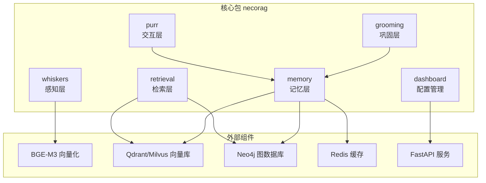
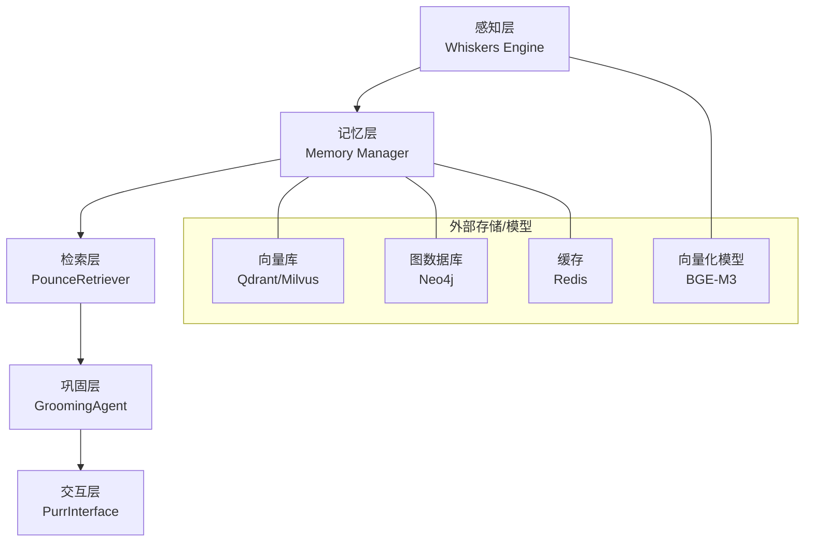
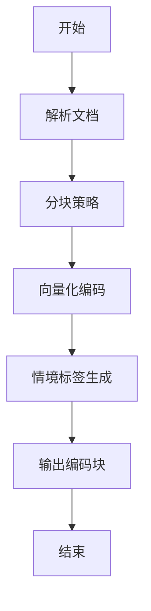
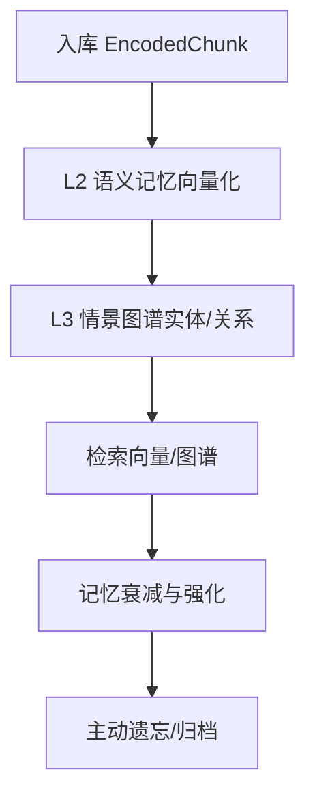
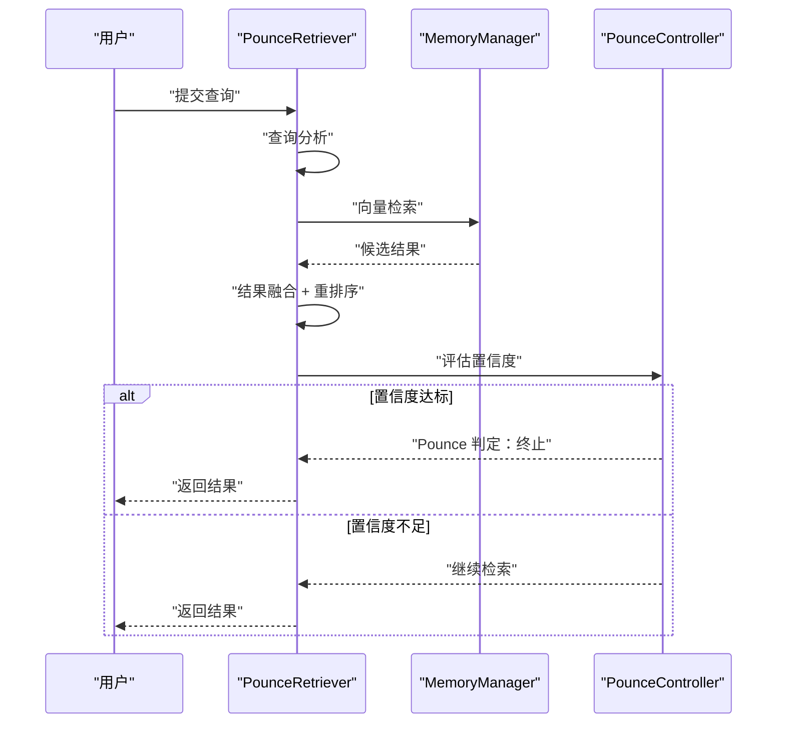
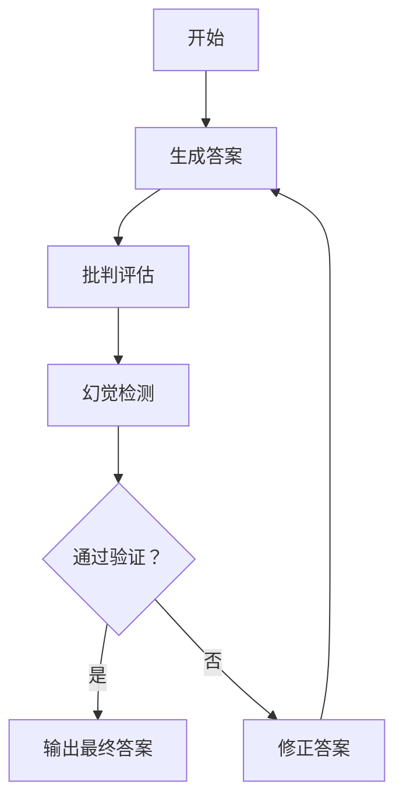
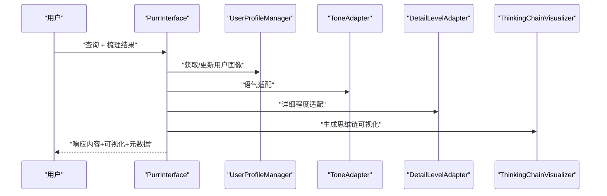
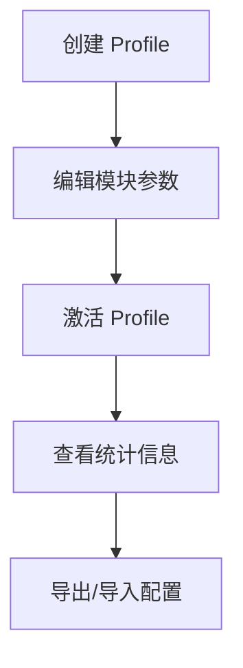
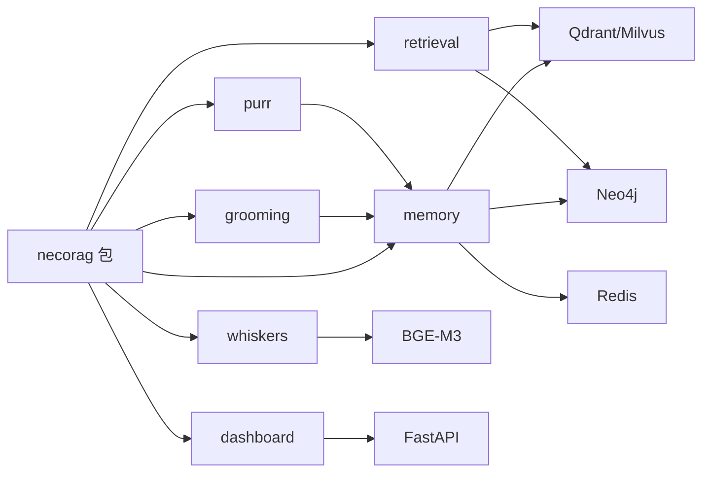

# 项目概述

<cite>
**本文引用的文件**   
- [src/__init__.py](file://src/__init__.py)
- [pyproject.toml](file://pyproject.toml)
- [QUICKSTART.md](file://QUICKSTART.md)
- [PROJECT_COMPLETE.md](file://PROJECT_COMPLETE.md)
- [src/whiskers/README.md](file://src/whiskers/README.md)
- [src/memory/README.md](file://src/memory/README.md)
- [src/retrieval/README.md](file://src/retrieval/README.md)
- [src/purr/README.md](file://src/purr/README.md)
- [src/dashboard/README.md](file://src/dashboard/README.md)
- [src/whiskers/engine.py](file://src/whiskers/engine.py)
- [src/memory/manager.py](file://src/memory/manager.py)
- [src/retrieval/retriever.py](file://src/retrieval/retriever.py)
- [src/grooming/agent.py](file://src/grooming/agent.py)
- [src/purr/interface.py](file://src/purr/interface.py)
</cite>

## 目录
1. [简介](#简介)
2. [项目结构](#项目结构)
3. [核心组件](#核心组件)
4. [架构总览](#架构总览)
5. [详细组件分析](#详细组件分析)
6. [依赖分析](#依赖分析)
7. [性能考虑](#性能考虑)
8. [故障排查指南](#故障排查指南)
9. [结论](#结论)
10. [附录](#附录)

## 简介
NecoRAG 是一个受神经认知科学与猫科动物直觉启发的下一代检索增强生成（RAG）框架。其核心价值主张在于：
- 以“感知—记忆—检索—巩固—交互”的五层架构，构建从数据到智能输出的完整认知闭环
- 通过创新的记忆衰减机制、Pounce 智能终止检索、思维链可视化等能力，提升准确性、效率与可解释性
- 提供模块化设计与 Dashboard 配置管理，便于快速部署与参数调优

项目当前处于 MVP 阶段，已完成五层模块与 Dashboard 的设计与实现，并配套了完整的使用指南、示例与文档。

章节来源
- [PROJECT_COMPLETE.md:13-410](file://PROJECT_COMPLETE.md#L13-L410)
- [QUICKSTART.md:1-325](file://QUICKSTART.md#L1-L325)

## 项目结构
NecoRAG 采用按层划分的模块化组织方式，核心目录与职责如下：
- src/whiskers：感知层（文档解析、分块、向量化、情境标签）
- src/memory：记忆层（工作记忆、语义记忆、情景图谱、记忆衰减）
- src/retrieval：检索层（向量/图谱/HyDE/重排序/Pounce）
- src/grooming：巩固层（生成—批判—修正闭环、幻觉检测、知识固化与修剪）
- src/purr：交互层（用户画像、语气/详细程度适配、思维链可视化）
- src/dashboard：Web 配置管理（Profile 管理、参数编辑、统计监控）
- docs/、design/、logo/：文档与设计资产
- example/、tools/：示例与工具脚本
- pyproject.toml、requirements.txt：项目配置与依赖

图表来源
- [src/whiskers/README.md:137-142](file://src/whiskers/README.md#L137-L142)
- [src/memory/README.md:231-235](file://src/memory/README.md#L231-L235)
- [src/retrieval/README.md:338-343](file://src/retrieval/README.md#L338-L343)
- [src/dashboard/README.md:381-412](file://src/dashboard/README.md#L381-L412)

章节来源
- [PROJECT_COMPLETE.md:43-138](file://PROJECT_COMPLETE.md#L43-L138)
- [src/__init__.py:9-25](file://src/__init__.py#L9-L25)

## 核心组件
- Whiskers Engine（感知层）：文档解析、分块、向量化与情境标签生成，统一输出编码块
- Memory Manager（记忆层）：三层记忆协同（工作/语义/情景），支持记忆衰减与主动遗忘
- PounceRetriever（检索层）：多路检索融合、重排序、Novelty 惩罚与 Pounce 智能终止
- GroomingAgent（巩固层）：生成—批判—修正闭环，幻觉检测与知识固化/修剪
- PurrInterface（交互层）：用户画像驱动的语气/详细程度适配与思维链可视化
- Dashboard（配置管理）：Profile 生命周期管理、模块参数在线编辑与统计监控

章节来源
- [src/whiskers/README.md:1-158](file://src/whiskers/README.md#L1-L158)
- [src/memory/README.md:1-244](file://src/memory/README.md#L1-L244)
- [src/retrieval/README.md:1-352](file://src/retrieval/README.md#L1-L352)
- [src/grooming/agent.py:16-151](file://src/grooming/agent.py#L16-L151)
- [src/purr/README.md:1-398](file://src/purr/README.md#L1-L398)
- [src/dashboard/README.md:1-417](file://src/dashboard/README.md#L1-L417)

## 架构总览
五层架构从底层到上层依次为：感知层（Whiskers）、记忆层（Memory）、检索层（Retrieval）、巩固层（Grooming）、交互层（Purr）。各层职责清晰、边界明确，通过统一的数据模型与接口协作，形成可解释、可优化的认知闭环。

图表来源
- [src/whiskers/README.md:29-55](file://src/whiskers/README.md#L29-L55)
- [src/memory/README.md:9-39](file://src/memory/README.md#L9-L39)
- [src/retrieval/README.md:11-41](file://src/retrieval/README.md#L11-L41)
- [src/purr/README.md:11-46](file://src/purr/README.md#L11-L46)

## 详细组件分析

### 感知层（Whiskers Engine）
- 职责：对多模态输入进行解析、分块、向量化与情境标签生成
- 关键流程：解析 → 分块 → 向量化（稠密/稀疏/实体三元组）→ 打标 → 输出编码块
- 创新点：情境标签（时间/情感/重要性/主题）模拟猫的“胡须感知”，提升检索与记忆的语义质量

图表来源
- [src/whiskers/engine.py:14-130](file://src/whiskers/engine.py#L14-L130)
- [src/whiskers/README.md:29-55](file://src/whiskers/README.md#L29-L55)

章节来源
- [src/whiskers/engine.py:14-130](file://src/whiskers/engine.py#L14-L130)
- [src/whiskers/README.md:29-158](file://src/whiskers/README.md#L29-L158)

### 记忆层（Memory Manager）
- 职责：统一管理三层记忆（工作/语义/情景），并提供记忆衰减与主动遗忘
- 关键流程：入库 → L2 向量存储 → L3 图谱连接 → 检索 → 巩固/遗忘
- 创新点：记忆权重衰减公式与归档策略，模拟生物记忆的巩固与遗忘

图表来源
- [src/memory/manager.py:48-186](file://src/memory/manager.py#L48-L186)
- [src/memory/README.md:62-81](file://src/memory/README.md#L62-L81)

章节来源
- [src/memory/manager.py:16-186](file://src/memory/manager.py#L16-L186)
- [src/memory/README.md:62-244](file://src/memory/README.md#L62-L244)

### 检索层（PounceRetriever）
- 职责：多路检索（向量/图谱/HyDE）融合、重排序、Novelty 奖励与 Pounce 智能终止
- 关键流程：查询分析 → 多路检索 → 结果融合 → 重排序 → 过滤 → Pounce 判断 → 返回
- 创新点：Pounce 控制器基于置信度与边际收益动态决定是否提前终止检索

图表来源
- [src/retrieval/retriever.py:108-202](file://src/retrieval/retriever.py#L108-L202)
- [src/retrieval/retriever.py:16-88](file://src/retrieval/retriever.py#L16-L88)

章节来源
- [src/retrieval/retriever.py:108-336](file://src/retrieval/retriever.py#L108-L336)
- [src/retrieval/README.md:11-142](file://src/retrieval/README.md#L11-L142)

### 巩固层（GroomingAgent）
- 职责：生成—批判—修正闭环，幻觉检测，知识固化与修剪
- 关键流程：生成答案 → 批判评估 → 幻觉检测 → 未通过则修正 → 达到迭代上限或置信度过低则返回兜底
- 特点：支持异步后台任务（知识固化/修剪）

图表来源
- [src/grooming/agent.py:61-128](file://src/grooming/agent.py#L61-L128)

章节来源
- [src/grooming/agent.py:16-151](file://src/grooming/agent.py#L16-L151)

### 交互层（PurrInterface）
- 职责：基于用户画像进行语气/详细程度适配，生成思维链可视化与多模态输出
- 关键流程：获取/更新用户画像 → 语气/详细程度适配 → 生成内容 → 思维链可视化 → 返回响应
- 创新点：可解释性输出，展示检索路径、证据来源与推理过程

图表来源
- [src/purr/interface.py:55-132](file://src/purr/interface.py#L55-L132)

章节来源
- [src/purr/interface.py:16-224](file://src/purr/interface.py#L16-L224)
- [src/purr/README.md:11-196](file://src/purr/README.md#L11-L196)

### 配置管理（Dashboard）
- 职责：Profile 生命周期管理、模块参数在线编辑、统计监控与 API 支持
- 关键流程：创建/加载 Profile → 在线编辑模块参数 → 激活 → 统计面板查看
- 特点：Web UI + RESTful API，支持导入/导出与多环境配置管理

图表来源
- [src/dashboard/README.md:8-36](file://src/dashboard/README.md#L8-L36)
- [src/dashboard/README.md:86-203](file://src/dashboard/README.md#L86-L203)

章节来源
- [src/dashboard/README.md:1-417](file://src/dashboard/README.md#L1-L417)

## 依赖分析
- 内部依赖：各层之间通过统一的数据模型与接口耦合，如编码块、检索结果、记忆项等
- 外部依赖：向量化模型（BGE-M3）、向量库（Qdrant/Milvus）、图数据库（Neo4j）、缓存（Redis）、Web 框架（FastAPI）
- 项目元数据：包名、版本、关键字、许可证与 Python 版本要求由 pyproject.toml 管理

图表来源
- [src/__init__.py:9-25](file://src/__init__.py#L9-L25)
- [src/whiskers/README.md:137-142](file://src/whiskers/README.md#L137-L142)
- [src/memory/README.md:231-235](file://src/memory/README.md#L231-L235)
- [src/retrieval/README.md:338-343](file://src/retrieval/README.md#L338-L343)
- [src/dashboard/README.md:381-412](file://src/dashboard/README.md#L381-L412)
- [pyproject.toml:5-25](file://pyproject.toml#L5-L25)

章节来源
- [src/__init__.py:9-25](file://src/__init__.py#L9-L25)
- [pyproject.toml:5-59](file://pyproject.toml#L5-L59)

## 性能考虑
- 感知层：向量化与标签生成的速度取决于模型与硬件；建议 GPU 加速与批处理
- 记忆层：L1（Redis）毫秒级延迟，L2（向量库）毫秒级检索，L3（图谱）多跳查询需注意深度与剪枝
- 检索层：Pounce 机制可显著减少无效检索；重排序与融合策略需平衡准确率与延迟
- 交互层：响应延迟主要受适配与可视化开销影响，可通过缓存与参数优化降低
- 配置管理：Dashboard 采用内存缓存与参数校验，建议批量更新与权限控制

章节来源
- [src/whiskers/README.md:131-136](file://src/whiskers/README.md#L131-L136)
- [src/memory/README.md:223-230](file://src/memory/README.md#L223-L230)
- [src/retrieval/README.md:329-337](file://src/retrieval/README.md#L329-L337)
- [src/purr/README.md:376-384](file://src/purr/README.md#L376-L384)
- [src/dashboard/README.md:328-338](file://src/dashboard/README.md#L328-L338)

## 故障排查指南
- Dashboard 启动失败：检查端口占用并更换端口，或赋予配置目录写权限
- 配置保存失败：确认配置目录存在且具备写权限
- API 调用 404：确认 Profile ID 正确，先获取列表再进行操作
- 导入测试失败：确保 requirements.txt 中依赖已安装，逐模块导入验证

章节来源
- [QUICKSTART.md:237-277](file://QUICKSTART.md#L237-L277)
- [src/dashboard/README.md:381-405](file://src/dashboard/README.md#L381-L405)

## 结论
NecoRAG 以五层架构为核心，结合记忆衰减、Pounce 智能终止与思维链可视化等创新点，在准确性、效率与可解释性方面形成差异化优势。项目已完成 MVP，具备良好的扩展性与工程化能力，适合在实际业务中进行集成与优化。

章节来源
- [PROJECT_COMPLETE.md:282-363](file://PROJECT_COMPLETE.md#L282-L363)
- [QUICKSTART.md:302-325](file://QUICKSTART.md#L302-L325)

## 附录

### 快速开始
- 安装依赖与测试模块导入
- 运行完整示例，体验从感知到交互的完整流程
- 启动 Dashboard，创建/编辑/激活 Profile 并查看统计信息
- 通过 API 获取/创建/更新 Profile 与模块参数

章节来源
- [QUICKSTART.md:5-66](file://QUICKSTART.md#L5-L66)
- [QUICKSTART.md:143-172](file://QUICKSTART.md#L143-L172)
- [QUICKSTART.md:175-234](file://QUICKSTART.md#L175-L234)

### 核心概念与最小工作示例
- 五层架构：感知 → 记忆 → 检索 → 巩固 → 交互
- 最小工作示例：初始化引擎/记忆/检索器 → 处理文本 → 存储知识 → 检索 → 查看结果

章节来源
- [QUICKSTART.md:69-110](file://QUICKSTART.md#L69-L110)