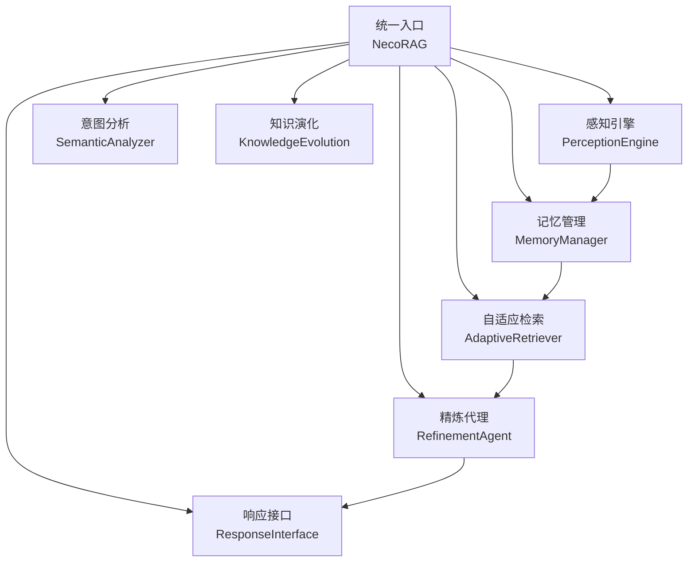
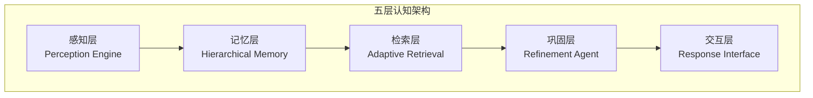
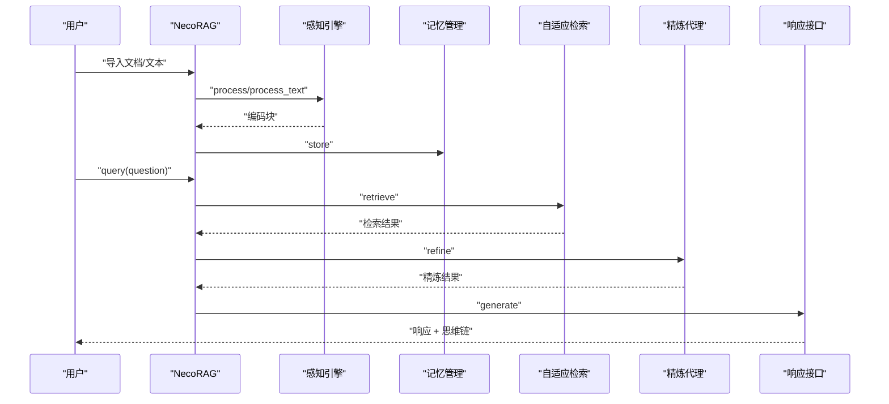
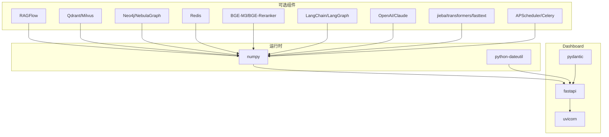

# 项目概述

<cite>
**本文引用的文件**
- [README.md](file://README.md)
- [QUICKSTART.md](file://QUICKSTART.md)
- [design.md](file://design/design.md)
- [necorag.py](file://src/necorag.py)
- [base.py](file://src/core/base.py)
- [config.py](file://src/core/config.py)
- [dashboard.py](file://src/dashboard/dashboard.py)
- [requirements.txt](file://requirements.txt)
- [pyproject.toml](file://pyproject.toml)
- [example_usage.py](file://example/example_usage.py)
- [perception/__init__.py](file://src/perception/__init__.py)
- [memory/__init__.py](file://src/memory/__init__.py)
- [retrieval/__init__.py](file://src/retrieval/__init__.py)
- [refinement/__init__.py](file://src/refinement/__init__.py)
- [response/__init__.py](file://src/response/__init__.py)
</cite>

## 目录
1. [引言](#引言)
2. [项目结构](#项目结构)
3. [核心组件](#核心组件)
4. [架构总览](#架构总览)
5. [详细组件分析](#详细组件分析)
6. [依赖分析](#依赖分析)
7. [性能考虑](#性能考虑)
8. [故障排查指南](#故障排查指南)
9. [结论](#结论)
10. [附录](#附录)

## 引言
NecoRAG 是一个创新的认知型检索增强生成（RAG）框架，其核心理念源于类脑记忆理论与神经认知科学。项目通过“五层认知”架构，将感知、记忆、检索、巩固与交互五个阶段有机串联，形成从数据到知识再到智能响应的完整闭环。项目强调：
- 类脑记忆结构：三层记忆系统（工作记忆 L1 + 语义记忆 L2 + 情景图谱 L3）
- 智能早停机制：在达到置信阈值时提前终止检索，提升响应速度
- 自我反思能力：通过生成-批评-修正的闭环实现幻觉自检与知识进化
- 可解释性输出：思维链可视化，展示检索路径、证据来源与推理过程
- 配置管理系统：Web Dashboard 实时配置与监控

## 项目结构
项目采用模块化分层组织，围绕“五层认知”划分核心模块，并提供统一入口类与配置管理：
- src/core：抽象基类与协议定义，确保组件一致性与可替换性
- src/perception：感知引擎，负责文档解析、弹性分块、向量化与情境标签
- src/memory：层级记忆，包含工作记忆、语义记忆与情景图谱，支持动态权重衰减
- src/retrieval：自适应检索，融合向量与图谱、HyDE 增强、早停与新颖性重排
- src/refinement：精炼代理，生成-批评-修正闭环与知识固化/修剪
- src/response：响应接口，情境自适应生成与思维链可视化
- src/dashboard：Web 配置与监控系统
- src/knowledge_evolution：知识库演化与健康度指标
- src/intent：语义意图分类与路由
- example：完整使用示例
- docs、design：设计文档与技术框架说明

**图表来源**
- [necorag.py:37-121](file://src/necorag.py#L37-L121)
- [perception/__init__.py:6-22](file://src/perception/__init__.py#L6-L22)
- [memory/__init__.py:6-21](file://src/memory/__init__.py#L6-L21)
- [retrieval/__init__.py:6-18](file://src/retrieval/__init__.py#L6-L18)
- [refinement/__init__.py:6-25](file://src/refinement/__init__.py#L6-L25)
- [response/__init__.py:6-22](file://src/response/__init__.py#L6-L22)

**章节来源**
- [README.md:35-85](file://README.md#L35-L85)
- [design.md:489-500](file://design/design.md#L489-L500)

## 核心组件
- 统一入口类 NecoRAG：提供文档导入、查询检索、知识演化与统计信息等统一 API，内部按需延迟初始化各层组件
- 配置管理 NecoRAGConfig：涵盖 LLM、感知、记忆、检索、巩固、响应、领域权重与知识演化等模块配置
- 抽象基类 Base*：定义各层组件的接口契约，确保实现的一致性与可替换性

**章节来源**
- [necorag.py:37-121](file://src/necorag.py#L37-L121)
- [config.py:265-320](file://src/core/config.py#L265-L320)
- [base.py:20-750](file://src/core/base.py#L20-L750)

## 架构总览
NecoRAG 的“五层认知”架构映射到人脑记忆与检索机制：
- 感知层（Perception）：文档解析、弹性分块、向量化与情境标签
- 记忆层（Memory）：工作记忆（Redis）、语义记忆（Qdrant/Milvus）、情景图谱（Neo4j/NebulaGraph），动态权重衰减
- 检索层（Retrieval）：向量检索 + 图谱多跳 + HyDE 增强 + Novelty 重排 + 早停机制
- 巩固层（Consolidation）：生成-批评-修正闭环，幻觉检测，知识固化与修剪
- 交互层（Interaction）：情境自适应生成、思维链可视化、用户画像适配

**图表来源**
- [design.md:489-500](file://design/design.md#L489-L500)

**章节来源**
- [README.md:35-85](file://README.md#L35-L85)
- [design.md:489-615](file://design/design.md#L489-L615)

## 详细组件分析

### 统一入口类 NecoRAG
- 职责：封装文档导入、查询检索、知识演化与统计信息，提供简洁 API
- 关键流程：文档导入 → 感知编码 → 存储记忆 → 检索证据 → 答案精炼 → 响应生成
- 知识演化：查询完成后触发知识积累回调，支持实时与定时更新、健康度指标与可视化

**图表来源**
- [necorag.py:177-421](file://src/necorag.py#L177-L421)

**章节来源**
- [necorag.py:37-121](file://src/necorag.py#L37-L121)
- [necorag.py:177-421](file://src/necorag.py#L177-L421)

### 配置管理 NecoRAGConfig
- 支持从文件与环境变量加载配置，覆盖优先级明确
- 模块化配置：LLM、感知、记忆、检索、巩固、响应、领域权重、知识演化
- 预设配置：development、production、minimal，满足不同场景

**章节来源**
- [config.py:265-320](file://src/core/config.py#L265-L320)
- [config.py:375-405](file://src/core/config.py#L375-L405)

### 抽象基类与协议
- 定义感知层（解析器、分块器、编码器、标签器）、记忆层（存储、向量、图存储）、检索层（检索器、重排序器）、巩固层（生成器、批评者、修正器、幻觉检测）、响应层（适配器）、意图层（分类器、路由器）等接口
- 确保实现一致性与可替换性，便于扩展第三方组件

**章节来源**
- [base.py:20-750](file://src/core/base.py#L20-L750)

### Dashboard 启动
- 提供命令行参数：host、port、config-dir
- 快速启动 Web 配置与监控界面，支持 Profile 管理、参数实时编辑与统计信息展示

**章节来源**
- [dashboard.py:10-26](file://src/dashboard/dashboard.py#L10-L26)

### 快速开始与使用示例
- 安装与基础使用：克隆仓库、安装依赖、导入模块、文档处理、存储知识、检索与生成、启动 Dashboard
- 完整示例：演示感知、记忆、检索、精炼与响应的完整工作流

**章节来源**
- [README.md:87-157](file://README.md#L87-L157)
- [QUICKSTART.md:1-66](file://QUICKSTART.md#L1-L66)
- [example_usage.py:1-252](file://example/example_usage.py#L1-L252)

## 依赖分析
- 运行时依赖：numpy、python-dateutil
- Dashboard 依赖：fastapi、uvicorn、pydantic
- 可选依赖：文档解析（RAGFlow）、向量数据库（Qdrant/Milvus）、图数据库（Neo4j/NebulaGraph）、缓存（Redis）、嵌入模型（BGE-M3/BGE-Reranker）、LLM（LangChain/LangGraph/OpenAI/Claude）、意图分类（jieba/transformers/fasttext）、任务调度（APScheduler/Celery）

**图表来源**
- [requirements.txt:3-71](file://requirements.txt#L3-L71)
- [pyproject.toml:27-63](file://pyproject.toml#L27-L63)

**章节来源**
- [requirements.txt:1-71](file://requirements.txt#L1-L71)
- [pyproject.toml:1-83](file://pyproject.toml#L1-L83)

## 性能考虑
- 检索准确率（Recall@K）目标相较传统向量 RAG 提升 +20%
- 幻觉率 < 5%，通过精炼代理闭环控制
- 简单查询延迟 < 800ms（首字延迟），复杂查询延迟 < 1500ms（多跳+重排）
- 上下文压缩率 -40%，通过记忆衰减机制减少 Token 消耗
- 早停机制在达到置信阈值时立即终止检索，显著降低无效计算

**章节来源**
- [README.md:465-474](file://README.md#L465-L474)
- [design.md:640-652](file://design/design.md#L640-L652)

## 故障排查指南
- 安装依赖失败：确认 Python 版本与依赖版本要求，优先安装 requirements.txt 中的基础依赖
- Dashboard 启动失败：检查端口占用（8000），可通过命令行参数更换端口
- 配置加载问题：优先级为环境变量 > 配置文件 > 默认值，确保环境变量命名规范
- 知识库健康度低：关注知识增长曲线、领域覆盖热力图与知识衰减雷达图，及时触发定时更新

**章节来源**
- [QUICKSTART.md:237-277](file://QUICKSTART.md#L237-L277)
- [config.py:323-371](file://src/core/config.py#L323-L371)

## 结论
NecoRAG 以类脑记忆理论为指导，结合五层认知架构，构建了具备“敏捷响应、类脑思考、开源生态”的下一代认知型 RAG 框架。通过动态权重衰减、早停机制、生成-批评-修正闭环与思维链可视化，项目在性能与可解释性方面取得平衡。随着知识库演化与 Dashboard 的完善，NecoRAG 将持续演进为可配置、可观测、可进化的智能知识系统。

## 附录
- 快速开始：安装、基础使用、启动 Dashboard
- 模块详解：感知引擎、层级记忆、自适应检索、精炼代理、响应接口、Dashboard
- 核心创新点：记忆权重衰减、早停机制、思维链可视化、幻觉自检闭环
- 开发路线图：骨架搭建（2026 Q2）、大脑注入（2026 Q3）、进化与生态（2026 Q4）
- 技术栈：LangGraph、RAGFlow、Qdrant、Neo4j、Redis、BGE-M3、FastAPI 等

**章节来源**
- [README.md:87-433](file://README.md#L87-L433)
- [design.md:655-680](file://design/design.md#L655-L680)