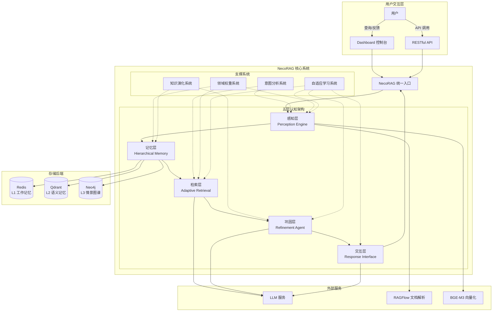
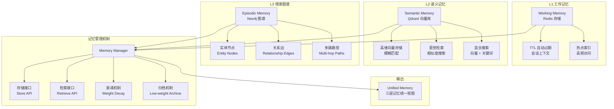
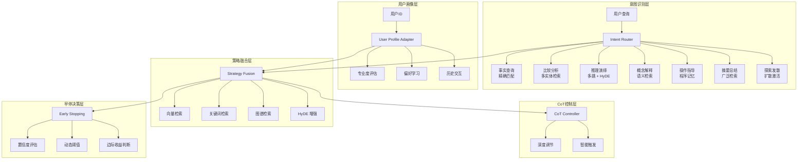
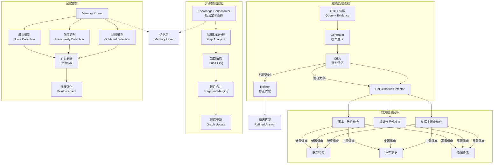

# 项目简介

<cite>
**本文档引用的文件**
- [README.md](file://README.md)
- [src/necorag.py](file://src/necorag.py)
- [src/core/base.py](file://src/core/base.py)
- [src/core/config.py](file://src/core/config.py)
- [src/memory/manager.py](file://src/memory/manager.py)
- [src/retrieval/smart_routing/engine.py](file://src/retrieval/smart_routing/engine.py)
- [src/refinement/models.py](file://src/refinement/models.py)
- [src/response/visualizer.py](file://src/response/visualizer.py)
- [src/dashboard/dashboard.py](file://src/dashboard/dashboard.py)
- [src/dashboard/components/DebugPanel.html](file://src/dashboard/components/DebugPanel.html)
- [src/intent/classifier.py](file://src/intent/classifier.py)
- [design/architecture_framework.md](file://design/architecture_framework.md)
- [example/example_usage.py](file://example/example_usage.py)
</cite>

## 目录
1. [项目概述](#项目概述)
2. [核心理念与创新](#核心理念与创新)
3. [五层认知架构详解](#五层认知架构详解)
4. [类脑记忆结构设计](#类脑记忆结构设计)
5. [智能路由与策略融合引擎](#智能路由与策略融合引擎)
6. [主要特色功能](#主要特色功能)
7. [应用场景与价值](#应用场景与价值)
8. [与其他RAG框架的区别](#与其他rag框架的区别)
9. [项目定位与功能概览](#项目定位与功能概览)

## 项目概述

NecoRAG是一个创新的认知型RAG（检索增强生成）框架，模拟人脑的双系统记忆理论和神经认知科学原理。该项目采用"五层认知"分层架构，实现了从感知到交互的完整认知闭环，旨在构建下一代类脑智能系统。

**当前版本**: v3.3.0-alpha | **最后更新**: 2026-03-19  
**总文件数**: 445 个 | **总代码行数**: 166,393 行 | **代码密度**: 80.2%

## 核心理念与创新

### 类脑记忆模拟

NecoRAG的核心创新在于模拟人类大脑的记忆机制，通过三层记忆系统实现类脑智能：

- **工作记忆L1**：短期存储，处理当前会话上下文
- **语义记忆L2**：长期存储，处理抽象概念和知识
- **情景图谱L3**：长期存储，处理实体关系和场景

### 认知科学理论基础

项目基于神经认知科学理论，构建了完整的认知处理流程，从感知输入到最终交互输出，形成闭环反馈系统。

## 五层认知架构详解

NecoRAG采用五层架构设计，每一层对应人脑认知机制的不同阶段：



**架构图来源**
- [design/architecture_framework.md:26-81](file://design/architecture_framework.md#L26-L81)

### 各层功能特点

**Layer 1: 感知层 (Perception Engine)**
- 多模态文档解析（RAGFlow集成）
- 弹性分块策略（语义边界检测）
- 多维向量化编码（BGE-M3）
- 情境标签生成（时间、情感、重要性）

**Layer 2: 记忆层 (Hierarchical Memory)**
- L1工作记忆：Redis存储，TTL自动过期
- L2语义记忆：Qdrant/Milvus向量库
- L3情景图谱：Neo4j实体关系网络
- 动态权重衰减机制

**Layer 3: 检索层 (Adaptive Retrieval)**
- 多策略混合检索（向量+关键词+图谱）
- HyDE增强技术
- 多跳联想检索
- Novelty重排序
- 智能早停机制

**Layer 4: 巩固层 (Refinement Agent)**
- Generator-Critic-Refiner闭环
- 幻觉检测与自检
- 知识固化与记忆修剪
- 异步知识演化

**Layer 5: 交互层 (Response Interface)**
- 用户画像适配
- 语气风格调整
- 详细程度控制
- 思维链可视化

## 类脑记忆结构设计

### 三层记忆系统架构



**架构图来源**
- [design/architecture_framework.md:243-292](file://design/architecture_framework.md#L243-L292)

### 记忆衰减与巩固机制

项目实现了类脑记忆的动态管理机制：

**记忆权重衰减公式**：
```
weight(t) = initial_weight × e^(-λt) × access_frequency
```

其中：
- λ: 衰减系数（可配置，默认 0.1）
- t: 时间间隔（秒）
- access_frequency: 访问频率因子

**记忆巩固流程**：
1. 高频访问的记忆权重提升
2. 低价值记忆自动归档
3. 主动遗忘机制清理冗余信息
4. 异步知识演化优化

**记忆管理API**：
- `store()`: 存储知识到三层记忆
- `retrieve()`: 多层联合检索
- `consolidate()`: 记忆巩固
- `forget()`: 主动遗忘

**Section sources**
- [src/memory/manager.py:20-212](file://src/memory/manager.py#L20-L212)
- [design/architecture_framework.md:305-314](file://design/architecture_framework.md#L305-L314)

## 智能路由与策略融合引擎

### 三层决策架构

NecoRAG v3.3.0-alpha引入了智能路由与策略融合引擎，实现了更加智能化的查询处理：



**架构图来源**
- [design/architecture_framework.md:320-380](file://design/architecture_framework.md#L320-L380)

### 意图分类系统

项目实现了多层次的意图分类系统，支持7大类语义意图：

**意图类型矩阵**：
| 意图类型 | 描述 | 典型查询示例 |
|---------|------|-------------|
| 事实查询 | 精确信息检索 | "什么是深度学习？" |
| 比较分析 | 多实体对比 | "Python vs Java 哪个更好？" |
| 推理演绎 | 逻辑推理 | "如果A>B且B>C，那么A>C吗？" |
| 概念解释 | 概念阐述 | "解释一下量子力学" |
| 操作指导 | 步骤说明 | "如何安装Python？" |
| 摘要总结 | 信息汇总 | "总结一下机器学习发展史" |
| 探索发散 | 创意启发 | "给我一些创新想法" |

**意图分类算法**：
- 基于规则的关键词匹配
- FastText机器学习分类
- Transformer深度学习模型
- 多后端可切换架构

**Section sources**
- [src/intent/classifier.py:20-493](file://src/intent/classifier.py#L20-L493)
- [src/retrieval/smart_routing/engine.py:34-274](file://src/retrieval/smart_routing/engine.py#L34-L274)

## 主要特色功能

### 1. 智能早停机制

**早停算法**：
```python
def should_early_terminate(confidence, threshold, marginal_gain):
    # 策略 1: 固定阈值
    if confidence > threshold:
        return True
    
    # 策略 2: 自适应阈值（基于查询复杂度）
    adaptive_threshold = calculate_adaptive_threshold()
    if confidence > adaptive_threshold:
        return True
    
    # 策略 3: 边际收益递减
    if marginal_gain < min_gain:
        return True
    
    return False
```

**早停优势**：
- 显著减少检索成本
- 提高系统响应速度
- 保持检索质量
- 动态阈值调整

### 2. 幻觉自检能力

**三重验证闭环**：



**幻觉检测评分卡**：

| 检测维度 | 评分方法 | 阈值 | 处理策略 |
|---------|---------|------|---------|
| 事实一致性 | NLI模型蕴含分数 | ≥ 0.7 | < 0.5 → 触发"不知道" |
| 逻辑连贯性 | 论证结构分析 | ≥ 0.6 | 0.5-0.7 → 补充证据 |
| 证据支撑度 | 引用覆盖率 | ≥ 0.8 | > 0.7 → 添加警示 |

**Section sources**
- [src/refinement/models.py:9-66](file://src/refinement/models.py#L9-L66)
- [design/architecture_framework.md:418-527](file://design/architecture_framework.md#L418-L527)

### 3. 思维链可视化

**可视化模板**：
```
🔍 检索路径：
  1. 查询理解：识别实体"深度学习"
  2. 向量检索：在 L2 语义记忆中检索到 15 条相关结果
  3. 图谱推理：发现相关路径 深度学习 → 神经网络 → CNN → 图像识别
  4. 重排序：应用新颖性惩罚，选择 Top-5 最具信息量的结果

📚 证据来源：
  - [证据 1] 《深度学习导论》第 3 章 (相关度：0.89)
  - [证据 2] 《神经网络与深度学习》第 7 节 (相关度：0.85)
  - [证据 3] 技术博客"CNN 架构演进" (相关度：0.82)

💡 推理过程：
  基于检索到的证据，深度学习的核心特征包括：
  1. 多层神经网络结构
  2. 端到端特征学习
  3. 数据驱动的训练方式

✅ 答案：
  深度学习是机器学习的一个分支，它使用多层神经网络...
```

**可视化组件**：
- 检索路径追踪
- 证据来源追溯
- 推理过程展示
- 思维链结构化输出

### 4. 可视化调试面板

**调试面板功能**：
- 实时会话监控
- 检索路径可视化
- 证据来源分析
- 推理过程追踪
- 性能指标监控
- A/B测试框架
- 参数调优面板

**Section sources**
- [src/response/visualizer.py:9-150](file://src/response/visualizer.py#L9-L150)
- [src/dashboard/components/DebugPanel.html:1-899](file://src/dashboard/components/DebugPanel.html#L1-L899)

## 应用场景与价值

### 企业知识管理

NecoRAG特别适用于企业级知识管理场景：

**文档智能处理**：
- 多格式文档自动解析
- 智能分块与向量化
- 实体关系抽取
- 情境标签生成

**智能问答系统**：
- 多轮对话支持
- 用户画像适配
- 专业度自适应
- 详细程度控制

**知识演化管理**：
- 自动知识更新
- 质量监控
- 健康度报告
- 版本管理

### 教育培训领域

**个性化学习**：
- 学生水平识别
- 学习路径推荐
- 知识点查漏补缺
- 学习效果评估

**智能教学助手**：
- 自动答疑
- 知识点讲解
- 例题分析
- 学习建议

### 研究分析场景

**学术研究支持**：
- 文献检索与整理
- 研究趋势分析
- 知识图谱构建
- 创新点挖掘

**商业分析**：
- 市场情报收集
- 竞品分析
- 行业趋势预测
- 风险评估

## 与其他RAG框架的区别

### 技术架构差异

**传统RAG框架**：
- 简单的检索-生成模式
- 单一记忆存储
- 固定的处理流程
- 缺乏类脑智能

**NecoRAG创新点**：
- 五层认知架构
- 三层记忆系统
- 智能路由引擎
- 幻觉自检闭环
- 思维链可视化

### 性能优势

**检索效率**：
- 智能早停机制
- 多策略并行检索
- 动态权重调整
- 早停阈值优化

**回答质量**：
- 三重验证机制
- 幻觉检测
- 知识固化
- 记忆修剪

**系统稳定性**：
- 异步知识演化
- 主动遗忘机制
- 性能监控
- 健康度报告

### 开发体验

**配置管理**：
- 统一配置系统
- 环境变量支持
- 预设配置模板
- 实时参数调整

**可视化支持**：
- 调试面板
- 思维链可视化
- 性能监控
- A/B测试

## 项目定位与功能概览

### 项目定位

NecoRAG定位为"类脑认知型RAG框架"，致力于构建具有人类智能特征的AI系统。项目不仅关注技术实现，更注重模拟人类认知过程，实现真正的智能问答。

### 核心功能概览

**统一入口API**：
```python
from src import NecoRAG

# 初始化
rag = NecoRAG()

# 文档导入
rag.ingest("./documents/")

# 智能问答
response = rag.query("什么是深度学习？")
```

**模块化设计**：
- 感知层：文档解析与编码
- 记忆层：三层记忆管理
- 检索层：智能检索与重排序
- 巩固层：答案生成与验证
- 交互层：情境自适应响应

**扩展性支持**：
- 插件系统
- 自定义组件
- 第三方集成
- 定制化配置

### 技术栈全景

**前端展示**：
- Web UI (Next.js/React)
- Streamlit仪表板
- ECharts可视化

**应用服务**：
- FastAPI RESTful API
- Uvicorn ASGI服务器
- Pydantic数据验证

**核心框架**：
- LangGraph编排引擎
- NecoRAG Core Python SDK

**AI模型**：
- LLM推理 (vLLM/Ollama)
- BGE-M3向量化模型
- BGE-Reranker-v2重排序模型
- Rasa NLU意图识别

**数据存储**：
- Redis 7.x工作记忆
- Qdrant语义记忆
- Neo4j情景图谱

**监控运维**：
- Grafana监控面板
- Prometheus指标采集

NecoRAG项目通过模拟人类大脑的认知机制，为构建真正智能的问答系统提供了全新的思路和技术方案。项目不仅在技术上具有创新性，在实用性方面也具备很强的应用价值。