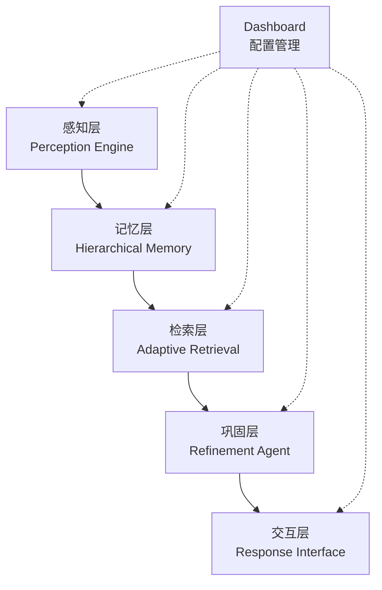
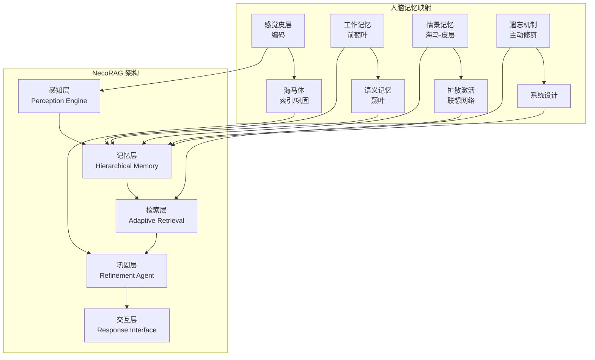
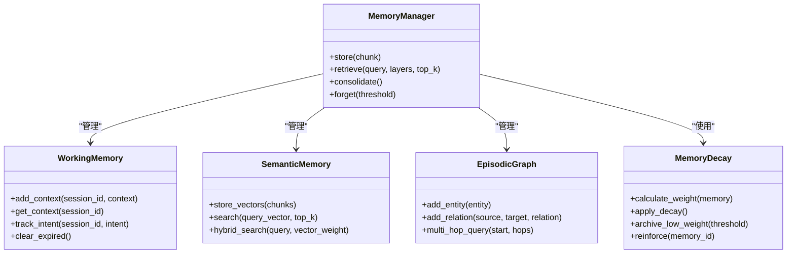
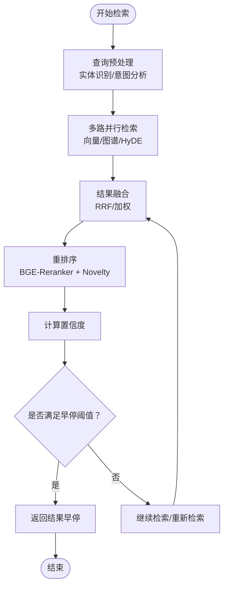
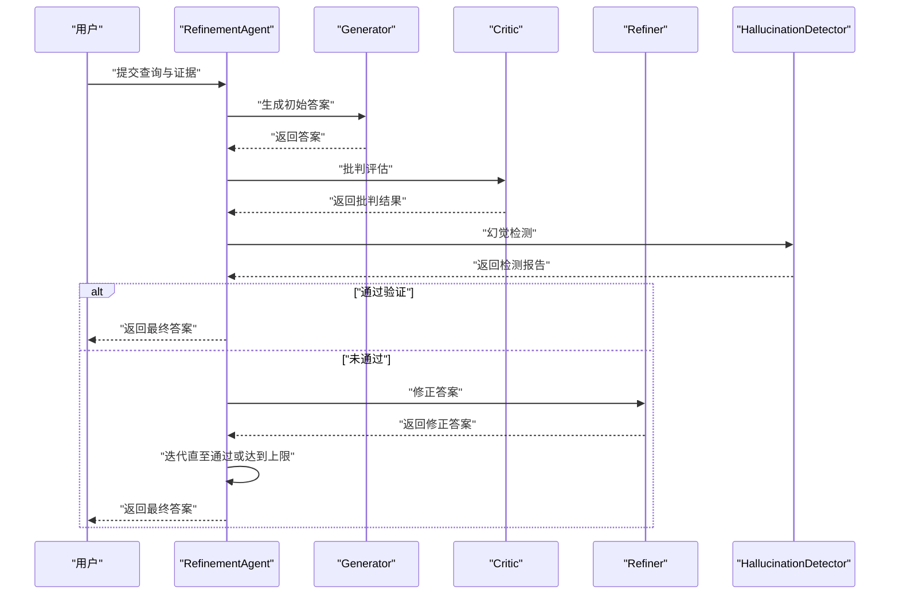
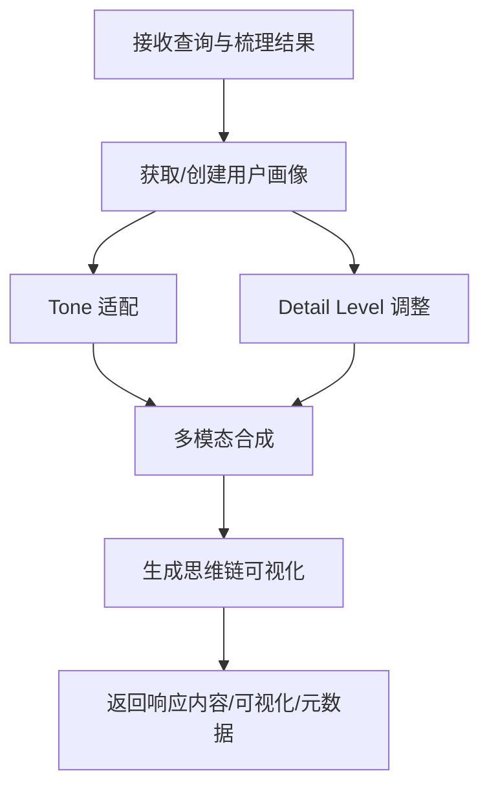
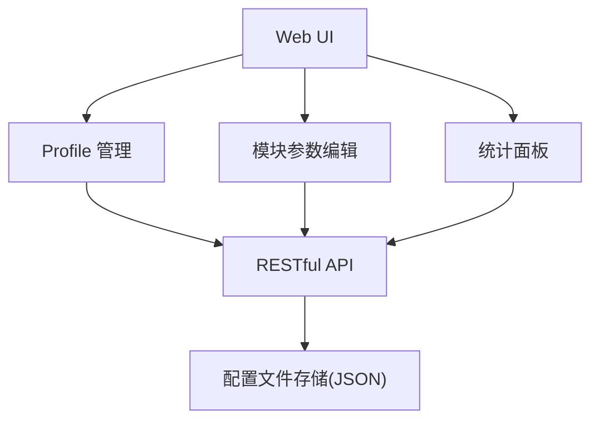
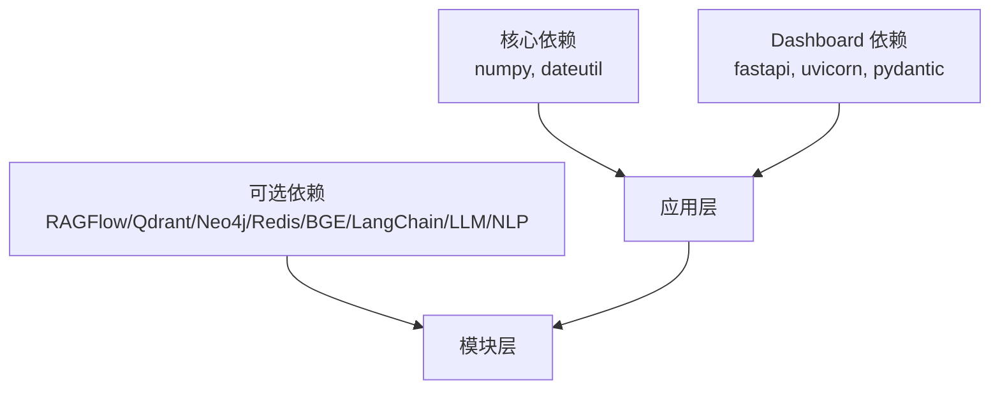

# 项目简介与愿景

<cite>
**本文引用的文件**
- [README.md](file://README.md)
- [PROJECT_COMPLETE.md](file://PROJECT_COMPLETE.md)
- [design/design.md](file://design/design.md)
- [src/core/base.py](file://src/core/base.py)
- [src/memory/manager.py](file://src/memory/manager.py)
- [src/refinement/agent.py](file://src/refinement/agent.py)
- [src/memory/README.md](file://src/memory/README.md)
- [src/retrieval/README.md](file://src/retrieval/README.md)
- [src/response/README.md](file://src/response/README.md)
- [src/dashboard/README.md](file://src/dashboard/README.md)
- [example/example_usage.py](file://example/example_usage.py)
- [requirements.txt](file://requirements.txt)
- [src/__init__.py](file://src/__init__.py)
</cite>

## 目录
1. [引言](#引言)
2. [项目结构](#项目结构)
3. [核心组件](#核心组件)
4. [架构总览](#架构总览)
5. [详细组件分析](#详细组件分析)
6. [依赖分析](#依赖分析)
7. [性能考量](#性能考量)
8. [故障排查指南](#故障排查指南)
9. [结论](#结论)
10. [附录](#附录)

## 引言
NecoRAG 是一个创新的认知型检索增强生成（RAG）框架，其核心使命是模拟人脑双系统记忆与神经认知科学原理，构建“像大脑一样思考”的下一代智能系统。项目通过五层认知架构，从感知、记忆、检索、巩固到交互，形成完整的认知闭环，旨在解决现有 RAG 技术在“记忆扁平化、静态知识库、被动检索、缺乏情境感知”等方面的痛点。

项目愿景是成为开源认知智能的核心基础设施，借助成熟的开源组件（如 RAGFlow、BGE-M3、Qdrant、Neo4j、LangGraph、FastAPI 等）进行深度编排，降低开发者构建复杂认知应用的门槛，使 AI 从“冰冷的检索机器”进化为“拥有记忆、懂得思考、能够成长的数字伙伴”。

## 项目结构
NecoRAG 采用模块化分层设计，围绕“五层认知”展开：感知层、记忆层、检索层、巩固层、交互层。各层职责明确、耦合度低，既可独立演进，又能在统一抽象协议下协同工作。

**图示来源**
- [design/design.md:314-321](file://design/design.md#L314-L321)

**章节来源**
- [README.md:35-85](file://README.md#L35-L85)
- [PROJECT_COMPLETE.md:43-138](file://PROJECT_COMPLETE.md#L43-L138)
- [design/design.md:310-370](file://design/design.md#L310-L370)

## 核心组件
- 感知层（Perception Engine）：多模态数据的高精度编码与情境标记，支持深度文档解析与多维向量化。
- 记忆层（Hierarchical Memory）：三层记忆系统（L1 工作记忆、L2 语义记忆、L3 情景图谱），并实现动态权重衰减与主动遗忘。
- 检索层（Adaptive Retrieval）：混合检索与重排序，结合 HyDE 增强、多跳联想与早停机制（Pounce）。
- 巩固层（Refinement Agent）：异步知识固化、幻觉自检与记忆修剪，形成 Generator→Critic→Refiner 闭环。
- 交互层（Response Interface）：情境自适应生成与可解释性输出，支持思维链可视化与多模态合成。
- Dashboard：Web 配置管理与实时监控，支持 Profile 管理、参数编辑与统计面板。

**章节来源**
- [README.md:158-433](file://README.md#L158-L433)
- [src/memory/README.md:1-244](file://src/memory/README.md#L1-L244)
- [src/retrieval/README.md:1-352](file://src/retrieval/README.md#L1-L352)
- [src/response/README.md:1-398](file://src/response/README.md#L1-L398)
- [src/dashboard/README.md:1-417](file://src/dashboard/README.md#L1-L417)

## 架构总览
NecoRAG 的“五层认知”架构与人脑记忆机制深度映射：感知层对应感觉皮层的编码，记忆层对应海马体与新皮层的索引与存储，检索层对应扩散激活与模式完成，巩固层对应记忆巩固与遗忘，交互层对应情境自适应与可解释输出。

**图示来源**
- [design/design.md:180-206](file://design/design.md#L180-L206)
- [design/design.md:322-369](file://design/design.md#L322-L369)

**章节来源**
- [design/design.md:32-215](file://design/design.md#L32-L215)

## 详细组件分析

### 记忆层：类脑三层记忆与动态权重衰减
- 三层记忆架构：L1 工作记忆（Redis，TTL 模拟瞬时遗忘）、L2 语义记忆（Qdrant/Milvus，向量检索）、L3 情景图谱（Neo4j/NebulaGraph，多跳推理）。
- 动态权重衰减：模拟生物记忆的巩固与遗忘，通过时间衰减与访问频率动态调整权重，低频知识自动归档，热点知识保持鲜活。
- 记忆巩固与主动遗忘：定期分析高频/低频记忆，执行异步固化与修剪，维持知识库质量与新鲜度。

**图示来源**
- [src/memory/manager.py:16-186](file://src/memory/manager.py#L16-L186)
- [src/memory/README.md:82-148](file://src/memory/README.md#L82-L148)

**章节来源**
- [src/memory/manager.py:16-186](file://src/memory/manager.py#L16-L186)
- [src/memory/README.md:1-244](file://src/memory/README.md#L1-L244)

### 检索层：HyDE 增强、多跳联想与早停机制
- HyDE 增强：先生成假设答案再检索，解决提问模糊问题，提升检索效果。
- 多跳联想：基于扩散激活理论，从实体 A 通过关系链扩展到 B 再到 C，支持多跳推理。
- Novelty Re-ranker：在重排序中引入新颖性奖励与多样性保证，抑制重复、突出新异知识。
- 早停机制（Pounce）：一旦置信度超过阈值，立即终止冗余检索，显著降低延迟与资源消耗。

**图示来源**
- [src/retrieval/README.md:259-287](file://src/retrieval/README.md#L259-L287)
- [src/retrieval/README.md:103-141](file://src/retrieval/README.md#L103-L141)

**章节来源**
- [src/retrieval/README.md:1-352](file://src/retrieval/README.md#L1-L352)

### 巩固层：幻觉自检与知识进化闭环
- Generator→Critic→Refiner 三阶段闭环：生成答案、批判评估、修正答案，形成“检索-反思-校正”的智能循环。
- 幻觉检测：从事实一致性、证据支撑度、逻辑连贯性三个维度进行自检，降低幻觉率。
- 异步知识固化与修剪：后台周期性分析高频未命中查询，补充知识缺口，清理噪声数据，强化重要连接。

**图示来源**
- [src/refinement/agent.py:61-128](file://src/refinement/agent.py#L61-L128)

**章节来源**
- [src/refinement/agent.py:1-151](file://src/refinement/agent.py#L1-L151)

### 交互层：情境自适应与思维链可视化
- 用户画像适配：基于 L1 工作记忆的历史交互，动态调整语气（专业/友好/幽默）与详细程度（4 级）。
- 思维链可视化：输出检索路径、证据来源与推理过程，帮助用户理解 AI 的思考过程。
- 多模态合成：支持文本、图表、语音等多种输出形式，提升用户体验。

**图示来源**
- [src/response/README.md:322-345](file://src/response/README.md#L322-L345)

**章节来源**
- [src/response/README.md:1-398](file://src/response/README.md#L1-L398)

### Dashboard：配置管理与实时监控
- Profile 管理：创建、编辑、切换、导入导出配置文件，支持多环境管理与参数持久化。
- 模块参数配置：覆盖五大模块的完整参数，支持实时编辑与批量更新。
- 统计监控：展示文档/块统计、查询历史、性能指标，支持重置与导出。

**图示来源**
- [src/dashboard/README.md:38-77](file://src/dashboard/README.md#L38-L77)
- [src/dashboard/README.md:86-203](file://src/dashboard/README.md#L86-L203)

**章节来源**
- [src/dashboard/README.md:1-417](file://src/dashboard/README.md#L1-L417)

## 依赖分析
NecoRAG 采用模块化依赖策略，核心依赖与可选依赖清晰分离，便于按需集成与扩展。

- 核心依赖：numpy、python-dateutil（基础计算与时间处理）。
- Dashboard 依赖：fastapi、uvicorn、pydantic（Web 服务与数据校验）。
- 可选依赖（按模块启用）：RAGFlow（文档解析）、Qdrant/Milvus（向量检索）、Neo4j/NebulaGraph（图谱）、Redis（缓存）、BGE-M3/BGE-Reranker（嵌入与重排序）、LangChain/LangGraph（编排）、OpenAI/Anthropic（LLM 推理）、SpaCy/Transformers（NLP 工具）。

**图示来源**
- [requirements.txt:1-57](file://requirements.txt#L1-L57)

**章节来源**
- [requirements.txt:1-57](file://requirements.txt#L1-L57)

## 性能考量
- 检索准确率（Recall@K）：相比传统向量 RAG 提升 +20%，通过 HyDE 增强、多跳联想与新颖性重排序实现。
- 幻觉率：< 5%，通过 Generator→Critic→Refiner 闭环与幻觉检测保障。
- 延迟目标：简单查询首字延迟 < 800ms，复杂查询（多跳+重排）< 1500ms。
- 上下文压缩率：-40%，通过记忆衰减与早停机制降低 Token 消耗。
- 记忆层性能：L1（Redis）< 5ms 写入/检索，L2（Qdrant）< 50ms 写入/< 100ms 检索，L3（Neo4j）< 100ms 写入/< 500ms 检索（规模可达亿级节点）。

**章节来源**
- [README.md:465-474](file://README.md#L465-L474)
- [src/memory/README.md:223-229](file://src/memory/README.md#L223-L229)
- [src/retrieval/README.md:329-337](file://src/retrieval/README.md#L329-L337)

## 故障排查指南
- Dashboard 无法启动：检查端口占用，更换端口或关闭占用进程。
- 配置保存失败：检查配置目录写入权限，或更换配置目录。
- API 调用返回 404：确认 Profile ID 存在，先获取所有 Profile 列表后再操作。
- 记忆层连接失败：确认 Redis/Qdrant/Neo4j 服务可用，检查连接 URL 与认证配置。
- 检索性能异常：检查向量维度、索引类型与重排序模型参数，必要时启用 HyDE 或调整早停阈值。

**章节来源**
- [src/dashboard/README.md:381-400](file://src/dashboard/README.md#L381-L400)
- [src/memory/README.md:231-236](file://src/memory/README.md#L231-L236)
- [src/retrieval/README.md:338-344](file://src/retrieval/README.md#L338-L344)

## 结论
NecoRAG 以神经认知科学为理论基石，通过“五层认知”架构与类脑记忆结构，实现了从感知、记忆、检索、巩固到交互的完整闭环。其核心创新包括：动态权重衰减与主动遗忘、HyDE 增强与多跳联想、早停机制（Pounce）、幻觉自检闭环与思维链可视化。项目在性能、可解释性与可运维性方面均具备显著优势，适用于需要高质量、可解释、可持续演进的知识密集型应用。

## 附录

### 快速开始与示例
- 安装与启动：克隆仓库、安装依赖、运行示例脚本与 Dashboard。
- 完整工作流示例：从感知编码、记忆存储、智能检索、答案生成到交互响应的全流程演示。

**章节来源**
- [README.md:87-157](file://README.md#L87-L157)
- [example/example_usage.py:1-252](file://example/example_usage.py#L1-L252)

### 统一入口与模块导出
- 通过统一入口导出核心抽象（协议、LLM 客户端、异常）与五大模块（感知、记忆、检索、巩固、交互），并提供可选的 Dashboard 集成。

**章节来源**
- [src/__init__.py:1-111](file://src/__init__.py#L1-L111)