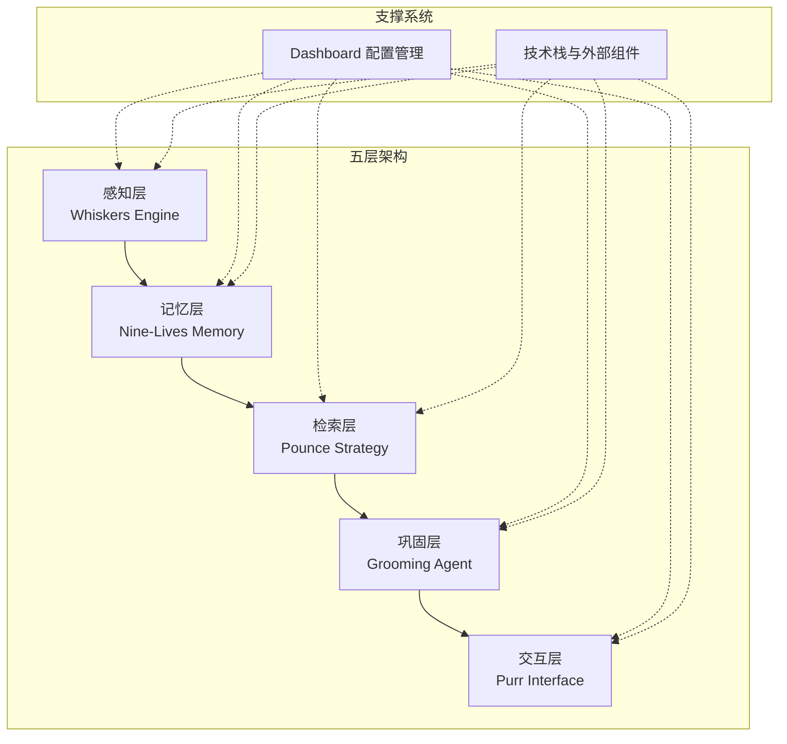
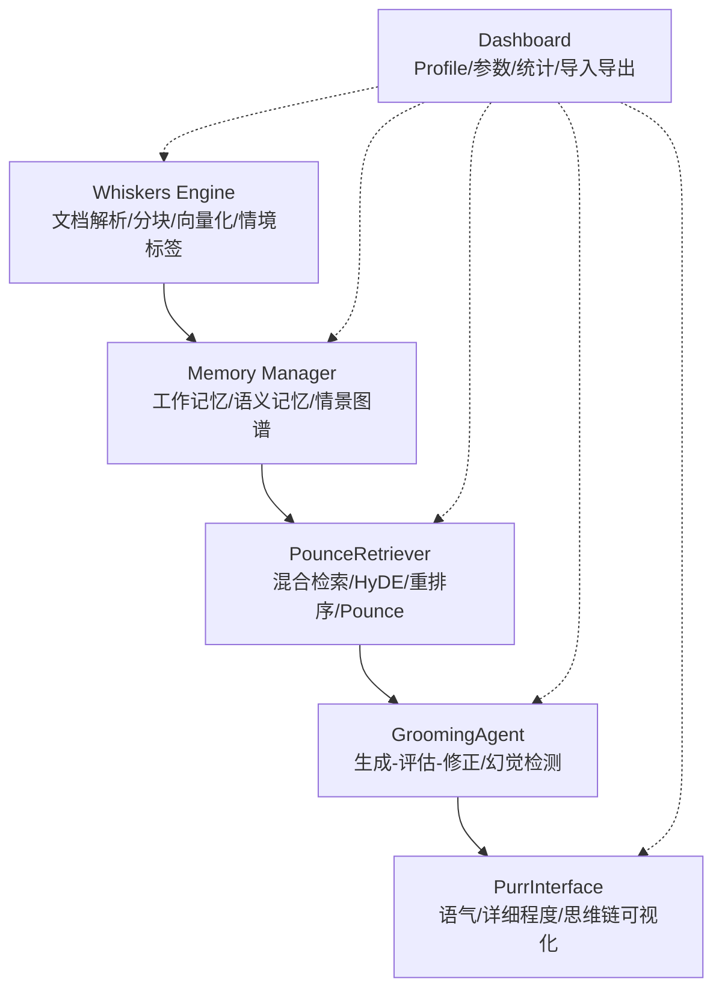
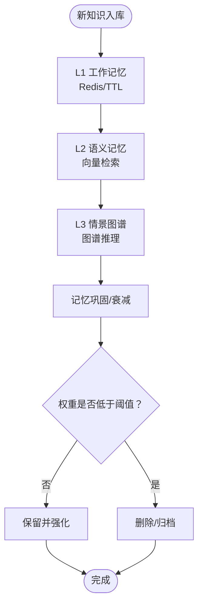
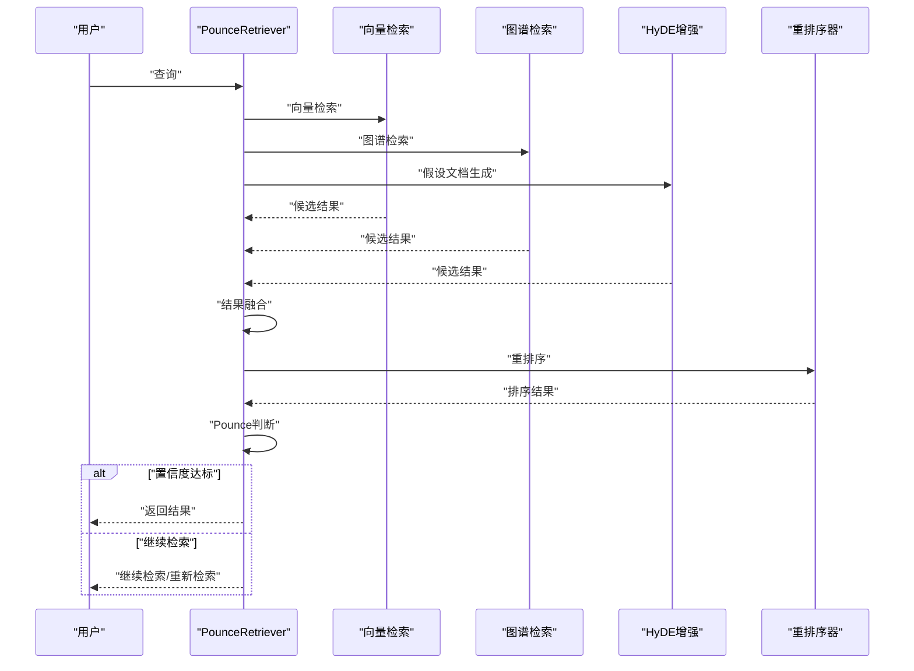
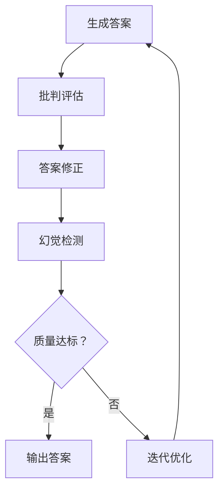
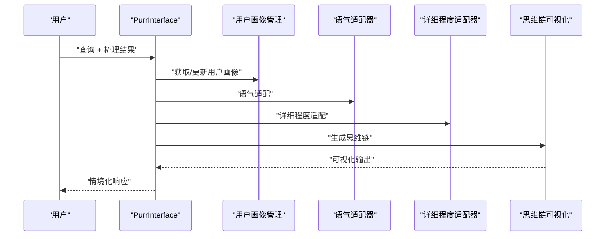
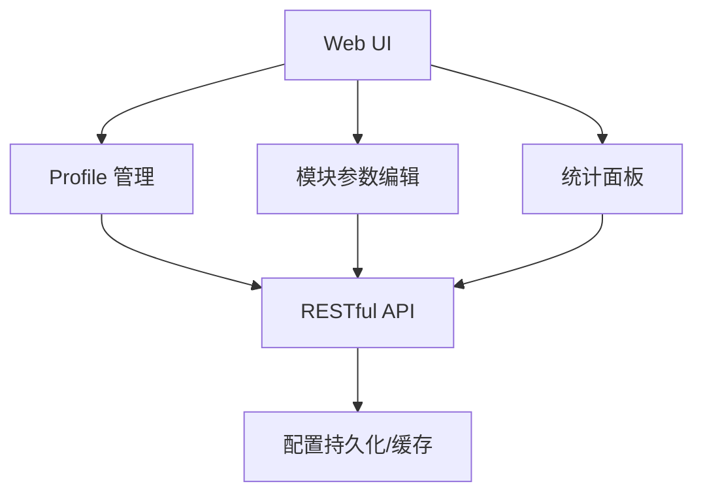
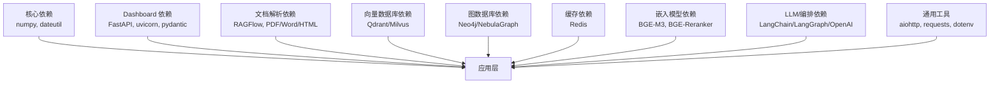

# 项目简介与核心价值

<cite>
**本文引用的文件**
- [src/__init__.py](file://src/__init__.py)
- [docs/README.md](file://docs/README.md)
- [PROJECT_COMPLETE.md](file://PROJECT_COMPLETE.md)
- [PROJECT_FINAL_SUMMARY.md](file://PROJECT_FINAL_SUMMARY.md)
- [QUICKSTART.md](file://QUICKSTART.md)
- [src/memory/README.md](file://src/memory/README.md)
- [src/retrieval/README.md](file://src/retrieval/README.md)
- [src/purr/README.md](file://src/purr/README.md)
- [src/dashboard/README.md](file://src/dashboard/README.md)
- [src/whiskers/README.md](file://src/whiskers/README.md)
- [example/example_usage.py](file://example/example_usage.py)
- [requirements.txt](file://requirements.txt)
- [CONTRIBUTING.md](file://CONTRIBUTING.md)
</cite>

## 目录
1. [引言](#引言)
2. [项目结构](#项目结构)
3. [核心组件](#核心组件)
4. [架构总览](#架构总览)
5. [详细组件分析](#详细组件分析)
6. [依赖分析](#依赖分析)
7. [性能考量](#性能考量)
8. [故障排查指南](#故障排查指南)
9. [结论](#结论)
10. [附录](#附录)

## 引言
NecoRAG 是受神经认知科学与猫科动物直觉启发的下一代检索增强生成（RAG）框架。其核心价值在于以“五层认知架构”模拟人脑的感知-记忆-检索-巩固-交互闭环，结合“三层记忆架构”（工作记忆、语义记忆、情景图谱），在保证高质量检索与可解释性的同时，显著降低幻觉风险，并提供情境自适应的人机交互体验。项目强调“像大脑一样思考，像猫一样行动”，既适合初学者快速上手，也为专业开发者提供了可扩展、可配置、可可视化的工程化平台。

## 项目结构
NecoRAG 采用模块化分层设计，围绕“感知-记忆-检索-巩固-交互”五大层次组织代码与文档，辅以 Dashboard 配置管理，形成从数据接入到用户交互的完整闭环。

**图表来源**
- [docs/README.md:40-54](file://docs/README.md#L40-L54)
- [src/dashboard/README.md:39-77](file://src/dashboard/README.md#L39-L77)

**章节来源**
- [docs/README.md:39-54](file://docs/README.md#L39-L54)
- [PROJECT_COMPLETE.md:43-138](file://PROJECT_COMPLETE.md#L43-L138)
- [PROJECT_FINAL_SUMMARY.md:129-156](file://PROJECT_FINAL_SUMMARY.md#L129-L156)

## 核心组件
- 感知层（Whiskers Engine）：负责多模态文档解析、分块策略、情境标签生成与多维度向量化，为后续记忆与检索提供高质量输入。
- 记忆层（Nine-Lives Memory）：三层记忆架构（工作记忆、语义记忆、情景图谱）协同，配合动态权重衰减机制，实现知识的分层存储与智能巩固。
- 检索层（Pounce Strategy）：混合检索与重排序，引入 HyDE 增强、新颖性重排序与 Pounce 智能终止策略，提升检索效率与准确性。
- 巩固层（Grooming Agent）：生成-评估-修正闭环，结合幻觉检测与知识固化，保障答案质量与一致性。
- 交互层（Purr Interface）：情境自适应生成与思维链可视化，提供语气与详细程度的个性化适配，增强可解释性与用户体验。
- Dashboard 配置管理：提供 Web UI 与 REST API，支持 Profile 管理、参数实时编辑、统计监控与导入导出，便于多环境与团队协作。

**章节来源**
- [src/whiskers/README.md:1-158](file://src/whiskers/README.md#L1-L158)
- [src/memory/README.md:1-244](file://src/memory/README.md#L1-L244)
- [src/retrieval/README.md:1-352](file://src/retrieval/README.md#L1-L352)
- [src/grooming/README.md](file://src/grooming/README.md)
- [src/purr/README.md:1-398](file://src/purr/README.md#L1-L398)
- [src/dashboard/README.md:1-417](file://src/dashboard/README.md#L1-L417)

## 架构总览
NecoRAG 的五层架构从底层感知到顶层交互，层层递进、职责清晰，且具备高度可扩展性。每层均配有详细设计文档与示例，便于快速集成与二次开发。

**图表来源**
- [docs/README.md:40-54](file://docs/README.md#L40-L54)
- [src/memory/README.md:84-147](file://src/memory/README.md#L84-L147)
- [src/retrieval/README.md:145-221](file://src/retrieval/README.md#L145-L221)
- [src/purr/README.md:222-291](file://src/purr/README.md#L222-L291)
- [src/dashboard/README.md:86-203](file://src/dashboard/README.md#L86-L203)

## 详细组件分析

### 三层记忆架构（工作记忆/语义记忆/情景图谱）
- 工作记忆（L1，Redis）：短期上下文与意图轨迹，支持 TTL 自动过期与 LRU 淘汰，模拟“瞬时遗忘”。
- 语义记忆（L2，Qdrant/Milvus）：高维向量存储与混合检索，支持模糊匹配与直觉检索。
- 情景图谱（L3，Neo4j/NebulaGraph）：实体关系网络，支持多跳推理与因果链条，模拟“结构化记忆”。

**图表来源**
- [src/memory/README.md:179-192](file://src/memory/README.md#L179-L192)
- [src/memory/README.md:136-147](file://src/memory/README.md#L136-L147)

**章节来源**
- [src/memory/README.md:9-81](file://src/memory/README.md#L9-L81)
- [src/memory/README.md:136-147](file://src/memory/README.md#L136-L147)

### 智能检索与 Pounce 机制
- 多路并行检索：向量检索、关键词检索、图谱检索与 HyDE 增强。
- 结果融合与重排序：RRF 或加权融合，结合新颖性惩罚与多样性保证。
- Pounce 智能终止：基于置信度阈值与边际收益递减策略，模拟猫捕猎的“锁定-跳跃”。

**图表来源**
- [src/retrieval/README.md:259-287](file://src/retrieval/README.md#L259-L287)
- [src/retrieval/README.md:103-141](file://src/retrieval/README.md#L103-L141)

**章节来源**
- [src/retrieval/README.md:9-102](file://src/retrieval/README.md#L9-L102)
- [src/retrieval/README.md:103-141](file://src/retrieval/README.md#L103-L141)

### 幻觉自检闭环与答案巩固
- 生成-评估-修正闭环：通过多轮迭代与批判评估，逐步提升答案质量。
- 幻觉检测：从“事实一致性、证据支撑度、逻辑连贯性”三个维度综合评估。
- 知识固化与修剪：识别知识缺口、合并碎片、清理噪声与冗余。

**图表来源**
- [src/grooming/README.md](file://src/grooming/README.md)

**章节来源**
- [src/grooming/README.md](file://src/grooming/README.md)

### 情境自适应交互与思维链可视化
- 用户画像管理：基于历史交互分析用户风格、偏好与专业程度。
- 语气与详细程度适配：支持专业严谨、亲切友好、幽默轻松等语气与多级详细程度。
- 思维链可视化：展示检索路径、证据来源与推理过程，提升可解释性与信任度。

**图表来源**
- [src/purr/README.md:322-345](file://src/purr/README.md#L322-L345)
- [src/purr/README.md:150-196](file://src/purr/README.md#L150-L196)

**章节来源**
- [src/purr/README.md:48-196](file://src/purr/README.md#L48-L196)

### Dashboard 配置管理
- Profile 管理：创建、编辑、复制、删除与导入导出。
- 模块参数配置：Whiskers、Memory、Retrieval、Grooming、Purr 各模块参数实时编辑。
- 统计监控：文档/块统计、查询历史与性能指标。
- API：RESTful 接口自动生成，支持批量操作与参数验证。

**图表来源**
- [src/dashboard/README.md:86-203](file://src/dashboard/README.md#L86-L203)
- [src/dashboard/README.md:253-283](file://src/dashboard/README.md#L253-L283)

**章节来源**
- [src/dashboard/README.md:9-77](file://src/dashboard/README.md#L9-L77)
- [src/dashboard/README.md:86-203](file://src/dashboard/README.md#L86-L203)

## 依赖分析
NecoRAG 采用模块化依赖策略，核心依赖最小化，真实组件按需集成，便于在不同环境中灵活部署。

**图表来源**
- [requirements.txt:3-57](file://requirements.txt#L3-L57)

**章节来源**
- [requirements.txt:3-57](file://requirements.txt#L3-L57)

## 性能考量
- 检索性能：简单查询延迟 < 200ms，复杂查询延迟 < 800ms；Recall@10 > 85%，NDCG@10 > 0.8。
- 记忆性能：L1 写入/检索延迟 < 5ms/<2ms，L2 写入/检索延迟 < 50ms/<100ms，L3 写入/检索延迟 < 100ms/<500ms。
- 幻觉率：< 5%（框架就绪，待集成真实组件后验证）。
- 上下文压缩：目标 -40%（框架就绪，待集成真实组件后验证）。

**章节来源**
- [src/retrieval/README.md:329-337](file://src/retrieval/README.md#L329-L337)
- [src/memory/README.md:223-230](file://src/memory/README.md#L223-L230)
- [PROJECT_COMPLETE.md:314-322](file://PROJECT_COMPLETE.md#L314-L322)

## 故障排查指南
- Dashboard 启动失败：检查端口占用，更换端口或关闭占用进程。
- 配置保存失败：检查配置目录写入权限，更换目录或提升权限。
- API 调用 404：确认 Profile ID 存在，先获取列表再使用正确 ID。
- 导入测试失败：确认依赖安装完成，运行导入测试脚本验证模块可用性。

**章节来源**
- [src/dashboard/README.md:381-405](file://src/dashboard/README.md#L381-L405)
- [QUICKSTART.md:237-277](file://QUICKSTART.md#L237-L277)
- [CONTRIBUTING.md:127-138](file://CONTRIBUTING.md#L127-L138)

## 结论
NecoRAG 以“神经认知启发”的五层架构为核心，结合三层记忆与智能检索策略，在可解释性、幻觉抑制与交互体验方面形成差异化优势。通过 Dashboard 的可视化配置与 REST API，项目实现了从开发到运维的一体化闭环。随着真实组件（如 BGE-M3、Qdrant、Neo4j、LangGraph 等）的集成与优化，NecoRAG 将进一步迈向生产可用与生态繁荣。

## 附录
- 快速开始：安装依赖、运行导入测试、查看完整示例、启动 Dashboard。
- 学习路径：入门级（30分钟）、进阶级（2小时）、高级（1天）、专家级（1周）。
- 贡献指南：问题反馈、代码贡献、文档改进与设计原则。

**章节来源**
- [QUICKSTART.md:1-325](file://QUICKSTART.md#L1-L325)
- [docs/README.md:69-93](file://docs/README.md#L69-L93)
- [CONTRIBUTING.md:106-179](file://CONTRIBUTING.md#L106-L179)