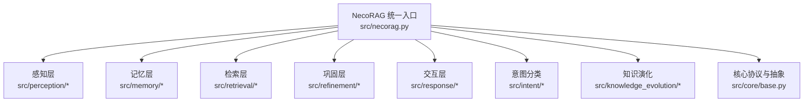
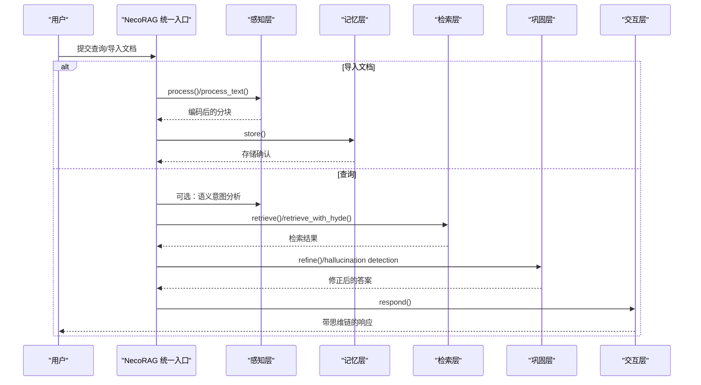
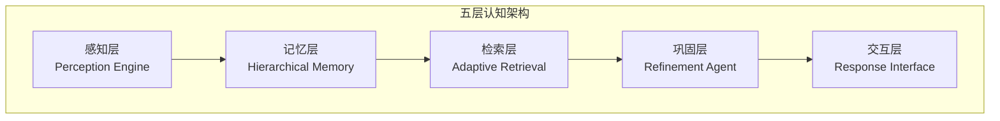
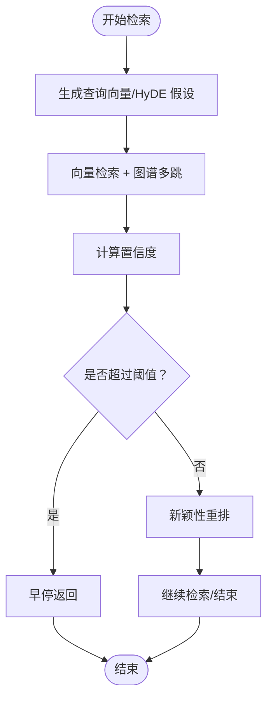
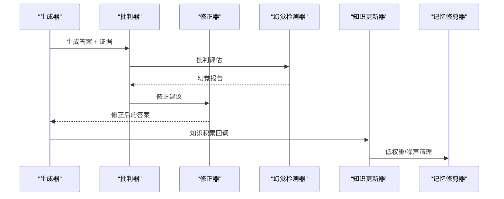
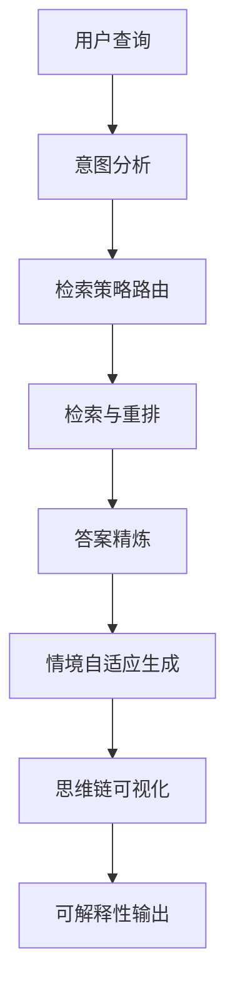
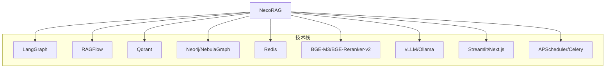

# 项目简介与核心理念

<cite>
**本文引用的文件**
- [README.md](file://README.md)
- [design/design.md](file://design/design.md)
- [src/necorag.py](file://src/necorag.py)
- [src/core/base.py](file://src/core/base.py)
- [src/memory/models.py](file://src/memory/models.py)
- [src/perception/models.py](file://src/perception/models.py)
- [src/refinement/models.py](file://src/refinement/models.py)
- [src/response/models.py](file://src/response/models.py)
- [src/knowledge_evolution/models.py](file://src/knowledge_evolution/models.py)
- [QUICKSTART.md](file://QUICKSTART.md)
</cite>

## 目录
1. [引言](#引言)
2. [项目结构](#项目结构)
3. [核心组件](#核心组件)
4. [架构总览](#架构总览)
5. [详细组件分析](#详细组件分析)
6. [依赖分析](#依赖分析)
7. [性能考量](#性能考量)
8. [故障排查指南](#故障排查指南)
9. [结论](#结论)
10. [附录](#附录)

## 引言
NecoRAG 是一个创新的认知型检索增强生成（RAG）框架，其核心理念源于对人脑双系统记忆与神经认知科学原理的深度模拟。项目通过“五层认知”架构，将感知、记忆、检索、巩固与交互五个阶段有机串联，形成从数据到知识再到智能决策的完整闭环。其目标是让 AI 的思考方式更接近人脑：具备工作记忆的瞬时处理、语义记忆的模糊检索、情景图谱的多跳推理、以及自我反思与知识进化的巩固机制。

本项目强调以下关键特性：
- 类脑记忆结构：三层记忆系统（工作记忆 L1 + 语义记忆 L2 + 情景图谱 L3）
- 智能早停机制：在达到置信阈值时立即终止检索，提升响应速度
- 自我反思与幻觉自检：通过生成-批判-修正闭环，持续提升答案质量
- 可解释性输出：思维链可视化，展示检索路径、证据来源与推理过程
- 配置管理与可视化：Web Dashboard 实时配置、监控与知识库健康度展示

## 项目结构
NecoRAG 采用模块化分层组织，核心模块围绕“五层认知”展开，同时提供统一入口类与抽象基类，确保可替换性与可扩展性。

**图表来源**
- [src/necorag.py:37-121](file://src/necorag.py#L37-L121)
- [src/core/base.py:20-750](file://src/core/base.py#L20-L750)

**章节来源**
- [README.md:35-85](file://README.md#L35-L85)
- [src/necorag.py:37-121](file://src/necorag.py#L37-L121)

## 核心组件
- 统一入口类 NecoRAG：提供文档导入、查询检索、知识演化与统计信息的统一 API，内部协调感知、记忆、检索、巩固与交互各层组件。
- 感知层（Perception Engine）：负责文档解析、弹性分块、多维向量化与情境标签生成，为后续检索与意图路由提供高质量输入。
- 记忆层（Hierarchical Memory）：三层记忆系统（L1 工作记忆、L2 语义记忆、L3 情景图谱），配合动态权重衰减与主动遗忘，模拟人脑记忆的巩固与修剪。
- 检索层（Adaptive Retrieval）：基于扩散激活理论的混合检索与重排序，支持 HyDE 增强、新颖性惩罚与早停机制。
- 巩固层（Refinement Agent）：异步知识固化、幻觉自检与记忆修剪，通过生成-批判-修正闭环持续优化答案质量。
- 交互层（Response Interface）：情境自适应生成与可解释性输出，支持用户画像适配、思维链可视化与多模态合成。
- 意图分类（Semantic Analyzer）：对用户查询进行语义意图识别与路由，实现策略差异化与动态适配。
- 知识演化（Knowledge Evolution）：实时与定时更新、候选池管理、健康度指标与可视化，维持知识库的“活体”状态。

**章节来源**
- [src/necorag.py:175-421](file://src/necorag.py#L175-L421)
- [src/core/base.py:20-750](file://src/core/base.py#L20-L750)

## 架构总览
NecoRAG 的“五层认知”架构从感知到交互逐层递进，每一层都有明确职责与协作关系。整体流程如下：

**图表来源**
- [src/necorag.py:328-421](file://src/necorag.py#L328-L421)
- [src/perception/models.py:11-69](file://src/perception/models.py#L11-L69)
- [src/memory/models.py:19-67](file://src/memory/models.py#L19-L67)
- [src/refinement/models.py:19-66](file://src/refinement/models.py#L19-L66)
- [src/response/models.py:34-53](file://src/response/models.py#L34-L53)

## 详细组件分析

### 类脑记忆结构与五层架构
- L1 工作记忆（Redis）：短期上下文与用户意图轨迹，TTL 自动过期，模拟“瞬时遗忘”。
- L2 语义记忆（Qdrant/Milvus）：高维向量存储，负责模糊匹配与直觉检索。
- L3 情景图谱（Neo4j/NebulaGraph）：实体关系网络，支持多跳推理与因果链条。
- 动态权重衰减：模拟生物记忆的巩固与遗忘，低频访问知识自动降权或归档。
- 五层职责分工：
  - 感知层：多模态数据的高精度编码与情境标记
  - 记忆层：分层存储与管理，动态权重衰减
  - 检索层：混合检索与重排序，HyDE 增强与早停机制
  - 巩固层：异步知识固化、幻觉自检与记忆修剪
  - 交互层：情境自适应生成与思维链可视化

**图表来源**
- [README.md:39-84](file://README.md#L39-L84)
- [design/design.md:595-601](file://design/design.md#L595-L601)

**章节来源**
- [README.md:198-243](file://README.md#L198-L243)
- [design/design.md:677-721](file://design/design.md#L677-L721)

### 智能早停机制与 HyDE 增强
- 早停机制：在检索过程中，一旦置信度超过阈值，立即终止冗余检索，显著降低延迟与资源消耗。
- HyDE 增强：先生成假设答案再检索，解决提问模糊问题，提升检索相关性。
- Novelty Re-ranker：在重排序中引入新颖性惩罚，抑制重复信息，优先展示新异知识。

**图表来源**
- [README.md:247-286](file://README.md#L247-L286)
- [design/design.md:687-696](file://design/design.md#L687-L696)

**章节来源**
- [README.md:247-286](file://README.md#L247-L286)
- [design/design.md:687-696](file://design/design.md#L687-L696)

### 幻觉自检与知识进化
- 幻觉自检闭环：Generator → Critic → Refiner → HallucinationDetector → KnowledgeConsolidator + MemoryPruner，三重验证确保事实一致性、证据支撑度与逻辑连贯性。
- 知识演化：实时更新（即时反馈学习）与定时批量更新（系统巩固学习）双模式，维护候选池与变更日志，持续优化知识库健康度。

**图表来源**
- [README.md:289-329](file://README.md#L289-L329)
- [src/necorag.py:423-447](file://src/necorag.py#L423-L447)
- [src/refinement/models.py:9-66](file://src/refinement/models.py#L9-L66)
- [src/knowledge_evolution/models.py:63-192](file://src/knowledge_evolution/models.py#L63-L192)

**章节来源**
- [README.md:289-329](file://README.md#L289-L329)
- [src/necorag.py:423-447](file://src/necorag.py#L423-L447)
- [src/refinement/models.py:9-66](file://src/refinement/models.py#L9-L66)
- [src/knowledge_evolution/models.py:63-192](file://src/knowledge_evolution/models.py#L63-L192)

### 思维链可视化与情境自适应
- 思维链可视化：输出检索路径、证据来源与推理过程，帮助用户理解 AI 的思考过程。
- 情境自适应：根据用户画像（专业程度、交互风格、偏好领域）动态调整回答风格与详细程度。

**图表来源**
- [README.md:333-376](file://README.md#L333-L376)
- [src/response/models.py:34-53](file://src/response/models.py#L34-L53)

**章节来源**
- [README.md:333-376](file://README.md#L333-L376)
- [src/response/models.py:34-53](file://src/response/models.py#L34-L53)

## 依赖分析
NecoRAG 的核心依赖与技术栈体现了“类脑记忆”的工程化落地：
- 编排引擎：LangGraph，支持复杂的循环状态机，实现“检索-反思-校正”闭环
- 文档解析：RAGFlow，业界最强的深度文档解析能力
- 向量数据库：Qdrant，高性能混合搜索（向量 + 关键词）
- 图数据库：Neo4j（社区版）/ NebulaGraph，成熟的图谱存储与多跳推理
- 缓存/工作记忆：Redis，极低延迟，适合短期会话状态
- 嵌入模型：BGE-M3，支持多语言、长文本、稠密 + 稀疏混合嵌入
- 重排序模型：BGE-Reranker-v2，中文优化好，精度高
- LLM 推理：vLLM / Ollama，高吞吐推理，支持本地部署隐私保护
- 前端/可视化：Streamlit / Next.js，快速构建演示与生产界面
- 任务调度：APScheduler / Celery，支持轻量与分布式任务队列

**图表来源**
- [README.md:496-522](file://README.md#L496-L522)
- [design/design.md:724-744](file://design/design.md#L724-L744)

**章节来源**
- [README.md:496-522](file://README.md#L496-L522)
- [design/design.md:724-744](file://design/design.md#L724-L744)

## 性能考量
- 检索准确率（Recall@K）：相比传统向量 RAG 提升 +20%
- 幻觉率：< 5%，通过精炼代理与幻觉自检闭环控制
- 简单查询延迟：< 800ms（首字延迟），得益于早停机制
- 复杂查询延迟：< 1500ms（多跳 + 重排）
- 上下文压缩率：-40%，通过记忆衰减机制减少 Token 消耗
- 知识更新效率：分钟级，支持增量更新与新文档快速入库
- 知识库健康度：> 80 分（规模、新鲜度、质量、连通性加权）

**章节来源**
- [README.md:465-474](file://README.md#L465-L474)
- [design/design.md:747-761](file://design/design.md#L747-L761)

## 故障排查指南
- Dashboard 启动失败：检查端口占用，必要时更换端口
- 导入测试失败：确认依赖安装与模块导入路径正确
- 检索结果不理想：调整 top_k、置信阈值与意图路由参数
- 知识库健康度下降：关注冗余度、碎片率与更新率，及时执行修剪与重建
- 幻觉率偏高：加强幻觉检测阈值与证据支撑度要求，优化生成-批判-修正闭环

**章节来源**
- [QUICKSTART.md:237-277](file://QUICKSTART.md#L237-L277)
- [src/necorag.py:504-666](file://src/necorag.py#L504-L666)

## 结论
NecoRAG 以神经认知科学为理论基石，通过“五层认知”架构与类脑记忆结构，实现了从感知到交互的完整智能闭环。其智能早停、幻觉自检与思维链可视化等技术优势，显著提升了检索准确率、响应速度与可解释性。结合知识演化与可视化 Dashboard，NecoRAG 不仅是一个技术框架，更是面向开发者与业务用户的“活体知识库”，具备持续学习与自我优化的能力。面向不同技术水平的开发者，项目提供了清晰的概念解释、统一的 API 与完善的抽象基类，既便于快速上手，也支持深度定制与扩展。

## 附录
- 快速开始与示例：参见 [QUICKSTART.md:1-325](file://QUICKSTART.md#L1-L325)
- 五层架构与核心特性：参见 [README.md:23-85](file://README.md#L23-L85)
- 设计文档与技术选型：参见 [design/design.md:1-814](file://design/design.md#L1-L814)
- 统一入口与模块 API：参见 [src/necorag.py:1-744](file://src/necorag.py#L1-L744)
- 抽象基类与协议：参见 [src/core/base.py:1-750](file://src/core/base.py#L1-L750)
- 数据模型概览：参见 [src/memory/models.py:1-67](file://src/memory/models.py#L1-L67)、[src/perception/models.py:1-69](file://src/perception/models.py#L1-L69)、[src/refinement/models.py:1-66](file://src/refinement/models.py#L1-L66)、[src/response/models.py:1-53](file://src/response/models.py#L1-L53)、[src/knowledge_evolution/models.py:1-367](file://src/knowledge_evolution/models.py#L1-L367)