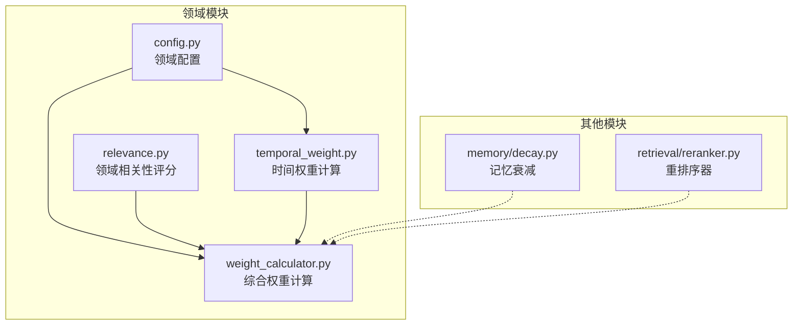
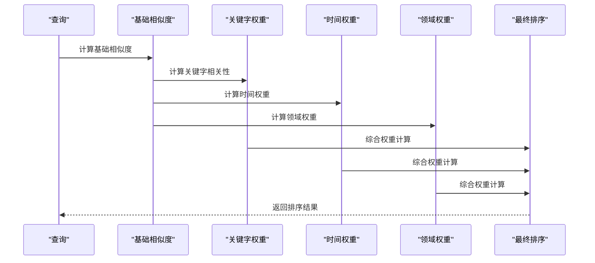
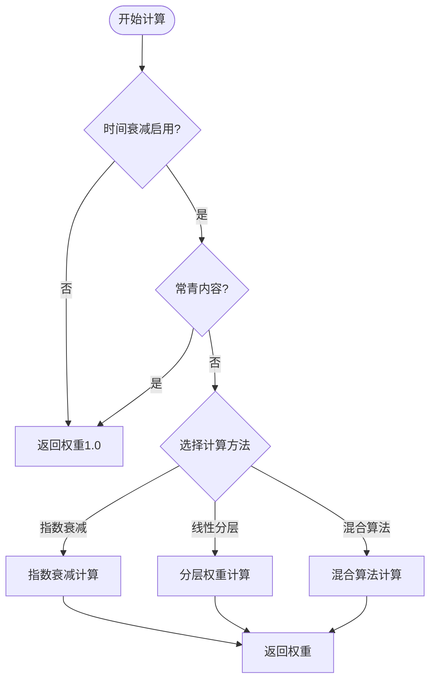
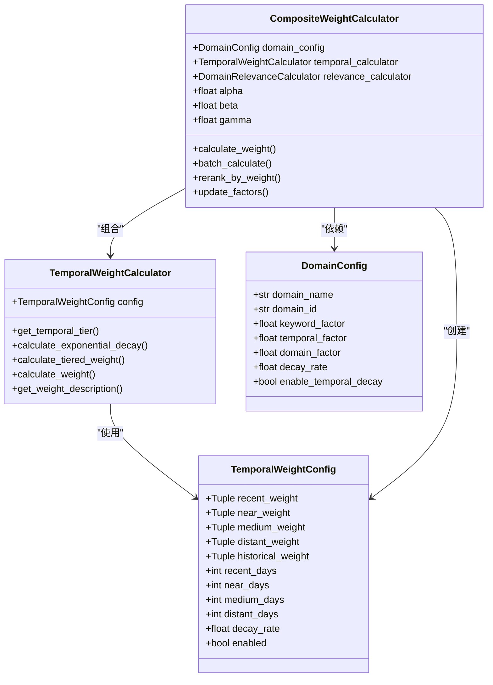

# 时间权重计算

<cite>
**本文档引用的文件**
- [temporal_weight.py](file://src/domain/temporal_weight.py)
- [weight_calculator.py](file://src/domain/weight_calculator.py)
- [relevance.py](file://src/domain/relevance.py)
- [config.py](file://src/domain/config.py)
- [decay.py](file://src/memory/decay.py)
- [reranker.py](file://src/retrieval/reranker.py)
- [domain_weight_example.py](file://example/domain_weight_example.py)
- [test_imports.py](file://tools/test_imports.py)
</cite>

## 目录
1. [简介](#简介)
2. [项目结构](#项目结构)
3. [核心组件](#核心组件)
4. [架构概览](#架构概览)
5. [详细组件分析](#详细组件分析)
6. [依赖分析](#依赖分析)
7. [性能考虑](#性能考虑)
8. [故障排除指南](#故障排除指南)
9. [结论](#结论)
10. [附录](#附录)

## 简介
本文件为 NecoRAG 时间权重计算模块的详细技术文档。该模块实现了基于时间的知识权重衰减机制，支持多种衰减算法（指数衰减、线性分层衰减、混合衰减），并通过权重因子控制在检索结果排序中的影响力。文档深入解释了时间衰减模型的实现原理、参数配置方法、在知识时效性管理中的作用以及对检索结果排序的影响，并提供了最佳实践和性能考虑。

## 项目结构
时间权重计算模块位于 `src/domain/` 目录下，主要包含以下文件：
- temporal_weight.py：时间权重计算核心实现
- weight_calculator.py：综合权重计算器，整合关键字、时间、领域权重
- relevance.py：领域相关性评分模块
- config.py：领域配置与权重因子定义
- decay.py：记忆衰减机制（与时间权重相关但独立）
- reranker.py：检索重排序器（与时间权重结合使用）



**图表来源**
- [temporal_weight.py:1-271](file://src/domain/temporal_weight.py#L1-L271)
- [weight_calculator.py:1-318](file://src/domain/weight_calculator.py#L1-L318)
- [relevance.py:1-328](file://src/domain/relevance.py#L1-L328)
- [config.py:1-285](file://src/domain/config.py#L1-L285)
- [decay.py:1-155](file://src/memory/decay.py#L1-L155)
- [reranker.py:1-179](file://src/retrieval/reranker.py#L1-L179)

**章节来源**
- [temporal_weight.py:1-271](file://src/domain/temporal_weight.py#L1-L271)
- [weight_calculator.py:1-318](file://src/domain/weight_calculator.py#L1-L318)
- [relevance.py:1-328](file://src/domain/relevance.py#L1-L328)
- [config.py:1-285](file://src/domain/config.py#L1-L285)
- [decay.py:1-155](file://src/memory/decay.py#L1-L155)
- [reranker.py:1-179](file://src/retrieval/reranker.py#L1-L179)

## 核心组件
时间权重计算模块由以下核心组件构成：

### 时间权重配置类
- TemporalWeightConfig：定义时间权重的配置参数，包括各时间层级的权重范围、时间分界点、衰减系数等
- 支持三种衰减算法：指数衰减、线性分层衰减、混合衰减

### 时间权重计算器
- TemporalWeightCalculator：提供时间权重计算的主要接口
- 支持时间层级划分、权重计算、权重描述等功能

### 预设配置
- DecayPresets：提供快速变化、正常变化、缓慢变化、常青领域的预设配置

### 综合权重计算
- CompositeWeightCalculator：整合关键字权重、时间权重、领域权重，计算最终检索权重
- 支持权重因子系数（alpha、beta、gamma）的配置

**章节来源**
- [temporal_weight.py:24-45](file://src/domain/temporal_weight.py#L24-L45)
- [temporal_weight.py:47-227](file://src/domain/temporal_weight.py#L47-L227)
- [temporal_weight.py:231-271](file://src/domain/temporal_weight.py#L231-L271)
- [weight_calculator.py:56-223](file://src/domain/weight_calculator.py#L56-L223)

## 架构概览
时间权重计算模块在整个检索系统中的位置如下：



**图表来源**
- [weight_calculator.py:81-146](file://src/domain/weight_calculator.py#L81-L146)
- [temporal_weight.py:160-195](file://src/domain/temporal_weight.py#L160-L195)
- [relevance.py:198-241](file://src/domain/relevance.py#L198-L241)

## 详细组件分析

### 时间权重配置系统

#### 时间层级定义
系统将文档时间划分为六个层级：
- 最近期（RECENT）：0-30天
- 近期（NEAR）：30-90天  
- 中期（MEDIUM）：90-365天
- 远期（DISTANT）：365-1095天
- 历史（HISTORICAL）：>1095天
- 常青（EVERGREEN）：不受时间衰减影响

#### 权重范围配置
每个时间层级都有对应的权重范围：
- 最近期：1.0-1.2（最高优先级）
- 近期：0.8-1.0（高优先级）
- 中期：0.5-0.8（中等优先级）
- 远期：0.3-0.5（低优先级）
- 历史：0.1-0.3（历史参考）

#### 衰减系数设置
- 默认衰减系数：0.001（每天）
- 快速变化领域：0.01（每天）
- 缓慢变化领域：0.0001（每天）
- 常青领域：禁用时间衰减

**章节来源**
- [temporal_weight.py:14-22](file://src/domain/temporal_weight.py#L14-L22)
- [temporal_weight.py:25-45](file://src/domain/temporal_weight.py#L25-L45)
- [temporal_weight.py:235-270](file://src/domain/temporal_weight.py#L235-L270)

### 时间权重计算算法

#### 指数衰减算法
指数衰减公式：`weight = e^(-λ × days_diff)`

其中：
- λ：衰减系数（decay_rate）
- days_diff：距离当前时间的天数差
- e：自然常数

特点：
- 连续递减，衰减速度与时间成正比
- 适用于需要精确控制衰减速度的场景
- 数学性质良好，便于理论分析

#### 线性分层衰减算法
分层衰减通过时间层级进行权重分配：
- 在每个层级内进行线性插值
- 层级间权重连续过渡
- 更符合人类对时间感知的直观理解

#### 混合衰减算法
混合算法：`(分层权重 + 指数衰减权重) / 2`

结合两种算法的优势：
- 保持层级间的连续性
- 增加时间敏感度
- 提供更精细的权重控制



**图表来源**
- [temporal_weight.py:160-195](file://src/domain/temporal_weight.py#L160-L195)
- [temporal_weight.py:84-109](file://src/domain/temporal_weight.py#L84-L109)
- [temporal_weight.py:111-158](file://src/domain/temporal_weight.py#L111-L158)

**章节来源**
- [temporal_weight.py:84-109](file://src/domain/temporal_weight.py#L84-L109)
- [temporal_weight.py:111-158](file://src/domain/temporal_weight.py#L111-L158)
- [temporal_weight.py:160-195](file://src/domain/temporal_weight.py#L160-L195)

### 综合权重计算系统

#### 权重因子配置
综合权重计算公式：
`final_score = base_score × α × keyword_weight × β × temporal_weight × γ × domain_weight × custom_weight`

其中：
- α（keyword_factor）：关键字权重因子
- β（temporal_factor）：时间权重因子  
- γ（domain_factor）：领域权重因子
- custom_weight：自定义权重加成

#### 权重范围控制
- 关键字权重：限制在 [0.5, 2.0] 范围内
- 时间权重：范围为 (0, 1]
- 领域权重：根据领域等级确定
- 自定义权重：可放大或缩小权重效果

#### 批量计算与排序
- 支持批量计算多个文档的权重
- 按最终分数降序排序
- 支持 top-k 结果截断

**章节来源**
- [weight_calculator.py:81-146](file://src/domain/weight_calculator.py#L81-L146)
- [weight_calculator.py:162-205](file://src/domain/weight_calculator.py#L162-L205)
- [weight_calculator.py:207-223](file://src/domain/weight_calculator.py#L207-L223)

### 预设配置系统

#### 快速变化领域（新闻、科技）
- 衰减系数：0.01（每天）
- 时间分界：最近期7天，近期30天
- 适用场景：信息更新频繁、时效性强的内容

#### 正常变化领域（学术、技术文档）
- 衰减系数：0.001（每天）
- 时间分界：最近期30天，近期90天
- 适用场景：大多数知识库的标准配置

#### 缓慢变化领域（历史、法律）
- 衰减系数：0.0001（每天）
- 时间分界：最近期90天，近期365天
- 适用场景：稳定性强、更新频率低的内容

#### 常青领域（基础科学）
- 禁用时间衰减：enabled=False
- 适用场景：理论基础、经典文献

**章节来源**
- [temporal_weight.py:235-270](file://src/domain/temporal_weight.py#L235-L270)

## 依赖分析

### 组件间依赖关系



**图表来源**
- [temporal_weight.py:24-51](file://src/domain/temporal_weight.py#L24-L51)
- [temporal_weight.py:47-227](file://src/domain/temporal_weight.py#L47-L227)
- [weight_calculator.py:56-80](file://src/domain/weight_calculator.py#L56-L80)
- [config.py:53-161](file://src/domain/config.py#L53-L161)

### 外部依赖
- math：用于指数函数计算
- datetime：时间计算和比较
- dataclasses：数据结构定义
- enum：枚举类型定义

**章节来源**
- [temporal_weight.py:7-11](file://src/domain/temporal_weight.py#L7-L11)
- [weight_calculator.py:7-13](file://src/domain/weight_calculator.py#L7-L13)

## 性能考虑

### 时间复杂度分析
- 时间权重计算：O(1) - 基本的数学运算
- 分层权重计算：O(1) - 常数时间的条件判断和线性插值
- 指数衰减计算：O(1) - 单次指数函数计算
- 批量计算：O(n) - n为文档数量

### 空间复杂度分析
- 配置对象：O(1) - 固定大小的数据结构
- 计算器对象：O(1) - 固定大小的对象
- 批量结果：O(n) - 存储n个权重结果

### 性能优化建议
1. **缓存策略**：对于相同时间的文档，可以缓存计算结果
2. **批量处理**：优先使用批量计算接口减少函数调用开销
3. **算法选择**：根据场景选择合适的衰减算法
4. **配置优化**：合理设置衰减系数避免过度计算

### 内存使用
- 时间权重计算器：轻量级对象，内存占用极小
- 批量计算：结果列表占用 O(n) 内存
- 配置持久化：JSON 文件存储，内存占用较小

## 故障排除指南

### 常见问题与解决方案

#### 问题1：时间权重始终为1.0
**可能原因**：
- 时间衰减被禁用
- 文档标记为常青内容
- 配置错误

**解决方法**：
- 检查 `enabled` 参数
- 确认 `is_evergreen` 标志
- 验证配置参数设置

#### 问题2：权重计算异常
**可能原因**：
- 时间参数错误
- 衰减系数过大
- 数据类型不匹配

**解决方法**：
- 验证输入时间格式
- 调整衰减系数范围
- 确保时间参数为 datetime 类型

#### 问题3：排序结果不符合预期
**可能原因**：
- 权重因子配置不当
- 基础分数过低
- 自定义权重影响

**解决方法**：
- 调整权重因子（α、β、γ）
- 检查基础相似度计算
- 审核自定义权重设置

**章节来源**
- [temporal_weight.py:176-180](file://src/domain/temporal_weight.py#L176-L180)
- [weight_calculator.py:108-109](file://src/domain/weight_calculator.py#L108-L109)

## 结论
NecoRAG 的时间权重计算模块通过灵活的配置系统和多种衰减算法，为知识时效性管理提供了强大的工具。模块设计具有以下特点：

1. **灵活性**：支持多种衰减算法和预设配置
2. **可扩展性**：易于添加新的衰减模型和配置选项
3. **实用性**：与检索系统无缝集成，直接影响排序结果
4. **可维护性**：清晰的代码结构和完善的文档

通过合理配置时间权重因子和衰减参数，可以在保证知识时效性的同时，维持检索结果的相关性和准确性。

## 附录

### 数学公式总结

#### 指数衰减公式
```
weight = e^(-λ × t)
```
其中：
- λ：衰减系数
- t：时间（天）

#### 线性分层衰减
```
weight = max_weight - position × (max_weight - min_weight)
position = (t - start_days) / (end_days - start_days)
```

#### 综合权重计算
```
final_score = base_score × α × keyword_weight × β × temporal_weight × γ × domain_weight × custom_weight
```

### 配置最佳实践

#### 快速变化领域配置
- 衰减系数：0.01-0.05
- 最近期时间：7-14天
- 近期时间：30-60天

#### 正常变化领域配置
- 衰减系数：0.001-0.005
- 最近期时间：30-60天
- 近期时间：90-180天

#### 缓慢变化领域配置
- 衰减系数：0.0001-0.001
- 最近期时间：90-180天
- 近期时间：365-730天

### 测试用例参考

#### 时间权重测试
- 测试不同时间层级的权重计算
- 验证衰减系数对权重的影响
- 比较不同衰减算法的结果

#### 综合权重测试
- 验证权重因子对最终结果的影响
- 测试批量计算的正确性
- 检查排序功能的准确性

**章节来源**
- [domain_weight_example.py:76-111](file://example/domain_weight_example.py#L76-L111)
- [domain_weight_example.py:145-202](file://example/domain_weight_example.py#L145-L202)