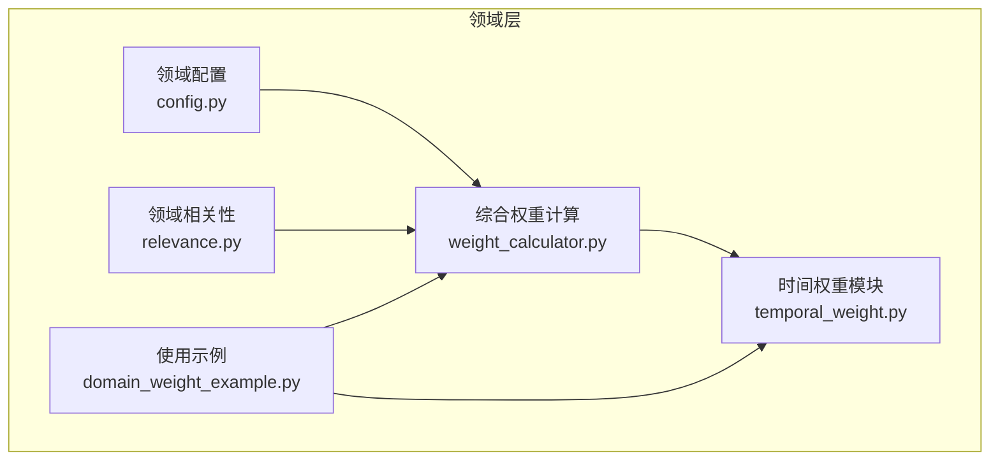
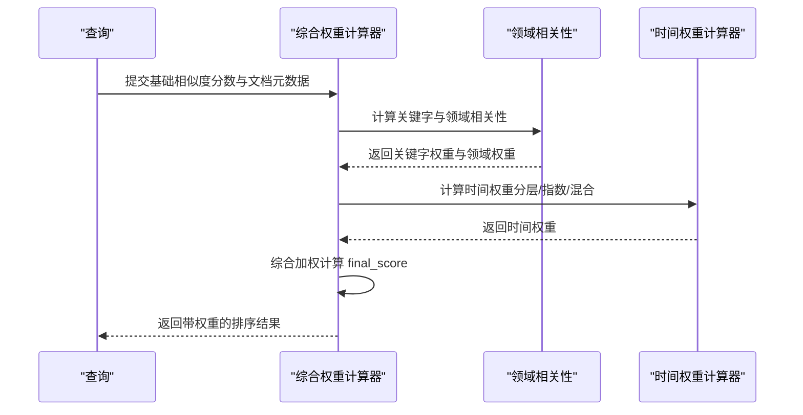
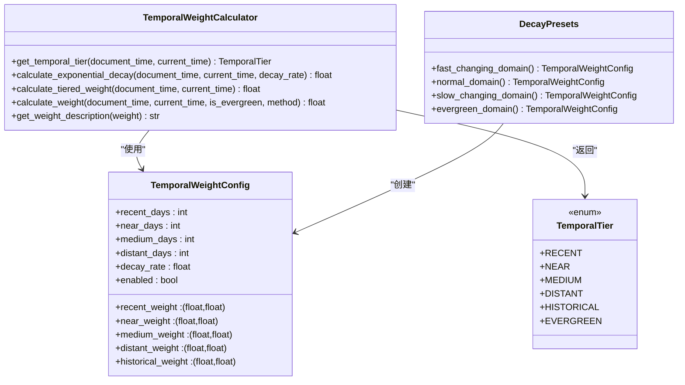
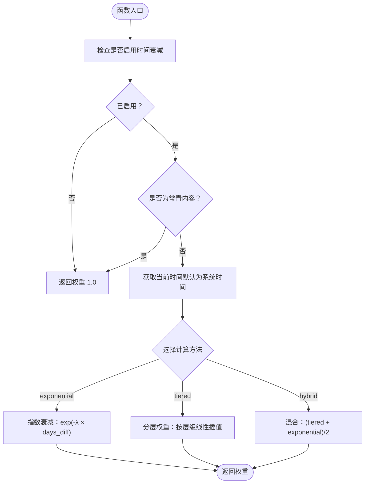
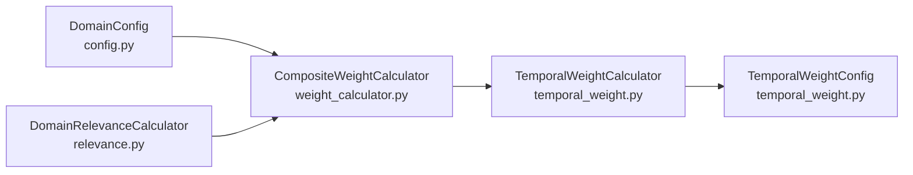

# 时间权重计算

<cite>
**本文引用的文件**
- [src/domain/temporal_weight.py](file://src/domain/temporal_weight.py)
- [src/domain/weight_calculator.py](file://src/domain/weight_calculator.py)
- [src/domain/config.py](file://src/domain/config.py)
- [src/domain/relevance.py](file://src/domain/relevance.py)
- [example/domain_weight_example.py](file://example/domain_weight_example.py)
</cite>

## 目录
1. [简介](#简介)
2. [项目结构](#项目结构)
3. [核心组件](#核心组件)
4. [架构总览](#架构总览)
5. [详细组件分析](#详细组件分析)
6. [依赖关系分析](#依赖关系分析)
7. [性能考量](#性能考量)
8. [故障排查指南](#故障排查指南)
9. [结论](#结论)
10. [附录](#附录)

## 简介
本技术文档围绕时间权重计算模块展开，重点阐释 TemporalWeightCalculator 类的实现原理与使用方式，覆盖以下主题：
- 指数衰减模型与时间权重计算算法
- 时间层级划分与权重范围映射
- 常青内容（evergreen_content）的特殊处理与权重调整策略
- 时间权重与文档更新频率的关系、动态调整与边界条件
- 时间窗口设置、权重归一化与边界处理
- 可视化图表与调优指南
- 与系统时间同步与时区处理机制

## 项目结构
时间权重计算模块位于领域层（src/domain），并与领域配置、相关性评分、综合权重计算紧密协作：
- 时间权重核心：src/domain/temporal_weight.py
- 综合权重计算：src/domain/weight_calculator.py
- 领域配置与因子：src/domain/config.py
- 领域相关性评分：src/domain/relevance.py
- 使用示例：example/domain_weight_example.py

**图表来源**
- [src/domain/temporal_weight.py:1-271](file://src/domain/temporal_weight.py#L1-L271)
- [src/domain/weight_calculator.py:1-318](file://src/domain/weight_calculator.py#L1-L318)
- [src/domain/config.py:1-285](file://src/domain/config.py#L1-L285)
- [src/domain/relevance.py:1-328](file://src/domain/relevance.py#L1-L328)
- [example/domain_weight_example.py:1-267](file://example/domain_weight_example.py#L1-L267)

**章节来源**
- [src/domain/temporal_weight.py:1-271](file://src/domain/temporal_weight.py#L1-L271)
- [src/domain/weight_calculator.py:1-318](file://src/domain/weight_calculator.py#L1-L318)
- [src/domain/config.py:1-285](file://src/domain/config.py#L1-L285)
- [src/domain/relevance.py:1-328](file://src/domain/relevance.py#L1-L328)
- [example/domain_weight_example.py:1-267](file://example/domain_weight_example.py#L1-L267)

## 核心组件
- TemporalWeightCalculator：提供时间权重计算的主接口，支持分层权重、指数衰减与混合方法，并内置常青内容的特殊处理。
- TemporalWeightConfig：时间权重配置项，包含各时间层级的权重范围、分界天数、衰减系数与开关。
- DecayPresets：预设的衰减配置，面向不同变化速率的领域（快速变化、正常变化、缓慢变化、常青）。
- CompositeWeightCalculator：综合权重计算器，整合关键字权重、时间权重与领域权重，输出最终检索权重。

**章节来源**
- [src/domain/temporal_weight.py:14-271](file://src/domain/temporal_weight.py#L14-L271)
- [src/domain/weight_calculator.py:56-223](file://src/domain/weight_calculator.py#L56-L223)
- [src/domain/config.py:54-161](file://src/domain/config.py#L54-L161)

## 架构总览
时间权重模块在检索重排流程中的位置如下：

**图表来源**
- [src/domain/weight_calculator.py:81-146](file://src/domain/weight_calculator.py#L81-L146)
- [src/domain/relevance.py:198-200](file://src/domain/relevance.py#L198-L200)
- [src/domain/temporal_weight.py:160-195](file://src/domain/temporal_weight.py#L160-L195)

## 详细组件分析

### 时间权重计算器（TemporalWeightCalculator）
- 时间层级划分
  - 最近期（RECENT）：0-30天
  - 近期（NEAR）：30-90天
  - 中期（MEDIUM）：90-365天
  - 远期（DISTANT）：365-1095天
  - 历史（HISTORICAL）：>1095天
  - 常青（EVERGREEN）：不受时间衰减影响
- 分层权重计算
  - 根据文档时间与当前时间差，确定时间层级
  - 在层级内对权重范围进行线性插值，得到分层权重
- 指数衰减权重
  - 公式：weight = exp(-λ × days_diff)，其中 λ 为衰减系数
  - days_diff 为文档时间与当前时间的天数差（取非负）
- 混合方法
  - 将分层权重与指数衰减权重取平均，兼顾层级与连续衰减
- 常青内容处理
  - 若 is_evergreen 为真或配置禁用时间衰减，则直接返回权重 1.0
- 权重描述
  - 提供权重到优先级的文字描述，便于调试与可视化

**图表来源**
- [src/domain/temporal_weight.py:14-271](file://src/domain/temporal_weight.py#L14-L271)

**章节来源**
- [src/domain/temporal_weight.py:47-227](file://src/domain/temporal_weight.py#L47-L227)

### 时间权重计算流程（算法）

**图表来源**
- [src/domain/temporal_weight.py:160-195](file://src/domain/temporal_weight.py#L160-L195)

**章节来源**
- [src/domain/temporal_weight.py:84-195](file://src/domain/temporal_weight.py#L84-L195)

### 常青内容（Evergreen）处理机制
- 常青内容的判定
  - 通过文档元数据中的 is_evergreen 字段或配置禁用时间衰减
- 权重调整策略
  - 直接返回权重 1.0，不参与任何时间衰减计算
- 适用场景
  - 基础科学、法律条文、标准规范等长期稳定的知识

**章节来源**
- [src/domain/weight_calculator.py:112-117](file://src/domain/weight_calculator.py#L112-L117)
- [src/domain/temporal_weight.py:176-180](file://src/domain/temporal_weight.py#L176-L180)

### 时间权重与更新频率的关系与动态调整
- 更新频率与权重的关系
  - 更新越频繁的文档，在“最近”层级内权重越高；若采用指数衰减，距离上次更新越近权重越高
- 动态调整算法
  - 分层权重：根据天数差在线性区间内插值得到权重
  - 指数衰减：以衰减系数控制权重随时间下降的速度
  - 混合方法：兼顾层级的离散变化与时间的连续衰减
- 边界条件
  - 未来时间（days_diff < 0）视为最近期
  - 历史层级固定为最小权重
  - 分层插值时对边界进行保护，避免非法区间导致的异常

**章节来源**
- [src/domain/temporal_weight.py:53-158](file://src/domain/temporal_weight.py#L53-L158)

### 时间窗口设置、权重归一化与边界处理
- 时间窗口设置
  - 通过 TemporalWeightConfig 的 days 阈值（recent_days、near_days、medium_days、distant_days）定义层级边界
- 权重归一化
  - 分层权重在各层级的权重范围内进行线性插值，确保权重在 [min_weight, max_weight] 内
  - 指数衰减权重在 (0, 1] 区间内
- 边界处理
  - 未来时间统一进入最近层级
  - 历史层级固定为最小权重
  - 对分界天数的合法性进行保护，防止除零或非法区间

**章节来源**
- [src/domain/temporal_weight.py:25-44](file://src/domain/temporal_weight.py#L25-L44)
- [src/domain/temporal_weight.py:132-158](file://src/domain/temporal_weight.py#L132-L158)

### 与系统时间同步与时区处理
- 系统时间同步
  - 默认使用当前系统时间作为 current_time，保证与系统时间一致
- 时区处理
  - 当前实现未引入显式的时区转换逻辑，建议在上游统一转换为 UTC 或本地时间后再传入
  - 若业务需要跨时区一致性，应在调用前完成时区标准化

**章节来源**
- [src/domain/temporal_weight.py:50-101](file://src/domain/temporal_weight.py#L50-L101)

### 使用示例与可视化
- 示例脚本展示了不同时间文档的权重对比、快速变化领域的衰减曲线以及综合权重计算流程
- 可基于示例输出绘制时间权重随天数变化的折线图，横轴为天数差，纵轴为权重

**章节来源**
- [example/domain_weight_example.py:76-112](file://example/domain_weight_example.py#L76-L112)
- [example/domain_weight_example.py:145-202](file://example/domain_weight_example.py#L145-L202)

## 依赖关系分析
- 组件耦合
  - CompositeWeightCalculator 依赖 TemporalWeightCalculator 与 DomainRelevanceCalculator
  - TemporalWeightCalculator 依赖 TemporalWeightConfig
- 外部依赖
  - datetime、timedelta 用于时间计算
  - math.exp 用于指数衰减
- 循环依赖
  - 模块间无循环导入，职责清晰

**图表来源**
- [src/domain/weight_calculator.py:59-74](file://src/domain/weight_calculator.py#L59-L74)
- [src/domain/temporal_weight.py:50-51](file://src/domain/temporal_weight.py#L50-L51)
- [src/domain/config.py:54-75](file://src/domain/config.py#L54-L75)

**章节来源**
- [src/domain/weight_calculator.py:11-13](file://src/domain/weight_calculator.py#L11-L13)
- [src/domain/temporal_weight.py:7-11](file://src/domain/temporal_weight.py#L7-L11)

## 性能考量
- 时间复杂度
  - 分层权重与指数衰减均为 O(1)，整体计算开销极小
- 内存占用
  - 主要为配置对象与少量中间变量，内存占用可忽略
- 优化建议
  - 批量计算时复用计算器实例，减少重复初始化
  - 对大量文档的权重计算可并行化（注意线程安全与共享状态）

[本节为通用性能讨论，无需特定文件来源]

## 故障排查指南
- 常见问题
  - 权重始终为 1.0：确认 is_evergreen 或配置的 enabled 是否为 False
  - 权重异常为 0 或 NaN：检查时间输入是否为未来时间或异常时间戳
  - 权重波动过大：调整 decay_rate 或切换到分层权重
- 调试建议
  - 使用 get_weight_description 输出权重描述，辅助定位问题
  - 在示例脚本中对比不同时间文档的权重，观察趋势

**章节来源**
- [src/domain/temporal_weight.py:197-208](file://src/domain/temporal_weight.py#L197-L208)
- [example/domain_weight_example.py:76-112](file://example/domain_weight_example.py#L76-L112)

## 结论
时间权重计算模块通过分层权重、指数衰减与混合方法，实现了对知识时效性的灵活建模。结合常青内容的特殊处理与领域配置因子，能够有效提升检索结果的相关性与时效性。建议在实际部署中根据领域特性选择合适的衰减配置，并结合示例脚本进行调优与可视化验证。

[本节为总结性内容，无需特定文件来源]

## 附录

### 参数与配置速查
- 衰减系数（λ）
  - 快速变化领域：较大值，权重下降更快
  - 正常变化领域：适中值
  - 缓慢变化领域：较小值
  - 常青领域：禁用时间衰减
- 时间分界（天）
  - 最近期、近期、中期、远期、历史的阈值可按需调整
- 权重范围（每层）
  - 各层级的最小/最大权重构成权重区间，用于线性插值

**章节来源**
- [src/domain/temporal_weight.py:25-44](file://src/domain/temporal_weight.py#L25-L44)
- [src/domain/temporal_weight.py:231-271](file://src/domain/temporal_weight.py#L231-L271)
- [src/domain/config.py:67-75](file://src/domain/config.py#L67-L75)