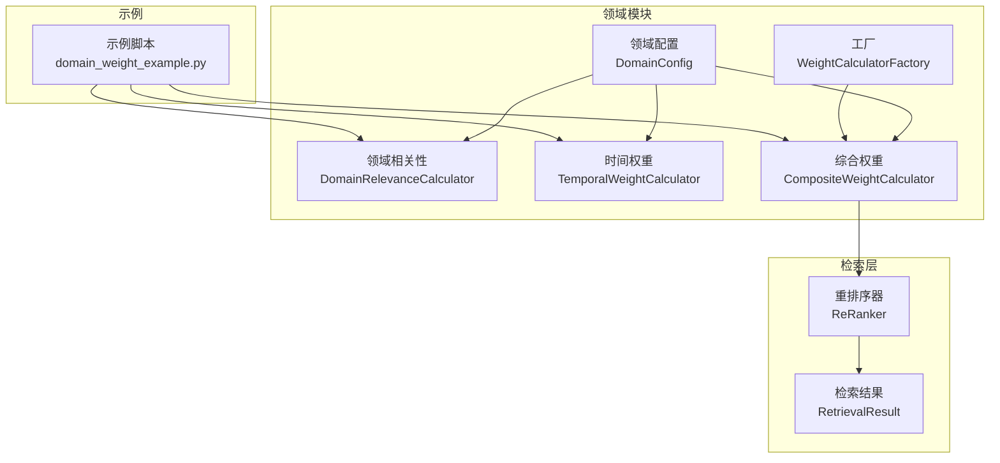
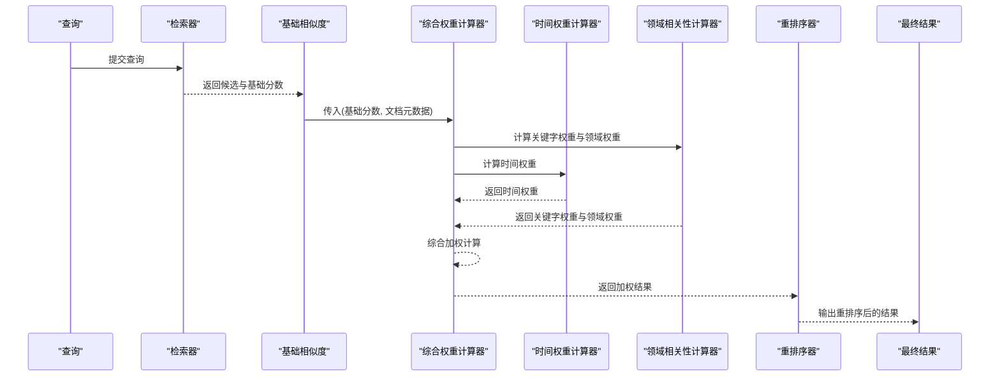
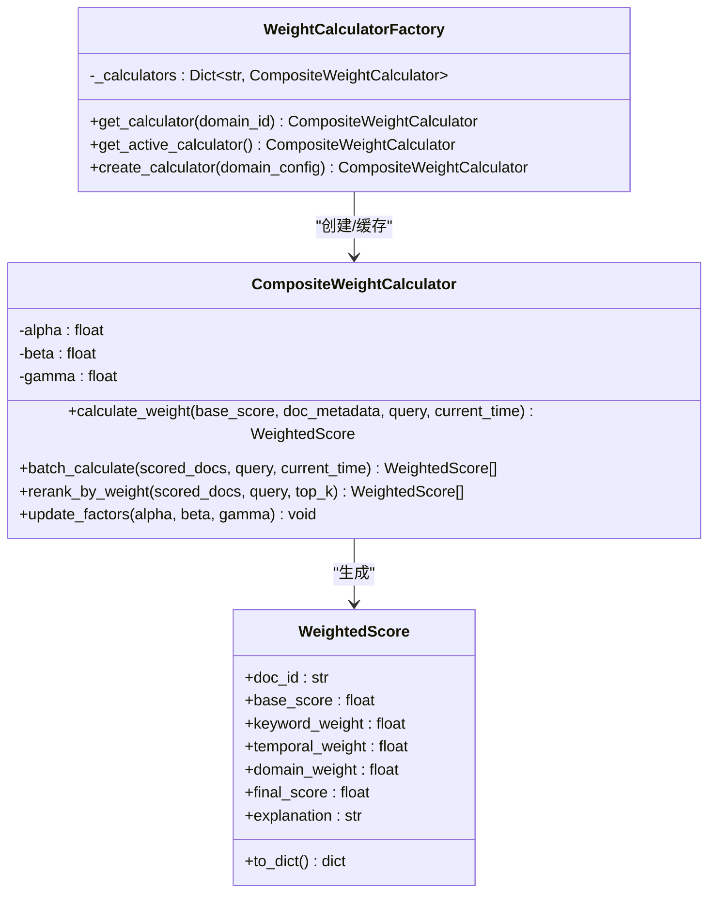
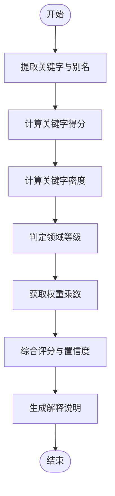
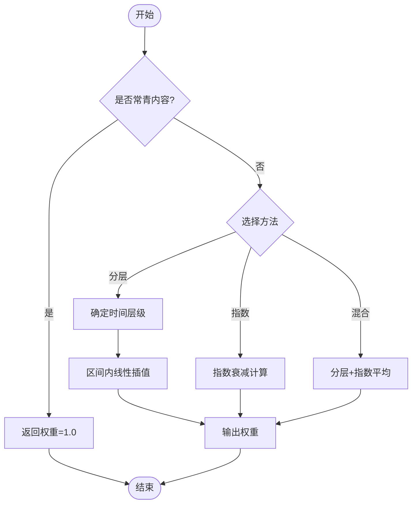
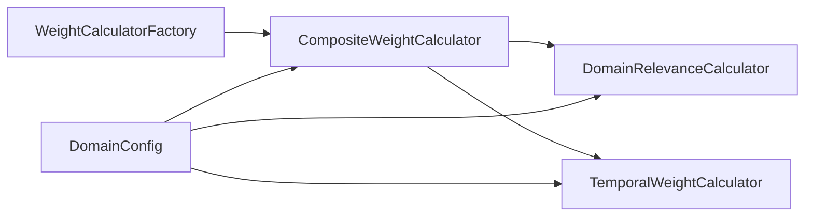
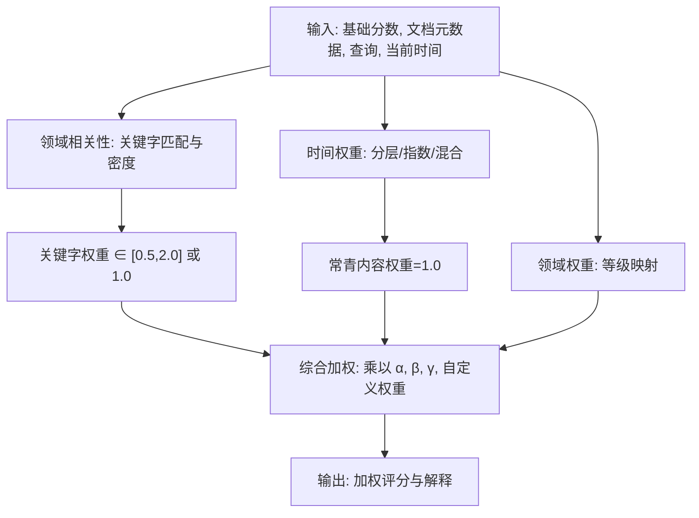

# 权重计算器

<cite>
**本文引用的文件**
- [weight_calculator.py](file://src/domain/weight_calculator.py)
- [relevance.py](file://src/domain/relevance.py)
- [temporal_weight.py](file://src/domain/temporal_weight.py)
- [config.py](file://src/domain/config.py)
- [__init__.py](file://src/domain/__init__.py)
- [domain_weight_example.py](file://example/domain_weight_example.py)
- [reranker.py](file://src/retrieval/reranker.py)
- [models.py](file://src/retrieval/models.py)
- [exceptions.py](file://src/core/exceptions.py)
- [config.py](file://src/core/config.py)
</cite>

## 目录
1. [简介](#简介)
2. [项目结构](#项目结构)
3. [核心组件](#核心组件)
4. [架构总览](#架构总览)
5. [详细组件分析](#详细组件分析)
6. [依赖关系分析](#依赖关系分析)
7. [性能考量](#性能考量)
8. [故障排查指南](#故障排查指南)
9. [结论](#结论)
10. [附录](#附录)

## 简介
本文件为“权重计算器”模块的技术文档，聚焦复合权重计算的算法实现与工程实践。该模块通过整合“关键字权重”、“时间权重”和“领域权重”，形成最终的检索加权分数，并提供批量重排序、权重因子动态更新、领域配置持久化与工厂化管理能力。文档同时给出数学原理、算法流程图、在检索过程中的应用方式、性能优化策略、缓存机制建议、调试与错误处理方法，以及扩展自定义权重计算函数的指导。

## 项目结构
权重计算器位于领域知识与权重管理子模块中，与时间权重、领域相关性、领域配置共同构成完整的权重体系；示例脚本展示了典型使用方式；检索层的重排序器提供了与权重计算的衔接点。

图表来源
- [weight_calculator.py:56-223](file://src/domain/weight_calculator.py#L56-L223)
- [relevance.py:29-241](file://src/domain/relevance.py#L29-L241)
- [temporal_weight.py:47-195](file://src/domain/temporal_weight.py#L47-L195)
- [config.py:54-161](file://src/domain/config.py#L54-L161)
- [domain_weight_example.py:22-202](file://example/domain_weight_example.py#L22-L202)
- [reranker.py:10-70](file://src/retrieval/reranker.py#L10-L70)
- [models.py:9-29](file://src/retrieval/models.py#L9-L29)

章节来源
- [__init__.py:7-68](file://src/domain/__init__.py#L7-L68)

## 核心组件
- 综合权重计算器：负责将关键字权重、时间权重、领域权重与基础相似度相乘，得到最终加权分数，并提供批量重排序与权重因子更新能力。
- 领域相关性计算器：基于关键字匹配与密度计算，输出领域等级与权重乘数，同时提供查询增强能力。
- 时间权重计算器：根据文档发布时间与当前时间，按分层或指数衰减方式计算时间权重，支持常青内容豁免。
- 领域配置与工厂：提供领域配置的增删改查、持久化、活动域切换与计算器实例化。

章节来源
- [weight_calculator.py:56-223](file://src/domain/weight_calculator.py#L56-L223)
- [relevance.py:29-241](file://src/domain/relevance.py#L29-L241)
- [temporal_weight.py:47-195](file://src/domain/temporal_weight.py#L47-L195)
- [config.py:54-161](file://src/domain/config.py#L54-L161)

## 架构总览
权重计算在检索管线中的位置如下：基础相似度由检索阶段产生，随后进入权重计算器，综合三类权重后参与重排序与最终排序输出。

图表来源
- [weight_calculator.py:81-146](file://src/domain/weight_calculator.py#L81-L146)
- [relevance.py:198-241](file://src/domain/relevance.py#L198-L241)
- [temporal_weight.py:160-195](file://src/domain/temporal_weight.py#L160-L195)
- [reranker.py:41-70](file://src/retrieval/reranker.py#L41-L70)

## 详细组件分析

### 综合权重计算器（CompositeWeightCalculator）
- 职责
  - 将基础相似度与三类权重相乘，得到最终加权分数。
  - 支持批量计算与重排序。
  - 提供权重因子动态更新能力。
- 关键公式
  - 最终分数 = 基础分数 × (α × 关键字权重) × (β × 时间权重) × (γ × 领域权重) × 自定义权重加成
  - 其中 α、β、γ 为权重因子系数，分别对应关键字、时间、领域三个维度。
- 权重范围控制
  - 关键字权重在正样本上限制在 [0.5, 2.0]，负样本保持为 1.0。
  - 领域权重乘数来自领域等级映射，范围通常在 [0.2, 1.5]。
  - 时间权重在分层或指数衰减下，通常在 (0, 1] 区间，常青内容固定为 1.0。
- 重排序流程
  - 批量计算后按最终分数降序排序，可截取 top_k。
- 工厂与持久化
  - 工厂按领域 ID 缓存计算器实例，避免重复初始化。
  - 领域配置支持持久化与加载，便于跨进程/重启复用。

图表来源
- [weight_calculator.py:56-223](file://src/domain/weight_calculator.py#L56-L223)

章节来源
- [weight_calculator.py:56-223](file://src/domain/weight_calculator.py#L56-L223)

### 领域相关性计算器（DomainRelevanceCalculator）
- 职责
  - 从文本中提取关键字并统计权重，计算关键字得分与密度得分。
  - 根据综合指标判定领域等级（核心/相关/边缘/领域外），并映射到权重乘数。
  - 提供查询增强与关键字扩展能力。
- 关键公式
  - 关键字得分 = Σ(关键字权重 × 出现次数) / 总关键字数，限制在 [0, 2.0]。
  - 关键字密度 = 关键字出现次数 / 总词数，放大后限制在 [0, 1]。
  - 综合评分 = min(1.0, (关键字得分×0.7 + 密度得分×0.3)/1.5)。
  - 领域等级 = f(关键字得分, 密度得分)，权重乘数来自等级映射。
- 权重范围控制
  - 关键字得分经归一化与上限/下限裁剪，确保与时间权重、领域权重在同一尺度上协同。
  - 置信度基于匹配关键字数量，上限为 1.0。

图表来源
- [relevance.py:66-241](file://src/domain/relevance.py#L66-L241)

章节来源
- [relevance.py:29-241](file://src/domain/relevance.py#L29-L241)

### 时间权重计算器（TemporalWeightCalculator）
- 职责
  - 根据文档发布时间与当前时间，计算时间权重。
  - 支持三种方法：分层权重、指数衰减、混合方法。
  - 常青内容（is_evergreen）权重固定为 1.0。
- 关键公式
  - 分层权重：按时间区间线性插值，区间权重范围由配置决定。
  - 指数衰减：weight = exp(-λ × 天数差)，λ 为衰减系数。
  - 混合方法：(分层权重 + 指数衰减)/2。
- 权重范围控制
  - 分层权重在各区间上下限之间，常青内容恒为 1.0。
  - 指数衰减在 (0, 1] 区间，随天数增加单调递减。

图表来源
- [temporal_weight.py:160-195](file://src/domain/temporal_weight.py#L160-L195)

章节来源
- [temporal_weight.py:47-195](file://src/domain/temporal_weight.py#L47-L195)

### 领域配置与工厂
- 领域配置（DomainConfig）
  - 关键字字典、权重因子（α、β、γ）、时间衰减参数、领域权重乘数映射。
  - 提供关键字增删、权重范围校验、序列化/反序列化。
- 工厂（WeightCalculatorFactory）
  - 按领域 ID 缓存计算器实例，支持活动域获取与新配置创建。
- 示例脚本
  - 展示了领域配置创建、时间权重计算、相关性评分、综合权重计算与配置持久化。

章节来源
- [config.py:54-161](file://src/domain/config.py#L54-L161)
- [weight_calculator.py:225-276](file://src/domain/weight_calculator.py#L225-L276)
- [domain_weight_example.py:22-202](file://example/domain_weight_example.py#L22-L202)

## 依赖关系分析
- 组件耦合
  - 综合权重计算器依赖领域相关性与时间权重两个子计算器，耦合度适中，职责清晰。
  - 工厂与配置管理器解耦，便于按需加载与缓存。
- 外部依赖
  - 时间权重依赖标准库 datetime 与 math。
  - 领域相关性依赖正则表达式与集合统计。
- 潜在循环依赖
  - 模块间为单向依赖，未发现循环导入。

图表来源
- [weight_calculator.py:56-223](file://src/domain/weight_calculator.py#L56-L223)
- [relevance.py:29-241](file://src/domain/relevance.py#L29-L241)
- [temporal_weight.py:47-195](file://src/domain/temporal_weight.py#L47-L195)
- [config.py:54-161](file://src/domain/config.py#L54-L161)

## 性能考量
- 计算复杂度
  - 关键字匹配：对每个关键字进行正则查找，整体复杂度近似 O(K×N)，K 为关键字数，N 为文本长度。
  - 时间权重：O(1)，分层或指数计算均为常数时间。
  - 综合加权：O(M)，M 为候选文档数。
- 优化策略
  - 关键字索引：在领域配置构建时预编译关键字正则与别名映射，减少运行时正则编译开销。
  - 批量计算：使用列表推导与内置函数，避免 Python 循环开销。
  - 结果缓存：工厂按领域 ID 缓存计算器实例；可考虑对“相同输入”的加权结果做内存缓存（例如以基础分数、文档内容哈希、当前时间为键）。
  - 并行化：在大规模候选集上，可将批量计算拆分为多个任务并发执行（注意线程安全与共享状态）。
  - 早停与阈值：在检索早期可设置置信度阈值，减少后续权重计算成本。
- I/O 与持久化
  - 领域配置持久化为 JSON 文件，读写频率较低；建议在配置变更时批量保存，避免频繁 I/O。

[本节为通用性能讨论，无需特定文件引用]

## 故障排查指南
- 常见问题
  - 关键字权重异常：检查关键字权重范围与别名映射是否正确。
  - 时间权重为 0 或异常：确认文档时间戳是否在未来、是否启用常青内容、衰减系数是否过大。
  - 领域权重乘数异常：检查领域等级映射与配置项是否一致。
  - 重排序结果不符合预期：核对权重因子 α、β、γ 设置与自定义权重加成。
- 调试方法
  - 使用示例脚本逐段验证：先验证时间权重、再验证相关性评分、最后验证综合权重。
  - 打印中间变量：查看关键字匹配数量、密度得分、领域等级与权重乘数。
  - 单元测试：针对极端输入（空文本、全别名、未来时间等）进行测试。
- 错误处理
  - 统一异常体系：可参考系统异常定义，为权重计算模块新增专用异常类型（如 WeightCalculationError）。
  - 参数校验：对输入的基础分数、时间戳、权重因子进行边界检查。
  - 日志记录：在关键步骤输出解释字符串，便于定位问题。

章节来源
- [exceptions.py:10-296](file://src/core/exceptions.py#L10-L296)
- [domain_weight_example.py:22-202](file://example/domain_weight_example.py#L22-L202)

## 结论
权重计算器模块通过“关键字权重 + 时间权重 + 领域权重”的复合机制，为检索结果提供可控且可解释的排序依据。其设计具备良好的可配置性、可扩展性与可维护性，能够适应不同领域的权重偏好与时效性要求。配合工厂化管理与配置持久化，可在实际应用中稳定落地。

[本节为总结性内容，无需特定文件引用]

## 附录

### 数学原理与算法流程图
- 综合权重公式
  - 最终分数 = 基础分数 × (α × 关键字权重) × (β × 时间权重) × (γ × 领域权重) × 自定义权重加成
- 关键字权重
  - 关键字得分 = Σ(权重×频次)/总关键字数，裁剪至 [0, 2.0]，正样本限制在 [0.5, 2.0]，负样本为 1.0。
- 时间权重
  - 分层：按时间区间线性插值，常青内容为 1.0。
  - 指数：exp(-λ×天数)，λ 为衰减系数。
  - 混合：(分层+指数)/2。
- 领域权重
  - 由领域等级映射到权重乘数，范围通常在 [0.2, 1.5]。

图表来源
- [weight_calculator.py:81-146](file://src/domain/weight_calculator.py#L81-L146)
- [relevance.py:198-241](file://src/domain/relevance.py#L198-L241)
- [temporal_weight.py:160-195](file://src/domain/temporal_weight.py#L160-L195)

### 在检索过程中的应用场景
- 基础相似度后处理：在向量检索或图检索后，使用权重计算器对候选结果进行二次加权。
- 重排序：将加权结果交给重排序器进一步优化多样性与新颖性。
- 结果输出：最终按加权分数降序输出 top_k 结果。

章节来源
- [reranker.py:41-70](file://src/retrieval/reranker.py#L41-L70)
- [models.py:9-29](file://src/retrieval/models.py#L9-L29)

### 权重因子与配置建议
- 权重因子（α、β、γ）：根据领域特性调整，如强调时效性的领域提高 β，强调领域相关性的领域提高 γ。
- 时间衰减：快速变化领域使用更高衰减系数；常青领域可禁用时间衰减。
- 关键字权重：核心关键字权重应高于普通关键字，别名应与主关键字共享权重。

章节来源
- [config.py:54-161](file://src/domain/config.py#L54-L161)
- [temporal_weight.py:231-271](file://src/domain/temporal_weight.py#L231-L271)

### 扩展与自定义指导
- 扩展领域相关性：可在领域相关性计算器中加入新的文本特征（如主题一致性、情感倾向等），并相应调整权重乘数。
- 自定义时间衰减：实现新的衰减函数（如幂律衰减、Sigmoid 衰减），并在时间权重计算器中注册。
- 自定义权重因子：通过工厂或配置管理器动态更新 α、β、γ，观察对排序结果的影响。
- 插件化接口：为权重计算模块定义抽象接口，允许第三方实现替换默认算法。

章节来源
- [weight_calculator.py:207-223](file://src/domain/weight_calculator.py#L207-L223)
- [relevance.py:29-241](file://src/domain/relevance.py#L29-L241)
- [temporal_weight.py:47-195](file://src/domain/temporal_weight.py#L47-L195)