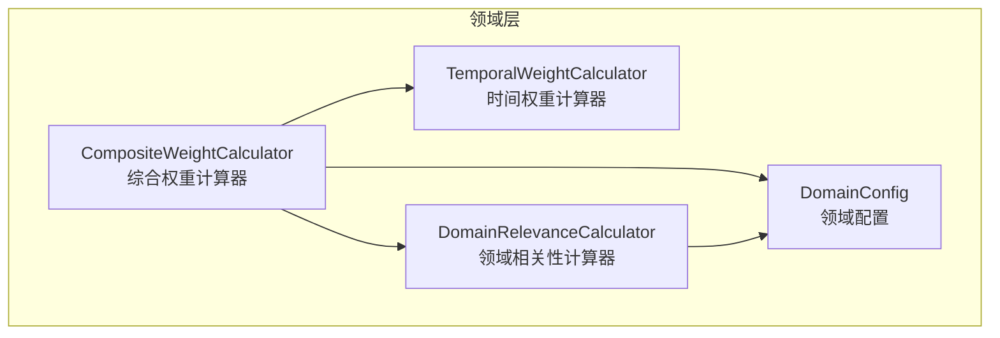
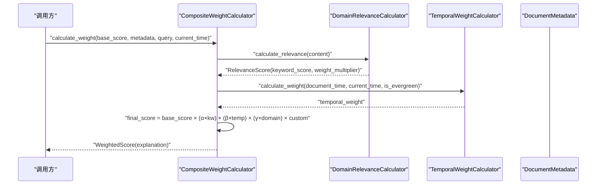
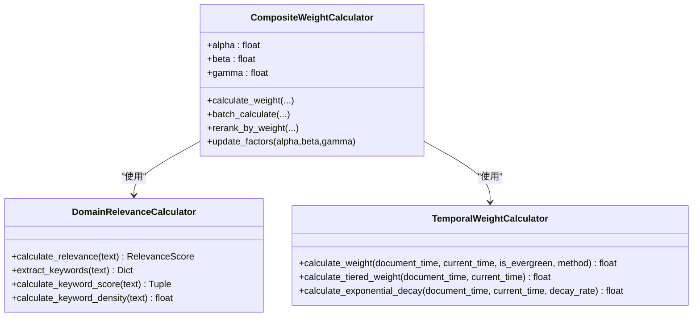
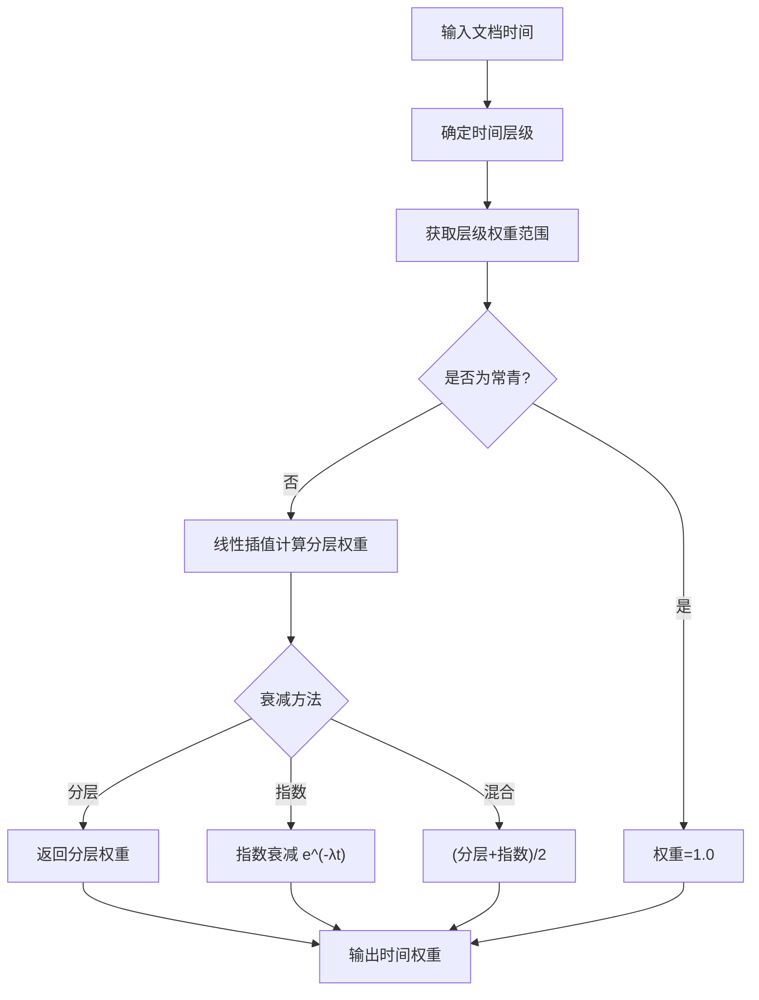
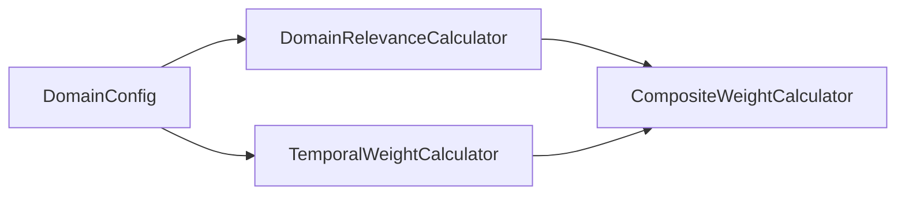

# 权重计算器核心

<cite>
**本文引用的文件**
- [weight_calculator.py](file://src/domain/weight_calculator.py)
- [temporal_weight.py](file://src/domain/temporal_weight.py)
- [relevance.py](file://src/domain/relevance.py)
- [config.py](file://src/domain/config.py)
- [domain_weight_example.py](file://example/domain_weight_example.py)
- [domain_weight_example.py](file://example/domain_weight_example.py)
- [domain_weight_example.py](file://example/domain_weight_example.py)
- [domain_weight_example.py](file://example/domain_weight_example.py)
- [domain_weight_example.py](file://example/domain_weight_example.py)
</cite>

## 目录
1. [简介](#简介)
2. [项目结构](#项目结构)
3. [核心组件](#核心组件)
4. [架构总览](#架构总览)
5. [详细组件分析](#详细组件分析)
6. [依赖关系分析](#依赖关系分析)
7. [性能考量](#性能考量)
8. [故障排查指南](#故障排查指南)
9. [结论](#结论)
10. [附录](#附录)

## 简介
本文件聚焦于权重计算器核心模块，系统化解析 CompositeWeightCalculator 的实现原理与工作机制，覆盖三重权重融合算法（keyword_weight × temporal_weight × domain_weight）、权重因子系数 α、β、γ 的作用与调优方法、批量计算与重新排序、权重解释生成、结果格式化以及性能优化策略，并提供使用示例与最佳实践指导。

## 项目结构
权重计算器位于领域层 domain 下，围绕以下关键模块协作：
- 综合权重计算器：负责三重权重融合与最终分数计算
- 时间权重计算器：提供时间衰减与分层权重
- 领域相关性计算器：基于关键字与密度计算领域权重乘数
- 领域配置：承载权重因子、时间衰减与领域权重映射

图表来源
- [weight_calculator.py:56-223](file://src/domain/weight_calculator.py#L56-L223)
- [temporal_weight.py:47-227](file://src/domain/temporal_weight.py#L47-L227)
- [relevance.py:29-273](file://src/domain/relevance.py#L29-L273)
- [config.py:54-161](file://src/domain/config.py#L54-L161)

章节来源
- [weight_calculator.py:1-318](file://src/domain/weight_calculator.py#L1-L318)
- [temporal_weight.py:1-271](file://src/domain/temporal_weight.py#L1-L271)
- [relevance.py:1-328](file://src/domain/relevance.py#L1-L328)
- [config.py:1-285](file://src/domain/config.py#L1-L285)

## 核心组件
- 综合权重计算器（CompositeWeightCalculator）
  - 负责三重权重融合：keyword_weight × temporal_weight × domain_weight
  - 支持权重因子 α、β、γ 的动态更新
  - 提供批量计算与重新排序能力
- 时间权重计算器（TemporalWeightCalculator）
  - 支持分层权重、指数衰减、混合方法
  - 提供常青内容与时间层级判定
- 领域相关性计算器（DomainRelevanceCalculator）
  - 基于关键字匹配与密度计算领域权重乘数
  - 输出领域等级与权重乘数
- 领域配置（DomainConfig）
  - 定义权重因子系数与领域权重映射
  - 提供关键字词典与相关领域列表

章节来源
- [weight_calculator.py:56-223](file://src/domain/weight_calculator.py#L56-L223)
- [temporal_weight.py:47-227](file://src/domain/temporal_weight.py#L47-L227)
- [relevance.py:29-273](file://src/domain/relevance.py#L29-L273)
- [config.py:54-161](file://src/domain/config.py#L54-L161)

## 架构总览
三重权重融合的总体流程如下：
- 输入：基础相似度分数、文档元数据、可选查询
- 步骤：
  1) 关键字权重：由领域相关性计算器计算关键字得分与密度，映射为领域等级与权重乘数
  2) 时间权重：根据文档时间与当前时间计算，支持分层、指数或混合方法
  3) 领域权重：来自领域相关性计算器的权重乘数
  4) 最终分数：基础分数 × (α×关键字) × (β×时间) × (γ×领域) × 自定义权重
- 输出：加权评分结果对象，包含解释字符串

图表来源
- [weight_calculator.py:81-146](file://src/domain/weight_calculator.py#L81-L146)
- [relevance.py:198-241](file://src/domain/relevance.py#L198-L241)
- [temporal_weight.py:160-195](file://src/domain/temporal_weight.py#L160-L195)

## 详细组件分析

### 综合权重计算器（CompositeWeightCalculator）
- 三重权重融合算法
  - 公式：final_weight = base_score × α × keyword_weight × β × temporal_weight × γ × domain_weight × custom_weight
  - 关键字权重：来自领域相关性计算器，经裁剪至 [0.5, 2.0]
  - 时间权重：来自时间权重计算器，支持分层、指数、混合方法
  - 领域权重：来自领域相关性计算器的权重乘数
- 权重因子系数 α、β、γ
  - 通过领域配置注入，可在运行时通过 update_factors 动态调整
  - α 控制关键字相关性影响力，β 控制时间衰减影响力，γ 控制领域匹配影响力
- 批量计算与重新排序
  - batch_calculate：对候选集逐一计算并返回加权结果
  - rerank_by_weight：先批量计算，再按最终分数降序排序，支持 top_k 截断
- 权重解释生成与结果格式化
  - _generate_explanation：生成包含各因子贡献与领域评分解释的字符串
  - WeightedScore.to_dict：标准化输出，便于下游消费

图表来源
- [weight_calculator.py:56-223](file://src/domain/weight_calculator.py#L56-L223)
- [relevance.py:29-273](file://src/domain/relevance.py#L29-L273)
- [temporal_weight.py:47-227](file://src/domain/temporal_weight.py#L47-L227)

章节来源
- [weight_calculator.py:56-223](file://src/domain/weight_calculator.py#L56-L223)

### 时间权重计算器（TemporalWeightCalculator）
- 时间层级划分
  - 最近期、近期、中期、远期、历史、常青
  - 分层权重在各层级范围内线性插值
- 衰减方法
  - 分层权重：基于层级权重范围与天数区间线性插值
  - 指数衰减：e^(-λ × days_diff)
  - 混合方法：(分层 + 指数) / 2
- 常青内容
  - is_evergreen 为真时返回固定权重 1.0
- 预设配置
  - 快速变化领域、正常变化领域、缓慢变化领域、常青领域

图表来源
- [temporal_weight.py:53-195](file://src/domain/temporal_weight.py#L53-L195)

章节来源
- [temporal_weight.py:47-227](file://src/domain/temporal_weight.py#L47-L227)

### 领域相关性计算器（DomainRelevanceCalculator）
- 关键字匹配与权重
  - 构建关键字索引（含别名），统计匹配次数与权重
  - 关键字得分 = Σ(weight × count) / total_count，裁剪至 [0, 2.0]
- 关键字密度
  - 密度得分 = 关键字出现次数 / 总词数，归一化到 [0, 1]
- 领域等级与权重乘数
  - 综合得分 = keyword_score × 0.7 + density_score × 0.3，映射到核心/相关/边缘/领域外
  - 权重乘数来自领域配置映射
- 置信度
  - 基于匹配关键字数量，满置信度阈值为 5 个

章节来源
- [relevance.py:29-273](file://src/domain/relevance.py#L29-L273)

### 领域配置（DomainConfig）
- 权重因子系数
  - keyword_factor（α）、temporal_factor（β）、domain_factor（γ）
- 时间衰减配置
  - decay_rate（λ）、enable_temporal_decay
- 领域权重映射
  - core_domain_weight、related_domain_weight、peripheral_domain_weight、out_of_domain_weight
- 关键字词典
  - 支持别名与描述，权重范围自动校验

章节来源
- [config.py:54-161](file://src/domain/config.py#L54-L161)

## 依赖关系分析
- 组件耦合
  - CompositeWeightCalculator 依赖 DomainRelevanceCalculator 与 TemporalWeightCalculator
  - DomainRelevanceCalculator 依赖 DomainConfig
  - TemporalWeightCalculator 依赖 DomainConfig 的时间衰减参数
- 外部依赖
  - datetime、math、正则表达式（re）用于时间与文本处理
- 循环依赖
  - 未发现循环依赖，模块职责清晰

图表来源
- [weight_calculator.py:59-74](file://src/domain/weight_calculator.py#L59-L74)
- [relevance.py:32-39](file://src/domain/relevance.py#L32-L39)
- [temporal_weight.py:50-51](file://src/domain/temporal_weight.py#L50-L51)

章节来源
- [weight_calculator.py:56-223](file://src/domain/weight_calculator.py#L56-L223)
- [relevance.py:29-273](file://src/domain/relevance.py#L29-L273)
- [temporal_weight.py:47-227](file://src/domain/temporal_weight.py#L47-L227)

## 性能考量
- 时间复杂度
  - 单次计算：O(k)（k 为关键字数量），主要消耗在正则匹配与统计
  - 批量计算：O(n·k)，n 为候选数量
- 空间复杂度
  - 关键字索引：O(k)
  - 批量结果：O(n)
- 优化策略
  - 关键字索引一次性构建，避免重复编译正则
  - 批量处理时尽量复用计算器实例，减少对象创建开销
  - top_k 截断可显著降低后续排序成本
  - 对于高频场景，可考虑缓存时间权重与相关性评分（需结合业务场景）

章节来源
- [relevance.py:42-55](file://src/domain/relevance.py#L42-L55)
- [weight_calculator.py:162-205](file://src/domain/weight_calculator.py#L162-L205)

## 故障排查指南
- 关键字权重异常
  - 现象：关键字权重不在 [0.5, 2.0] 或为 0
  - 排查：确认 DomainConfig 中关键字权重范围与别名索引是否正确
- 时间权重恒为 1.0
  - 现象：无论文档多久都无衰减
  - 排查：检查 enable_temporal_decay 与 is_evergreen 设置
- 领域权重乘数不符合预期
  - 现象：领域等级映射错误或权重乘数异常
  - 排查：核对领域等级阈值与权重映射配置
- 重新排序结果异常
  - 现象：top_k 截断后顺序错乱
  - 排查：确认 rerank_by_weight 的排序逻辑与 top_k 参数

章节来源
- [weight_calculator.py:108-129](file://src/domain/weight_calculator.py#L108-L129)
- [temporal_weight.py:176-195](file://src/domain/temporal_weight.py#L176-L195)
- [relevance.py:180-196](file://src/domain/relevance.py#L180-L196)

## 结论
CompositeWeightCalculator 将关键字相关性、时间衰减与领域匹配三者有机结合，通过可调的 α、β、γ 权重因子实现灵活的排序策略。配合时间权重计算器与领域相关性计算器，系统在保证可解释性的同时提供了强大的可扩展性与性能潜力。建议在不同领域场景下基于 DecayPresets 与领域配置进行系数调优，并结合批量处理与 top_k 截断以满足实时性需求。

## 附录

### 使用示例与最佳实践
- 基础使用
  - 创建领域配置并初始化 CompositeWeightCalculator
  - 对候选集执行 rerank_by_weight，获得按最终分数排序的结果
- 权重因子调优建议
  - 快速变化领域（新闻、科技）：提高 α 与 β，缩短时间分界，强调时效
  - 正常变化领域（学术、技术文档）：平衡 α 与 β，适度提升 α
  - 缓慢变化领域（历史、法律）：降低 λ，延长近期/中期分界，保留历史价值
  - 常青领域（基础科学）：禁用时间衰减或设为 1.0，提升 γ
- 批量处理与重新排序
  - 使用 batch_calculate 获取完整 WeightedScore 列表
  - 使用 rerank_by_weight 直接得到排序后的结果，支持 top_k
- 结果格式化
  - 使用 WeightedScore.to_dict 输出标准化字典，便于日志与前端展示
- 配置持久化
  - 通过 DomainConfigManager 保存/加载领域配置，支持跨进程/重启复用

章节来源
- [domain_weight_example.py:22-73](file://example/domain_weight_example.py#L22-L73)
- [domain_weight_example.py:76-112](file://example/domain_weight_example.py#L76-L112)
- [domain_weight_example.py:114-143](file://example/domain_weight_example.py#L114-L143)
- [domain_weight_example.py:145-202](file://example/domain_weight_example.py#L145-L202)
- [domain_weight_example.py:204-242](file://example/domain_weight_example.py#L204-L242)
- [weight_calculator.py:43-53](file://src/domain/weight_calculator.py#L43-L53)
- [weight_calculator.py:162-205](file://src/domain/weight_calculator.py#L162-L205)