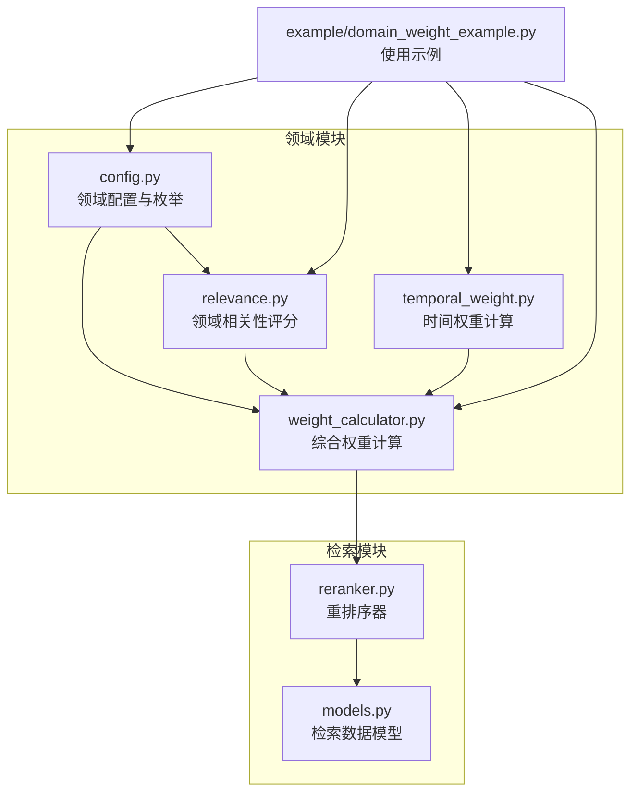
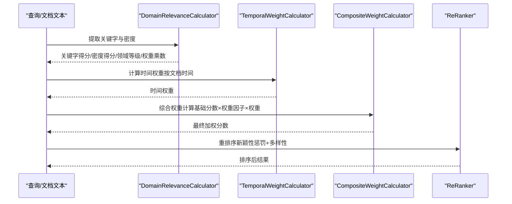
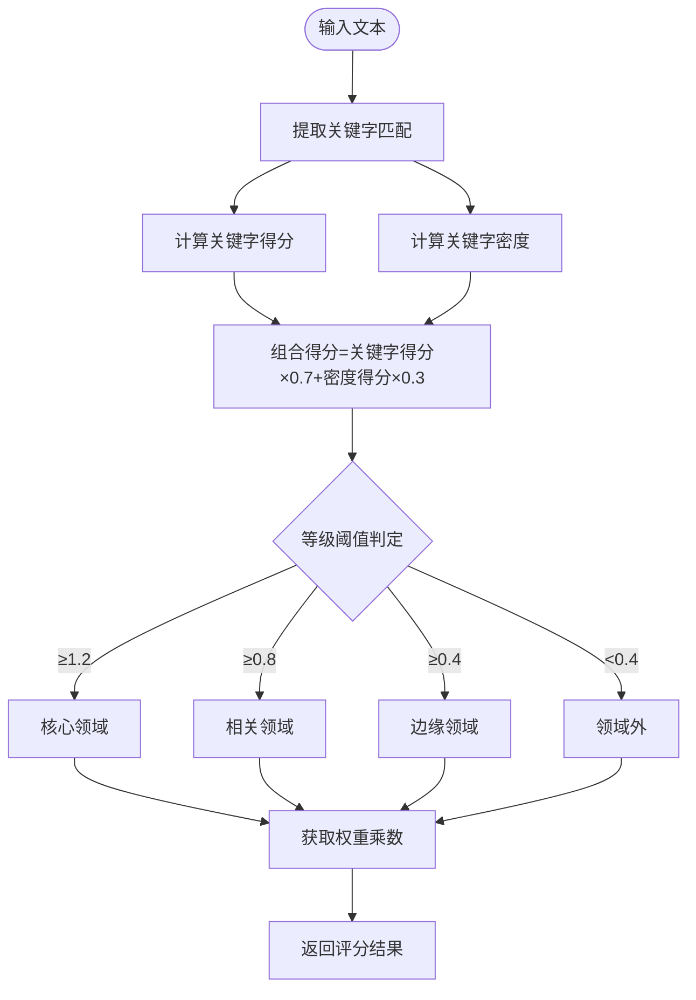
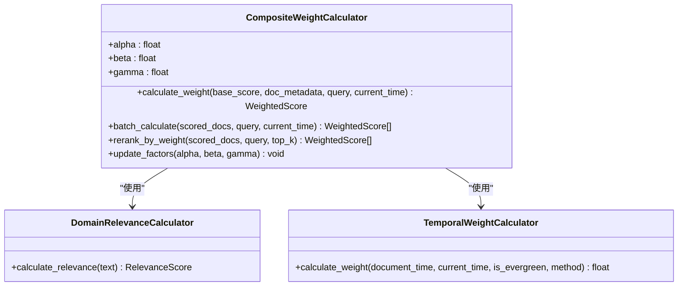
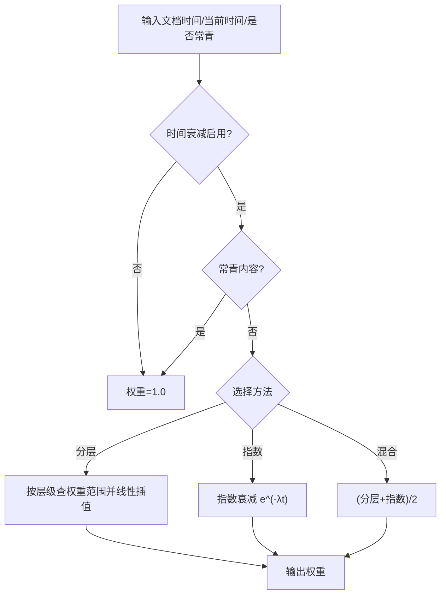
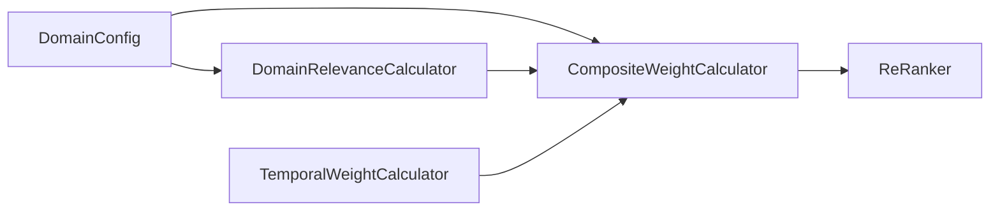

# 相关性计算

<cite>
**本文引用的文件**
- [relevance.py](file://src/domain/relevance.py)
- [weight_calculator.py](file://src/domain/weight_calculator.py)
- [temporal_weight.py](file://src/domain/temporal_weight.py)
- [config.py](file://src/domain/config.py)
- [domain_weight_example.py](file://example/domain_weight_example.py)
- [reranker.py](file://src/retrieval/reranker.py)
- [models.py](file://src/retrieval/models.py)
</cite>

## 目录
1. [简介](#简介)
2. [项目结构](#项目结构)
3. [核心组件](#核心组件)
4. [架构总览](#架构总览)
5. [详细组件分析](#详细组件分析)
6. [依赖关系分析](#依赖关系分析)
7. [性能考量](#性能考量)
8. [故障排查指南](#故障排查指南)
9. [结论](#结论)
10. [附录](#附录)

## 简介
本技术文档聚焦“相关性计算”模块，系统阐述基于关键字与文本特征的领域相关性评分方法，覆盖以下关键主题：
- 领域相关性等级定义：核心领域、相关领域、边缘领域、领域外
- 领域权重因子：core_domain_weight、related_domain_weight、peripheral_domain_weight、out_of_domain_weight 的作用机制
- 多领域检索中的相关性计算与综合权重融合
- 算法实现与计算流程
- 关键字权重、时间权重与领域权重的协同工作机制
- 性能优化与缓存策略
- 动态调整与自适应优化方法

## 项目结构
相关性计算模块位于 src/domain 目录，围绕领域配置、关键字权重、时间权重与综合权重计算展开，并与检索重排序模块协同工作。

图表来源
- [config.py:1-285](file://src/domain/config.py#L1-L285)
- [relevance.py:1-328](file://src/domain/relevance.py#L1-L328)
- [temporal_weight.py:1-271](file://src/domain/temporal_weight.py#L1-L271)
- [weight_calculator.py:1-318](file://src/domain/weight_calculator.py#L1-L318)
- [reranker.py:1-179](file://src/retrieval/reranker.py#L1-L179)
- [models.py:1-29](file://src/retrieval/models.py#L1-L29)
- [domain_weight_example.py:1-267](file://example/domain_weight_example.py#L1-L267)

章节来源
- [config.py:1-285](file://src/domain/config.py#L1-L285)
- [relevance.py:1-328](file://src/domain/relevance.py#L1-L328)
- [temporal_weight.py:1-271](file://src/domain/temporal_weight.py#L1-L271)
- [weight_calculator.py:1-318](file://src/domain/weight_calculator.py#L1-L318)
- [reranker.py:1-179](file://src/retrieval/reranker.py#L1-L179)
- [models.py:1-29](file://src/retrieval/models.py#L1-L29)
- [domain_weight_example.py:1-267](file://example/domain_weight_example.py#L1-L267)

## 核心组件
- 领域配置与权重因子：定义关键字等级、领域等级以及各等级对应的权重乘数，同时提供权重因子系数（alpha、beta、gamma）用于综合权重计算。
- 领域相关性评分器：基于关键字匹配与密度计算，输出领域等级、关键字得分、密度得分、置信度与权重乘数。
- 时间权重计算器：根据时间层级或指数衰减计算时间权重，支持分层、指数与混合方法。
- 综合权重计算器：整合关键字权重、时间权重与领域权重，计算最终检索权重，并支持批量重排序与因子更新。

章节来源
- [config.py:14-285](file://src/domain/config.py#L14-L285)
- [relevance.py:29-328](file://src/domain/relevance.py#L29-L328)
- [temporal_weight.py:47-271](file://src/domain/temporal_weight.py#L47-L271)
- [weight_calculator.py:56-318](file://src/domain/weight_calculator.py#L56-L318)

## 架构总览
相关性计算贯穿“关键字匹配—密度计算—等级判定—权重乘数—综合权重”的完整链路，并与时间权重与领域权重协同，最终服务于检索重排序。

图表来源
- [relevance.py:198-241](file://src/domain/relevance.py#L198-L241)
- [temporal_weight.py:160-195](file://src/domain/temporal_weight.py#L160-L195)
- [weight_calculator.py:81-146](file://src/domain/weight_calculator.py#L81-L146)
- [reranker.py:41-70](file://src/retrieval/reranker.py#L41-L70)

## 详细组件分析

### 领域相关性评分器（DomainRelevanceCalculator）
- 关键字提取与索引：对关键字与别名构建正则模式，支持中英文匹配与单词边界控制，提升匹配准确性。
- 关键字得分：按匹配次数与权重加权求和，再按总出现次数归一化，限制在合理区间。
- 关键字密度：统计关键字出现次数与总词数，归一化到[0,1]区间，用于衡量关键词集中程度。
- 等级判定：综合关键字得分与密度得分，设定阈值划分核心、相关、边缘、领域外四个等级。
- 权重乘数：依据等级映射到配置中的权重因子，作为后续综合权重的一部分。

图表来源
- [relevance.py:66-178](file://src/domain/relevance.py#L66-L178)
- [relevance.py:180-241](file://src/domain/relevance.py#L180-L241)

章节来源
- [relevance.py:29-328](file://src/domain/relevance.py#L29-L328)

### 综合权重计算器（CompositeWeightCalculator）
- 子计算器装配：包含领域相关性评分器与时间权重计算器，分别负责关键字权重与时间权重。
- 权重因子系数：alpha（关键字因子）、beta（时间因子）、gamma（领域因子），用于调节三类权重对最终分数的影响程度。
- 综合公式：最终分数 = 基础分数 × (alpha × 关键字权重) × (beta × 时间权重) × (gamma × 领域权重) × 自定义权重。
- 批量重排序：对候选文档集合进行加权计算并按最终分数降序排列，支持Top-K截断。
- 因子动态调整：提供更新alpha、beta、gamma的方法，便于在线调参与自适应优化。

图表来源
- [weight_calculator.py:56-223](file://src/domain/weight_calculator.py#L56-L223)
- [relevance.py:198-241](file://src/domain/relevance.py#L198-L241)
- [temporal_weight.py:160-195](file://src/domain/temporal_weight.py#L160-L195)

章节来源
- [weight_calculator.py:56-318](file://src/domain/weight_calculator.py#L56-L318)

### 时间权重计算器（TemporalWeightCalculator）
- 时间层级：近期、近中期、中期、远期、历史与常青内容，分别对应不同的权重范围与分界天数。
- 计算方法：支持分层权重、指数衰减与混合方法；当启用常青内容或禁用时间衰减时，权重固定为1.0。
- 预设配置：针对快速变化、正常变化、缓慢变化与常青领域的预设衰减参数，便于直接套用。

图表来源
- [temporal_weight.py:53-195](file://src/domain/temporal_weight.py#L53-L195)

章节来源
- [temporal_weight.py:47-271](file://src/domain/temporal_weight.py#L47-L271)

### 领域配置与权重因子（DomainConfig）
- 关键字等级与权重范围：核心、重要、普通、边缘四档，确保权重在合理区间内。
- 领域等级与权重乘数：核心、相关、边缘、领域外对应不同的权重乘数，用于放大或抑制相关性影响。
- 权重因子系数：keyword_factor（alpha）、temporal_factor（beta）、domain_factor（gamma），用于调节综合权重的贡献比例。
- 示例领域：提供AI/ML示例领域，包含大量关键字与别名，便于快速上手。

章节来源
- [config.py:14-285](file://src/domain/config.py#L14-L285)

### 多领域检索中的应用与优化
- 多领域适配：通过领域配置管理器加载/保存不同领域的配置，支持按领域切换权重因子与权重乘数。
- 查询增强：查询相关性增强器可识别查询中的关键字并计算权重加成，辅助检索阶段的关键词扩展。
- 重排序协同：综合权重计算完成后交由重排序器进行新颖性惩罚与多样性保证，进一步提升检索质量。

章节来源
- [weight_calculator.py:225-277](file://src/domain/weight_calculator.py#L225-L277)
- [relevance.py:276-328](file://src/domain/relevance.py#L276-L328)
- [reranker.py:41-179](file://src/retrieval/reranker.py#L41-L179)

## 依赖关系分析
- 模块内聚：领域相关性评分器与综合权重计算器紧密耦合，前者提供领域等级与权重乘数，后者将其融入综合权重。
- 外部依赖：时间权重计算器独立于领域配置，但被综合权重计算器复用；检索重排序器与相关性计算解耦，仅消费最终分数。
- 配置驱动：权重因子与权重乘数均来自领域配置，便于统一管理与动态调整。

图表来源
- [config.py:54-161](file://src/domain/config.py#L54-L161)
- [relevance.py:29-40](file://src/domain/relevance.py#L29-L40)
- [weight_calculator.py:59-74](file://src/domain/weight_calculator.py#L59-L74)
- [temporal_weight.py:47-51](file://src/domain/temporal_weight.py#L47-L51)
- [reranker.py:10-18](file://src/retrieval/reranker.py#L10-L18)

章节来源
- [config.py:1-285](file://src/domain/config.py#L1-L285)
- [weight_calculator.py:1-318](file://src/domain/weight_calculator.py#L1-L318)
- [relevance.py:1-328](file://src/domain/relevance.py#L1-L328)
- [temporal_weight.py:1-271](file://src/domain/temporal_weight.py#L1-L271)
- [reranker.py:1-179](file://src/retrieval/reranker.py#L1-L179)

## 性能考量
- 正则匹配优化：关键字索引采用预编译正则模式，避免重复编译；英文关键字使用单词边界以减少误匹配。
- 归一化与裁剪：关键字得分与密度得分在计算后进行范围裁剪，降低极端值对最终分数的影响。
- 批量处理：提供批量计算接口，减少循环开销；重排序阶段支持Top-K截断，降低排序复杂度。
- 缓存策略建议：
  - 关键字索引缓存：在领域配置不变的前提下，复用关键字正则与别名映射。
  - 时间权重缓存：对相同文档时间与当前时间组合的结果进行缓存，避免重复计算。
  - 综合权重缓存：对相同基础分数与元数据的组合结果进行缓存，适用于重复查询场景。
- 自适应优化：
  - 动态调整权重因子：根据线上反馈（如点击率、停留时长）调整alpha、beta、gamma。
  - 自适应阈值：根据业务分布动态调整等级阈值，使核心/相关/边缘划分更贴合实际。
  - 查询增强权重：基于查询中关键字数量与权重之和，动态调整查询增强幅度。

[本节为通用性能指导，无需特定文件来源]

## 故障排查指南
- 关键字未匹配：检查关键字大小写与别名映射是否正确；确认正则模式是否包含英文单词边界。
- 得分异常偏高/偏低：核查权重范围与归一化逻辑；检查密度计算的分词方式与阈值。
- 等级划分不合理：调整等级阈值或增加置信度约束；结合关键字数量与密度得分进行二次校验。
- 时间权重恒为1.0：确认是否启用了时间衰减或标记为常青内容；核对当前时间与文档时间差。
- 综合权重异常：检查alpha、beta、gamma是否设置过小或过大；确认自定义权重是否叠加合理。

章节来源
- [relevance.py:95-154](file://src/domain/relevance.py#L95-L154)
- [temporal_weight.py:160-195](file://src/domain/temporal_weight.py#L160-L195)
- [weight_calculator.py:81-146](file://src/domain/weight_calculator.py#L81-L146)

## 结论
相关性计算模块通过“关键字匹配—密度计算—等级判定—权重乘数—综合权重”的闭环设计，实现了对多领域文本的精准相关性评估。配合时间权重与查询增强，能够有效提升检索质量与用户体验。通过权重因子的动态调整与缓存策略的引入，可在保证效果的同时兼顾性能与可维护性。

[本节为总结性内容，无需特定文件来源]

## 附录

### 算法实现与计算流程（路径指引）
- 关键字提取与密度计算：[relevance.py:66-154](file://src/domain/relevance.py#L66-L154)
- 等级判定与权重乘数：[relevance.py:156-196](file://src/domain/relevance.py#L156-L196)
- 综合权重计算公式与批量重排序：[weight_calculator.py:81-205](file://src/domain/weight_calculator.py#L81-L205)
- 时间权重计算方法与预设配置：[temporal_weight.py:160-271](file://src/domain/temporal_weight.py#L160-L271)
- 领域配置与权重因子：[config.py:54-161](file://src/domain/config.py#L54-L161)

### 使用示例（路径指引）
- 领域配置与关键字添加：[domain_weight_example.py:22-73](file://example/domain_weight_example.py#L22-L73)
- 时间权重计算示例：[domain_weight_example.py:76-112](file://example/domain_weight_example.py#L76-L112)
- 领域相关性评分示例：[domain_weight_example.py:114-143](file://example/domain_weight_example.py#L114-L143)
- 综合权重计算与重排序示例：[domain_weight_example.py:145-202](file://example/domain_weight_example.py#L145-L202)
- 配置持久化示例：[domain_weight_example.py:204-243](file://example/domain_weight_example.py#L204-L243)