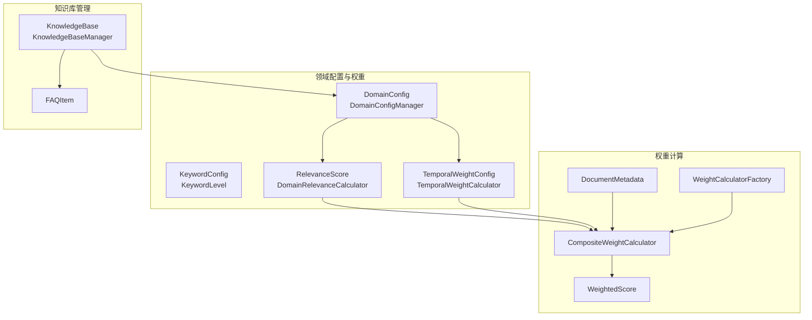
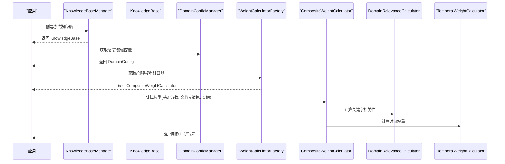
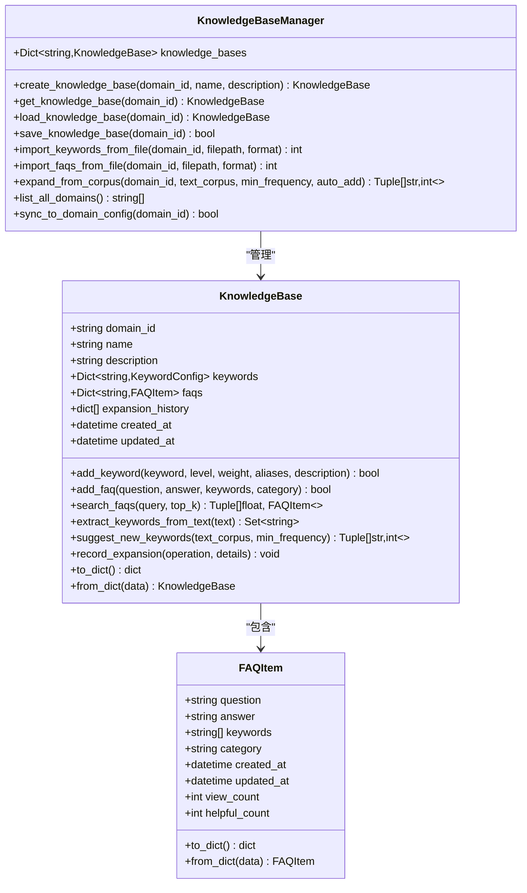
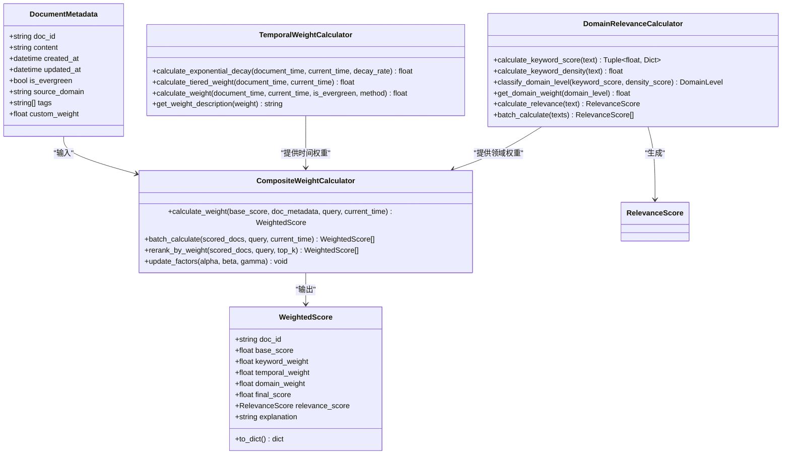
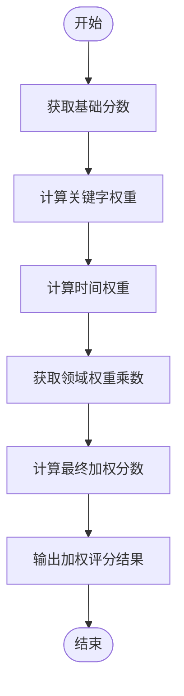
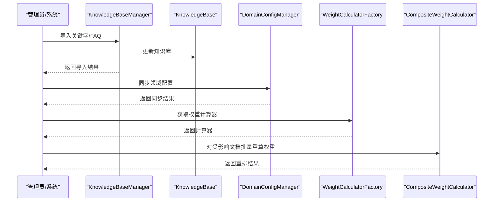
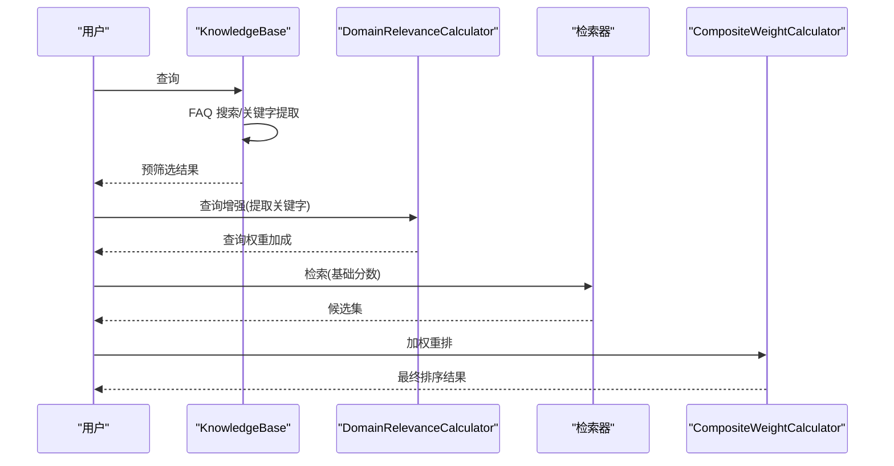
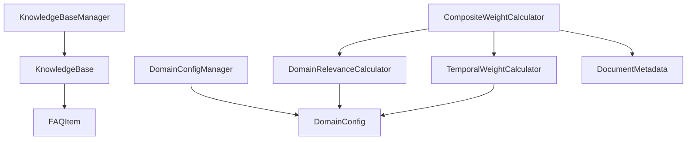

# 知识库集成

<cite>
**本文引用的文件**
- [src/domain/knowledge_base.py](file://src/domain/knowledge_base.py)
- [src/domain/weight_calculator.py](file://src/domain/weight_calculator.py)
- [src/domain/relevance.py](file://src/domain/relevance.py)
- [src/domain/temporal_weight.py](file://src/domain/temporal_weight.py)
- [src/domain/config.py](file://src/domain/config.py)
- [src/domain/__init__.py](file://src/domain/__init__.py)
- [example/knowledge_base_integration.py](file://example/knowledge_base_integration.py)
- [example/domain_weight_example.py](file://example/domain_weight_example.py)
- [tests/test_domain/test_knowledge_base.py](file://tests/test_domain/test_knowledge_base.py)
</cite>

## 目录
1. [简介](#简介)
2. [项目结构](#项目结构)
3. [核心组件](#核心组件)
4. [架构总览](#架构总览)
5. [详细组件分析](#详细组件分析)
6. [依赖分析](#依赖分析)
7. [性能考量](#性能考量)
8. [故障排查指南](#故障排查指南)
9. [结论](#结论)
10. [附录](#附录)

## 简介
本文件面向“领域权重系统与知识库的集成模块”，聚焦于如何将领域权重系统与知识库进行深度集成，覆盖文档元数据的处理、权重计算的触发机制、知识库操作中的权重处理以及领域权重与知识库检索的协同工作机制。文档同时提供集成接口设计、扩展点说明、最佳实践与性能优化建议，帮助读者在真实 RAG 系统中高效落地该能力。

## 项目结构
领域权重系统与知识库集成涉及以下关键模块：
- 领域配置与权重因子：定义领域配置、关键字等级与权重、时间衰减与领域权重乘数。
- 知识库管理：提供知识库的创建、导入、FAQ 管理、关键字提取与建议等功能。
- 领域相关性评分：基于关键字与文本特征计算领域相关性与密度得分。
- 时间权重计算：提供指数衰减、分层权重与混合方法，支持常青内容与快速变化领域的差异化处理。
- 综合权重计算器：整合关键字权重、时间权重与领域权重，输出最终加权分数并支持批量重排。
- 示例与测试：提供完整的应用示例与单元测试，便于理解与验证。

**图表来源**
- [src/domain/config.py:54-161](file://src/domain/config.py#L54-L161)
- [src/domain/knowledge_base.py:64-263](file://src/domain/knowledge_base.py#L64-L263)
- [src/domain/relevance.py:16-241](file://src/domain/relevance.py#L16-L241)
- [src/domain/temporal_weight.py:24-195](file://src/domain/temporal_weight.py#L24-L195)
- [src/domain/weight_calculator.py:16-146](file://src/domain/weight_calculator.py#L16-L146)

**章节来源**
- [src/domain/__init__.py:7-81](file://src/domain/__init__.py#L7-L81)

## 核心组件
- 领域配置与权重因子
  - DomainConfig：承载领域关键字、权重因子、时间衰减与领域权重乘数等配置。
  - KeywordConfig：关键字配置，含等级、权重、别名与描述。
  - DomainConfigManager：负责领域配置的创建、持久化、加载与活动域切换。
- 知识库管理
  - KnowledgeBase：知识库主体，支持关键字与 FAQ 的增删改查、关键字提取与建议、FAQ 搜索、序列化与历史记录。
  - KnowledgeBaseManager：知识库的生命周期管理，支持创建、加载、保存、批量导入与领域同步。
  - FAQItem：FAQ 数据结构，支持字典序列化与反序列化。
- 领域相关性评分
  - RelevanceScore：相关性评分结果，包含领域等级、关键字得分、密度得分、权重乘数与置信度。
  - DomainRelevanceCalculator：计算关键字得分、密度、领域等级与权重乘数，并生成解释。
- 时间权重计算
  - TemporalWeightConfig：时间权重配置，含分层权重范围、时间边界与衰减系数。
  - TemporalWeightCalculator：提供指数衰减、分层权重与混合方法，支持常青内容与权重描述。
- 综合权重计算器
  - DocumentMetadata：文档元数据，包含 doc_id、content、created_at、updated_at、is_evergreen、source_domain、tags、custom_weight。
  - WeightedScore：加权评分结果，包含基础分数、关键字权重、时间权重、领域权重与最终分数。
  - CompositeWeightCalculator：整合关键字权重、时间权重与领域权重，支持批量重排与因子更新。
  - WeightCalculatorFactory：工厂模式获取/创建领域权重计算器，支持活动域与缓存。

**章节来源**
- [src/domain/config.py:54-161](file://src/domain/config.py#L54-L161)
- [src/domain/knowledge_base.py:64-263](file://src/domain/knowledge_base.py#L64-L263)
- [src/domain/relevance.py:16-241](file://src/domain/relevance.py#L16-L241)
- [src/domain/temporal_weight.py:24-195](file://src/domain/temporal_weight.py#L24-L195)
- [src/domain/weight_calculator.py:16-146](file://src/domain/weight_calculator.py#L16-L146)

## 架构总览
领域权重系统与知识库的集成遵循“配置驱动 + 知识库增强 + 权重计算”的三层架构：
- 配置驱动层：通过 DomainConfig 与 DomainConfigManager 管理领域配置与权重因子，为权重计算提供依据。
- 知识库增强层：通过 KnowledgeBase 与 KnowledgeBaseManager 提供关键字与 FAQ 管理、关键字提取与建议、FAQ 搜索，支撑查询增强与知识扩充。
- 权重计算层：通过 CompositeWeightCalculator 整合关键字相关性、时间权重与领域权重，输出最终加权分数，用于检索重排序。

**图表来源**
- [src/domain/knowledge_base.py:266-517](file://src/domain/knowledge_base.py#L266-L517)
- [src/domain/config.py:163-241](file://src/domain/config.py#L163-L241)
- [src/domain/weight_calculator.py:225-276](file://src/domain/weight_calculator.py#L225-L276)
- [src/domain/relevance.py:198-241](file://src/domain/relevance.py#L198-L241)
- [src/domain/temporal_weight.py:160-195](file://src/domain/temporal_weight.py#L160-L195)

## 详细组件分析

### 知识库管理与集成
- 知识库数据结构
  - KnowledgeBase：包含 domain_id、name、description、keywords、faqs、expansion_history、created_at、updated_at 等字段，支持关键字与 FAQ 的增删改查、序列化与历史记录。
  - KnowledgeBaseManager：提供知识库的创建、加载、保存、批量导入（关键字与 FAQ）、语料扩充与领域同步。
- 关键字与 FAQ 管理
  - add_keyword/add_faq：支持别名索引、重复检查与历史记录。
  - search_faqs：基于问题、答案与关键字的多维匹配与排序。
  - extract_keywords_from_text/suggest_new_keywords：从文本中提取关键字并建议新关键字，支持最小频率过滤。
- 知识库与权重系统的集成点
  - 知识库作为领域配置的“知识源”，为 DomainRelevanceCalculator 提供关键字与别名索引。
  - 知识库的 FAQ 与关键字可用于查询增强与检索前的预筛选，减少权重计算开销。
  - 知识库的扩展历史可用于追踪权重因子调整对检索效果的影响。

**图表来源**
- [src/domain/knowledge_base.py:64-263](file://src/domain/knowledge_base.py#L64-L263)

**章节来源**
- [src/domain/knowledge_base.py:64-263](file://src/domain/knowledge_base.py#L64-L263)
- [tests/test_domain/test_knowledge_base.py:77-195](file://tests/test_domain/test_knowledge_base.py#L77-L195)

### 领域相关性评分与时间权重
- 领域相关性评分
  - DomainRelevanceCalculator：构建关键字索引（支持中英文），计算关键字得分、密度得分、领域等级与权重乘数，并生成解释。
  - RelevanceScore：包含领域等级、综合评分、权重乘数、关键字匹配详情、置信度与解释。
- 时间权重计算
  - TemporalWeightCalculator：提供指数衰减、分层权重与混合方法，支持常青内容与权重描述。
  - TemporalWeightConfig：配置分层权重范围、时间边界与衰减系数。
- 综合权重计算
  - CompositeWeightCalculator：整合关键字权重、时间权重与领域权重，支持批量重排与因子更新。
  - DocumentMetadata：文档元数据，包含 doc_id、content、created_at、updated_at、is_evergreen、source_domain、tags、custom_weight。
  - WeightedScore：加权评分结果，包含基础分数、关键字权重、时间权重、领域权重与最终分数。

**图表来源**
- [src/domain/relevance.py:16-241](file://src/domain/relevance.py#L16-L241)
- [src/domain/temporal_weight.py:24-195](file://src/domain/temporal_weight.py#L24-L195)
- [src/domain/weight_calculator.py:16-146](file://src/domain/weight_calculator.py#L16-L146)

**章节来源**
- [src/domain/relevance.py:16-241](file://src/domain/relevance.py#L16-L241)
- [src/domain/temporal_weight.py:24-195](file://src/domain/temporal_weight.py#L24-L195)
- [src/domain/weight_calculator.py:16-146](file://src/domain/weight_calculator.py#L16-L146)

### 文档元数据与权重计算触发机制
- DocumentMetadata 设计与字段含义
  - doc_id：文档唯一标识，用于结果去重与追踪。
  - content：文档内容，用于领域相关性评分与关键字提取。
  - created_at/updated_at：文档时间戳，用于时间权重计算。
  - is_evergreen：是否为常青内容，不受时间衰减影响。
  - source_domain：来源领域，用于领域权重乘数获取。
  - tags：标签集合，辅助检索与过滤。
  - custom_weight：自定义权重加成，支持人工干预。
- 权重计算触发机制
  - 基础分数阶段：由向量相似度或其他检索打分器提供基础分数。
  - 关键字权重阶段：DomainRelevanceCalculator 基于知识库关键字与别名索引计算关键字得分与密度得分，得到领域等级与权重乘数。
  - 时间权重阶段：TemporalWeightCalculator 基于文档时间与配置计算时间权重，常青内容权重为 1.0。
  - 综合阶段：CompositeWeightCalculator 将基础分数与三路权重相乘，并应用自定义权重加成，输出最终加权分数。
  - 触发时机：在检索候选集生成后、重排序前触发权重计算；也可在知识库更新后对受影响文档进行批量重算。

**图表来源**
- [src/domain/weight_calculator.py:81-146](file://src/domain/weight_calculator.py#L81-L146)

**章节来源**
- [src/domain/weight_calculator.py:16-146](file://src/domain/weight_calculator.py#L16-L146)

### 知识库操作中的权重处理
- 文档导入
  - 关键字导入：支持 JSON/CSV/TXT 格式，导入后记录扩展历史，便于审计与回溯。
  - FAQ 导入：支持 JSON/CSV 格式，导入后同样记录扩展历史。
- 文档更新
  - 更新时间戳：更新 updated_at，影响时间权重计算。
  - 关键字变更：更新知识库后，需重新计算受影响文档的权重。
- 文档删除
  - 删除后不再参与权重计算，但可保留历史记录用于审计。
- 知识库扩充
  - 从语料中建议新关键字，支持自动添加与手动确认，记录扩展历史。

**图表来源**
- [src/domain/knowledge_base.py:323-438](file://src/domain/knowledge_base.py#L323-L438)
- [src/domain/knowledge_base.py:500-517](file://src/domain/knowledge_base.py#L500-L517)
- [src/domain/weight_calculator.py:162-205](file://src/domain/weight_calculator.py#L162-L205)

**章节来源**
- [src/domain/knowledge_base.py:323-438](file://src/domain/knowledge_base.py#L323-L438)
- [src/domain/knowledge_base.py:500-517](file://src/domain/knowledge_base.py#L500-L517)
- [src/domain/weight_calculator.py:162-205](file://src/domain/weight_calculator.py#L162-L205)

### 领域权重与知识库检索的协同机制
- 查询增强
  - 使用 DomainRelevanceCalculator 从查询中提取关键字，计算查询权重加成，提升相关文档的检索优先级。
- 检索前筛选
  - 使用 KnowledgeBase 的 FAQ 搜索与关键字提取，对候选集进行预筛选，减少后续权重计算成本。
- 重排序
  - 使用 CompositeWeightCalculator 对候选集进行加权重排，支持 top-k 截断与批量处理。
- 结果解释
  - WeightedScore 提供详细的评分说明，包含基础分数、三路权重与解释，便于调试与优化。

**图表来源**
- [src/domain/knowledge_base.py:118-144](file://src/domain/knowledge_base.py#L118-L144)
- [src/domain/relevance.py:276-328](file://src/domain/relevance.py#L276-L328)
- [src/domain/weight_calculator.py:182-205](file://src/domain/weight_calculator.py#L182-L205)

**章节来源**
- [src/domain/knowledge_base.py:118-144](file://src/domain/knowledge_base.py#L118-L144)
- [src/domain/relevance.py:276-328](file://src/domain/relevance.py#L276-L328)
- [src/domain/weight_calculator.py:182-205](file://src/domain/weight_calculator.py#L182-L205)

### 集成接口设计与扩展点
- 领域配置接口
  - DomainConfigManager：创建、加载、保存领域配置，支持活动域切换。
  - DomainConfig：关键字管理、权重因子配置、时间衰减与领域权重乘数。
- 知识库管理接口
  - KnowledgeBaseManager：创建、加载、保存、批量导入、语料扩充与领域同步。
  - KnowledgeBase：关键字与 FAQ 管理、序列化与历史记录。
- 权重计算接口
  - WeightCalculatorFactory：获取/创建领域权重计算器，支持缓存与活动域。
  - CompositeWeightCalculator：计算权重、批量重排与因子更新。
- 扩展点
  - 自定义权重因子：通过 DomainConfig 的 keyword_factor、temporal_factor、domain_factor 调整三路权重的贡献度。
  - 自定义时间衰减：通过 TemporalWeightConfig 的 decay_rate 与分层权重范围适配不同领域。
  - 自定义领域权重乘数：通过 DomainConfig 的 core/related/peripheral/out_of_domain_weight 适配不同领域等级。
  - 自定义权重加成：通过 DocumentMetadata 的 custom_weight 对特定文档进行人工干预。

**章节来源**
- [src/domain/config.py:54-161](file://src/domain/config.py#L54-L161)
- [src/domain/knowledge_base.py:266-517](file://src/domain/knowledge_base.py#L266-L517)
- [src/domain/weight_calculator.py:225-276](file://src/domain/weight_calculator.py#L225-L276)

## 依赖分析
- 组件耦合与内聚
  - DomainConfig 与 DomainConfigManager：高内聚，负责领域配置的全生命周期管理。
  - KnowledgeBase 与 KnowledgeBaseManager：高内聚，负责知识库的全生命周期管理。
  - DomainRelevanceCalculator 与 TemporalWeightCalculator：分别独立，通过 CompositeWeightCalculator 聚合。
  - CompositeWeightCalculator：聚合多个子计算器，承担主要的权重计算职责。
- 外部依赖与集成点
  - 文件系统：知识库与领域配置的持久化依赖文件系统。
  - 时间模块：权重计算依赖 datetime 模块。
  - 正则表达式：关键字匹配依赖 re 模块。
- 循环依赖
  - 未发现循环依赖，模块间关系清晰。

**图表来源**
- [src/domain/config.py:163-241](file://src/domain/config.py#L163-L241)
- [src/domain/knowledge_base.py:266-517](file://src/domain/knowledge_base.py#L266-L517)
- [src/domain/relevance.py:198-241](file://src/domain/relevance.py#L198-L241)
- [src/domain/temporal_weight.py:160-195](file://src/domain/temporal_weight.py#L160-L195)
- [src/domain/weight_calculator.py:56-80](file://src/domain/weight_calculator.py#L56-L80)

**章节来源**
- [src/domain/config.py:163-241](file://src/domain/config.py#L163-L241)
- [src/domain/knowledge_base.py:266-517](file://src/domain/knowledge_base.py#L266-L517)
- [src/domain/weight_calculator.py:56-80](file://src/domain/weight_calculator.py#L56-L80)

## 性能考量
- 关键字索引优化
  - 使用正则表达式构建关键字索引，避免逐字匹配带来的 O(N*M) 复杂度。
  - 对英文关键字添加单词边界，减少误匹配。
- 批量处理
  - CompositeWeightCalculator 提供批量计算与重排接口，减少多次调用开销。
- 时间权重缓存
  - 对相同文档与时间的权重计算结果可进行缓存，避免重复计算。
- 常青内容优化
  - is_evergreen 字段可直接跳过时间权重计算，减少不必要的开销。
- 内存与磁盘
  - 知识库与领域配置的序列化与反序列化应避免频繁 IO，建议在内存中维护热点数据。

[本节为通用性能建议，无需特定文件引用]

## 故障排查指南
- 关键字不生效
  - 检查关键字是否存在于 DomainConfig 的 keywords 中，确认大小写与别名映射。
  - 确认关键字权重设置是否合理，避免权重过低导致贡献度不足。
- 时间衰减异常
  - 检查 TemporalWeightConfig 的 decay_rate 与分层权重范围是否符合预期。
  - 确认文档时间戳与当前时间是否正确，避免未来时间导致的异常权重。
- 领域权重不准确
  - 检查 DomainConfig 的领域权重乘数配置，确认领域等级划分逻辑。
  - 使用 RelevanceScore 的 explanation 字段定位关键字匹配与密度得分问题。
- 权重计算结果异常
  - 使用 WeightedScore 的详细解释与分解结果，逐步排查关键字权重、时间权重与领域权重的贡献度。
- 知识库导入失败
  - 检查文件格式与字段完整性，确认导入路径与权限。
  - 查看扩展历史记录，定位具体失败环节。

**章节来源**
- [src/domain/relevance.py:243-261](file://src/domain/relevance.py#L243-L261)
- [src/domain/temporal_weight.py:197-209](file://src/domain/temporal_weight.py#L197-L209)
- [src/domain/weight_calculator.py:148-160](file://src/domain/weight_calculator.py#L148-L160)
- [tests/test_domain/test_knowledge_base.py:244-287](file://tests/test_domain/test_knowledge_base.py#L244-L287)

## 结论
领域权重系统与知识库的集成通过“配置驱动 + 知识库增强 + 权重计算”的架构，实现了对检索质量的多维度提升。知识库不仅作为领域配置的“知识源”，还通过 FAQ 搜索与关键字提取为检索前筛选提供支持。权重计算层通过关键字相关性、时间权重与领域权重的融合，输出最终加权分数，指导检索重排序。配合完善的集成接口、扩展点与最佳实践，可在真实 RAG 系统中高效落地并持续优化。

[本节为总结性内容，无需特定文件引用]

## 附录
- 示例与测试
  - 知识库集成示例：展示初始化知识库、查询增强、文档权重计算、批量导入与持续学习等典型场景。
  - 领域权重示例：展示领域配置、时间权重计算、相关性评分与综合权重计算等核心能力。
  - 单元测试：覆盖知识库管理、导入导出、关键字与 FAQ 管理、序列化与反序列化等关键功能。

**章节来源**
- [example/knowledge_base_integration.py:21-363](file://example/knowledge_base_integration.py#L21-L363)
- [example/domain_weight_example.py:22-267](file://example/domain_weight_example.py#L22-L267)
- [tests/test_domain/test_knowledge_base.py:197-316](file://tests/test_domain/test_knowledge_base.py#L197-L316)