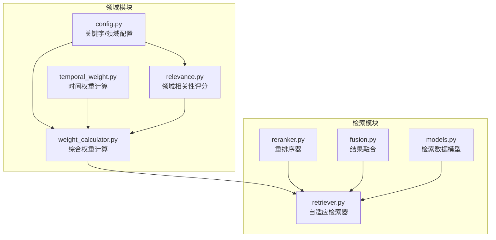
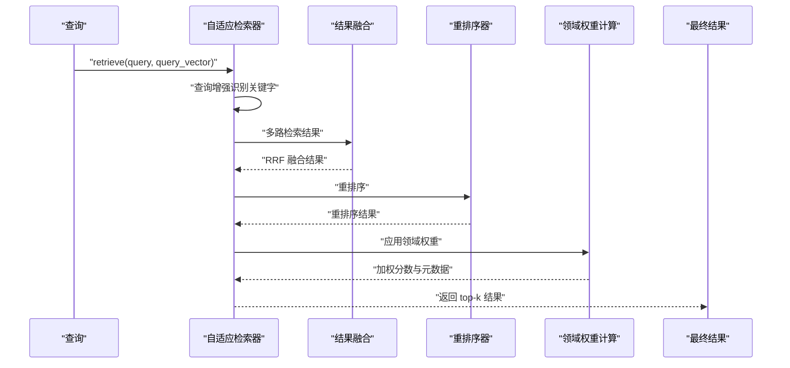
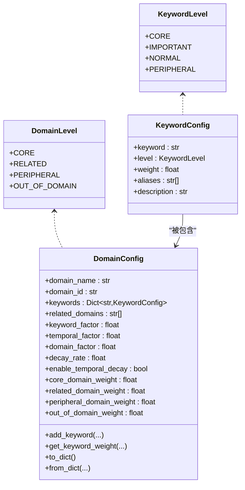
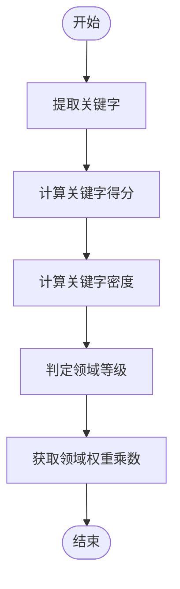
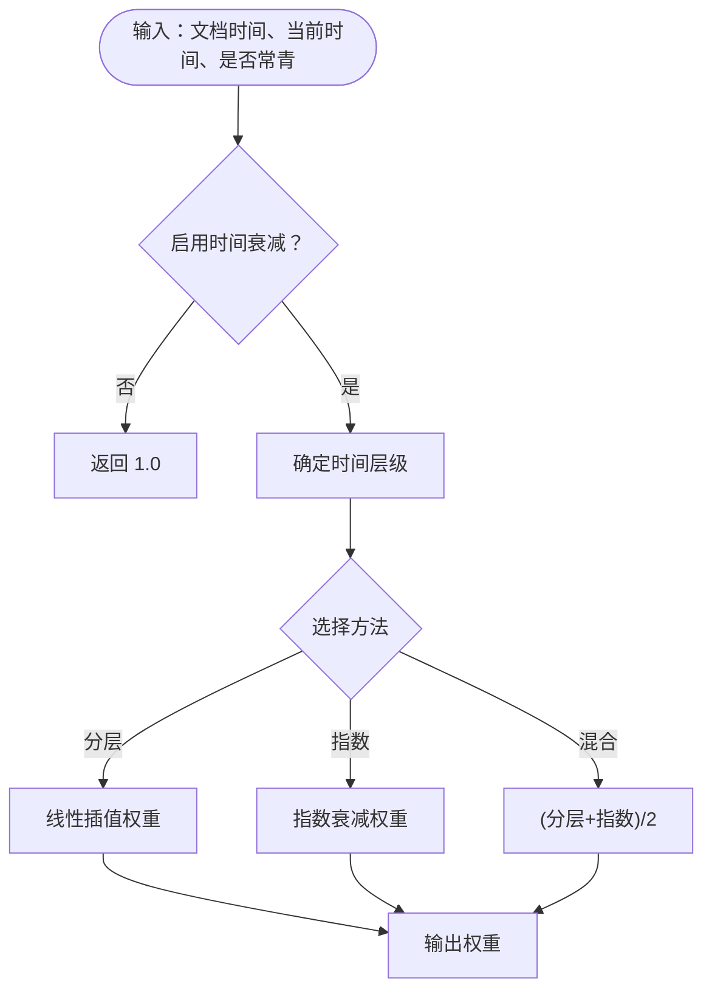
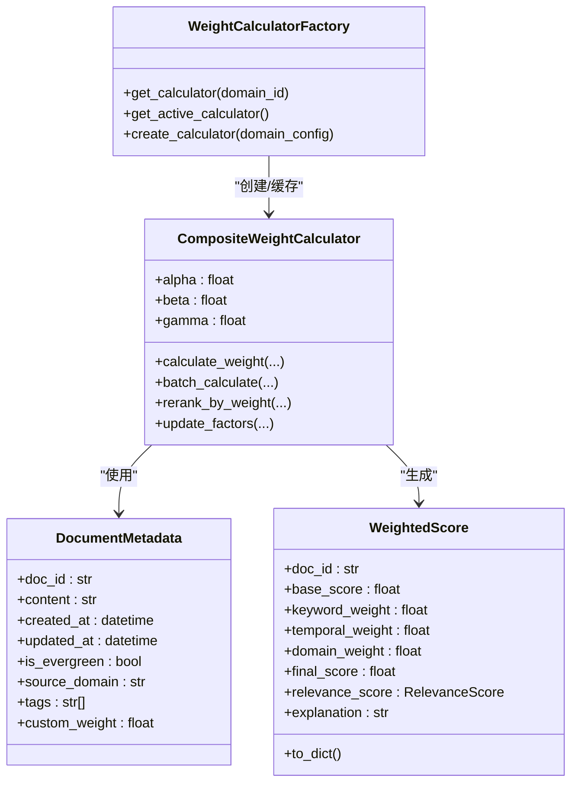
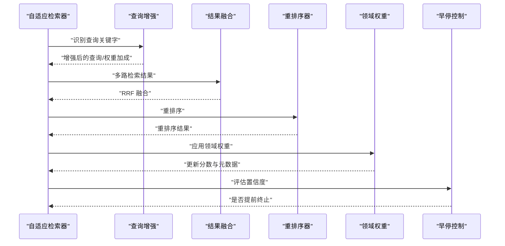
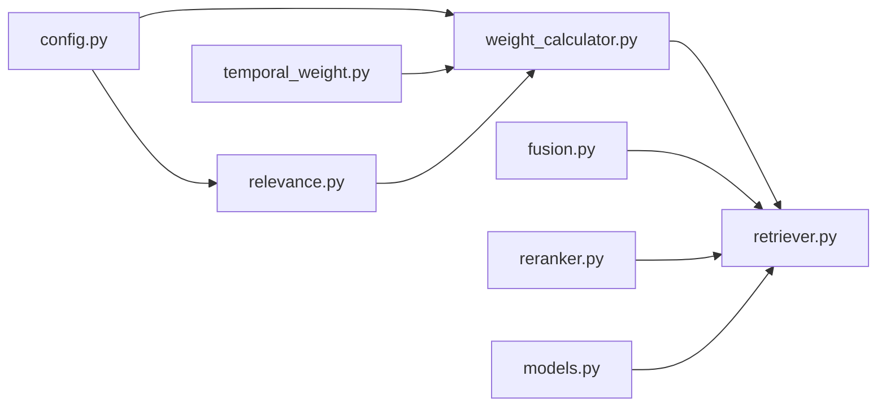

# 领域权重系统

<cite>
**本文引用的文件**
- [src/domain/config.py](file://src/domain/config.py)
- [src/domain/relevance.py](file://src/domain/relevance.py)
- [src/domain/temporal_weight.py](file://src/domain/temporal_weight.py)
- [src/domain/weight_calculator.py](file://src/domain/weight_calculator.py)
- [src/domain/__init__.py](file://src/domain/__init__.py)
- [src/retrieval/retriever.py](file://src/retrieval/retriever.py)
- [src/retrieval/reranker.py](file://src/retrieval/reranker.py)
- [src/retrieval/fusion.py](file://src/retrieval/fusion.py)
- [src/retrieval/models.py](file://src/retrieval/models.py)
- [example/domain_weight_example.py](file://example/domain_weight_example.py)
</cite>

## 目录
1. [简介](#简介)
2. [项目结构](#项目结构)
3. [核心组件](#核心组件)
4. [架构总览](#架构总览)
5. [详细组件分析](#详细组件分析)
6. [依赖关系分析](#依赖关系分析)
7. [性能考量](#性能考量)
8. [故障排查指南](#故障排查指南)
9. [结论](#结论)
10. [附录](#附录)

## 简介
本技术文档聚焦于 NecoRAG 的“领域权重系统”，系统性阐述以下能力与实现：
- 关键字权重配置与级别体系
- 时间权重计算（分层、指数衰减、混合）
- 领域相关性计算（关键字得分、密度得分、等级判定）
- 复合权重计算算法与因子调节策略
- 领域配置最佳实践与性能优化建议
- 权重系统的扩展机制与自定义权重计算方法
- 权重系统在检索流程中的作用与影响

该系统通过“关键字权重 + 时间权重 + 领域权重”三因子的乘法组合，对检索候选进行精细化重排序，提升检索质量与相关性。

## 项目结构
领域权重系统位于 src/domain 目录，配合检索层 src/retrieval 完成端到端的权重应用与重排序。

图表来源
- [src/domain/config.py:1-285](file://src/domain/config.py#L1-L285)
- [src/domain/relevance.py:1-328](file://src/domain/relevance.py#L1-L328)
- [src/domain/temporal_weight.py:1-271](file://src/domain/temporal_weight.py#L1-L271)
- [src/domain/weight_calculator.py:1-318](file://src/domain/weight_calculator.py#L1-L318)
- [src/retrieval/retriever.py:1-440](file://src/retrieval/retriever.py#L1-L440)
- [src/retrieval/reranker.py:1-179](file://src/retrieval/reranker.py#L1-L179)
- [src/retrieval/fusion.py:1-128](file://src/retrieval/fusion.py#L1-L128)
- [src/retrieval/models.py:1-29](file://src/retrieval/models.py#L1-L29)

章节来源
- [src/domain/__init__.py:1-69](file://src/domain/__init__.py#L1-L69)

## 核心组件
- 关键字与领域配置：定义关键字等级、领域等级、权重因子与时间衰减参数，并提供配置持久化与示例构造。
- 领域相关性评分：基于关键字匹配与密度计算，输出领域等级与权重乘数。
- 时间权重计算：提供分层、指数衰减与混合三种方法，支持常青内容与预设领域。
- 综合权重计算：将基础相似度与三类权重相乘，支持批量重排序与因子动态调整。
- 检索器集成：在检索流程中应用领域权重，贯穿融合、重排序与早停控制。

章节来源
- [src/domain/config.py:1-285](file://src/domain/config.py#L1-L285)
- [src/domain/relevance.py:1-328](file://src/domain/relevance.py#L1-L328)
- [src/domain/temporal_weight.py:1-271](file://src/domain/temporal_weight.py#L1-L271)
- [src/domain/weight_calculator.py:1-318](file://src/domain/weight_calculator.py#L1-L318)
- [src/retrieval/retriever.py:122-332](file://src/retrieval/retriever.py#L122-L332)

## 架构总览
领域权重系统在检索流程中的位置如下：

图表来源
- [src/retrieval/retriever.py:177-253](file://src/retrieval/retriever.py#L177-L253)
- [src/retrieval/fusion.py:18-70](file://src/retrieval/fusion.py#L18-L70)
- [src/retrieval/reranker.py:41-70](file://src/retrieval/reranker.py#L41-L70)
- [src/domain/weight_calculator.py:81-146](file://src/domain/weight_calculator.py#L81-L146)

## 详细组件分析

### 关键字权重配置与领域等级
- 关键字等级（KeywordLevel）：核心（1.5-2.0）、重要（1.2-1.5）、普通（0.9-1.1）、边缘（0.5-0.8）。系统在初始化时会自动将配置权重约束到对应范围。
- 领域等级（DomainLevel）：核心（1.5）、相关（1.0-1.2）、边缘（0.6-0.8）、领域外（0.2-0.4）。每个等级映射到一个权重乘数，用于最终加权。
- 领域配置（DomainConfig）：包含关键字词典、相关领域列表、权重因子（α、β、γ）、时间衰减参数（λ、开关）以及各类权重乘数。提供关键字增删、权重查询、序列化/反序列化与示例构造。

图表来源
- [src/domain/config.py:14-161](file://src/domain/config.py#L14-L161)

章节来源
- [src/domain/config.py:14-161](file://src/domain/config.py#L14-L161)

### 领域相关性计算
- 关键字提取与索引：构建正则表达式模式，支持中英文关键字与别名，快速匹配文本中的关键字。
- 关键字得分：对匹配到的关键字，按出现次数加权求和，再除以总出现次数，得到平均权重作为关键字得分；限制在合理区间。
- 关键字密度：统计关键字出现次数占总词数的比例，归一化到 [0,1]。
- 等级判定：综合关键字得分与密度，按加权组合阈值划分领域等级。
- 权重乘数：根据领域等级返回对应的权重乘数，用于最终加权。

图表来源
- [src/domain/relevance.py:66-241](file://src/domain/relevance.py#L66-L241)

章节来源
- [src/domain/relevance.py:16-241](file://src/domain/relevance.py#L16-L241)

### 时间权重计算
- 时间层级：将文档按天数差划分为“最近/近期/中期/远期/历史/常青”等层级，每层给出权重范围。
- 分层权重：在层级内线性插值，得到具体权重。
- 指数衰减：基于衰减系数 λ，按 e^(-λt) 计算权重。
- 混合方法：取分层与指数的均值，兼顾平滑与快速衰减。
- 预设配置：针对快速变化、正常变化、缓慢变化与常青领域提供预设参数。

图表来源
- [src/domain/temporal_weight.py:53-195](file://src/domain/temporal_weight.py#L53-L195)

章节来源
- [src/domain/temporal_weight.py:14-271](file://src/domain/temporal_weight.py#L14-L271)

### 复合权重计算与重排序
- 综合公式：final_score = base_score × (α × keyword_weight) × (β × temporal_weight) × (γ × domain_weight) × custom_weight
- 关键字权重：来自领域相关性评分，限制在 [0.5, 2.0]。
- 时间权重：来自时间权重计算器，支持分层/指数/混合。
- 领域权重：来自领域等级对应的权重乘数。
- 批量重排序：支持对候选集进行批量加权与排序，可裁剪 top-k。
- 工厂与便捷函数：提供计算器工厂与快速重排序接口。

图表来源
- [src/domain/weight_calculator.py:16-223](file://src/domain/weight_calculator.py#L16-L223)

章节来源
- [src/domain/weight_calculator.py:56-223](file://src/domain/weight_calculator.py#L56-L223)

### 在检索流程中的应用
- 查询增强：识别查询中的关键字，提供权重加成与同义词扩展。
- 多路检索与融合：向量检索、图谱检索等结果经 RRF 融合。
- 重排序：应用重排序器进行新颖性惩罚与多样性保证。
- 领域权重：对融合后的候选应用领域权重，更新分数与元数据。
- 早停控制：基于置信度阈值与边际收益决定是否提前终止。

图表来源
- [src/retrieval/retriever.py:177-253](file://src/retrieval/retriever.py#L177-L253)
- [src/retrieval/reranker.py:41-70](file://src/retrieval/reranker.py#L41-L70)
- [src/retrieval/fusion.py:18-70](file://src/retrieval/fusion.py#L18-L70)

章节来源
- [src/retrieval/retriever.py:122-332](file://src/retrieval/retriever.py#L122-L332)
- [src/retrieval/reranker.py:10-179](file://src/retrieval/reranker.py#L10-L179)
- [src/retrieval/fusion.py:9-128](file://src/retrieval/fusion.py#L9-L128)

## 依赖关系分析
- 领域模块内部依赖清晰：config 提供配置，relevance 与 temporal_weight 分别提供相关性与时间权重，weight_calculator 整合三者并提供工厂与便捷函数。
- 检索模块通过自适应检索器集成领域权重：先融合、后重排序、再应用领域权重，最后早停。
- 模块间耦合度低，通过数据模型（DocumentMetadata、RetrievalResult）传递信息，便于扩展与替换。

图表来源
- [src/domain/config.py:1-285](file://src/domain/config.py#L1-L285)
- [src/domain/relevance.py:1-328](file://src/domain/relevance.py#L1-L328)
- [src/domain/temporal_weight.py:1-271](file://src/domain/temporal_weight.py#L1-L271)
- [src/domain/weight_calculator.py:1-318](file://src/domain/weight_calculator.py#L1-L318)
- [src/retrieval/retriever.py:1-440](file://src/retrieval/retriever.py#L1-L440)
- [src/retrieval/fusion.py:1-128](file://src/retrieval/fusion.py#L1-L128)
- [src/retrieval/reranker.py:1-179](file://src/retrieval/reranker.py#L1-L179)
- [src/retrieval/models.py:1-29](file://src/retrieval/models.py#L1-L29)

章节来源
- [src/domain/__init__.py:1-69](file://src/domain/__init__.py#L1-L69)

## 性能考量
- 正则匹配优化：关键字索引构建一次，后续匹配 O(n)；建议控制关键字数量与别名数量，避免过多模式导致匹配开销上升。
- 批量计算：提供批量加权与重排序接口，减少循环开销。
- 时间权重方法选择：指数衰减计算成本低，分层线性插值亦高效；混合方法增加一次指数计算，权衡精度与性能。
- 早停机制：在重排序后评估置信度，若达到阈值可提前终止，显著节省后续处理成本。
- 预设配置：针对不同领域选择合适的衰减参数与阈值，避免过度或不足的权重调整。

## 故障排查指南
- 关键字权重异常：检查 KeywordConfig 的权重是否在对应等级范围内，系统会在初始化时自动修正越界值。
- 领域等级偏差：调整领域配置中的权重乘数与因子（α、β、γ），或优化关键字词典与别名。
- 时间权重不符合预期：确认是否启用时间衰减、衰减系数与层级划分是否符合业务场景；必要时切换为常青内容。
- 重排序效果不佳：检查基础分数来源与融合策略，适当调整重排序器参数或引入查询增强。
- 性能瓶颈：关注正则匹配次数、批量大小与早停阈值；对高频领域使用工厂缓存计算器实例。

章节来源
- [src/domain/config.py:39-50](file://src/domain/config.py#L39-L50)
- [src/domain/weight_calculator.py:207-223](file://src/domain/weight_calculator.py#L207-L223)
- [src/retrieval/retriever.py:81-101](file://src/retrieval/retriever.py#L81-L101)

## 结论
领域权重系统通过“关键字权重 + 时间权重 + 领域权重”的乘法组合，在检索流程中实现了对候选文档的精细重排序。其设计具备良好的可配置性、可扩展性与可维护性，能够适配不同领域的知识时效性与主题相关性需求。通过合理的配置与参数调优，可在保证检索质量的同时提升整体性能。

## 附录

### 最佳实践
- 关键字配置
  - 明确关键字等级与权重范围，确保核心关键字权重高于重要与普通级别。
  - 为关键字提供丰富但精准的别名，提升匹配覆盖率。
  - 定期审查与更新关键字词典，剔除过时术语。
- 领域配置
  - 依据领域知识时效性设置时间衰减参数；快速变化领域使用更高衰减系数。
  - 合理设置权重因子（α、β、γ），平衡关键字、时间与领域的重要性。
  - 为不同领域建立独立配置，避免跨领域干扰。
- 性能优化
  - 控制关键字与别名数量，减少正则匹配开销。
  - 使用工厂缓存领域权重计算器，避免重复初始化。
  - 启用早停机制，结合置信度阈值减少无效计算。
- 扩展与自定义
  - 自定义领域相关性评分：可扩展 DomainRelevanceCalculator 的评分逻辑（如引入 TF-IDF、语义相似度）。
  - 自定义时间权重：新增时间层级与权重范围，或实现新的衰减函数。
  - 自定义复合权重：在 CompositeWeightCalculator 中扩展权重组合策略（如加权求和、非线性变换）。

### 使用示例与参考
- 领域配置与持久化：参考示例脚本中的领域创建、关键字添加与配置保存/加载流程。
- 时间权重对比：参考示例脚本中的不同时间层级与衰减配置对比。
- 相关性评分：参考示例脚本中的文本相关性评分与等级判定。
- 综合权重计算：参考示例脚本中的批量加权与排序过程。
- 检索流程集成：参考检索器在检索流程中应用领域权重的完整步骤。

章节来源
- [example/domain_weight_example.py:22-267](file://example/domain_weight_example.py#L22-L267)
- [src/retrieval/retriever.py:255-305](file://src/retrieval/retriever.py#L255-L305)