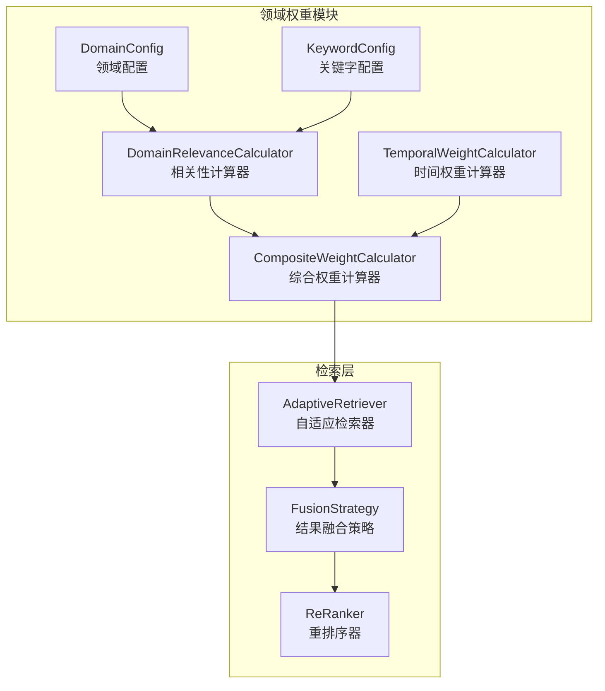
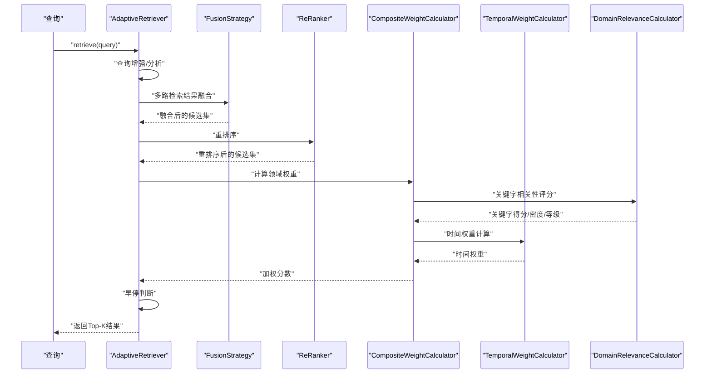
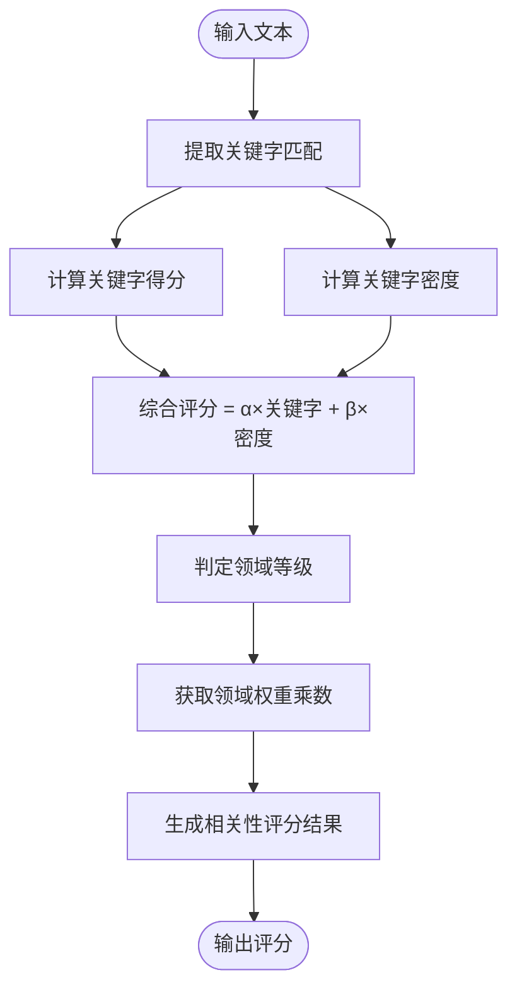
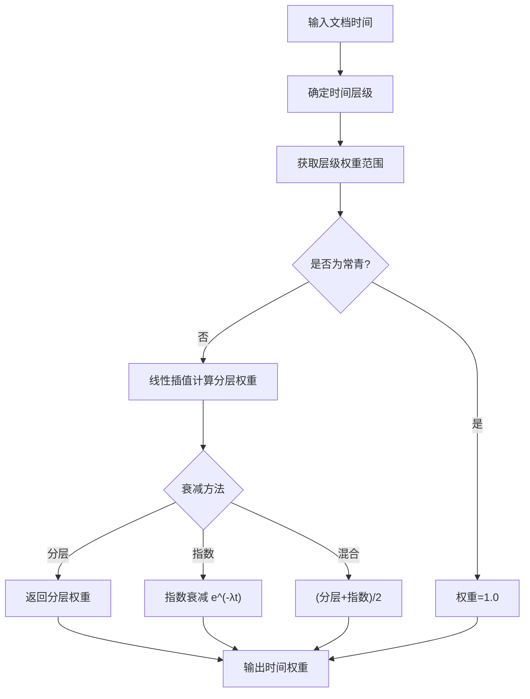
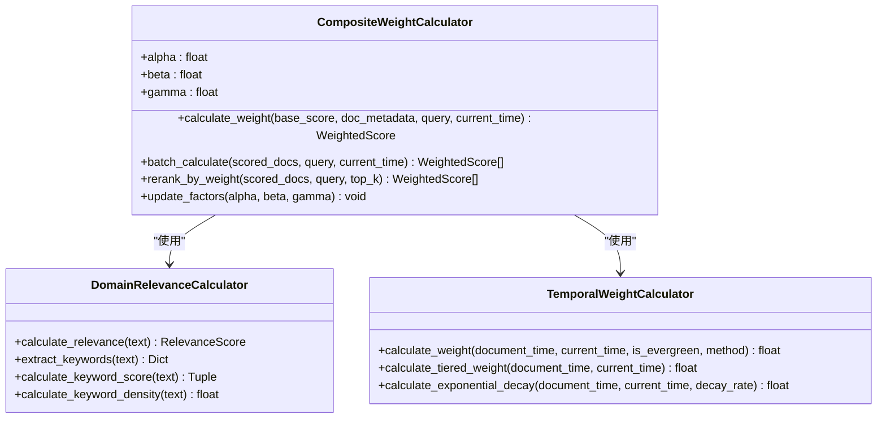
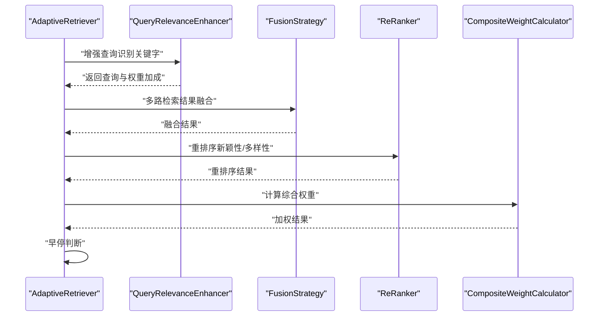
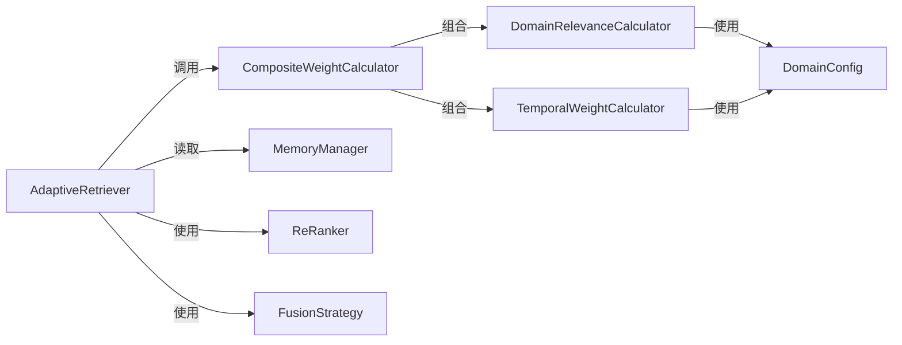

# 领域权重系统

<cite>
**本文引用的文件**
- [src/domain/config.py](file://src/domain/config.py)
- [src/domain/relevance.py](file://src/domain/relevance.py)
- [src/domain/temporal_weight.py](file://src/domain/temporal_weight.py)
- [src/domain/weight_calculator.py](file://src/domain/weight_calculator.py)
- [src/domain/knowledge_base.py](file://src/domain/knowledge_base.py)
- [src/domain/__init__.py](file://src/domain/__init__.py)
- [example/domain_weight_example.py](file://example/domain_weight_example.py)
- [example/knowledge_base_integration.py](file://example/knowledge_base_integration.py)
- [wiki/wiki/领域权重系统.md](file://wiki/wiki/领域权重系统.md)
- [wiki/wiki/配置管理/领域配置.md](file://wiki/wiki/配置管理/领域配置.md)
- [VERSION_README.md](file://VERSION_README.md)
- [RELEASE_NOTES_v3.1.0.md](file://RELEASE_NOTES_v3.1.0.md)
</cite>

## 目录
1. [简介](#简介)
2. [项目结构](#项目结构)
3. [核心组件](#核心组件)
4. [架构总览](#架构总览)
5. [详细组件分析](#详细组件分析)
6. [依赖关系分析](#依赖关系分析)
7. [性能考量](#性能考量)
8. [故障排查指南](#故障排查指南)
9. [结论](#结论)
10. [附录](#附录)

## 简介
本文件系统性阐述 NecoRAG 领域权重系统的设计与实现，覆盖领域相关性计算、时间权重机制、多权重融合算法、配置参数与调优策略、与检索层的集成方式以及监控与评估方法。文档面向不同技术背景读者，既提供高层概览也包含代码级细节与可视化图表，帮助快速理解与落地应用。

领域权重系统通过"关键字相关性 + 时间权重 + 领域权重"三元融合，形成可配置、可扩展、可监控的综合权重计算框架，并与检索层（src/retrieval）无缝衔接，实现"先检索、后加权"的工作流。

## 项目结构
领域权重系统位于 src/domain 目录，围绕"关键字权重 + 时间权重 + 领域权重"三元融合，形成可配置、可扩展、可监控的综合权重计算框架，并与检索层（src/retrieval）无缝衔接，实现"先检索、后加权"的工作流。

**图表来源**
- [src/domain/config.py:54-161](file://src/domain/config.py#L54-L161)
- [src/domain/relevance.py:29-273](file://src/domain/relevance.py#L29-L273)
- [src/domain/temporal_weight.py:47-227](file://src/domain/temporal_weight.py#L47-L227)
- [src/domain/weight_calculator.py:56-223](file://src/domain/weight_calculator.py#L56-L223)
- [src/retrieval/retriever.py:122-372](file://src/retrieval/retriever.py#L122-L372)
- [src/retrieval/fusion.py:9-127](file://src/retrieval/fusion.py#L9-L127)
- [src/retrieval/reranker.py:10-179](file://src/retrieval/reranker.py#L10-L179)

**章节来源**
- [src/domain/config.py:1-285](file://src/domain/config.py#L1-L285)
- [src/domain/relevance.py:1-328](file://src/domain/relevance.py#L1-L328)
- [src/domain/temporal_weight.py:1-271](file://src/domain/temporal_weight.py#L1-L271)
- [src/domain/weight_calculator.py:1-318](file://src/domain/weight_calculator.py#L1-L318)

## 核心组件
- 领域配置与关键字词典：定义领域、关键字、权重等级与因子系数，支撑相关性评分与权重映射。
- 领域相关性计算器：基于关键字匹配与密度计算，输出领域等级与权重乘数。
- 时间权重计算器：提供指数衰减、分层权重与混合方法，支持常青内容与快速变化领域的差异化配置。
- 综合权重计算器：将关键字权重、时间权重、领域权重与自定义权重相乘，得到最终加权分数，并支持批量重排序。
- 检索器集成：在检索流程中插入领域权重计算，结合早停控制与结果融合，提升检索质量与效率。

**章节来源**
- [src/domain/config.py:54-161](file://src/domain/config.py#L54-L161)
- [src/domain/relevance.py:29-273](file://src/domain/relevance.py#L29-L273)
- [src/domain/temporal_weight.py:47-227](file://src/domain/temporal_weight.py#L47-L227)
- [src/domain/weight_calculator.py:56-223](file://src/domain/weight_calculator.py#L56-L223)
- [src/retrieval/retriever.py:122-372](file://src/retrieval/retriever.py#L122-L372)

## 架构总览
领域权重系统与检索层的交互遵循"检索 → 融合 → 重排序 → 领域加权 → 早停"的流水线。检索器在获得候选结果后，先进行融合与重排序，再应用领域权重计算，最后依据置信度阈值决定是否提前终止。

**图表来源**
- [src/retrieval/retriever.py:177-253](file://src/retrieval/retriever.py#L177-L253)
- [src/retrieval/fusion.py:18-70](file://src/retrieval/fusion.py#L18-L70)
- [src/retrieval/reranker.py:41-70](file://src/retrieval/reranker.py#L41-L70)
- [src/domain/weight_calculator.py:81-146](file://src/domain/weight_calculator.py#L81-L146)
- [src/domain/relevance.py:198-241](file://src/domain/relevance.py#L198-L241)
- [src/domain/temporal_weight.py:160-195](file://src/domain/temporal_weight.py#L160-L195)

## 详细组件分析

### 领域相关性计算与数学模型
- 关键字匹配与权重：通过构建关键字与别名的正则模式，统计匹配次数与权重，计算加权平均作为关键字得分，并限制在合理区间。
- 关键字密度：以词数为分母，统计关键字出现总次数，归一化到[0,1]区间，用于衡量文本中关键词的集中程度。
- 综合评分与等级：综合关键字得分与密度，按权重比例合成综合评分；同时映射到领域等级（核心/相关/边缘/领域外），并获取对应权重乘数。
- 置信度：基于匹配关键字数量，设定阈值，用于后续早停与质量评估。

**图表来源**
- [src/domain/relevance.py:95-178](file://src/domain/relevance.py#L95-L178)
- [src/domain/relevance.py:198-241](file://src/domain/relevance.py#L198-L241)

**章节来源**
- [src/domain/relevance.py:95-178](file://src/domain/relevance.py#L95-L178)
- [src/domain/relevance.py:198-241](file://src/domain/relevance.py#L198-L241)

### 时间权重机制与衰减模型
- 时间层级：将文档按发布时间划分为最近、近期、中期、远期、历史等层级，每层赋予权重范围。
- 分层权重：在层级内线性插值，确保时间跨度内的平滑过渡。
- 指数衰减：基于 e^(-λt)，适用于快速变化领域的精细衰减。
- 混合方法：取分层权重与指数衰减的均值，兼顾层级与连续衰减。
- 常青内容：可禁用时间衰减，保持恒定权重。

**图表来源**
- [src/domain/temporal_weight.py:53-195](file://src/domain/temporal_weight.py#L53-L195)

**章节来源**
- [src/domain/temporal_weight.py:47-227](file://src/domain/temporal_weight.py#L47-L227)

### 多权重融合算法设计
- 融合公式：最终加权分数 = 基础分数 × (α × 关键字权重) × (β × 时间权重) × (γ × 领域权重) × 自定义权重。
- 权重因子系数：α、β、γ 分别控制关键字、时间、领域在整体中的影响力，可通过配置动态调整。
- 批量重排序：支持对候选集批量计算并按最终分数降序排列，便于下游展示与消费。
- 可视化说明：生成包含各因子贡献与领域评分解释的字符串，便于调试与可观测性。

**图表来源**
- [src/domain/weight_calculator.py:56-223](file://src/domain/weight_calculator.py#L56-L223)
- [src/domain/relevance.py:29-273](file://src/domain/relevance.py#L29-L273)
- [src/domain/temporal_weight.py:47-227](file://src/domain/temporal_weight.py#L47-L227)

**章节来源**
- [src/domain/weight_calculator.py:56-223](file://src/domain/weight_calculator.py#L56-L223)

### 与检索层的集成方式
- 查询增强：在检索前识别查询中的关键字，计算权重加成，辅助后续检索策略。
- 结果融合：对向量与图谱等多路检索结果进行 RRF 或加权融合，提升召回稳定性。
- 重排序：应用新颖性惩罚与多样性策略，减少冗余与重复。
- 领域加权：对融合后的候选集应用综合权重计算，更新分数并重新排序。
- 早停控制：基于置信度阈值与边际收益，避免无效计算，提升吞吐。

**图表来源**
- [src/retrieval/retriever.py:177-253](file://src/retrieval/retriever.py#L177-L253)
- [src/retrieval/retriever.py:255-305](file://src/retrieval/retriever.py#L255-L305)
- [src/retrieval/fusion.py:18-70](file://src/retrieval/fusion.py#L18-L70)
- [src/retrieval/reranker.py:41-70](file://src/retrieval/reranker.py#L41-L70)
- [src/domain/weight_calculator.py:81-146](file://src/domain/weight_calculator.py#L81-L146)

**章节来源**
- [src/retrieval/retriever.py:122-372](file://src/retrieval/retriever.py#L122-L372)
- [src/retrieval/fusion.py:9-127](file://src/retrieval/fusion.py#L9-L127)
- [src/retrieval/reranker.py:10-179](file://src/retrieval/reranker.py#L10-L179)

### 配置参数与调优指南
- 关键字权重因子（α）：增大可强化关键词相关性，适合事实性问答；过大会导致过度偏向关键词。
- 时间权重因子（β）：控制时间衰减对最终分数的影响，快速变化领域可适度提高。
- 领域权重因子（γ）：强调领域相关性，适合垂直领域检索。
- 衰减系数（λ）：越快变化领域（如新闻）应增大；稳定领域（如法律）应减小。
- 相关性阈值：综合评分阈值用于早停，建议结合业务目标与召回率进行调优。
- 自定义权重：针对特定文档或来源可设置 custom_weight，实现人工干预。

**章节来源**
- [src/domain/config.py:54-161](file://src/domain/config.py#L54-L161)
- [src/domain/weight_calculator.py:76-79](file://src/domain/weight_calculator.py#L76-L79)
- [src/domain/temporal_weight.py:25-44](file://src/domain/temporal_weight.py#L25-L44)

### 示例与使用
- 领域配置：支持创建示例领域与自定义领域，添加关键字、别名与权重等级。
- 时间权重：提供快速变化、正常、缓慢变化与常青领域的预设配置。
- 相关性评分：对文本进行关键字得分、密度与等级判定。
- 综合权重：对候选集进行加权并重排序，支持批量处理与便捷函数。

**章节来源**
- [example/domain_weight_example.py:22-267](file://example/domain_weight_example.py#L22-L267)

## 依赖关系分析
- 模块耦合：领域权重系统与检索层通过接口解耦，仅依赖数据模型与配置对象。
- 外部依赖：检索层依赖向量数据库、图数据库与重排序模型；领域权重系统内部化，不引入外部依赖。
- 可观测性：通过权重明细与解释字符串，便于追踪各因子对最终分数的贡献。

**图表来源**
- [src/domain/weight_calculator.py:59-74](file://src/domain/weight_calculator.py#L59-L74)
- [src/retrieval/retriever.py:129-161](file://src/retrieval/retriever.py#L129-L161)
- [src/memory/models.py:19-31](file://src/memory/models.py#L19-L31)

**章节来源**
- [src/domain/weight_calculator.py:56-223](file://src/domain/weight_calculator.py#L56-L223)
- [src/retrieval/retriever.py:122-372](file://src/retrieval/retriever.py#L122-L372)
- [src/memory/models.py:19-31](file://src/memory/models.py#L19-L31)

## 性能考量
- 关键字索引：在初始化时构建正则模式索引，避免重复编译，提升匹配效率。
- 批量计算：提供批量接口，减少循环开销，适合大规模候选集处理。
- 早停机制：基于置信度阈值与边际收益，显著降低无效计算成本。
- 时间权重缓存：对于相同层级与衰减方法，可复用中间结果（如分层权重范围）。
- 检索前置：将领域权重计算置于重排序之后，减少不必要的加权计算。

## 故障排查指南
- 关键字未命中：检查关键字大小写、别名配置与正则转义；确认文本预处理是否一致。
- 权重异常：核对权重因子与自定义权重是否合理；检查时间层级划分与衰减系数。
- 早停过早：适当降低置信度阈值或提高最小边际收益，平衡召回与效率。
- 结果抖动：检查重排序与融合策略参数，确保稳定性；必要时固定随机种子。
- 配置加载：确认配置文件路径与权限；验证枚举值与数值范围。

**章节来源**
- [src/retrieval/retriever.py:39-120](file://src/retrieval/retriever.py#L39-L120)
- [src/domain/weight_calculator.py:207-223](file://src/domain/weight_calculator.py#L207-L223)

## 结论
领域权重系统通过"关键字相关性 + 时间权重 + 领域权重"的三元融合，实现了对检索结果的精细化排序与质量控制。系统具备良好的可配置性、可扩展性与可观测性，能够适配不同领域的变化节奏与业务需求。结合检索层的早停与融合策略，可在保证质量的同时显著提升性能。

## 附录

### 数学模型与公式
- 综合权重计算
  - final = base_score × (α × keyword_weight) × (β × temporal_weight) × (γ × domain_weight) × custom_weight
  - 关键字权重裁剪：min(2.0, max(0.5, keyword_weight))
- 时间权重
  - 分层权重：按时间层级设定范围并在层级内线性插值
  - 指数衰减：e^(-λ × 天数差)
  - 常青内容：权重恒为 1.0
- 领域权重
  - 基于领域等级映射到配置中的权重阈值

**章节来源**
- [src/domain/weight_calculator.py:89-129](file://src/domain/weight_calculator.py#L89-L129)
- [src/domain/temporal_weight.py:84-109](file://src/domain/temporal_weight.py#L84-L109)
- [src/domain/relevance.py:180-196](file://src/domain/relevance.py#L180-L196)

### 不同领域的权重配置策略与调优建议
- 快速变化领域（如新闻、科技）
  - 建议：启用时间衰减，提高 decay_rate；缩短近期/近期分界，强调最新性
  - 参考：[src/domain/temporal_weight.py:235-243](file://src/domain/temporal_weight.py#L235-L243)
- 正常变化领域（如学术、技术文档）
  - 建议：标准 decay_rate；适度提升 α，平衡相关性与时效性
  - 参考：[src/domain/temporal_weight.py:246-254](file://src/domain/temporal_weight.py#L246-L254)
- 缓慢变化领域（如历史、法律）
  - 建议：降低 decay_rate；延长近期/中期分界，保留历史价值
  - 参考：[src/domain/temporal_weight.py:257-265](file://src/domain/temporal_weight.py#L257-L265)
- 常青领域（如基础科学）
  - 建议：禁用时间衰减（常青），或设置为 1.0；提升领域权重因子 γ
  - 参考：[src/domain/temporal_weight.py:268-270](file://src/domain/temporal_weight.py#L268-L270)
- 关键字权重调优
  - 若希望更重视关键词命中，适当提高 α；若希望更重视领域匹配，提高 γ；若希望更重视时效，提高 β
  - 参考：[src/domain/weight_calculator.py:77-79](file://src/domain/weight_calculator.py#L77-L79)

### 版本信息与新增功能
- 当前版本：v3.3.0-alpha
- 版本发布说明：包含代码统计指令系统、三级用户系统重构、架构文档增强等核心更新
- 领域权重系统在 v3.3.0-alpha 版本中的定位：作为检索层的重要组成部分，提供精细化的权重计算与排序能力

**章节来源**
- [VERSION_README.md:1-91](file://VERSION_README.md#L1-L91)
- [RELEASE_NOTES_v3.1.0.md:1-315](file://RELEASE_NOTES_v3.1.0.md#L1-L315)

### 知识库集成与管理
- 知识库管理：支持关键字导入、FAQ 管理、语料扩充、配置持久化等功能
- 集成方式：通过 DomainConfig 与 KnowledgeBase 的协同，实现领域知识的动态管理与权重计算
- 应用场景：在实际 RAG 系统中，知识库为领域权重系统提供基础的关键字词典与领域配置

**章节来源**
- [src/domain/knowledge_base.py:1-564](file://src/domain/knowledge_base.py#L1-L564)
- [example/knowledge_base_integration.py:1-363](file://example/knowledge_base_integration.py#L1-L363)