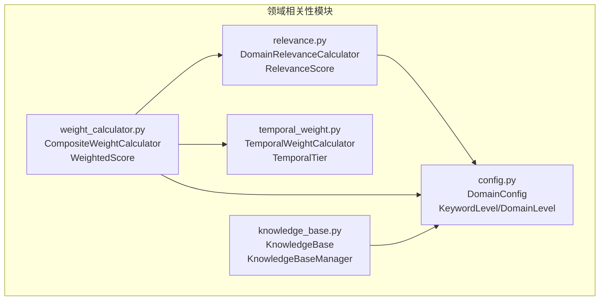
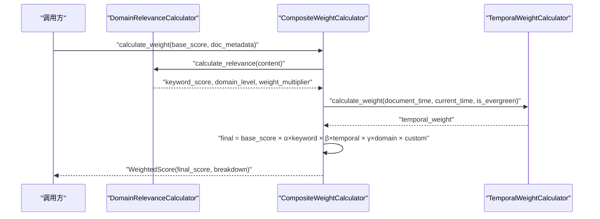
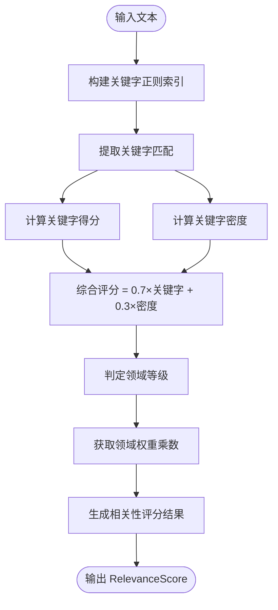
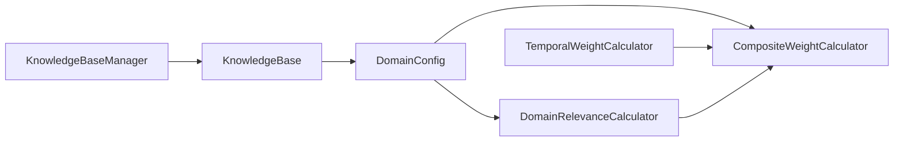

# 领域相关性计算

<cite>
**本文引用的文件**
- [relevance.py](file://src/domain/relevance.py)
- [config.py](file://src/domain/config.py)
- [weight_calculator.py](file://src/domain/weight_calculator.py)
- [temporal_weight.py](file://src/domain/temporal_weight.py)
- [knowledge_base.py](file://src/domain/knowledge_base.py)
- [domain_weight_example.py](file://example/domain_weight_example.py)
- [领域配置.md](file://wiki/wiki/配置管理/领域配置.md)
- [领域权重系统.md](file://wiki/wiki/领域权重系统.md)
</cite>

## 目录
1. [简介](#简介)
2. [项目结构](#项目结构)
3. [核心组件](#核心组件)
4. [架构总览](#架构总览)
5. [详细组件分析](#详细组件分析)
6. [依赖关系分析](#依赖关系分析)
7. [性能与缓存策略](#性能与缓存策略)
8. [故障排查指南](#故障排查指南)
9. [结论](#结论)
10. [附录](#附录)

## 简介
本文件面向“领域相关性计算”模块，围绕 DomainRelevanceCalculator 类的实现机制展开，系统性解释关键字匹配算法、语义相关性评估、RelevanceScore 数据结构、相关性评分与阈值、查询文本匹配策略、相似度计算方法、权重动态调整机制与自定义规则支持，并给出数学公式与算法实现细节，最后提供性能优化与缓存策略建议。读者无需深厚的算法背景即可理解与使用。

## 项目结构
领域相关性计算位于 src/domain 目录下，主要文件如下：
- src/domain/relevance.py：领域相关性评分核心实现，包含 DomainRelevanceCalculator 与 RelevanceScore。
- src/domain/config.py：领域配置、关键字配置、领域等级与权重因子定义。
- src/domain/weight_calculator.py：综合权重计算器，整合关键字、时间与领域权重，支持批量重排序。
- src/domain/temporal_weight.py：时间权重计算模块，支持指数衰减、分层权重与混合方法。
- src/domain/knowledge_base.py：知识库管理，支撑关键字与FAQ的导入、导出与扩展。
- example/domain_weight_example.py：领域权重系统的使用示例，展示配置、评分与重排序流程。
- wiki/wiki/领域权重系统.md、wiki/wiki/配置管理/领域配置.md：官方文档中的架构与流程图，便于对照理解。

图表来源
- [relevance.py:29-273](file://src/domain/relevance.py#L29-L273)
- [config.py:54-160](file://src/domain/config.py#L54-L160)
- [weight_calculator.py:56-205](file://src/domain/weight_calculator.py#L56-L205)
- [temporal_weight.py:47-195](file://src/domain/temporal_weight.py#L47-L195)
- [knowledge_base.py:65-263](file://src/domain/knowledge_base.py#L65-L263)

章节来源
- [relevance.py:1-328](file://src/domain/relevance.py#L1-L328)
- [config.py:1-285](file://src/domain/config.py#L1-L285)
- [weight_calculator.py:1-318](file://src/domain/weight_calculator.py#L1-L318)
- [temporal_weight.py:1-271](file://src/domain/temporal_weight.py#L1-L271)
- [knowledge_base.py:1-564](file://src/domain/knowledge_base.py#L1-L564)

## 核心组件
- DomainRelevanceCalculator：负责从文本中提取关键字、计算关键字得分与密度、判定领域等级、生成综合评分与解释信息。
- RelevanceScore：封装相关性评分结果，包含领域等级、综合评分、权重乘数、关键字匹配详情、关键字得分、密度得分、置信度与解释文本。
- DomainConfig：承载领域配置，包括关键字词典、权重因子、领域权重、时间衰减参数等。
- CompositeWeightCalculator：整合关键字相关性、时间权重与领域权重，计算最终加权分数并支持批量重排序。
- TemporalWeightCalculator：提供指数衰减、分层权重与混合方法的时间权重计算。
- KnowledgeBase/KnowledgeBaseManager：知识库与管理器，支持关键字与FAQ的导入、导出、扩展与持久化。

章节来源
- [relevance.py:16-273](file://src/domain/relevance.py#L16-L273)
- [config.py:54-160](file://src/domain/config.py#L54-L160)
- [weight_calculator.py:56-205](file://src/domain/weight_calculator.py#L56-L205)
- [temporal_weight.py:47-195](file://src/domain/temporal_weight.py#L47-L195)
- [knowledge_base.py:65-263](file://src/domain/knowledge_base.py#L65-L263)

## 架构总览
领域相关性计算的整体流程由“关键字匹配与统计”“密度计算”“等级判定”“权重乘数获取”“综合评分与置信度”组成；在综合权重计算中，DomainRelevanceCalculator 的结果被用于获取关键字权重与领域权重乘数，再与时间权重相乘得到最终加权分数。

图表来源
- [weight_calculator.py:81-146](file://src/domain/weight_calculator.py#L81-L146)
- [relevance.py:198-241](file://src/domain/relevance.py#L198-L241)
- [temporal_weight.py:160-195](file://src/domain/temporal_weight.py#L160-L195)

## 详细组件分析

### DomainRelevanceCalculator 类
- 关键字匹配与索引
  - 构建关键字与别名的正则模式，支持中英文匹配；英文关键字添加单词边界，中文直接匹配。
  - 预构建 keyword_patterns 映射，键为正则模式字符串，值为 (keyword, weight) 元组，便于快速匹配。
- 关键字提取
  - 将输入文本转为小写，遍历所有正则模式进行匹配，统计每个关键字出现次数与权重，合并相同关键字的不同匹配。
- 关键字得分计算
  - 公式：关键字得分 = Σ(keyword_weight[i] × keyword_frequency[i]) / total_keywords，其中 total_keywords 为关键字出现总次数。
  - 得分经裁剪至 [0, 2] 区间，避免极端值影响。
- 关键字密度计算
  - 以英文单词为分词单位，统计关键字出现总次数与总词数，密度 = keyword_occurrences / total_words，再乘以系数归一化到 [0, 1]。
- 领域等级判定
  - 综合得分 = keyword_score × 0.7 + density_score × 0.3，再映射到 DomainLevel（CORE/RELATED/PERIPHERAL/OUT_OF_DOMAIN）。
- 权重乘数获取
  - 根据领域等级返回对应权重乘数（core/related/peripheral/out_of_domain_weight）。
- 综合评分与置信度
  - 综合评分 = min(1.0, (keyword_score × 0.7 + density_score × 0.3) / 1.5)，保证在 [0, 1]。
  - 置信度 = min(1.0, match_count / 5)，匹配关键字数量达到一定阈值后置信度饱和。
- 解释文本生成
  - 输出包含领域等级、匹配关键字数量、关键字得分、密度得分与置信度的自然语言说明。

图表来源
- [relevance.py:42-93](file://src/domain/relevance.py#L42-L93)
- [relevance.py:95-154](file://src/domain/relevance.py#L95-L154)
- [relevance.py:156-196](file://src/domain/relevance.py#L156-L196)
- [relevance.py:198-241](file://src/domain/relevance.py#L198-L241)

章节来源
- [relevance.py:29-273](file://src/domain/relevance.py#L29-L273)

### RelevanceScore 数据结构
- 字段说明
  - domain_level：领域等级枚举（CORE/RELATED/PERIPHERAL/OUT_OF_DOMAIN）
  - score：综合评分 [0, 1]
  - weight_multiplier：领域权重乘数
  - keyword_matches：匹配到的关键字及其权重字典
  - keyword_score：关键字得分
  - density_score：关键字密度得分
  - confidence：置信度 [0, 1]
  - explanation：评分说明文本
- 字段用途
  - 用于对外输出完整评分结果，便于调试与可视化。
  - 供 CompositeWeightCalculator 作为输入的一部分参与最终加权。

章节来源
- [relevance.py:16-27](file://src/domain/relevance.py#L16-L27)

### 关键字匹配算法与查询策略
- 正则模式构建
  - 英文关键字添加单词边界，避免子串误匹配；中文关键字直接匹配。
  - 对关键字与别名分别构建模式，统一映射到同一权重。
- 匹配策略
  - 忽略大小写匹配，统计出现次数，合并相同关键字的不同匹配。
  - 支持批量提取与关键字密度计算，兼顾性能与准确性。
- 相似度计算
  - 关键字得分与密度共同构成综合评分，权重比例为 0.7:0.3。
  - 综合评分进一步归一化到 [0, 1]，避免溢出。

章节来源
- [relevance.py:42-93](file://src/domain/relevance.py#L42-L93)
- [relevance.py:95-154](file://src/domain/relevance.py#L95-L154)

### 领域等级与阈值设置
- 等级阈值
  - 综合得分 ≥ 1.2 → CORE
  - 综合得分 ≥ 0.8 → RELATED
  - 综合得分 ≥ 0.4 → PERIPHERAL
  - 否则 → OUT_OF_DOMAIN
- 权重乘数
  - 核心领域：core_domain_weight
  - 相关领域：related_domain_weight
  - 边缘领域：peripheral_domain_weight
  - 领域外：out_of_domain_weight
- 配置来源
  - DomainConfig 提供上述阈值与权重的可配置项，支持在运行时调整。

章节来源
- [relevance.py:156-196](file://src/domain/relevance.py#L156-L196)
- [config.py:54-76](file://src/domain/config.py#L54-L76)

### 权重动态调整与自定义规则
- 关键字权重
  - KeywordConfig.level 与 KeywordConfig.weight 控制关键字权重范围与数值，自动修正到等级允许区间。
- 领域权重
  - DomainConfig 提供 core/related/peripheral/out_of_domain_weight，用于不同等级的权重乘数。
- 时间权重
  - TemporalWeightCalculator 支持指数衰减、分层权重与混合方法，可按领域类型选择合适策略。
- 综合权重因子
  - CompositeWeightCalculator 使用 α、β、γ 三个因子分别调节关键字、时间与领域权重对最终分数的影响。
- 自定义规则
  - 可通过 DomainConfigManager 动态加载/保存领域配置，实现跨进程/跨会话的规则共享。
  - KnowledgeBase 支持从文件导入关键字与FAQ，实现知识的持续扩展。

章节来源
- [config.py:30-51](file://src/domain/config.py#L30-L51)
- [config.py:54-160](file://src/domain/config.py#L54-L160)
- [temporal_weight.py:47-195](file://src/domain/temporal_weight.py#L47-L195)
- [weight_calculator.py:56-205](file://src/domain/weight_calculator.py#L56-L205)
- [knowledge_base.py:266-518](file://src/domain/knowledge_base.py#L266-L518)

### 数学公式与算法实现要点
- 关键字得分
  - 公式：score = Σ(weight_i × count_i) / total_count，其中 total_count = Σ(count_i)
  - 裁剪：min(2.0, max(0.0, score))
- 关键字密度
  - 公式：density = min(1.0, (keyword_occurrences / total_words) × 5)
- 综合评分
  - 公式：combined = min(1.0, (0.7 × keyword_score + 0.3 × density_score) / 1.5)
- 置信度
  - 公式：confidence = min(1.0, match_count / 5)
- 领域等级
  - combined_score = 0.7 × keyword_score + 0.3 × density_score
  - 依据阈值映射到 DomainLevel
- 时间权重
  - 指数衰减：weight = exp(-λ × days_diff)
  - 分层权重：按时间层级线性插值
  - 混合方法：(tiered + exponential) / 2
- 综合权重
  - final = base_score × (α × keyword_weight) × (β × temporal_weight) × (γ × domain_weight) × custom_weight
  - 关键字权重裁剪：[0.5, 2.0]，避免极端影响

章节来源
- [relevance.py:95-154](file://src/domain/relevance.py#L95-L154)
- [relevance.py:198-241](file://src/domain/relevance.py#L198-L241)
- [temporal_weight.py:84-195](file://src/domain/temporal_weight.py#L84-L195)
- [weight_calculator.py:81-146](file://src/domain/weight_calculator.py#L81-L146)

### 查询相关性增强
- QueryRelevanceEnhancer
  - 从查询中提取关键字，计算权重加成（基于匹配权重总和），并可扩展为同义词集合。
  - 适用于检索前的查询增强，提升召回质量。

章节来源
- [relevance.py:276-328](file://src/domain/relevance.py#L276-L328)

## 依赖关系分析
- DomainRelevanceCalculator 依赖 DomainConfig 提供关键字词典与领域权重阈值。
- CompositeWeightCalculator 依赖 DomainRelevanceCalculator（关键字相关性）、TemporalWeightCalculator（时间权重）与 DomainConfig（权重因子）。
- KnowledgeBase/KnowledgeBaseManager 依赖 DomainConfig 与 DomainConfigManager，用于知识导入与持久化。
- 示例与文档提供了端到端的使用流程与性能建议。

图表来源
- [config.py:54-160](file://src/domain/config.py#L54-L160)
- [relevance.py:29-40](file://src/domain/relevance.py#L29-L40)
- [weight_calculator.py:56-80](file://src/domain/weight_calculator.py#L56-L80)
- [temporal_weight.py:47-51](file://src/domain/temporal_weight.py#L47-L51)
- [knowledge_base.py:15-20](file://src/domain/knowledge_base.py#L15-L20)

章节来源
- [config.py:54-160](file://src/domain/config.py#L54-L160)
- [relevance.py:29-40](file://src/domain/relevance.py#L29-L40)
- [weight_calculator.py:56-80](file://src/domain/weight_calculator.py#L56-L80)
- [temporal_weight.py:47-51](file://src/domain/temporal_weight.py#L47-L51)
- [knowledge_base.py:15-20](file://src/domain/knowledge_base.py#L15-L20)

## 性能与缓存策略
- 关键字匹配与正则查找
  - 预构建正则模式与映射，避免每次匹配重复编译；建议控制关键字数量与别名数量，降低正则匹配开销。
- 时间权重计算
  - 指数衰减与分层权重均为 O(1)；混合方法为两者均值，开销极小。
- 批量重排序
  - CompositeWeightCalculator 的 batch_calculate 与 rerank_by_weight 为线性复杂度，适合大规模候选集重排序。
- 内存占用
  - DomainConfigManager 支持配置持久化与加载，避免重复构建配置对象。
- 缓存建议
  - 对频繁使用的 DomainConfig 可在进程内缓存，减少磁盘 IO。
  - 对高频查询的正则模式可复用，避免重复构建。
  - 对历史文档的时间权重可缓存，减少重复计算。

章节来源
- [领域配置.md:193-198](file://wiki/wiki/配置管理/领域配置.md#L193-L198)
- [领域权重系统.md:126-153](file://wiki/wiki/领域权重系统.md#L126-L153)

## 故障排查指南
- 关键字权重异常
  - 现象：关键字权重不在合法区间
  - 处理：DomainConfig 对权重有自动修正逻辑，确保在等级对应的范围内
  - 参考：[config.py:39-50](file://src/domain/config.py#L39-L50)
- 时间权重恒为 1.0
  - 现象：无论文档多久都无衰减
  - 处理：检查 enable_temporal_decay 是否开启，以及文档是否标记为常青 is_evergreen
  - 参考：[temporal_weight.py:176-180](file://src/domain/temporal_weight.py#L176-L180)
- 领域权重乘数未生效
  - 现象：领域等级划分导致权重乘数不符合预期
  - 处理：调整 core/related/peripheral/out_of_domain_weight 阈值，或优化关键字权重与密度得分
  - 参考：[relevance.py:180-196](file://src/domain/relevance.py#L180-L196)
- 综合权重过低或过高
  - 现象：最终分数异常
  - 处理：检查 α、β、γ 三因子与 custom_weight，确认基础分数与裁剪范围
  - 参考：[weight_calculator.py:109-129](file://src/domain/weight_calculator.py#L109-L129)

章节来源
- [领域配置.md:199-215](file://wiki/wiki/配置管理/领域配置.md#L199-L215)

## 结论
DomainRelevanceCalculator 通过“关键字匹配+密度评估”的双因子综合评分，结合领域等级与权重乘数，实现了可配置、可扩展且易于理解的相关性评估。配合 CompositeWeightCalculator，可将关键字相关性、时间权重与领域权重有机融合，形成最终的重排序分数。通过合理的阈值与权重因子设置、正则索引优化与缓存策略，可在保证精度的同时满足大规模检索场景的性能需求。

## 附录
- 使用示例参考：example/domain_weight_example.py，涵盖领域配置、时间权重、相关性评分与综合权重计算的完整流程。
- 官方文档：领域权重系统.md、配置管理/领域配置.md，提供更直观的流程图与最佳实践建议。

章节来源
- [domain_weight_example.py:1-267](file://example/domain_weight_example.py#L1-L267)
- [领域权重系统.md:126-153](file://wiki/wiki/领域权重系统.md#L126-L153)
- [领域配置.md:87-100](file://wiki/wiki/配置管理/领域配置.md#L87-L100)