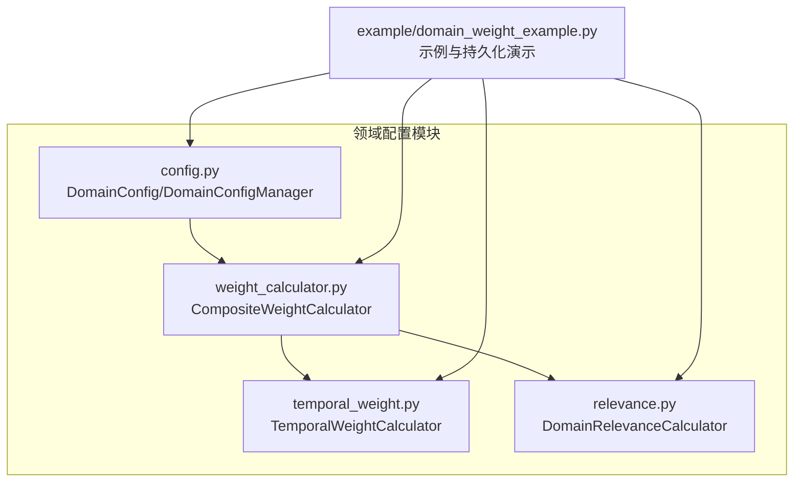
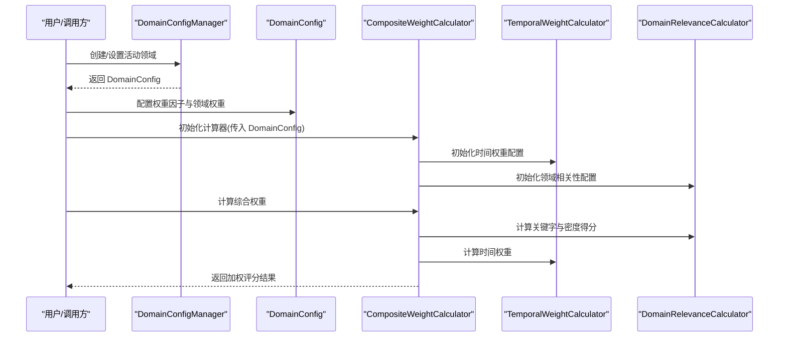
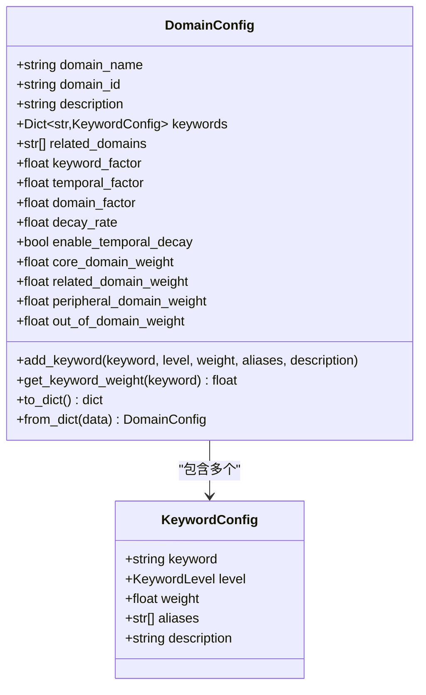
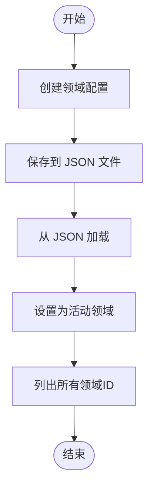
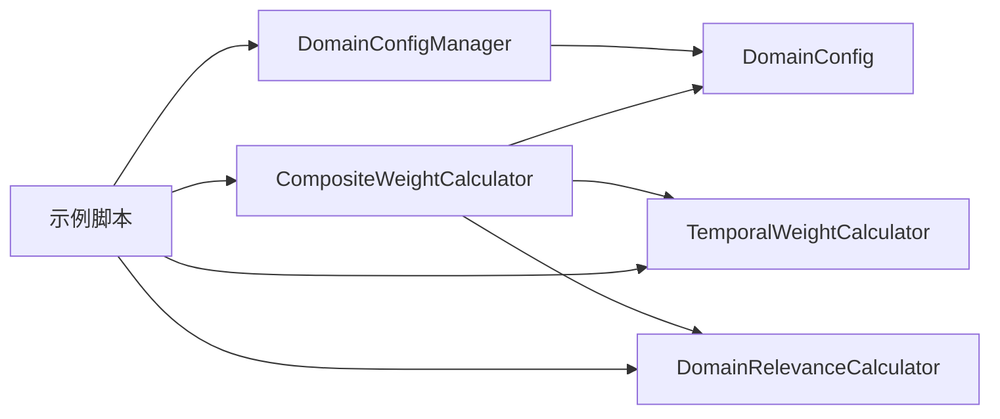

# 领域配置管理

<cite>
**本文引用的文件**
- [src/domain/config.py](file://src/domain/config.py)
- [src/domain/weight_calculator.py](file://src/domain/weight_calculator.py)
- [src/domain/temporal_weight.py](file://src/domain/temporal_weight.py)
- [src/domain/relevance.py](file://src/domain/relevance.py)
- [src/domain/__init__.py](file://src/domain/__init__.py)
- [example/domain_weight_example.py](file://example/domain_weight_example.py)
- [src/dashboard/config_manager.py](file://src/dashboard/config_manager.py)
- [src/monitoring/metrics.py](file://src/monitoring/metrics.py)
</cite>

## 目录
1. [简介](#简介)
2. [项目结构](#项目结构)
3. [核心组件](#核心组件)
4. [架构总览](#架构总览)
5. [详细组件分析](#详细组件分析)
6. [依赖分析](#依赖分析)
7. [性能考量](#性能考量)
8. [故障排查指南](#故障排查指南)
9. [结论](#结论)
10. [附录](#附录)

## 简介
本技术文档聚焦于领域配置管理模块，围绕 DomainConfig 类与 DomainConfigManager 类展开，系统阐述以下主题：
- DomainConfig 的数据结构与配置参数：权重因子（alpha、beta、gamma）、衰减率与启用开关、领域权重映射。
- DomainConfigManager 的配置管理机制：配置加载、保存、批量加载与活动域设置。
- 权重因子的配置方法与调优策略：alpha、beta、gamma 的作用与设置建议。
- 领域配置的持久化存储与版本管理：JSON 文件格式、目录组织与加载流程。
- 配置验证、默认值与错误处理策略：自动修正、范围约束与异常处理。
- 配置模板与最佳实践：示例与调优建议。
- 配置变更对系统性能的影响与监控方法：指标采集与性能分析。

## 项目结构
领域配置管理模块位于 src/domain 目录，主要文件如下：
- config.py：定义领域配置数据结构、关键字等级与领域等级、配置管理器。
- weight_calculator.py：综合权重计算器，整合关键字、时间与领域权重。
- temporal_weight.py：时间权重计算与衰减配置。
- relevance.py：领域相关性评分与关键字匹配。
- __init__.py：模块导出入口。
- example/domain_weight_example.py：领域权重系统使用示例，包含配置持久化演示。
- src/dashboard/config_manager.py：仪表板配置管理器（通用配置管理，与领域配置互补）。
- src/monitoring/metrics.py：系统与应用指标采集，可用于监控配置变更对性能的影响。

**图表来源**
- [src/domain/config.py:1-285](file://src/domain/config.py#L1-L285)
- [src/domain/weight_calculator.py:1-318](file://src/domain/weight_calculator.py#L1-L318)
- [src/domain/temporal_weight.py:1-271](file://src/domain/temporal_weight.py#L1-L271)
- [src/domain/relevance.py:1-328](file://src/domain/relevance.py#L1-L328)
- [example/domain_weight_example.py:1-267](file://example/domain_weight_example.py#L1-L267)

**章节来源**
- [src/domain/config.py:1-285](file://src/domain/config.py#L1-L285)
- [src/domain/__init__.py:1-82](file://src/domain/__init__.py#L1-L82)

## 核心组件
- DomainConfig：封装领域配置，包含关键字集合、权重因子、时间衰减参数与领域权重映射，并提供序列化/反序列化能力。
- DomainConfigManager：负责领域配置的创建、保存、加载、批量加载与活动域设置。
- CompositeWeightCalculator：综合权重计算器，整合关键字、时间与领域权重，支持因子动态更新。
- TemporalWeightCalculator：时间权重计算器，支持指数衰减、分层权重与混合方法。
- DomainRelevanceCalculator：领域相关性评分器，基于关键字匹配与密度计算领域等级与权重乘数。

**章节来源**
- [src/domain/config.py:54-160](file://src/domain/config.py#L54-L160)
- [src/domain/config.py:163-240](file://src/domain/config.py#L163-L240)
- [src/domain/weight_calculator.py:56-223](file://src/domain/weight_calculator.py#L56-L223)
- [src/domain/temporal_weight.py:47-195](file://src/domain/temporal_weight.py#L47-L195)
- [src/domain/relevance.py:29-241](file://src/domain/relevance.py#L29-L241)

## 架构总览
领域配置管理的整体架构由“配置定义—配置管理—权重计算—时间与相关性—示例与持久化”构成，形成闭环的数据流与控制流。

**图表来源**
- [src/domain/config.py:163-240](file://src/domain/config.py#L163-L240)
- [src/domain/weight_calculator.py:56-223](file://src/domain/weight_calculator.py#L56-L223)
- [src/domain/temporal_weight.py:47-195](file://src/domain/temporal_weight.py#L47-L195)
- [src/domain/relevance.py:29-241](file://src/domain/relevance.py#L29-L241)

## 详细组件分析

### DomainConfig 数据结构与配置参数
- 字段与含义
  - domain_name、domain_id、description：领域标识与描述。
  - keywords：关键字字典，键为小写关键字名，值为 KeywordConfig。
  - related_domains：相关领域ID列表。
  - 权重因子：keyword_factor（alpha）、temporal_factor（beta）、domain_factor（gamma）。
  - 时间衰减：decay_rate（lambda）、enable_temporal_decay。
  - 领域权重映射：core_domain_weight、related_domain_weight、peripheral_domain_weight、out_of_domain_weight。
- 关键字配置
  - KeywordConfig：包含 keyword、level、weight、aliases、description。
  - 权重范围自动修正：根据 KeywordLevel 的范围约束，超出范围会自动裁剪至合法区间。
- 序列化与反序列化
  - to_dict：输出领域配置的完整字典，包含关键字、权重因子、衰减参数与领域权重映射。
  - from_dict：从字典重建 DomainConfig，并加载关键字与等级映射。

**图表来源**
- [src/domain/config.py:30-160](file://src/domain/config.py#L30-L160)

**章节来源**
- [src/domain/config.py:30-160](file://src/domain/config.py#L30-L160)

### DomainConfigManager 配置管理机制
- 职责
  - 创建领域：create_domain。
  - 获取与设置活动领域：get_domain、set_active_domain、get_active_domain。
  - 持久化：save_domain（写入 JSON）、load_domain（从 JSON 读取）、load_all_domains（批量加载）、list_domains（列出所有领域ID）。
- 存储位置
  - 默认配置目录为模块内 configs 子目录，若传入 config_dir 则使用该目录。
- 错误处理
  - 保存不存在的领域返回 False。
  - 加载不存在的文件返回 None。
  - 批量加载时遍历目录，过滤 .json 文件并逐个加载。

**图表来源**
- [src/domain/config.py:163-240](file://src/domain/config.py#L163-L240)

**章节来源**
- [src/domain/config.py:163-240](file://src/domain/config.py#L163-L240)

### 权重因子配置方法与调优策略
- 权重因子
  - alpha（keyword_factor）：增强或抑制关键字权重对最终评分的影响。
  - beta（temporal_factor）：增强或抑制时间权重对最终评分的影响。
  - gamma（domain_factor）：增强或抑制领域权重对最终评分的影响。
- 调优策略
  - 高关键字敏感度：提高 alpha，使关键词匹配更显著地影响排序。
  - 强调时效性：提高 beta，使近期内容权重更高；或降低 decay_rate 以减缓衰减。
  - 强调领域一致性：提高 gamma，使来自目标领域的文档权重更高。
- 实践建议
  - 从默认值（alpha=1.0、beta=1.0、gamma=1.0）出发，逐步调整单一因子观察效果。
  - 结合领域特性：快速变化领域（新闻）可提高 beta 或使用更快衰减；稳定领域（法律）可降低 beta。
  - 与领域权重映射协同：core/related/peripheral/out-of-domain 的权重映射会影响最终乘数。

**章节来源**
- [src/domain/weight_calculator.py:76-80](file://src/domain/weight_calculator.py#L76-L80)
- [src/domain/weight_calculator.py:207-223](file://src/domain/weight_calculator.py#L207-L223)
- [src/domain/temporal_weight.py:231-271](file://src/domain/temporal_weight.py#L231-L271)
- [src/domain/relevance.py:180-196](file://src/domain/relevance.py#L180-L196)

### 领域配置的持久化存储与版本管理
- 持久化
  - 保存：DomainConfigManager.save_domain 将配置转为字典并写入 JSON 文件（文件名为 domain_id.json）。
  - 加载：load_domain 从 JSON 读取并重建 DomainConfig；load_all_domains 遍历目录批量加载。
- 版本管理
  - 本模块未内置版本号字段；建议在外部通过文件命名或目录结构实现版本区分（例如按领域+版本号命名文件）。
  - 示例演示展示了临时目录下的保存与加载流程，便于理解持久化机制。
- 最佳实践
  - 统一目录管理，避免混杂非 JSON 文件。
  - 保存前进行参数校验与范围裁剪（DomainConfig 已在 __post_init__ 中自动修正）。
  - 建议在生产环境增加备份与原子写入策略，防止部分写入导致损坏。

**章节来源**
- [src/domain/config.py:202-240](file://src/domain/config.py#L202-L240)
- [example/domain_weight_example.py:204-242](file://example/domain_weight_example.py#L204-L242)

### 配置验证、默认值与错误处理
- 配置验证
  - 关键字权重范围自动修正：根据 KeywordLevel 的范围约束，超出范围会自动裁剪至合法区间。
  - 综合权重裁剪：关键字权重在计算过程中被限制在 [0.5, 2.0]，确保不会产生极端放大或抑制。
- 默认值
  - DomainConfig 默认权重因子均为 1.0，时间衰减启用且衰减系数为 0.001。
  - 领域权重映射提供合理默认值（核心、相关、边缘、领域外）。
- 错误处理
  - 保存/加载失败返回布尔值或 None，调用方可据此判断并采取措施。
  - 批量加载时忽略无效文件，继续处理其他文件。

**章节来源**
- [src/domain/config.py:39-51](file://src/domain/config.py#L39-L51)
- [src/domain/weight_calculator.py:108-109](file://src/domain/weight_calculator.py#L108-L109)
- [src/domain/config.py:202-240](file://src/domain/config.py#L202-L240)

### 配置模板与最佳实践
- 配置模板
  - 使用 create_example_domain 快速创建示例领域（AI/ML），包含核心、重要与普通关键字。
  - 使用 DomainConfigManager.create_domain 创建自定义领域，随后添加关键字与权重因子。
- 最佳实践
  - 关键字设计：核心关键字权重较高，别名与同义词统一索引，提升匹配覆盖率。
  - 权重因子：先固定两个因子为 1.0，只调整一个因子观察效果，再逐步微调。
  - 时间衰减：根据领域变化速率选择合适的 decay_rate 或使用预设（fast_changing、normal、slow_changing、evergreen）。
  - 领域权重映射：根据业务需求调整 core/related/peripheral/out-of-domain 权重，平衡召回与精度。

**章节来源**
- [src/domain/config.py:243-284](file://src/domain/config.py#L243-L284)
- [example/domain_weight_example.py:22-73](file://example/domain_weight_example.py#L22-L73)
- [src/domain/temporal_weight.py:231-271](file://src/domain/temporal_weight.py#L231-L271)

### 配置变更对系统性能的影响与监控
- 性能影响
  - 权重因子调整会改变排序分布，可能影响检索吞吐与响应时间。
  - 时间衰减参数影响时间权重计算复杂度与结果稳定性。
  - 关键字匹配与密度计算的复杂度与关键字数量、文本长度相关。
- 监控方法
  - 使用 SystemMetrics/ApplicationMetrics 记录系统指标与应用指标，如响应时间、缓存命中率、模型推理时间等。
  - 通过仪表板配置管理器（通用配置管理）进行 Profile 切换与参数验证，辅助定位配置变更带来的性能波动。
  - 建议在 CI/CD 中启用严格配置验证，生产环境根据需要选择性启用验证。

**章节来源**
- [src/monitoring/metrics.py:16-207](file://src/monitoring/metrics.py#L16-L207)
- [src/dashboard/config_manager.py:14-315](file://src/dashboard/config_manager.py#L14-L315)

## 依赖分析
领域配置管理模块内部依赖清晰，职责分离明确：
- DomainConfigManager 依赖 DomainConfig 的序列化/反序列化能力。
- CompositeWeightCalculator 依赖 DomainConfig、TemporalWeightCalculator 与 DomainRelevanceCalculator。
- TemporalWeightCalculator 与 DomainRelevanceCalculator 独立运作，分别负责时间权重与领域相关性。
- 示例文件 domain_weight_example.py 展示了上述组件的组合使用与持久化流程。

**图表来源**
- [src/domain/config.py:163-240](file://src/domain/config.py#L163-L240)
- [src/domain/weight_calculator.py:56-223](file://src/domain/weight_calculator.py#L56-L223)
- [src/domain/temporal_weight.py:47-195](file://src/domain/temporal_weight.py#L47-L195)
- [src/domain/relevance.py:29-241](file://src/domain/relevance.py#L29-L241)
- [example/domain_weight_example.py:1-267](file://example/domain_weight_example.py#L1-L267)

**章节来源**
- [src/domain/__init__.py:7-81](file://src/domain/__init__.py#L7-L81)

## 性能考量
- 关键字匹配复杂度：与关键字数量与文本长度相关，建议控制关键字数量与别名规模。
- 时间权重计算：指数衰减与分层权重计算开销较小，但批量计算时需注意时间戳一致性。
- 综合权重计算：包含三次乘法与一次裁剪，整体开销可控。
- 持久化：JSON 读写为轻量操作，建议在应用启动时一次性加载，避免频繁 IO。
- 监控：通过指标采集器记录关键指标，结合仪表板进行可视化分析。

[本节为一般性指导，无需特定文件来源]

## 故障排查指南
- 配置保存失败
  - 检查配置目录权限与磁盘空间。
  - 确认 DomainConfigManager 的 config_dir 设置正确。
- 配置加载失败
  - 检查 JSON 文件格式与完整性。
  - 确认文件名与 domain_id 一致。
- 权重因子无效
  - 确认 alpha/beta/gamma 设置在合理范围内，避免过小或过大导致排序异常。
  - 使用 CompositeWeightCalculator.update_factors 动态更新因子进行验证。
- 时间权重异常
  - 检查 decay_rate 与 enable_temporal_decay 设置。
  - 使用 TemporalWeightCalculator 的预设配置进行对比验证。
- 相关性评分异常
  - 检查关键字权重与别名索引是否正确。
  - 确认领域权重映射与 DomainLevel 的对应关系。

**章节来源**
- [src/domain/config.py:202-240](file://src/domain/config.py#L202-L240)
- [src/domain/weight_calculator.py:207-223](file://src/domain/weight_calculator.py#L207-L223)
- [src/domain/temporal_weight.py:231-271](file://src/domain/temporal_weight.py#L231-L271)
- [src/domain/relevance.py:180-196](file://src/domain/relevance.py#L180-L196)

## 结论
领域配置管理模块通过清晰的数据结构与职责划分，提供了完整的领域配置定义、管理与权重计算能力。DomainConfig 提供了灵活的权重因子与领域权重映射，DomainConfigManager 支持配置的持久化与批量加载，CompositeWeightCalculator 将关键字、时间与领域权重整合为最终排序依据。结合示例与监控工具，可以高效地进行配置调优与性能观测，满足不同领域的检索与排序需求。

[本节为总结性内容，无需特定文件来源]

## 附录

### 配置参数速查表
- DomainConfig 关键字段
  - 权重因子：keyword_factor（alpha）、temporal_factor（beta）、domain_factor（gamma）
  - 时间衰减：decay_rate（lambda）、enable_temporal_decay
  - 领域权重映射：core_domain_weight、related_domain_weight、peripheral_domain_weight、out_of_domain_weight
- 关键字等级与权重范围
  - CORE：1.5–2.0
  - IMPORTANT：1.2–1.5
  - NORMAL：0.9–1.1
  - PERIPHERAL：0.5–0.8

**章节来源**
- [src/domain/config.py:14-28](file://src/domain/config.py#L14-L28)
- [src/domain/config.py:39-51](file://src/domain/config.py#L39-L51)